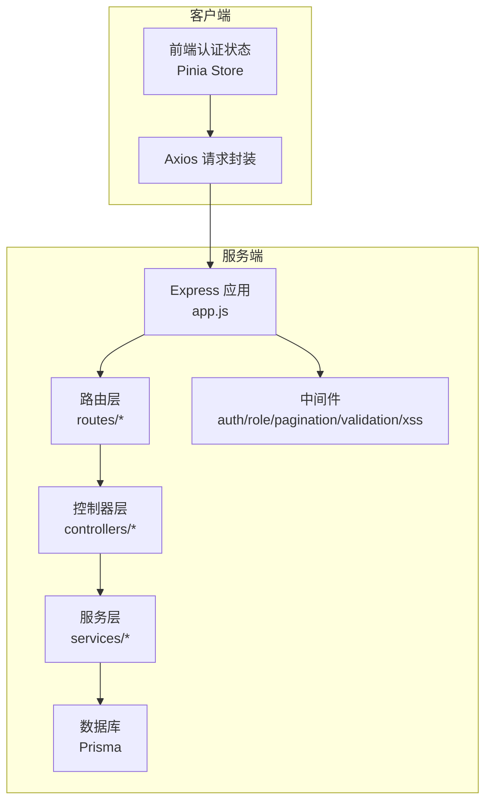
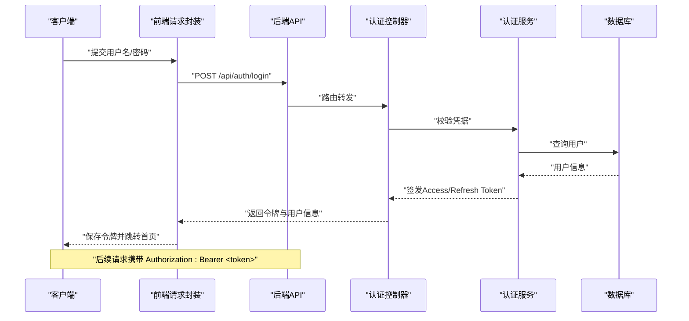
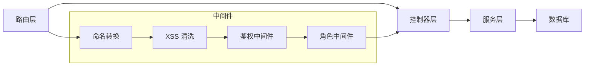

# API接口文档

<cite>
**本文引用的文件**
- [server/src/app.js](file://server/src/app.js)
- [server/src/server.js](file://server/src/server.js)
- [server/src/config/auth.config.js](file://server/src/config/auth.config.js)
- [server/src/routes/auth.routes.js](file://server/src/routes/auth.routes.js)
- [server/src/controllers/auth.controller.js](file://server/src/controllers/auth.controller.js)
- [server/src/services/auth.service.js](file://server/src/services/auth.service.js)
- [server/src/middleware/auth.middleware.js](file://server/src/middleware/auth.middleware.js)
- [server/src/middleware/role.middleware.js](file://server/src/middleware/role.middleware.js)
- [server/src/utils/response.js](file://server/src/utils/response.js)
- [server/src/utils/error.js](file://server/src/utils/error.js)
- [client/src/utils/request.js](file://client/src/utils/request.js)
- [client/src/stores/auth.js](file://client/src/stores/auth.js)
- [server/src/routes/user.routes.js](file://server/src/routes/user.routes.js)
- [server/src/controllers/user.controller.js](file://server/src/controllers/user.controller.js)
- [server/src/routes/major.routes.js](file://server/src/routes/major.routes.js)
- [server/src/controllers/major.controller.js](file://server/src/controllers/major.controller.js)
- [server/src/routes/course.routes.js](file://server/src/routes/course.routes.js)
- [server/src/controllers/course.controller.js](file://server/src/controllers/course.controller.js)
- [server/src/routes/textbook.routes.js](file://server/src/routes/textbook.routes.js)
- [server/src/controllers/textbook.controller.js](file://server/src/controllers/textbook.controller.js)
- [server/src/routes/class.routes.js](file://server/src/routes/class.routes.js)
- [server/src/controllers/class.controller.js](file://server/src/controllers/class.controller.js)
- [server/src/routes/plan.routes.js](file://server/src/routes/plan.routes.js)
- [server/src/controllers/plan.controller.js](file://server/src/controllers/plan.controller.js)
- [server/src/routes/teacher.routes.js](file://server/src/routes/teacher.routes.js)
- [server/src/controllers/teacher.controller.js](file://server/src/controllers/teacher.controller.js)
- [server/src/routes/teaching-arrange.routes.js](file://server/src/routes/teaching-arrange.routes.js)
- [server/src/controllers/teaching-arrange.controller.js](file://server/src/controllers/teaching-arrange.controller.js)
- [server/src/routes/audit.routes.js](file://server/src/routes/audit.routes.js)
- [server/src/controllers/audit.controller.js](file://server/src/controllers/audit.controller.js)
- [server/src/routes/dashboard.routes.js](file://server/src/routes/dashboard.routes.js)
- [server/src/controllers/dashboard.controller.js](file://server/src/controllers/dashboard.controller.js)
- [server/src/routes/settings.routes.js](file://server/src/routes/settings.routes.js)
- [server/src/controllers/settings.controller.js](file://server/src/controllers/settings.controller.js)
- [server/src/routes/export.routes.js](file://server/src/routes/export.routes.js)
- [server/src/controllers/export/data-export.controller.js](file://server/src/controllers/export/data-export.controller.js)
- [server/src/controllers/export/export-template.controller.js](file://server/src/controllers/export/export-template.controller.js)
- [server/src/routes/import.routes.js](file://server/src/routes/import.routes.js)
- [server/src/controllers/import/classes.js](file://server/src/controllers/import/classes.js)
- [server/src/controllers/import/courses.js](file://server/src/controllers/import/courses.js)
- [server/src/controllers/import/teachers.js](file://server/src/controllers/import/teachers.js)
- [server/src/controllers/import/textbooks.js](file://server/src/controllers/import/textbooks.js)
- [server/src/routes/query.routes.js](file://server/src/routes/query.routes.js)
- [server/src/controllers/query.controller.js](file://server/src/controllers/query.controller.js)
</cite>

## 目录
1. [简介](#简介)
2. [项目结构](#项目结构)
3. [核心组件](#核心组件)
4. [架构总览](#架构总览)
5. [详细组件分析](#详细组件分析)
6. [依赖关系分析](#依赖关系分析)
7. [性能考虑](#性能考虑)
8. [故障排查指南](#故障排查指南)
9. [结论](#结论)
10. [附录](#附录)

## 简介
本文件为 KEC 课程管理平台的完整 API 接口文档，覆盖认证、基础数据、教学管理、系统管理、审计与导出导入、查询统计等模块。文档提供各端点的 HTTP 方法、URL 模式、请求参数、响应格式、错误码说明，并给出基于 Postman 的集合与 curl 示例，帮助开发者快速集成。

## 项目结构
后端采用 Express 应用，统一在 app.js 中注册路由与中间件；前端使用 Axios 封装请求，Pinia 管理认证状态。认证采用 JWT 令牌，支持 Access Token 与 Refresh Token 刷新流程；系统具备健康检查、CORS 白名单、XSS 清洗、命名转换等安全与工程化特性。

图表来源
- [server/src/app.js:1-158](file://server/src/app.js#L1-L158)
- [client/src/utils/request.js:1-145](file://client/src/utils/request.js#L1-L145)
- [client/src/stores/auth.js:1-222](file://client/src/stores/auth.js#L1-L222)

章节来源
- [server/src/app.js:1-158](file://server/src/app.js#L1-L158)
- [server/src/server.js:1-66](file://server/src/server.js#L1-L66)
- [client/src/utils/request.js:1-145](file://client/src/utils/request.js#L1-L145)
- [client/src/stores/auth.js:1-222](file://client/src/stores/auth.js#L1-L222)

## 核心组件
- 认证与授权
  - JWT 密钥配置与派生、Access/Refresh/Download Token 过期策略
  - 登录、登出、刷新、修改密码、获取当前用户信息
  - 角色中间件支持 admin 与 super_admin 权限分级
- 请求与响应
  - 统一响应包装与错误处理
  - 请求/响应命名转换（camelCase ↔ snake_case）
  - XSS 清洗与查询参数过滤
- 分页与排序
  - 通用分页参数与排序规则（见“通用规范”）

章节来源
- [server/src/config/auth.config.js:1-58](file://server/src/config/auth.config.js#L1-L58)
- [server/src/middleware/auth.middleware.js](file://server/src/middleware/auth.middleware.js)
- [server/src/middleware/role.middleware.js](file://server/src/middleware/role.middleware.js)
- [server/src/utils/response.js](file://server/src/utils/response.js)
- [server/src/utils/error.js](file://server/src/utils/error.js)

## 架构总览
下图展示认证与主要业务模块的交互流程，以及前后端如何协作完成登录、鉴权、刷新与业务请求。

图表来源
- [server/src/routes/auth.routes.js](file://server/src/routes/auth.routes.js)
- [server/src/controllers/auth.controller.js](file://server/src/controllers/auth.controller.js)
- [server/src/services/auth.service.js](file://server/src/services/auth.service.js)
- [client/src/stores/auth.js:48-89](file://client/src/stores/auth.js#L48-L89)
- [client/src/utils/request.js:17-34](file://client/src/utils/request.js#L17-L34)

## 详细组件分析

### 通用规范
- 基础地址
  - 前端默认 baseURL 为 /api，后端监听端口可通过环境变量配置
- 认证机制
  - 请求头 Authorization: Bearer <access_token>
  - 登录成功后同时写入 Cookie 与本地存储，刷新令牌时同步更新
- 请求与响应
  - Content-Type: application/json; charset=utf-8
  - 请求体字段命名：camelCase → 服务端转换为 snake_case
  - 响应体字段命名：服务端 snake_case → 前端转换为 camelCase
  - 所有响应均包含 success 与 message 字段，业务错误时 success=false
- 错误处理
  - 401 未授权：触发令牌刷新流程（非认证接口）
  - 403 权限不足：提示权限不足
  - 400/404/500/502/503：按状态映射友好消息
- 分页与排序
  - 分页参数：page（页码，从1开始）、pageSize（每页条数）
  - 排序参数：sortBy（排序字段，需与模型字段对应）、sortOrder（asc/desc）
- XSS 与安全
  - 请求体与查询参数均进行清洗
  - Helmet 安全头，CORS 白名单配置

章节来源
- [server/src/app.js:77-89](file://server/src/app.js#L77-L89)
- [server/src/utils/response.js](file://server/src/utils/response.js)
- [client/src/utils/request.js:17-34](file://client/src/utils/request.js#L17-L34)
- [client/src/stores/auth.js:48-89](file://client/src/stores/auth.js#L48-L89)

### 认证接口
- 登录
  - 方法与路径：POST /api/auth/login
  - 请求体字段：username, password
  - 成功响应：token（Access Token）、refreshToken（Refresh Token）、user（用户信息）
  - 失败响应：错误码与错误信息
  - curl 示例：
    - curl -X POST http://localhost:3000/api/auth/login -H "Content-Type: application/json" -d '{"username":"<用户名>","password":"<密码>"}'
- 刷新令牌
  - 方法与路径：POST /api/auth/refresh
  - 请求体字段：refresh_token
  - 成功响应：token、refreshToken（可选）
  - curl 示例：
    - curl -X POST http://localhost:3000/api/auth/refresh -H "Content-Type: application/json" -d '{"refresh_token":"<刷新令牌>"}'
- 修改密码
  - 方法与路径：PUT /api/auth/password
  - 请求体字段：oldPassword, newPassword
  - 成功响应：success=true
  - curl 示例：
    - curl -X PUT http://localhost:3000/api/auth/password -H "Authorization: Bearer <Access-Token>" -H "Content-Type: application/json" -d '{"oldPassword":"<旧密码>","newPassword":"<新密码>"}'
- 获取当前用户
  - 方法与路径：GET /api/auth/me
  - 成功响应：用户信息对象
  - curl 示例：
    - curl -X GET http://localhost:3000/api/auth/me -H "Authorization: Bearer <Access-Token>"
- 登出
  - 方法与路径：POST /api/auth/logout
  - 成功响应：success=true
  - curl 示例：
    - curl -X POST http://localhost:3000/api/auth/logout -H "Authorization: Bearer <Access-Token>"

章节来源
- [server/src/routes/auth.routes.js](file://server/src/routes/auth.routes.js)
- [server/src/controllers/auth.controller.js](file://server/src/controllers/auth.controller.js)
- [server/src/services/auth.service.js](file://server/src/services/auth.service.js)
- [client/src/stores/auth.js:48-166](file://client/src/stores/auth.js#L48-L166)
- [client/src/utils/request.js:17-34](file://client/src/utils/request.js#L17-L34)

### 基础数据接口
- 专业管理
  - GET /api/majors：列表（支持分页与排序）
  - POST /api/majors：新增
  - PUT /api/majors/:id：更新
  - DELETE /api/majors/:id：删除
  - curl 示例：
    - curl -X GET "http://localhost:3000/api/majors?page=1&pageSize=20&sortBy=name&sortOrder=asc" -H "Authorization: Bearer <Access-Token>"
    - curl -X POST http://localhost:3000/api/majors -H "Authorization: Bearer <Access-Token>" -H "Content-Type: application/json" -d '{}'
- 学院管理
  - GET /api/colleges：列表（支持分页与排序）
  - POST /api/colleges：新增
  - PUT /api/colleges/:id：更新
  - DELETE /api/colleges/:id：删除
- 培养层次
  - GET /api/training-levels：列表（支持分页与排序）
  - POST /api/training-levels：新增
  - PUT /api/training-levels/:id：更新
  - DELETE /api/training-levels/:id：删除
- 课程管理
  - GET /api/courses：列表（支持分页与排序）
  - POST /api/courses：新增
  - PUT /api/courses/:id：更新
  - DELETE /api/courses/:id：删除
- 教材管理
  - GET /api/textbooks：列表（支持分页与排序）
  - POST /api/textbooks：新增
  - PUT /api/textbooks/:id：更新
  - DELETE /api/textbooks/:id：删除
- 班级管理
  - GET /api/classes：列表（支持分页与排序）
  - POST /api/classes：新增
  - PUT /api/classes/:id：更新
  - DELETE /api/classes/:id：删除

章节来源
- [server/src/routes/major.routes.js](file://server/src/routes/major.routes.js)
- [server/src/controllers/major.controller.js](file://server/src/controllers/major.controller.js)
- [server/src/routes/course.routes.js](file://server/src/routes/course.routes.js)
- [server/src/controllers/course.controller.js](file://server/src/controllers/course.controller.js)
- [server/src/routes/textbook.routes.js](file://server/src/routes/textbook.routes.js)
- [server/src/controllers/textbook.controller.js](file://server/src/controllers/textbook.controller.js)
- [server/src/routes/class.routes.js](file://server/src/routes/class.routes.js)
- [server/src/controllers/class.controller.js](file://server/src/controllers/class.controller.js)

### 教学管理接口
- 培养方案
  - GET /api/plans：列表（支持分页与排序）
  - POST /api/plans：新增
  - PUT /api/plans/:id：更新
  - DELETE /api/plans/:id：删除
  - GET /api/plans/:id/matrix：培养方案矩阵
- 教师管理
  - GET /api/teachers：列表（支持分页与排序）
  - POST /api/teachers：新增
  - PUT /api/teachers/:id：更新
  - DELETE /api/teachers/:id：删除
- 教学安排
  - GET /api/teaching-arrange：列表（支持分页与排序）
  - POST /api/teaching-arrange：新增
  - PUT /api/teaching-arrange/:id：更新
  - DELETE /api/teaching-arrange/:id：删除
  - POST /api/teaching-arrange/auto：自动排课
  - POST /api/teaching-arrange/batch：批量操作
  - GET /api/teaching-arrange/statistics：教学统计

章节来源
- [server/src/routes/plan.routes.js](file://server/src/routes/plan.routes.js)
- [server/src/controllers/plan.controller.js](file://server/src/controllers/plan.controller.js)
- [server/src/routes/teacher.routes.js](file://server/src/routes/teacher.routes.js)
- [server/src/controllers/teacher.controller.js](file://server/src/controllers/teacher.controller.js)
- [server/src/routes/teaching-arrange.routes.js](file://server/src/routes/teaching-arrange.routes.js)
- [server/src/controllers/teaching-arrange.controller.js](file://server/src/controllers/teaching-arrange.controller.js)

### 系统管理接口
- 用户管理（admin/super_admin）
  - GET /api/users：列表（支持分页与排序）
  - POST /api/users：新增
  - PUT /api/users/:id：更新角色/状态
  - DELETE /api/users/:id：删除
- 系统设置（GET公开，其余需 super_admin）
  - GET /api/settings：获取系统设置
  - PUT /api/settings：更新系统设置
  - POST /api/settings/reset：重置系统数据
- 审计日志（super_admin）
  - GET /api/audit：审计日志列表（支持分页与排序）
  - GET /api/audit/:id：审计详情
- 首页概览
  - GET /api/dashboard：系统概览数据

章节来源
- [server/src/routes/user.routes.js](file://server/src/routes/user.routes.js)
- [server/src/controllers/user.controller.js](file://server/src/controllers/user.controller.js)
- [server/src/routes/settings.routes.js](file://server/src/routes/settings.routes.js)
- [server/src/controllers/settings.controller.js](file://server/src/controllers/settings.controller.js)
- [server/src/routes/audit.routes.js](file://server/src/routes/audit.routes.js)
- [server/src/controllers/audit.controller.js](file://server/src/controllers/audit.controller.js)
- [server/src/routes/dashboard.routes.js](file://server/src/routes/dashboard.routes.js)
- [server/src/controllers/dashboard.controller.js](file://server/src/controllers/dashboard.controller.js)

### 导出导入接口
- 导出
  - GET /api/export/data/template：下载数据导出模板
  - GET /api/export/data：导出数据（支持筛选参数）
  - GET /api/export/semester/template：下载学期导出模板
  - GET /api/export/semester：导出学期数据
- 导入
  - POST /api/import/classes：导入班级
  - POST /api/import/courses：导入课程
  - POST /api/import/teachers：导入教师
  - POST /api/import/textbooks：导入教材

章节来源
- [server/src/routes/export.routes.js](file://server/src/routes/export.routes.js)
- [server/src/controllers/export/export-template.controller.js](file://server/src/controllers/export/export-template.controller.js)
- [server/src/controllers/export/data-export.controller.js](file://server/src/controllers/export/data-export.controller.js)
- [server/src/routes/import.routes.js](file://server/src/routes/import.routes.js)
- [server/src/controllers/import/classes.js](file://server/src/controllers/import/classes.js)
- [server/src/controllers/import/courses.js](file://server/src/controllers/import/courses.js)
- [server/src/controllers/import/teachers.js](file://server/src/controllers/import/teachers.js)
- [server/src/controllers/import/textbooks.js](file://server/src/controllers/import/textbooks.js)

### 查询接口
- 统一查询入口（登录用户可访问）
  - GET /api/query：通用查询聚合（支持多维度筛选与分页）
  - 支持参数：page、pageSize、sortBy、sortOrder 以及具体业务筛选字段
  - curl 示例：
    - curl -X GET "http://localhost:3000/api/query?page=1&pageSize=20&filter.field=value" -H "Authorization: Bearer <Access-Token>"

章节来源
- [server/src/routes/query.routes.js](file://server/src/routes/query.routes.js)
- [server/src/controllers/query.controller.js](file://server/src/controllers/query.controller.js)

### 健康检查
- GET /api/health：返回服务状态与数据库连接状态
- curl 示例：
  - curl -X GET http://localhost:3000/api/health

章节来源
- [server/src/app.js:94-113](file://server/src/app.js#L94-L113)

## 依赖关系分析
- 路由到控制器
  - app.js 注册各模块路由，控制器负责处理请求并调用服务层
- 中间件链路
  - 命名转换 → XSS 清洗 → 鉴权 → 角色校验 → 控制器 → 统一响应包装
- 前后端协作
  - 前端通过 Axios 统一注入 Authorization 与 CSRF Token，后端通过 auth.middleware.js 校验 JWT

图表来源
- [server/src/app.js:84-89](file://server/src/app.js#L84-L89)
- [server/src/middleware/auth.middleware.js](file://server/src/middleware/auth.middleware.js)
- [server/src/middleware/role.middleware.js](file://server/src/middleware/role.middleware.js)

章节来源
- [server/src/app.js:1-158](file://server/src/app.js#L1-L158)

## 性能考虑
- 数据库索引优化：迁移脚本包含复合索引与性能索引，建议结合查询条件建立合适索引
- 分页与排序：合理使用 page/pageSize 与 sortBy/sortOrder，避免一次性拉取大量数据
- 导出与导入：大文件建议异步任务与分片处理，前端显示进度
- 缓存与防抖：前端对高频查询进行防抖与缓存，减少重复请求

## 故障排查指南
- 401 未授权
  - 检查 Authorization 头是否正确携带 Bearer Token
  - 若为认证接口返回 401 属于正常业务逻辑（凭证错误/过期）
  - 非认证接口 401 将触发前端刷新流程，若失败则引导重新登录
- 403 权限不足
  - 当前用户角色不满足接口所需权限（admin/super_admin）
- 400 参数错误
  - 检查请求体字段命名与类型，确认已转换为 snake_case
- 500/503 服务器错误
  - 查看后端日志，关注健康检查接口返回的数据库连接状态
- CORS 跨域
  - 确认请求来源在白名单内，或为开发环境 localhost
- 响应格式
  - 所有响应包含 success 与 message 字段，业务错误时 success=false

章节来源
- [client/src/utils/request.js:64-142](file://client/src/utils/request.js#L64-L142)
- [server/src/app.js:41-76](file://server/src/app.js#L41-L76)
- [server/src/utils/error.js](file://server/src/utils/error.js)

## 结论
本接口文档覆盖了 KEC 课程管理平台的主要功能模块，明确了认证流程、通用规范、分页排序、错误处理与安全策略。建议在集成过程中严格遵循请求头、参数命名与响应格式约定，并结合 Postman 集合或 curl 快速验证接口可用性。

## 附录
- Postman 集合
  - 在 Postman 中新建集合，设置环境变量：
    - baseUrl：http://localhost:3000/api
    - token：留空（登录后由脚本自动填充）
  - 导入各模块的请求模板，按需填写参数与鉴权头
- curl 快速示例
  - 登录：curl -X POST {{baseUrl}}/auth/login -H "Content-Type: application/json" -d '{"username":"<用户名>","password":"<密码>"}'
  - 获取用户：curl -X GET {{baseUrl}}/auth/me -H "Authorization: Bearer {{token}}"
  - 基础数据查询：curl -X GET "{{baseUrl}}/majors?page=1&pageSize=20&sortBy=name&sortOrder=asc" -H "Authorization: Bearer {{token}}"
  - 导出模板：curl -X GET {{baseUrl}}/export/data/template -H "Authorization: Bearer {{token}}" -o template.xlsx
  - 健康检查：curl -X GET {{baseUrl}}/health