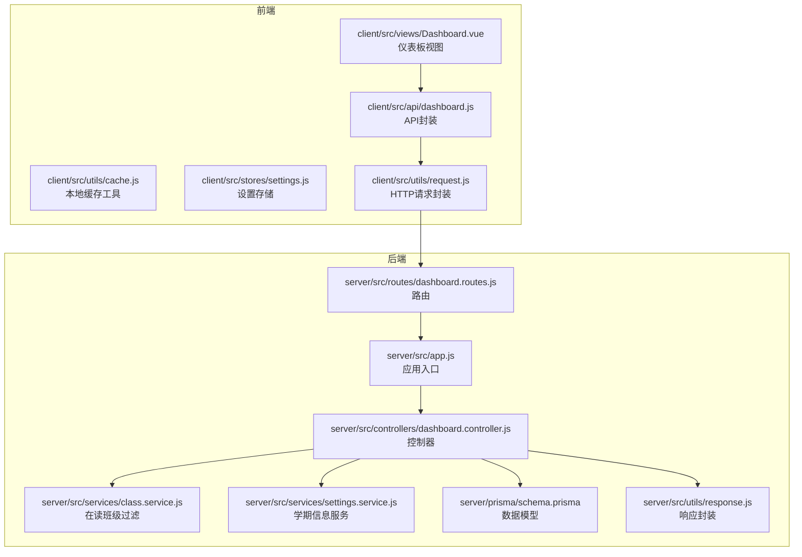
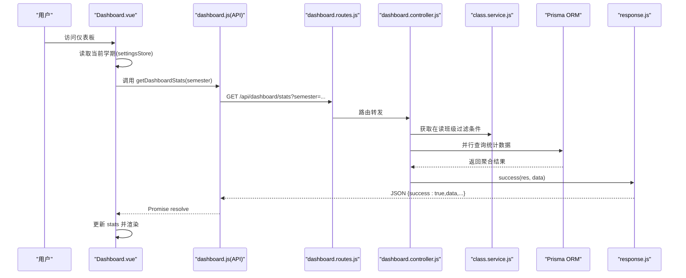
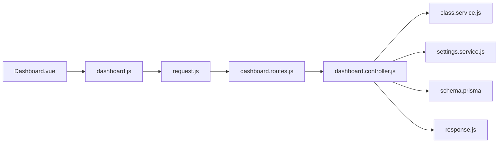
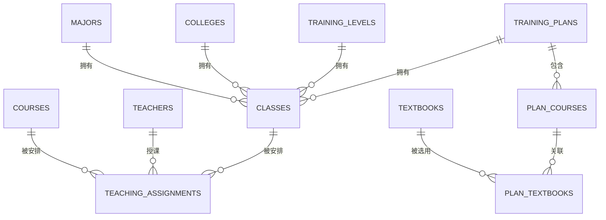

# 仪表板接口

<cite>
**本文档引用的文件**
- [client/src/api/dashboard.js](file://client/src/api/dashboard.js)
- [client/src/views/Dashboard.vue](file://client/src/views/Dashboard.vue)
- [client/src/utils/cache.js](file://client/src/utils/cache.js)
- [client/src/stores/settings.js](file://client/src/stores/settings.js)
- [client/src/utils/request.js](file://client/src/utils/request.js)
- [server/src/controllers/dashboard.controller.js](file://server/src/controllers/dashboard.controller.js)
- [server/src/routes/dashboard.routes.js](file://server/src/routes/dashboard.routes.js)
- [server/src/app.js](file://server/src/app.js)
- [server/src/services/class.service.js](file://server/src/services/class.service.js)
- [server/src/services/settings.service.js](file://server/src/services/settings.service.js)
- [server/prisma/schema.prisma](file://server/prisma/schema.prisma)
- [server/src/utils/response.js](file://server/src/utils/response.js)
</cite>

## 目录
1. [简介](#简介)
2. [项目结构](#项目结构)
3. [核心组件](#核心组件)
4. [架构总览](#架构总览)
5. [详细组件分析](#详细组件分析)
6. [依赖分析](#依赖分析)
7. [性能考虑](#性能考虑)
8. [故障排除指南](#故障排除指南)
9. [结论](#结论)
10. [附录](#附录)

## 简介
本文件为 KECCourseManager 课程管理平台的仪表板接口文档，聚焦“首页概览统计”接口，覆盖系统概览、统计数据、图表展示的相关能力。文档详细说明：
- 接口定义与调用流程
- 统计数据的计算逻辑、时间范围筛选、数据聚合方式
- 图表数据格式、实时更新机制、缓存策略
- 仪表板定制化配置与数据可视化接口的使用示例

## 项目结构
仪表板相关代码分布于前后端两部分：
- 前端负责界面渲染、交互、缓存与学期设置联动
- 后端负责数据聚合、权限控制与响应封装

**图表来源**
- [client/src/api/dashboard.js:1-11](file://client/src/api/dashboard.js#L1-L11)
- [client/src/views/Dashboard.vue:1-680](file://client/src/views/Dashboard.vue#L1-L680)
- [client/src/utils/cache.js:1-122](file://client/src/utils/cache.js#L1-L122)
- [client/src/stores/settings.js:1-57](file://client/src/stores/settings.js#L1-L57)
- [client/src/utils/request.js:1-145](file://client/src/utils/request.js#L1-L145)
- [server/src/controllers/dashboard.controller.js:1-73](file://server/src/controllers/dashboard.controller.js#L1-L73)
- [server/src/routes/dashboard.routes.js:1-9](file://server/src/routes/dashboard.routes.js#L1-L9)
- [server/src/app.js:152-153](file://server/src/app.js#L152-L153)
- [server/src/services/class.service.js:1-52](file://server/src/services/class.service.js#L1-L52)
- [server/src/services/settings.service.js:1-124](file://server/src/services/settings.service.js#L1-L124)
- [server/prisma/schema.prisma:1-308](file://server/prisma/schema.prisma#L1-L308)
- [server/src/utils/response.js:1-21](file://server/src/utils/response.js#L1-L21)

**章节来源**
- [client/src/views/Dashboard.vue:1-680](file://client/src/views/Dashboard.vue#L1-L680)
- [server/src/app.js:152-153](file://server/src/app.js#L152-L153)

## 核心组件
- 前端 API 封装：提供 getDashboardStats(semester) 方法，向 /api/dashboard/stats 发起 GET 请求并携带 semester 参数。
- 前端视图：Dashboard.vue 负责渲染欢迎区、统计卡片、快捷操作与平台信息；通过 Pinia 设置存储获取当前学期，并使用本地缓存工具进行数据缓存。
- 前端缓存：getWithCache 提供基于 Map 的 LRU 式缓存，支持 TTL、容量限制与定期清理。
- 后端控制器：dashboard.controller.js 并行查询多类统计数据，包括专业、课程、班级、教材、培养方案、学生、教师与周课时等。
- 后端路由：dashboard.routes.js 将 /api/dashboard/stats 映射到 getDashboardStats 控制器方法。
- 后端服务：class.service.js 提供“在读班级”的动态过滤条件；settings.service.js 提供学期信息解析与缓存。
- 数据模型：Prisma schema 定义 classes、majors、training_plans、textbooks、teaching_assignments 等实体及其关系。

**章节来源**
- [client/src/api/dashboard.js:1-11](file://client/src/api/dashboard.js#L1-L11)
- [client/src/views/Dashboard.vue:1-680](file://client/src/views/Dashboard.vue#L1-L680)
- [client/src/utils/cache.js:1-122](file://client/src/utils/cache.js#L1-L122)
- [server/src/controllers/dashboard.controller.js:1-73](file://server/src/controllers/dashboard.controller.js#L1-L73)
- [server/src/routes/dashboard.routes.js:1-9](file://server/src/routes/dashboard.routes.js#L1-L9)
- [server/src/services/class.service.js:1-52](file://server/src/services/class.service.js#L1-L52)
- [server/src/services/settings.service.js:1-124](file://server/src/services/settings.service.js#L1-L124)
- [server/prisma/schema.prisma:1-308](file://server/prisma/schema.prisma#L1-L308)

## 架构总览
仪表板接口采用“前端请求 -> 后端聚合 -> 前端缓存”的典型架构，结合 Pinia 设置存储与 Prisma ORM 实现数据访问与展示。

**图表来源**
- [client/src/views/Dashboard.vue:362-389](file://client/src/views/Dashboard.vue#L362-L389)
- [client/src/api/dashboard.js:8-10](file://client/src/api/dashboard.js#L8-L10)
- [server/src/routes/dashboard.routes.js:6](file://server/src/routes/dashboard.routes.js#L6)
- [server/src/controllers/dashboard.controller.js:19-72](file://server/src/controllers/dashboard.controller.js#L19-L72)
- [server/src/services/class.service.js:23-51](file://server/src/services/class.service.js#L23-L51)
- [server/src/utils/response.js:1-3](file://server/src/utils/response.js#L1-L3)

## 详细组件分析

### 接口定义与调用流程
- 接口路径：/api/dashboard/stats
- 方法：GET
- 参数：
  - semester：字符串，格式为 YYYY-YYYY-N（例如 2025-2026-2），表示学年与学期
- 响应：
  - 成功：{ success: true, message: "操作成功", data: {...} }
  - 失败：{ success: false, message: "错误信息" }

前端调用链：
- Dashboard.vue 在 mounted 生命周期中调用 fetchStats
- fetchStats 从 settingsStore 获取当前学期值
- 通过 getWithCache 包裹 getDashboardStats(semester)，使用 dashboard:stats:{semester} 作为缓存键
- 成功后将数据赋值到 stats 对象并渲染

**章节来源**
- [client/src/api/dashboard.js:8-10](file://client/src/api/dashboard.js#L8-L10)
- [client/src/views/Dashboard.vue:362-389](file://client/src/views/Dashboard.vue#L362-L389)
- [client/src/utils/cache.js:16-48](file://client/src/utils/cache.js#L16-L48)
- [server/src/routes/dashboard.routes.js:6](file://server/src/routes/dashboard.routes.js#L6)
- [server/src/utils/response.js:1-3](file://server/src/utils/response.js#L1-L3)

### 统计数据计算逻辑
后端控制器对以下指标进行聚合：
- 专业总数：majors.count()
- 培养方案总数：training_plans.count()
- 活跃教材数：textbooks.count({ where: { is_active: true } })
- 本学期授课课程数：teaching_assignments.findMany({ where: { semester }, select: { course_id }, distinct: ['course_id'] })，去重后计数
- 在读班级数与在读学生数：
  - 通过 getActiveClassFilter 动态构建“在读班级”条件
  - classes.findMany({ where: activeFilter, select: { student_count } })，班级数为数组长度，总人数为 student_count 的累加
- 参与教师数与总周课时：
  - teaching_assignments.groupBy({ by: ['teacher_id'], where: { semester }, _sum: { weekly_hours } })
  - 教师数为分组数量，总周课时为 weekly_hours 的累加并四舍五入到小数点后一位

时间范围筛选：
- 本学期筛选：通过 semester 参数限定
- 在读班级筛选：根据当前学期 startYear 与 classes.duration_years 推导 enrollment_year 下限，确保 is_left_school=false 且年级未超过学制

数据聚合方式：
- 并行查询：使用 Promise.all 同时获取多项统计，降低总延迟
- 去重聚合：课程数使用 distinct(['course_id']) 去重
- 分组聚合：教师周课时使用 groupBy + _sum

**章节来源**
- [server/src/controllers/dashboard.controller.js:19-72](file://server/src/controllers/dashboard.controller.js#L19-L72)
- [server/src/services/class.service.js:23-51](file://server/src/services/class.service.js#L23-L51)
- [server/src/services/settings.service.js:19-41](file://server/src/services/settings.service.js#L19-L41)

### 图表数据格式与可视化
- 当前实现：仪表板以统计卡片形式展示各项指标，未提供专门的图表接口
- 建议扩展：
  - 新增按学期维度的周课时趋势、课程分布、班级规模等图表接口
  - 响应格式建议遵循统一约定：{ success: true, data: { series: [...], categories: [...] } }
  - 前端可结合 ECharts 或 Element Plus 图表组件进行可视化

[本节为概念性内容，不直接分析具体文件，故无“章节来源”]

### 实时更新机制
- 前端缓存：getWithCache 默认 TTL 为 5 分钟，命中缓存直接返回，未命中则发起请求并更新缓存
- 缓存淘汰：最大缓存条目 50；定期清理过期缓存（每 5 分钟）
- 主动刷新：Dashboard.vue 提供“刷新”按钮，点击后重新拉取并更新缓存

**章节来源**
- [client/src/views/Dashboard.vue:368-389](file://client/src/views/Dashboard.vue#L368-L389)
- [client/src/utils/cache.js:16-48](file://client/src/utils/cache.js#L16-L48)
- [client/src/utils/cache.js:92-121](file://client/src/utils/cache.js#L92-L121)

### 缓存策略实现细节
- 类型：基于 Map 的内存缓存
- 键：dashboard:stats:{semester}
- TTL：5 分钟
- 容量：最多 50 条，超过时按最旧时间戳淘汰（LRU）
- 清理：每 5 分钟清理一次过期条目；模块加载时自动启动清理定时器

**章节来源**
- [client/src/utils/cache.js:6-48](file://client/src/utils/cache.js#L6-L48)
- [client/src/utils/cache.js:92-121](file://client/src/utils/cache.js#L92-L121)

### 仪表板定制化配置与使用示例
- 学期配置：settingsStore.load() 从 /api/settings 加载系统设置，解析 currentSemester 并生成友好显示标签
- 仪表板入口：路由 /dashboard 由 Layout 包裹，默认重定向至该页面
- 使用示例（前端）：
  - 在 Dashboard.vue 中，mounted 时自动拉取当前学期的统计
  - 用户点击“刷新”按钮时重新拉取
  - 点击统计卡片可跳转到对应管理页面（如专业、课程、班级、教材、培养方案）

**章节来源**
- [client/src/stores/settings.js:23-48](file://client/src/stores/settings.js#L23-L48)
- [client/src/router/index.js:24-30](file://client/src/router/index.js#L24-L30)
- [client/src/views/Dashboard.vue:395-437](file://client/src/views/Dashboard.vue#L395-L437)

## 依赖分析
- 前端依赖：
  - axios：HTTP 请求
  - element-plus：UI 组件与消息提示
  - pinia：状态管理（设置存储）
  - 自定义缓存工具：LRU 缓存与定时清理
- 后端依赖：
  - express：路由与中间件
  - prisma：ORM 查询
  - 自定义响应封装：success/fail/paginate

**图表来源**
- [client/src/views/Dashboard.vue:1-680](file://client/src/views/Dashboard.vue#L1-L680)
- [client/src/api/dashboard.js:1-11](file://client/src/api/dashboard.js#L1-L11)
- [client/src/utils/request.js:1-145](file://client/src/utils/request.js#L1-L145)
- [server/src/routes/dashboard.routes.js:1-9](file://server/src/routes/dashboard.routes.js#L1-L9)
- [server/src/controllers/dashboard.controller.js:1-73](file://server/src/controllers/dashboard.controller.js#L1-L73)
- [server/src/services/class.service.js:1-52](file://server/src/services/class.service.js#L1-L52)
- [server/src/services/settings.service.js:1-124](file://server/src/services/settings.service.js#L1-L124)
- [server/prisma/schema.prisma:1-308](file://server/prisma/schema.prisma#L1-L308)
- [server/src/utils/response.js:1-21](file://server/src/utils/response.js#L1-L21)

**章节来源**
- [server/src/app.js:152-153](file://server/src/app.js#L152-L153)

## 性能考虑
- 并行查询：控制器中使用 Promise.all 并行获取多项统计，显著降低总查询时间
- 缓存命中：前端 5 分钟 TTL 缓存减少重复请求，提高用户体验
- LRU 淘汰：最大缓存条目限制，避免内存无限增长
- 定时清理：定期清理过期缓存，保持缓存健康
- 数据去重：课程数使用 distinct 去重，避免重复计算

[本节为一般性指导，不直接分析具体文件，故无“章节来源”]

## 故障排除指南
- 常见错误与处理：
  - 401 未授权：前端会触发 Token 刷新或引导重新登录
  - 403 权限不足：提示权限不足
  - 400 参数错误：提示请求参数错误
  - 500/502/503：提示服务器错误或服务不可用
  - 网络超时：提示请求超时
- 建议排查步骤：
  - 确认当前学期设置正确（YYYY-YYYY-N 格式）
  - 检查网络连接与代理配置
  - 查看浏览器控制台与后端日志
  - 清理缓存后重试（clearCache 或刷新页面）

**章节来源**
- [client/src/utils/request.js:51-142](file://client/src/utils/request.js#L51-L142)

## 结论
仪表板接口以简洁高效的方式实现了首页概览统计，具备良好的并发性能与缓存机制。当前以卡片形式展示关键指标，未来可扩展图表接口以满足更丰富的可视化需求。通过 Pinia 设置存储与 Prisma ORM 的配合，系统在数据一致性与查询效率方面表现稳定。

[本节为总结性内容，不直接分析具体文件，故无“章节来源”]

## 附录

### API 规范
- 路径：/api/dashboard/stats
- 方法：GET
- 查询参数：
  - semester：YYYY-YYYY-N
- 成功响应字段：
  - success：布尔
  - message：字符串
  - data：对象，包含以下字段
    - semester：字符串
    - majors：整数
    - courses：整数
    - classes：整数
    - textbooks：整数
    - plans：整数
    - totalStudents：整数
    - teachingTeachers：整数
    - totalWeeklyHours：数字（保留一位小数）

**章节来源**
- [server/src/controllers/dashboard.controller.js:5-18](file://server/src/controllers/dashboard.controller.js#L5-L18)
- [server/src/utils/response.js:1-3](file://server/src/utils/response.js#L1-L3)

### 数据模型关系（与仪表板相关）

**图表来源**
- [server/prisma/schema.prisma:28-308](file://server/prisma/schema.prisma#L28-L308)