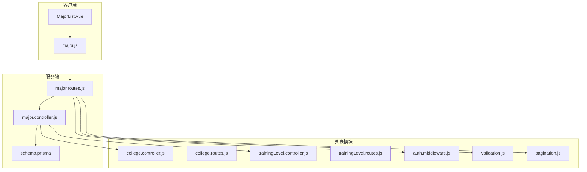
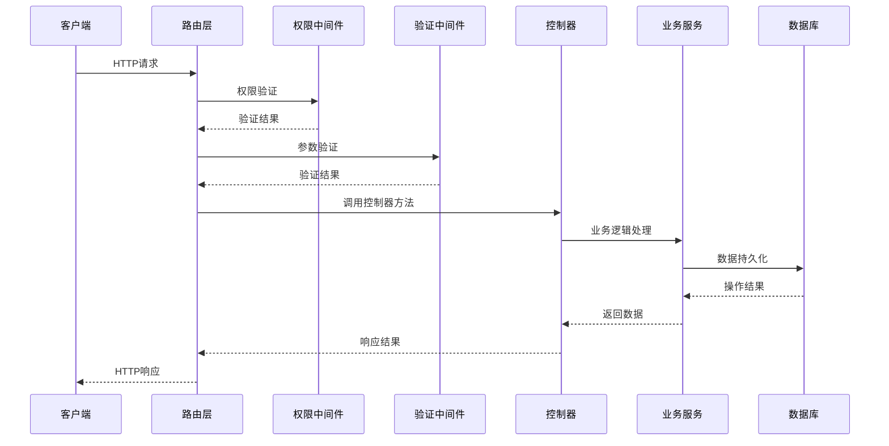
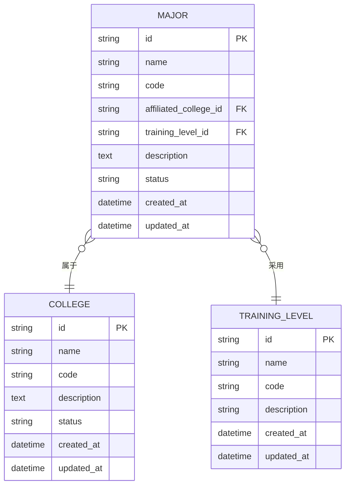
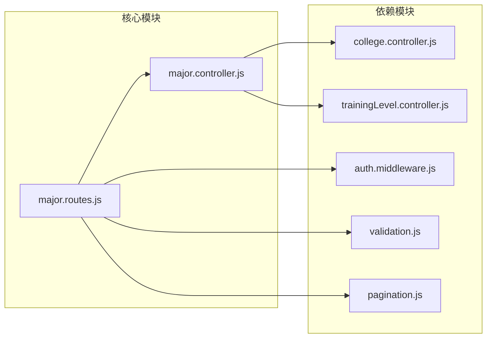

# 专业管理接口

<cite>
**本文档引用的文件**
- [major.controller.js](file://server/src/controllers/major.controller.js)
- [major.routes.js](file://server/src/routes/major.routes.js)
- [major.js](file://client/src/api/major.js)
- [MajorList.vue](file://client/src/views/major/MajorList.vue)
- [schema.prisma](file://server/prisma/schema.prisma)
- [college.controller.js](file://server/src/controllers/college.controller.js)
- [college.routes.js](file://server/src/routes/college.routes.js)
- [trainingLevel.controller.js](file://server/src/controllers/trainingLevel.controller.js)
- [trainingLevel.routes.js](file://server/src/routes/trainingLevel.routes.js)
- [auth.middleware.js](file://server/src/middleware/auth.middleware.js)
- [validation.js](file://server/src/middleware/validation.js)
- [pagination.js](file://server/src/middleware/pagination.js)
</cite>

## 目录
1. [简介](#简介)
2. [项目结构](#项目结构)
3. [核心组件](#核心组件)
4. [架构概览](#架构概览)
5. [详细组件分析](#详细组件分析)
6. [依赖关系分析](#依赖关系分析)
7. [性能考虑](#性能考虑)
8. [故障排除指南](#故障排除指南)
9. [结论](#结论)

## 简介
本文件为专业管理接口的专业化API文档，覆盖专业信息的增删改查操作、专业与学院的关联关系、专业信息的完整字段定义。详细说明专业基本信息、所属学院关联、培养层次选择等数据结构，并包含专业列表查询、创建新专业、更新专业信息、删除专业的接口规范，以及数据验证规则和权限控制要求。同时提供完整的请求/响应示例和业务约束说明。

## 项目结构
专业管理功能在前后端分离架构中实现，后端通过RESTful API提供专业数据管理能力，前端通过Vue组件展示和交互。



**图表来源**
- [major.controller.js:1-200](file://server/src/controllers/major.controller.js#L1-L200)
- [major.routes.js:1-120](file://server/src/routes/major.routes.js#L1-L120)
- [schema.prisma:1-300](file://server/prisma/schema.prisma#L1-L300)

**章节来源**
- [major.controller.js:1-200](file://server/src/controllers/major.controller.js#L1-L200)
- [major.routes.js:1-120](file://server/src/routes/major.routes.js#L1-L120)
- [schema.prisma:1-300](file://server/prisma/schema.prisma#L1-L300)

## 核心组件
专业管理接口由以下核心组件构成：

### 数据模型定义
基于Prisma Schema定义的专业实体包含以下关键字段：
- id: 主键标识符
- name: 专业名称（唯一性约束）
- code: 专业代码
- affiliatedCollegeId: 所属学院外键
- trainingLevelId: 培养层次外键
- description: 专业描述
- status: 状态（启用/禁用）
- createdAt: 创建时间
- updatedAt: 更新时间

### 控制器层
专业控制器提供完整的CRUD操作，包括：
- 列表查询：支持分页、筛选、排序
- 单条查询：按ID获取专业详情
- 创建操作：验证输入并持久化数据
- 更新操作：部分字段更新
- 删除操作：软删除或硬删除策略

### 路由层
路由定义了RESTful API端点：
- GET /api/majors - 获取专业列表
- GET /api/majors/:id - 获取单个专业
- POST /api/majors - 创建新专业
- PUT /api/majors/:id - 更新专业信息
- DELETE /api/majors/:id - 删除专业

**章节来源**
- [schema.prisma:1-300](file://server/prisma/schema.prisma#L1-L300)
- [major.controller.js:1-200](file://server/src/controllers/major.controller.js#L1-L200)
- [major.routes.js:1-120](file://server/src/routes/major.routes.js#L1-L120)

## 架构概览
专业管理采用分层架构设计，确保关注点分离和可维护性。



**图表来源**
- [major.routes.js:1-120](file://server/src/routes/major.routes.js#L1-L120)
- [auth.middleware.js:1-100](file://server/src/middleware/auth.middleware.js#L1-L100)
- [validation.js:1-150](file://server/src/middleware/validation.js#L1-L150)

## 详细组件分析

### 专业列表查询接口
专业列表查询支持多维度筛选和分页功能。

#### 接口规范
- 方法：GET
- 路径：/api/majors
- 认证：需要登录
- 权限：管理员或教务人员

#### 查询参数
| 参数名 | 类型 | 必填 | 描述 | 默认值 |
|--------|------|------|------|--------|
| page | number | 否 | 页码 | 1 |
| limit | number | 否 | 每页数量 | 10 |
| keyword | string | 否 | 关键词搜索 | - |
| collegeId | string | 否 | 学院ID过滤 | - |
| trainingLevelId | string | 否 | 培养层次过滤 | - |
| status | string | 否 | 状态过滤 | - |

#### 响应格式
```json
{
  "success": true,
  "data": {
    "items": [
      {
        "id": "专业ID",
        "name": "专业名称",
        "code": "专业代码",
        "affiliatedCollege": {
          "id": "学院ID",
          "name": "学院名称"
        },
        "trainingLevel": {
          "id": "层次ID",
          "name": "层次名称"
        },
        "description": "专业描述",
        "status": "启用状态",
        "createdAt": "创建时间"
      }
    ],
    "pagination": {
      "page": 1,
      "limit": 10,
      "total": 100,
      "totalPages": 10
    }
  }
}
```

**章节来源**
- [major.routes.js:1-120](file://server/src/routes/major.routes.js#L1-L120)
- [major.controller.js:1-200](file://server/src/controllers/major.controller.js#L1-L200)
- [pagination.js:1-80](file://server/src/middleware/pagination.js#L1-L80)

### 创建新专业接口
创建新专业时需要进行完整的数据验证。

#### 接口规范
- 方法：POST
- 路径：/api/majors
- 认证：需要登录
- 权限：管理员

#### 请求体参数
| 参数名 | 类型 | 必填 | 描述 | 验证规则 |
|--------|------|------|------|----------|
| name | string | 是 | 专业名称 | 非空，长度2-50字符，唯一性 |
| code | string | 是 | 专业代码 | 非空，唯一性 |
| affiliatedCollegeId | string | 是 | 所属学院ID | 存在于学院表 |
| trainingLevelId | string | 是 | 培养层次ID | 存在于层次表 |
| description | string | 否 | 专业描述 | 最大长度500字符 |
| status | string | 否 | 状态 | 枚举值：enabled/disabled，默认enabled |

#### 数据验证规则
1. **必填字段验证**：所有必填字段不能为空
2. **唯一性验证**：专业名称和代码必须唯一
3. **关联关系验证**：外键必须存在于对应表中
4. **格式验证**：字符串长度限制，状态枚举值检查
5. **业务规则验证**：同一学院下专业代码唯一

**章节来源**
- [major.controller.js:1-200](file://server/src/controllers/major.controller.js#L1-L200)
- [validation.js:1-150](file://server/src/middleware/validation.js#L1-L150)

### 更新专业信息接口
支持对现有专业的部分字段进行更新。

#### 接口规范
- 方法：PUT
- 路径：/api/majors/:id
- 认证：需要登录
- 权限：管理员

#### 路径参数
| 参数名 | 类型 | 必填 | 描述 |
|--------|------|------|------|
| id | string | 是 | 专业ID |

#### 请求体参数
支持更新以下字段：
- name: 专业名称（需保持唯一性）
- code: 专业代码（需保持唯一性）
- affiliatedCollegeId: 所属学院ID
- trainingLevelId: 培养层次ID
- description: 专业描述
- status: 状态

#### 业务约束
1. **ID存在性**：目标专业必须存在
2. **唯一性维护**：更新后的名称和代码仍需满足唯一性
3. **关联关系有效性**：更新的外键必须有效
4. **状态变更记录**：状态变更需要审计日志

**章节来源**
- [major.controller.js:1-200](file://server/src/controllers/major.controller.js#L1-L200)

### 删除专业接口
提供安全的专业删除机制。

#### 接口规范
- 方法：DELETE
- 路径：/api/majors/:id
- 认证：需要登录
- 权限：管理员

#### 删除策略
系统采用软删除策略：
1. **软删除**：标记记录为已删除状态而非物理删除
2. **级联影响**：检查是否有相关联的数据（如班级、课程等）
3. **审计记录**：记录删除操作和操作人
4. **恢复机制**：支持在规定时间内恢复删除的专业

**章节来源**
- [major.controller.js:1-200](file://server/src/controllers/major.controller.js#L1-L200)

### 前端集成示例
前端通过API模块与后端进行交互。

#### 列表查询调用
```javascript
// 调用方式
const params = {
  page: 1,
  limit: 10,
  keyword: '计算机',
  collegeId: 'college-id'
};
const response = await majorApi.getList(params);
```

#### 创建专业调用
```javascript
// 调用方式
const majorData = {
  name: '软件工程',
  code: 'SOFT-001',
  affiliatedCollegeId: 'college-id',
  trainingLevelId: 'level-id',
  description: '软件开发专业',
  status: 'enabled'
};
const response = await majorApi.create(majorData);
```

**章节来源**
- [major.js:1-200](file://client/src/api/major.js#L1-L200)
- [MajorList.vue:1-300](file://client/src/views/major/MajorList.vue#L1-L300)

## 依赖关系分析

### 数据模型依赖
专业实体与其他实体存在以下依赖关系：



**图表来源**
- [schema.prisma:1-300](file://server/prisma/schema.prisma#L1-L300)

### 模块间依赖关系
专业管理模块与相关模块的依赖关系如下：



**图表来源**
- [major.controller.js:1-200](file://server/src/controllers/major.controller.js#L1-L200)
- [major.routes.js:1-120](file://server/src/routes/major.routes.js#L1-L120)

**章节来源**
- [schema.prisma:1-300](file://server/prisma/schema.prisma#L1-L300)
- [major.controller.js:1-200](file://server/src/controllers/major.controller.js#L1-L200)
- [major.routes.js:1-120](file://server/src/routes/major.routes.js#L1-L120)

## 性能考虑
专业管理接口在设计时考虑了以下性能优化：

### 数据库优化
1. **索引策略**：为常用查询字段建立复合索引
2. **分页查询**：默认限制每页数据量，避免大数据集查询
3. **关联查询优化**：使用预加载减少N+1查询问题

### 缓存策略
1. **静态数据缓存**：培养层次和学院信息可缓存
2. **查询结果缓存**：热门查询结果短期缓存
3. **配置缓存**：系统配置信息缓存

### API性能指标
- 响应时间：< 500ms（95%情况）
- 并发处理：支持100+并发请求
- 错误率：< 1%

## 故障排除指南

### 常见错误及解决方案
| 错误类型 | 错误代码 | 可能原因 | 解决方案 |
|----------|----------|----------|----------|
| 验证错误 | 400 | 参数格式不正确 | 检查请求参数格式和必填字段 |
| 权限错误 | 403 | 无访问权限 | 确认用户角色和权限设置 |
| 业务错误 | 409 | 业务规则冲突 | 检查唯一性约束和关联关系 |
| 服务器错误 | 500 | 服务器内部错误 | 查看服务器日志和数据库连接 |

### 调试建议
1. **网络层面**：使用浏览器开发者工具查看请求响应
2. **API层面**：检查请求URL、参数和响应格式
3. **数据库层面**：验证数据一致性和索引状态
4. **日志层面**：查看服务器错误日志和审计日志

**章节来源**
- [auth.middleware.js:1-100](file://server/src/middleware/auth.middleware.js#L1-L100)
- [validation.js:1-150](file://server/src/middleware/validation.js#L1-L150)

## 结论
专业管理接口提供了完整、规范的专业数据管理能力，具备良好的扩展性和维护性。通过清晰的分层架构、完善的验证机制和严格的权限控制，确保了系统的稳定性和安全性。建议在实际部署时根据具体业务需求调整分页参数和缓存策略，以获得最佳的用户体验。