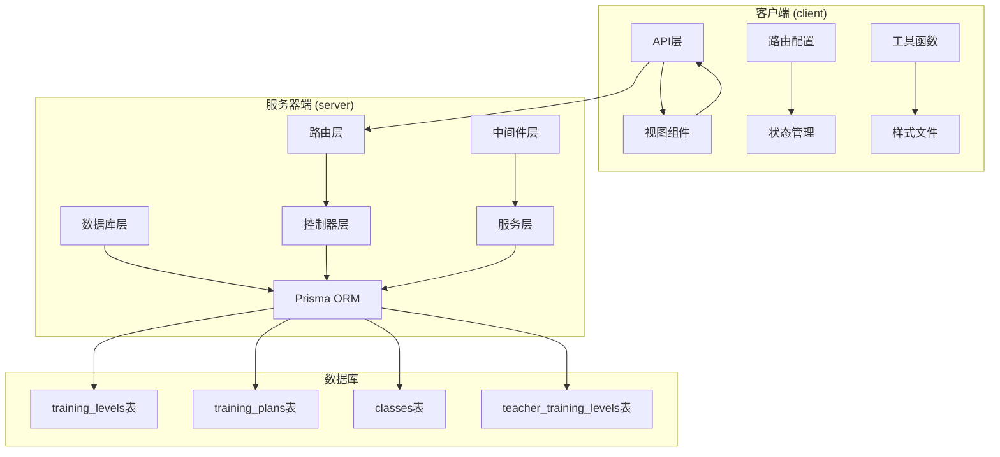
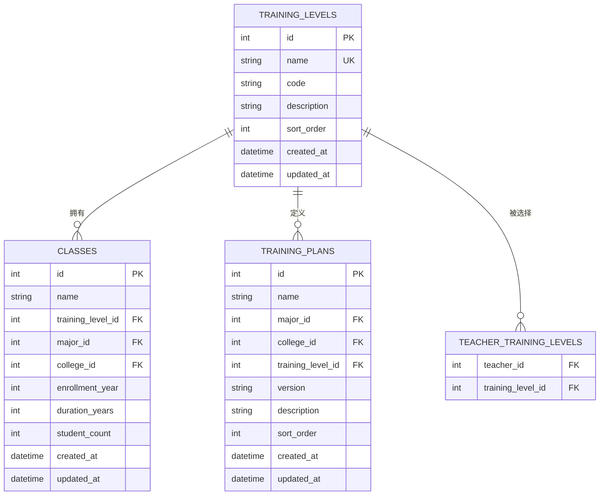
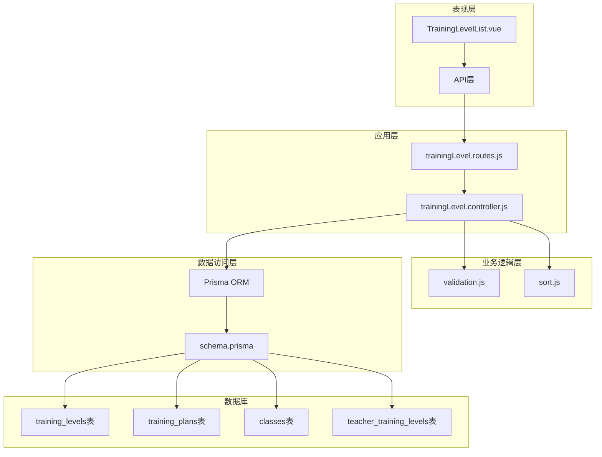
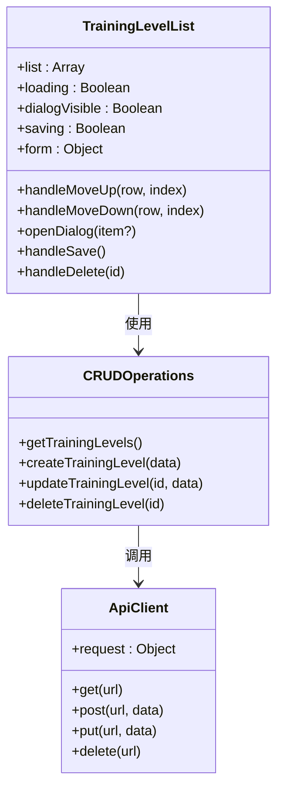
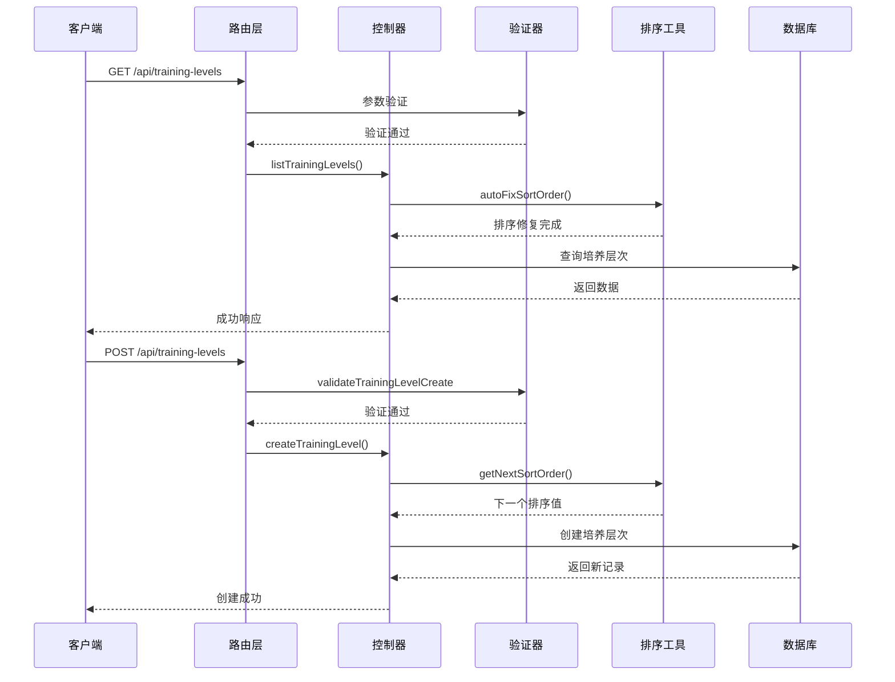
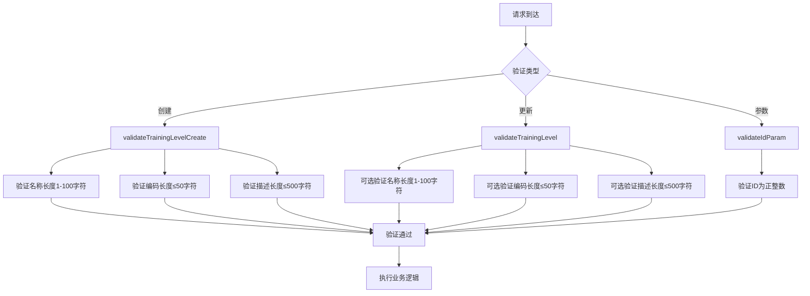
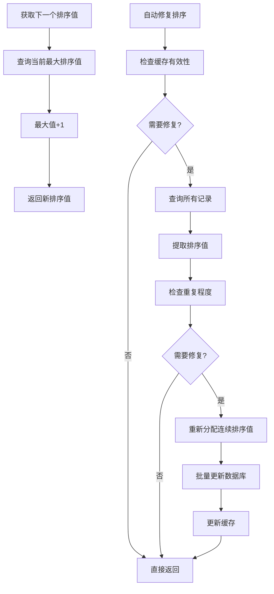

# 培养层次管理接口

<cite>
**本文档引用的文件**
- [trainingLevel.js](file://client/src/api/trainingLevel.js)
- [TrainingLevelList.vue](file://client/src/views/trainingLevel/TrainingLevelList.vue)
- [trainingLevel.controller.js](file://server/src/controllers/trainingLevel.controller.js)
- [trainingLevel.routes.js](file://server/src/routes/trainingLevel.routes.js)
- [validation.js](file://server/src/middleware/validation.js)
- [sort.js](file://server/src/utils/sort.js)
- [schema.prisma](file://server/prisma/schema.prisma)
</cite>

## 目录
1. [简介](#简介)
2. [项目结构](#项目结构)
3. [核心组件](#核心组件)
4. [架构概览](#架构概览)
5. [详细组件分析](#详细组件分析)
6. [依赖关系分析](#依赖关系分析)
7. [性能考虑](#性能考虑)
8. [故障排除指南](#故障排除指南)
9. [结论](#结论)

## 简介

培养层次管理接口是高校教务管理系统中的核心功能模块，负责管理学生的培养层次信息。该系统支持培养层次的增删改查操作，包括层次名称、层次代码、层次描述等基本信息管理。系统采用前后端分离架构，前端使用Vue.js框架，后端基于Node.js和Express框架构建。

培养层次在教育体系中具有重要的地位，它决定了教学计划的制定、课程安排的组织以及教学质量的评估标准。通过本接口，管理员可以灵活地管理不同类型的培养层次，如本科、专科、研究生等，为整个教务系统的正常运行提供基础支撑。

## 项目结构

该项目采用前后端分离的架构设计，主要分为客户端（client）和服务器端（server）两个部分：



**图表来源**
- [trainingLevel.js:1-7](file://client/src/api/trainingLevel.js#L1-L7)
- [trainingLevelList.vue:1-120](file://client/src/views/trainingLevel/TrainingLevelList.vue#L1-L120)
- [trainingLevel.controller.js:1-151](file://server/src/controllers/trainingLevel.controller.js#L1-L151)
- [trainingLevel.routes.js:1-40](file://server/src/routes/trainingLevel.routes.js#L1-L40)

**章节来源**
- [trainingLevel.js:1-7](file://client/src/api/trainingLevel.js#L1-L7)
- [trainingLevelList.vue:1-120](file://client/src/views/trainingLevel/TrainingLevelList.vue#L1-L120)
- [trainingLevel.controller.js:1-151](file://server/src/controllers/trainingLevel.controller.js#L1-L151)
- [trainingLevel.routes.js:1-40](file://server/src/routes/trainingLevel.routes.js#L1-L40)

## 核心组件

### 数据模型设计

培养层次系统的核心数据模型围绕`training_levels`表构建，该表定义了培养层次的基本属性和关联关系：



**图表来源**
- [schema.prisma:178-189](file://server/prisma/schema.prisma#L178-L189)
- [schema.prisma:191-206](file://server/prisma/schema.prisma#L191-L206)
- [schema.prisma:275-284](file://server/prisma/schema.prisma#L275-L284)

### 接口规范

系统提供完整的RESTful API接口，支持培养层次的全生命周期管理：

| 方法 | 路径 | 权限要求 | 功能描述 |
|------|------|----------|----------|
| GET | `/api/training-levels` | 登录用户 | 获取所有培养层次列表 |
| POST | `/api/training-levels` | admin, super_admin | 创建新的培养层次 |
| PUT | `/api/training-levels/:id` | admin, super_admin | 更新指定培养层次 |
| DELETE | `/api/training-levels/:id` | admin, super_admin | 删除指定培养层次 |

**章节来源**
- [trainingLevel.routes.js:18-37](file://server/src/routes/trainingLevel.routes.js#L18-L37)
- [trainingLevel.controller.js:11-150](file://server/src/controllers/trainingLevel.controller.js#L11-L150)

## 架构概览

系统采用分层架构设计，确保各层职责清晰、耦合度低：



**图表来源**
- [trainingLevelList.vue:88-118](file://client/src/views/trainingLevel/TrainingLevelList.vue#L88-L118)
- [trainingLevel.routes.js:1-40](file://server/src/routes/trainingLevel.routes.js#L1-L40)
- [trainingLevel.controller.js:1-151](file://server/src/controllers/trainingLevel.controller.js#L1-L151)

## 详细组件分析

### 前端组件实现

前端采用Vue.js 3 Composition API模式，实现了完整的CRUD操作界面：



**图表来源**
- [trainingLevelList.vue:88-118](file://client/src/views/trainingLevel/TrainingLevelList.vue#L88-L118)
- [trainingLevel.js:1-7](file://client/src/api/trainingLevel.js#L1-L7)

前端组件提供了直观的用户界面，包括：
- 培养层次列表展示，支持按层次名称、编码、描述等字段筛选
- 新增、编辑、删除操作的弹窗式表单
- 排序功能，支持上下移动调整层次顺序
- 班级数量统计显示

**章节来源**
- [trainingLevelList.vue:1-120](file://client/src/views/trainingLevel/TrainingLevelList.vue#L1-L120)
- [trainingLevel.js:1-7](file://client/src/api/trainingLevel.js#L1-L7)

### 后端控制器实现

后端控制器实现了完整的业务逻辑处理：



**图表来源**
- [trainingLevel.controller.js:11-63](file://server/src/controllers/trainingLevel.controller.js#L11-L63)
- [trainingLevel.routes.js:22-28](file://server/src/routes/trainingLevel.routes.js#L22-L28)

控制器实现了以下关键功能：
- 自动排序修复机制，确保排序值的唯一性和连续性
- 完整的数据验证和错误处理
- 审计日志记录，追踪所有操作
- 外键约束检查，防止数据完整性破坏

**章节来源**
- [trainingLevel.controller.js:11-150](file://server/src/controllers/trainingLevel.controller.js#L11-L150)

### 数据验证机制

系统实现了多层次的数据验证机制：



**图表来源**
- [validation.js:268-277](file://server/src/middleware/validation.js#L268-L277)
- [validation.js:425-435](file://server/src/middleware/validation.js#L425-L435)
- [validation.js:129-133](file://server/src/middleware/validation.js#L129-L133)

验证规则包括：
- 名称字段：必填，1-100字符限制
- 编码字段：可选，最大50字符
- 描述字段：可选，最大500字符
- ID参数：必须为正整数

**章节来源**
- [validation.js:268-277](file://server/src/middleware/validation.js#L268-L277)
- [validation.js:425-435](file://server/src/middleware/validation.js#L425-L435)

### 排序管理机制

系统实现了智能的排序管理功能：



**图表来源**
- [sort.js:26-31](file://server/src/utils/sort.js#L26-L31)
- [sort.js:62-103](file://server/src/utils/sort.js#L62-L103)

排序机制特点：
- 支持手动指定排序值或自动生成
- 自动检测和修复重复排序值
- 内存缓存提高查询性能
- 事务保证数据一致性

**章节来源**
- [sort.js:1-104](file://server/src/utils/sort.js#L1-L104)

## 依赖关系分析

系统各组件之间的依赖关系如下：

```mermaid
graph LR
subgraph "客户端依赖"
A[TrainingLevelList.vue] --> B[trainingLevel.js]
B --> C[request.js]
end
subgraph "服务端依赖"
D[trainingLevel.routes.js] --> E[trainingLevel.controller.js]
E --> F[validation.js]
E --> G[sort.js]
E --> H[prisma.js]
H --> I[schema.prisma]
end
subgraph "外部依赖"
J[express]
K[express-validator]
L[prisma]
M[@prisma/client]
end
B --> J
D --> J
F --> K
H --> L
I --> M
```

**图表来源**
- [trainingLevelList.vue:96](file://client/src/views/trainingLevel/TrainingLevelList.vue#L96)
- [trainingLevel.routes.js:1-8](file://server/src/routes/trainingLevel.routes.js#L1-L8)
- [trainingLevel.controller.js:1-9](file://server/src/controllers/trainingLevel.controller.js#L1-L9)

**章节来源**
- [trainingLevelList.vue:96](file://client/src/views/trainingLevel/TrainingLevelList.vue#L96)
- [trainingLevel.routes.js:1-8](file://server/src/routes/trainingLevel.routes.js#L1-L8)
- [trainingLevel.controller.js:1-9](file://server/src/controllers/trainingLevel.controller.js#L1-L9)

## 性能考虑

系统在设计时充分考虑了性能优化：

### 数据库性能优化
- 使用复合索引提升查询效率
- 实现排序值缓存减少数据库查询
- 采用批量操作避免N+1查询问题

### 缓存策略
- 排序值结果缓存，TTL为5分钟
- 自动检测缓存失效时机
- 支持按模型名称精确清理缓存

### 并发控制
- 排序值生成的并发安全考虑
- 事务保证数据一致性
- 错误重试机制

## 故障排除指南

### 常见错误及解决方案

| 错误类型 | 错误代码 | 描述 | 解决方案 |
|----------|----------|------|----------|
| 参数验证错误 | 422 | 请求参数不符合验证规则 | 检查输入数据格式和长度限制 |
| 权限不足 | 403 | 非管理员用户尝试修改 | 确保用户具有相应权限 |
| 数据不存在 | 404 | 操作的目标记录不存在 | 验证ID的有效性 |
| 数据冲突 | 409 | 层次名称已存在 | 修改为唯一的层次名称 |
| 关联数据存在 | 409 | 层次仍有被引用数据 | 先删除或解除相关关联 |

### 调试建议

1. **启用审计日志**：所有操作都会记录详细的审计信息
2. **检查数据库连接**：确认Prisma连接配置正确
3. **验证权限设置**：确保用户角色配置正确
4. **监控排序值**：定期检查排序值的唯一性和连续性

**章节来源**
- [trainingLevel.controller.js:32-62](file://server/src/controllers/trainingLevel.controller.js#L32-L62)
- [trainingLevel.controller.js:83-98](file://server/src/controllers/trainingLevel.controller.js#L83-L98)
- [trainingLevel.controller.js:107-119](file://server/src/controllers/trainingLevel.controller.js#L107-L119)

## 结论

培养层次管理接口是一个设计完善、功能完整的教务管理系统核心模块。系统通过合理的架构设计、严格的验证机制和完善的错误处理，为高校的教务管理工作提供了可靠的技术支撑。

主要优势包括：
- **完整的CRUD功能**：支持培养层次的全生命周期管理
- **严格的数据验证**：多层验证确保数据质量
- **智能排序管理**：自动修复排序问题，保证用户体验
- **完善的权限控制**：基于角色的访问控制机制
- **详细的审计日志**：完整的操作追踪能力

该接口为后续的功能扩展奠定了良好的基础，可以轻松集成到更复杂的教务管理系统中，满足不同规模高校的管理需求。