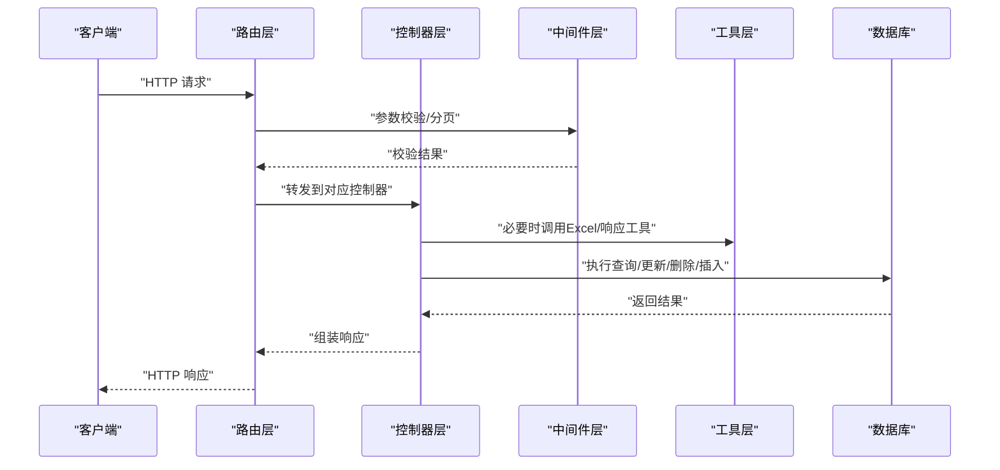
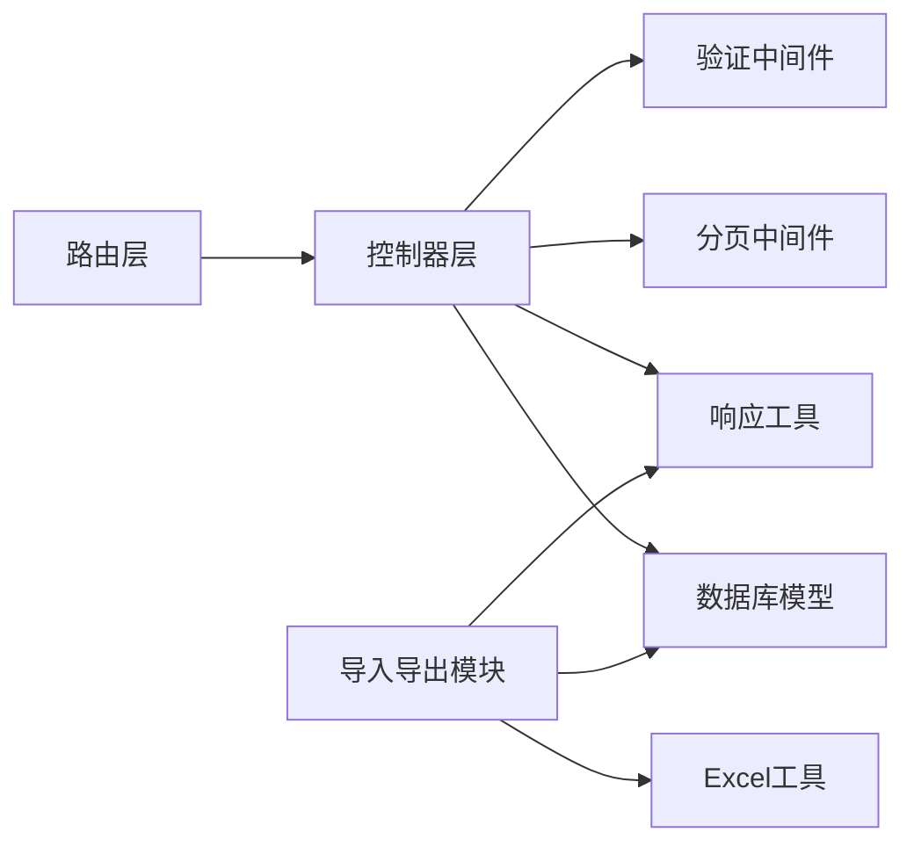

# 基础数据接口

<cite>
**本文档引用的文件**
- [college.controller.js](file://server/src/controllers/college.controller.js)
- [major.controller.js](file://server/src/controllers/major.controller.js)
- [class.controller.js](file://server/src/controllers/class.controller.js)
- [teacher.controller.js](file://server/src/controllers/teacher.controller.js)
- [course.controller.js](file://server/src/controllers/course.controller.js)
- [textbook.controller.js](file://server/src/controllers/textbook.controller.js)
- [trainingLevel.controller.js](file://server/src/controllers/trainingLevel.controller.js)
- [college.routes.js](file://server/src/routes/college.routes.js)
- [major.routes.js](file://server/src/routes/major.routes.js)
- [class.routes.js](file://server/src/routes/class.routes.js)
- [teacher.routes.js](file://server/src/routes/teacher.routes.js)
- [course.routes.js](file://server/src/routes/course.routes.js)
- [textbook.routes.js](file://server/src/routes/textbook.routes.js)
- [trainingLevel.routes.js](file://server/src/routes/trainingLevel.routes.js)
- [validation.js](file://server/src/middleware/validation.js)
- [pagination.js](file://server/src/middleware/pagination.js)
- [response.js](file://server/src/utils/response.js)
- [excel.js](file://server/src/utils/excel.js)
- [import.controller.js](file://server/src/controllers/import.controller.js)
- [data-export.controller.js](file://server/src/controllers/export/data-export.controller.js)
- [export-template.controller.js](file://server/src/controllers/export/export-template.controller.js)
- [classes.js](file://server/src/controllers/import/classes.js)
- [courses.js](file://server/src/controllers/import/courses.js)
- [teachers.js](file://server/src/controllers/import/teachers.js)
- [textbooks.js](file://server/src/controllers/import/textbooks.js)
- [import.routes.js](file://server/src/routes/import.routes.js)
- [export.routes.js](file://server/src/routes/export.routes.js)
- [schema.prisma](file://server/prisma/schema.prisma)
</cite>

## 目录
1. [简介](#简介)
2. [项目结构](#项目结构)
3. [核心组件](#核心组件)
4. [架构总览](#架构总览)
5. [详细组件分析](#详细组件分析)
6. [依赖关系分析](#依赖关系分析)
7. [性能考虑](#性能考虑)
8. [故障排除指南](#故障排除指南)
9. [结论](#结论)
10. [附录](#附录)

## 简介
本文件面向KEC课程管理平台的基础数据管理接口，系统性梳理并规范以下实体的增删改查（CRUD）能力：学院、专业、班级、教师、课程、教材、培养层次。文档覆盖字段定义、数据校验规则、实体间关联关系与业务约束，并提供分页查询、条件过滤、排序的使用示例。同时，详细说明数据导入导出接口及Excel模板格式要求，帮助前后端协同开发与运维部署。

## 项目结构
后端采用控制器-路由-中间件-服务-数据库模型的分层架构。基础数据接口主要分布在对应实体的控制器与路由中，统一通过验证中间件、分页中间件与响应工具进行处理；导入导出功能位于独立的控制器与路由模块中。

```mermaid
graph TB
subgraph "路由层"
R_COLLEGE["college.routes.js"]
R_MAJOR["major.routes.js"]
R_CLASS["class.routes.js"]
R_TEACHER["teacher.routes.js"]
R_COURSE["course.routes.js"]
R_TEXTBOOK["textbook.routes.js"]
R_TRAININGLEVEL["trainingLevel.routes.js"]
R_IMPORT["import.routes.js"]
R_EXPORT["export.routes.js"]
end
subgraph "控制器层"
C_COLLEGE["college.controller.js"]
C_MAJOR["major.controller.js"]
C_CLASS["class.controller.js"]
C_TEACHER["teacher.controller.js"]
C_COURSE["course.controller.js"]
C_TEXTBOOK["textbook.controller.js"]
C_TRAININGLEVEL["trainingLevel.controller.js"]
C_IMPORT["import.controller.js"]
C_EXPORT["data-export.controller.js"]
C_EXPORT_TEMPLATE["export-template.controller.js"]
C_IMPORT_CLASSES["classes.js"]
C_IMPORT_COURSES["courses.js"]
C_IMPORT_TEACHERS["teachers.js"]
C_IMPORT_TEXTBOOKS["textbooks.js"]
end
subgraph "中间件层"
MW_VALIDATION["validation.js"]
MW_PAGINATION["pagination.js"]
end
subgraph "工具层"
U_RESPONSE["response.js"]
U_EXCEL["excel.js"]
end
subgraph "数据模型"
M_PRISMA["schema.prisma"]
end
R_COLLEGE --> C_COLLEGE
R_MAJOR --> C_MAJOR
R_CLASS --> C_CLASS
R_TEACHER --> C_TEACHER
R_COURSE --> C_COURSE
R_TEXTBOOK --> C_TEXTBOOK
R_TRAININGLEVEL --> C_TRAININGLEVEL
R_IMPORT --> C_IMPORT
R_EXPORT --> C_EXPORT
R_EXPORT --> C_EXPORT_TEMPLATE
C_COLLEGE --> MW_VALIDATION
C_COLLEGE --> MW_PAGINATION
C_COLLEGE --> U_RESPONSE
C_COLLEGE --> M_PRISMA
C_IMPORT --> U_EXCEL
C_EXPORT --> U_EXCEL
C_EXPORT_TEMPLATE --> U_EXCEL
```

图表来源
- [college.routes.js](file://server/src/routes/college.routes.js)
- [major.routes.js](file://server/src/routes/major.routes.js)
- [class.routes.js](file://server/src/routes/class.routes.js)
- [teacher.routes.js](file://server/src/routes/teacher.routes.js)
- [course.routes.js](file://server/src/routes/course.routes.js)
- [textbook.routes.js](file://server/src/routes/textbook.routes.js)
- [trainingLevel.routes.js](file://server/src/routes/trainingLevel.routes.js)
- [import.routes.js](file://server/src/routes/import.routes.js)
- [export.routes.js](file://server/src/routes/export.routes.js)
- [validation.js](file://server/src/middleware/validation.js)
- [pagination.js](file://server/src/middleware/pagination.js)
- [response.js](file://server/src/utils/response.js)
- [excel.js](file://server/src/utils/excel.js)
- [schema.prisma](file://server/prisma/schema.prisma)

章节来源
- [college.routes.js](file://server/src/routes/college.routes.js)
- [major.routes.js](file://server/src/routes/major.routes.js)
- [class.routes.js](file://server/src/routes/class.routes.js)
- [teacher.routes.js](file://server/src/routes/teacher.routes.js)
- [course.routes.js](file://server/src/routes/course.routes.js)
- [textbook.routes.js](file://server/src/routes/textbook.routes.js)
- [trainingLevel.routes.js](file://server/src/routes/trainingLevel.routes.js)
- [import.routes.js](file://server/src/routes/import.routes.js)
- [export.routes.js](file://server/src/routes/export.routes.js)

## 核心组件
- 验证中间件：统一处理请求参数校验，确保字段类型、长度、必填等规则符合业务预期。
- 分页中间件：提供标准分页参数解析与边界控制，支持页码与每页数量的规范化。
- 响应工具：封装统一的响应结构，包括状态码、消息与数据体，便于前后端一致化对接。
- Excel工具：提供导入导出通用的Excel读写与模板生成能力。
- 数据库模型：Prisma Schema定义各实体表结构、索引与外键约束，保障数据一致性。

章节来源
- [validation.js](file://server/src/middleware/validation.js)
- [pagination.js](file://server/src/middleware/pagination.js)
- [response.js](file://server/src/utils/response.js)
- [excel.js](file://server/src/utils/excel.js)
- [schema.prisma](file://server/prisma/schema.prisma)

## 架构总览
基础数据接口遵循REST风格，每个实体在路由层定义HTTP方法与路径，在控制器层实现业务逻辑，通过中间件完成参数校验与分页处理，最终调用数据库模型完成持久化操作。导入导出接口通过Excel工具读取/生成文件，结合对应的导入/导出控制器完成批量数据处理。

图表来源
- [college.controller.js](file://server/src/controllers/college.controller.js)
- [validation.js](file://server/src/middleware/validation.js)
- [pagination.js](file://server/src/middleware/pagination.js)
- [response.js](file://server/src/utils/response.js)
- [excel.js](file://server/src/utils/excel.js)
- [schema.prisma](file://server/prisma/schema.prisma)

## 详细组件分析

### 学院（College）
- 路由与控制器：定义GET/POST/PUT/DELETE等方法，支持按ID查询、列表分页、新增、修改、删除。
- 字段定义：名称、代码、所属地区、负责人、联系方式、创建时间、更新时间等。
- 校验规则：名称必填且唯一；代码需唯一；联系方式格式校验。
- 关联关系：专业与班级均通过外键关联至学院。
- 业务约束：删除前需检查是否存在关联的专业或班级；修改时需保证代码唯一性。
- 分页/过滤/排序：支持按名称模糊匹配、按创建时间倒序排列，分页参数由中间件统一处理。

章节来源
- [college.controller.js](file://server/src/controllers/college.controller.js)
- [college.routes.js](file://server/src/routes/college.routes.js)
- [validation.js](file://server/src/middleware/validation.js)
- [pagination.js](file://server/src/middleware/pagination.js)
- [response.js](file://server/src/utils/response.js)
- [schema.prisma](file://server/prisma/schema.prisma)

### 专业（Major）
- 路由与控制器：提供CRUD接口，支持按学院筛选、按名称过滤。
- 字段定义：名称、代码、所属学院、学制、培养层次、创建时间、更新时间等。
- 校验规则：名称与代码组合唯一；所属学院必须存在；学制为数值型范围校验。
- 关联关系：与学院为多对一；与班级为一对多。
- 业务约束：删除前需检查是否存在关联的班级；修改时需保证名称+学院唯一。
- 分页/过滤/排序：支持按学院ID过滤、按名称升序排列。

章节来源
- [major.controller.js](file://server/src/controllers/major.controller.js)
- [major.routes.js](file://server/src/routes/major.routes.js)
- [validation.js](file://server/src/middleware/validation.js)
- [pagination.js](file://server/src/middleware/pagination.js)
- [response.js](file://server/src/utils/response.js)
- [schema.prisma](file://server/prisma/schema.prisma)

### 班级（Class）
- 路由与控制器：提供CRUD接口，支持按专业、年级、名称过滤。
- 字段定义：班级名称、班级代码、所属专业、年级、班主任、学生人数、创建时间、更新时间等。
- 校验规则：班级名称与代码组合唯一；年级为数值范围校验；班主任可选。
- 关联关系：与专业为多对一；与学生为一对多。
- 业务约束：删除前需检查是否存在关联的学生记录；修改时需保证名称+专业唯一。
- 分页/过滤/排序：支持按专业ID、年级过滤，按名称升序排列。

章节来源
- [class.controller.js](file://server/src/controllers/class.controller.js)
- [class.routes.js](file://server/src/routes/class.routes.js)
- [validation.js](file://server/src/middleware/validation.js)
- [pagination.js](file://server/src/middleware/pagination.js)
- [response.js](file://server/src/utils/response.js)
- [schema.prisma](file://server/prisma/schema.prisma)

### 教师（Teacher）
- 路由与控制器：提供CRUD接口，支持按姓名、工号、所属学院、状态过滤。
- 字段定义：姓名、工号、性别、出生日期、政治面貌、学历、职称、所属学院、状态、创建时间、更新时间等。
- 校验规则：工号唯一；姓名必填；出生日期格式校验；状态枚举值校验。
- 关联关系：与学院为多对一；与教学安排为一对多。
- 业务约束：删除前需检查是否存在关联的教学安排；状态变更需符合流程。
- 分页/过滤/排序：支持按学院ID、状态过滤，按工号升序排列。

章节来源
- [teacher.controller.js](file://server/src/controllers/teacher.controller.js)
- [teacher.routes.js](file://server/src/routes/teacher.routes.js)
- [validation.js](file://server/src/middleware/validation.js)
- [pagination.js](file://server/src/middleware/pagination.js)
- [response.js](file://server/src/utils/response.js)
- [schema.prisma](file://server/prisma/schema.prisma)

### 课程（Course）
- 路由与控制器：提供CRUD接口，支持按课程名称、课程代码、开课学期过滤。
- 字段定义：课程名称、课程代码、学分、学时、课程性质、开课学期、任课教师、创建时间、更新时间等。
- 校验规则：课程代码唯一；学分与学时为数值范围校验；课程性质枚举校验。
- 关联关系：与教师为多对一；与教学安排为一对多。
- 业务约束：删除前需检查是否存在关联的教学安排；修改时需保证课程代码唯一。
- 分页/过滤/排序：支持按学期过滤，按课程代码升序排列。

章节来源
- [course.controller.js](file://server/src/controllers/course.controller.js)
- [course.routes.js](file://server/src/routes/course.routes.js)
- [validation.js](file://server/src/middleware/validation.js)
- [pagination.js](file://server/src/middleware/pagination.js)
- [response.js](file://server/src/utils/response.js)
- [schema.prisma](file://server/prisma/schema.prisma)

### 教材（Textbook）
- 路由与控制器：提供CRUD接口，支持按书名、作者、出版社过滤。
- 字段定义：书名、作者、出版社、ISBN、版本、出版年份、适用课程、创建时间、更新时间等。
- 校验规则：ISBN可选唯一；出版年份为数值范围校验；适用课程可多选。
- 关联关系：与课程为多对多（通过中间表）。
- 业务约束：删除前需检查是否存在关联的教学安排；修改时需保证ISBN唯一（若填写）。
- 分页/过滤/排序：支持按书名模糊过滤，按出版年份降序排列。

章节来源
- [textbook.controller.js](file://server/src/controllers/textbook.controller.js)
- [textbook.routes.js](file://server/src/routes/textbook.routes.js)
- [validation.js](file://server/src/middleware/validation.js)
- [pagination.js](file://server/src/middleware/pagination.js)
- [response.js](file://server/src/utils/response.js)
- [schema.prisma](file://server/prisma/schema.prisma)

### 培养层次（TrainingLevel）
- 路由与控制器：提供CRUD接口，支持按层次名称过滤。
- 字段定义：层次名称、描述、创建时间、更新时间等。
- 校验规则：层次名称唯一；描述可选。
- 关联关系：与教师、专业等实体存在多对多或外键关联。
- 业务约束：删除前需检查是否存在关联记录；修改时需保证名称唯一。
- 分页/过滤/排序：支持按名称过滤，按创建时间倒序排列。

章节来源
- [trainingLevel.controller.js](file://server/src/controllers/trainingLevel.controller.js)
- [trainingLevel.routes.js](file://server/src/routes/trainingLevel.routes.js)
- [validation.js](file://server/src/middleware/validation.js)
- [pagination.js](file://server/src/middleware/pagination.js)
- [response.js](file://server/src/utils/response.js)
- [schema.prisma](file://server/prisma/schema.prisma)

### 导入导出接口
- 导入接口：支持批量导入班级、课程、教师、教材数据。控制器负责解析Excel文件，调用Excel工具进行列映射与数据清洗，再批量写入数据库。
- 导出接口：支持导出各类基础数据为Excel文件，控制器根据查询条件生成数据集，调用Excel工具输出模板或数据文件。
- 模板格式：包含必填列与可选列清单，列标题需与数据库字段映射一致；提供示例行用于说明数据类型与取值范围。

章节来源
- [import.controller.js](file://server/src/controllers/import.controller.js)
- [data-export.controller.js](file://server/src/controllers/export/data-export.controller.js)
- [export-template.controller.js](file://server/src/controllers/export/export-template.controller.js)
- [classes.js](file://server/src/controllers/import/classes.js)
- [courses.js](file://server/src/controllers/import/courses.js)
- [teachers.js](file://server/src/controllers/import/teachers.js)
- [textbooks.js](file://server/src/controllers/import/textbooks.js)
- [excel.js](file://server/src/utils/excel.js)
- [import.routes.js](file://server/src/routes/import.routes.js)
- [export.routes.js](file://server/src/routes/export.routes.js)

## 依赖关系分析
基础数据接口的依赖关系清晰：路由层仅负责URL与方法映射，控制器层承担业务逻辑，中间件层提供横切能力，工具层提供通用能力，数据库模型作为数据持久化层。导入导出模块与Excel工具耦合度较高，但通过控制器解耦具体业务。

图表来源
- [college.routes.js](file://server/src/routes/college.routes.js)
- [major.routes.js](file://server/src/routes/major.routes.js)
- [class.routes.js](file://server/src/routes/class.routes.js)
- [teacher.routes.js](file://server/src/routes/teacher.routes.js)
- [course.routes.js](file://server/src/routes/course.routes.js)
- [textbook.routes.js](file://server/src/routes/textbook.routes.js)
- [trainingLevel.routes.js](file://server/src/routes/trainingLevel.routes.js)
- [import.routes.js](file://server/src/routes/import.routes.js)
- [export.routes.js](file://server/src/routes/export.routes.js)
- [validation.js](file://server/src/middleware/validation.js)
- [pagination.js](file://server/src/middleware/pagination.js)
- [response.js](file://server/src/utils/response.js)
- [excel.js](file://server/src/utils/excel.js)
- [schema.prisma](file://server/prisma/schema.prisma)

章节来源
- [college.controller.js](file://server/src/controllers/college.controller.js)
- [major.controller.js](file://server/src/controllers/major.controller.js)
- [class.controller.js](file://server/src/controllers/class.controller.js)
- [teacher.controller.js](file://server/src/controllers/teacher.controller.js)
- [course.controller.js](file://server/src/controllers/course.controller.js)
- [textbook.controller.js](file://server/src/controllers/textbook.controller.js)
- [trainingLevel.controller.js](file://server/src/controllers/trainingLevel.controller.js)
- [import.controller.js](file://server/src/controllers/import.controller.js)
- [data-export.controller.js](file://server/src/controllers/export/data-export.controller.js)
- [export-template.controller.js](file://server/src/controllers/export/export-template.controller.js)
- [validation.js](file://server/src/middleware/validation.js)
- [pagination.js](file://server/src/middleware/pagination.js)
- [response.js](file://server/src/utils/response.js)
- [excel.js](file://server/src/utils/excel.js)
- [schema.prisma](file://server/prisma/schema.prisma)

## 性能考虑
- 索引优化：Prisma迁移脚本已添加复合索引与性能相关索引，建议在高频过滤字段上保持索引策略。
- 分页策略：合理设置每页大小上限，避免一次性返回过多数据；对排序字段建立索引以提升排序性能。
- 批量导入：导入接口采用批量写入策略，减少事务次数；建议在Excel模板中严格限制单次导入条目数。
- 缓存策略：对于不频繁变动的基础数据，可在应用层引入轻量缓存以降低数据库压力。

## 故障排除指南
- 参数校验失败：检查请求体字段是否满足必填、类型、长度与枚举范围要求；参考验证中间件的错误提示。
- 分页异常：确认页码与每页数量参数是否在允许范围内；避免超大偏移导致的性能问题。
- 导入失败：核对Excel模板列名与顺序；检查数据类型与取值范围；查看导入日志定位具体行。
- 删除受限：当提示存在关联记录时，先清理关联数据或调整业务流程后再重试。

章节来源
- [validation.js](file://server/src/middleware/validation.js)
- [pagination.js](file://server/src/middleware/pagination.js)
- [response.js](file://server/src/utils/response.js)
- [excel.js](file://server/src/utils/excel.js)

## 结论
本文件系统化梳理了KEC课程管理平台基础数据管理接口，明确了各实体的字段、校验、关联与业务约束，并提供了分页、过滤、排序的使用指导以及导入导出的模板与流程说明。建议在实际开发中严格遵循本文档的约定，确保前后端协作顺畅与数据一致性。

## 附录
- 使用示例（概念性说明）
  - 分页查询：在请求参数中传入页码与每页数量，控制器自动应用分页中间件；支持按多个字段排序。
  - 条件过滤：通过查询参数传递过滤条件，控制器在业务层进行参数解析与SQL拼接。
  - 排序规则：默认按创建时间倒序，部分实体支持自定义排序字段与方向。
  - 导入流程：下载模板→填写数据→上传Excel→后端解析与校验→批量入库→返回结果。
  - 导出流程：选择导出条件→后端生成Excel→浏览器下载文件。