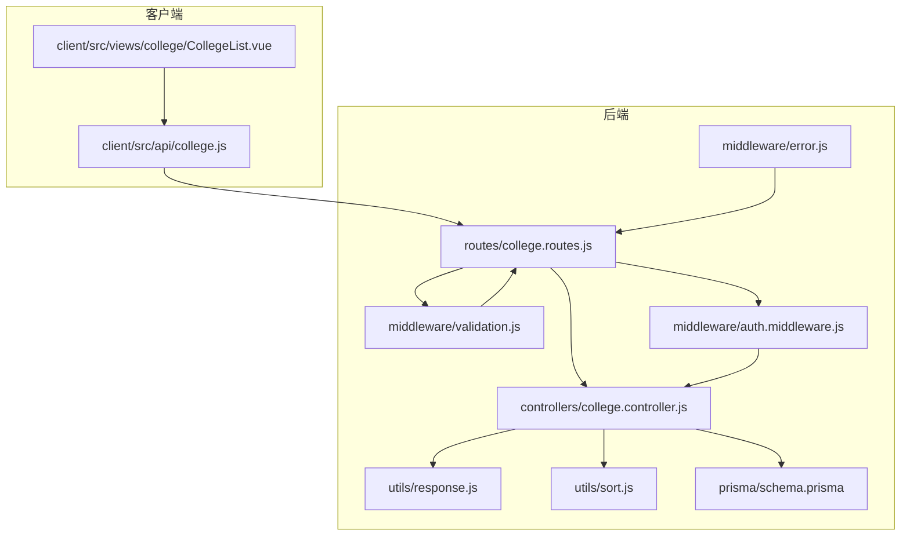
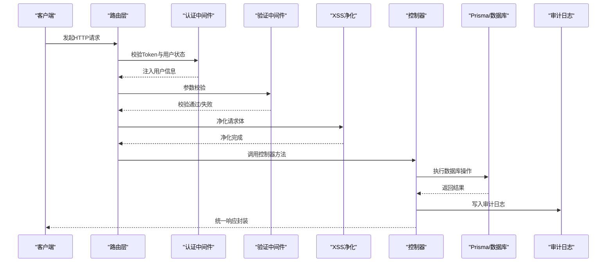
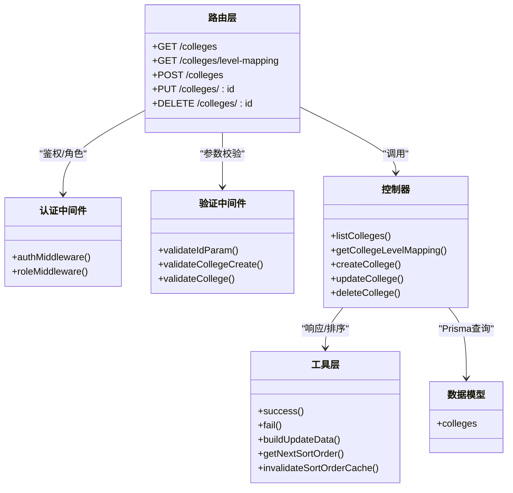

# 学院管理接口

<cite>
**本文档引用的文件**
- [server/src/controllers/college.controller.js](file://server/src/controllers/college.controller.js)
- [server/src/routes/college.routes.js](file://server/src/routes/college.routes.js)
- [server/src/middleware/validation.js](file://server/src/middleware/validation.js)
- [server/src/middleware/auth.middleware.js](file://server/src/middleware/auth.middleware.js)
- [server/src/utils/response.js](file://server/src/utils/response.js)
- [server/src/utils/sort.js](file://server/src/utils/sort.js)
- [server/src/middleware/error.js](file://server/src/middleware/error.js)
- [server/prisma/schema.prisma](file://server/prisma/schema.prisma)
- [client/src/api/college.js](file://client/src/api/college.js)
- [client/src/views/college/CollegeList.vue](file://client/src/views/college/CollegeList.vue)
</cite>

## 目录
1. [简介](#简介)
2. [项目结构](#项目结构)
3. [核心组件](#核心组件)
4. [架构总览](#架构总览)
5. [详细接口文档](#详细接口文档)
6. [依赖关系分析](#依赖关系分析)
7. [性能考量](#性能考量)
8. [故障排查指南](#故障排查指南)
9. [结论](#结论)

## 简介
本文件为“学院管理接口”的完整API文档，覆盖以下能力：
- 列表查询：获取所有学院及班级数量统计
- 创建：新增学院（含排序值自动分配）
- 更新：修改学院信息（支持部分字段更新）
- 删除：删除学院（前置完整性检查）
- 层级映射查询：返回“学院-培养层次”双向映射关系
- 数据验证规则与权限控制
- 错误处理与审计日志

本接口对所有登录用户开放查询，对创建、更新、删除操作要求管理员及以上角色。

## 项目结构
后端采用Express + Prisma架构，前端基于Vue 3 + Element Plus。接口路由位于`routes/college.routes.js`，控制器位于`controllers/college.controller.js`，验证规则集中在`middleware/validation.js`，认证中间件位于`middleware/auth.middleware.js`。

图表来源
- [server/src/routes/college.routes.js:1-42](file://server/src/routes/college.routes.js#L1-L42)
- [server/src/controllers/college.controller.js:1-200](file://server/src/controllers/college.controller.js#L1-L200)
- [server/src/middleware/validation.js:1-590](file://server/src/middleware/validation.js#L1-L590)
- [server/src/middleware/auth.middleware.js:1-129](file://server/src/middleware/auth.middleware.js#L1-L129)
- [server/src/utils/response.js:1-21](file://server/src/utils/response.js#L1-L21)
- [server/src/utils/sort.js:1-104](file://server/src/utils/sort.js#L1-L104)
- [server/src/middleware/error.js:1-63](file://server/src/middleware/error.js#L1-L63)
- [server/prisma/schema.prisma:56-68](file://server/prisma/schema.prisma#L56-L68)
- [client/src/api/college.js:1-8](file://client/src/api/college.js#L1-L8)
- [client/src/views/college/CollegeList.vue:1-110](file://client/src/views/college/CollegeList.vue#L1-L110)

章节来源
- [server/src/routes/college.routes.js:1-42](file://server/src/routes/college.routes.js#L1-L42)
- [server/src/controllers/college.controller.js:1-200](file://server/src/controllers/college.controller.js#L1-L200)
- [server/prisma/schema.prisma:56-68](file://server/prisma/schema.prisma#L56-L68)

## 核心组件
- 路由层：定义HTTP方法、路径、中间件链（鉴权、参数校验、XSS净化、控制器）
- 控制器层：实现业务逻辑（查询、创建、更新、删除、层级映射）
- 验证中间件：统一的参数校验与错误响应
- 认证中间件：Token解析、用户状态校验、角色权限控制
- 工具层：响应封装、排序工具、审计日志集成
- 数据模型：Prisma定义的colleges模型及关联

章节来源
- [server/src/routes/college.routes.js:19-39](file://server/src/routes/college.routes.js#L19-L39)
- [server/src/controllers/college.controller.js:11-199](file://server/src/controllers/college.controller.js#L11-L199)
- [server/src/middleware/validation.js:254-405](file://server/src/middleware/validation.js#L254-L405)
- [server/src/middleware/auth.middleware.js:40-128](file://server/src/middleware/auth.middleware.js#L40-L128)
- [server/src/utils/response.js:1-21](file://server/src/utils/response.js#L1-L21)
- [server/src/utils/sort.js:12-103](file://server/src/utils/sort.js#L12-L103)
- [server/prisma/schema.prisma:56-68](file://server/prisma/schema.prisma#L56-L68)

## 架构总览
接口调用流程概览如下：

图表来源
- [server/src/routes/college.routes.js:19-39](file://server/src/routes/college.routes.js#L19-L39)
- [server/src/middleware/auth.middleware.js:40-106](file://server/src/middleware/auth.middleware.js#L40-L106)
- [server/src/middleware/validation.js:7-35](file://server/src/middleware/validation.js#L7-L35)
- [server/src/controllers/college.controller.js:11-199](file://server/src/controllers/college.controller.js#L11-L199)
- [server/src/utils/response.js:1-21](file://server/src/utils/response.js#L1-L21)

## 详细接口文档

### 通用约定
- 请求头
  - Content-Type: application/json
  - Authorization: Bearer <token>（除GET /colleges外均需）
- 成功响应格式
  - { success: true, message: "操作成功", data: any }
- 失败响应格式
  - { success: false, message: "操作失败" }
- 分页响应格式（仅列表接口）
  - { success: true, data: { list, total, page, pageSize, totalPages } }

章节来源
- [server/src/utils/response.js:1-21](file://server/src/utils/response.js#L1-L21)

### GET /colleges
- 权限：所有登录用户
- 功能：获取所有学院列表，按排序值升序排列，并附带班级数量统计
- 响应数据结构
  - 数组元素包含：id, name, code, description, sort_order, created_at, updated_at, classCount
- 示例
  - 请求：GET /colleges
  - 响应：包含多个学院对象的数组，每个对象包含classCount字段

章节来源
- [server/src/controllers/college.controller.js:11-27](file://server/src/controllers/college.controller.js#L11-L27)
- [server/src/routes/college.routes.js:19-20](file://server/src/routes/college.routes.js#L19-L20)

### GET /colleges/level-mapping
- 权限：所有登录用户
- 功能：查询“学院-培养层次”的双向映射关系
- 响应数据结构
  - { collegeToLevels: { [collegeId]: [trainingLevelId,...] }, levelToColleges: { [trainingLevelId]: [collegeId,...] } }
- 示例
  - 请求：GET /colleges/level-mapping
  - 响应：映射对象，键为数字字符串，值为数字数组

章节来源
- [server/src/controllers/college.controller.js:104-142](file://server/src/controllers/college.controller.js#L104-L142)
- [server/src/routes/college.routes.js:21](file://server/src/routes/college.routes.js#L21)

### POST /colleges
- 权限：admin, super_admin
- 功能：创建新学院
- 请求体字段
  - name: 必填，1-100字符，去空白
  - code: 可选，<=50字符
  - description: 可选，<=500字符
  - sort_order: 可选，非负整数；未提供时自动分配下一个排序值
- 校验规则
  - 名称必填且长度限制
  - code/description长度限制
- 成功响应
  - 返回新建的学院对象
- 失败响应
  - 名称重复：返回“该学院名称已存在”
  - 参数校验失败：返回422及错误详情
  - 其他异常：统一错误处理中间件转换为安全提示

章节来源
- [server/src/controllers/college.controller.js:29-64](file://server/src/controllers/college.controller.js#L29-L64)
- [server/src/middleware/validation.js:396-405](file://server/src/middleware/validation.js#L396-L405)
- [server/src/routes/college.routes.js:24-30](file://server/src/routes/college.routes.js#L24-L30)

### PUT /colleges/:id
- 权限：admin, super_admin
- 功能：更新指定学院信息（支持部分字段更新）
- 路径参数
  - id: 正整数
- 请求体字段（可选）
  - name: 1-100字符
  - code: <=50字符
  - description: <=500字符
  - sort_order: 非负整数
- 校验规则
  - id为正整数
  - 字段长度限制
- 成功响应
  - 返回更新后的学院对象
- 失败响应
  - 学院不存在：返回404
  - 名称重复：返回“该学院名称已存在”
  - 参数校验失败：返回422及错误详情

章节来源
- [server/src/controllers/college.controller.js:66-102](file://server/src/controllers/college.controller.js#L66-L102)
- [server/src/middleware/validation.js:130-133](file://server/src/middleware/validation.js#L130-L133)
- [server/src/middleware/validation.js:254-263](file://server/src/middleware/validation.js#L254-L263)
- [server/src/routes/college.routes.js:31-38](file://server/src/routes/college.routes.js#L31-L38)

### DELETE /colleges/:id
- 权限：admin, super_admin
- 功能：删除指定学院
- 前置检查
  - 若存在班级（classes.college_id关联），禁止删除
  - 若存在教师排课偏好（teacher_scheduling_colleges）、培养方案（training_plans）、教师归属（teachers.affiliated_college_id）引用，禁止删除
- 成功响应
  - 返回空数据
- 失败响应
  - 存在关联引用：返回“该学院仍被引用（...），请先解除关联”
  - 学院不存在：返回404
  - 参数校验失败：返回422

章节来源
- [server/src/controllers/college.controller.js:144-199](file://server/src/controllers/college.controller.js#L144-L199)
- [server/src/middleware/validation.js:130-133](file://server/src/middleware/validation.js#L130-L133)
- [server/src/routes/college.routes.js:39](file://server/src/routes/college.routes.js#L39)

### 数据模型与字段定义
- colleges模型字段
  - id: 主键
  - name: 唯一，1-100字符
  - code: 可选，<=50字符
  - description: 可选，<=500字符
  - sort_order: 非负整数，默认0
  - created_at, updated_at: 时间戳
- 关联关系
  - classes.college_id
  - training_plans.college_id
  - teacher_scheduling_colleges.college_id
  - teachers.affiliated_college_id

章节来源
- [server/prisma/schema.prisma:56-68](file://server/prisma/schema.prisma#L56-L68)

### 审计日志与排序机制
- 审计日志
  - 所有创建/更新/删除操作均写入审计日志，包含模块、操作、用户、IP、详情、结果、时间等
- 排序机制
  - 创建时若未提供sort_order，则自动分配下一个排序值
  - 更新时支持仅更新sort_order
  - 操作完成后使对应模型的排序缓存失效，确保下次读取顺序正确

章节来源
- [server/src/controllers/college.controller.js:39-49](file://server/src/controllers/college.controller.js#L39-L49)
- [server/src/controllers/college.controller.js:73-83](file://server/src/controllers/college.controller.js#L73-L83)
- [server/src/controllers/college.controller.js:171-182](file://server/src/controllers/college.controller.js#L171-L182)
- [server/src/utils/sort.js:12-31](file://server/src/utils/sort.js#L12-L31)

## 依赖关系分析

图表来源
- [server/src/routes/college.routes.js:19-39](file://server/src/routes/college.routes.js#L19-L39)
- [server/src/middleware/auth.middleware.js:40-128](file://server/src/middleware/auth.middleware.js#L40-L128)
- [server/src/middleware/validation.js:130-405](file://server/src/middleware/validation.js#L130-L405)
- [server/src/controllers/college.controller.js:11-199](file://server/src/controllers/college.controller.js#L11-L199)
- [server/src/utils/response.js:1-21](file://server/src/utils/response.js#L1-L21)
- [server/src/utils/sort.js:12-103](file://server/src/utils/sort.js#L12-L103)
- [server/prisma/schema.prisma:56-68](file://server/prisma/schema.prisma#L56-L68)

## 性能考量
- 排序修复与缓存
  - autoFixSortOrder会检测重复排序并批量修复，同时维护短时缓存，降低重复修复开销
- 用户状态缓存
  - 认证中间件对用户状态进行短期缓存，减少频繁查询数据库
- 前端展示
  - 列表页面直接显示classCount，无需额外查询

章节来源
- [server/src/utils/sort.js:62-103](file://server/src/utils/sort.js#L62-L103)
- [server/src/middleware/auth.middleware.js:22-38](file://server/src/middleware/auth.middleware.js#L22-L38)
- [client/src/views/college/CollegeList.vue:18-24](file://client/src/views/college/CollegeList.vue#L18-L24)

## 故障排查指南
- 常见错误与处理
  - 参数校验失败：检查请求体字段长度与类型，参考验证规则
  - Token无效/过期：重新登录获取新Token
  - 权限不足：确认当前用户角色为admin或super_admin
  - 学院不存在：确认id是否存在
  - 名称重复：修改名称后重试
  - 存在关联引用：先删除/解除班级、教师排课偏好、培养方案、教师归属等关联后再删除
- 审计日志定位
  - 所有操作均写入审计日志，可通过模块与操作字段定位具体事件
- 错误响应
  - 生产环境统一返回安全提示，开发环境可查看详细堆栈

章节来源
- [server/src/middleware/error.js:35-62](file://server/src/middleware/error.js#L35-L62)
- [server/src/controllers/college.controller.js:51-63](file://server/src/controllers/college.controller.js#L51-L63)
- [server/src/controllers/college.controller.js:85-98](file://server/src/controllers/college.controller.js#L85-L98)
- [server/src/controllers/college.controller.js:164-195](file://server/src/controllers/college.controller.js#L164-L195)

## 结论
本接口提供了完整的学院管理能力，具备完善的参数校验、权限控制、审计日志与错误处理机制。通过层级映射查询，可辅助实现“学院-培养层次”的联动配置。建议在生产环境中配合前端分页与缓存策略，进一步提升用户体验与系统性能。