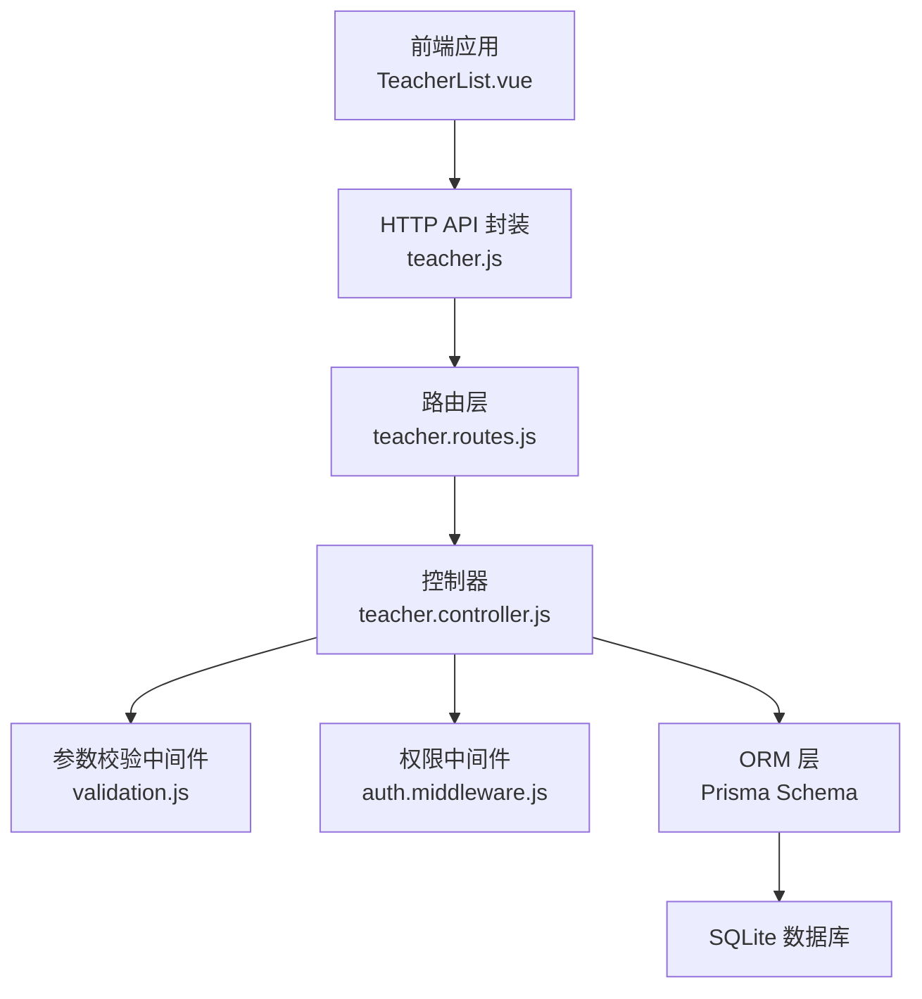
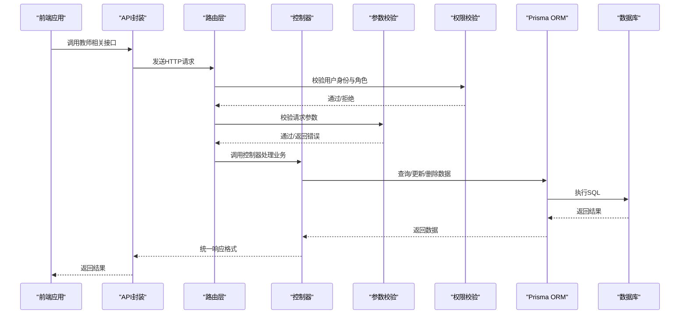
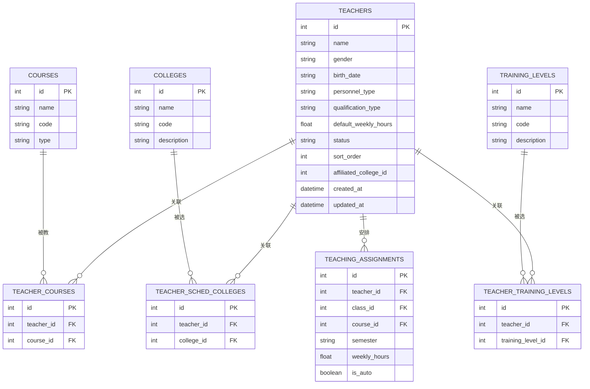
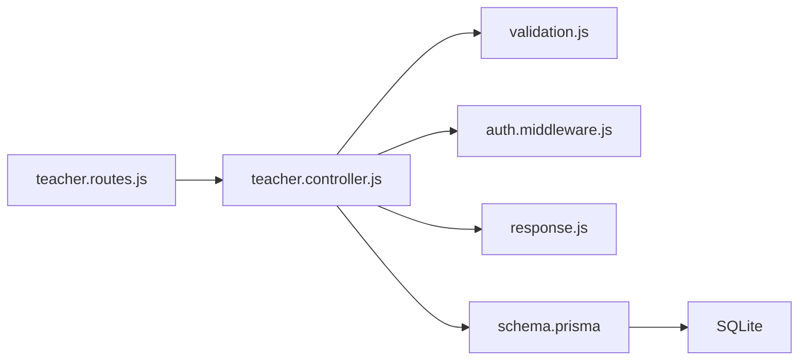

# 教师管理接口

<cite>
**本文档引用的文件**
- [client/src/api/teacher.js](file://client/src/api/teacher.js)
- [server/src/controllers/teacher.controller.js](file://server/src/controllers/teacher.controller.js)
- [server/src/routes/teacher.routes.js](file://server/src/routes/teacher.routes.js)
- [server/src/middleware/validation.js](file://server/src/middleware/validation.js)
- [server/src/middleware/auth.middleware.js](file://server/src/middleware/auth.middleware.js)
- [server/prisma/schema.prisma](file://server/prisma/schema.prisma)
- [client/src/views/teaching/TeacherList.vue](file://client/src/views/teaching/TeacherList.vue)
- [server/src/utils/response.js](file://server/src/utils/response.js)
- [server/src/services/audit.service.js](file://server/src/services/audit.service.js)
</cite>

## 目录
1. [简介](#简介)
2. [项目结构](#项目结构)
3. [核心组件](#核心组件)
4. [架构总览](#架构总览)
5. [详细组件分析](#详细组件分析)
6. [依赖分析](#依赖分析)
7. [性能考虑](#性能考虑)
8. [故障排除指南](#故障排除指南)
9. [结论](#结论)

## 简介
本文件为教师管理接口的完整API文档，覆盖教师信息的全生命周期管理，包括基本信息维护、所属学院关联、培养层次设置、教师状态管理等。文档详细说明了教师工号规则、姓名、性别、职称、所属学院、培训层次等字段定义与验证规则；包含教师列表查询、创建教师、更新教师信息、删除教师等接口规范；并提供教师与课程安排的关联关系说明及权限控制策略。

## 项目结构
教师管理模块采用前后端分离架构：
- 前端通过统一的HTTP客户端封装调用后端REST接口
- 后端基于Express路由层、控制器层、Prisma ORM与数据库交互
- 中间件负责认证鉴权、参数校验与XSS防护
- 数据模型通过Prisma Schema定义，支持教师与课程、学院、培养层次的多对多关联

**图表来源**
- [client/src/views/teaching/TeacherList.vue:1-650](file://client/src/views/teaching/TeacherList.vue#L1-L650)
- [client/src/api/teacher.js:1-10](file://client/src/api/teacher.js#L1-L10)
- [server/src/routes/teacher.routes.js:1-62](file://server/src/routes/teacher.routes.js#L1-L62)
- [server/src/controllers/teacher.controller.js:1-395](file://server/src/controllers/teacher.controller.js#L1-L395)
- [server/prisma/schema.prisma:229-307](file://server/prisma/schema.prisma#L229-L307)

**章节来源**
- [client/src/views/teaching/TeacherList.vue:1-650](file://client/src/views/teaching/TeacherList.vue#L1-L650)
- [client/src/api/teacher.js:1-10](file://client/src/api/teacher.js#L1-L10)
- [server/src/routes/teacher.routes.js:1-62](file://server/src/routes/teacher.routes.js#L1-L62)
- [server/src/controllers/teacher.controller.js:1-395](file://server/src/controllers/teacher.controller.js#L1-L395)
- [server/prisma/schema.prisma:229-307](file://server/prisma/schema.prisma#L229-L307)

## 核心组件
- 前端API封装：提供教师列表、创建、更新、删除、批量修改默认周课时、切换状态等方法
- 路由层：定义REST接口路径、绑定控制器函数、挂载中间件
- 控制器层：实现业务逻辑，处理数据转换、关联更新、审计日志记录
- 参数校验中间件：对请求体与参数进行严格校验
- 权限中间件：基于角色的访问控制（admin、super_admin）
- 数据模型：Prisma Schema定义教师主表与多对多关联表

**章节来源**
- [client/src/api/teacher.js:1-10](file://client/src/api/teacher.js#L1-L10)
- [server/src/routes/teacher.routes.js:1-62](file://server/src/routes/teacher.routes.js#L1-L62)
- [server/src/controllers/teacher.controller.js:1-395](file://server/src/controllers/teacher.controller.js#L1-L395)
- [server/src/middleware/validation.js:458-589](file://server/src/middleware/validation.js#L458-L589)
- [server/src/middleware/auth.middleware.js:108-129](file://server/src/middleware/auth.middleware.js#L108-L129)
- [server/prisma/schema.prisma:229-307](file://server/prisma/schema.prisma#L229-L307)

## 架构总览
教师管理接口遵循清晰的分层架构，确保职责分离与可维护性。

**图表来源**
- [server/src/routes/teacher.routes.js:1-62](file://server/src/routes/teacher.routes.js#L1-L62)
- [server/src/controllers/teacher.controller.js:1-395](file://server/src/controllers/teacher.controller.js#L1-L395)
- [server/src/middleware/validation.js:1-35](file://server/src/middleware/validation.js#L1-L35)
- [server/src/middleware/auth.middleware.js:40-129](file://server/src/middleware/auth.middleware.js#L40-L129)
- [server/src/utils/response.js:1-25](file://server/src/utils/response.js#L1-L25)

## 详细组件分析

### 数据模型与字段定义
教师实体及其关联关系通过Prisma Schema定义，支持以下关键字段与约束：

- 主表 teachers 字段
  - id: 整型，自增主键
  - name: 字符串，必填
  - gender: 字符串，枚举 male/female
  - birth_date: 字符串，格式 YYYY-MM
  - personnel_type: 字符串，默认 full_time，枚举 full_time/part_time/external
  - qualification_type: 字符串，教师资格类型
  - default_weekly_hours: 浮点数，范围 0-40
  - status: 字符串，默认 active，枚举 active/disabled
  - sort_order: 整型，排序值
  - affiliated_college_id: 外键，关联 colleges 表
  - created_at/updated_at: 时间戳

- 关联表
  - teacher_courses: 教师-课程多对多
  - teacher_scheduling_colleges: 教师-意向学院多对多
  - teacher_training_levels: 教师-意向层次多对多
  - teaching_assignments: 教学安排，外键约束 restrict

**图表来源**
- [server/prisma/schema.prisma:229-307](file://server/prisma/schema.prisma#L229-L307)

**章节来源**
- [server/prisma/schema.prisma:229-307](file://server/prisma/schema.prisma#L229-L307)

### 接口规范

#### 1) 教师列表查询
- 方法与路径
  - GET /api/teachers
- 权限
  - 登录用户可访问
- 功能
  - 返回教师列表，包含所属学院、可教课程、意向学院、意向层次、教学安排数量
  - viewer 角色对出生年月字段进行脱敏处理
- 响应
  - 成功时返回教师数组，字段包含：id、name、gender、birth_date、personnel_type、qualification_type、default_weekly_hours、status、affiliatedCollege、courseList、collegeList、trainingLevelList、assignmentCount

**章节来源**
- [server/src/routes/teacher.routes.js:21-22](file://server/src/routes/teacher.routes.js#L21-L22)
- [server/src/controllers/teacher.controller.js:14-50](file://server/src/controllers/teacher.controller.js#L14-L50)
- [server/src/middleware/auth.middleware.js:108-129](file://server/src/middleware/auth.middleware.js#L108-L129)

#### 2) 创建教师
- 方法与路径
  - POST /api/teachers
- 权限
  - admin、super_admin
- 请求体字段
  - name: 必填，1-50字符
  - gender: 可选，male/female
  - birth_date: 可选，YYYY-MM
  - personnel_type: 可选，full_time/part_time/external，默认 full_time
  - qualification_type: 可选，1-100字符
  - default_weekly_hours: 可选，0-40浮点数
  - affiliated_college_id: 可选，正整数
  - course_ids: 可选，课程ID数组
  - college_ids: 可选，意向学院ID数组
  - training_level_ids: 可选，意向层次ID数组
  - status: 可选，active/disabled，默认 active
- 响应
  - 成功返回创建的教师对象，包含关联信息
  - 记录审计日志

**章节来源**
- [server/src/routes/teacher.routes.js:24-31](file://server/src/routes/teacher.routes.js#L24-L31)
- [server/src/controllers/teacher.controller.js:55-137](file://server/src/controllers/teacher.controller.js#L55-L137)
- [server/src/middleware/validation.js:458-484](file://server/src/middleware/validation.js#L458-L484)
- [server/src/services/audit.service.js:1-200](file://server/src/services/audit.service.js#L1-L200)

#### 3) 更新教师
- 方法与路径
  - PUT /api/teachers/:id
- 权限
  - admin、super_admin
- 路径参数
  - id: 正整数
- 请求体字段
  - 支持部分更新，字段同创建接口（name必填）
- 关联更新策略
  - 在同一事务中重建课程、意向学院、意向层次关联，避免中间失败导致数据不一致
- 响应
  - 成功返回更新后的教师对象，包含关联信息
  - 记录审计日志

**章节来源**
- [server/src/routes/teacher.routes.js:51-58](file://server/src/routes/teacher.routes.js#L51-L58)
- [server/src/controllers/teacher.controller.js:142-273](file://server/src/controllers/teacher.controller.js#L142-L273)
- [server/src/middleware/validation.js:487-517](file://server/src/middleware/validation.js#L487-L517)

#### 4) 删除教师
- 方法与路径
  - DELETE /api/teachers/:id
- 权限
  - admin、super_admin
- 路径参数
  - id: 正整数
- 约束
  - 若存在教学安排，则禁止删除
- 响应
  - 成功返回空数据
  - 记录审计日志

**章节来源**
- [server/src/routes/teacher.routes.js:59-59](file://server/src/routes/teacher.routes.js#L59-L59)
- [server/src/controllers/teacher.controller.js:278-320](file://server/src/controllers/teacher.controller.js#L278-L320)

#### 5) 批量修改默认周课时
- 方法与路径
  - PUT /api/teachers/batch/default-hours
- 权限
  - admin、super_admin
- 请求体字段
  - teacher_ids: 数组，1-500个正整数
  - default_weekly_hours: 可选，0-40浮点数
- 响应
  - 成功返回操作结果
  - 记录审计日志

**章节来源**
- [server/src/routes/teacher.routes.js:33-40](file://server/src/routes/teacher.routes.js#L33-L40)
- [server/src/controllers/teacher.controller.js:325-355](file://server/src/controllers/teacher.controller.js#L325-L355)
- [server/src/middleware/validation.js:579-589](file://server/src/middleware/validation.js#L579-L589)

#### 6) 切换教师状态
- 方法与路径
  - PATCH /api/teachers/:id/status
- 权限
  - admin、super_admin
- 路径参数
  - id: 正整数
- 请求体字段
  - status: active 或 disabled
- 响应
  - 成功返回 { id, status }
  - 记录审计日志

**章节来源**
- [server/src/routes/teacher.routes.js:42-49](file://server/src/routes/teacher.routes.js#L42-L49)
- [server/src/controllers/teacher.controller.js:360-394](file://server/src/controllers/teacher.controller.js#L360-L394)
- [server/src/middleware/validation.js:129-133](file://server/src/middleware/validation.js#L129-L133)

### 参数校验规则
- 教师创建/更新
  - name: 必填，1-50字符
  - gender: 可选，male/female
  - birth_date: 可选，YYYY-MM
  - personnel_type: 可选，full_time/part_time/external
  - qualification_type: 可选，1-100字符
  - default_weekly_hours: 可选，0-40浮点数
- 批量修改默认周课时
  - teacher_ids: 数组，1-500个正整数
  - default_weekly_hours: 可选，0-40浮点数

**章节来源**
- [server/src/middleware/validation.js:458-589](file://server/src/middleware/validation.js#L458-L589)

### 权限控制策略
- 路由层使用角色中间件限制访问
  - GET /teachers：所有登录用户
  - POST/PUT/DELETE：admin、super_admin
- 认证中间件
  - 校验Token有效性与用户状态
  - 缓存用户状态，避免频繁查询
  - 下载令牌场景下同样校验用户状态

**章节来源**
- [server/src/routes/teacher.routes.js:24-49](file://server/src/routes/teacher.routes.js#L24-L49)
- [server/src/middleware/auth.middleware.js:40-129](file://server/src/middleware/auth.middleware.js#L40-L129)

### 审计日志
- 所有写操作均记录审计日志，包含操作类型、模块、用户ID、IP、详情与结果
- 失败场景记录错误详情，便于追踪问题

**章节来源**
- [server/src/controllers/teacher.controller.js:103-136](file://server/src/controllers/teacher.controller.js#L103-L136)
- [server/src/controllers/teacher.controller.js:234-267](file://server/src/controllers/teacher.controller.js#L234-L267)
- [server/src/controllers/teacher.controller.js:292-314](file://server/src/controllers/teacher.controller.js#L292-L314)
- [server/src/controllers/teacher.controller.js:340-354](file://server/src/controllers/teacher.controller.js#L340-L354)
- [server/src/controllers/teacher.controller.js:379-393](file://server/src/controllers/teacher.controller.js#L379-L393)
- [server/src/services/audit.service.js:1-200](file://server/src/services/audit.service.js#L1-L200)

### 前端集成
- 前端通过统一API封装调用后端接口
- 教师列表页面支持筛选、导入导出、状态切换、批量操作等功能
- 表单字段映射与后端模型保持一致

**章节来源**
- [client/src/api/teacher.js:1-10](file://client/src/api/teacher.js#L1-L10)
- [client/src/views/teaching/TeacherList.vue:1-650](file://client/src/views/teaching/TeacherList.vue#L1-L650)

## 依赖分析

**图表来源**
- [server/src/routes/teacher.routes.js:1-62](file://server/src/routes/teacher.routes.js#L1-L62)
- [server/src/controllers/teacher.controller.js:1-395](file://server/src/controllers/teacher.controller.js#L1-L395)
- [server/src/middleware/validation.js:1-590](file://server/src/middleware/validation.js#L1-L590)
- [server/src/middleware/auth.middleware.js:1-129](file://server/src/middleware/auth.middleware.js#L1-L129)
- [server/src/utils/response.js:1-25](file://server/src/utils/response.js#L1-L25)
- [server/prisma/schema.prisma:1-308](file://server/prisma/schema.prisma#L1-L308)

**章节来源**
- [server/src/routes/teacher.routes.js:1-62](file://server/src/routes/teacher.routes.js#L1-L62)
- [server/src/controllers/teacher.controller.js:1-395](file://server/src/controllers/teacher.controller.js#L1-L395)
- [server/src/middleware/validation.js:1-590](file://server/src/middleware/validation.js#L1-L590)
- [server/src/middleware/auth.middleware.js:1-129](file://server/src/middleware/auth.middleware.js#L1-L129)
- [server/src/utils/response.js:1-25](file://server/src/utils/response.js#L1-L25)
- [server/prisma/schema.prisma:1-308](file://server/prisma/schema.prisma#L1-L308)

## 性能考虑
- 排序与索引
  - 教师按 sort_order 升序排列，数据库建立相应索引以提升查询性能
- 关联查询优化
  - 列表查询一次性包含关联数据，减少N+1查询
- 缓存策略
  - 用户状态缓存（TTL 30s），降低鉴权检查开销
- 事务一致性
  - 更新教师关联信息使用事务，保证原子性，避免中间状态

**章节来源**
- [server/src/controllers/teacher.controller.js:16-32](file://server/src/controllers/teacher.controller.js#L16-L32)
- [server/src/middleware/auth.middleware.js:5-20](file://server/src/middleware/auth.middleware.js#L5-L20)

## 故障排除指南
- 参数校验失败
  - 检查请求体字段是否符合长度、类型与枚举范围
  - 查看响应中的错误详情定位具体字段
- 权限不足
  - 确认当前用户角色是否为 admin 或 super_admin
  - 检查Token是否有效且用户状态正常
- 删除失败
  - 若返回“存在教学安排”，请先清理相关教学安排后再删除
- 审计日志
  - 所有失败操作会记录详细错误信息，可用于问题排查

**章节来源**
- [server/src/middleware/validation.js:7-35](file://server/src/middleware/validation.js#L7-L35)
- [server/src/middleware/auth.middleware.js:74-106](file://server/src/middleware/auth.middleware.js#L74-L106)
- [server/src/controllers/teacher.controller.js:282-316](file://server/src/controllers/teacher.controller.js#L282-L316)

## 结论
教师管理接口提供了完整的教师信息管理能力，具备严格的参数校验、完善的权限控制与审计日志机制。通过Prisma Schema定义的多对多关联，系统能够灵活管理教师与课程、学院、培养层次的关系，并在删除前进行教学安排约束检查，确保数据完整性。前端界面支持丰富的筛选与批量操作，配合后端统一的REST接口，满足日常教学管理工作需求。