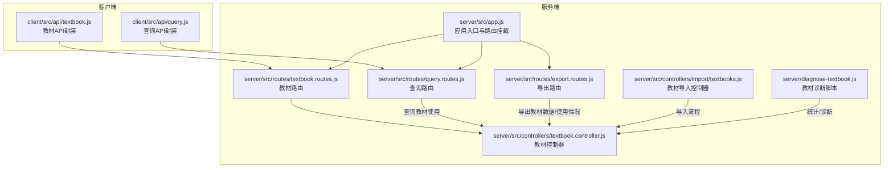
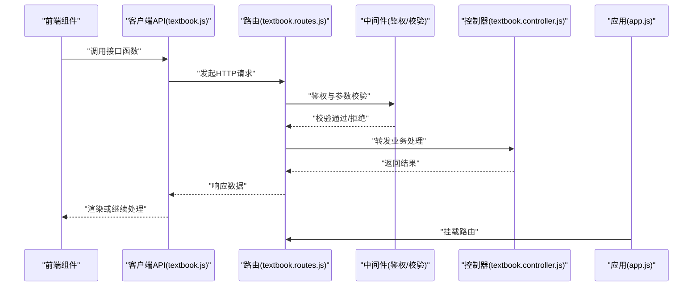
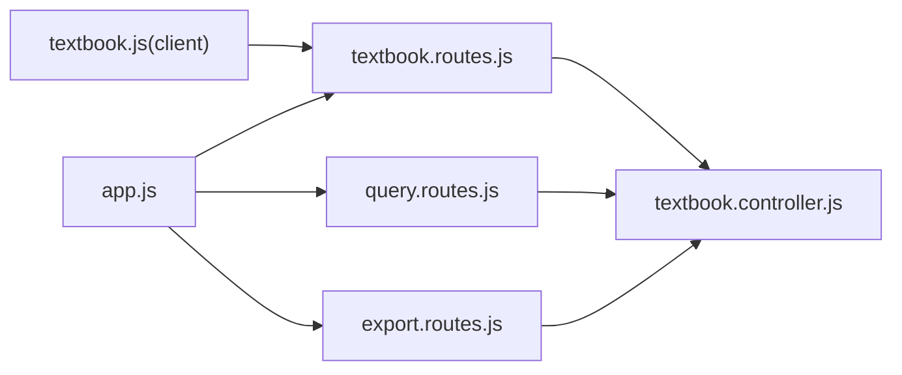

# 教材管理接口

<cite>
**本文引用的文件**
- [textbook.routes.js](file://server/src/routes/textbook.routes.js)
- [textbook.controller.js](file://server/src/controllers/textbook.controller.js)
- [textbook.js](file://client/src/api/textbook.js)
- [query.routes.js](file://server/src/routes/query.routes.js)
- [export.routes.js](file://server/src/routes/export.routes.js)
- [textbooks.js](file://server/src/controllers/import/textbooks.js)
- [diagnose-textbook.js](file://server/diagnose-textbook.js)
- [app.js](file://server/src/app.js)
</cite>

## 目录
1. [简介](#简介)
2. [项目结构](#项目结构)
3. [核心组件](#核心组件)
4. [架构总览](#架构总览)
5. [详细组件分析](#详细组件分析)
6. [依赖分析](#依赖分析)
7. [性能考虑](#性能考虑)
8. [故障排查指南](#故障排查指南)
9. [结论](#结论)
10. [附录](#附录)

## 简介
本文件为“教材管理接口”的权威API文档，覆盖教材信息的全生命周期管理能力，包括：
- 教材基本信息与元数据：教材编号规则、教材名称、作者、出版社、出版年份、ISBN等字段定义
- 教材列表查询、创建、更新、删除、状态切换
- 教材与课程的关联关系说明
- 教材使用统计功能的实现细节与扩展点

本接口体系由服务端路由与控制器、客户端API封装、以及查询与导出接口共同组成，确保前后端一致的数据契约与安全策略。

## 项目结构
教材管理接口位于服务端路由层与控制器层，并通过客户端API模块进行调用；查询与导出模块提供使用统计与数据导出能力。

图表来源
- [app.js:1-157](file://server/src/app.js#L1-L157)
- [textbook.routes.js:1-49](file://server/src/routes/textbook.routes.js#L1-L49)
- [textbook.controller.js](file://server/src/controllers/textbook.controller.js)
- [query.routes.js:1-26](file://server/src/routes/query.routes.js#L1-L26)
- [export.routes.js:40-74](file://server/src/routes/export.routes.js#L40-L74)
- [textbook.js:1-7](file://client/src/api/textbook.js#L1-L7)

章节来源
- [app.js:1-157](file://server/src/app.js#L1-L157)
- [textbook.routes.js:1-49](file://server/src/routes/textbook.routes.js#L1-L49)
- [textbook.controller.js](file://server/src/controllers/textbook.controller.js)
- [textbook.js:1-7](file://client/src/api/textbook.js#L1-L7)
- [query.routes.js:1-26](file://server/src/routes/query.routes.js#L1-L26)
- [export.routes.js:40-74](file://server/src/routes/export.routes.js#L40-L74)
- [textbooks.js](file://server/src/controllers/import/textbooks.js)
- [diagnose-textbook.js:16-54](file://server/diagnose-textbook.js#L16-L54)

## 核心组件
- 路由层（教材）：定义教材资源的REST接口，包含列表、创建、更新、删除、状态切换等端点，并统一接入鉴权与参数校验中间件。
- 控制器层（教材）：实现具体业务逻辑，负责数据持久化、关联关系处理与响应格式化。
- 客户端API封装：对HTTP请求进行统一封装，便于前端组件复用。
- 查询与导出：提供教材使用统计查询与导出能力，支持按教材ID查询使用详情与全局概览。

章节来源
- [textbook.routes.js:1-49](file://server/src/routes/textbook.routes.js#L1-L49)
- [textbook.controller.js](file://server/src/controllers/textbook.controller.js)
- [textbook.js:1-7](file://client/src/api/textbook.js#L1-L7)
- [query.routes.js:1-26](file://server/src/routes/query.routes.js#L1-L26)
- [export.routes.js:40-74](file://server/src/routes/export.routes.js#L40-L74)

## 架构总览
教材管理接口遵循“路由 -> 中间件 -> 控制器 -> 数据层”的分层设计，安全与数据一致性通过中间件保障。

图表来源
- [textbook.routes.js:1-49](file://server/src/routes/textbook.routes.js#L1-L49)
- [textbook.controller.js](file://server/src/controllers/textbook.controller.js)
- [textbook.js:1-7](file://client/src/api/textbook.js#L1-L7)
- [app.js:1-157](file://server/src/app.js#L1-L157)

## 详细组件分析

### 接口清单与规范

- 列表查询
  - 方法与路径：GET /api/textbooks
  - 权限：所有登录用户
  - 功能：返回教材列表（可结合分页与筛选条件）
  - 响应：数组对象，每项包含教材基础元数据
  - 参考路径：[textbook.routes.js:20-21](file://server/src/routes/textbook.routes.js#L20-L21)

- 创建教材
  - 方法与路径：POST /api/textbooks
  - 权限：admin 或 super_admin
  - 请求体：教材创建所需字段（见“字段定义”）
  - 响应：新创建的教材对象
  - 参考路径：[textbook.routes.js:24-30](file://server/src/routes/textbook.routes.js#L24-L30)

- 更新教材
  - 方法与路径：PUT /api/textbooks/:id
  - 权限：admin 或 super_admin
  - 参数：id（路径参数）
  - 请求体：教材更新字段
  - 响应：更新后的教材对象
  - 参考路径：[textbook.routes.js:31-38](file://server/src/routes/textbook.routes.js#L31-L38)

- 删除教材
  - 方法与路径：DELETE /api/textbooks/:id
  - 权限：admin 或 super_admin
  - 参数：id（路径参数）
  - 响应：删除结果
  - 参考路径：[textbook.routes.js](file://server/src/routes/textbook.routes.js#L39)

- 切换教材状态
  - 方法与路径：POST /api/textbooks/:id/toggle-status
  - 权限：admin 或 super_admin
  - 参数：id（路径参数）
  - 请求体：状态切换相关字段（如启用/停用）
  - 响应：切换后的状态
  - 参考路径：[textbook.routes.js:40-47](file://server/src/routes/textbook.routes.js#L40-L47)

- 字段定义
  - 教材编号：唯一标识，用于系统内引用与展示
  - 教材名称：教材标题
  - 作者：作者列表（字符串数组或对象数组，视模型而定）
  - 出版社：出版社名称
  - 出版年份：整数型年份
  - ISBN：国际标准书号（唯一性约束建议）
  - 其他元数据：创建时间、更新时间、状态等
  - 关联课程：教材与课程的多对多关系（通过方案/计划或直接关联）

章节来源
- [textbook.routes.js:1-49](file://server/src/routes/textbook.routes.js#L1-L49)

### 字段定义与编号规则

- 编号规则
  - 建议采用“年份+序号”或“机构码+流水号”等可扩展规则，保证全局唯一且具备可读性
  - 建议在创建与更新时进行唯一性校验，防止重复
- 关键字段
  - 教材编号：字符串，唯一索引
  - 教材名称：字符串，必填
  - 作者：字符串数组或作者对象数组
  - 出版社：字符串
  - 出版年份：整数，范围校验（如1000-2026）
  - ISBN：字符串，建议唯一性与格式校验
  - 状态：枚举值（启用/停用），默认启用
  - 关联课程：课程ID集合或课程对象集合（取决于模型设计）

章节来源
- [textbook.controller.js](file://server/src/controllers/textbook.controller.js)

### 教材与课程的关联关系

- 关联方式
  - 直接关联：教材表维护课程ID集合或通过中间表建立多对多
  - 方案/计划关联：通过“培养方案-课程-教材”三级联动，间接建立关系
- 关联稳定性
  - 在课程排序或方案调整时，应避免丢失教材关联（参考计划路由中的排序优化实践）
- 使用统计
  - 可基于课程-班级-教师-教材的链路统计使用数量与分布

章节来源
- [plan.routes.js:92-94](file://server/src/routes/plan.routes.js#L92-L94)
- [diagnose-textbook.js:36-54](file://server/diagnose-textbook.js#L36-L54)

### 教材使用统计与导出

- 统计查询
  - 按教材ID查询使用详情：GET /api/query/textbook/:id
  - 全局教材使用概览：GET /api/query/textbooks
  - 参考路径：[query.routes.js:16-24](file://server/src/routes/query.routes.js#L16-L24)
- 导出能力
  - 导出教材数据：GET /api/export/textbooks
  - 导出教材使用详情：GET /api/export/textbook/:id
  - 参考路径：[export.routes.js:52-72](file://server/src/routes/export.routes.js#L52-L72)
- 诊断脚本
  - 提供教材组合分布与教师使用情况统计，辅助分析与报表生成
  - 参考路径：[diagnose-textbook.js:16-54](file://server/diagnose-textbook.js#L16-L54)

章节来源
- [query.routes.js:1-26](file://server/src/routes/query.routes.js#L1-L26)
- [export.routes.js:40-74](file://server/src/routes/export.routes.js#L40-L74)
- [diagnose-textbook.js:16-54](file://server/diagnose-textbook.js#L16-L54)

### 客户端调用封装

- 封装函数
  - 获取列表：getTextbooks()
  - 创建：createTextbook(data)
  - 更新：updateTextbook(id, data)
  - 删除：deleteTextbook(id)
  - 切换状态：toggleTextbookStatus(id)
- 参考路径：[textbook.js:1-7](file://client/src/api/textbook.js#L1-L7)

章节来源
- [textbook.js:1-7](file://client/src/api/textbook.js#L1-L7)

### 导入流程（扩展能力）

- 导入控制器
  - 提供批量导入教材数据的能力，建议包含去重、校验与错误汇总
- 参考路径：[textbooks.js](file://server/src/controllers/import/textbooks.js)

章节来源
- [textbooks.js](file://server/src/controllers/import/textbooks.js)

## 依赖分析

图表来源
- [app.js:1-157](file://server/src/app.js#L1-L157)
- [textbook.routes.js:1-49](file://server/src/routes/textbook.routes.js#L1-L49)
- [textbook.controller.js](file://server/src/controllers/textbook.controller.js)
- [query.routes.js:1-26](file://server/src/routes/query.routes.js#L1-L26)
- [export.routes.js:40-74](file://server/src/routes/export.routes.js#L40-L74)
- [textbook.js:1-7](file://client/src/api/textbook.js#L1-L7)

章节来源
- [app.js:1-157](file://server/src/app.js#L1-L157)
- [textbook.routes.js:1-49](file://server/src/routes/textbook.routes.js#L1-L49)
- [textbook.controller.js](file://server/src/controllers/textbook.controller.js)
- [query.routes.js:1-26](file://server/src/routes/query.routes.js#L1-L26)
- [export.routes.js:40-74](file://server/src/routes/export.routes.js#L40-L74)
- [textbook.js:1-7](file://client/src/api/textbook.js#L1-L7)

## 性能考虑
- 分页与筛选：列表查询建议支持分页与常用筛选条件，降低单次响应体积
- 索引优化：对教材编号、ISBN、名称等高频查询字段建立数据库索引
- 批量操作：导入/导出场景建议采用流式处理与异步任务，避免阻塞主线程
- 缓存策略：对只读统计类数据可引入短期缓存，减少重复计算

## 故障排查指南
- 权限不足
  - 现象：403 Forbidden
  - 处理：确认用户角色是否为 admin 或 super_admin
- 参数校验失败
  - 现象：400 Bad Request
  - 处理：检查请求体字段类型与必填项，确保符合教材模型要求
- 资源不存在
  - 现象：404 Not Found
  - 处理：确认教材ID是否正确
- 冲突或唯一性违反
  - 现象：409 Conflict 或唯一性约束错误
  - 处理：检查教材编号、ISBN是否已存在
- 导出/统计异常
  - 现象：导出失败或统计为空
  - 处理：检查关联关系完整性与数据一致性，必要时运行诊断脚本

章节来源
- [textbook.routes.js:1-49](file://server/src/routes/textbook.routes.js#L1-L49)
- [textbook.controller.js](file://server/src/controllers/textbook.controller.js)
- [diagnose-textbook.js:16-54](file://server/diagnose-textbook.js#L16-L54)

## 结论
教材管理接口提供了从基础增删改查到使用统计与导出的完整能力，配合严格的权限控制与参数校验，能够满足教学管理场景下的教材全生命周期管理需求。建议在生产环境中进一步完善索引、缓存与批量处理机制，并持续通过诊断工具监控数据质量与使用分布。

## 附录

### 接口一览表（摘要）
- GET /api/textbooks —— 列表查询
- POST /api/textbooks —— 创建
- PUT /api/textbooks/:id —— 更新
- DELETE /api/textbooks/:id —— 删除
- POST /api/textbooks/:id/toggle-status —— 切换状态
- GET /api/query/textbook/:id —— 教材使用详情
- GET /api/query/textbooks —— 教材使用概览
- GET /api/export/textbooks —— 导出教材数据
- GET /api/export/textbook/:id —— 导出教材使用详情

章节来源
- [textbook.routes.js:1-49](file://server/src/routes/textbook.routes.js#L1-L49)
- [query.routes.js:1-26](file://server/src/routes/query.routes.js#L1-L26)
- [export.routes.js:40-74](file://server/src/routes/export.routes.js#L40-L74)