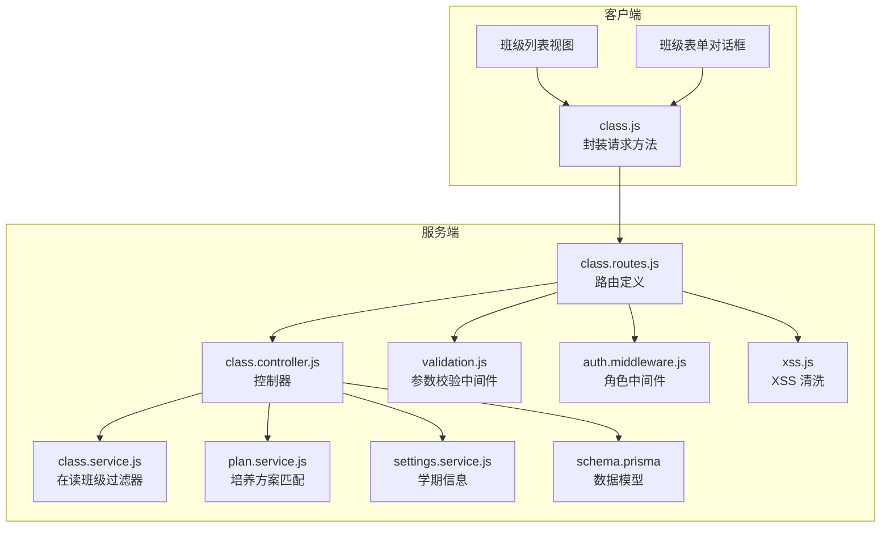
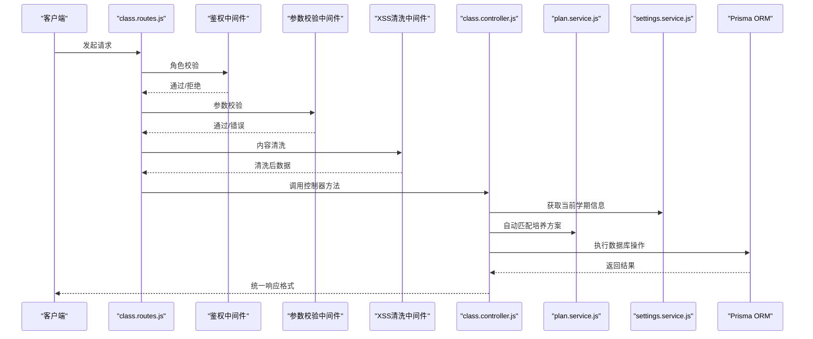
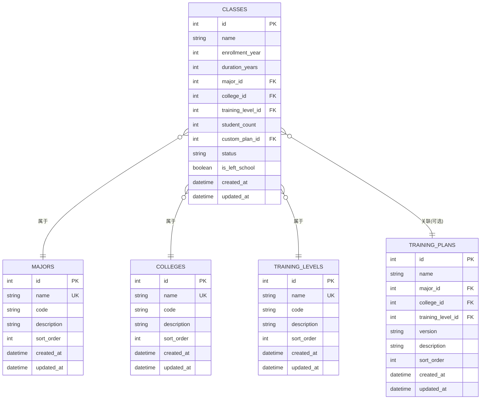
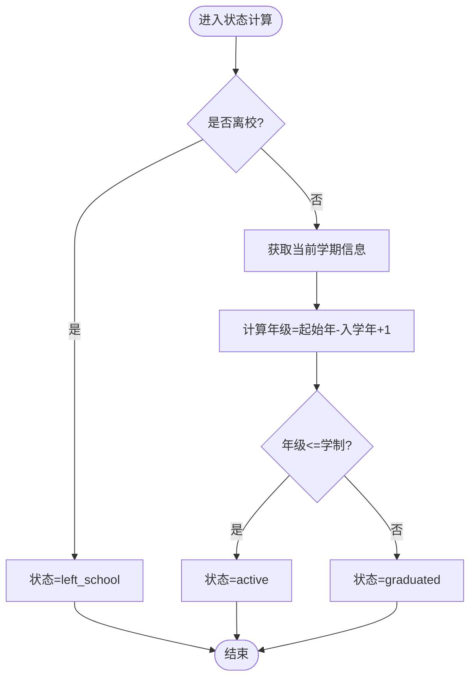
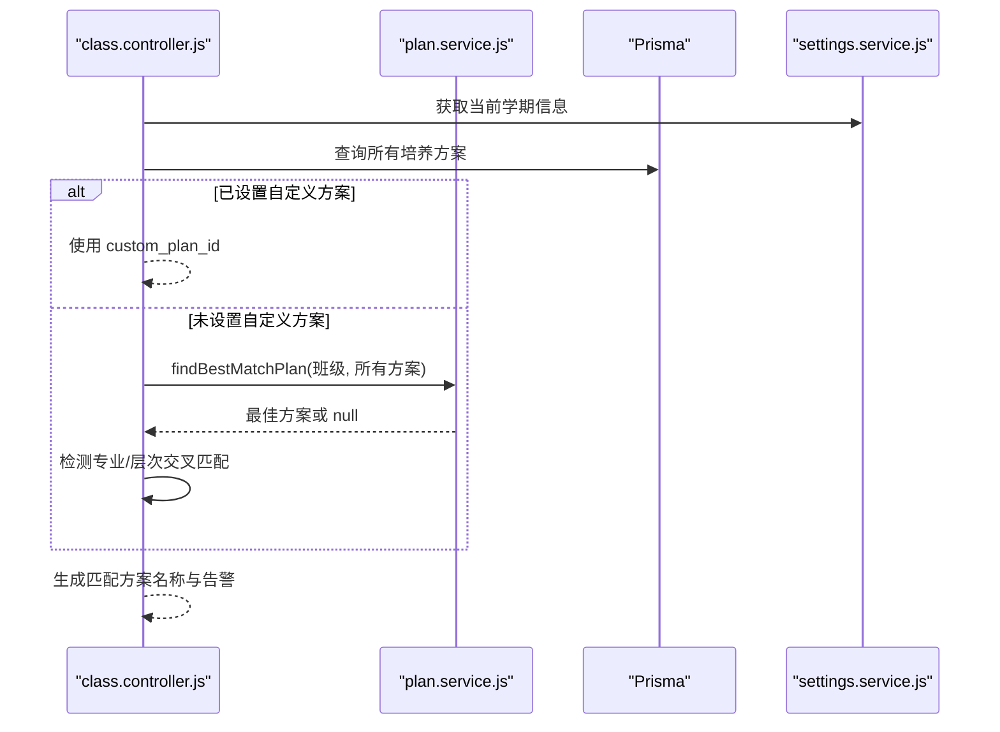
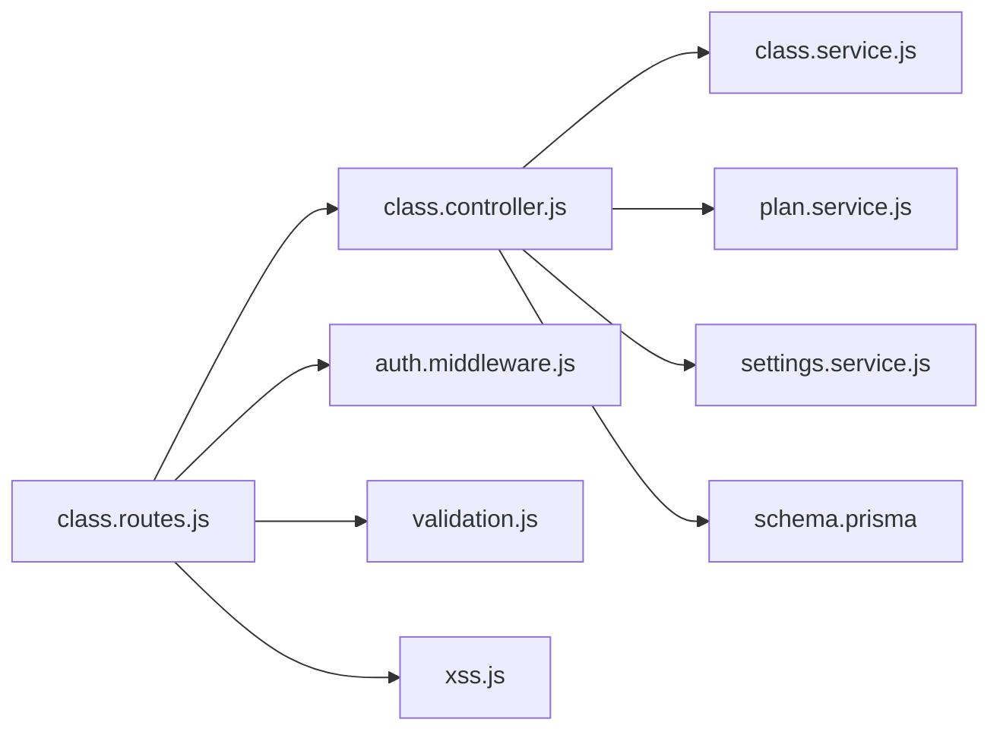

# 班级管理接口

<cite>
**本文引用的文件**
- [server/src/controllers/class.controller.js](file://server/src/controllers/class.controller.js)
- [server/src/routes/class.routes.js](file://server/src/routes/class.routes.js)
- [server/src/services/class.service.js](file://server/src/services/class.service.js)
- [server/src/services/plan.service.js](file://server/src/services/plan.service.js)
- [server/src/middleware/validation.js](file://server/src/middleware/validation.js)
- [server/src/utils/response.js](file://server/src/utils/response.js)
- [server/src/utils/error.js](file://server/src/utils/error.js)
- [server/src/services/settings.service.js](file://server/src/services/settings.service.js)
- [server/prisma/schema.prisma](file://server/prisma/schema.prisma)
- [client/src/api/class.js](file://client/src/api/class.js)
</cite>

## 目录
1. [简介](#简介)
2. [项目结构](#项目结构)
3. [核心组件](#核心组件)
4. [架构总览](#架构总览)
5. [详细组件分析](#详细组件分析)
6. [依赖关系分析](#依赖关系分析)
7. [性能考虑](#性能考虑)
8. [故障排查指南](#故障排查指南)
9. [结论](#结论)
10. [附录](#附录)

## 简介
本文件为“班级管理接口”的完整技术文档，覆盖班级全生命周期管理能力，包括：
- 班级列表查询与筛选
- 班级创建与基础字段校验
- 班级信息更新与动态状态计算
- 班级删除与前置校验
- 班级与培养方案的自动匹配机制
- 关键字段说明：班级编号规则、所属专业/学院关联、年级设置、班级容量等

文档面向后端开发者、前端对接人员与测试工程师，提供接口参数规范、数据验证规则、业务逻辑约束及实现细节，并给出使用示例与排障建议。

## 项目结构
班级管理模块采用前后端分离架构，后端基于 Express + Prisma，前端基于 Vue 3 + Element Plus，通过统一的 HTTP 接口进行交互。

图表来源
- [server/src/routes/class.routes.js:1-34](file://server/src/routes/class.routes.js#L1-L34)
- [server/src/controllers/class.controller.js:1-464](file://server/src/controllers/class.controller.js#L1-L464)
- [server/src/services/class.service.js:1-52](file://server/src/services/class.service.js#L1-L52)
- [server/src/services/plan.service.js](file://server/src/services/plan.service.js)
- [server/src/services/settings.service.js](file://server/src/services/settings.service.js)
- [server/src/middleware/validation.js](file://server/src/middleware/validation.js)
- [server/prisma/schema.prisma:28-54](file://server/prisma/schema.prisma#L28-L54)

章节来源
- [server/src/routes/class.routes.js:1-34](file://server/src/routes/class.routes.js#L1-L34)
- [client/src/api/class.js:1-8](file://client/src/api/class.js#L1-L8)

## 核心组件
- 路由层：定义班级管理相关 REST 接口，绑定鉴权与参数校验中间件。
- 控制器层：实现业务逻辑，包括列表查询、创建、更新、删除、统计等。
- 服务层：
  - 在读班级过滤器：根据当前学期与学制动态生成“在读”班级查询条件。
  - 培养方案匹配：为班级自动选择最合适的培养方案，并检测专业与层次交叉匹配风险。
  - 系统设置：获取当前学期信息以计算班级状态。
- 数据模型：Prisma 定义 classes、majors、colleges、training_levels、training_plans 等实体及其关系。
- 前端 API 封装：统一的 GET/POST/PUT/DELETE 方法，供页面组件调用。

章节来源
- [server/src/controllers/class.controller.js:1-464](file://server/src/controllers/class.controller.js#L1-L464)
- [server/src/services/class.service.js:1-52](file://server/src/services/class.service.js#L1-L52)
- [server/prisma/schema.prisma:28-54](file://server/prisma/schema.prisma#L28-L54)

## 架构总览
班级管理接口遵循“路由 -> 中间件 -> 控制器 -> 服务/数据库”的分层设计，确保职责清晰、可测试性强。

图表来源
- [server/src/routes/class.routes.js:1-34](file://server/src/routes/class.routes.js#L1-L34)
- [server/src/controllers/class.controller.js:1-464](file://server/src/controllers/class.controller.js#L1-L464)
- [server/src/services/plan.service.js](file://server/src/services/plan.service.js)
- [server/src/services/settings.service.js](file://server/src/services/settings.service.js)
- [server/src/middleware/validation.js](file://server/src/middleware/validation.js)

## 详细组件分析

### 数据模型与关键字段
classes 表的关键字段与约束如下：
- 字段
  - id: 主键
  - name: 班级名称（字符串）
  - enrollment_year: 入学年份（整数）
  - duration_years: 学制（整数）
  - major_id: 所属专业（外键，可空）
  - college_id: 所属学院（外键，可空）
  - training_level_id: 培养层次（外键，可空）
  - student_count: 班级容量（整数，默认 0）
  - custom_plan_id: 自定义培养方案（外键，可空）
  - status: 状态（默认 active；支持 active/left_school/graduated）
  - is_left_school: 是否离校（布尔，默认 false）
  - created_at/updated_at: 时间戳
- 关系
  - classes.majors、classes.colleges、classes.training_levels、classes.training_plans
  - classes.teaching_assignments（排课记录）

图表来源
- [server/prisma/schema.prisma:28-54](file://server/prisma/schema.prisma#L28-L54)
- [server/prisma/schema.prisma:87-97](file://server/prisma/schema.prisma#L87-L97)
- [server/prisma/schema.prisma:178-189](file://server/prisma/schema.prisma#L178-L189)
- [server/prisma/schema.prisma:191-211](file://server/prisma/schema.prisma#L191-L211)

章节来源
- [server/prisma/schema.prisma:28-54](file://server/prisma/schema.prisma#L28-L54)

### 接口清单与规范

#### 1) 获取班级统计信息
- 方法与路径
  - GET /api/classes/stats
- 权限要求
  - 登录用户
- 功能描述
  - 返回在读班级总数与在读学生总人数
- 响应体
  - totalClasses: number
  - totalStudents: number
- 使用场景
  - 仪表盘概览、数据看板

章节来源
- [server/src/controllers/class.controller.js:28-43](file://server/src/controllers/class.controller.js#L28-L43)
- [server/src/routes/class.routes.js:16-19](file://server/src/routes/class.routes.js#L16-L19)

#### 2) 查询班级列表
- 方法与路径
  - GET /api/classes
- 权限要求
  - 登录用户（分页中间件限制最大每页数量）
- 请求参数（查询字符串）
  - page: number（默认 1）
  - pageSize: number（默认 20，最大 100）
  - filters: JSON 字符串（由前端构建，后端解析为 where 条件）
- 响应体
  - items: 班级数组（包含关联信息与动态状态）
  - total: number
  - allEnrollmentYears: number[]
  - collegeMajorRelation: Record<number, number[]>
  - collegeLevelRelation: Record<number, number[]>
  - majorLevelRelation: Record<number, number[]>
  - collegeYearRelation: Record<number, number[]>
  - majorYearRelation: Record<number, number[]>
  - levelYearRelation: Record<number, number[]>
  - planCollegeRelation: Record<number, number[]>
  - planMajorRelation: Record<number, number[]>
  - planLevelRelation: Record<number, number[]>
- 业务逻辑
  - 自动匹配培养方案：若未设置 custom_plan_id，则基于专业、层次与当前学期推断最佳方案
  - 交叉匹配告警：当同时存在专业与层次的多个匹配方案时，返回告警提示
  - 动态状态：根据 enrollment_year、duration_years 与当前学期计算 active/graduated/left_school

章节来源
- [server/src/controllers/class.controller.js:45-242](file://server/src/controllers/class.controller.js#L45-L242)
- [server/src/routes/class.routes.js](file://server/src/routes/class.routes.js#L21)

#### 3) 创建班级
- 方法与路径
  - POST /api/classes
- 权限要求
  - admin 或 super_admin
- 请求体
  - name: 必填（字符串）
  - enrollment_year: 必填（整数）
  - duration_years: 必填（整数）
  - training_level_id: 必填（整数）
  - major_id: 可选（整数）
  - college_id: 可选（整数）
  - student_count: 可选（整数，默认 0）
  - custom_plan_id: 可选（整数）
  - is_left_school: 可选（布尔，默认 false）
- 校验规则
  - 必填字段缺失时抛出参数错误
  - 数字字段转换为 Number，null/空字符串转为 null
- 状态计算
  - 若 is_left_school 为真，状态强制为 left_school
  - 否则根据当前学期与 enrollment_year/duration_years 计算 grade 并判定 active/graduated
- 响应
  - 返回新创建的班级对象（包含关联信息）
- 审计日志
  - 成功/失败均写入审计日志

章节来源
- [server/src/controllers/class.controller.js:244-314](file://server/src/controllers/class.controller.js#L244-L314)
- [server/src/middleware/validation.js](file://server/src/middleware/validation.js)
- [server/src/utils/response.js](file://server/src/utils/response.js)
- [server/src/utils/error.js](file://server/src/utils/error.js)

#### 4) 更新班级
- 方法与路径
  - PUT /api/classes/:id
- 权限要求
  - admin 或 super_admin
- 路径参数
  - id: 班级主键（正整数）
- 请求体
  - name/enrollment_year/duration_years/major_id/college_id/training_level_id/student_count/custom_plan_id/is_left_school: 可选（部分字段可单独更新）
- 校验规则
  - id 参数校验
  - 参数清洗与校验中间件
- 业务逻辑
  - 若 is_left_school 为真，且当前处于有效学期，将级联删除当前学期的排课记录，释放教师课时容量
  - 动态状态重新计算：若 enrollment_year/duration_years 之一变更，按新值计算
- 响应
  - 返回更新后的班级对象
- 审计日志
  - 成功/失败均写入审计日志，并在删除排课时附加删除数量

章节来源
- [server/src/controllers/class.controller.js:316-418](file://server/src/controllers/class.controller.js#L316-L418)
- [server/src/middleware/validation.js](file://server/src/middleware/validation.js)

#### 5) 删除班级
- 方法与路径
  - DELETE /api/classes/:id
- 权限要求
  - admin 或 super_admin
- 前置校验
  - 若班级存在排课记录，禁止删除并返回提示
- 响应
  - 返回成功消息
- 审计日志
  - 成功/失败均写入审计日志

章节来源
- [server/src/controllers/class.controller.js:420-463](file://server/src/controllers/class.controller.js#L420-L463)
- [server/src/utils/error.js](file://server/src/utils/error.js)

### 班级状态与年级计算
- 状态类型
  - active：在读
  - graduated：已毕业
  - left_school：已离校
- 年级计算
  - 依据当前学期起始年份与 enrollment_year 计算 grade
  - grade <= duration_years 为 active，否则为 graduated
- 在读班级过滤
  - 通过 getActiveClassFilter 构建 OR 条件，结合缓存优化学制集合

图表来源
- [server/src/controllers/class.controller.js:10-26](file://server/src/controllers/class.controller.js#L10-L26)
- [server/src/services/class.service.js:23-51](file://server/src/services/class.service.js#L23-L51)
- [server/src/services/settings.service.js](file://server/src/services/settings.service.js)

章节来源
- [server/src/controllers/class.controller.js:10-26](file://server/src/controllers/class.controller.js#L10-L26)
- [server/src/services/class.service.js:1-52](file://server/src/services/class.service.js#L1-L52)

### 培养方案自动匹配机制
- 匹配策略
  - 若设置了 custom_plan_id，则直接使用该方案
  - 否则调用 findBestMatchPlan，按“专业优先、层次优先”的原则选择最佳方案
- 交叉匹配检测
  - 当同时存在多个专业匹配与多个层次匹配时，生成交叉匹配告警，提示用户核对
- 性能优化
  - 预加载所有培养方案，减少重复查询
  - 对学制集合做短期缓存，降低频繁查询成本

图表来源
- [server/src/controllers/class.controller.js:74-126](file://server/src/controllers/class.controller.js#L74-L126)
- [server/src/services/plan.service.js](file://server/src/services/plan.service.js)
- [server/src/services/settings.service.js](file://server/src/services/settings.service.js)

章节来源
- [server/src/controllers/class.controller.js:74-126](file://server/src/controllers/class.controller.js#L74-L126)

### 前端集成要点
- API 方法封装
  - getClasses(params)、getClassStats()、createClass(data)、updateClass(id, data)、deleteClass(id)
- 页面组件
  - 班级列表页：使用 getClasses 分页查询，展示动态状态与匹配方案
  - 班级表单：使用 createClass/updateClass/deleteClass 进行增删改
- 过滤与联动
  - 前端通过 filters 构建复杂查询条件，后端统一解析为 Prisma where 条件

章节来源
- [client/src/api/class.js:1-8](file://client/src/api/class.js#L1-L8)
- [server/src/controllers/class.controller.js:51-70](file://server/src/controllers/class.controller.js#L51-L70)

## 依赖关系分析
- 控制器依赖
  - 控制器依赖服务层（在读班级过滤、培养方案匹配、学期信息）与 Prisma 数据访问
  - 控制器依赖统一响应与错误处理工具
- 路由依赖
  - 路由绑定鉴权中间件、参数校验中间件与 XSS 清洗中间件
- 数据模型依赖
  - classes 与 majors、colleges、training_levels、training_plans 的多对一关系
  - classes 与 teaching_assignments 的一对多关系，删除时受外键约束影响

图表来源
- [server/src/routes/class.routes.js:1-34](file://server/src/routes/class.routes.js#L1-L34)
- [server/src/controllers/class.controller.js:1-464](file://server/src/controllers/class.controller.js#L1-L464)
- [server/src/services/class.service.js:1-52](file://server/src/services/class.service.js#L1-L52)
- [server/prisma/schema.prisma:28-54](file://server/prisma/schema.prisma#L28-L54)

章节来源
- [server/src/routes/class.routes.js:1-34](file://server/src/routes/class.routes.js#L1-L34)
- [server/src/controllers/class.controller.js:1-464](file://server/src/controllers/class.controller.js#L1-L464)
- [server/prisma/schema.prisma:28-54](file://server/prisma/schema.prisma#L28-L54)

## 性能考虑
- 缓存策略
  - 在读班级过滤器对学制集合做短期缓存，降低重复查询成本
- 查询优化
  - 列表查询合并多次关联查询为单次批量查询，减少往返
  - 使用索引覆盖常用查询字段（status、enrollment_year、major_id、training_level_id、college_id、custom_plan_id）
- 事务保障
  - 更新班级与级联删除排课记录置于同一事务，保证一致性
- 响应优化
  - 统一分页上限，避免超大页码导致性能问题

章节来源
- [server/src/services/class.service.js:4-51](file://server/src/services/class.service.js#L4-L51)
- [server/src/controllers/class.controller.js:128-136](file://server/src/controllers/class.controller.js#L128-L136)
- [server/src/controllers/class.controller.js:369-383](file://server/src/controllers/class.controller.js#L369-L383)
- [server/prisma/schema.prisma:48-53](file://server/prisma/schema.prisma#L48-L53)

## 故障排查指南
- 参数错误
  - 创建/更新时缺少必填字段会触发参数错误，检查必填项与数据类型
- 资源不存在
  - 更新/删除时若找不到班级，会抛出资源不存在错误
- 删除受限
  - 若班级存在排课记录，删除会被阻止并提示先清理排课
- 状态异常
  - 若 enrollment_year/duration_years 变更，需确认当前学期信息正确，避免状态误判
- 审计日志
  - 所有关键操作均有审计日志记录，便于追踪与复盘

章节来源
- [server/src/utils/error.js](file://server/src/utils/error.js)
- [server/src/controllers/class.controller.js:420-463](file://server/src/controllers/class.controller.js#L420-L463)
- [server/src/controllers/class.controller.js:316-418](file://server/src/controllers/class.controller.js#L316-L418)

## 结论
班级管理接口围绕“状态驱动 + 方案匹配 + 事务一致性 + 性能优化”的设计目标，提供了完整的班级生命周期管理能力。通过标准化的参数校验、统一的响应格式与完善的审计日志，既满足了业务需求，也兼顾了可维护性与可观测性。建议在实际使用中：
- 明确必填字段与业务约束，避免状态计算偏差
- 合理使用自定义培养方案与自动匹配，必要时人工干预交叉匹配告警
- 在批量操作时注意事务边界与索引覆盖，确保性能与一致性

## 附录

### 字段与规则对照表
- 必填字段
  - 创建：name、enrollment_year、duration_years、training_level_id
  - 更新：无固定必填，按需传入
- 关键字段说明
  - name：班级名称（唯一性由前端/业务约束保证）
  - enrollment_year：入学年份（整数）
  - duration_years：学制（整数）
  - major_id：所属专业（可空）
  - college_id：所属学院（可空）
  - training_level_id：培养层次（可空）
  - student_count：班级容量（整数，默认 0）
  - custom_plan_id：自定义培养方案（可空）
  - is_left_school：是否离校（布尔，默认 false）
  - status：状态（默认 active；支持 active/left_school/graduated）
- 班级编号规则
  - 当前实现未对班级编号进行强制规则约束，建议业务侧自行制定编号规则并在创建时校验
- 年级与状态
  - 依据当前学期起始年份与 enrollment_year/duration_years 计算 grade，决定 active/graduated/left_school
- 培养方案匹配
  - 优先使用 custom_plan_id；否则按专业/层次优先级自动匹配，并检测交叉匹配风险

章节来源
- [server/src/controllers/class.controller.js:257-259](file://server/src/controllers/class.controller.js#L257-L259)
- [server/src/controllers/class.controller.js:350-364](file://server/src/controllers/class.controller.js#L350-L364)
- [server/prisma/schema.prisma:28-54](file://server/prisma/schema.prisma#L28-L54)