# 课程管理接口

<cite>
**本文档引用的文件**
- [server/src/controllers/course.controller.js](file://server/src/controllers/course.controller.js)
- [server/src/routes/course.routes.js](file://server/src/routes/course.routes.js)
- [client/src/api/course.js](file://client/src/api/course.js)
- [server/src/middleware/validation.js](file://server/src/middleware/validation.js)
- [server/prisma/schema.prisma](file://server/prisma/schema.prisma)
- [client/src/views/course/CourseList.vue](file://client/src/views/course/CourseList.vue)
- [server/src/controllers/import/courses.js](file://server/src/controllers/import/courses.js)
- [client/src/components/CourseMatrix.vue](file://client/src/components/CourseMatrix.vue)
- [client/src/components/CourseMatrixTable.vue](file://client/src/components/CourseMatrixTable.vue)
- [client/src/components/CourseEditPopover.vue](file://client/src/components/CourseEditPopover.vue)
- [server/src/services/plan.service.js](file://server/src/services/plan.service.js)
- [server/src/controllers/teaching-arrange.controller.js](file://server/src/controllers/teaching-arrange.controller.js)
- [server/src/controllers/plan/plan-matrix.controller.js](file://server/src/controllers/plan/plan-matrix.controller.js)
</cite>

## 目录
1. [简介](#简介)
2. [项目结构](#项目结构)
3. [核心组件](#核心组件)
4. [架构概览](#架构概览)
5. [详细组件分析](#详细组件分析)
6. [依赖分析](#依赖分析)
7. [性能考虑](#性能考虑)
8. [故障排除指南](#故障排除指南)
9. [结论](#结论)

## 简介
本文件为课程管理接口的详细API文档，涵盖课程信息的完整管理流程，包括课程基本信息、学分学时设置、课程属性分类、开课学期安排等。文档详细说明课程编号、课程名称、学分、总学时、理论学时、实验学时、课程性质等字段定义，并提供课程列表查询、创建课程、更新课程信息、删除课程等接口规范。同时，文档阐述课程与培养方案的关联关系以及课程冲突检测机制。

## 项目结构
课程管理功能由前后端协同实现：
- 前端负责课程列表展示、导入导出、排序调整、弹窗编辑等交互
- 后端提供REST接口、参数验证、数据库操作、审计日志等服务
- 数据库采用Prisma ORM，模型定义清晰，支持课程与培养方案、排课记录、教师关联等多维关系

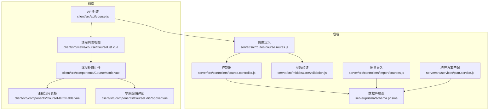

**图表来源**
- [client/src/api/course.js:1-7](file://client/src/api/course.js#L1-L7)
- [client/src/views/course/CourseList.vue:1-238](file://client/src/views/course/CourseList.vue#L1-L238)
- [client/src/components/CourseMatrix.vue:1-391](file://client/src/components/CourseMatrix.vue#L1-L391)
- [client/src/components/CourseMatrixTable.vue:1-480](file://client/src/components/CourseMatrixTable.vue#L1-L480)
- [client/src/components/CourseEditPopover.vue:1-186](file://client/src/components/CourseEditPopover.vue#L1-L186)
- [server/src/routes/course.routes.js:1-36](file://server/src/routes/course.routes.js#L1-L36)
- [server/src/controllers/course.controller.js:1-142](file://server/src/controllers/course.controller.js#L1-L142)
- [server/src/middleware/validation.js:1-590](file://server/src/middleware/validation.js#L1-L590)
- [server/src/controllers/import/courses.js:1-145](file://server/src/controllers/import/courses.js#L1-L145)
- [server/prisma/schema.prisma:70-85](file://server/prisma/schema.prisma#L70-L85)
- [server/src/services/plan.service.js:1-102](file://server/src/services/plan.service.js#L1-L102)

**章节来源**
- [server/src/controllers/course.controller.js:1-142](file://server/src/controllers/course.controller.js#L1-L142)
- [server/src/routes/course.routes.js:1-36](file://server/src/routes/course.routes.js#L1-L36)
- [client/src/api/course.js:1-7](file://client/src/api/course.js#L1-L7)
- [server/src/middleware/validation.js:150-163](file://server/src/middleware/validation.js#L150-L163)
- [server/prisma/schema.prisma:70-85](file://server/prisma/schema.prisma#L70-L85)
- [client/src/views/course/CourseList.vue:1-238](file://client/src/views/course/CourseList.vue#L1-L238)
- [server/src/controllers/import/courses.js:1-145](file://server/src/controllers/import/courses.js#L1-L145)
- [client/src/components/CourseMatrix.vue:1-391](file://client/src/components/CourseMatrix.vue#L1-L391)
- [client/src/components/CourseMatrixTable.vue:1-480](file://client/src/components/CourseMatrixTable.vue#L1-L480)
- [client/src/components/CourseEditPopover.vue:1-186](file://client/src/components/CourseEditPopover.vue#L1-L186)
- [server/src/services/plan.service.js:43-61](file://server/src/services/plan.service.js#L43-L61)

## 核心组件
本节概述课程管理的核心组件及其职责：
- 课程控制器：提供课程列表查询、创建、更新、删除接口，处理排序维护与审计日志
- 路由定义：定义HTTP端点、权限控制、参数验证链路
- 参数验证：对课程相关请求参数进行严格校验
- 数据库模型：courses表及关联关系定义
- 前端API封装：统一的HTTP请求封装
- 培养方案服务：提供课程与培养方案的匹配逻辑
- 导入功能：支持Excel批量导入课程

**章节来源**
- [server/src/controllers/course.controller.js:11-142](file://server/src/controllers/course.controller.js#L11-L142)
- [server/src/routes/course.routes.js:14-33](file://server/src/routes/course.routes.js#L14-L33)
- [server/src/middleware/validation.js:150-163](file://server/src/middleware/validation.js#L150-L163)
- [server/prisma/schema.prisma:70-85](file://server/prisma/schema.prisma#L70-L85)
- [client/src/api/course.js:1-7](file://client/src/api/course.js#L1-L7)
- [server/src/services/plan.service.js:43-61](file://server/src/services/plan.service.js#L43-L61)
- [server/src/controllers/import/courses.js:12-145](file://server/src/controllers/import/courses.js#L12-L145)

## 架构概览
课程管理的系统架构遵循前后端分离设计，前端通过API封装调用后端路由，后端控制器协调验证中间件、数据库操作与审计日志。

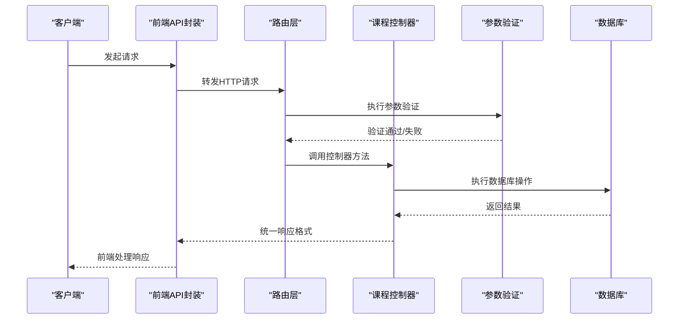

**图表来源**
- [client/src/api/course.js:1-7](file://client/src/api/course.js#L1-L7)
- [server/src/routes/course.routes.js:14-33](file://server/src/routes/course.routes.js#L14-L33)
- [server/src/controllers/course.controller.js:11-142](file://server/src/controllers/course.controller.js#L11-L142)
- [server/src/middleware/validation.js:7-35](file://server/src/middleware/validation.js#L7-L35)

## 详细组件分析

### 课程数据模型与字段定义
课程实体由Prisma模型定义，包含以下关键字段：
- id：主键
- name：课程名称（必填）
- code：课程编码（可选）
- type：课程类型（默认public，可选值：public、professional、elective）
- description：描述（可选）
- sort_order：排序值（整数，默认0）
- created_at/updated_at：时间戳

课程与多个实体存在关联关系：
- plan_courses：与培养方案课程的关联
- teacher_courses：与教师课程的关联
- teaching_assignments：与教学安排的关联

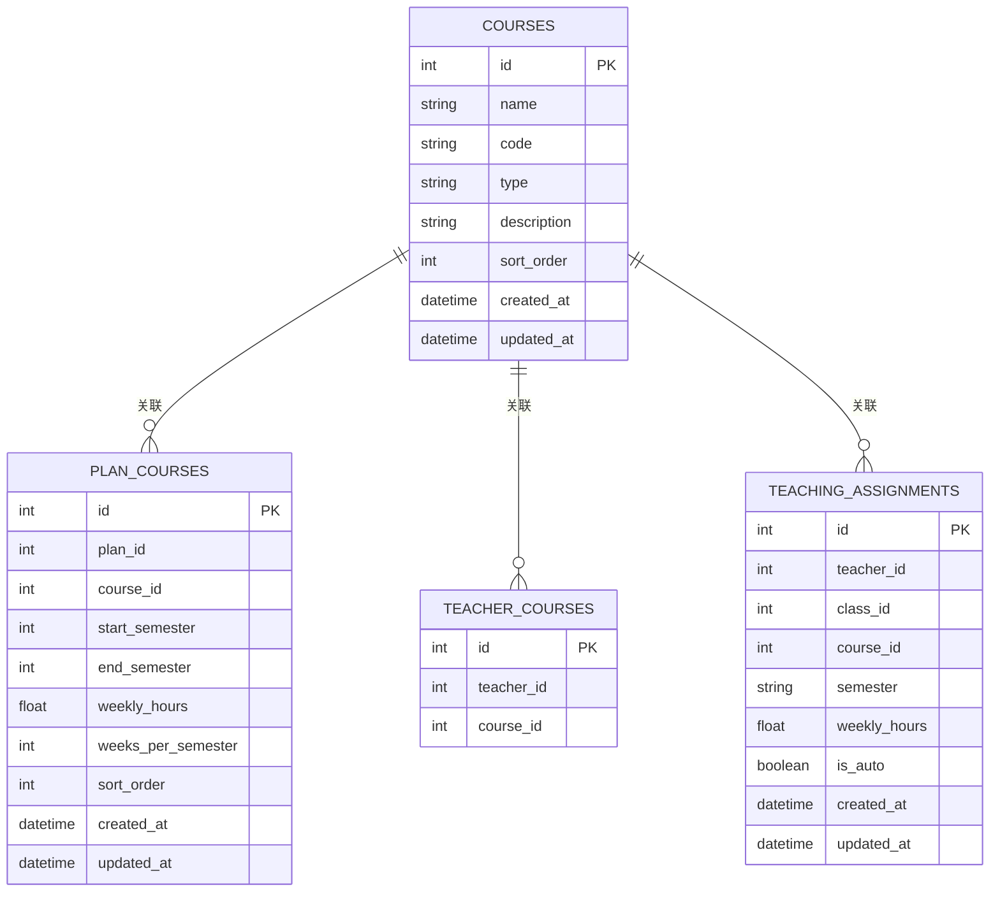

**图表来源**
- [server/prisma/schema.prisma:70-85](file://server/prisma/schema.prisma#L70-L85)
- [server/prisma/schema.prisma:115-134](file://server/prisma/schema.prisma#L115-L134)
- [server/prisma/schema.prisma:253-262](file://server/prisma/schema.prisma#L253-L262)
- [server/prisma/schema.prisma:286-307](file://server/prisma/schema.prisma#L286-L307)

**章节来源**
- [server/prisma/schema.prisma:70-85](file://server/prisma/schema.prisma#L70-L85)

### 课程管理接口规范

#### 1) 课程列表查询
- 方法：GET
- 路径：/api/courses
- 权限：所有登录用户
- 查询参数：
  - type：可选，按课程类型过滤
- 响应：课程列表（按sort_order升序）

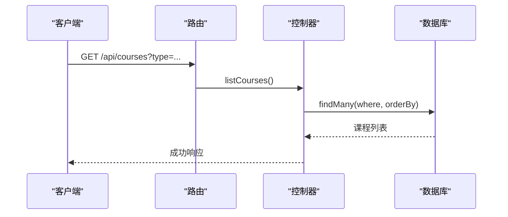

**图表来源**
- [server/src/routes/course.routes.js:14-15](file://server/src/routes/course.routes.js#L14-L15)
- [server/src/controllers/course.controller.js:11-21](file://server/src/controllers/course.controller.js#L11-L21)

**章节来源**
- [server/src/controllers/course.controller.js:11-21](file://server/src/controllers/course.controller.js#L11-L21)
- [server/src/routes/course.routes.js:14-15](file://server/src/routes/course.routes.js#L14-L15)

#### 2) 创建课程
- 方法：POST
- 路径：/api/courses
- 权限：admin、super_admin
- 请求体字段：
  - name：课程名称（必填）
  - code：课程编码（可选）
  - type：课程类型（可选，默认public）
  - description：描述（可选）
  - sort_order：排序值（可选）
- 响应：创建的课程对象

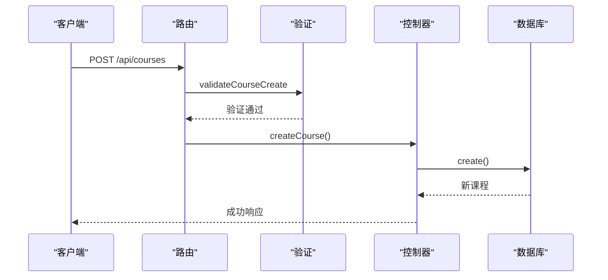

**图表来源**
- [server/src/routes/course.routes.js:18-24](file://server/src/routes/course.routes.js#L18-L24)
- [server/src/middleware/validation.js:410-421](file://server/src/middleware/validation.js#L410-L421)
- [server/src/controllers/course.controller.js:23-57](file://server/src/controllers/course.controller.js#L23-L57)

**章节来源**
- [server/src/controllers/course.controller.js:23-57](file://server/src/controllers/course.controller.js#L23-L57)
- [server/src/routes/course.routes.js:18-24](file://server/src/routes/course.routes.js#L18-L24)
- [server/src/middleware/validation.js:410-421](file://server/src/middleware/validation.js#L410-L421)

#### 3) 更新课程
- 方法：PUT
- 路径：/api/courses/:id
- 权限：admin、super_admin
- 路径参数：id（课程ID）
- 请求体字段（可选）：
  - name、code、type、description、sort_order
- 响应：更新后的课程对象

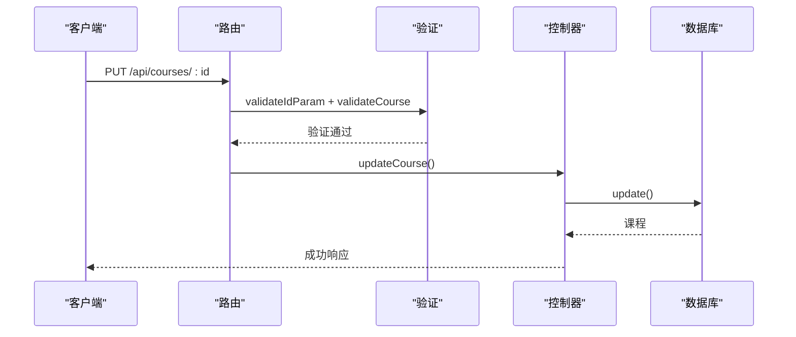

**图表来源**
- [server/src/routes/course.routes.js:25-32](file://server/src/routes/course.routes.js#L25-L32)
- [server/src/middleware/validation.js:130-133](file://server/src/middleware/validation.js#L130-L133)
- [server/src/middleware/validation.js:150-163](file://server/src/middleware/validation.js#L150-L163)
- [server/src/controllers/course.controller.js:59-94](file://server/src/controllers/course.controller.js#L59-L94)

**章节来源**
- [server/src/controllers/course.controller.js:59-94](file://server/src/controllers/course.controller.js#L59-L94)
- [server/src/routes/course.routes.js:25-32](file://server/src/routes/course.routes.js#L25-L32)
- [server/src/middleware/validation.js:130-133](file://server/src/middleware/validation.js#L130-L133)
- [server/src/middleware/validation.js:150-163](file://server/src/middleware/validation.js#L150-L163)

#### 4) 删除课程
- 方法：DELETE
- 路径：/api/courses/:id
- 权限：admin、super_admin
- 路径参数：id（课程ID）
- 关联检查：
  - 若课程已被培养方案使用，禁止删除
  - 若课程已有排课记录，禁止删除
  - 若课程已关联教师，禁止删除
- 响应：删除结果

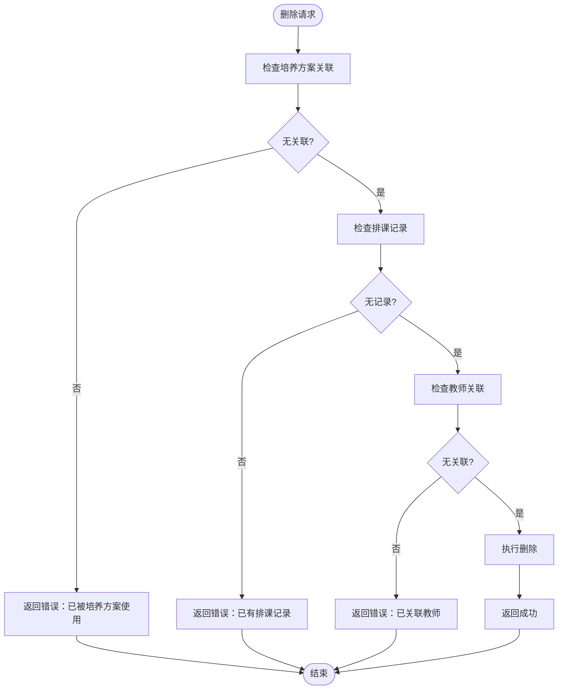

**图表来源**
- [server/src/controllers/course.controller.js:96-141](file://server/src/controllers/course.controller.js#L96-L141)

**章节来源**
- [server/src/controllers/course.controller.js:96-141](file://server/src/controllers/course.controller.js#L96-L141)

### 课程与培养方案的关联关系
课程与培养方案通过plan_courses表建立关联，支持以下配置：
- start_semester/end_semester：课程在培养方案中的开课学期范围
- weekly_hours：课程默认周课时
- weeks_per_semester：每学期周数
- sort_order：课程在方案中的排序

课程矩阵组件提供了可视化的课程安排界面，支持：
- 设置开课学期范围（起始/结束学期）
- 配置每学期周课时
- 关联教材
- 统一设置学期周数

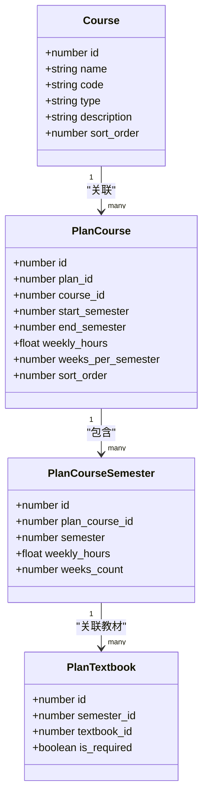

**图表来源**
- [server/prisma/schema.prisma:115-134](file://server/prisma/schema.prisma#L115-L134)
- [server/prisma/schema.prisma:99-113](file://server/prisma/schema.prisma#L99-L113)
- [server/prisma/schema.prisma:136-147](file://server/prisma/schema.prisma#L136-L147)

**章节来源**
- [client/src/components/CourseMatrix.vue:119-273](file://client/src/components/CourseMatrix.vue#L119-L273)
- [client/src/components/CourseEditPopover.vue:13-63](file://client/src/components/CourseEditPopover.vue#L13-L63)
- [server/src/controllers/plan/plan-matrix.controller.js:352-394](file://server/src/controllers/plan/plan-matrix.controller.js#L352-L394)

### 课程冲突检测机制
课程冲突检测主要体现在教学安排阶段，系统通过以下机制避免冲突：
- 教师工作量上限：根据标准/满负荷课时设置，检查教师当前学期总课时
- 教师可教课程：通过teacher_courses关联确保教师具备授课资格
- 学院/层次匹配：通过培养方案匹配逻辑（自定义方案 > 专业匹配 > 层次匹配）确保课程与班级的适配性
- 排课唯一性：按class_id、course_id、semester建立唯一约束，避免重复安排

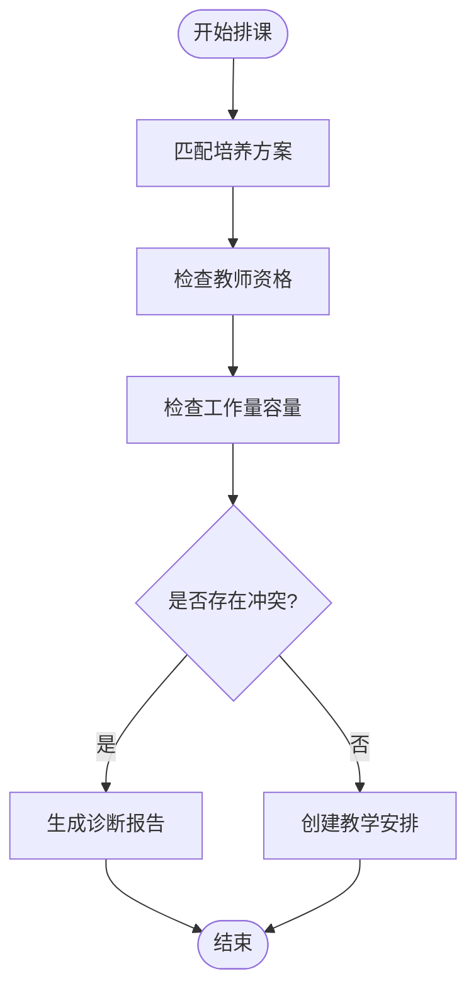

**图表来源**
- [server/src/services/plan.service.js:43-61](file://server/src/services/plan.service.js#L43-L61)
- [server/src/controllers/teaching-arrange.controller.js:188-214](file://server/src/controllers/teaching-arrange.controller.js#L188-L214)

**章节来源**
- [server/src/services/plan.service.js:43-61](file://server/src/services/plan.service.js#L43-L61)
- [server/src/controllers/teaching-arrange.controller.js:188-214](file://server/src/controllers/teaching-arrange.controller.js#L188-L214)

### 前端交互与用户体验
前端提供了丰富的课程管理界面：
- 课程列表：支持名称搜索、排序调整、导入导出
- 弹窗编辑：支持课程信息编辑、类型切换
- 课程矩阵：可视化展示课程在各学期的安排，支持学期设置、教材关联、批量操作

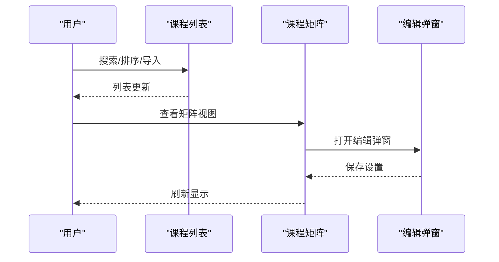

**图表来源**
- [client/src/views/course/CourseList.vue:169-225](file://client/src/views/course/CourseList.vue#L169-L225)
- [client/src/components/CourseMatrix.vue:119-199](file://client/src/components/CourseMatrix.vue#L119-L199)
- [client/src/components/CourseEditPopover.vue:13-63](file://client/src/components/CourseEditPopover.vue#L13-L63)

**章节来源**
- [client/src/views/course/CourseList.vue:169-225](file://client/src/views/course/CourseList.vue#L169-L225)
- [client/src/components/CourseMatrix.vue:119-199](file://client/src/components/CourseMatrix.vue#L119-L199)
- [client/src/components/CourseEditPopover.vue:13-63](file://client/src/components/CourseEditPopover.vue#L13-L63)

## 依赖分析
课程管理模块的依赖关系如下：

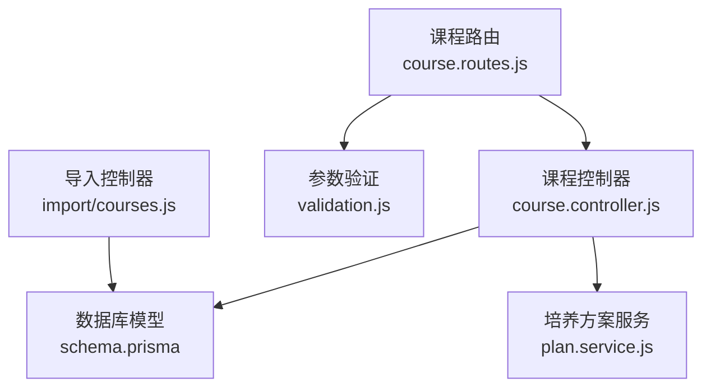

**图表来源**
- [server/src/controllers/course.controller.js:1-10](file://server/src/controllers/course.controller.js#L1-L10)
- [server/src/routes/course.routes.js:1-10](file://server/src/routes/course.routes.js#L1-L10)
- [server/src/middleware/validation.js:1-5](file://server/src/middleware/validation.js#L1-L5)
- [server/src/controllers/import/courses.js:1-7](file://server/src/controllers/import/courses.js#L1-L7)
- [server/prisma/schema.prisma:1-10](file://server/prisma/schema.prisma#L1-L10)
- [server/src/services/plan.service.js:1-3](file://server/src/services/plan.service.js#L1-L3)

**章节来源**
- [server/src/controllers/course.controller.js:1-10](file://server/src/controllers/course.controller.js#L1-L10)
- [server/src/routes/course.routes.js:1-10](file://server/src/routes/course.routes.js#L1-L10)
- [server/src/middleware/validation.js:1-5](file://server/src/middleware/validation.js#L1-L5)
- [server/src/controllers/import/courses.js:1-7](file://server/src/controllers/import/courses.js#L1-L7)
- [server/prisma/schema.prisma:1-10](file://server/prisma/schema.prisma#L1-L10)
- [server/src/services/plan.service.js:1-3](file://server/src/services/plan.service.js#L1-L3)

## 性能考虑
- 排序维护：系统自动维护sort_order，支持手动调整与自动修复
- 并发控制：批量操作（如统一设置学期周数）建议添加并发限制或批量更新端点
- 数据库索引：courses表针对type、code建立了索引，提升查询性能
- 前端优化：列表组件支持防抖搜索与虚拟滚动，提升大数据量下的交互体验

## 故障排除指南
常见问题与解决方案：
- 参数验证失败：检查请求体字段是否符合验证规则
- 课程删除失败：确认课程未被培养方案、排课记录或教师关联
- 导入失败：检查Excel格式与必填字段
- 排课冲突：检查教师工作量上限与课程容量

**章节来源**
- [server/src/middleware/validation.js:7-35](file://server/src/middleware/validation.js#L7-L35)
- [server/src/controllers/course.controller.js:96-141](file://server/src/controllers/course.controller.js#L96-L141)
- [server/src/controllers/import/courses.js:24-53](file://server/src/controllers/import/courses.js#L24-L53)

## 结论
课程管理接口提供了完整的课程生命周期管理能力，包括基础信息维护、培养方案关联、学期安排配置以及冲突检测机制。通过前后端协作与严格的参数验证，系统能够稳定支撑课程管理工作流。建议在生产环境中关注批量操作的并发控制与数据库性能优化，以进一步提升用户体验。