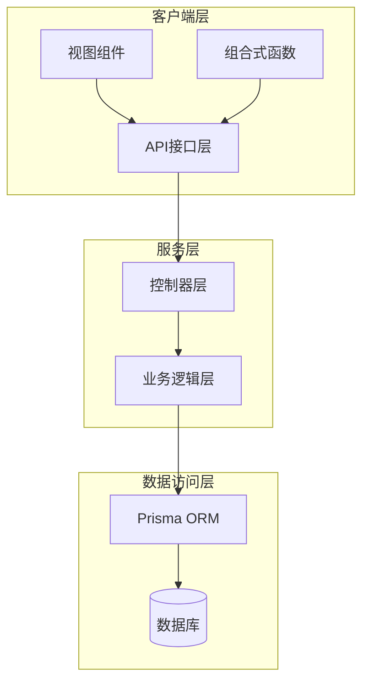
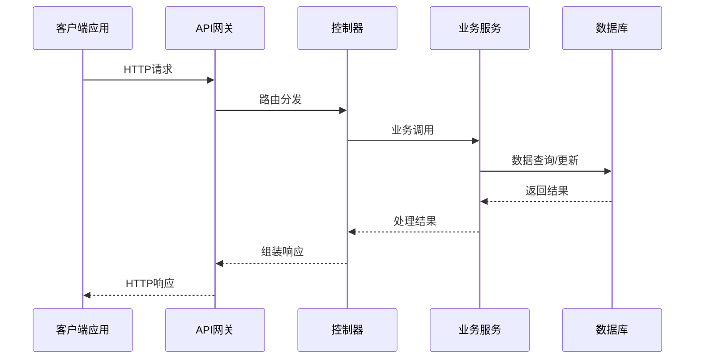
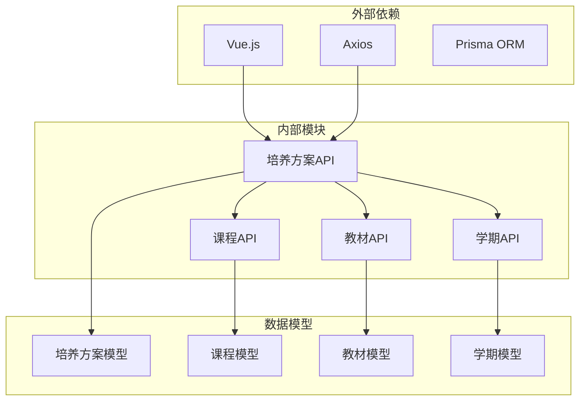
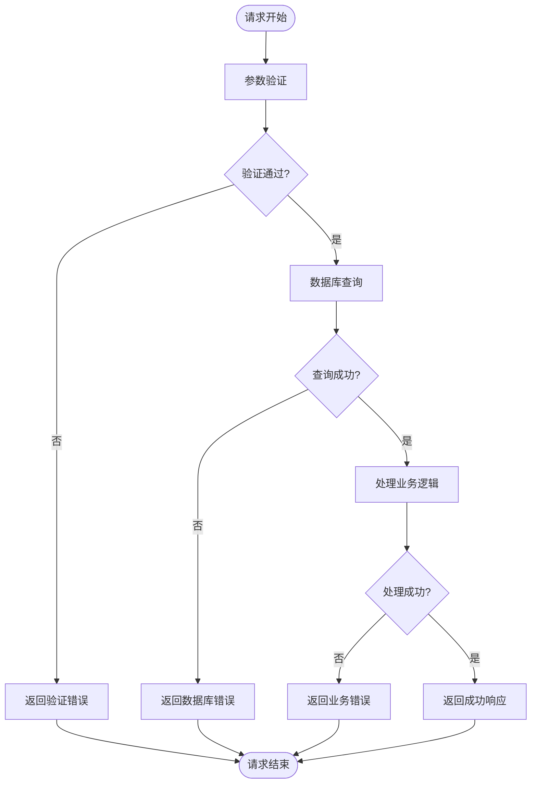

# 培养方案管理接口

<cite>
**本文档引用的文件**
- [plan.js](file://client/src/api/plan.js)
- [plan.controller.js](file://server/src/controllers/plan/plan.controller.js)
- [plan-matrix.controller.js](file://server/src/controllers/plan/plan-matrix.controller.js)
- [plan.routes.js](file://server/src/routes/plan.routes.js)
- [plan.service.js](file://server/src/services/plan.service.js)
- [PlanList.vue](file://client/src/views/plan/PlanList.vue)
- [PlanDetail.vue](file://client/src/views/plan/PlanDetail.vue)
- [PlanQuery.vue](file://client/src/views/query/PlanQuery.vue)
- [SemesterConfig.vue](file://client/src/views/settings/components/SemesterConfig.vue)
</cite>

## 目录
1. [简介](#简介)
2. [项目结构](#项目结构)
3. [核心组件](#核心组件)
4. [架构概览](#架构概览)
5. [详细组件分析](#详细组件分析)
6. [依赖关系分析](#依赖关系分析)
7. [性能考虑](#性能考虑)
8. [故障排除指南](#故障排除指南)
9. [结论](#结论)

## 简介

培养方案管理接口是高等教育管理系统中的核心功能模块，负责管理学生的培养计划和课程安排。该系统提供了完整的培养方案生命周期管理，包括方案创建、维护、查询以及与课程、学期、教材的关联管理。

本系统采用前后端分离架构，前端使用Vue.js框架，后端基于Node.js和Prisma ORM，实现了RESTful API设计模式。系统支持多专业、多层次的培养方案管理，能够满足不同院校的教学管理需求。

## 项目结构

培养方案管理模块在项目中采用分层架构组织，主要包含以下层次：



**图表来源**
- [plan.js:1-200](file://client/src/api/plan.js#L1-L200)
- [plan.controller.js:1-150](file://server/src/controllers/plan/plan.controller.js#L1-L150)
- [plan.service.js:1-200](file://server/src/services/plan.service.js#L1-L200)

**章节来源**
- [plan.js:1-200](file://client/src/api/plan.js#L1-L200)
- [plan.controller.js:1-150](file://server/src/controllers/plan/plan.controller.js#L1-L150)
- [plan.service.js:1-200](file://server/src/services/plan.service.js#L1-L200)

## 核心组件

### 前端API接口层

前端通过统一的API接口层提供培养方案管理功能，主要包括以下接口：

- **培养方案列表接口**: 获取所有培养方案的分页列表
- **培养方案详情接口**: 查询单个培养方案的详细信息
- **创建培养方案接口**: 新建培养方案
- **更新培养方案接口**: 修改现有培养方案
- **删除培养方案接口**: 删除指定培养方案
- **培养方案矩阵接口**: 获取培养方案的课程矩阵视图

### 后端控制器层

后端控制器负责处理HTTP请求和响应，主要包含：

- **PlanController**: 核心培养方案控制器
- **PlanMatrixController**: 培养方案矩阵控制器
- **路由定义**: 定义所有API端点

### 业务逻辑层

业务逻辑层封装了培养方案的核心业务规则和数据处理逻辑，包括：

- **数据验证**: 输入参数验证和业务规则检查
- **数据转换**: 数据格式转换和标准化
- **事务管理**: 数据一致性保证

**章节来源**
- [plan.js:1-200](file://client/src/api/plan.js#L1-L200)
- [plan.controller.js:1-150](file://server/src/controllers/plan/plan.controller.js#L1-L150)
- [plan-matrix.controller.js:1-150](file://server/src/controllers/plan/plan-matrix.controller.js#L1-L150)

## 架构概览

培养方案管理系统的整体架构采用经典的三层架构设计：



**图表来源**
- [plan.routes.js:1-100](file://server/src/routes/plan.routes.js#L1-L100)
- [plan.controller.js:1-150](file://server/src/controllers/plan/plan.controller.js#L1-L150)
- [plan.service.js:1-200](file://server/src/services/plan.service.js#L1-L200)

系统架构特点：
- **清晰的职责分离**: 每个层级都有明确的职责和边界
- **可扩展性**: 支持新增功能模块而不影响现有系统
- **可维护性**: 代码结构清晰，便于维护和调试
- **安全性**: 包含完整的输入验证和权限控制

## 详细组件分析

### 培养方案CRUD接口

#### 获取培养方案列表

**接口定义**
- 方法: GET
- 路径: `/api/plans`
- 功能: 分页获取所有培养方案

**请求参数**
- page: 页码 (默认: 1)
- limit: 每页数量 (默认: 10)
- majorId: 专业ID (可选)
- grade: 年级 (可选)
- name: 方案名称 (可选)

**响应格式**
```json
{
  "data": [
    {
      "id": "string",
      "name": "string",
      "majorId": "string",
      "grade": "number",
      "description": "string",
      "createdAt": "datetime",
      "updatedAt": "datetime"
    }
  ],
  "pagination": {
    "page": "number",
    "limit": "number",
    "total": "number"
  }
}
```

#### 查询单个培养方案

**接口定义**
- 方法: GET
- 路径: `/api/plans/{id}`
- 功能: 获取指定ID的培养方案详情

**路径参数**
- id: 培养方案唯一标识符

**响应格式**
```json
{
  "id": "string",
  "name": "string",
  "majorId": "string",
  "grade": "number",
  "description": "string",
  "courses": [
    {
      "courseId": "string",
      "semester": "number",
      "credit": "number",
      "isRequired": "boolean"
    }
  ],
  "createdAt": "datetime",
  "updatedAt": "datetime"
}
```

#### 创建培养方案

**接口定义**
- 方法: POST
- 路径: `/api/plans`
- 功能: 创建新的培养方案

**请求体参数**
- name: 方案名称 (必填)
- majorId: 专业ID (必填)
- grade: 年级 (必填)
- description: 方案描述 (可选)

**响应格式**
```json
{
  "id": "string",
  "name": "string",
  "majorId": "string",
  "grade": "number",
  "description": "string",
  "createdAt": "datetime",
  "updatedAt": "datetime"
}
```

#### 更新培养方案

**接口定义**
- 方法: PUT/PATCH
- 路径: `/api/plans/{id}`
- 功能: 更新现有培养方案

**路径参数**
- id: 培养方案ID

**请求体参数**
- name: 方案名称 (可选)
- grade: 年级 (可选)
- description: 方案描述 (可选)

**响应格式**
同创建响应格式

#### 删除培养方案

**接口定义**
- 方法: DELETE
- 路径: `/api/plans/{id}`
- 功能: 删除指定培养方案

**路径参数**
- id: 培养方案ID

**响应格式**
```json
{
  "message": "删除成功"
}
```

**章节来源**
- [plan.js:1-200](file://client/src/api/plan.js#L1-L200)
- [plan.controller.js:1-150](file://server/src/controllers/plan/plan.controller.js#L1-L150)
- [plan.routes.js:1-100](file://server/src/routes/plan.routes.js#L1-L100)

### 培养方案课程管理接口

#### 添加课程到方案

**接口定义**
- 方法: POST
- 路径: `/api/plans/{planId}/courses`
- 功能: 向培养方案添加课程

**路径参数**
- planId: 培养方案ID

**请求体参数**
- courseId: 课程ID (必填)
- semester: 学期 (必填)
- credit: 学分 (必填)
- isRequired: 是否必修 (必填)

**响应格式**
```json
{
  "id": "string",
  "planId": "string",
  "courseId": "string",
  "semester": "number",
  "credit": "number",
  "isRequired": "boolean"
}
```

#### 更新方案课程

**接口定义**
- 方法: PUT/PATCH
- 路径: `/api/plans/{planId}/courses/{courseId}`
- 功能: 更新培养方案中的课程信息

**路径参数**
- planId: 培养方案ID
- courseId: 课程ID

**请求体参数**
- semester: 学期 (可选)
- credit: 学分 (可选)
- isRequired: 是否必修 (可选)

**响应格式**
同添加课程响应格式

#### 删除方案课程

**接口定义**
- 方法: DELETE
- 路径: `/api/plans/{planId}/courses/{courseId}`
- 功能: 从培养方案中删除课程

**路径参数**
- planId: 培养方案ID
- courseId: 课程ID

**响应格式**
```json
{
  "message": "删除成功"
}
```

#### 更新课程排序

**接口定义**
- 方法: POST
- 路径: `/api/plans/{planId}/courses/sort`
- 功能: 更新培养方案中课程的排序

**路径参数**
- planId: 培养方案ID

**请求体参数**
- courseIds: 课程ID数组 (按新顺序排列)

**响应格式**
```json
{
  "message": "排序更新成功"
}
```

**章节来源**
- [plan.js:1-200](file://client/src/api/plan.js#L1-L200)
- [plan-matrix.controller.js:1-150](file://server/src/controllers/plan/plan-matrix.controller.js#L1-L150)

### 学期管理接口

#### 获取学期列表

**接口定义**
- 方法: GET
- 路径: `/api/semesters`
- 功能: 获取所有学期配置

**响应格式**
```json
[
  {
    "id": "string",
    "name": "string",
    "startDate": "date",
    "endDate": "date",
    "isCurrent": "boolean"
  }
]
```

#### 添加/更新学期安排

**接口定义**
- 方法: POST/PUT
- 路径: `/api/semesters`
- 功能: 创建或更新学期信息

**请求体参数**
- name: 学期名称 (必填)
- startDate: 开始日期 (必填)
- endDate: 结束日期 (必填)
- isCurrent: 是否当前学期 (可选)

**响应格式**
```json
{
  "id": "string",
  "name": "string",
  "startDate": "date",
  "endDate": "date",
  "isCurrent": "boolean"
}
```

#### 更新学期信息

**接口定义**
- 方法: PUT/PATCH
- 路径: `/api/semesters/{id}`
- 功能: 更新指定学期的信息

**路径参数**
- id: 学期ID

**请求体参数**
- name: 学期名称 (可选)
- startDate: 开始日期 (可选)
- endDate: 结束日期 (可选)
- isCurrent: 是否当前学期 (可选)

**响应格式**
同添加学期响应格式

**章节来源**
- [SemesterConfig.vue:1-200](file://client/src/views/settings/components/SemesterConfig.vue#L1-L200)
- [plan.js:1-200](file://client/src/api/plan.js#L1-L200)

### 教材关联接口

#### 关联教材到学期

**接口定义**
- 方法: POST
- 路径: `/api/textbooks/semester/{semesterId}`
- 功能: 将教材关联到指定学期

**路径参数**
- semesterId: 学期ID

**请求体参数**
- courseId: 课程ID (必填)
- textbookId: 教材ID (必填)
- quantity: 数量 (必填)

**响应格式**
```json
{
  "id": "string",
  "semesterId": "string",
  "courseId": "string",
  "textbookId": "string",
  "quantity": "number"
}
```

#### 取消教材关联

**接口定义**
- 方法: DELETE
- 路径: `/api/textbooks/semester/{semesterId}/{courseId}`
- 功能: 取消指定课程的教材关联

**路径参数**
- semesterId: 学期ID
- courseId: 课程ID

**响应格式**
```json
{
  "message": "取消关联成功"
}
```

#### 删除教材关联记录

**接口定义**
- 方法: DELETE
- 路径: `/api/textbooks/{id}`
- 功能: 删除教材关联记录

**路径参数**
- id: 关联记录ID

**响应格式**
```json
{
  "message": "删除成功"
}
```

**章节来源**
- [plan.js:1-200](file://client/src/api/plan.js#L1-L200)
- [textbook.js:1-200](file://client/src/api/textbook.js#L1-L200)

## 依赖关系分析

培养方案管理模块的依赖关系如下：



**图表来源**
- [plan.js:1-200](file://client/src/api/plan.js#L1-L200)
- [plan.controller.js:1-150](file://server/src/controllers/plan/plan.controller.js#L1-L150)
- [plan.service.js:1-200](file://server/src/services/plan.service.js#L1-L200)

**章节来源**
- [plan.js:1-200](file://client/src/api/plan.js#L1-L200)
- [plan.controller.js:1-150](file://server/src/controllers/plan/plan.controller.js#L1-L150)
- [plan.service.js:1-200](file://server/src/services/plan.service.js#L1-L200)

## 性能考虑

### 数据库优化

- **索引策略**: 在常用查询字段上建立适当索引，如专业ID、年级、创建时间等
- **查询优化**: 使用分页查询避免大量数据传输
- **连接池**: 配置合理的数据库连接池大小

### 缓存策略

- **API缓存**: 对不频繁变化的数据进行缓存
- **前端缓存**: 利用浏览器缓存减少重复请求
- **内存缓存**: 对热点数据进行内存缓存

### 前端性能优化

- **懒加载**: 实现组件的懒加载机制
- **虚拟滚动**: 对长列表使用虚拟滚动技术
- **防抖节流**: 对高频操作进行防抖处理

## 故障排除指南

### 常见错误类型

**数据验证错误**
- 参数缺失或格式不正确
- 业务规则违反
- 权限不足

**数据库错误**
- 连接超时
- 重复键冲突
- 外键约束失败

**网络错误**
- 请求超时
- 服务器不可达
- 网络中断

### 错误处理流程



**图表来源**
- [plan.controller.js:1-150](file://server/src/controllers/plan/plan.controller.js#L1-L150)
- [plan.service.js:1-200](file://server/src/services/plan.service.js#L1-L200)

### 调试建议

1. **启用日志**: 在开发环境中启用详细的日志记录
2. **使用调试工具**: 利用浏览器开发者工具监控网络请求
3. **单元测试**: 编写充分的单元测试覆盖关键业务逻辑
4. **集成测试**: 进行端到端的集成测试确保系统完整性

**章节来源**
- [plan.controller.js:1-150](file://server/src/controllers/plan/plan.controller.js#L1-L150)
- [plan.service.js:1-200](file://server/src/services/plan.service.js#L1-L200)

## 结论

培养方案管理接口提供了一个完整、灵活且可扩展的解决方案，能够满足现代高等教育机构对培养方案管理的需求。系统具有以下优势：

- **完整的功能覆盖**: 涵盖培养方案的全生命周期管理
- **良好的用户体验**: 清晰的界面设计和直观的操作流程
- **强大的扩展性**: 模块化设计便于功能扩展和维护
- **可靠的性能表现**: 优化的数据库设计和缓存策略

通过合理使用这些接口，教育管理者可以高效地创建、维护和查询培养方案，为学生提供更好的学习体验。系统的架构设计确保了长期的可维护性和可扩展性，能够适应不断变化的教育管理需求。