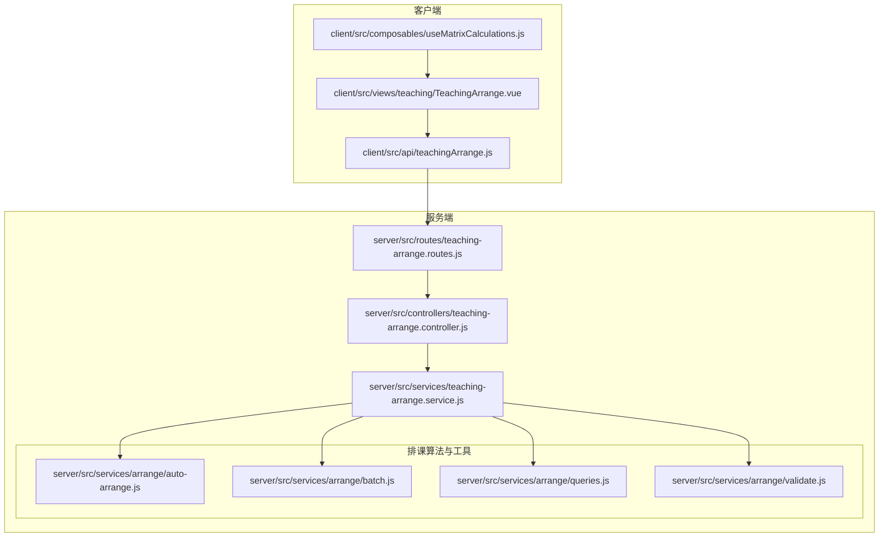
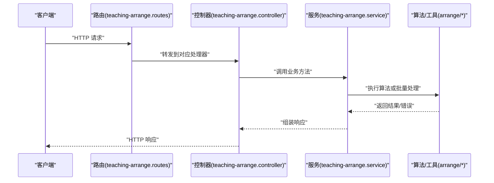
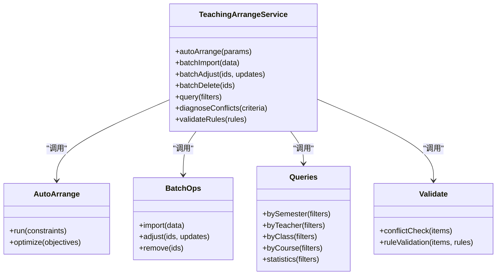
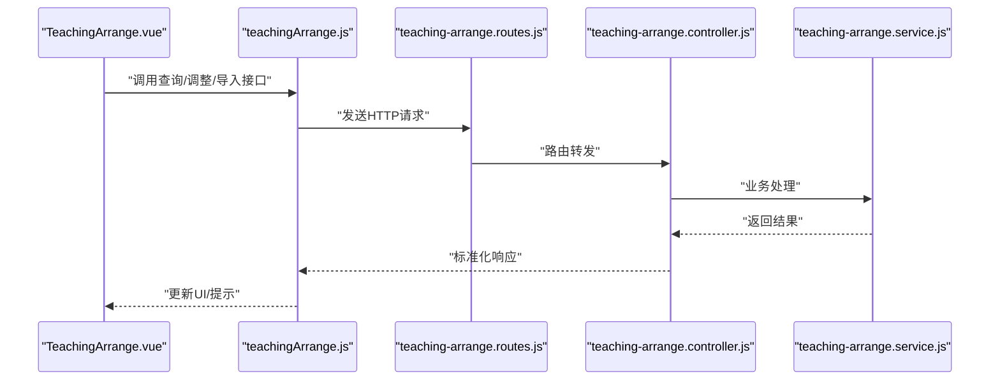
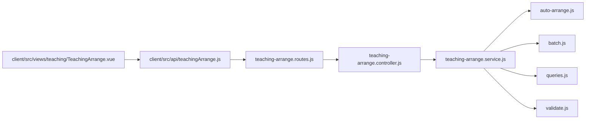

# 教学安排接口

<cite>
**本文引用的文件**
- [teaching-arrange.controller.js](file://server/src/controllers/teaching-arrange.controller.js)
- [teaching-arrange.routes.js](file://server/src/routes/teaching-arrange.routes.js)
- [teaching-arrange.service.js](file://server/src/services/teaching-arrange.service.js)
- [auto-arrange.js](file://server/src/services/arrange/auto-arrange.js)
- [batch.js](file://server/src/services/arrange/batch.js)
- [queries.js](file://server/src/services/arrange/queries.js)
- [validate.js](file://server/src/services/arrange/validate.js)
- [teachingArrange.js](file://client/src/api/teachingArrange.js)
- [TeachingArrange.vue](file://client/src/views/teaching/TeachingArrange.vue)
- [TeachingArrange.js](file://client/src/composables/useMatrixCalculations.js)
- [AUTO_ARRANGE_LOGIC_V2.md](file://docs/AUTO_ARRANGE_LOGIC_V2.md)
- [TEACHING_ARRANGE_LOGIC.md](file://docs/TEACHING_ARRANGE_LOGIC.md)
- [EXPORT_IMPORT_AUDIT.md](file://docs/EXPORT_IMPORT_AUDIT.md)
</cite>

## 目录
1. [简介](#简介)
2. [项目结构](#项目结构)
3. [核心组件](#核心组件)
4. [架构总览](#架构总览)
5. [详细组件分析](#详细组件分析)
6. [依赖关系分析](#依赖关系分析)
7. [性能考虑](#性能考虑)
8. [故障排查指南](#故障排查指南)
9. [结论](#结论)
10. [附录](#附录)

## 简介
本文件面向教学安排接口的使用者与维护者，系统化梳理后端控制器、路由与服务层的实现，以及前端API封装与视图组件的交互方式。重点覆盖以下能力：
- 智能排课：自动排课、冲突检测、规则校验
- 手动调整：单条/批量调整课表
- 查询统计：按学期、教师、班级、课程维度查询
- 批量操作：批量导入排课数据、批量调整课表
- 接口规范：请求格式、响应结构、错误码说明与使用示例

## 项目结构
教学安排相关模块采用经典的三层架构（路由 → 控制器 → 服务），配合专门的排课算法与批量处理服务，前端通过统一的API模块进行调用。

**图表来源**
- [teaching-arrange.routes.js](file://server/src/routes/teaching-arrange.routes.js)
- [teaching-arrange.controller.js](file://server/src/controllers/teaching-arrange.controller.js)
- [teaching-arrange.service.js](file://server/src/services/teaching-arrange.service.js)
- [auto-arrange.js](file://server/src/services/arrange/auto-arrange.js)
- [batch.js](file://server/src/services/arrange/batch.js)
- [queries.js](file://server/src/services/arrange/queries.js)
- [validate.js](file://server/src/services/arrange/validate.js)
- [teachingArrange.js](file://client/src/api/teachingArrange.js)
- [TeachingArrange.vue](file://client/src/views/teaching/TeachingArrange.vue)
- [TeachingArrange.js](file://client/src/composables/useMatrixCalculations.js)

**章节来源**
- [teaching-arrange.routes.js](file://server/src/routes/teaching-arrange.routes.js)
- [teaching-arrange.controller.js](file://server/src/controllers/teaching-arrange.controller.js)
- [teaching-arrange.service.js](file://server/src/services/teaching-arrange.service.js)

## 核心组件
- 路由层：定义教学安排相关的HTTP接口，映射到控制器方法
- 控制器层：接收请求、参数校验、调用服务层、返回响应
- 服务层：封装业务逻辑，协调排课算法与数据库访问
- 排课算法与工具：自动排课、批量处理、查询与冲突检测
- 前端API封装：统一管理教学安排接口调用，供视图组件使用

**章节来源**
- [teaching-arrange.routes.js](file://server/src/routes/teaching-arrange.routes.js)
- [teaching-arrange.controller.js](file://server/src/controllers/teaching-arrange.controller.js)
- [teaching-arrange.service.js](file://server/src/services/teaching-arrange.service.js)
- [auto-arrange.js](file://server/src/services/arrange/auto-arrange.js)
- [batch.js](file://server/src/services/arrange/batch.js)
- [queries.js](file://server/src/services/arrange/queries.js)
- [validate.js](file://server/src/services/arrange/validate.js)
- [teachingArrange.js](file://client/src/api/teachingArrange.js)

## 架构总览
教学安排接口遵循REST风格，结合复杂业务流程（自动排课、批量导入/调整、冲突检测）与前端矩阵式课表展示，形成“请求 → 控制器 → 服务 → 算法/工具”的清晰链路。

**图表来源**
- [teaching-arrange.routes.js](file://server/src/routes/teaching-arrange.routes.js)
- [teaching-arrange.controller.js](file://server/src/controllers/teaching-arrange.controller.js)
- [teaching-arrange.service.js](file://server/src/services/teaching-arrange.service.js)
- [auto-arrange.js](file://server/src/services/arrange/auto-arrange.js)
- [batch.js](file://server/src/services/arrange/batch.js)
- [queries.js](file://server/src/services/arrange/queries.js)
- [validate.js](file://server/src/services/arrange/validate.js)

## 详细组件分析

### 路由与控制器
- 路由定义了教学安排的HTTP端点，包括自动排课、查询、调整、批量导入/导出等
- 控制器负责参数解析、调用服务层并返回标准化响应

关键职责
- 自动排课触发与状态查询
- 单条/批量教学安排的创建、更新、删除、查询
- 冲突检测与规则校验入口
- 批量导入/导出接口

**章节来源**
- [teaching-arrange.routes.js](file://server/src/routes/teaching-arrange.routes.js)
- [teaching-arrange.controller.js](file://server/src/controllers/teaching-arrange.controller.js)

### 服务层与排课算法
服务层是业务核心，协调以下模块：
- 自动排课：基于约束条件与优化目标生成课表
- 批量处理：支持批量导入、批量调整、批量删除
- 查询：多维聚合与筛选
- 校验：冲突检测与规则验证

**图表来源**
- [teaching-arrange.service.js](file://server/src/services/teaching-arrange.service.js)
- [auto-arrange.js](file://server/src/services/arrange/auto-arrange.js)
- [batch.js](file://server/src/services/arrange/batch.js)
- [queries.js](file://server/src/services/arrange/queries.js)
- [validate.js](file://server/src/services/arrange/validate.js)

**章节来源**
- [teaching-arrange.service.js](file://server/src/services/teaching-arrange.service.js)
- [auto-arrange.js](file://server/src/services/arrange/auto-arrange.js)
- [batch.js](file://server/src/services/arrange/batch.js)
- [queries.js](file://server/src/services/arrange/queries.js)
- [validate.js](file://server/src/services/arrange/validate.js)

### 前端API与视图
- 前端API模块封装所有教学安排接口，统一错误处理与拦截器
- 视图组件负责矩阵式课表渲染与用户交互（拖拽、选择、批量操作）
- 计算组合式函数用于矩阵计算与布局

**图表来源**
- [teachingArrange.js](file://client/src/api/teachingArrange.js)
- [TeachingArrange.vue](file://client/src/views/teaching/TeachingArrange.vue)
- [teaching-arrange.routes.js](file://server/src/routes/teaching-arrange.routes.js)
- [teaching-arrange.controller.js](file://server/src/controllers/teaching-arrange.controller.js)
- [teaching-arrange.service.js](file://server/src/services/teaching-arrange.service.js)

**章节来源**
- [teachingArrange.js](file://client/src/api/teachingArrange.js)
- [TeachingArrange.vue](file://client/src/views/teaching/TeachingArrange.vue)
- [TeachingArrange.js](file://client/src/composables/useMatrixCalculations.js)

## 依赖关系分析
- 路由依赖控制器；控制器依赖服务层；服务层依赖算法与工具模块
- 前端API模块独立于后端实现，仅依赖HTTP接口契约
- 文档与算法说明为排课实现提供理论依据

**图表来源**
- [teaching-arrange.routes.js](file://server/src/routes/teaching-arrange.routes.js)
- [teaching-arrange.controller.js](file://server/src/controllers/teaching-arrange.controller.js)
- [teaching-arrange.service.js](file://server/src/services/teaching-arrange.service.js)
- [auto-arrange.js](file://server/src/services/arrange/auto-arrange.js)
- [batch.js](file://server/src/services/arrange/batch.js)
- [queries.js](file://server/src/services/arrange/queries.js)
- [validate.js](file://server/src/services/arrange/validate.js)
- [teachingArrange.js](file://client/src/api/teachingArrange.js)

**章节来源**
- [teaching-arrange.routes.js](file://server/src/routes/teaching-arrange.routes.js)
- [teaching-arrange.controller.js](file://server/src/controllers/teaching-arrange.controller.js)
- [teaching-arrange.service.js](file://server/src/services/teaching-arrange.service.js)
- [teachingArrange.js](file://client/src/api/teachingArrange.js)

## 性能考虑
- 数据库索引与复合索引：减少查询与关联开销
- 批量操作：合并事务与批量写入，降低网络往返
- 缓存策略：热点查询结果缓存（如常用统计）
- 算法复杂度：自动排课的搜索空间控制与剪枝策略
- 前端渲染：虚拟滚动与增量更新，避免全量重绘

[本节为通用指导，不直接分析具体文件]

## 故障排查指南
常见问题与定位思路
- 参数校验失败：检查请求体字段类型与必填项
- 权限不足：确认认证与授权中间件是否生效
- 数据库异常：查看Prisma日志与迁移状态
- 排课冲突：启用冲突诊断接口，逐项核对规则
- 批量导入失败：分批重试与错误行定位

建议排查步骤
1. 查看控制器日志与错误响应
2. 使用冲突检测接口定位问题范围
3. 分析批量导入的错误行与重复键
4. 对比文档中的请求/响应格式

**章节来源**
- [teaching-arrange.controller.js](file://server/src/controllers/teaching-arrange.controller.js)
- [validate.js](file://server/src/services/arrange/validate.js)

## 结论
教学安排接口以清晰的分层架构支撑复杂的排课业务，结合自动排课算法与批量处理能力，满足高校教务场景的高频需求。建议在生产环境中完善监控与告警，并持续优化算法与前端渲染性能。

[本节为总结性内容，不直接分析具体文件]

## 附录

### API规范与使用示例

- 自动排课
  - 方法与路径：POST /api/teaching-arrange/auto-arrange
  - 请求参数：包含学期、课程计划、教室容量、教师可教性等约束
  - 响应：返回排课结果或冲突诊断
  - 示例：参考文档中的自动排课流程说明

- 冲突检测
  - 方法与路径：POST /api/teaching-arrange/diagnose-conflicts
  - 请求参数：待检测的排课条目与规则集合
  - 响应：冲突列表与修复建议
  - 示例：用于预检调整或导入前校验

- 查询接口
  - 方法与路径：GET /api/teaching-arrange
  - 查询参数：按学期、教师、班级、课程筛选
  - 响应：分页列表与统计信息
  - 示例：前端矩阵渲染所需的数据结构

- 批量导入
  - 方法与路径：POST /api/teaching-arrange/batch/import
  - 请求参数：Excel/CSV数据流或JSON数组
  - 响应：成功数量、失败明细与错误码
  - 示例：参考导入审计文档

- 批量调整
  - 方法与路径：PUT /api/teaching-arrange/batch/adjust
  - 请求参数：ID列表与更新字段
  - 响应：受影响记录数与冲突诊断
  - 示例：批量修改时间/教室/教师

- 批量删除
  - 方法与路径：DELETE /api/teaching-arrange/batch/remove
  - 请求参数：ID列表
  - 响应：删除成功数量
  - 示例：清理无效排课

- 错误码说明
  - 400：参数非法或缺失
  - 401：未认证或令牌无效
  - 403：权限不足
  - 422：业务校验失败（如冲突）
  - 500：服务器内部错误

- 实际使用示例
  - 前端调用：通过API模块封装的方法发起请求
  - 视图组件：TeachingArrange.vue负责展示与交互
  - 矩阵计算：useMatrixCalculations.js提供布局与渲染辅助

**章节来源**
- [AUTO_ARRANGE_LOGIC_V2.md](file://docs/AUTO_ARRANGE_LOGIC_V2.md)
- [TEACHING_ARRANGE_LOGIC.md](file://docs/TEACHING_ARRANGE_LOGIC.md)
- [EXPORT_IMPORT_AUDIT.md](file://docs/EXPORT_IMPORT_AUDIT.md)
- [teachingArrange.js](file://client/src/api/teachingArrange.js)
- [TeachingArrange.vue](file://client/src/views/teaching/TeachingArrange.vue)
- [TeachingArrange.js](file://client/src/composables/useMatrixCalculations.js)