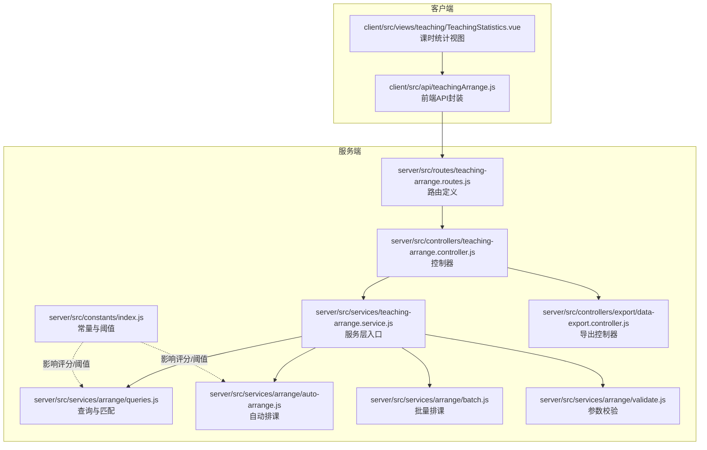
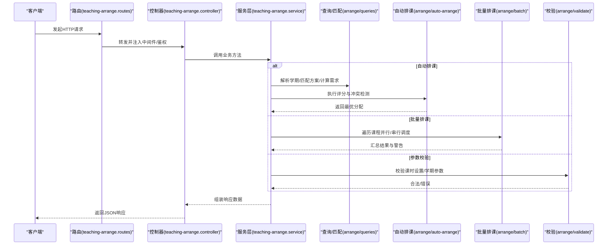
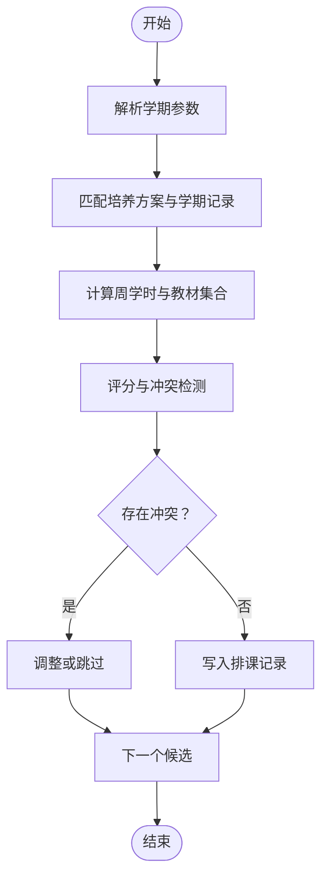
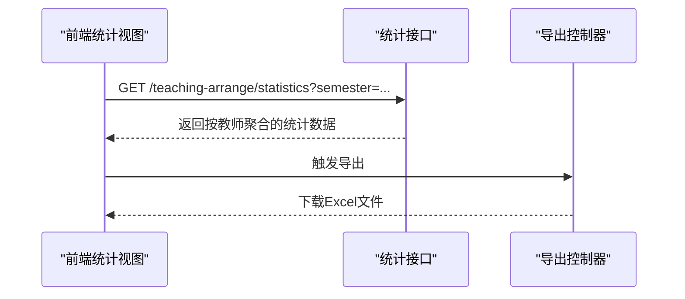
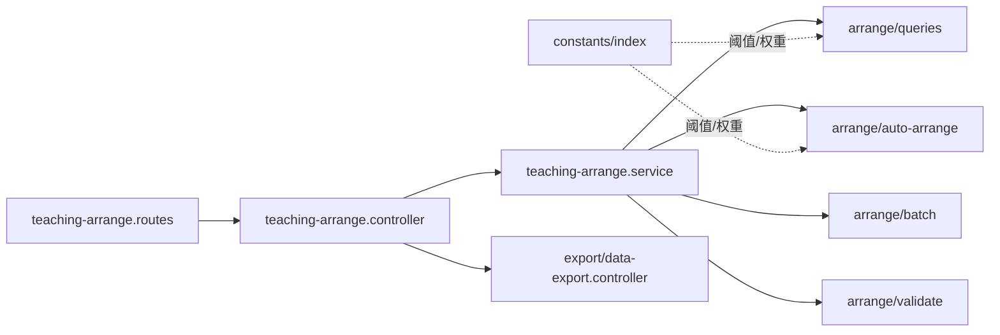

# 教学管理接口

<cite>
**本文引用的文件**
- [server/src/routes/teaching-arrange.routes.js](file://server/src/routes/teaching-arrange.routes.js)
- [server/src/controllers/teaching-arrange.controller.js](file://server/src/controllers/teaching-arrange.controller.js)
- [server/src/services/teaching-arrange.service.js](file://server/src/services/teaching-arrange.service.js)
- [server/src/services/arrange/queries.js](file://server/src/services/arrange/queries.js)
- [server/src/services/arrange/auto-arrange.js](file://server/src/services/arrange/auto-arrange.js)
- [server/src/services/arrange/batch.js](file://server/src/services/arrange/batch.js)
- [server/src/services/arrange/validate.js](file://server/src/services/arrange/validate.js)
- [server/src/constants/index.js](file://server/src/constants/index.js)
- [server/src/controllers/export/data-export.controller.js](file://server/src/controllers/export/data-export.controller.js)
- [client/src/api/teachingArrange.js](file://client/src/api/teachingArrange.js)
- [client/src/views/teaching/TeachingStatistics.vue](file://client/src/views/teaching/TeachingStatistics.vue)
- [docs/TEACHING_ARRANGE_LOGIC.md](file://docs/TEACHING_ARRANGE_LOGIC.md)
</cite>

## 目录
1. [简介](#简介)
2. [项目结构](#项目结构)
3. [核心组件](#核心组件)
4. [架构概览](#架构概览)
5. [详细组件分析](#详细组件分析)
6. [依赖关系分析](#依赖关系分析)
7. [性能考虑](#性能考虑)
8. [故障排查指南](#故障排查指南)
9. [结论](#结论)
10. [附录](#附录)

## 简介
本文件为 KEC 课程管理平台的教学管理接口技术文档，聚焦以下核心能力：
- 培养方案管理：课程与学期的关联、教材绑定、排序维护
- 教学安排：手动排课、自动排课、批量自动排课、删除排课记录
- 课表查询与统计：按学期聚合的课时统计、导出、筛选与可视化
- 智能排课算法：评分模型、冲突检测、工作量平衡、批量调度策略
- 数据格式与计算逻辑：统计报表字段、导出格式、前端展示规则

本文件以服务端路由、控制器、服务层与客户端 API 为主线，结合算法文档，给出完整的接口规范、调用流程与最佳实践。

## 项目结构
教学管理相关模块主要分布在服务端的路由、控制器与服务层，以及客户端的 API 封装与视图组件中。下图展示教学管理接口在前后端的整体结构：

图表来源
- [server/src/routes/teaching-arrange.routes.js:1-200](file://server/src/routes/teaching-arrange.routes.js#L1-L200)
- [server/src/controllers/teaching-arrange.controller.js:1-300](file://server/src/controllers/teaching-arrange.controller.js#L1-L300)
- [server/src/services/teaching-arrange.service.js:1-4](file://server/src/services/teaching-arrange.service.js#L1-L4)
- [server/src/services/arrange/queries.js:120-380](file://server/src/services/arrange/queries.js#L120-L380)
- [server/src/services/arrange/auto-arrange.js:1-200](file://server/src/services/arrange/auto-arrange.js#L1-L200)
- [server/src/services/arrange/batch.js:1-120](file://server/src/services/arrange/batch.js#L1-L120)
- [server/src/services/arrange/validate.js:1-120](file://server/src/services/arrange/validate.js#L1-L120)
- [server/src/constants/index.js:55-98](file://server/src/constants/index.js#L55-L98)
- [server/src/controllers/export/data-export.controller.js:580-620](file://server/src/controllers/export/data-export.controller.js#L580-L620)
- [client/src/api/teachingArrange.js:1-24](file://client/src/api/teachingArrange.js#L1-L24)
- [client/src/views/teaching/TeachingStatistics.vue:1-240](file://client/src/views/teaching/TeachingStatistics.vue#L1-L240)

章节来源
- [server/src/routes/teaching-arrange.routes.js:1-200](file://server/src/routes/teaching-arrange.routes.js#L1-L200)
- [client/src/api/teachingArrange.js:1-24](file://client/src/api/teachingArrange.js#L1-L24)

## 核心组件
- 路由层：定义教学管理相关 API 的 HTTP 方法、路径与权限控制
- 控制器层：接收请求参数、调用服务层、返回标准化响应
- 服务层：封装业务逻辑，协调查询、验证、自动排课与批量排课
- 查询与匹配：根据培养方案、班级属性、学期信息推导课程周学时、教材集合，并匹配教师可用性
- 自动排课：基于评分模型与冲突检测进行教师分配
- 批量排课：对多个课程执行自动排课，汇总结果与警告
- 参数校验：确保课时设置、学期参数等合法
- 常量与阈值：工作量平衡阈值、课时标准与最大值、排课模式等
- 导出控制器：生成教师课时统计的导出数据

章节来源
- [server/src/services/teaching-arrange.service.js:1-4](file://server/src/services/teaching-arrange.service.js#L1-L4)
- [server/src/services/arrange/queries.js:120-380](file://server/src/services/arrange/queries.js#L120-L380)
- [server/src/services/arrange/auto-arrange.js:1-200](file://server/src/services/arrange/auto-arrange.js#L1-L200)
- [server/src/services/arrange/batch.js:1-120](file://server/src/services/arrange/batch.js#L1-L120)
- [server/src/services/arrange/validate.js:1-120](file://server/src/services/arrange/validate.js#L1-L120)
- [server/src/constants/index.js:55-98](file://server/src/constants/index.js#L55-L98)
- [server/src/controllers/export/data-export.controller.js:580-620](file://server/src/controllers/export/data-export.controller.js#L580-L620)

## 架构概览
教学管理接口采用典型的三层架构：路由层负责协议与鉴权，控制器层负责编排与异常处理，服务层负责领域逻辑与数据访问。自动排课与批量排课通过评分模型与冲突检测实现智能化决策；统计导出遵循统一的数据聚合规则。

图表来源
- [server/src/routes/teaching-arrange.routes.js:1-200](file://server/src/routes/teaching-arrange.routes.js#L1-L200)
- [server/src/controllers/teaching-arrange.controller.js:1-300](file://server/src/controllers/teaching-arrange.controller.js#L1-L300)
- [server/src/services/teaching-arrange.service.js:1-4](file://server/src/services/teaching-arrange.service.js#L1-L4)
- [server/src/services/arrange/queries.js:120-380](file://server/src/services/arrange/queries.js#L120-L380)
- [server/src/services/arrange/auto-arrange.js:1-200](file://server/src/services/arrange/auto-arrange.js#L1-L200)
- [server/src/services/arrange/batch.js:1-120](file://server/src/services/arrange/batch.js#L1-L120)
- [server/src/services/arrange/validate.js:1-120](file://server/src/services/arrange/validate.js#L1-L120)

## 详细组件分析

### 教学安排接口规范
- 获取课程班级列表
  - 方法与路径：GET /teaching-arrange/classes
  - 权限：所有用户
  - 功能：按条件筛选可排课的班级，支持与培养方案、学期联动
  - 章节来源
    - [docs/TEACHING_ARRANGE_LOGIC.md:472-488](file://docs/TEACHING_ARRANGE_LOGIC.md#L472-L488)
    - [client/src/api/teachingArrange.js:4-4](file://client/src/api/teachingArrange.js#L4-L4)

- 获取课程教师列表
  - 方法与路径：GET /teaching-arrange/teachers
  - 权限：所有用户
  - 功能：按条件筛选可排课的教师，支持状态过滤
  - 章节来源
    - [docs/TEACHING_ARRANGE_LOGIC.md:472-488](file://docs/TEACHING_ARRANGE_LOGIC.md#L472-L488)
    - [client/src/api/teachingArrange.js:6-6](file://client/src/api/teachingArrange.js#L6-L6)

- 手动安排教师
  - 方法与路径：POST /teaching-arrange/assign
  - 权限：admin+
  - 请求体字段：class_id, course_id, teacher_id, semester, weekly_hours, is_auto=false
  - 响应：包含教师、班级、课程与周学时的排课记录
  - 冲突检测：控制器会检查同班级/同课程/同学期是否存在已有安排，必要时进行upsert
  - 工作量预警：非阻塞地检查教师当前学期总课时是否超过阈值
  - 章节来源
    - [docs/TEACHING_ARRANGE_LOGIC.md:472-488](file://docs/TEACHING_ARRANGE_LOGIC.md#L472-L488)
    - [client/src/api/teachingArrange.js:8-8](file://client/src/api/teachingArrange.js#L8-L8)
    - [server/src/controllers/teaching-arrange.controller.js:173-214](file://server/src/controllers/teaching-arrange.controller.js#L173-L214)
    - [server/src/constants/index.js:82-85](file://server/src/constants/index.js#L82-L85)

- 删除排课记录
  - 方法与路径：DELETE /teaching-arrange/assignments/:id
  - 权限：admin+
  - 行为：删除指定排课记录
  - 章节来源
    - [docs/TEACHING_ARRANGE_LOGIC.md:472-488](file://docs/TEACHING_ARRANGE_LOGIC.md#L472-L488)
    - [client/src/api/teachingArrange.js:10-10](file://client/src/api/teachingArrange.js#L10-L10)

- 单课程自动排课
  - 方法与路径：POST /teaching-arrange/auto-arrange
  - 权限：admin+
  - 请求体字段：course_id, semester, options（如是否启用教材内聚优化）
  - 流程：解析学期、匹配培养方案、计算周学时与教材、评分与冲突检测、写入排课记录
  - 章节来源
    - [docs/TEACHING_ARRANGE_LOGIC.md:472-488](file://docs/TEACHING_ARRANGE_LOGIC.md#L472-L488)
    - [client/src/api/teachingArrange.js:12-12](file://client/src/api/teachingArrange.js#L12-L12)
    - [server/src/services/arrange/auto-arrange.js:1-200](file://server/src/services/arrange/auto-arrange.js#L1-L200)
    - [server/src/services/arrange/queries.js:120-380](file://server/src/services/arrange/queries.js#L120-L380)
    - [server/src/constants/index.js:88-98](file://server/src/constants/index.js#L88-L98)

- 批量自动排课（所有课程）
  - 方法与路径：POST /teaching-arrange/batch-auto-arrange
  - 权限：admin+
  - 请求体字段：semester, options（如是否启用教材内聚优化）
  - 流程：统计课程需求、教师可用性、合并冲突检测、逐课程评分与分配、汇总结果与警告
  - 章节来源
    - [docs/TEACHING_ARRANGE_LOGIC.md:472-488](file://docs/TEACHING_ARRANGE_LOGIC.md#L472-L488)
    - [client/src/api/teachingArrange.js:14-15](file://client/src/api/teachingArrange.js#L14-L15)
    - [server/src/services/arrange/batch.js:1-120](file://server/src/services/arrange/batch.js#L1-L120)

- 重置自动排课
  - 方法与路径：POST /teaching-arrange/reset
  - 权限：admin+
  - 行为：清理自动排课标记（is_auto=true）的记录，保留手动安排
  - 章节来源
    - [docs/TEACHING_ARRANGE_LOGIC.md:472-488](file://docs/TEACHING_ARRANGE_LOGIC.md#L472-L488)
    - [client/src/api/teachingArrange.js:17-17](file://client/src/api/teachingArrange.js#L17-L17)

- 获取课时统计
  - 方法与路径：GET /teaching-arrange/statistics
  - 权限：所有用户
  - 查询参数：semester, name, type, subject, affiliated_college
  - 响应：按教师聚合的课时统计，含课程分组详情、归属学院、层次集合
  - 章节来源
    - [docs/TEACHING_ARRANGE_LOGIC.md:472-488](file://docs/TEACHING_ARRANGE_LOGIC.md#L472-L488)
    - [client/src/api/teachingArrange.js:19-19](file://client/src/api/teachingArrange.js#L19-L19)
    - [client/src/views/teaching/TeachingStatistics.vue:1-240](file://client/src/views/teaching/TeachingStatistics.vue#L1-L240)
    - [server/src/controllers/export/data-export.controller.js:584-619](file://server/src/controllers/export/data-export.controller.js#L584-L619)

- 获取/保存课时设置
  - 方法与路径：GET /teaching-arrange/hour-settings, PUT /teaching-arrange/hour-settings
  - 权限：所有用户（读），admin+（写）
  - 字段：full_time.standard, full_time.max, part_time.standard, part_time.max, external.standard, external.max
  - 章节来源
    - [docs/TEACHING_ARRANGE_LOGIC.md:472-488](file://docs/TEACHING_ARRANGE_LOGIC.md#L472-L488)
    - [client/src/api/teachingArrange.js:22-24](file://client/src/api/teachingArrange.js#L22-L24)
    - [server/src/services/arrange/validate.js:1-120](file://server/src/services/arrange/validate.js#L1-L120)
    - [server/src/constants/index.js:66-70](file://server/src/constants/index.js#L66-L70)

### 智能排课算法与冲突检测
- 评分模型与权重
  - 学院匹配权重、层次匹配权重、已用教材权重、固有教材权重、新增教材惩罚
  - 教材内聚优化开关与相关权重
  - 章节来源
    - [server/src/constants/index.js:88-98](file://server/src/constants/index.js#L88-L98)
    - [server/src/services/arrange/queries.js:357-373](file://server/src/services/arrange/queries.js#L357-L373)

- 冲突检测机制
  - 同班级/同课程/同学期唯一约束
  - 教师当前学期总课时与课程课时限制
  - 教师在该课程下的已安排班级数
  - 章节来源
    - [server/src/controllers/teaching-arrange.controller.js:188-209](file://server/src/controllers/teaching-arrange.controller.js#L188-L209)
    - [server/src/services/arrange/queries.js:203-232](file://server/src/services/arrange/queries.js#L203-L232)
    - [server/src/constants/index.js:82-85](file://server/src/constants/index.js#L82-L85)

- 工作量平衡阈值
  - 分数阈值与工作量饱和率阈值
  - 章节来源
    - [server/src/constants/index.js:82-85](file://server/src/constants/index.js#L82-L85)

- 批量操作处理
  - 课程需求聚合：按课程汇总周学时需求
  - 教师可用性统计：活跃教师数量
  - 并行/串行策略：逐课程评分与分配，汇总结果与警告
  - 章节来源
    - [server/src/services/arrange/batch.js:39-78](file://server/src/services/arrange/batch.js#L39-L78)

图表来源
- [server/src/services/arrange/queries.js:120-380](file://server/src/services/arrange/queries.js#L120-L380)
- [server/src/services/arrange/auto-arrange.js:1-200](file://server/src/services/arrange/auto-arrange.js#L1-L200)
- [server/src/controllers/teaching-arrange.controller.js:173-214](file://server/src/controllers/teaching-arrange.controller.js#L173-L214)

### 教学统计分析接口
- 数据格式
  - 教师维度：教师ID、姓名、人员类型、总周学时、所授班级数
  - 课程维度：课程名称、周学时合计、所授班级数量
  - 学院与层次：实际授课的学院集合、层次集合
  - 章节来源
    - [server/src/controllers/export/data-export.controller.js:584-619](file://server/src/controllers/export/data-export.controller.js#L584-L619)

- 计算逻辑
  - 按教师分组统计周学时与班级数
  - 按课程分组统计周学时与班级集合
  - 提取实际授课班级的归属学院与层次
  - 章节来源
    - [server/src/controllers/export/data-export.controller.js:584-619](file://server/src/controllers/export/data-export.controller.js#L584-L619)

- 前端展示
  - 支持姓名、人员类型、科目、归属学院、层次等多维筛选
  - 支持导出按钮触发下载
  - 章节来源
    - [client/src/views/teaching/TeachingStatistics.vue:1-240](file://client/src/views/teaching/TeachingStatistics.vue#L1-L240)

图表来源
- [client/src/views/teaching/TeachingStatistics.vue:1-240](file://client/src/views/teaching/TeachingStatistics.vue#L1-L240)
- [server/src/controllers/export/data-export.controller.js:584-619](file://server/src/controllers/export/data-export.controller.js#L584-L619)

### 培养方案管理（与教学安排关联）
- 获取方案课程列表、添加/更新/删除方案课程
- 更新课程排序（轻量端点，避免重建学期记录）
- 获取方案学期列表、添加/更新学期安排
- 教材关联：为学期绑定教材，兼容旧接口
- 章节来源
  - [server/src/routes/plan.routes.js:46-137](file://server/src/routes/plan.routes.js#L46-L137)
  - [client/src/api/plan.js:1-30](file://client/src/api/plan.js#L1-L30)

## 依赖关系分析
- 路由到控制器：路由定义明确 HTTP 方法与鉴权，控制器集中处理业务编排
- 控制器到服务层：控制器调用服务层方法，服务层再拆分到查询、自动排课、批量排课与校验
- 服务层到工具：查询与评分依赖常量中的阈值与权重；批量排课依赖查询结果
- 客户端到服务端：前端 API 封装直接调用后端路由，统计视图消费统计接口并支持导出

图表来源
- [server/src/routes/teaching-arrange.routes.js:1-200](file://server/src/routes/teaching-arrange.routes.js#L1-L200)
- [server/src/controllers/teaching-arrange.controller.js:1-300](file://server/src/controllers/teaching-arrange.controller.js#L1-L300)
- [server/src/services/teaching-arrange.service.js:1-4](file://server/src/services/teaching-arrange.service.js#L1-L4)
- [server/src/services/arrange/queries.js:120-380](file://server/src/services/arrange/queries.js#L120-L380)
- [server/src/services/arrange/auto-arrange.js:1-200](file://server/src/services/arrange/auto-arrange.js#L1-L200)
- [server/src/services/arrange/batch.js:1-120](file://server/src/services/arrange/batch.js#L1-L120)
- [server/src/services/arrange/validate.js:1-120](file://server/src/services/arrange/validate.js#L1-L120)
- [server/src/constants/index.js:55-98](file://server/src/constants/index.js#L55-L98)
- [server/src/controllers/export/data-export.controller.js:584-619](file://server/src/controllers/export/data-export.controller.js#L584-L619)

## 性能考虑
- 批量查询优化：合并 groupBy 统计，减少多次数据库往返
- 教师过滤：限定 relevantTeacherIds，避免全学期扫描
- 导出缓存：前端统计视图具备缓存策略，降低重复请求压力
- 并行策略：批量排课按课程粒度处理，合理控制并发与错误恢复
- 章节来源
  - [server/src/services/arrange/queries.js:203-232](file://server/src/services/arrange/queries.js#L203-L232)
  - [client/src/views/teaching/TeachingStatistics.vue:365-389](file://client/src/views/teaching/TeachingStatistics.vue#L365-L389)

## 故障排查指南
- 排课失败或冲突
  - 检查同班级/同课程/同学期是否已有安排
  - 核对教师当前学期总课时是否超过阈值
  - 章节来源
    - [server/src/controllers/teaching-arrange.controller.js:188-214](file://server/src/controllers/teaching-arrange.controller.js#L188-L214)
    - [server/src/constants/index.js:82-85](file://server/src/constants/index.js#L82-L85)

- 自动排课无结果
  - 确认课程是否有活跃教师
  - 检查学期参数与培养方案学期范围
  - 章节来源
    - [server/src/services/arrange/batch.js:39-78](file://server/src/services/arrange/batch.js#L39-L78)
    - [server/src/services/arrange/queries.js:120-160](file://server/src/services/arrange/queries.js#L120-L160)

- 课时统计异常
  - 核对筛选参数（姓名、类型、科目、归属学院、层次）
  - 确认学期参数正确
  - 章节来源
    - [client/src/views/teaching/TeachingStatistics.vue:196-240](file://client/src/views/teaching/TeachingStatistics.vue#L196-L240)

## 结论
本教学管理接口围绕“培养方案—教学安排—统计导出”的完整闭环设计，既满足人工干预的灵活性，又提供智能排课的自动化能力。通过清晰的接口规范、完善的冲突检测与工作量平衡策略、以及丰富的统计与导出能力，能够有效支撑高校教学运行管理。

## 附录
- 使用示例（路径参考）
  - 获取课程班级列表：GET /teaching-arrange/classes
  - 获取课程教师列表：GET /teaching-arrange/teachers
  - 手动安排教师：POST /teaching-arrange/assign
  - 删除排课记录：DELETE /teaching-arrange/assignments/:id
  - 单课程自动排课：POST /teaching-arrange/auto-arrange
  - 批量自动排课：POST /teaching-arrange/batch-auto-arrange
  - 重置自动排课：POST /teaching-arrange/reset
  - 获取课时统计：GET /teaching-arrange/statistics
  - 获取/保存课时设置：GET/PUT /teaching-arrange/hour-settings
- 章节来源
  - [docs/TEACHING_ARRANGE_LOGIC.md:472-488](file://docs/TEACHING_ARRANGE_LOGIC.md#L472-L488)
  - [client/src/api/teachingArrange.js:1-24](file://client/src/api/teachingArrange.js#L1-L24)