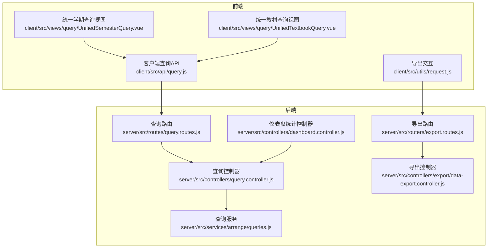
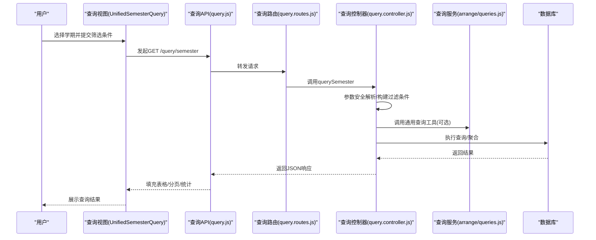
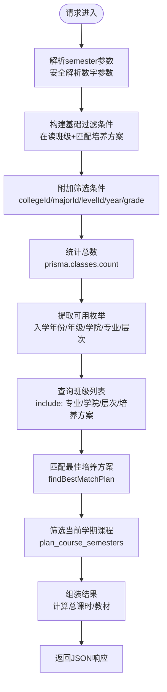
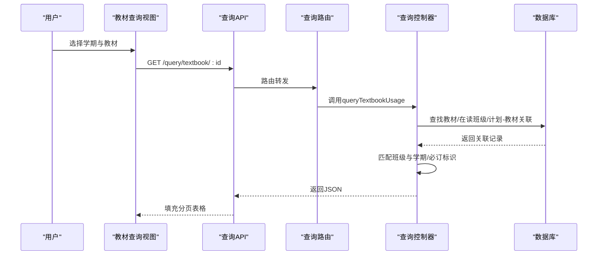
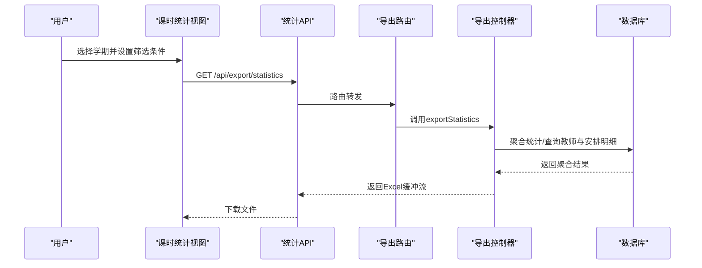
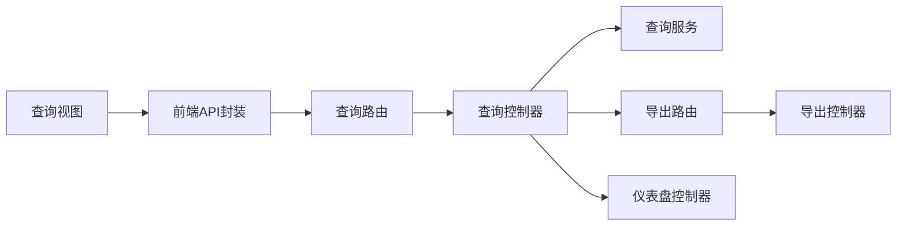

# 查询统计接口

<cite>
**本文档引用的文件**
- [client/src/api/query.js](file://client/src/api/query.js)
- [server/src/controllers/query.controller.js](file://server/src/controllers/query.controller.js)
- [server/src/routes/query.routes.js](file://server/src/routes/query.routes.js)
- [server/src/services/arrange/queries.js](file://server/src/services/arrange/queries.js)
- [client/src/views/query/UnifiedSemesterQuery.vue](file://client/src/views/query/UnifiedSemesterQuery.vue)
- [client/src/views/query/UnifiedTextbookQuery.vue](file://client/src/views/query/UnifiedTextbookQuery.vue)
- [server/src/controllers/export/data-export.controller.js](file://server/src/controllers/export/data-export.controller.js)
- [server/src/routers/export.routes.js](file://server/src/routers/export.routes.js)
- [server/src/controllers/dashboard.controller.js](file://server/src/controllers/dashboard.controller.js)
- [client/src/views/teaching/TeachingStatistics.vue](file://client/src/views/teaching/TeachingStatistics.vue)
- [server/src/services/class-filter.service.js](file://server/src/services/class-filter.service.js)
- [server/src/constants/index.js](file://server/src/constants/index.js)
</cite>

## 目录
1. [简介](#简介)
2. [项目结构](#项目结构)
3. [核心组件](#核心组件)
4. [架构总览](#架构总览)
5. [详细组件分析](#详细组件分析)
6. [依赖分析](#依赖分析)
7. [性能考虑](#性能考虑)
8. [故障排查指南](#故障排查指南)
9. [结论](#结论)
10. [附录](#附录)

## 简介
本文件面向“查询统计接口”的设计与实现，覆盖以下目标：
- 课表查询接口：支持按学期、学院、专业、层次、入学年份、年级等多维度过滤，包含分页、排序与导出能力。
- 教学统计分析接口：提供课时统计、教师工作量、教材使用概览等指标，支持筛选与导出。
- 统一查询接口：整合学期查询、教材查询等综合查询功能，提供一致的查询体验与数据格式。
- 查询优化机制：包含安全参数解析、分页上限保护、数据库索引与缓存策略、批量查询与聚合统计等。

## 项目结构
查询统计相关模块分布于前后端：
- 前端：查询页面组件、API封装、导出交互。
- 后端：查询控制器、路由、服务层（查询逻辑与统计）、导出控制器、常量与中间件。

图表来源
- [client/src/api/query.js:1-7](file://client/src/api/query.js#L1-L7)
- [server/src/routes/query.routes.js:1-27](file://server/src/routes/query.routes.js#L1-L27)
- [server/src/controllers/query.controller.js:1-573](file://server/src/controllers/query.controller.js#L1-L573)
- [server/src/services/arrange/queries.js:1-475](file://server/src/services/arrange/queries.js#L1-L475)
- [server/src/routers/export.routes.js:40-74](file://server/src/routers/export.routes.js#L40-L74)
- [server/src/controllers/export/data-export.controller.js:508-700](file://server/src/controllers/export/data-export.controller.js#L508-L700)
- [server/src/controllers/dashboard.controller.js:1-73](file://server/src/controllers/dashboard.controller.js#L1-L73)

章节来源
- [client/src/api/query.js:1-7](file://client/src/api/query.js#L1-L7)
- [server/src/routes/query.routes.js:1-27](file://server/src/routes/query.routes.js#L1-L27)
- [server/src/controllers/query.controller.js:1-573](file://server/src/controllers/query.controller.js#L1-L573)
- [server/src/services/arrange/queries.js:1-475](file://server/src/services/arrange/queries.js#L1-L475)
- [server/src/routers/export.routes.js:40-74](file://server/src/routers/export.routes.js#L40-L74)
- [server/src/controllers/export/data-export.controller.js:508-700](file://server/src/controllers/export/data-export.controller.js#L508-L700)
- [server/src/controllers/dashboard.controller.js:1-73](file://server/src/controllers/dashboard.controller.js#L1-L73)

## 核心组件
- 查询API封装：提供学期查询、教材使用查询、教材概览查询的HTTP请求方法。
- 查询控制器：实现查询业务逻辑，包括参数安全解析、过滤条件构建、分页与排序、结果聚合与返回。
- 查询服务：提供通用查询工具（如学期解析、班级-方案匹配、教师-教材匹配等）。
- 导出控制器：提供课时统计、教材使用、教学安排等报表导出能力。
- 前端查询视图：统一的查询界面，支持筛选、分页、展开详情、导出Excel。
- 统一查询路由：定义查询相关REST接口。

章节来源
- [client/src/api/query.js:1-7](file://client/src/api/query.js#L1-L7)
- [server/src/controllers/query.controller.js:25-344](file://server/src/controllers/query.controller.js#L25-L344)
- [server/src/services/arrange/queries.js:5-184](file://server/src/services/arrange/queries.js#L5-L184)
- [server/src/controllers/export/data-export.controller.js:508-700](file://server/src/controllers/export/data-export.controller.js#L508-L700)
- [client/src/views/query/UnifiedSemesterQuery.vue:1-499](file://client/src/views/query/UnifiedSemesterQuery.vue#L1-L499)
- [client/src/views/query/UnifiedTextbookQuery.vue:1-358](file://client/src/views/query/UnifiedTextbookQuery.vue#L1-L358)

## 架构总览
查询统计接口采用“前端视图 + API封装 + 后端控制器 + 服务层 + 数据库”的分层架构。查询控制器负责参数校验、过滤、分页与聚合，服务层提供通用查询工具，导出控制器负责报表生成与下载。

图表来源
- [client/src/views/query/UnifiedSemesterQuery.vue:253-297](file://client/src/views/query/UnifiedSemesterQuery.vue#L253-L297)
- [client/src/api/query.js:3](file://client/src/api/query.js#L3)
- [server/src/routes/query.routes.js:14](file://server/src/routes/query.routes.js#L14)
- [server/src/controllers/query.controller.js:28-344](file://server/src/controllers/query.controller.js#L28-L344)
- [server/src/services/arrange/queries.js:63-184](file://server/src/services/arrange/queries.js#L63-L184)

## 详细组件分析

### 1) 课表查询接口（按学期）
- 接口路径：GET /api/query/semester
- 功能概述：返回当前学期在读班级的开课信息，包含课程、周课时、学期总课时、教材等，并提供分页、筛选与统计信息。
- 查询参数
  - 必填：semester（学期字符串，格式YYYY-YYYY-N）
  - 可选：collegeId、majorId、trainingLevelId、enrollmentYear、grade、page、pageSize
- 安全与健壮性
  - 参数安全解析：非数字参数回退为默认值，防止NaN导致服务器错误。
  - 分页上限保护：限制pageSize最大为100，最小为1，避免内存压力。
  - 年级筛选下推：将grade转换为enrollmentYear并下推至数据库层，提升分页总数准确性。
- 数据结构
  - 返回字段包含：semesterInfo、totalClasses、total、totalWithCourses、page、pageSize、enrollmentYears、grades、collegeIds、majorIds、levelIds、collegeMajorRelation、collegeLevelRelation、majorLevelRelation、data（班级列表）。
  - data中每个班级对象包含：classId、className、collegeName、majorName、trainingLevelName、enrollment_year、grade、currentSemester、student_count、planName、courses（课程数组）。
  - courses中每个课程对象包含：course_id、courseName、courseType、weekly_hours、weeks_per_semester、totalHoursThisSemester、textbooks（教材数组）。
- 性能优化
  - 预加载培养方案与课程计划，减少N+1查询。
  - 使用数据库聚合与分页，避免一次性加载全量数据。
  - 对常用筛选条件建立复合索引（schema迁移脚本中已添加）。

图表来源
- [server/src/controllers/query.controller.js:28-344](file://server/src/controllers/query.controller.js#L28-L344)

章节来源
- [server/src/controllers/query.controller.js:25-344](file://server/src/controllers/query.controller.js#L25-L344)
- [server/src/routes/query.routes.js:14](file://server/src/routes/query.routes.js#L14)
- [client/src/views/query/UnifiedSemesterQuery.vue:253-297](file://client/src/views/query/UnifiedSemesterQuery.vue#L253-L297)

### 2) 教材使用查询接口
- 接口路径：GET /api/query/textbook/:id
- 功能概述：返回指定教材在当前学期的使用情况，包括使用班级、年级、学生人数、是否必订等。
- 查询参数
  - 必填：id（教材ID）
  - 可选：semester（学期字符串）
- 数据结构
  - 返回字段包含：textbook（教材基本信息）、semesterInfo、classes（班级列表）、totalClasses、totalStudents。
  - classes中每个班级对象包含：classId、className、majorName、trainingLevelName、student_count、grade、semester、courseName、is_required。
- 性能优化
  - 使用Promise并发查询教材与在读班级，减少往返时间。
  - 通过计划-课程-学期记录定位使用班级，避免全表扫描。

图表来源
- [client/src/views/query/UnifiedTextbookQuery.vue:181-206](file://client/src/views/query/UnifiedTextbookQuery.vue#L181-L206)
- [client/src/api/query.js:4-6](file://client/src/api/query.js#L4-L6)
- [server/src/routes/query.routes.js:19](file://server/src/routes/query.routes.js#L19)
- [server/src/controllers/query.controller.js:346-451](file://server/src/controllers/query.controller.js#L346-L451)

章节来源
- [server/src/controllers/query.controller.js:346-451](file://server/src/controllers/query.controller.js#L346-L451)
- [client/src/api/query.js:4-6](file://client/src/api/query.js#L4-L6)
- [client/src/views/query/UnifiedTextbookQuery.vue:181-206](file://client/src/views/query/UnifiedTextbookQuery.vue#L181-L206)

### 3) 教材使用概览接口
- 接口路径：GET /api/query/textbooks
- 功能概述：返回所有教材的使用概览，包含使用班级数与总学生数。
- 查询参数
  - 可选：semester（学期字符串）
- 数据结构
  - 返回数组，每项包含：id、title、isbn、publisher、classCount、totalStudents。
- 性能优化
  - 构建班级索引（按入学年份/专业/层次），O(1)快速查找匹配班级。
  - 校验当前学期号一致性，避免非当前学期数据干扰。

章节来源
- [server/src/controllers/query.controller.js:453-572](file://server/src/controllers/query.controller.js#L453-L572)
- [client/src/api/query.js:6](file://client/src/api/query.js#L6)

### 4) 教学统计分析接口
- 课时统计（教师工作量）
  - 接口路径：GET /api/export/statistics（导出）；前端通过 /api/teaching-arrange 统计接口获取。
  - 功能概述：按教师聚合周课时、班级数，支持按姓名、人员类别、科目、归属学院、任课层次、任课学院等筛选。
  - 数据结构：每条记录包含教师基本信息、任课学院/层次、班级数、总周课时、课程明细。
  - 导出能力：支持Excel导出，包含合计行。
- 仪表盘统计
  - 接口路径：GET /api/dashboard/stats
  - 功能概述：返回基于当前学期的概览统计（专业数、课程数、在读班级数、活跃教材数、培养方案数、在读学生数、参与教师数、总周课时）。
  - 数据结构：包含各统计指标与学期标识。

图表来源
- [client/src/views/teaching/TeachingStatistics.vue:322-350](file://client/src/views/teaching/TeachingStatistics.vue#L322-L350)
- [server/src/routers/export.routes.js:63-64](file://server/src/routers/export.routes.js#L63-L64)
- [server/src/controllers/export/data-export.controller.js:508-700](file://server/src/controllers/export/data-export.controller.js#L508-L700)
- [server/src/controllers/dashboard.controller.js:19-72](file://server/src/controllers/dashboard.controller.js#L19-L72)

章节来源
- [client/src/views/teaching/TeachingStatistics.vue:1-392](file://client/src/views/teaching/TeachingStatistics.vue#L1-L392)
- [server/src/controllers/export/data-export.controller.js:508-700](file://server/src/controllers/export/data-export.controller.js#L508-L700)
- [server/src/controllers/dashboard.controller.js:19-72](file://server/src/controllers/dashboard.controller.js#L19-L72)

### 5) 统一查询接口与前端集成
- 统一学期查询视图
  - 支持按学期、学院、专业、层次、入学年份、年级筛选，提供分页与导出Excel。
  - 前端通过查询API获取数据，渲染表格与统计信息。
- 统一教材查询视图
  - 支持按学期、教材筛选，展示教材使用详情与分页。
  - 提供导出Excel功能，包含教材基本信息与使用班级列表。

章节来源
- [client/src/views/query/UnifiedSemesterQuery.vue:1-499](file://client/src/views/query/UnifiedSemesterQuery.vue#L1-L499)
- [client/src/views/query/UnifiedTextbookQuery.vue:1-358](file://client/src/views/query/UnifiedTextbookQuery.vue#L1-L358)
- [client/src/api/query.js:1-7](file://client/src/api/query.js#L1-L7)

## 依赖分析
- 前端依赖
  - 查询API封装：封装HTTP请求，便于视图组件调用。
  - 视图组件：负责筛选、分页、展开详情与导出交互。
- 后端依赖
  - 路由：定义REST接口，参数校验与鉴权中间件。
  - 控制器：业务逻辑入口，参数解析、过滤、分页、聚合与响应。
  - 服务层：通用查询工具（学期解析、方案匹配、教师-教材匹配等）。
  - 导出控制器：报表生成与下载。
  - 常量：教材内聚优化配置等。

图表来源
- [client/src/api/query.js:1-7](file://client/src/api/query.js#L1-L7)
- [server/src/routes/query.routes.js:1-27](file://server/src/routes/query.routes.js#L1-L27)
- [server/src/controllers/query.controller.js:1-573](file://server/src/controllers/query.controller.js#L1-L573)
- [server/src/services/arrange/queries.js:1-475](file://server/src/services/arrange/queries.js#L1-L475)
- [server/src/routers/export.routes.js:40-74](file://server/src/routers/export.routes.js#L40-L74)
- [server/src/controllers/export/data-export.controller.js:508-700](file://server/src/controllers/export/data-export.controller.js#L508-L700)
- [server/src/controllers/dashboard.controller.js:1-73](file://server/src/controllers/dashboard.controller.js#L1-L73)

章节来源
- [server/src/constants/index.js:88-98](file://server/src/constants/index.js#L88-L98)

## 性能考虑
- 参数安全与健壮性
  - 数字参数安全解析：非数字参数回退默认值，避免NaN导致服务器错误。
  - 分页上限保护：pageSize限制在1~100之间，防止OOM。
  - 年级筛选下推：将grade转换为enrollmentYear并下推数据库层，提升分页总数准确性。
- 查询优化
  - 预加载与批量查询：预加载培养方案与课程计划，减少N+1查询。
  - 并发查询：在教材使用查询中使用Promise并发获取教材与在读班级。
  - 索引与关系：数据库迁移脚本中新增复合索引与唯一约束，提升查询效率。
- 缓存与导出
  - 前端仪表盘统计使用缓存（TTL 5分钟），降低重复请求压力。
  - 导出接口支持Excel生成与下载，避免前端渲染大数据。

章节来源
- [server/src/controllers/query.controller.js:44-52](file://server/src/controllers/query.controller.js#L44-L52)
- [server/src/controllers/query.controller.js:75-80](file://server/src/controllers/query.controller.js#L75-L80)
- [server/src/controllers/query.controller.js:367-390](file://server/src/controllers/query.controller.js#L367-L390)
- [server/src/controllers/export/data-export.controller.js:508-700](file://server/src/controllers/export/data-export.controller.js#L508-L700)
- [client/src/views/Dashboard.vue:368-373](file://client/src/views/Dashboard.vue#L368-L373)

## 故障排查指南
- 常见错误与处理
  - 学期未设置：返回“请先设置当前学期”。
  - 学期格式错误：返回“学期格式错误，应为 YYYY-YYYY-N”。
  - 教材不存在：返回“教材不存在”。
  - 缺少必要参数：如导出统计缺少学期，返回“请选择学期”。
- 日志与审计
  - 导出操作记录审计日志，包含操作者、IP、行数、结果等信息，便于追踪与排错。
- 前端提示
  - 查询失败与导出失败时，前端显示错误消息并保留当前状态，便于用户重试。

章节来源
- [server/src/controllers/query.controller.js:32-39](file://server/src/controllers/query.controller.js#L32-L39)
- [server/src/controllers/export/data-export.controller.js:41-70](file://server/src/controllers/export/data-export.controller.js#L41-L70)
- [client/src/views/query/UnifiedSemesterQuery.vue:291-296](file://client/src/views/query/UnifiedSemesterQuery.vue#L291-L296)
- [client/src/views/query/UnifiedTextbookQuery.vue:198-205](file://client/src/views/query/UnifiedTextbookQuery.vue#L198-L205)

## 结论
查询统计接口通过清晰的分层设计与完善的查询优化机制，实现了灵活的多维度过滤、高效的分页与聚合、以及便捷的报表导出。统一查询视图提升了用户体验，而严格的参数校验与健壮性设计保障了系统的稳定性与安全性。

## 附录

### A. API定义与数据格式

- 课表查询（按学期）
  - 方法：GET /api/query/semester
  - 查询参数：
    - semester（必填，YYYY-YYYY-N）
    - collegeId、majorId、trainingLevelId、enrollmentYear、grade、page、pageSize（可选）
  - 响应字段：
    - semesterInfo：{ label, startYear, endYear, semesterIndex }
    - totalClasses、total、totalWithCourses、page、pageSize
    - enrollmentYears、grades、collegeIds、majorIds、levelIds
    - collegeMajorRelation、collegeLevelRelation、majorLevelRelation
    - data：班级数组，每项包含 classId、className、collegeName、majorName、trainingLevelName、enrollment_year、grade、currentSemester、student_count、planName、courses
    - courses中每项包含 course_id、courseName、courseType、weekly_hours、weeks_per_semester、totalHoursThisSemester、textbooks

- 教材使用查询
  - 方法：GET /api/query/textbook/:id
  - 查询参数：
    - semester（可选）
  - 响应字段：
    - textbook：{ id, title, isbn, publisher, author, publish_date }
    - semesterInfo：{ label }
    - classes：班级数组，每项包含 classId、className、majorName、trainingLevelName、student_count、grade、semester、courseName、is_required
    - totalClasses、totalStudents

- 教材使用概览
  - 方法：GET /api/query/textbooks
  - 查询参数：
    - semester（可选）
  - 响应字段：
    - 数组，每项包含 id、title、isbn、publisher、classCount、totalStudents

- 课时统计导出
  - 方法：GET /api/export/statistics
  - 查询参数：
    - semester（必填）
    - name、type、subject、affiliated_college、level、college（可选）
  - 响应：Excel文件（application/vnd.openxmlformats-officedocument.spreadsheetml.sheet）

- 仪表盘统计
  - 方法：GET /api/dashboard/stats
  - 查询参数：
    - semester（必填）
  - 响应字段：
    - semester、majors、courses、classes、textbooks、plans、totalStudents、teachingTeachers、totalWeeklyHours

章节来源
- [server/src/controllers/query.controller.js:28-344](file://server/src/controllers/query.controller.js#L28-L344)
- [server/src/controllers/query.controller.js:346-451](file://server/src/controllers/query.controller.js#L346-L451)
- [server/src/controllers/query.controller.js:453-572](file://server/src/controllers/query.controller.js#L453-L572)
- [server/src/controllers/export/data-export.controller.js:508-700](file://server/src/controllers/export/data-export.controller.js#L508-L700)
- [server/src/controllers/dashboard.controller.js:19-72](file://server/src/controllers/dashboard.controller.js#L19-L72)

### B. 查询条件过滤与分页处理
- 过滤条件
  - 学期：必需，YYYY-YYYY-N格式。
  - 学院/专业/层次：可选，支持多选。
  - 入学年份/年级：可选，年级会转换为入学年份并下推数据库层。
- 分页
  - page默认1，pageSize默认50，上限100。
  - 分页总数基于数据库count结果，避免误判。
- 排序
  - 默认按入学年份降序，可在服务层扩展。

章节来源
- [server/src/controllers/query.controller.js:41-52](file://server/src/controllers/query.controller.js#L41-L52)
- [server/src/controllers/query.controller.js:75-80](file://server/src/controllers/query.controller.js#L75-L80)
- [server/src/controllers/query.controller.js:201-204](file://server/src/controllers/query.controller.js#L201-L204)

### C. 实际应用场景示例
- 教务管理：按学期查看各班级开课情况，核对周课时与教材需求。
- 教研分析：统计教师工作量与承担课程，评估教学负荷。
- 教材管理：跟踪教材使用情况，指导采购与库存管理。
- 报表生成：导出课时统计与教学安排，满足审核与归档需要。