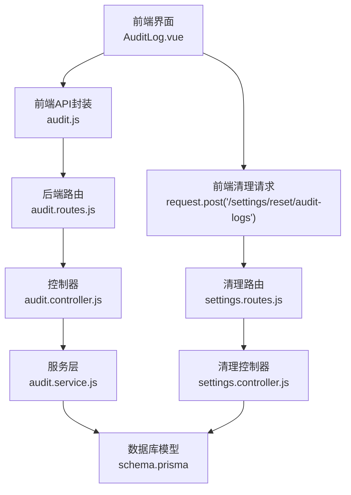
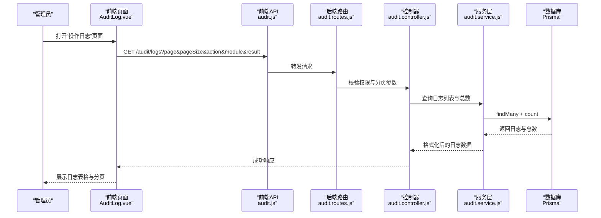
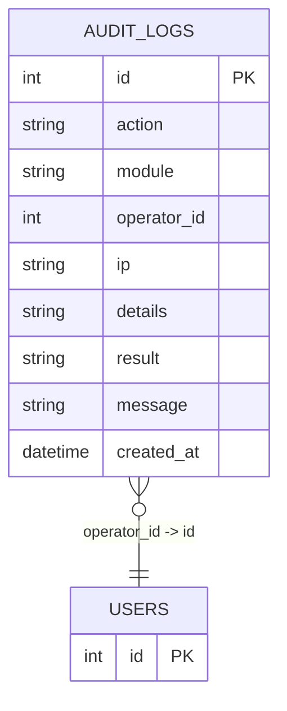
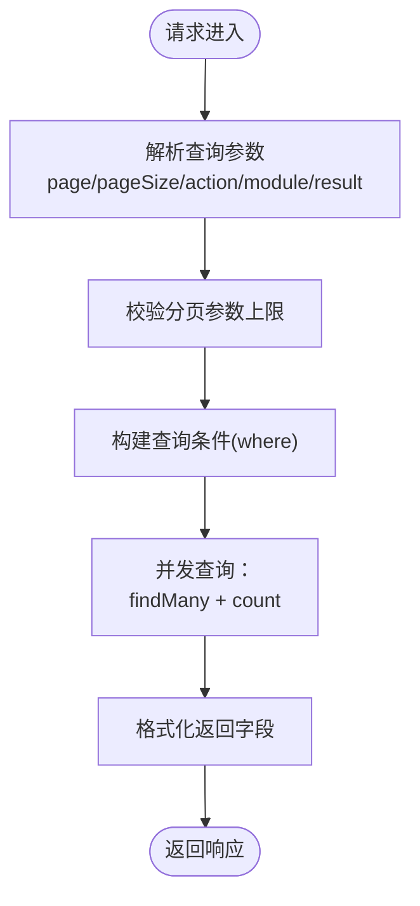
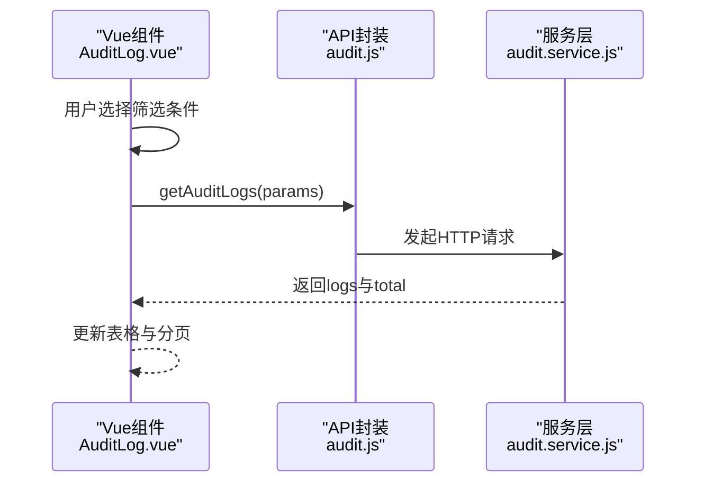
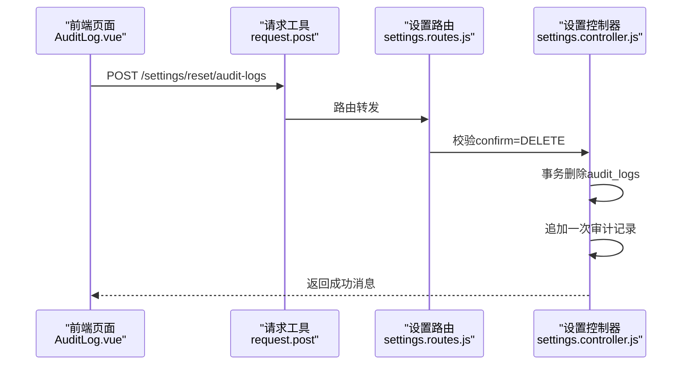
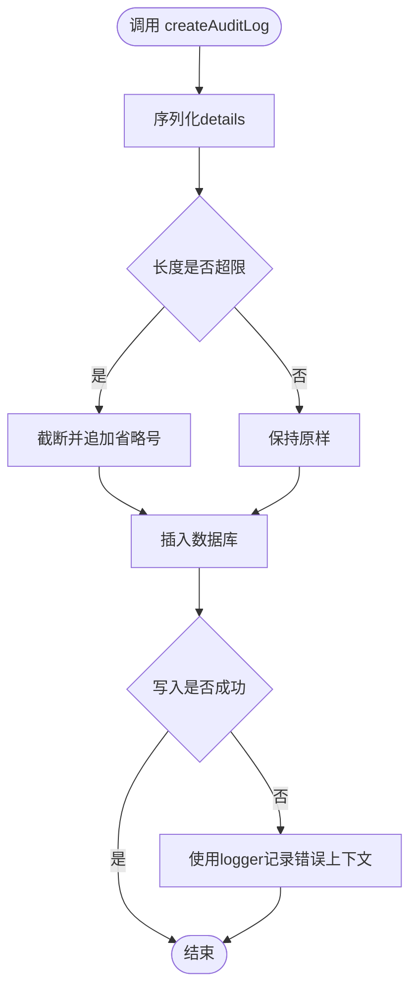
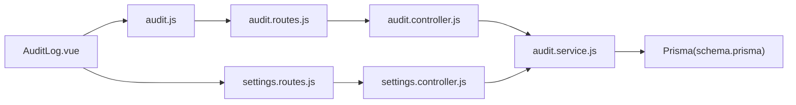

# 审计日志接口

<cite>
**本文引用的文件**
- [AuditLog.vue](file://client/src/views/system/AuditLog.vue)
- [audit.js](file://client/src/api/audit.js)
- [audit.controller.js](file://server/src/controllers/audit.controller.js)
- [audit.service.js](file://server/src/services/audit.service.js)
- [audit.routes.js](file://server/src/routes/audit.routes.js)
- [settings.controller.js](file://server/src/controllers/settings.controller.js)
- [settings.routes.js](file://server/src/routes/settings.routes.js)
- [validation-audit.js](file://server/src/middleware/validation-audit.js)
- [logger.js](file://server/src/utils/logger.js)
- [schema.prisma](file://server/prisma/schema.prisma)
- [courses.js](file://server/src/controllers/import/courses.js)
- [data-export.controller.js](file://server/src/controllers/export/data-export.controller.js)
</cite>

## 目录
1. [简介](#简介)
2. [项目结构](#项目结构)
3. [核心组件](#核心组件)
4. [架构总览](#架构总览)
5. [详细组件分析](#详细组件分析)
6. [依赖关系分析](#依赖关系分析)
7. [性能考虑](#性能考虑)
8. [故障排查指南](#故障排查指南)
9. [结论](#结论)
10. [附录](#附录)

## 简介
本文件为“审计日志接口”的权威技术文档，面向系统管理员与开发者，覆盖以下主题：
- 审计日志查询、过滤、分页的完整API说明
- 审计日志数据结构、日志级别与操作类型分类
- 高级筛选条件（时间范围、用户过滤等）的参数配置
- 日志清理与归档策略接口说明
- 日志分析与统计报表相关接口与数据格式
- 实际查询示例与性能优化建议

## 项目结构
审计日志能力由前后端协同实现：
- 前端负责展示与交互，提供筛选器、分页控件与详情弹窗
- 后端提供REST接口，封装查询、清理与审计记录写入
- 数据库存储采用Prisma管理，SQLite作为数据源
- 日志清理通过事务保证一致性，并在完成后追加一次审计记录

图表来源
- [AuditLog.vue:190-385](file://client/src/views/system/AuditLog.vue#L190-L385)
- [audit.js:1-4](file://client/src/api/audit.js#L1-L4)
- [audit.routes.js:1-14](file://server/src/routes/audit.routes.js#L1-L14)
- [audit.controller.js:1-22](file://server/src/controllers/audit.controller.js#L1-L22)
- [audit.service.js:1-94](file://server/src/services/audit.service.js#L1-L94)
- [schema.prisma:10-26](file://server/prisma/schema.prisma#L10-L26)
- [settings.routes.js](file://server/src/routes/settings.routes.js#L59)
- [settings.controller.js:414-444](file://server/src/controllers/settings.controller.js#L414-L444)

章节来源
- [AuditLog.vue:1-449](file://client/src/views/system/AuditLog.vue#L1-L449)
- [audit.js:1-4](file://client/src/api/audit.js#L1-L4)
- [audit.routes.js:1-14](file://server/src/routes/audit.routes.js#L1-L14)
- [audit.controller.js:1-22](file://server/src/controllers/audit.controller.js#L1-L22)
- [audit.service.js:1-94](file://server/src/services/audit.service.js#L1-L94)
- [schema.prisma:10-26](file://server/prisma/schema.prisma#L10-L26)
- [settings.controller.js:414-444](file://server/src/controllers/settings.controller.js#L414-L444)
- [settings.routes.js](file://server/src/routes/settings.routes.js#L59)

## 核心组件
- 前端审计日志页面：提供操作类型、所属模块、执行结果三类筛选，支持分页与详情查看；提供“清空日志”入口。
- 前端API封装：对GET /audit/logs进行封装，供页面调用。
- 后端审计路由：受超级管理员角色保护，校验分页参数上限。
- 审计服务：实现日志查询与写入，含防膨胀处理与安全降级。
- 设置清理控制器：提供事务式清空审计日志的能力，并追加一次审计记录。

章节来源
- [AuditLog.vue:15-140](file://client/src/views/system/AuditLog.vue#L15-L140)
- [audit.js:1-4](file://client/src/api/audit.js#L1-L4)
- [audit.routes.js:8-11](file://server/src/routes/audit.routes.js#L8-L11)
- [audit.service.js:60-94](file://server/src/services/audit.service.js#L60-L94)
- [settings.controller.js:414-444](file://server/src/controllers/settings.controller.js#L414-L444)

## 架构总览
审计日志查询与清理的端到端流程如下：

图表来源
- [AuditLog.vue:362-385](file://client/src/views/system/AuditLog.vue#L362-L385)
- [audit.js:1-4](file://client/src/api/audit.js#L1-L4)
- [audit.routes.js:8-11](file://server/src/routes/audit.routes.js#L8-L11)
- [audit.controller.js:7-21](file://server/src/controllers/audit.controller.js#L7-L21)
- [audit.service.js:60-94](file://server/src/services/audit.service.js#L60-L94)

## 详细组件分析

### 数据模型与字段定义
审计日志表结构（Prisma模型）包含以下关键字段：
- id：自增主键
- action：操作类型（如 login、logout、import、export、create、update、delete）
- module：所属模块（如 auth、user、class、course、textbook、major、college、trainingPlan、training_level、teacher、teachingArrange、system）
- operator_id：操作人ID（外键关联用户表，允许为空）
- ip：客户端IP（允许为空）
- details：操作详情（JSON字符串，最大长度限制）
- result：执行结果（success 或 failed）
- message：简要消息
- created_at：创建时间，默认当前时间戳

图表来源
- [schema.prisma:10-26](file://server/prisma/schema.prisma#L10-L26)

章节来源
- [schema.prisma:10-26](file://server/prisma/schema.prisma#L10-L26)

### 审计日志查询接口
- 接口路径：GET /api/audit/logs
- 权限要求：超级管理员
- 分页参数校验：每页最大100条
- 请求参数
  - page：页码，默认1
  - pageSize：每页数量，默认20，上限100
  - action：操作类型筛选（可选）
  - module：所属模块筛选（可选）
  - result：执行结果筛选（可选）
- 响应体
  - logs：日志数组，包含字段 id、action、module、operator_id、ip、details、result、message、created_at
  - total：满足条件的日志总数
  - page、pageSize：当前页码与每页数量

图表来源
- [audit.controller.js:7-21](file://server/src/controllers/audit.controller.js#L7-L21)
- [audit.service.js:60-94](file://server/src/services/audit.service.js#L60-L94)
- [audit.routes.js:8-11](file://server/src/routes/audit.routes.js#L8-L11)

章节来源
- [audit.controller.js:1-22](file://server/src/controllers/audit.controller.js#L1-L22)
- [audit.service.js:60-94](file://server/src/services/audit.service.js#L60-L94)
- [audit.routes.js:1-14](file://server/src/routes/audit.routes.js#L1-L14)

### 前端查询与交互
- 页面提供三类筛选器：操作类型、所属模块、执行结果
- 支持重置筛选、分页切换与页尺寸调整
- 列表按创建时间倒序排列
- 详情弹窗支持表格视图与原始JSON视图切换

图表来源
- [AuditLog.vue:362-385](file://client/src/views/system/AuditLog.vue#L362-L385)
- [audit.js:1-4](file://client/src/api/audit.js#L1-L4)
- [audit.service.js:60-94](file://server/src/services/audit.service.js#L60-L94)

章节来源
- [AuditLog.vue:15-140](file://client/src/views/system/AuditLog.vue#L15-L140)
- [audit.js:1-4](file://client/src/api/audit.js#L1-L4)

### 日志清理接口
- 接口路径：POST /settings/reset/audit-logs
- 验证规则：请求体需包含 confirm=DELETE
- 处理逻辑：事务中删除所有审计日志，并追加一条“delete(system)”的审计记录
- 响应：成功消息“操作日志已清空”

图表来源
- [AuditLog.vue:348-360](file://client/src/views/system/AuditLog.vue#L348-L360)
- [settings.routes.js](file://server/src/routes/settings.routes.js#L59)
- [settings.controller.js:414-444](file://server/src/controllers/settings.controller.js#L414-L444)
- [validation-audit.js:7-10](file://server/src/middleware/validation-audit.js#L7-L10)

章节来源
- [AuditLog.vue:9-12](file://client/src/views/system/AuditLog.vue#L9-L12)
- [settings.controller.js:414-444](file://server/src/controllers/settings.controller.js#L414-L444)
- [settings.routes.js](file://server/src/routes/settings.routes.js#L59)
- [validation-audit.js:1-11](file://server/src/middleware/validation-audit.js#L1-L11)

### 审计日志写入与安全降级
- 写入时机：各业务模块在关键操作后调用 createAuditLog
- 参数要点：action、module、userId、ip、details（对象或JSON字符串）、result、message
- 防膨胀策略：details序列化后若超过阈值则截断
- 安全降级：写入异常时通过统一logger记录错误上下文，不抛出错误以免影响主流程

图表来源
- [audit.service.js:15-49](file://server/src/services/audit.service.js#L15-L49)
- [logger.js:34-96](file://server/src/utils/logger.js#L34-L96)

章节来源
- [audit.service.js:1-94](file://server/src/services/audit.service.js#L1-L94)
- [logger.js:1-96](file://server/src/utils/logger.js#L1-L96)

### 典型业务中的审计记录
- 课程导入：统计导入总量、新增、覆盖、失败数，并根据结果标记success/failed
- 教材导出：捕获异常时记录失败原因与上下文
- 系统初始化/重置：记录初始化项与重置原因

章节来源
- [courses.js:116-144](file://server/src/controllers/import/courses.js#L116-L144)
- [data-export.controller.js:411-422](file://server/src/controllers/export/data-export.controller.js#L411-L422)
- [settings.controller.js:141-167](file://server/src/controllers/settings.controller.js#L141-L167)

## 依赖关系分析
- 前端依赖
  - AuditLog.vue 依赖 audit.js 提供的 getAuditLogs 方法
  - AuditLog.vue 通过 request.post 调用 /settings/reset/audit-logs 完成清理
- 后端依赖
  - audit.routes.js 依赖 audit.controller.js
  - audit.controller.js 依赖 audit.service.js
  - audit.service.js 依赖 Prisma 客户端与 logger
  - settings.routes.js 依赖 settings.controller.js
  - settings.controller.js 依赖 Prisma 事务与 createAuditLog

图表来源
- [AuditLog.vue:190-385](file://client/src/views/system/AuditLog.vue#L190-L385)
- [audit.js:1-4](file://client/src/api/audit.js#L1-L4)
- [audit.routes.js:1-14](file://server/src/routes/audit.routes.js#L1-L14)
- [audit.controller.js:1-22](file://server/src/controllers/audit.controller.js#L1-L22)
- [audit.service.js:1-94](file://server/src/services/audit.service.js#L1-L94)
- [schema.prisma:10-26](file://server/prisma/schema.prisma#L10-L26)
- [settings.routes.js](file://server/src/routes/settings.routes.js#L59)
- [settings.controller.js:414-444](file://server/src/controllers/settings.controller.js#L414-L444)

章节来源
- [AuditLog.vue:1-449](file://client/src/views/system/AuditLog.vue#L1-L449)
- [audit.js:1-4](file://client/src/api/audit.js#L1-L4)
- [audit.routes.js:1-14](file://server/src/routes/audit.routes.js#L1-L14)
- [audit.controller.js:1-22](file://server/src/controllers/audit.controller.js#L1-L22)
- [audit.service.js:1-94](file://server/src/services/audit.service.js#L1-L94)
- [schema.prisma:10-26](file://server/prisma/schema.prisma#L10-L26)
- [settings.routes.js](file://server/src/routes/settings.routes.js#L59)
- [settings.controller.js:414-444](file://server/src/controllers/settings.controller.js#L414-L444)

## 性能考虑
- 分页上限：后端对 pageSize 设定上限（100），避免大页扫描造成压力
- 并发查询：查询与计数采用 Promise.all 并发，降低往返延迟
- 索引设计：数据库对 created_at、operator_id、module、action 建有索引，有利于排序与过滤
- 字段截断：details 最大长度限制，防止单条记录过大导致IO与网络压力
- 建议
  - 对高频筛选字段（如 module、action、operator_id）建立复合索引
  - 在高并发场景下增加只读副本或缓存热点查询结果
  - 定期归档历史日志至冷存储，保留最近N个月的热数据

章节来源
- [audit.routes.js](file://server/src/routes/audit.routes.js#L11)
- [audit.service.js:69-77](file://server/src/services/audit.service.js#L69-L77)
- [schema.prisma:22-26](file://server/prisma/schema.prisma#L22-L26)

## 故障排查指南
- 查询无结果
  - 检查筛选条件是否过于严格，尝试清空筛选
  - 确认分页参数是否正确
- 清理失败
  - 确认请求体包含 confirm=DELETE
  - 查看后端错误日志与审计失败日志
- 详情显示异常
  - 确认 details 是否为合法JSON
  - 若为对象，检查字段映射标签是否正确
- 性能问题
  - 检查是否存在未命中索引的复杂查询
  - 关注数据库慢查询日志与连接池占用

章节来源
- [AuditLog.vue:321-334](file://client/src/views/system/AuditLog.vue#L321-L334)
- [validation-audit.js:7-10](file://server/src/middleware/validation-audit.js#L7-L10)
- [logger.js:34-96](file://server/src/utils/logger.js#L34-L96)

## 结论
本接口体系提供了完整的审计日志查询、清理与写入能力，具备良好的安全性与可维护性。通过严格的参数校验、事务保障与防膨胀策略，能够在高负载场景下稳定运行。建议结合索引优化与定期归档策略，持续提升查询性能与存储效率。

## 附录

### API 参考

- 查询审计日志
  - 方法：GET
  - 路径：/api/audit/logs
  - 权限：超级管理员
  - 查询参数
    - page：页码，默认1
    - pageSize：每页数量，默认20，上限100
    - action：操作类型（可选）
    - module：所属模块（可选）
    - result：执行结果（可选）
  - 响应
    - logs：日志数组
    - total：总数
    - page、pageSize：当前页与每页数量

- 清空审计日志
  - 方法：POST
  - 路径：/settings/reset/audit-logs
  - 请求体
    - confirm：必须为 DELETE
  - 响应：成功消息“操作日志已清空”

章节来源
- [audit.routes.js:8-11](file://server/src/routes/audit.routes.js#L8-L11)
- [audit.controller.js:7-21](file://server/src/controllers/audit.controller.js#L7-L21)
- [audit.service.js:60-94](file://server/src/services/audit.service.js#L60-L94)
- [settings.routes.js](file://server/src/routes/settings.routes.js#L59)
- [settings.controller.js:414-444](file://server/src/controllers/settings.controller.js#L414-L444)
- [validation-audit.js:7-10](file://server/src/middleware/validation-audit.js#L7-L10)

### 数据结构说明
- 日志字段
  - id：整数
  - action：字符串（取值：login、logout、import、export、create、update、delete）
  - module：字符串（取值：auth、user、class、course、textbook、major、college、trainingPlan、training_level、teacher、teachingArrange、system）
  - operator_id：整数（可空）
  - ip：字符串（可空）
  - details：字符串（JSON，最大长度限制）
  - result：字符串（取值：success、failed）
  - message：字符串（可空）
  - created_at：时间戳

章节来源
- [schema.prisma:10-26](file://server/prisma/schema.prisma#L10-L26)
- [audit.service.js:15-49](file://server/src/services/audit.service.js#L15-L49)

### 高级筛选与时间范围
- 当前实现支持的操作类型、模块与结果筛选
- 时间范围与用户过滤可通过扩展查询参数实现（例如新增 startTime、endTime、operatorId 等），建议在后端路由与服务层同步增加对应校验与where条件

章节来源
- [audit.controller.js:9-16](file://server/src/controllers/audit.controller.js#L9-L16)
- [audit.service.js:61-64](file://server/src/services/audit.service.js#L61-L64)

### 日志清理与归档策略
- 清理：事务删除全部审计日志，并追加一次审计记录，确保可追溯
- 归档：建议按月/季度导出审计日志至外部存储，保留热数据于数据库，冷数据移至对象存储或专用日志平台

章节来源
- [settings.controller.js:414-444](file://server/src/controllers/settings.controller.js#L414-L444)

### 日志分析与统计报表
- 可基于现有查询接口进行二次聚合，如按模块/操作类型/日期统计成功率与失败率
- 建议在服务层增加专门的统计接口，返回聚合指标与趋势数据

章节来源
- [audit.service.js:60-94](file://server/src/services/audit.service.js#L60-L94)

### 实际查询示例
- 获取第1页、每页20条、仅显示“导入”操作的日志
  - GET /api/audit/logs?page=1&pageSize=20&action=import
- 获取“课程”模块、“成功”结果的日志
  - GET /api/audit/logs?module=course&result=success
- 清空所有审计日志
  - POST /settings/reset/audit-logs
  - 请求体：{ "confirm": "DELETE" }

章节来源
- [audit.controller.js:9-16](file://server/src/controllers/audit.controller.js#L9-L16)
- [AuditLog.vue:348-360](file://client/src/views/system/AuditLog.vue#L348-L360)
- [validation-audit.js:7-10](file://server/src/middleware/validation-audit.js#L7-L10)