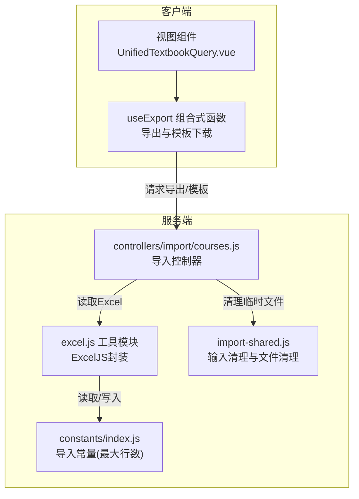
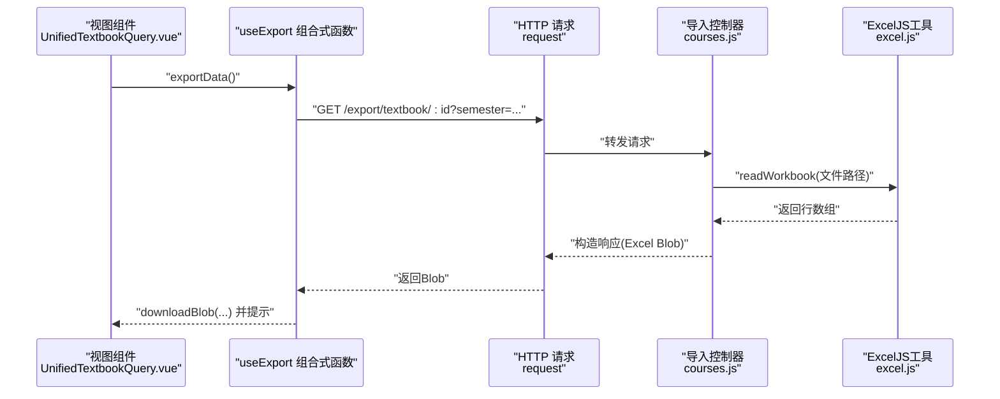
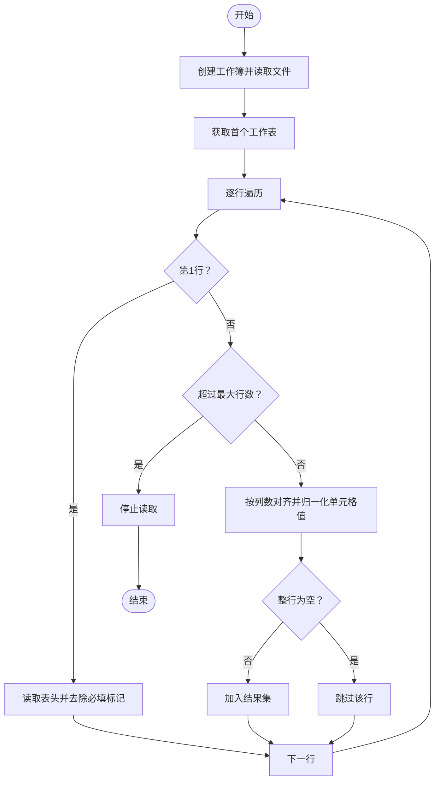
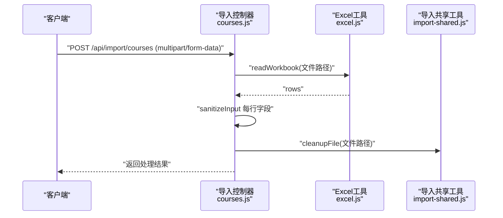
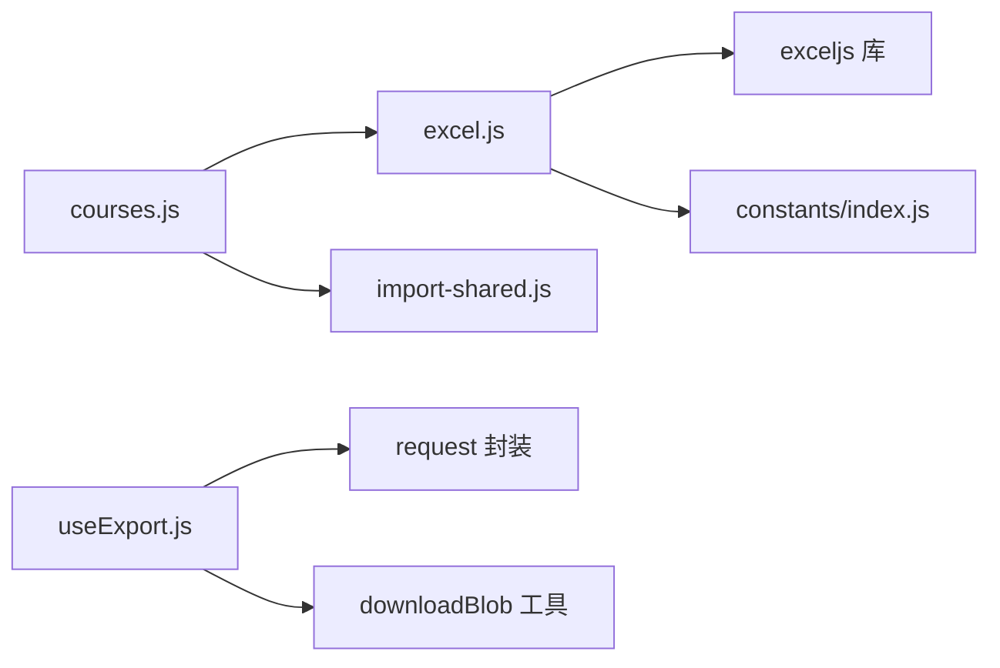

# Excel文件处理

<cite>
**本文引用的文件**
- [server/src/utils/excel.js](file://server/src/utils/excel.js)
- [server/src/controllers/import/courses.js](file://server/src/controllers/import/courses.js)
- [server/src/constants/index.js](file://server/src/constants/index.js)
- [server/src/controllers/import-shared.js](file://server/src/controllers/import-shared.js)
- [client/src/composables/useExport.js](file://client/src/composables/useExport.js)
- [client/src/views/query/UnifiedTextbookQuery.vue](file://client/src/views/query/UnifiedTextbookQuery.vue)
</cite>

## 目录
1. [简介](#简介)
2. [项目结构](#项目结构)
3. [核心组件](#核心组件)
4. [架构总览](#架构总览)
5. [详细组件分析](#详细组件分析)
6. [依赖关系分析](#依赖关系分析)
7. [性能考虑](#性能考虑)
8. [故障排查指南](#故障排查指南)
9. [结论](#结论)
10. [附录](#附录)

## 简介
本文件面向Excel文件处理功能，围绕服务端与客户端的协作展开，重点阐述以下方面：
- 文件格式识别与读取流程：基于ExcelJS的工作簿读取、工作表遍历与数据抽取
- 单元格数据提取与类型转换：日期、富文本、数值与字符串的规范化处理
- 行列映射规则：表头清洗、列数对齐与空行判定策略
- ExcelJS库使用要点：工作簿创建、模板生成、缓冲区输出
- 客户端导出与下载：通用导出组合式函数与视图层调用
- 安全与合规：公式注入防护、输入清理与格式验证
- 上传限制与容量控制：最大行数限制与文件路径清理

## 项目结构
Excel处理能力在前后端均有体现：
- 服务端工具层：封装ExcelJS操作，提供读取、写入、模板生成与安全处理
- 服务端控制器层：对接导入接口，读取上传文件并进行校验与清洗
- 客户端导出层：提供通用导出组合式函数，支持模板下载与数据导出

图表来源
- [server/src/utils/excel.js:1-170](file://server/src/utils/excel.js#L1-L170)
- [server/src/controllers/import/courses.js:1-39](file://server/src/controllers/import/courses.js#L1-L39)
- [server/src/constants/index.js](file://server/src/constants/index.js)
- [server/src/controllers/import-shared.js](file://server/src/controllers/import-shared.js)
- [client/src/composables/useExport.js:1-35](file://client/src/composables/useExport.js#L1-L35)
- [client/src/views/query/UnifiedTextbookQuery.vue:240-291](file://client/src/views/query/UnifiedTextbookQuery.vue#L240-L291)

章节来源
- [server/src/utils/excel.js:1-170](file://server/src/utils/excel.js#L1-L170)
- [server/src/controllers/import/courses.js:1-39](file://server/src/controllers/import/courses.js#L1-L39)
- [client/src/composables/useExport.js:1-35](file://client/src/composables/useExport.js#L1-L35)
- [client/src/views/query/UnifiedTextbookQuery.vue:240-291](file://client/src/views/query/UnifiedTextbookQuery.vue#L240-L291)

## 核心组件
- ExcelJS工具模块（服务端）：提供工作簿创建、Excel读取、单元格值归一化、模板生成与缓冲区输出
- 导入控制器（课程）：接收上传文件，读取Excel数据，执行输入清理与业务校验
- 导入共享工具：上传文件清理与输入清理
- 客户端导出组合式函数：统一封装导出请求、模板下载与提示反馈
- 常量配置：导入最大行数限制

章节来源
- [server/src/utils/excel.js:1-170](file://server/src/utils/excel.js#L1-L170)
- [server/src/controllers/import/courses.js:1-39](file://server/src/controllers/import/courses.js#L1-L39)
- [server/src/controllers/import-shared.js](file://server/src/controllers/import-shared.js)
- [client/src/composables/useExport.js:1-35](file://client/src/composables/useExport.js#L1-L35)
- [server/src/constants/index.js](file://server/src/constants/index.js)

## 架构总览
下图展示了从客户端发起导出请求到服务端生成Excel并返回的完整流程。

图表来源
- [client/src/views/query/UnifiedTextbookQuery.vue:240-291](file://client/src/views/query/UnifiedTextbookQuery.vue#L240-L291)
- [client/src/composables/useExport.js:1-35](file://client/src/composables/useExport.js#L1-L35)
- [server/src/controllers/import/courses.js:1-39](file://server/src/controllers/import/courses.js#L1-L39)
- [server/src/utils/excel.js:90-134](file://server/src/utils/excel.js#L90-L134)

## 详细组件分析

### 服务端ExcelJS工具模块（excel.js）
职责与特性：
- 公式注入防护：对以特定符号开头的字符串进行单引号转义，确保写入单元格前的安全性
- 工作簿创建：根据传入的表头与行数据创建工作表，设置表头样式与列宽
- Excel读取：按行遍历工作表，第一行作为表头，后续行转为对象；支持最大行数限制
- 单元格值归一化：处理日期、富文本、对象、数字字符串等，统一输出为原始JavaScript类型
- 模板生成：生成带必填标记与颜色标识的模板工作簿
- 缓冲区输出：将工作簿写入二进制缓冲区用于下载

关键流程图（读取与归一化）：

图表来源
- [server/src/utils/excel.js:90-134](file://server/src/utils/excel.js#L90-L134)
- [server/src/utils/excel.js:49-88](file://server/src/utils/excel.js#L49-L88)

章节来源
- [server/src/utils/excel.js:1-170](file://server/src/utils/excel.js#L1-L170)

### 导入控制器（课程）与文件清理
- 接收上传文件并读取Excel数据
- 对读取的每行数据执行输入清理
- 校验必填字段并进行业务逻辑处理
- 异常时清理临时文件路径

序列图（导入流程）：

图表来源
- [server/src/controllers/import/courses.js:1-39](file://server/src/controllers/import/courses.js#L1-L39)
- [server/src/utils/excel.js:90-134](file://server/src/utils/excel.js#L90-L134)
- [server/src/controllers/import-shared.js](file://server/src/controllers/import-shared.js)

章节来源
- [server/src/controllers/import/courses.js:1-39](file://server/src/controllers/import/courses.js#L1-L39)
- [server/src/controllers/import-shared.js](file://server/src/controllers/import-shared.js)

### 客户端导出与下载（useExport）
- 统一导出URL与模板URL
- 支持自定义查询参数
- 使用Blob响应并触发下载
- 提供加载提示与错误反馈

章节来源
- [client/src/composables/useExport.js:1-35](file://client/src/composables/useExport.js#L1-L35)
- [client/src/views/query/UnifiedTextbookQuery.vue:240-291](file://client/src/views/query/UnifiedTextbookQuery.vue#L240-L291)

### 数据类型转换与行列映射规则
- 表头映射：首行作为表头，去除必填标记后与列序对应
- 列数对齐：严格按表头数量遍历列，避免仅遍历有值单元格导致的错位
- 空行判定：整行均为空时跳过，允许部分字段为空
- 类型归一化：日期转为ISO日期字符串、富文本提取文本、数字字符串转为Number、对象提取常用属性或转为字符串

章节来源
- [server/src/utils/excel.js:90-134](file://server/src/utils/excel.js#L90-L134)
- [server/src/utils/excel.js:49-88](file://server/src/utils/excel.js#L49-L88)

### 安全与合规
- 公式注入防护：对以特定符号开头的字符串进行单引号前缀处理
- 输入清理：在导入流程中对每行字段执行清理，降低异常数据风险
- 文件清理：导入完成后删除临时文件路径，避免磁盘占用

章节来源
- [server/src/utils/excel.js:8-13](file://server/src/utils/excel.js#L8-L13)
- [server/src/controllers/import/courses.js:1-39](file://server/src/controllers/import/courses.js#L1-L39)
- [server/src/controllers/import-shared.js](file://server/src/controllers/import-shared.js)

## 依赖关系分析
- 导入控制器依赖Excel工具模块进行文件读取
- Excel工具模块依赖ExcelJS库与常量配置（最大行数）
- 导入控制器依赖导入共享工具进行文件清理
- 客户端导出组合式函数依赖请求封装与下载工具

图表来源
- [server/src/controllers/import/courses.js:1-39](file://server/src/controllers/import/courses.js#L1-L39)
- [server/src/utils/excel.js:1-170](file://server/src/utils/excel.js#L1-L170)
- [server/src/constants/index.js](file://server/src/constants/index.js)
- [server/src/controllers/import-shared.js](file://server/src/controllers/import-shared.js)
- [client/src/composables/useExport.js:1-35](file://client/src/composables/useExport.js#L1-L35)

章节来源
- [server/src/controllers/import/courses.js:1-39](file://server/src/controllers/import/courses.js#L1-L39)
- [server/src/utils/excel.js:1-170](file://server/src/utils/excel.js#L1-L170)
- [client/src/composables/useExport.js:1-35](file://client/src/composables/useExport.js#L1-L35)

## 性能考虑
- 最大行数限制：通过常量控制单次导入的最大行数，避免内存与计算压力
- 按需读取：仅在需要时读取工作表首行作为表头，后续行按序遍历
- 缓冲区输出：导出时直接写入缓冲区，减少中间对象开销
- 清理策略：导入完成后立即清理临时文件路径，防止资源泄漏

章节来源
- [server/src/utils/excel.js:90-134](file://server/src/utils/excel.js#L90-L134)
- [server/src/constants/index.js](file://server/src/constants/index.js)
- [server/src/controllers/import/courses.js:1-39](file://server/src/controllers/import/courses.js#L1-L39)

## 故障排查指南
常见问题与定位建议：
- Excel文件读取失败：检查上传文件是否存在、路径是否正确、文件是否损坏
- 导入报错“请上传文件”：确认前端multipart/form-data是否正确提交
- 导入后出现异常字符或公式注入风险：确认已启用公式注入防护与输入清理
- 导出无数据或列错位：检查表头是否包含必填标记、列数是否与表头一致
- 导出超时或内存溢出：确认最大行数限制是否合理，必要时分批导出

章节来源
- [server/src/controllers/import/courses.js:1-39](file://server/src/controllers/import/courses.js#L1-L39)
- [server/src/utils/excel.js:8-13](file://server/src/utils/excel.js#L8-L13)
- [server/src/utils/excel.js:90-134](file://server/src/utils/excel.js#L90-L134)

## 结论
本方案通过服务端ExcelJS工具模块与客户端导出组合式函数形成完整的Excel处理闭环，具备以下优势：
- 明确的读取与归一化流程，保证数据一致性
- 安全防护与输入清理，降低注入与异常风险
- 可配置的最大行数限制，兼顾性能与可用性
- 统一的导出与模板生成，提升用户体验

## 附录
- 日期格式解析：将Excel日期对象标准化为ISO日期字符串
- 数字格式解析：将纯数字字符串转换为Number类型
- 文本格式解析：去除首尾空白，富文本提取文本内容
- 必填字段标识：模板表头以特定标记表示必填，便于用户理解

章节来源
- [server/src/utils/excel.js:49-88](file://server/src/utils/excel.js#L49-L88)
- [server/src/utils/excel.js:140-170](file://server/src/utils/excel.js#L140-L170)