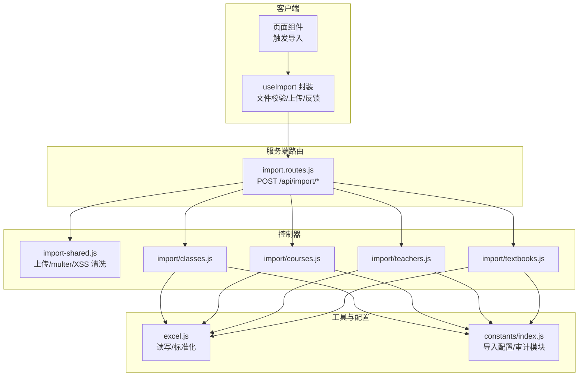
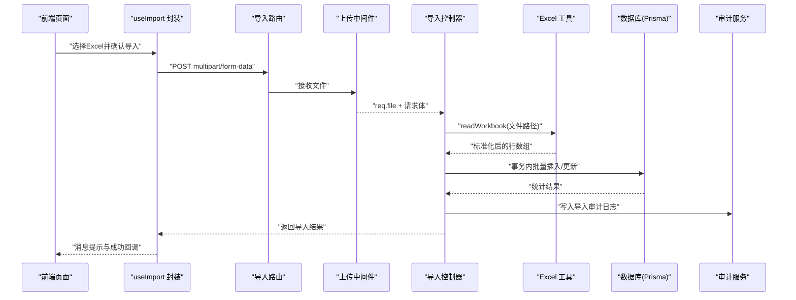
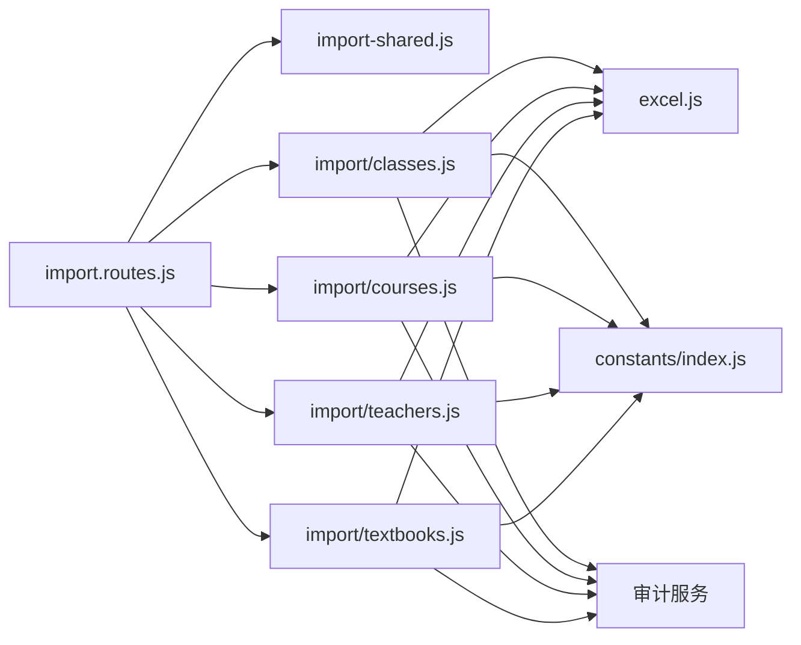

# 导入接口

<cite>
**本文引用的文件**
- [server/src/controllers/import.controller.js](file://server/src/controllers/import.controller.js)
- [server/src/controllers/import-shared.js](file://server/src/controllers/import-shared.js)
- [server/src/routes/import.routes.js](file://server/src/routes/import.routes.js)
- [server/src/controllers/import/classes.js](file://server/src/controllers/import/classes.js)
- [server/src/controllers/import/courses.js](file://server/src/controllers/import/courses.js)
- [server/src/controllers/import/teachers.js](file://server/src/controllers/import/teachers.js)
- [server/src/controllers/import/textbooks.js](file://server/src/controllers/import/textbooks.js)
- [server/src/utils/excel.js](file://server/src/utils/excel.js)
- [server/src/constants/index.js](file://server/src/constants/index.js)
- [client/src/composables/useImport.js](file://client/src/composables/useImport.js)
</cite>

## 目录
1. [简介](#简介)
2. [项目结构](#项目结构)
3. [核心组件](#核心组件)
4. [架构总览](#架构总览)
5. [详细组件分析](#详细组件分析)
6. [依赖关系分析](#依赖关系分析)
7. [性能考量](#性能考量)
8. [故障排查指南](#故障排查指南)
9. [结论](#结论)
10. [附录](#附录)

## 简介
本文件面向“数据导入接口”的使用者与维护者，系统性梳理并规范以下四类批量导入能力：
- 班级导入
- 课程导入
- 教师导入
- 教材导入

文档覆盖接口的 HTTP 方法、URL 路径、请求参数、响应格式、数据格式要求、字段映射规则、导入流程、错误处理与审计日志，并提供前端导入流程封装与后端导入实现之间的协作关系说明。

## 项目结构
导入相关的关键文件分布如下：
- 路由层：定义各导入接口的 HTTP 路由与中间件挂载点
- 控制器层：实现具体导入业务逻辑（Excel 读取、校验、事务落库、审计）
- 工具层：Excel 读写与单元格标准化、输入清洗、文件上传限制
- 常量层：导入最大行数、默认教材类别、审计模块枚举等
- 前端封装：统一的导入流程（文件选择、确认、上传、结果反馈）

图表来源
- [server/src/routes/import.routes.js:1-35](file://server/src/routes/import.routes.js#L1-L35)
- [server/src/controllers/import.controller.js:1-6](file://server/src/controllers/import.controller.js#L1-L6)
- [server/src/controllers/import-shared.js:1-52](file://server/src/controllers/import-shared.js#L1-L52)
- [server/src/controllers/import/classes.js:1-345](file://server/src/controllers/import/classes.js#L1-L345)
- [server/src/controllers/import/courses.js:1-145](file://server/src/controllers/import/courses.js#L1-L145)
- [server/src/controllers/import/teachers.js:1-486](file://server/src/controllers/import/teachers.js#L1-L486)
- [server/src/controllers/import/textbooks.js:1-147](file://server/src/controllers/import/textbooks.js#L1-L147)
- [server/src/utils/excel.js:1-171](file://server/src/utils/excel.js#L1-L171)
- [server/src/constants/index.js:22-27](file://server/src/constants/index.js#L22-L27)

章节来源
- [server/src/routes/import.routes.js:1-35](file://server/src/routes/import.routes.js#L1-L35)
- [server/src/controllers/import.controller.js:1-6](file://server/src/controllers/import.controller.js#L1-L6)
- [server/src/controllers/import-shared.js:1-52](file://server/src/controllers/import-shared.js#L1-L52)
- [server/src/utils/excel.js:1-171](file://server/src/utils/excel.js#L1-L171)
- [server/src/constants/index.js:22-27](file://server/src/constants/index.js#L22-L27)

## 核心组件
- 路由与入口
  - 路由集中定义在导入路由文件中，均通过单文件上传中间件接收 Excel 文件，并转发至对应控制器。
  - 统一鉴权与角色中间件已在应用级挂载，导入接口无需重复声明。
- 上传与安全
  - 上传中间件限制文件大小与类型，仅允许 .xlsx/.xls，且进行 MIME 白名单校验。
  - 输入清洗采用 XSS 过滤，避免危险字符进入数据库。
- Excel 工具
  - 读取工作簿并标准化单元格值（日期、富文本、数字字符串等）。
  - 模板生成与导出时的公式注入防护。
- 常量与审计
  - 导入最大行数、默认教材类别、审计模块枚举等集中管理。
  - 每次导入均写入审计日志，便于追踪与复盘。

章节来源
- [server/src/routes/import.routes.js:12-32](file://server/src/routes/import.routes.js#L12-L32)
- [server/src/controllers/import-shared.js:11-25](file://server/src/controllers/import-shared.js#L11-L25)
- [server/src/utils/excel.js:90-134](file://server/src/utils/excel.js#L90-L134)
- [server/src/constants/index.js:22-27](file://server/src/constants/index.js#L22-L27)
- [server/src/constants/index.js:42-56](file://server/src/constants/index.js#L42-L56)

## 架构总览
下图展示一次“教师导入”的典型调用链路，其他导入类型遵循相同模式。

图表来源
- [client/src/composables/useImport.js:22-55](file://client/src/composables/useImport.js#L22-L55)
- [server/src/routes/import.routes.js:14-32](file://server/src/routes/import.routes.js#L14-L32)
- [server/src/controllers/import-shared.js:11-25](file://server/src/controllers/import-shared.js#L11-L25)
- [server/src/controllers/import/teachers.js:14-24](file://server/src/controllers/import/teachers.js#L14-L24)
- [server/src/utils/excel.js:90-134](file://server/src/utils/excel.js#L90-L134)
- [server/src/services/audit.service.js:1-200](file://server/src/services/audit.service.js#L1-L200)

## 详细组件分析

### 班级导入接口
- HTTP 方法与路径
  - POST /api/import/classes
- 请求参数
  - Content-Type: multipart/form-data
  - 参数名：file（Excel 文件，.xlsx/.xls）
- 数据格式要求与字段映射
  - 必填字段：班级名称、入学年份、学制(年)、培养层次
  - 可选字段：专业类别、二级学院、班级人数、状态
  - 字段映射与校验要点：
    - 入学年份：数值范围 2000-2100
    - 学制(年)：数值范围 1-10
    - 班级人数：数值范围 0-999
    - 状态：支持“在读/active”“已毕业/graduated”，未提供时按当前学期推断
    - 专业类别、二级学院、培养层次：不存在时可在事务内自动创建
- 导入流程
  - 读取 Excel → 标准化 → 校验必填与数值范围 → 收集待创建的基础数据与班级操作 → 事务内：
    - 自动创建缺失的基础数据（层次、专业、学院）
    - 按名称去重（同名班级）并执行创建或更新
  - 返回统计信息与错误列表，并写入审计日志
- 响应格式
  - 成功：包含 imported、overwritten、failed、total、errors、autoCreated 等字段
  - 失败：errors 非空，failed=错误条数
- 错误与边界
  - 缺少必填字段、数值越界、同名班级冲突、事务失败回滚
- 前端集成
  - 通过 useImport 封装统一处理文件选择、确认与结果反馈

章节来源
- [server/src/routes/import.routes.js:14-17](file://server/src/routes/import.routes.js#L14-L17)
- [server/src/controllers/import/classes.js:13-344](file://server/src/controllers/import/classes.js#L13-L344)
- [server/src/utils/excel.js:90-134](file://server/src/utils/excel.js#L90-L134)
- [server/src/constants/index.js:22-27](file://server/src/constants/index.js#L22-L27)

### 课程导入接口
- HTTP 方法与路径
  - POST /api/import/courses
- 请求参数
  - Content-Type: multipart/form-data
  - 参数名：file
- 数据格式要求与字段映射
  - 必填字段：课程名称
  - 可选字段：课程编码、课程类型（专业课/professional 或 公共课/public）
  - 类型更新策略：仅当 Excel 中显式提供了类型值时才更新，避免默认值覆盖已有类型
- 导入流程
  - 读取 Excel → 标准化 → 校验必填 → 事务内：存在则更新（受显式类型控制），否则创建
- 响应格式
  - 成功：imported、overwritten、failed、total、errors
- 错误与边界
  - 缺少课程名称、事务失败回滚
- 前端集成
  - 通过 useImport 封装统一处理

章节来源
- [server/src/routes/import.routes.js:19-22](file://server/src/routes/import.routes.js#L19-L22)
- [server/src/controllers/import/courses.js:12-144](file://server/src/controllers/import/courses.js#L12-L144)
- [server/src/utils/excel.js:90-134](file://server/src/utils/excel.js#L90-L134)

### 教师导入接口
- HTTP 方法与路径
  - POST /api/import/teachers
- 请求参数
  - Content-Type: multipart/form-data
  - 参数名：file
- 数据格式要求与字段映射
  - 必填字段：教师姓名
  - 可选字段：性别、出生年月、人员类别、状态、教师资格类型、特定周课时、学科、任课学院、任课层次、归属学院
  - 字段映射与解析：
    - 人员类别：专职/full_time、兼职/part_time、外聘/external
    - 性别：男/male、女/female
    - 出生年月：支持 YYYY-MM-DD、YYYY-MM、纯数字 YYYYMM、Excel 序列号（UTC 转换）
    - 特定周课时：0-40 数值
    - 学科/任课学院/任课层次：支持逗号/中文顿号/顿号分隔，多值解析
    - 归属学院：一对一
    - 状态：禁用/disabled、在用/active
    - 关联更新守卫：仅当 Excel 对应列存在内容时才重建关联，避免无意清空
- 导入流程
  - 读取 Excel → 标准化 → 校验必填 → 预加载现有教师索引（避免 N+1）→ 收集待创建/更新操作 → 事务内：
    - 自动创建缺失的课程、学院、层次
    - 按姓名去重（同名多条直接报错跳过）
    - 创建或更新教师，并重建课程/学院/层次关联（受列存在性守卫控制）
- 响应格式
  - 成功：imported、overwritten、failed、total、errors、autoCreated
- 错误与边界
  - 缺少姓名、同名多条冲突、事务失败回滚
- 前端集成
  - 通过 useImport 封装统一处理

章节来源
- [server/src/routes/import.routes.js:29-32](file://server/src/routes/import.routes.js#L29-L32)
- [server/src/controllers/import/teachers.js:14-485](file://server/src/controllers/import/teachers.js#L14-L485)
- [server/src/utils/excel.js:90-134](file://server/src/utils/excel.js#L90-L134)

### 教材导入接口
- HTTP 方法与路径
  - POST /api/import/textbooks
- 请求参数
  - Content-Type: multipart/form-data
  - 参数名：file
- 数据格式要求与字段映射
  - 必填字段：书名
  - 可选字段：书号、出版社、作者、版次、出版日期、定价、类别
  - 类别默认值：若未提供，默认使用默认教材类别常量
- 导入流程
  - 读取 Excel → 标准化 → 校验必填 → 事务内：存在则更新，否则创建
- 响应格式
  - 成功：imported、overwritten、failed、total、errors
- 错误与边界
  - 缺少书名、事务失败回滚
- 前端集成
  - 通过 useImport 封装统一处理

章节来源
- [server/src/routes/import.routes.js:24-27](file://server/src/routes/import.routes.js#L24-L27)
- [server/src/controllers/import/textbooks.js:13-146](file://server/src/controllers/import/textbooks.js#L13-L146)
- [server/src/utils/excel.js:90-134](file://server/src/utils/excel.js#L90-L134)
- [server/src/constants/index.js](file://server/src/constants/index.js#L29)

### 导入流程与错误汇总（通用）
- 前端流程
  - useImport 封装了“文件校验 → 确认弹窗 → 上传 → 结果反馈”的完整流程，自动拼装 multipart/form-data 并携带认证头。
  - 成功时根据 errors 与计数显示不同级别的消息提示。
- 后端流程
  - 读取 Excel → 标准化 → 校验 → 事务批量入库 → 写入审计日志 → 返回结果
  - 若全部校验失败（无有效行），仍返回包含错误明细的结果，便于前端提示
- 数据质量检查
  - Excel 工具对日期、富文本、数字字符串进行标准化，避免脏数据入库
  - 导入常量限制最大行数，防止超大数据导致内存压力
- 公式注入防护
  - 导出侧统一进行公式注入防护；导入侧提供输入清洗，但不建议在导入路径使用专用的公式注入前缀处理函数，以免污染原始数据

章节来源
- [client/src/composables/useImport.js:14-91](file://client/src/composables/useImport.js#L14-L91)
- [server/src/controllers/import-shared.js:31-36](file://server/src/controllers/import-shared.js#L31-L36)
- [server/src/utils/excel.js:4-13](file://server/src/utils/excel.js#L4-L13)
- [server/src/utils/excel.js:90-134](file://server/src/utils/excel.js#L90-L134)
- [server/src/constants/index.js:22-27](file://server/src/constants/index.js#L22-L27)

## 依赖关系分析
- 路由到控制器
  - 导入路由统一引入上传中间件与各导入控制器，形成清晰的职责分离
- 控制器到工具
  - 各导入控制器依赖 Excel 工具进行读取与标准化，依赖常量进行配置约束
- 控制器到数据库
  - 使用 Prisma 事务保证导入一致性，失败自动回滚
- 控制器到审计
  - 每次导入都会写入审计日志，包含结果、统计与消息
- 前端到后端
  - 前端通过封装的 Composable 统一发起导入请求，后端返回结构化结果供前端展示

图表来源
- [server/src/routes/import.routes.js:1-35](file://server/src/routes/import.routes.js#L1-L35)
- [server/src/controllers/import-shared.js:1-52](file://server/src/controllers/import-shared.js#L1-L52)
- [server/src/controllers/import/classes.js:1-345](file://server/src/controllers/import/classes.js#L1-L345)
- [server/src/controllers/import/courses.js:1-145](file://server/src/controllers/import/courses.js#L1-L145)
- [server/src/controllers/import/teachers.js:1-486](file://server/src/controllers/import/teachers.js#L1-L486)
- [server/src/controllers/import/textbooks.js:1-147](file://server/src/controllers/import/textbooks.js#L1-L147)
- [server/src/utils/excel.js:1-171](file://server/src/utils/excel.js#L1-L171)
- [server/src/constants/index.js:22-27](file://server/src/constants/index.js#L22-L27)

章节来源
- [server/src/routes/import.routes.js:1-35](file://server/src/routes/import.routes.js#L1-L35)
- [server/src/controllers/import-shared.js:1-52](file://server/src/controllers/import-shared.js#L1-L52)
- [server/src/utils/excel.js:1-171](file://server/src/utils/excel.js#L1-L171)
- [server/src/constants/index.js:22-27](file://server/src/constants/index.js#L22-L27)

## 性能考量
- 读取与解析
  - Excel 读取采用顺序遍历，基于表头数量固定列宽，避免稀疏行误判
  - 单元格标准化处理日期与富文本，减少后续处理成本
- 批量与事务
  - 所有导入均在事务中执行，保证一致性；教师导入预加载现有教师索引，避免 N+1 查询
- 限制与保护
  - 最大行数限制与文件大小限制，防止超大数据导致内存与超时
  - XSS 清洗与导出侧公式注入防护，提升安全性

章节来源
- [server/src/utils/excel.js:90-134](file://server/src/utils/excel.js#L90-L134)
- [server/src/controllers/import/teachers.js:76-94](file://server/src/controllers/import/teachers.js#L76-L94)
- [server/src/constants/index.js:22-27](file://server/src/constants/index.js#L22-L27)

## 故障排查指南
- 常见错误类型
  - 文件格式错误：仅支持 .xlsx/.xls，且 MIME 类型需在白名单
  - Excel 读取失败：文件损坏或格式异常
  - 校验失败：必填字段缺失、数值范围越界、同名冲突
  - 事务失败：数据库约束冲突或异常，会自动回滚并清理计数
- 定位与处理
  - 查看响应中的 errors 与 failed 字段，结合行号定位问题
  - 审计日志记录导入结果与消息，便于追溯
  - 前端使用统一的消息提示，注意区分成功/警告/信息三类反馈
- 建议
  - 导入前下载模板，确保列名与顺序正确
  - 大批量导入建议拆分批次，避免超过最大行数限制

章节来源
- [server/src/controllers/import-shared.js:11-25](file://server/src/controllers/import-shared.js#L11-L25)
- [server/src/controllers/import/classes.js:77-97](file://server/src/controllers/import/classes.js#L77-L97)
- [server/src/controllers/import/teachers.js:223-229](file://server/src/controllers/import/teachers.js#L223-L229)
- [server/src/controllers/import/courses.js:42-45](file://server/src/controllers/import/courses.js#L42-L45)
- [server/src/controllers/import/textbooks.js:45-48](file://server/src/controllers/import/textbooks.js#L45-L48)

## 结论
本套导入接口以“统一路由、独立控制器、共享工具与常量”的方式构建，具备完善的文件校验、数据标准化、事务一致性与审计日志能力。前端通过 useImport 封装简化了用户操作体验。建议在生产环境中配合模板下载、分批导入与监控告警，持续保障导入稳定性与数据质量。

## 附录

### 接口一览与字段对照
- 班级导入
  - 必填：班级名称、入学年份、学制(年)、培养层次
  - 可选：专业类别、二级学院、班级人数、状态
  - 关键行为：自动创建缺失的基础数据；按名称去重；状态推断
- 课程导入
  - 必填：课程名称
  - 可选：课程编码、课程类型
  - 关键行为：仅当 Excel 显式提供类型时才更新
- 教师导入
  - 必填：教师姓名
  - 可选：性别、出生年月、人员类别、状态、教师资格类型、特定周课时、学科、任课学院、任课层次、归属学院
  - 关键行为：多值解析与逗号分隔；仅当 Excel 列存在内容时重建关联
- 教材导入
  - 必填：书名
  - 可选：书号、出版社、作者、版次、出版日期、定价、类别
  - 关键行为：类别默认值；存在即更新，否则创建

章节来源
- [server/src/controllers/import/classes.js:68-138](file://server/src/controllers/import/classes.js#L68-L138)
- [server/src/controllers/import/courses.js:35-52](file://server/src/controllers/import/courses.js#L35-L52)
- [server/src/controllers/import/teachers.js:104-277](file://server/src/controllers/import/teachers.js#L104-L277)
- [server/src/controllers/import/textbooks.js:36-59](file://server/src/controllers/import/textbooks.js#L36-L59)