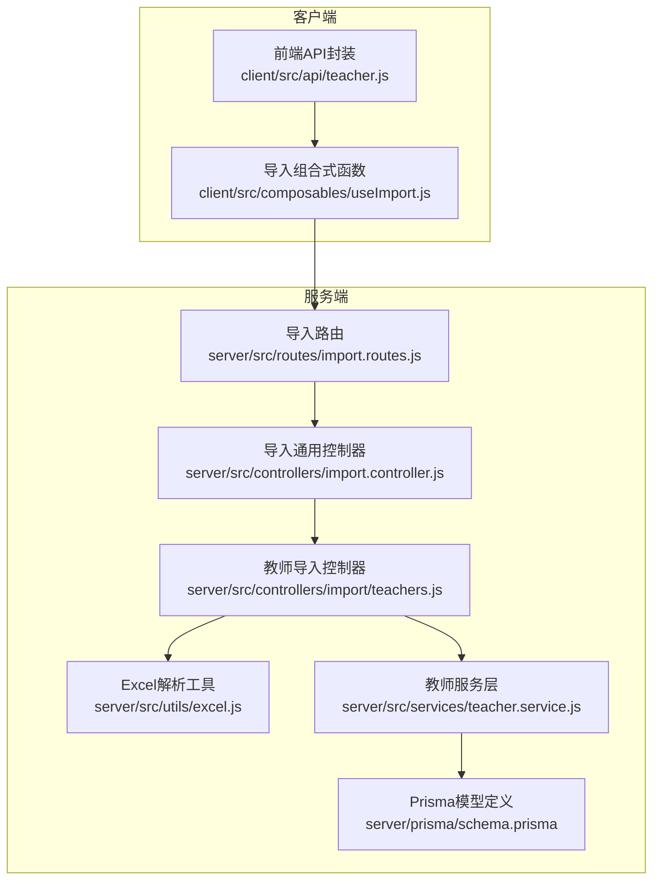
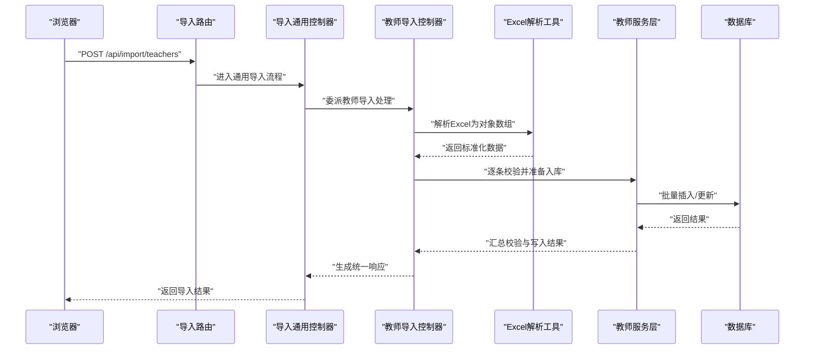
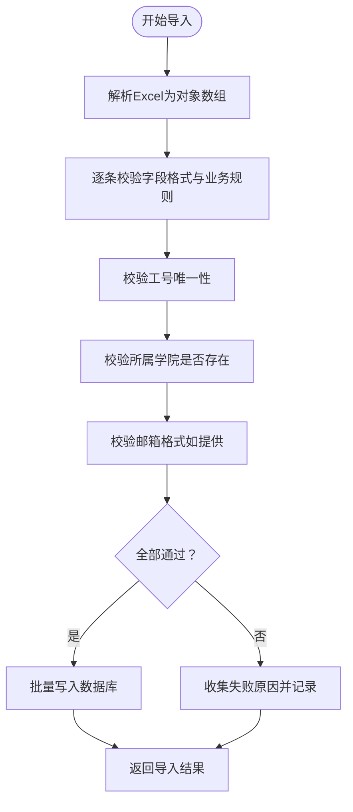

# 教师导入接口

<cite>
**本文档引用的文件**
- [server/src/controllers/import/teachers.js](file://server/src/controllers/import/teachers.js)
- [server/src/controllers/import.controller.js](file://server/src/controllers/import.controller.js)
- [server/src/controllers/import-shared.js](file://server/src/controllers/import-shared.js)
- [server/src/utils/excel.js](file://server/src/utils/excel.js)
- [server/src/routes/import.routes.js](file://server/src/routes/import.routes.js)
- [server/src/services/teacher.service.js](file://server/src/services/teacher.service.js)
- [server/prisma/schema.prisma](file://server/prisma/schema.prisma)
- [client/src/api/teacher.js](file://client/src/api/teacher.js)
- [client/src/composables/useImport.js](file://client/src/composables/useImport.js)
- [docs/EXPORT_IMPORT_AUDIT.md](file://docs/EXPORT_IMPORT_AUDIT.md)
</cite>

## 目录
1. [简介](#简介)
2. [项目结构](#项目结构)
3. [核心组件](#核心组件)
4. [架构总览](#架构总览)
5. [详细组件分析](#详细组件分析)
6. [依赖关系分析](#依赖关系分析)
7. [性能考虑](#性能考虑)
8. [故障排除指南](#故障排除指南)
9. [结论](#结论)
10. [附录](#附录)

## 简介
本文件面向教师批量导入接口的使用者与维护者，系统化说明 POST /api/import/teachers 接口的使用方式与实现细节。内容涵盖：
- Excel 模板字段定义与映射规则
- 数据完整性与格式校验要求（工号、姓名、性别、职称、所属学院等）
- 核心业务逻辑：工号唯一性检查、邮箱格式验证、学院关联验证
- 成功与失败场景的响应格式示例
- 前端导入流程与后端处理链路

## 项目结构
教师导入功能由前后端协同完成，后端通过统一的导入控制器与专用的教师导入控制器处理请求，Excel 解析工具负责数据抽取，Prisma 负责数据库持久化。

**图表来源**
- [server/src/routes/import.routes.js](file://server/src/routes/import.routes.js)
- [server/src/controllers/import.controller.js](file://server/src/controllers/import.controller.js)
- [server/src/controllers/import/teachers.js](file://server/src/controllers/import/teachers.js)
- [server/src/utils/excel.js](file://server/src/utils/excel.js)
- [server/src/services/teacher.service.js](file://server/src/services/teacher.service.js)
- [server/prisma/schema.prisma](file://server/prisma/schema.prisma)

**章节来源**
- [server/src/routes/import.routes.js](file://server/src/routes/import.routes.js)
- [server/src/controllers/import.controller.js](file://server/src/controllers/import.controller.js)
- [server/src/controllers/import/teachers.js](file://server/src/controllers/import/teachers.js)
- [server/src/utils/excel.js](file://server/src/utils/excel.js)
- [server/src/services/teacher.service.js](file://server/src/services/teacher.service.js)
- [server/prisma/schema.prisma](file://server/prisma/schema.prisma)

## 核心组件
- 导入路由：定义 /api/import/teachers 的访问入口与中间件链
- 导入通用控制器：负责文件接收、流式处理、错误拦截与统一响应
- 教师导入控制器：实现教师特有字段映射、校验与批量写入
- Excel 解析工具：读取 Excel 表头与行数据，生成标准化对象数组
- 教师服务层：执行业务规则（唯一性、关联存在性、格式校验）与数据库操作
- Prisma 模型：定义教师实体及外键约束（如所属学院）

**章节来源**
- [server/src/routes/import.routes.js](file://server/src/routes/import.routes.js)
- [server/src/controllers/import.controller.js](file://server/src/controllers/import.controller.js)
- [server/src/controllers/import/teachers.js](file://server/src/controllers/import/teachers.js)
- [server/src/utils/excel.js](file://server/src/utils/excel.js)
- [server/src/services/teacher.service.js](file://server/src/services/teacher.service.js)
- [server/prisma/schema.prisma](file://server/prisma/schema.prisma)

## 架构总览
下图展示从浏览器到数据库的完整导入链路，包括表单数据上传、Excel 解析、业务校验与批量写入。

**图表来源**
- [server/src/routes/import.routes.js](file://server/src/routes/import.routes.js)
- [server/src/controllers/import.controller.js](file://server/src/controllers/import.controller.js)
- [server/src/controllers/import/teachers.js](file://server/src/controllers/import/teachers.js)
- [server/src/utils/excel.js](file://server/src/utils/excel.js)
- [server/src/services/teacher.service.js](file://server/src/services/teacher.service.js)

## 详细组件分析

### 接口定义与请求规范
- 方法与路径：POST /api/import/teachers
- 内容类型：multipart/form-data
- 必填参数：
  - file：Excel 文件（.xlsx），包含教师信息
- 可选参数：无
- 认证：需登录态（由认证中间件保障）
- 权限：仅管理员或具备相应权限的角色可调用

**章节来源**
- [server/src/routes/import.routes.js](file://server/src/routes/import.routes.js)

### Excel 模板与字段映射
- 表头必须与后端期望一致，建议使用系统导出的模板以确保列名正确
- 关键字段（名称以中文描述）：
  - 工号：用于主键唯一性校验
  - 姓名：必填，长度限制与字符集限制见“数据完整性要求”
  - 性别：枚举值（例如：男/女），非法值将触发校验失败
  - 职称：字符串，允许为空但建议填写
  - 所属学院：字符串，需与系统中已存在的学院名称精确匹配
  - 邮箱：可选，若提供需符合邮箱格式
- 映射策略：控制器按列名进行映射，大小写敏感；建议严格遵循导出模板

**章节来源**
- [server/src/controllers/import/teachers.js](file://server/src/controllers/import/teachers.js)
- [server/src/utils/excel.js](file://server/src/utils/excel.js)
- [docs/EXPORT_IMPORT_AUDIT.md](file://docs/EXPORT_IMPORT_AUDIT.md)

### 数据完整性与格式校验
- 工号（学号/教工号）：
  - 唯一性：数据库级唯一索引约束；重复将导致写入失败
  - 格式：字符串，长度与字符集由系统定义
- 姓名：
  - 必填：空值将导致整行校验失败
  - 长度与字符集：建议限制在合理范围，避免超长或特殊字符
- 性别：
  - 枚举校验：仅接受预定义值（如“男”、“女”），其他值视为无效
- 职称：
  - 允许为空；若提供，建议与组织标准保持一致
- 所属学院：
  - 存在性校验：必须与系统中现有学院名称完全一致
  - 大小写敏感：请与系统内记录保持一致
- 邮箱：
  - 可选字段；若提供，需满足邮箱格式
  - 格式验证：使用正则表达式进行基础校验
- 其他：
  - 空白行与空列：自动跳过
  - 数据类型：字符串优先，数值类字段建议转换为文本以避免精度丢失

**章节来源**
- [server/src/controllers/import/teachers.js](file://server/src/controllers/import/teachers.js)
- [server/src/services/teacher.service.js](file://server/src/services/teacher.service.js)
- [server/prisma/schema.prisma](file://server/prisma/schema.prisma)

### 核心业务逻辑
- 工号唯一性检查：
  - 在写入前对目标工号进行查询，若已存在则标记该条目为失败
- 邮箱格式验证：
  - 使用正则表达式进行基础格式校验；不合法即拒绝该条目
- 学院关联验证：
  - 将“所属学院”字段与系统中的学院名称进行精确匹配；不匹配则失败
- 批量写入：
  - 成功项合并为批量插入请求；失败项单独记录原因
- 错误处理：
  - 对于单条失败与整体异常分别处理，保证部分成功时仍返回可消费的结果

**图表来源**
- [server/src/controllers/import/teachers.js](file://server/src/controllers/import/teachers.js)
- [server/src/utils/excel.js](file://server/src/utils/excel.js)
- [server/src/services/teacher.service.js](file://server/src/services/teacher.service.js)

**章节来源**
- [server/src/controllers/import/teachers.js](file://server/src/controllers/import/teachers.js)
- [server/src/services/teacher.service.js](file://server/src/services/teacher.service.js)

### 响应格式示例
- 成功场景（部分成功）：
  - 返回字段概览：total（总条数）、successCount（成功数量）、failures（失败列表）
  - failures 中每项包含：row（行号）、工号、错误原因
- 失败场景：
  - 参数缺失：缺少 file 或文件非 Excel
  - 格式错误：表头不匹配、单元格类型不符
  - 业务错误：工号重复、学院不存在、邮箱格式错误
  - 系统错误：服务器内部异常

**章节来源**
- [server/src/controllers/import.controller.js](file://server/src/controllers/import.controller.js)
- [server/src/controllers/import/teachers.js](file://server/src/controllers/import/teachers.js)

### 前端集成要点
- 使用 multipart/form-data 提交文件
- 建议先下载模板，再填充数据并上传
- 导入完成后根据返回的 failures 进行二次修正与重试
- 建议在 UI 中提示“部分成功”的场景，并引导用户修复失败项

**章节来源**
- [client/src/api/teacher.js](file://client/src/api/teacher.js)
- [client/src/composables/useImport.js](file://client/src/composables/useImport.js)
- [docs/EXPORT_IMPORT_AUDIT.md](file://docs/EXPORT_IMPORT_AUDIT.md)

## 依赖关系分析
- 控制器耦合：
  - 教师导入控制器依赖 Excel 解析工具与教师服务层
  - 通用导入控制器提供统一的文件接收与错误处理
- 数据层依赖：
  - 教师服务层依赖 Prisma 模型与数据库连接
- 外部依赖：
  - Excel 解析依赖第三方库（具体库名以源码为准）
  - 正则表达式用于邮箱格式校验

**图表来源**
- [server/src/controllers/import/teachers.js](file://server/src/controllers/import/teachers.js)
- [server/src/controllers/import.controller.js](file://server/src/controllers/import.controller.js)
- [server/src/utils/excel.js](file://server/src/utils/excel.js)
- [server/src/services/teacher.service.js](file://server/src/services/teacher.service.js)
- [server/prisma/schema.prisma](file://server/prisma/schema.prisma)

**章节来源**
- [server/src/controllers/import/teachers.js](file://server/src/controllers/import/teachers.js)
- [server/src/controllers/import.controller.js](file://server/src/controllers/import.controller.js)
- [server/src/utils/excel.js](file://server/src/utils/excel.js)
- [server/src/services/teacher.service.js](file://server/src/services/teacher.service.js)
- [server/prisma/schema.prisma](file://server/prisma/schema.prisma)

## 性能考虑
- 大文件分块处理：建议对大体积 Excel 进行分片读取，避免内存峰值过高
- 并发控制：批量写入时采用分批提交，避免数据库压力过大
- 缓存与索引：确保工号与学院名称的查询命中索引，减少慢查询
- 日志与审计：记录导入耗时与失败明细，便于问题定位与优化

## 故障排除指南
- 常见错误类型与排查步骤：
  - 表头不匹配：确认使用系统导出模板，列名与顺序一致
  - 工号重复：检查是否已有相同工号；修改后重试
  - 学院不存在：核对“所属学院”字段与系统内名称是否完全一致
  - 邮箱格式错误：修正邮箱格式或留空
  - 文件类型错误：确保上传的是 .xlsx 文件
- 审计与日志：
  - 查看服务端日志定位异常
  - 参考导出导入审计文档获取更多排查思路

**章节来源**
- [server/src/controllers/import/teachers.js](file://server/src/controllers/import/teachers.js)
- [server/src/controllers/import.controller.js](file://server/src/controllers/import.controller.js)
- [docs/EXPORT_IMPORT_AUDIT.md](file://docs/EXPORT_IMPORT_AUDIT.md)

## 结论
POST /api/import/teachers 接口提供了标准化的教师批量导入能力。通过严格的字段映射、格式校验与业务规则，结合统一的响应格式与错误处理，能够有效提升导入效率与数据质量。建议在生产环境中配合模板下载、失败项修复与分批导入策略，获得更稳定的体验。

## 附录
- 模板下载与使用：参考前端导入组件与导出导入审计文档
- 字段对照表：以 Excel 表头为准，确保与后端映射一致
- 最佳实践：先小批量测试，再进行全量导入；导入后进行抽样核对

**章节来源**
- [client/src/composables/useImport.js](file://client/src/composables/useImport.js)
- [docs/EXPORT_IMPORT_AUDIT.md](file://docs/EXPORT_IMPORT_AUDIT.md)