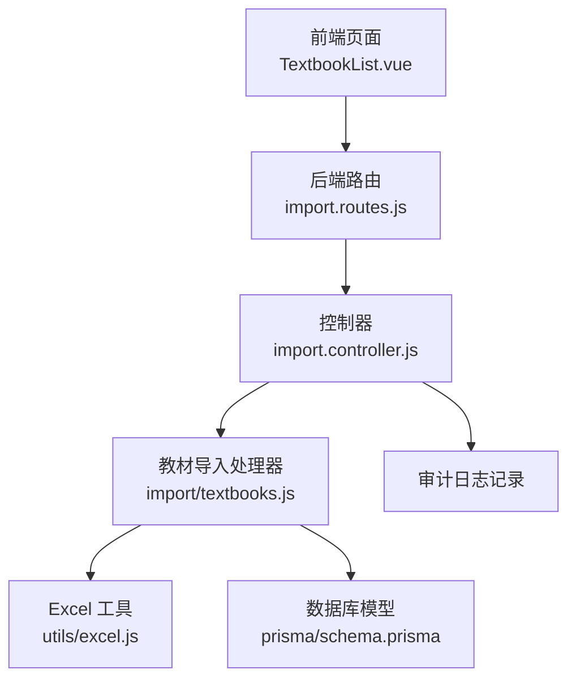
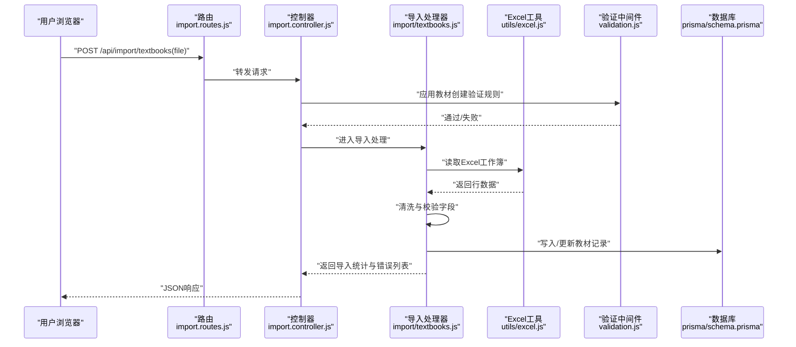
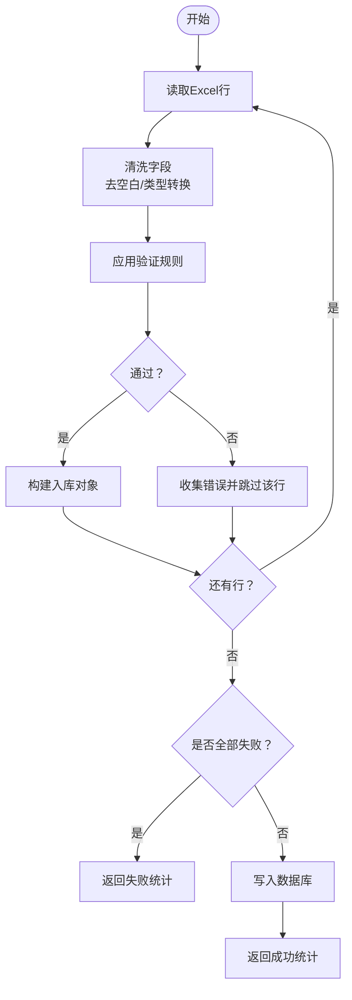
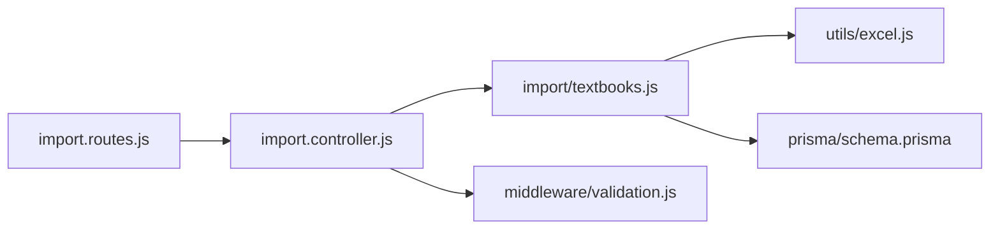

# 教材导入接口

<cite>
**本文引用的文件**
- [server/src/controllers/import.controller.js](file://server/src/controllers/import.controller.js)
- [server/src/controllers/import/textbooks.js](file://server/src/controllers/import/textbooks.js)
- [server/src/middleware/validation.js](file://server/src/middleware/validation.js)
- [server/src/utils/excel.js](file://server/src/utils/excel.js)
- [server/prisma/schema.prisma](file://server/prisma/schema.prisma)
- [client/src/views/textbook/TextbookList.vue](file://client/src/views/textbook/TextbookList.vue)
- [server/src/routes/import.routes.js](file://server/src/routes/import.routes.js)
- [server/src/controllers/export/export-template.controller.js](file://server/src/controllers/export/export-template.controller.js)
</cite>

## 目录
1. [简介](#简介)
2. [项目结构](#项目结构)
3. [核心组件](#核心组件)
4. [架构总览](#架构总览)
5. [详细组件分析](#详细组件分析)
6. [依赖分析](#依赖分析)
7. [性能考虑](#性能考虑)
8. [故障排除指南](#故障排除指南)
9. [结论](#结论)
10. [附录](#附录)

## 简介
本文件为教材批量导入接口提供完整、可操作的技术文档，重点说明 POST /api/import/textbooks 接口的使用方法与实现细节，包括：
- 教材信息 Excel 模板格式与字段映射
- 数据验证规则与格式约束
- ISBN 唯一性校验策略
- 作者与出版社信息的处理流程
- 标准教材与“特殊教材”（无 ISBN）的导入方式
- 导入结果与审计日志记录

## 项目结构
教材导入功能涉及前后端协作：
- 前端负责上传 Excel 文件，并引导用户下载模板
- 后端路由接收文件，解析 Excel，执行数据清洗与校验，写入数据库，并记录审计日志

图表来源
- [client/src/views/textbook/TextbookList.vue:36-39](file://client/src/views/textbook/TextbookList.vue#L36-L39)
- [server/src/routes/import.routes.js](file://server/src/routes/import.routes.js)
- [server/src/controllers/import.controller.js:1-10](file://server/src/controllers/import.controller.js#L1-L10)
- [server/src/controllers/import/textbooks.js:1-120](file://server/src/controllers/import/textbooks.js#L1-L120)
- [server/src/utils/excel.js:127-170](file://server/src/utils/excel.js#L127-L170)
- [server/prisma/schema.prisma:156-176](file://server/prisma/schema.prisma#L156-L176)

章节来源
- [client/src/views/textbook/TextbookList.vue:36-39](file://client/src/views/textbook/TextbookList.vue#L36-L39)
- [server/src/routes/import.routes.js](file://server/src/routes/import.routes.js)

## 核心组件
- 导入路由与控制器
  - 路由定义了 POST /api/import/textbooks，交由 import.controller.js 处理
  - 控制器调用 import/textbooks.js 执行具体导入逻辑
- Excel 解析与模板生成
  - utils/excel.js 提供工作簿读取与模板生成能力
  - 导出模板控制器提供教材导入模板下载
- 数据验证
  - validation.js 中的 validateTextbookCreate 与 validateTextbook 用于字段长度、数值范围、日期格式等校验
- 数据模型
  - prisma/schema.prisma 中 textbooks 表定义了教材字段及索引（含 isbn 唯一索引）

章节来源
- [server/src/controllers/import.controller.js:1-10](file://server/src/controllers/import.controller.js#L1-L10)
- [server/src/controllers/import/textbooks.js:1-120](file://server/src/controllers/import/textbooks.js#L1-L120)
- [server/src/utils/excel.js:127-170](file://server/src/utils/excel.js#L127-L170)
- [server/src/middleware/validation.js:168-207](file://server/src/middleware/validation.js#L168-L207)
- [server/prisma/schema.prisma:156-176](file://server/prisma/schema.prisma#L156-L176)

## 架构总览
POST /api/import/textbooks 的请求处理流程如下：

图表来源
- [server/src/routes/import.routes.js](file://server/src/routes/import.routes.js)
- [server/src/controllers/import.controller.js:1-10](file://server/src/controllers/import.controller.js#L1-L10)
- [server/src/controllers/import/textbooks.js:1-120](file://server/src/controllers/import/textbooks.js#L1-L120)
- [server/src/utils/excel.js:127-170](file://server/src/utils/excel.js#L127-L170)
- [server/src/middleware/validation.js:168-207](file://server/src/middleware/validation.js#L168-L207)
- [server/prisma/schema.prisma:156-176](file://server/prisma/schema.prisma#L156-L176)

## 详细组件分析

### 接口定义与使用
- 接口地址：POST /api/import/textbooks
- 请求体：multipart/form-data，字段名为 file，值为 Excel 文件（.xlsx/.xls）
- 成功响应：返回导入统计与错误列表；若全部行验证失败则返回失败统计
- 失败场景：文件读取异常、Excel 结构不符、字段校验失败、数据库写入异常

章节来源
- [client/src/views/textbook/TextbookList.vue:36-39](file://client/src/views/textbook/TextbookList.vue#L36-L39)
- [server/src/controllers/import.controller.js:1-10](file://server/src/controllers/import.controller.js#L1-L10)

### Excel 模板与字段映射
- 模板下载：后端提供教材导入模板，包含以下列（中文标题）：
  - 书名（必填）
  - 书号（ISBN，非必填）
  - 出版社（非必填）
  - 作者（非必填）
  - 版次（非必填）
  - 出版日期（非必填，格式 YYYY 或 YYYY-MM 或 YYYY-MM-DD）
  - 定价（非必填，数值）
  - 类别（非必填，默认类别）
- 字段映射关系（Excel 列标题 → 导入库字段）：
  - 书名 → title
  - 书号 → isbn
  - 出版社 → publisher
  - 作者 → author
  - 版次 → edition
  - 出版日期 → publish_date
  - 定价 → price
  - 类别 → category

章节来源
- [server/src/controllers/export/export-template.controller.js:47-68](file://server/src/controllers/export/export-template.controller.js#L47-L68)
- [server/src/utils/excel.js:140-170](file://server/src/utils/excel.js#L140-L170)

### 数据清洗与校验流程
- 字段清洗
  - 去除首尾空白，空字符串转为 null
  - 数值型字段尝试转换为数字，非法值置为 null
  - 缺失字段默认为 null 或默认类别
- 校验规则（来自验证中间件）
  - 书名：必填，长度 1~200
  - 书号：可选，长度 ≤ 50
  - 出版社：可选，长度 ≤ 100
  - 作者：可选，长度 ≤ 100
  - 定价：可选，0~100000 浮点数
  - 出版日期：可选，格式 YYYY、YYYY-MM、YYYY-MM-DD
- 错误收集
  - 对于缺失书名等必填项的行，记录错误并跳过该行
  - 若全部行验证失败，则直接返回失败统计

图表来源
- [server/src/controllers/import/textbooks.js:39-77](file://server/src/controllers/import/textbooks.js#L39-L77)
- [server/src/middleware/validation.js:168-207](file://server/src/middleware/validation.js#L168-L207)

章节来源
- [server/src/controllers/import/textbooks.js:39-77](file://server/src/controllers/import/textbooks.js#L39-L77)
- [server/src/middleware/validation.js:168-207](file://server/src/middleware/validation.js#L168-L207)

### ISBN 唯一性验证与冲突处理
- 数据库层面
  - textbooks 表对 isbn 建有索引，用于加速查询与约束唯一性
- 导入策略
  - 若 Excel 中存在重复 ISBN，系统按顺序逐行处理，重复 ISBN 将导致后续写入冲突
  - 冲突处理建议：在导入前清理重复 ISBN，或在导入后进行去重与合并
- 实践建议
  - 建议在导入前对 Excel 进行去重校验，确保每本教材的 ISBN 唯一
  - 对于“特殊教材”（无 ISBN），可将其 isbn 留空，避免唯一性冲突

章节来源
- [server/prisma/schema.prisma:156-176](file://server/prisma/schema.prisma#L156-L176)
- [server/src/controllers/import/textbooks.js:50-59](file://server/src/controllers/import/textbooks.js#L50-L59)

### 作者与出版社信息处理
- 作者与出版社字段均为可选，最大长度限制分别为 100 字符
- 导入时将自动去除首尾空白，空字符串转换为 null
- 若作者/出版社缺失，不影响导入主流程，但可能影响后续检索与统计

章节来源
- [server/src/middleware/validation.js:168-186](file://server/src/middleware/validation.js#L168-L186)
- [server/src/controllers/import/textbooks.js:39-59](file://server/src/controllers/import/textbooks.js#L39-L59)

### 出版日期格式规范
- 支持三种格式：
  - 年份：YYYY
  - 年月：YYYY-MM
  - 年月日：YYYY-MM-DD
- 非法格式将触发校验失败，错误行会被跳过

章节来源
- [server/src/middleware/validation.js:181-185](file://server/src/middleware/validation.js#L181-L185)

### 类别字段与默认值
- 类别为可选项，默认类别由导入处理器设定
- 若 Excel 中未填写类别，将使用默认值填充入库对象

章节来源
- [server/src/controllers/import/textbooks.js:57-59](file://server/src/controllers/import/textbooks.js#L57-L59)

### 标准教材与“特殊教材”的导入方式
- 标准教材
  - 必须包含书名与可选的 ISBN、出版社、作者、版次、出版日期、定价、类别
  - ISBN 可重复时需注意唯一性冲突
- “特殊教材”（无 ISBN）
  - 仅需提供书名，其余字段可留空
  - 导入后不会产生 isbn 唯一性冲突

章节来源
- [server/src/controllers/export/export-template.controller.js:47-68](file://server/src/controllers/export/export-template.controller.js#L47-L68)
- [server/src/controllers/import/textbooks.js:50-59](file://server/src/controllers/import/textbooks.js#L50-L59)

### 完整导入示例（步骤说明）
- 步骤 1：下载模板
  - 在前端页面点击“下载模板”，获取教材导入模板
- 步骤 2：填写数据
  - 按模板列标题填写教材信息，确保书名为必填
- 步骤 3：上传文件
  - 在前端页面选择 Excel 文件并上传至 /api/import/textbooks
- 步骤 4：查看结果
  - 返回 JSON，包含导入数量、覆盖数量、失败数量、总行数与错误列表

章节来源
- [client/src/views/textbook/TextbookList.vue:36-39](file://client/src/views/textbook/TextbookList.vue#L36-L39)
- [server/src/controllers/export/export-template.controller.js:47-68](file://server/src/controllers/export/export-template.controller.js#L47-L68)

## 依赖分析
- 组件耦合
  - 导入控制器依赖导入处理器与验证中间件
  - 导入处理器依赖 Excel 工具与数据库模型
- 外部依赖
  - ExcelJS 用于读取与生成工作簿
  - Prisma 用于数据库访问与约束
- 潜在循环依赖
  - 未发现循环依赖迹象

图表来源
- [server/src/routes/import.routes.js](file://server/src/routes/import.routes.js)
- [server/src/controllers/import.controller.js:1-10](file://server/src/controllers/import.controller.js#L1-L10)
- [server/src/controllers/import/textbooks.js:1-120](file://server/src/controllers/import/textbooks.js#L1-L120)
- [server/src/utils/excel.js:127-170](file://server/src/utils/excel.js#L127-L170)
- [server/src/middleware/validation.js:168-207](file://server/src/middleware/validation.js#L168-L207)
- [server/prisma/schema.prisma:156-176](file://server/prisma/schema.prisma#L156-L176)

章节来源
- [server/src/routes/import.routes.js](file://server/src/routes/import.routes.js)
- [server/src/controllers/import.controller.js:1-10](file://server/src/controllers/import.controller.js#L1-L10)
- [server/src/controllers/import/textbooks.js:1-120](file://server/src/controllers/import/textbooks.js#L1-L120)
- [server/src/utils/excel.js:127-170](file://server/src/utils/excel.js#L127-L170)
- [server/src/middleware/validation.js:168-207](file://server/src/middleware/validation.js#L168-L207)
- [server/prisma/schema.prisma:156-176](file://server/prisma/schema.prisma#L156-L176)

## 性能考虑
- Excel 读取
  - 大文件建议拆分批次上传，避免内存峰值过高
- 数据库写入
  - 导入处理器采用逐行处理，建议在导入前进行去重与预校验，减少数据库冲突与回滚
- 验证前置
  - 在前端或服务端尽早进行格式校验，降低无效请求对后端的压力

## 故障排除指南
- 常见问题
  - 上传文件格式不正确：请确认为 .xlsx 或 .xls
  - 模板列标题不匹配：请使用后端提供的模板，确保列标题一致
  - 书名缺失：书名为必填字段，缺失将导致该行失败
  - ISBN 冲突：若出现唯一性冲突，请清理重复 ISBN 或留空
  - 出版日期格式错误：请使用 YYYY、YYYY-MM 或 YYYY-MM-DD
- 审计与日志
  - 导入过程会记录审计日志，便于追踪失败原因与导入统计

章节来源
- [server/src/controllers/import/textbooks.js:62-77](file://server/src/controllers/import/textbooks.js#L62-L77)

## 结论
POST /api/import/textbooks 接口提供了标准化的教材批量导入能力。通过模板化字段映射、严格的字段校验与完善的错误收集机制，能够高效地完成教材数据的导入与维护。建议在导入前进行数据清洗与去重，以提升导入成功率与数据质量。

## 附录

### 字段与约束对照表
- 书名：必填，长度 1~200
- 书号（ISBN）：可选，长度 ≤ 50
- 出版社：可选，长度 ≤ 100
- 作者：可选，长度 ≤ 100
- 版次：可选
- 出版日期：可选，格式 YYYY、YYYY-MM、YYYY-MM-DD
- 定价：可选，数值 0~100000
- 类别：可选，默认类别由导入处理器设定

章节来源
- [server/src/middleware/validation.js:168-207](file://server/src/middleware/validation.js#L168-L207)
- [server/src/controllers/import/textbooks.js:57-59](file://server/src/controllers/import/textbooks.js#L57-L59)