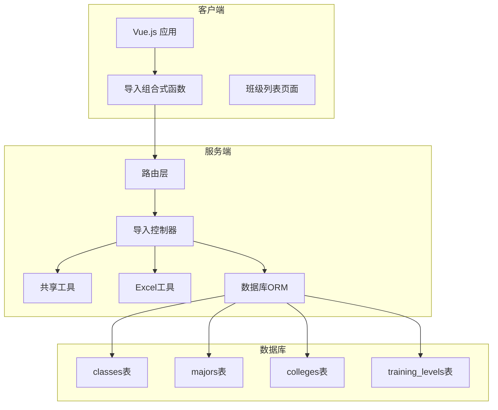
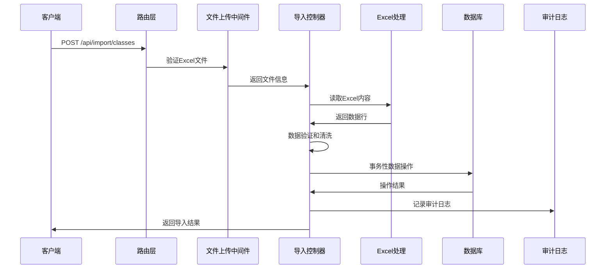
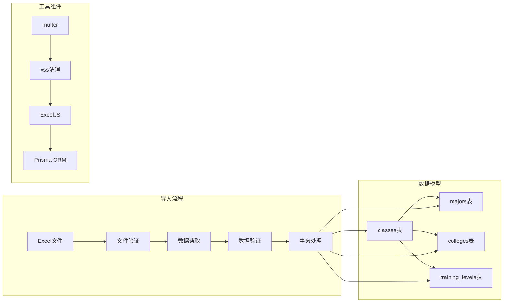

# 班级导入接口

<cite>
**本文档引用的文件**
- [server/src/controllers/import/routes.js](file://server/src/controllers/import/routes.js)
- [server/src/controllers/import/classes.js](file://server/src/controllers/import/classes.js)
- [server/src/controllers/import-shared.js](file://server/src/controllers/import-shared.js)
- [server/src/utils/excel.js](file://server/src/utils/excel.js)
- [server/src/constants/index.js](file://server/src/constants/index.js)
- [server/prisma/schema.prisma](file://server/prisma/schema.prisma)
- [client/src/views/class/ClassList.vue](file://client/src/views/class/ClassList.vue)
- [client/src/composables/useImport.js](file://client/src/composables/useImport.js)
</cite>

## 目录
1. [简介](#简介)
2. [项目结构](#项目结构)
3. [核心组件](#核心组件)
4. [架构概览](#架构概览)
5. [详细组件分析](#详细组件分析)
6. [依赖关系分析](#依赖关系分析)
7. [性能考虑](#性能考虑)
8. [故障排除指南](#故障排除指南)
9. [结论](#结论)

## 简介

本文档详细说明了班级批量导入接口的使用方法，包括POST /api/import/classes接口的完整使用指南。该接口支持通过Excel文件批量导入班级信息，具备完善的文件格式验证、数据映射、错误处理和重复数据检测功能。

## 项目结构

班级导入功能涉及前后端多个组件的协作：



**图表来源**
- [server/src/controllers/import/routes.js:1-34](file://server/src/controllers/import/routes.js#L1-L34)
- [server/src/controllers/import/classes.js:1-345](file://server/src/controllers/import/classes.js#L1-L345)

**章节来源**
- [server/src/controllers/import/routes.js:1-34](file://server/src/controllers/import/routes.js#L1-L34)
- [server/src/controllers/import/classes.js:1-345](file://server/src/controllers/import/classes.js#L1-L345)

## 核心组件

### 接口定义

POST /api/import/classes - 批量导入班级

**请求参数**
- Content-Type: multipart/form-data
- 参数: file (必需) - Excel格式文件(.xlsx或.xls)

**请求头**
- Authorization: Bearer {token} (可选，但建议提供)

**响应格式**
```javascript
{
  "success": true,
  "message": "导入完成：新增X条，覆盖Y条，失败Z条",
  "data": {
    "imported": number,      // 新增记录数
    "overwritten": number,   // 覆盖记录数
    "failed": number,        // 失败记录数
    "total": number,         // 总记录数
    "errors": string[],      // 错误详情数组
    "autoCreated": {
      "trainingLevels": number,  // 自动创建的培养层次数
      "majors": number,        // 自动创建的专业数
      "colleges": number       // 自动创建的学院数
    }
  }
}
```

**章节来源**
- [server/src/controllers/import/routes.js:14-17](file://server/src/controllers/import/routes.js#L14-L17)
- [server/src/controllers/import/classes.js:13-323](file://server/src/controllers/import/classes.js#L13-L323)

## 架构概览

班级导入接口采用分层架构设计，确保数据处理的可靠性和安全性：



**图表来源**
- [server/src/controllers/import/routes.js](file://server/src/controllers/import/routes.js#L17)
- [server/src/controllers/import/classes.js:13-323](file://server/src/controllers/import/classes.js#L13-L323)

## 详细组件分析

### Excel文件格式要求

#### 支持的文件类型
- .xlsx (推荐) - Office Open XML格式
- .xls - 传统Excel格式

#### 文件大小限制
- 最大文件大小: 10MB
- 最大行数: 20,000行

#### 字段映射规则

| Excel列名 | 数据库字段 | 必填 | 数据类型 | 约束条件 |
|-----------|------------|------|----------|----------|
| 班级名称 | name | 是 | 字符串 | 长度限制，唯一性检查 |
| 入学年份 | enrollment_year | 是 | 整数 | 2000-2100范围内 |
| 学制(年) | duration_years | 是 | 整数 | 1-10年范围内 |
| 专业类别 | major_id | 否 | 字符串 | 对应majors表name |
| 二级学院 | college_id | 否 | 字符串 | 对应colleges表name |
| 培养层次 | training_level_id | 是 | 字符串 | 对应training_levels表name |
| 班级人数 | student_count | 否 | 整数 | 0-999范围内 |
| 状态 | status | 否 | 字符串 | active/graduated/left_school |

**章节来源**
- [server/src/controllers/import/classes.js:68-79](file://server/src/controllers/import/classes.js#L68-L79)
- [server/src/utils/excel.js:90-134](file://server/src/utils/excel.js#L90-L134)

### 数据验证机制

#### 必填字段验证
- 班级名称: 必须存在且非空
- 入学年份: 必须存在且在2000-2100范围内
- 学制(年): 必须存在且在1-10年范围内
- 培养层次: 必须存在且对应现有培养层次

#### 数值范围验证
- 入学年份: 2000 ≤ 年份 ≤ 2100
- 学制(年): 1 ≤ 年限 ≤ 10
- 班级人数: 0 ≤ 人数 ≤ 999

#### 状态字段处理
- 支持多种状态表示:
  - 在读/active → active
  - 已毕业/graduated → graduated
  - 离校/left_school → left_school

**章节来源**
- [server/src/controllers/import/classes.js:77-97](file://server/src/controllers/import/classes.js#L77-L97)
- [server/src/controllers/import/classes.js:114-126](file://server/src/controllers/import/classes.js#L114-L126)

### 重复数据检测

系统实现了智能的重复数据检测机制：


**图表来源**
- [server/src/controllers/import/classes.js:170-182](file://server/src/controllers/import/classes.js#L170-L182)
- [server/src/controllers/import/classes.js:240-247](file://server/src/controllers/import/classes.js#L240-L247)

**章节来源**
- [server/src/controllers/import/classes.js:170-182](file://server/src/controllers/import/classes.js#L170-L182)
- [server/src/controllers/import/classes.js:240-247](file://server/src/controllers/import/classes.js#L240-L247)

### 关联数据验证

#### 基础数据自动创建
系统支持在导入过程中自动创建缺失的基础数据：

1. **培养层次** - 当Excel中的培养层次不存在时自动创建
2. **专业** - 当Excel中的专业不存在时自动创建  
3. **学院** - 当Excel中的学院不存在时自动创建

#### 关联关系处理
- 使用Prisma的关联查询确保数据完整性
- 支持外键约束检查
- 自动处理NULL值和空字符串

**章节来源**
- [server/src/controllers/import/classes.js:184-236](file://server/src/controllers/import/classes.js#L184-L236)

### 错误处理机制

#### 错误分类
1. **文件级错误**: 文件格式不支持、文件过大、Excel读取失败
2. **数据级错误**: 字段缺失、数据类型错误、数值范围超限
3. **业务级错误**: 重复数据、关联数据不存在、状态冲突

#### 错误响应
```javascript
{
  "success": false,
  "message": "验证失败：N条错误",
  "data": {
    "errors": [
      "第2行：缺少必填字段（班级名称、入学年份、学制、培养层次）",
      "第5行：入学年份必须在2000-2100之间"
    ]
  }
}
```

**章节来源**
- [server/src/controllers/import/classes.js:142-166](file://server/src/controllers/import/classes.js#L142-L166)
- [server/src/controllers/import/classes.js:285-296](file://server/src/controllers/import/classes.js#L285-L296)

### 审计日志

所有导入操作都会记录详细的审计日志：

- 操作类型: import
- 模块: class
- 操作者: 当前用户ID
- 操作详情: 包含导入统计信息
- 操作结果: success/failed
- 操作时间: 自动记录

**章节来源**
- [server/src/controllers/import/classes.js:304-321](file://server/src/controllers/import/classes.js#L304-L321)

## 依赖关系分析



**图表来源**
- [server/src/controllers/import/classes.js:1-345](file://server/src/controllers/import/classes.js#L1-L345)
- [server/prisma/schema.prisma:28-54](file://server/prisma/schema.prisma#L28-L54)

**章节来源**
- [server/src/controllers/import/classes.js:1-345](file://server/src/controllers/import/classes.js#L1-L345)
- [server/prisma/schema.prisma:28-54](file://server/prisma/schema.prisma#L28-L54)

## 性能考虑

### 并发控制
- 单次导入最大20,000行数据
- 文件大小限制10MB
- 内存使用优化，避免OOM

### 数据库优化
- 使用事务保证数据一致性
- 批量插入和更新操作
- 索引优化查询性能

### 缓存策略
- 基础数据缓存到内存
- 避免重复查询数据库
- 同名班级快速检测

## 故障排除指南

### 常见问题及解决方案

#### 文件格式错误
**问题**: "文件格式无效：不是有效的 Excel 文件"
**原因**: 文件扩展名与实际格式不符
**解决**: 确保使用.xlsx或.xls格式文件

#### 数据验证失败
**问题**: "缺少必填字段"或"数值范围超限"
**原因**: Excel表格中存在空值或超出范围的数据
**解决**: 检查Excel表格的必填字段和数值范围

#### 重复数据
**问题**: "存在N个同名班级，请先合并或区分后导入"
**原因**: Excel中存在重复的班级名称
**解决**: 修改重复的班级名称或先进行数据合并

#### 权限问题
**问题**: "请提供有效的访问令牌"
**原因**: 未提供或提供无效的认证信息
**解决**: 确保在请求头中包含有效的Authorization头

**章节来源**
- [server/src/controllers/import-shared.js:14-25](file://server/src/controllers/import-shared.js#L14-L25)
- [server/src/controllers/import/classes.js:77-97](file://server/src/controllers/import/classes.js#L77-L97)
- [server/src/controllers/import/classes.js:242-247](file://server/src/controllers/import/classes.js#L242-L247)

## 结论

班级批量导入接口提供了完整的Excel文件导入解决方案，具备以下特点：

1. **完整的数据验证**: 支持字段验证、数值范围检查、重复数据检测
2. **灵活的数据映射**: 支持多种状态表示和自动基础数据创建
3. **可靠的错误处理**: 提供详细的错误信息和审计日志
4. **高性能处理**: 优化的内存使用和批量操作
5. **安全的数据处理**: XSS防护和SQL注入防护

该接口能够满足大多数班级信息批量导入的需求，同时保持良好的用户体验和数据完整性。