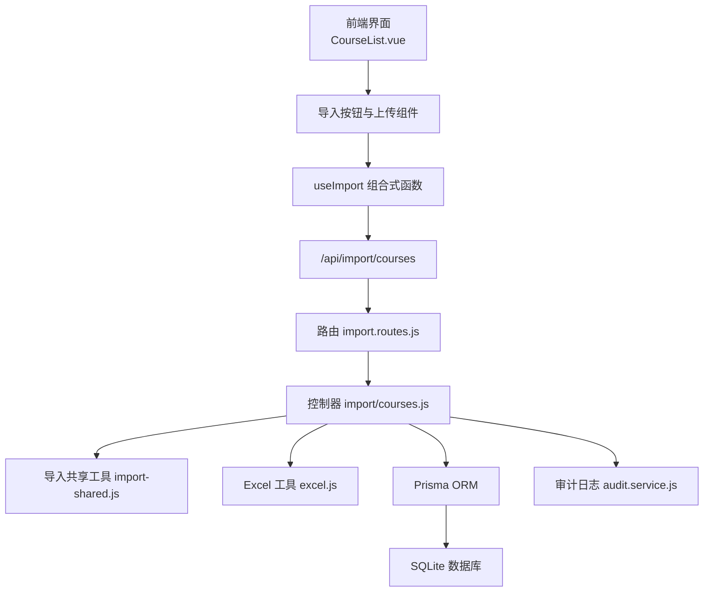
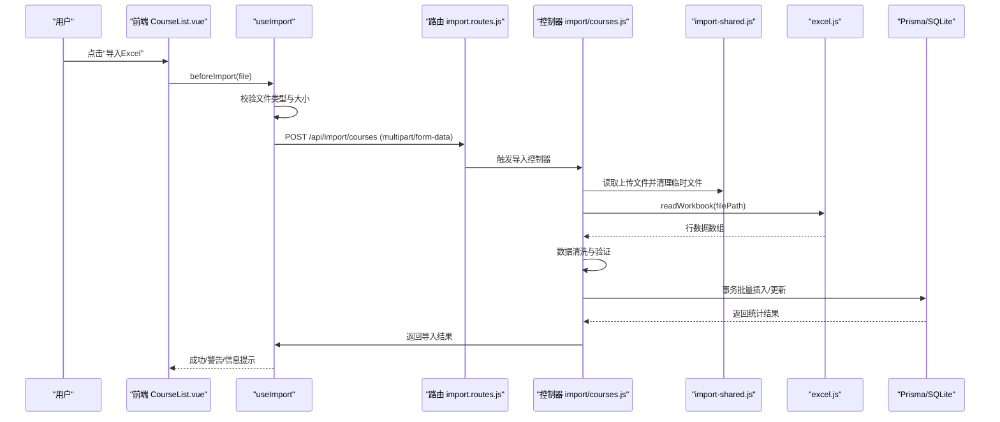
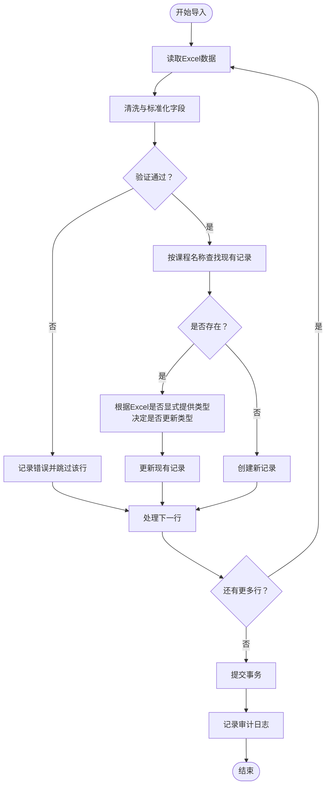
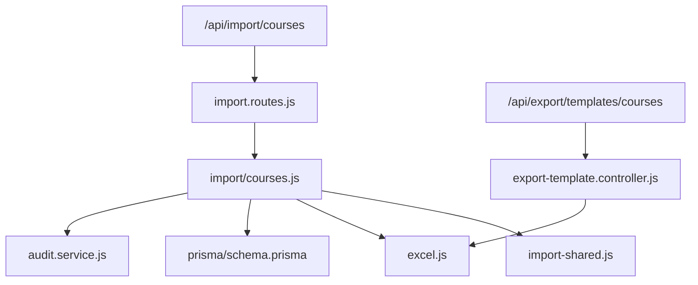

# 课程导入接口

<cite>
**本文档引用的文件**
- [server/src/controllers/import/courses.js](file://server/src/controllers/import/courses.js)
- [server/src/routes/import.routes.js](file://server/src/routes/import.routes.js)
- [server/src/controllers/import-shared.js](file://server/src/controllers/import-shared.js)
- [server/src/utils/excel.js](file://server/src/utils/excel.js)
- [server/src/constants/index.js](file://server/src/constants/index.js)
- [server/src/controllers/export/export-template.controller.js](file://server/src/controllers/export/export-template.controller.js)
- [server/prisma/schema.prisma](file://server/prisma/schema.prisma)
- [client/src/views/course/CoourseList.vue](file://client/src/views/course/CourseList.vue)
- [client/src/composables/useImport.js](file://client/src/composables/useImport.js)
- [server/src/utils/error.js](file://server/src/utils/error.js)
- [server/src/utils/response.js](file://server/src/utils/response.js)
</cite>

## 目录
1. [简介](#简介)
2. [项目结构](#项目结构)
3. [核心组件](#核心组件)
4. [架构概览](#架构概览)
5. [详细组件分析](#详细组件分析)
6. [依赖关系分析](#依赖关系分析)
7. [性能考虑](#性能考虑)
8. [故障排除指南](#故障排除指南)
9. [结论](#结论)
10. [附录](#附录)

## 简介
本文档详细说明了课程批量导入接口的使用方法，重点介绍 POST /api/import/courses 接口。内容涵盖：
- 课程信息 Excel 模板格式与字段映射关系
- 数据验证规则与业务逻辑
- 字段要求：课程编号、课程名称、课程类型等
- 完整的导入示例（正确与错误格式）
- 唯一性检查、类型识别、事务处理等关键实现细节

## 项目结构
课程导入功能涉及前后端协作的关键文件如下：

**图表来源**
- [client/src/views/course/CourseList.vue:18-29](file://client/src/views/course/CourseList.vue#L18-L29)
- [client/src/composables/useImport.js:14-55](file://client/src/composables/useImport.js#L14-L55)
- [server/src/routes/import.routes.js:20-22](file://server/src/routes/import.routes.js#L20-L22)
- [server/src/controllers/import/courses.js:12-22](file://server/src/controllers/import/courses.js#L12-L22)
- [server/src/controllers/import-shared.js:11-25](file://server/src/controllers/import-shared.js#L11-L25)
- [server/src/utils/excel.js:90-134](file://server/src/utils/excel.js#L90-L134)
- [server/prisma/schema.prisma:70-85](file://server/prisma/schema.prisma#L70-L85)

**章节来源**
- [client/src/views/course/CourseList.vue:18-29](file://client/src/views/course/CourseList.vue#L18-L29)
- [client/src/composables/useImport.js:14-55](file://client/src/composables/useImport.js#L14-L55)
- [server/src/routes/import.routes.js:20-22](file://server/src/routes/import.routes.js#L20-L22)
- [server/src/controllers/import/courses.js:12-22](file://server/src/controllers/import/courses.js#L12-L22)

## 核心组件
- 路由层：定义 /api/import/courses POST 接口，绑定上传中间件与导入控制器
- 控制器层：解析 Excel、清洗数据、验证与入库、事务处理、审计日志
- 工具层：Excel 读取与模板生成、文件上传过滤、XSS 清洗
- 数据层：Prisma courses 模型，包含 name、code、type 等字段
- 前端层：CourseList.vue 提供导入入口，useImport 统一封装导入流程

**章节来源**
- [server/src/routes/import.routes.js:20-22](file://server/src/routes/import.routes.js#L20-L22)
- [server/src/controllers/import/courses.js:12-22](file://server/src/controllers/import/courses.js#L12-L22)
- [server/src/utils/excel.js:90-134](file://server/src/utils/excel.js#L90-L134)
- [server/prisma/schema.prisma:70-85](file://server/prisma/schema.prisma#L70-L85)
- [client/src/views/course/CourseList.vue:18-29](file://client/src/views/course/CourseList.vue#L18-L29)

## 架构概览
课程导入的端到端流程如下：

**图表来源**
- [client/src/views/course/CourseList.vue:18-29](file://client/src/views/course/CourseList.vue#L18-L29)
- [client/src/composables/useImport.js:22-55](file://client/src/composables/useImport.js#L22-L55)
- [server/src/routes/import.routes.js:20-22](file://server/src/routes/import.routes.js#L20-L22)
- [server/src/controllers/import/courses.js:12-22](file://server/src/controllers/import/courses.js#L12-L22)
- [server/src/controllers/import-shared.js:11-25](file://server/src/controllers/import-shared.js#L11-L25)
- [server/src/utils/excel.js:90-134](file://server/src/utils/excel.js#L90-L134)

## 详细组件分析

### 接口定义与请求参数
- 接口路径：POST /api/import/courses
- 请求方式：multipart/form-data
- 上传字段：file（必须为 .xlsx 或 .xls）
- 认证：需要 Token（Authorization: Bearer <token>）

**章节来源**
- [server/src/routes/import.routes.js:20-22](file://server/src/routes/import.routes.js#L20-L22)
- [client/src/views/course/CourseList.vue:21-24](file://client/src/views/course/CourseList.vue#L21-L24)
- [server/src/controllers/import-shared.js:11-25](file://server/src/controllers/import-shared.js#L11-L25)

### Excel 模板与字段映射
- 模板下载：通过 /api/export/templates/courses 获取课程导入模板
- 模板字段：
  - 课程名称（必填）
  - 课程编码（可选）
  - 课程类型（可选，支持中文“专业课”或英文“professional”）
- 字段映射关系：
  - Excel 列标题会作为对象键，首行去除非必填标记后读取
  - 读取时按表头数量遍历列，避免跳列导致字段错位

**章节来源**
- [server/src/controllers/export/export-template.controller.js:38-46](file://server/src/controllers/export/export-template.controller.js#L38-L46)
- [server/src/utils/excel.js:90-134](file://server/src/utils/excel.js#L90-L134)

### 数据验证与清洗规则
- 文件校验：
  - 后缀名：.xlsx 或 .xls
  - MIME 类型：application/vnd.openxmlformats-officedocument.spreadsheetml.sheet 或 application/vnd.ms-excel
  - 最大文件大小：10MB
- 数据清洗：
  - 自动去除首尾空白，空值转为 null
  - XSS 过滤，防止脚本注入
- 字段验证：
  - 课程名称为必填项，缺失则记录错误并跳过该行
  - 课程类型支持“专业课”或“professional”，否则默认为“公共基础课”

**章节来源**
- [server/src/controllers/import-shared.js:11-25](file://server/src/controllers/import-shared.js#L11-L25)
- [server/src/utils/excel.js:49-88](file://server/src/utils/excel.js#L49-L88)
- [server/src/controllers/import/courses.js:35-53](file://server/src/controllers/import/courses.js#L35-L53)

### 业务逻辑与数据处理
- 匹配策略：
  - 以“课程名称”为唯一匹配条件，存在即更新，不存在即创建
- 更新策略：
  - 若 Excel 中显式提供了“课程类型”，则更新类型字段；若未提供，则保持原值，避免默认值覆盖已有类型
- 事务处理：
  - 使用 Prisma 事务批量处理，保证原子性
- 审计日志：
  - 成功/失败均记录审计日志，包含导入统计与错误详情

**图表来源**
- [server/src/controllers/import/courses.js:27-103](file://server/src/controllers/import/courses.js#L27-L103)
- [server/src/utils/excel.js:90-134](file://server/src/utils/excel.js#L90-L134)

**章节来源**
- [server/src/controllers/import/courses.js:27-103](file://server/src/controllers/import/courses.js#L27-L103)

### 数据库模型与约束
- courses 表字段：
  - name：课程名称（索引）
  - code：课程编码（索引，可空）
  - type：课程类型，默认“public”，支持“public”或“professional”
- 索引与约束：
  - name 上建立索引，便于按名称快速匹配
  - code 上建立索引，便于快速检索
  - type 上建立索引，便于按类型查询

**章节来源**
- [server/prisma/schema.prisma:70-85](file://server/prisma/schema.prisma#L70-L85)

### 前端集成与交互
- 前端通过 CourseList.vue 提供导入入口，绑定上传组件与 useImport 组合式函数
- useImport 统一处理文件校验、确认弹窗、上传、结果反馈
- 成功/失败/部分失败场景均有明确的消息提示

**章节来源**
- [client/src/views/course/CourseList.vue:18-29](file://client/src/views/course/CourseList.vue#L18-L29)
- [client/src/composables/useImport.js:22-82](file://client/src/composables/useImport.js#L22-L82)

## 依赖关系分析
课程导入接口的依赖关系如下：

**图表来源**
- [server/src/routes/import.routes.js:20-22](file://server/src/routes/import.routes.js#L20-L22)
- [server/src/controllers/import/courses.js:1-7](file://server/src/controllers/import/courses.js#L1-L7)
- [server/src/controllers/import-shared.js:1-52](file://server/src/controllers/import-shared.js#L1-L52)
- [server/src/utils/excel.js:1-171](file://server/src/utils/excel.js#L1-L171)
- [server/prisma/schema.prisma:70-85](file://server/prisma/schema.prisma#L70-L85)
- [server/src/controllers/export/export-template.controller.js:38-46](file://server/src/controllers/export/export-template.controller.js#L38-L46)

**章节来源**
- [server/src/routes/import.routes.js:20-22](file://server/src/routes/import.routes.js#L20-L22)
- [server/src/controllers/import/courses.js:1-7](file://server/src/controllers/import/courses.js#L1-L7)
- [server/src/controllers/export/export-template.controller.js:38-46](file://server/src/controllers/export/export-template.controller.js#L38-L46)

## 性能考虑
- Excel 读取限制：
  - 最大行数：20000 行
  - 最大文件大小：10MB
- 数据处理：
  - 逐行读取并清洗，避免一次性加载过多内存
  - 使用事务批量提交，减少数据库往返次数
- 前端体验：
  - 导入成功/失败消息即时反馈，提升用户体验

**章节来源**
- [server/src/constants/index.js:22-27](file://server/src/constants/index.js#L22-L27)
- [server/src/utils/excel.js:90-134](file://server/src/utils/excel.js#L90-L134)
- [server/src/controllers/import/courses.js:80-103](file://server/src/controllers/import/courses.js#L80-L103)

## 故障排除指南
- 常见错误类型：
  - 文件格式错误：仅支持 .xlsx 或 .xls
  - 文件过大：超过 10MB
  - Excel 解析失败：文件损坏或格式异常
  - 缺少必填字段：课程名称为空
- 错误处理：
  - 统一使用 422 验证错误与自定义错误类
  - 成功/失败均记录审计日志，便于追踪
- 前端提示：
  - 导入失败时显示具体错误列表
  - 成功时提示新增/覆盖/失败的数量统计

**章节来源**
- [server/src/controllers/import-shared.js:14-24](file://server/src/controllers/import-shared.js#L14-L24)
- [server/src/utils/error.js:26-30](file://server/src/utils/error.js#L26-L30)
- [client/src/composables/useImport.js:57-82](file://client/src/composables/useImport.js#L57-L82)

## 结论
课程批量导入接口实现了从 Excel 到数据库的完整闭环，具备严格的文件校验、数据清洗与验证机制，并通过事务确保数据一致性。前端通过统一的导入组合式函数简化了用户交互，审计日志保障了可追溯性。建议在实际使用中：
- 严格遵循模板字段与命名
- 确保课程名称唯一性，避免重复覆盖
- 注意 Excel 文件大小与行数限制
- 导入完成后查看结果与错误列表，及时修正问题

## 附录

### 字段要求与示例
- 字段映射与要求：
  - 课程名称：必填，作为匹配与创建依据
  - 课程编码：可选，建议唯一但非强制
  - 课程类型：可选，支持“专业课”或“professional”，其他值将被视为“公共基础课”
- 正确示例：
  - 行1：课程名称=语文，课程编码=CHN001，课程类型=专业课
  - 行2：课程名称=高等数学，课程编码=MATH001，课程类型=professional
- 错误示例：
  - 行1：课程名称为空，将被记录为验证失败
  - 行2：课程类型填写为“其他”，将被视为“公共基础课”

**章节来源**
- [server/src/controllers/export/export-template.controller.js:38-46](file://server/src/controllers/export/export-template.controller.js#L38-L46)
- [server/src/controllers/import/courses.js:35-53](file://server/src/controllers/import/courses.js#L35-L53)

### 审计日志与结果格式
- 审计日志包含：
  - 操作：import
  - 模块：course
  - 用户ID、IP、结果（success/failed）、消息与详情
- 导入结果：
  - imported：新增数量
  - overwritten：覆盖数量
  - failed：验证失败数量
  - total：总行数
  - errors：错误列表

**章节来源**
- [server/src/controllers/import/courses.js:55-130](file://server/src/controllers/import/courses.js#L55-L130)
- [server/src/utils/response.js:1-3](file://server/src/utils/response.js#L1-L3)