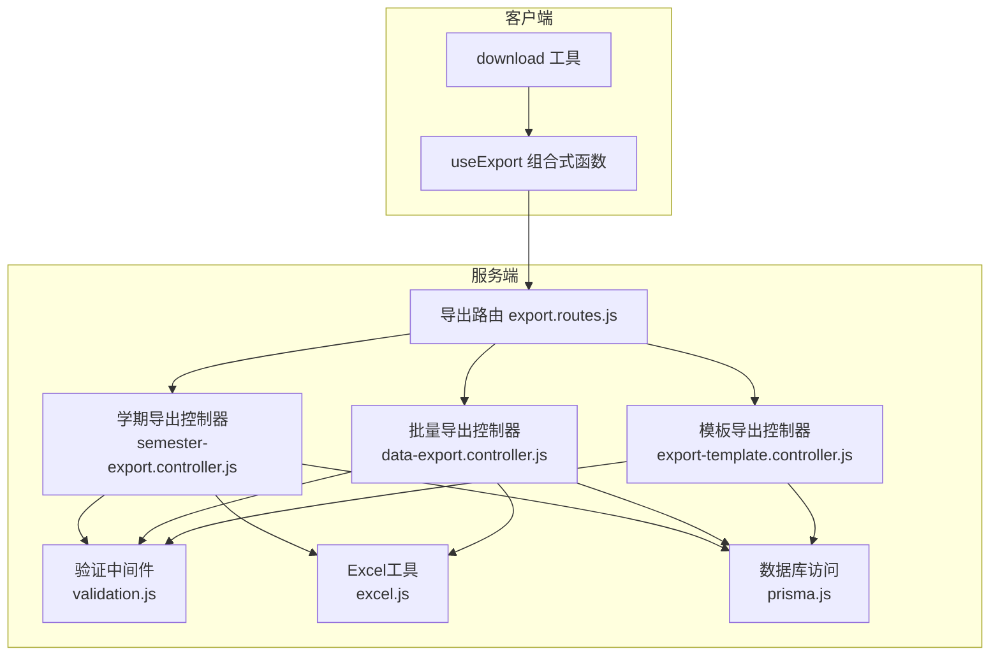
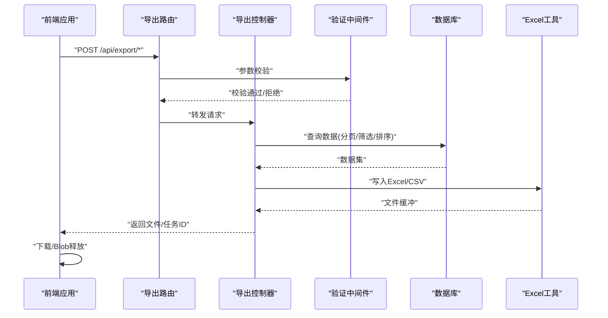
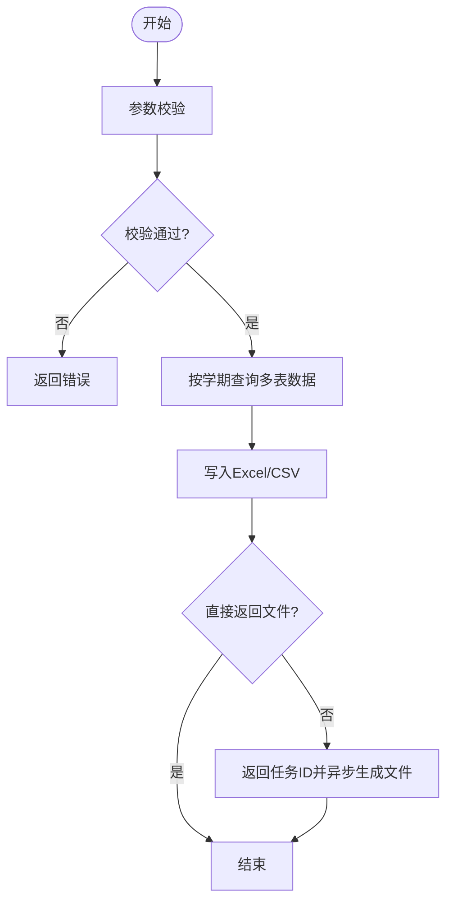
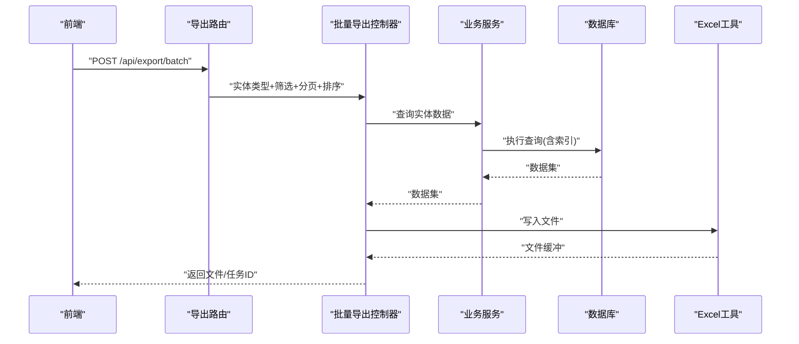
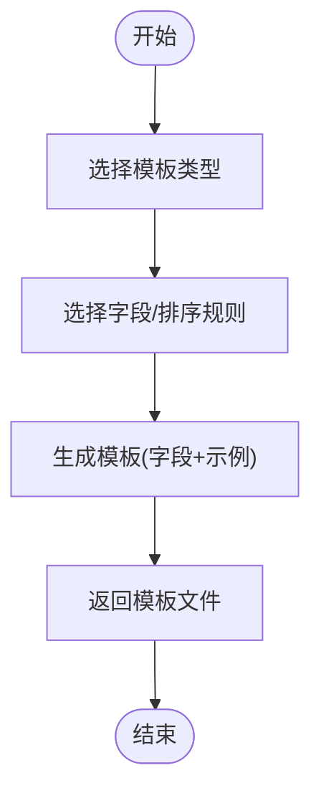
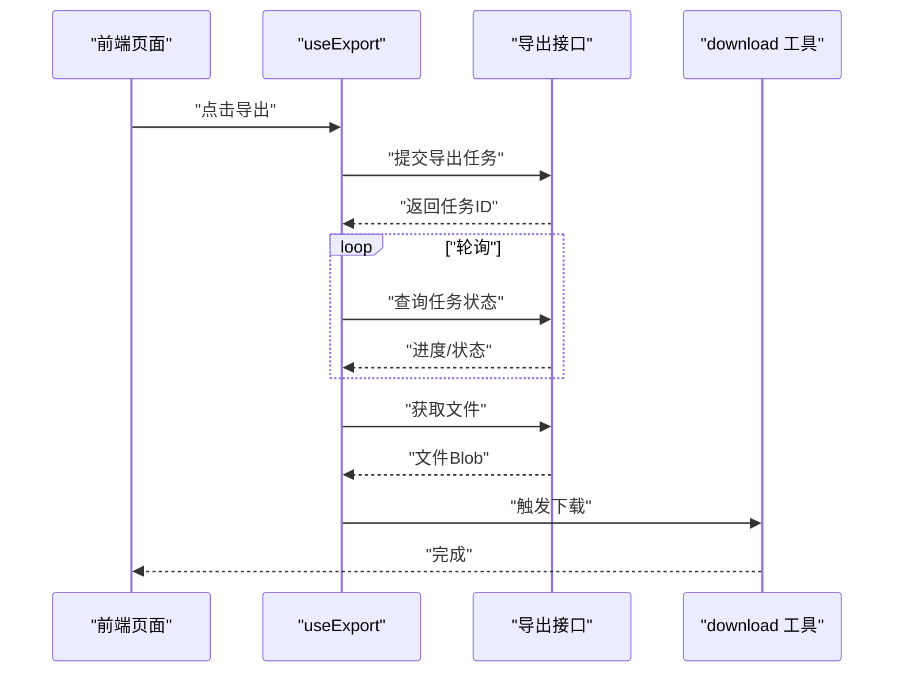
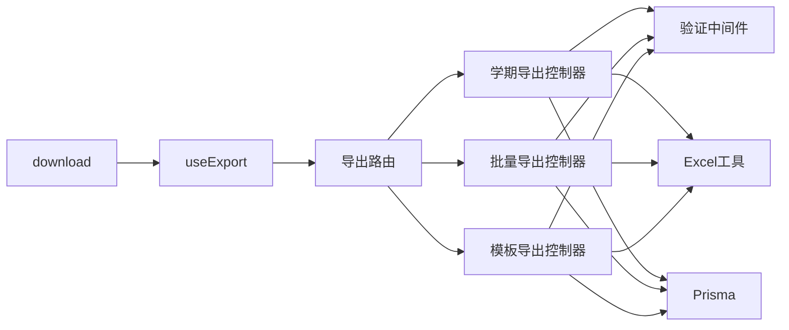

# 导出接口

<cite>
**本文引用的文件**
- [server/src/controllers/export/data-export.controller.js](file://server/src/controllers/export/data-export.controller.js)
- [server/src/controllers/export/semester-export.controller.js](file://server/src/controllers/export/semester-export.controller.js)
- [server/src/controllers/export/export-template.controller.js](file://server/src/controllers/export/export-template.controller.js)
- [server/src/routes/export.routes.js](file://server/src/routes/export.routes.js)
- [client/src/composables/useExport.js](file://client/src/composables/useExport.js)
- [client/src/utils/download.js](file://client/src/utils/download.js)
- [server/src/utils/excel.js](file://server/src/utils/excel.js)
- [server/src/middleware/validation.js](file://server/src/middleware/validation.js)
- [server/src/services/class.service.js](file://server/src/services/class.service.js)
- [server/src/services/course.service.js](file://server/src/services/course.service.js)
- [server/src/services/teacher.service.js](file://server/src/services/teacher.service.js)
- [server/src/services/textbook.service.js](file://server/src/services/textbook.service.js)
- [server/src/services/plan.service.js](file://server/src/services/plan.service.js)
- [server/src/lib/prisma.js](file://server/src/lib/prisma.js)
</cite>

## 目录
1. [简介](#简介)
2. [项目结构](#项目结构)
3. [核心组件](#核心组件)
4. [架构总览](#架构总览)
5. [详细组件分析](#详细组件分析)
6. [依赖关系分析](#依赖关系分析)
7. [性能考虑](#性能考虑)
8. [故障排查指南](#故障排查指南)
9. [结论](#结论)
10. [附录](#附录)

## 简介
本文件面向后端与前端开发者，系统性梳理“导出接口”的设计与实现，覆盖以下能力：
- 学期数据导出：按学期维度聚合教学计划、课程、教师、班级、教材等数据，支持Excel/CSV导出。
- 模板下载：提供可定制的导出模板，便于用户按需选择字段与排序规则。
- 批量数据导出：对多类业务实体进行统一导出，支持筛选条件与时间范围设置。
- 导出任务状态与进度：通过任务队列或异步机制管理大文件导出，支持进度查询与结果获取。
- 高级功能：字段选择、排序规则、筛选条件、时间范围、分页与索引优化。
- 性能优化与并发：基于数据库索引、流式写入、分页游标、并发控制与缓存策略。

## 项目结构
导出相关代码主要分布在服务端控制器、路由、工具与中间件，以及客户端组合式函数与下载工具中：
- 服务端控制器：负责具体导出逻辑与响应封装。
- 路由层：定义导出接口的HTTP端点与参数校验。
- 工具层：Excel写入、响应封装、排序与命名规范等。
- 客户端：导出流程编排、任务提交、进度轮询与文件下载。

图表来源
- [server/src/routes/export.routes.js](file://server/src/routes/export.routes.js)
- [server/src/controllers/export/semester-export.controller.js](file://server/src/controllers/export/semester-export.controller.js)
- [server/src/controllers/export/data-export.controller.js](file://server/src/controllers/export/data-export.controller.js)
- [server/src/controllers/export/export-template.controller.js](file://server/src/controllers/export/export-template.controller.js)
- [server/src/middleware/validation.js](file://server/src/middleware/validation.js)
- [server/src/utils/excel.js](file://server/src/utils/excel.js)
- [server/src/lib/prisma.js](file://server/src/lib/prisma.js)
- [client/src/composables/useExport.js](file://client/src/composables/useExport.js)
- [client/src/utils/download.js](file://client/src/utils/download.js)

章节来源
- [server/src/routes/export.routes.js](file://server/src/routes/export.routes.js)
- [server/src/controllers/export/semester-export.controller.js](file://server/src/controllers/export/semester-export.controller.js)
- [server/src/controllers/export/data-export.controller.js](file://server/src/controllers/export/data-export.controller.js)
- [server/src/controllers/export/export-template.controller.js](file://server/src/controllers/export/export-template.controller.js)
- [client/src/composables/useExport.js](file://client/src/composables/useExport.js)
- [client/src/utils/download.js](file://client/src/utils/download.js)

## 核心组件
- 导出路由层：集中定义导出接口的HTTP端点、请求参数与校验规则，确保输入安全与一致性。
- 学期导出控制器：按学期维度聚合多表数据，生成Excel/CSV文件，支持字段映射与排序。
- 批量导出控制器：面向多类业务实体的统一导出，支持筛选条件、时间范围、分页与排序。
- 模板导出控制器：提供可定制模板下载，支持字段选择与排序规则配置。
- Excel工具：封装写入逻辑，支持流式写入、样式与多工作表处理。
- 客户端导出组合式函数：封装任务提交、轮询、下载与错误处理。
- 下载工具：通用下载器，支持Blob与URL释放，避免内存泄漏。

章节来源
- [server/src/routes/export.routes.js](file://server/src/routes/export.routes.js)
- [server/src/controllers/export/semester-export.controller.js](file://server/src/controllers/export/semester-export.controller.js)
- [server/src/controllers/export/data-export.controller.js](file://server/src/controllers/export/data-export.controller.js)
- [server/src/controllers/export/export-template.controller.js](file://server/src/controllers/export/export-template.controller.js)
- [server/src/utils/excel.js](file://server/src/utils/excel.js)
- [client/src/composables/useExport.js](file://client/src/composables/useExport.js)
- [client/src/utils/download.js](file://client/src/utils/download.js)

## 架构总览
导出流程从客户端发起，经路由与控制器处理，调用服务层与数据库，最终通过Excel工具生成文件并返回给客户端下载。

图表来源
- [server/src/routes/export.routes.js](file://server/src/routes/export.routes.js)
- [server/src/controllers/export/semester-export.controller.js](file://server/src/controllers/export/semester-export.controller.js)
- [server/src/utils/excel.js](file://server/src/utils/excel.js)
- [server/src/lib/prisma.js](file://server/src/lib/prisma.js)

## 详细组件分析

### 学期数据导出
- 接口目标：按学期维度聚合教学计划、课程、教师、班级、教材等数据，输出Excel/CSV。
- 输入参数：
  - 学期标识：用于限定数据范围。
  - 导出格式：Excel/CSV。
  - 字段映射：可选，仅导出指定字段。
  - 排序规则：可选，按字段升/降序。
  - 时间范围：可选，过滤创建/更新时间。
- 处理流程：
  - 参数校验：确保学期有效、格式合法、字段存在。
  - 数据查询：按学期关联多表，使用分页游标与复合索引提升性能。
  - 写入文件：使用Excel工具写入，支持多工作表与样式。
  - 响应返回：直接返回文件或返回任务ID供后续轮询。
- 输出示例：Excel工作簿包含多个工作表（如计划、课程、教师、班级、教材），CSV以逗号分隔。

图表来源
- [server/src/controllers/export/semester-export.controller.js](file://server/src/controllers/export/semester-export.controller.js)
- [server/src/middleware/validation.js](file://server/src/middleware/validation.js)
- [server/src/utils/excel.js](file://server/src/utils/excel.js)

章节来源
- [server/src/controllers/export/semester-export.controller.js](file://server/src/controllers/export/semester-export.controller.js)
- [server/src/middleware/validation.js](file://server/src/middleware/validation.js)
- [server/src/utils/excel.js](file://server/src/utils/excel.js)

### 批量数据导出
- 接口目标：对课程、教师、班级、教材、培养方案等实体进行统一导出。
- 输入参数：
  - 实体类型：课程/教师/班级/教材/培养方案。
  - 筛选条件：如学院、专业、状态等。
  - 时间范围：创建/更新时间区间。
  - 分页参数：页码与每页大小，支持游标分页。
  - 排序规则：单字段或多字段排序。
  - 字段选择：仅导出所需字段。
- 处理流程：
  - 路由根据实体类型分发到对应服务。
  - 服务层执行查询，结合索引与复合索引加速。
  - 控制器调用Excel工具写入，支持流式写入与多工作表。
  - 返回文件或任务ID。
- 输出示例：Excel包含一个或多个工作表；CSV按行输出。

图表来源
- [server/src/routes/export.routes.js](file://server/src/routes/export.routes.js)
- [server/src/controllers/export/data-export.controller.js](file://server/src/controllers/export/data-export.controller.js)
- [server/src/services/course.service.js](file://server/src/services/course.service.js)
- [server/src/services/teacher.service.js](file://server/src/services/teacher.service.js)
- [server/src/services/class.service.js](file://server/src/services/class.service.js)
- [server/src/services/textbook.service.js](file://server/src/services/textbook.service.js)
- [server/src/services/plan.service.js](file://server/src/services/plan.service.js)
- [server/src/lib/prisma.js](file://server/src/lib/prisma.js)
- [server/src/utils/excel.js](file://server/src/utils/excel.js)

章节来源
- [server/src/controllers/export/data-export.controller.js](file://server/src/controllers/export/data-export.controller.js)
- [server/src/routes/export.routes.js](file://server/src/routes/export.routes.js)
- [server/src/services/course.service.js](file://server/src/services/course.service.js)
- [server/src/services/teacher.service.js](file://server/src/services/teacher.service.js)
- [server/src/services/class.service.js](file://server/src/services/class.service.js)
- [server/src/services/textbook.service.js](file://server/src/services/textbook.service.js)
- [server/src/services/plan.service.js](file://server/src/services/plan.service.js)
- [server/src/lib/prisma.js](file://server/src/lib/prisma.js)
- [server/src/utils/excel.js](file://server/src/utils/excel.js)

### 模板下载与定制
- 接口目标：提供可定制的导出模板，支持字段选择与排序规则。
- 输入参数：
  - 模板类型：课程/教师/班级/教材/培养方案。
  - 字段列表：用户选择导出字段。
  - 排序规则：默认排序字段与方向。
- 处理流程：
  - 控制器根据模板类型生成字段清单与默认排序。
  - 写入Excel模板文件，包含字段标题与示例数据。
  - 返回模板文件供下载。
- 使用建议：
  - 用户在下载模板后，按字段顺序填写数据，再上传导入或作为导出参考。

图表来源
- [server/src/controllers/export/export-template.controller.js](file://server/src/controllers/export/export-template.controller.js)
- [server/src/utils/excel.js](file://server/src/utils/excel.js)

章节来源
- [server/src/controllers/export/export-template.controller.js](file://server/src/controllers/export/export-template.controller.js)
- [server/src/utils/excel.js](file://server/src/utils/excel.js)

### 客户端导出流程
- 组合式函数 useExport：
  - 提交导出任务：封装请求参数（实体类型、筛选、时间范围、字段、排序）。
  - 轮询任务：定时查询任务状态与进度。
  - 下载文件：收到文件后触发下载并释放资源。
- 下载工具 download：
  - 支持Blob与URL释放，避免内存泄漏。
  - 统一处理MIME类型与文件名。

图表来源
- [client/src/composables/useExport.js](file://client/src/composables/useExport.js)
- [client/src/utils/download.js](file://client/src/utils/download.js)

章节来源
- [client/src/composables/useExport.js](file://client/src/composables/useExport.js)
- [client/src/utils/download.js](file://client/src/utils/download.js)

## 依赖关系分析
- 控制器依赖：
  - 验证中间件：确保输入参数合法。
  - Excel工具：封装写入细节。
  - 业务服务：按实体类型查询数据。
  - 数据库：Prisma ORM访问。
- 路由依赖：
  - 将不同导出场景分发至对应控制器。
- 客户端依赖：
  - useExport：统一导出流程。
  - download：下载与资源释放。

图表来源
- [server/src/routes/export.routes.js](file://server/src/routes/export.routes.js)
- [server/src/controllers/export/semester-export.controller.js](file://server/src/controllers/export/semester-export.controller.js)
- [server/src/controllers/export/data-export.controller.js](file://server/src/controllers/export/data-export.controller.js)
- [server/src/controllers/export/export-template.controller.js](file://server/src/controllers/export/export-template.controller.js)
- [server/src/middleware/validation.js](file://server/src/middleware/validation.js)
- [server/src/utils/excel.js](file://server/src/utils/excel.js)
- [server/src/lib/prisma.js](file://server/src/lib/prisma.js)
- [client/src/composables/useExport.js](file://client/src/composables/useExport.js)
- [client/src/utils/download.js](file://client/src/utils/download.js)

章节来源
- [server/src/routes/export.routes.js](file://server/src/routes/export.routes.js)
- [server/src/middleware/validation.js](file://server/src/middleware/validation.js)
- [server/src/utils/excel.js](file://server/src/utils/excel.js)
- [server/src/lib/prisma.js](file://server/src/lib/prisma.js)
- [client/src/composables/useExport.js](file://client/src/composables/useExport.js)
- [client/src/utils/download.js](file://client/src/utils/download.js)

## 性能考虑
- 数据库索引：
  - 复合索引：在常用筛选字段（如学院、专业、状态）上建立复合索引，减少全表扫描。
  - 时间范围索引：对创建/更新时间建立索引，加速范围查询。
- 分页与游标：
  - 使用游标分页避免深度偏移带来的性能问题。
  - 控制每页大小，平衡内存占用与网络传输。
- 流式写入：
  - 对大文件采用流式写入，降低内存峰值。
- 并发控制：
  - 限制同时导出的任务数量，避免数据库与IO过载。
  - 对热点实体增加缓存策略，减少重复查询。
- 导出格式：
  - CSV适合大数据量快速导出；Excel适合需要样式与多工作表的场景。
- 前端优化：
  - 使用Blob与URL释放，避免内存泄漏。
  - 轮询间隔动态调整，避免频繁请求。

[本节为通用性能指导，不直接分析具体文件]

## 故障排查指南
- 参数校验失败：
  - 检查请求参数是否符合预期类型与范围。
  - 参考验证中间件的错误信息定位问题。
- 查询超时或性能异常：
  - 确认相关字段是否存在索引。
  - 检查筛选条件是否过于宽泛导致数据量过大。
- 文件过大导致内存溢出：
  - 切换为任务模式，后台生成文件后下载。
  - 采用流式写入与分块处理。
- 下载失败或空白文件：
  - 检查返回的文件类型与内容长度。
  - 使用下载工具确保Blob正确释放与URL清理。
- 任务状态异常：
  - 前端轮询时检查任务ID有效性与状态字段。
  - 后端记录任务日志，便于追踪生成过程。

章节来源
- [server/src/middleware/validation.js](file://server/src/middleware/validation.js)
- [server/src/utils/excel.js](file://server/src/utils/excel.js)
- [client/src/utils/download.js](file://client/src/utils/download.js)

## 结论
导出接口通过清晰的路由分发、严格的参数校验、灵活的字段与排序配置，以及高效的Excel写入与任务模式，满足了从学期聚合到批量导出、从模板定制到大文件处理的多样化需求。配合数据库索引、分页游标、流式写入与并发控制，可在保证性能的同时提供良好的用户体验。

[本节为总结性内容，不直接分析具体文件]

## 附录
- 常用字段与排序建议：
  - 课程：名称、学分、开课学期、任课教师。
  - 教师：姓名、工号、所属学院、职称。
  - 班级：年级、专业、班级名称、辅导员。
  - 教材：书名、作者、出版社、ISBN。
  - 培养方案：方案名称、适用专业、版本号、生效日期。
- 时间范围设置建议：
  - 默认最近3个月，支持自定义起止时间。
- 字段选择原则：
  - 优先选择高频查询字段，避免冗余列影响可读性。
- 排序规则：
  - 默认按创建时间倒序，支持多字段组合排序。

[本节为通用指导，不直接分析具体文件]