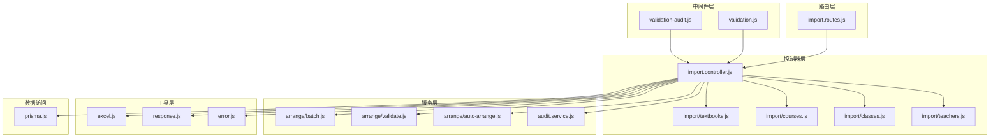
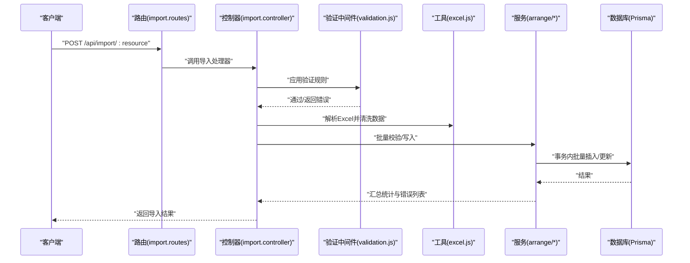
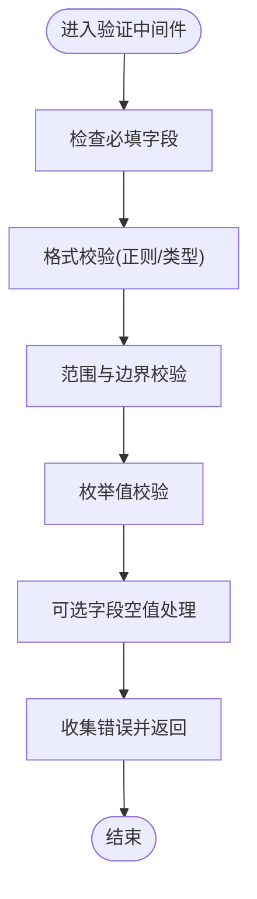
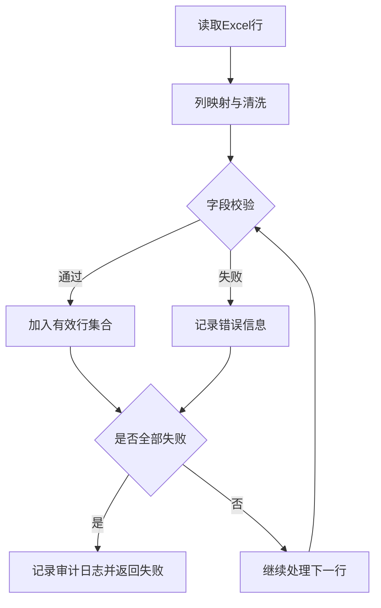
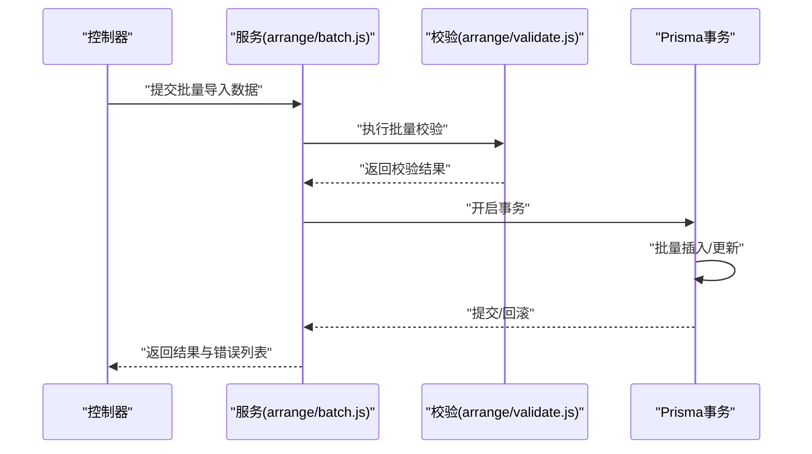
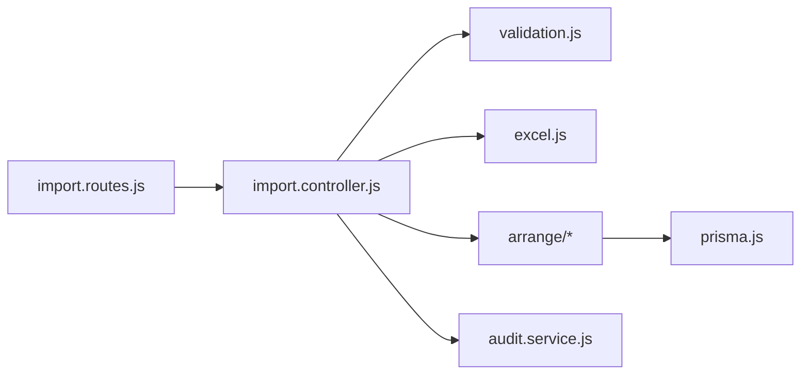

# 批量数据验证

<cite>
**本文引用的文件**
- [validation.js](file://server/src/middleware/validation.js)
- [validation-audit.js](file://server/src/middleware/validation-audit.js)
- [validation.test.js](file://server/src/middleware/__tests__/validation.test.js)
- [import.routes.js](file://server/src/routes/import.routes.js)
- [import.controller.js](file://server/src/controllers/import.controller.js)
- [textbooks.js](file://server/src/controllers/import/textbooks.js)
- [courses.js](file://server/src/controllers/import/courses.js)
- [classes.js](file://server/src/controllers/import/classes.js)
- [teachers.js](file://server/src/controllers/import/teachers.js)
- [excel.js](file://server/src/utils/excel.js)
- [prisma.js](file://server/src/lib/prisma.js)
- [audit.service.js](file://server/src/services/audit.service.js)
- [batch.js](file://server/src/services/arrange/batch.js)
- [validate.js](file://server/src/services/arrange/validate.js)
- [auto-arrange.js](file://server/src/services/arrange/auto-arrange.js)
- [error.js](file://server/src/utils/error.js)
- [response.js](file://server/src/utils/response.js)
- [EXPORT_IMPORT_AUDIT.md](file://docs/EXPORT_IMPORT_AUDIT.md)
</cite>

## 目录
1. [引言](#引言)
2. [项目结构](#项目结构)
3. [核心组件](#核心组件)
4. [架构总览](#架构总览)
5. [详细组件分析](#详细组件分析)
6. [依赖关系分析](#依赖关系分析)
7. [性能考虑](#性能考虑)
8. [故障排查指南](#故障排查指南)
9. [结论](#结论)
10. [附录](#附录)

## 引言
本文件面向“批量数据验证系统”的技术文档，聚焦以下目标：
- 数据验证规则设计原理：必填字段检查、格式验证、范围约束、业务规则验证
- 验证错误分类机制：语法错误、业务错误、重复数据检测
- 批量操作中的事务处理策略：原子性保证、错误回滚机制、部分失败处理
- 验证规则配置示例与自定义验证器开发指南
- 性能优化策略与大数据量处理最佳实践

该系统以 Express + Prisma 为核心，采用中间件集中式验证规则、控制器层进行批量导入与业务处理、服务层封装事务与批量校验逻辑。

## 项目结构
后端采用分层架构：
- 路由层：定义导入接口入口，绑定控制器
- 控制器层：解析 Excel、清洗数据、调用服务层执行批量写入与校验
- 服务层：封装批量校验、事务控制、自动排课等业务
- 中间件层：统一请求验证规则与错误处理
- 工具层：Excel 解析、响应封装、审计日志、错误处理
- 数据访问：Prisma ORM

图表来源
- [import.routes.js](file://server/src/routes/import.routes.js)
- [import.controller.js](file://server/src/controllers/import.controller.js)
- [validation.js](file://server/src/middleware/validation.js)
- [excel.js](file://server/src/utils/excel.js)
- [prisma.js](file://server/src/lib/prisma.js)

章节来源
- [import.routes.js](file://server/src/routes/import.routes.js)
- [import.controller.js](file://server/src/controllers/import.controller.js)

## 核心组件
- 集中式验证中间件：统一定义各类资源的验证规则与错误处理
- 批量导入控制器：按资源拆分控制器，负责 Excel 解析、数据清洗、批量写入与审计
- 服务层：批量校验、事务控制、自动排课与批量操作
- 工具与基础设施：Excel 解析、响应封装、审计日志、Prisma 连接

章节来源
- [validation.js](file://server/src/middleware/validation.js)
- [validation-audit.js](file://server/src/middleware/validation-audit.js)
- [excel.js](file://server/src/utils/excel.js)
- [prisma.js](file://server/src/lib/prisma.js)

## 架构总览
批量导入流程概览如下：

图表来源
- [import.routes.js](file://server/src/routes/import.routes.js)
- [import.controller.js](file://server/src/controllers/import.controller.js)
- [validation.js](file://server/src/middleware/validation.js)
- [excel.js](file://server/src/utils/excel.js)
- [prisma.js](file://server/src/lib/prisma.js)

## 详细组件分析

### 验证中间件与规则体系
- 设计原则
  - 必填字段检查：对关键字段使用非空与长度限制
  - 格式验证：使用正则表达式校验日期、学期、邮箱等格式
  - 范围约束：数值范围校验（如价格、周课时、ID 正整数）
  - 业务规则验证：枚举值校验、可选字段的空值处理
- 错误处理
  - 统一错误收集与响应封装，便于前端展示与审计
- 规则示例（节选）
  - 教师创建：姓名必填、性别枚举、出生年月格式、默认周课时范围
  - 教师批量修改周课时：教师ID数组长度限制、ID正整数、周课时范围
  - 教学安排相关：课程ID正整数、学期格式、模式枚举、预览布尔值
  - 系统设置重置：确认字符串与原因长度校验

图表来源
- [validation.js](file://server/src/middleware/validation.js)

章节来源
- [validation.js](file://server/src/middleware/validation.js)
- [validation-audit.js](file://server/src/middleware/validation-audit.js)
- [validation.test.js](file://server/src/middleware/__tests__/validation.test.js)

### 批量导入控制器与数据清洗
- Excel 解析与列映射：按资源定义列名映射，支持缺失列与空值处理
- 数据清洗：去除空白、类型转换、默认值填充、基础格式校验
- 错误分类与统计：
  - 语法错误：格式不符、必填缺失、范围越界
  - 业务错误：重复数据检测、关联关系不满足
  - 重复数据检测：基于唯一键（如 ISBN、教师工号、班级名称）去重
- 失败处理：当全部行无效时，记录审计日志并返回失败结果；否则返回部分成功

图表来源
- [excel.js](file://server/src/utils/excel.js)
- [textbooks.js](file://server/src/controllers/import/textbooks.js)
- [courses.js](file://server/src/controllers/import/courses.js)
- [classes.js](file://server/src/controllers/import/classes.js)
- [teachers.js](file://server/src/controllers/import/teachers.js)

章节来源
- [excel.js](file://server/src/utils/excel.js)
- [textbooks.js](file://server/src/controllers/import/textbooks.js)
- [courses.js](file://server/src/controllers/import/courses.js)
- [classes.js](file://server/src/controllers/import/classes.js)
- [teachers.js](file://server/src/controllers/import/teachers.js)

### 服务层：批量校验与事务处理
- 批量校验：在事务外进行快速校验，减少数据库压力
- 事务处理：使用 Prisma 事务包裹批量写入，确保原子性
- 错误回滚：任一环节失败即回滚，避免脏数据
- 部分失败处理：记录失败项索引与错误信息，返回混合结果
- 自动排课：在批量导入完成后触发排课校验与生成

图表来源
- [batch.js](file://server/src/services/arrange/batch.js)
- [validate.js](file://server/src/services/arrange/validate.js)
- [prisma.js](file://server/src/lib/prisma.js)

章节来源
- [batch.js](file://server/src/services/arrange/batch.js)
- [validate.js](file://server/src/services/arrange/validate.js)
- [prisma.js](file://server/src/lib/prisma.js)

### 审计与错误处理
- 审计日志：导入失败与成功均记录审计日志，包含操作人、模块、详情与结果
- 错误封装：统一错误响应结构，便于前端展示与追踪
- 审计中间件：复用验证中间件的错误处理能力

章节来源
- [audit.service.js](file://server/src/services/audit.service.js)
- [validation-audit.js](file://server/src/middleware/validation-audit.js)
- [error.js](file://server/src/utils/error.js)
- [response.js](file://server/src/utils/response.js)

## 依赖关系分析
- 路由依赖控制器：import.routes.js 将导入请求转发至 import.controller.js
- 控制器依赖中间件与工具：import.controller.js 使用验证中间件与 Excel 工具
- 控制器依赖服务层：导入控制器调用批量与校验服务
- 服务层依赖 Prisma：事务与批量写入通过 Prisma 实现
- 审计服务：导入过程与结果记录审计日志

图表来源
- [import.routes.js](file://server/src/routes/import.routes.js)
- [import.controller.js](file://server/src/controllers/import.controller.js)
- [validation.js](file://server/src/middleware/validation.js)
- [excel.js](file://server/src/utils/excel.js)
- [prisma.js](file://server/src/lib/prisma.js)
- [audit.service.js](file://server/src/services/audit.service.js)

章节来源
- [import.routes.js](file://server/src/routes/import.routes.js)
- [import.controller.js](file://server/src/controllers/import.controller.js)

## 性能考虑
- 批量写入优化
  - 使用 Prisma 的批量插入/更新，减少往返次数
  - 合理分批处理：根据内存与数据库承受能力设定批次大小
- 索引与查询优化
  - 利用数据库复合索引与唯一约束，加速去重与查找
  - 在导入前进行预检查，降低写入阶段失败概率
- 内存管理
  - 流式读取 Excel，避免一次性加载全部数据
  - 及时释放中间结果，防止内存峰值过高
- 并发与锁
  - 对关键资源导入加互斥锁或队列化，避免并发冲突
  - 使用数据库事务隔离级别与超时控制

## 故障排查指南
- 常见问题定位
  - 验证失败：检查对应资源的验证规则与字段命名是否匹配
  - Excel 列映射错误：核对列名与控制器中映射定义
  - 重复数据：查看唯一键冲突与去重策略
  - 事务失败：检查 Prisma 事务日志与回滚点
- 审计与日志
  - 查看审计日志，定位失败原因与影响范围
  - 结合单元测试与集成测试，复现问题场景
- 参考文档
  - 导入审计文档提供了导入流程与审计要点说明

章节来源
- [EXPORT_IMPORT_AUDIT.md](file://docs/EXPORT_IMPORT_AUDIT.md)

## 结论
该批量数据验证系统通过“集中式验证 + 分层控制器 + 服务层事务”实现高可靠与高性能的批量导入。验证规则覆盖必填、格式、范围与业务约束，错误分类清晰，支持部分失败与审计追踪。配合合理的性能优化策略，可在大数据量场景下稳定运行。

## 附录

### 验证规则配置示例与自定义验证器开发指南
- 配置示例
  - 教师创建：姓名必填、性别枚举、出生年月格式、默认周课时范围
  - 教师批量修改周课时：教师ID数组长度限制、ID正整数、周课时范围
  - 教学安排相关：课程ID正整数、学期格式、模式枚举、预览布尔值
  - 系统设置重置：确认字符串与原因长度校验
- 自定义验证器开发步骤
  - 在验证中间件中新增规则链，遵循现有命名与错误消息风格
  - 在控制器中调用新规则链，确保错误被统一处理
  - 编写单元测试覆盖合法与非法输入场景
  - 更新审计与日志策略，确保新规则触发的错误可追踪

章节来源
- [validation.js](file://server/src/middleware/validation.js)
- [validation.test.js](file://server/src/middleware/__tests__/validation.test.js)