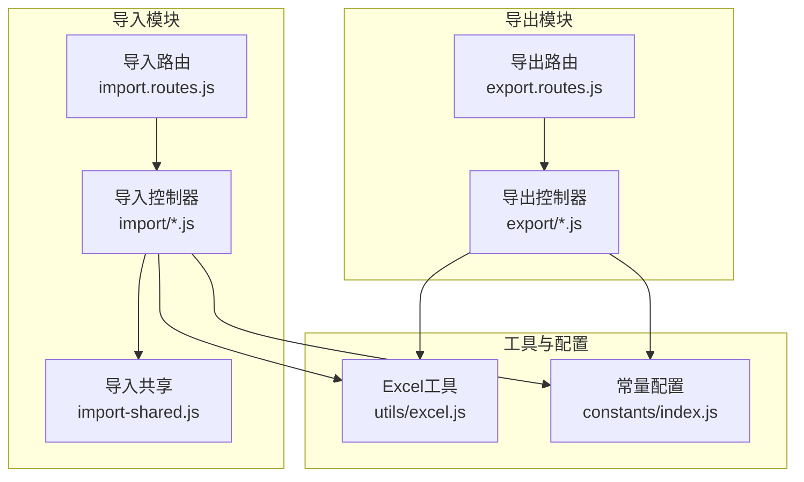
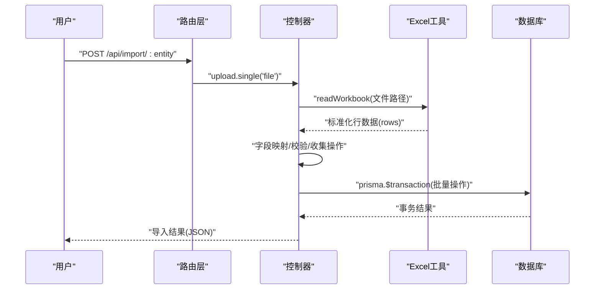
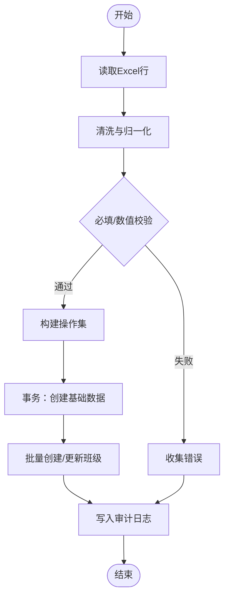
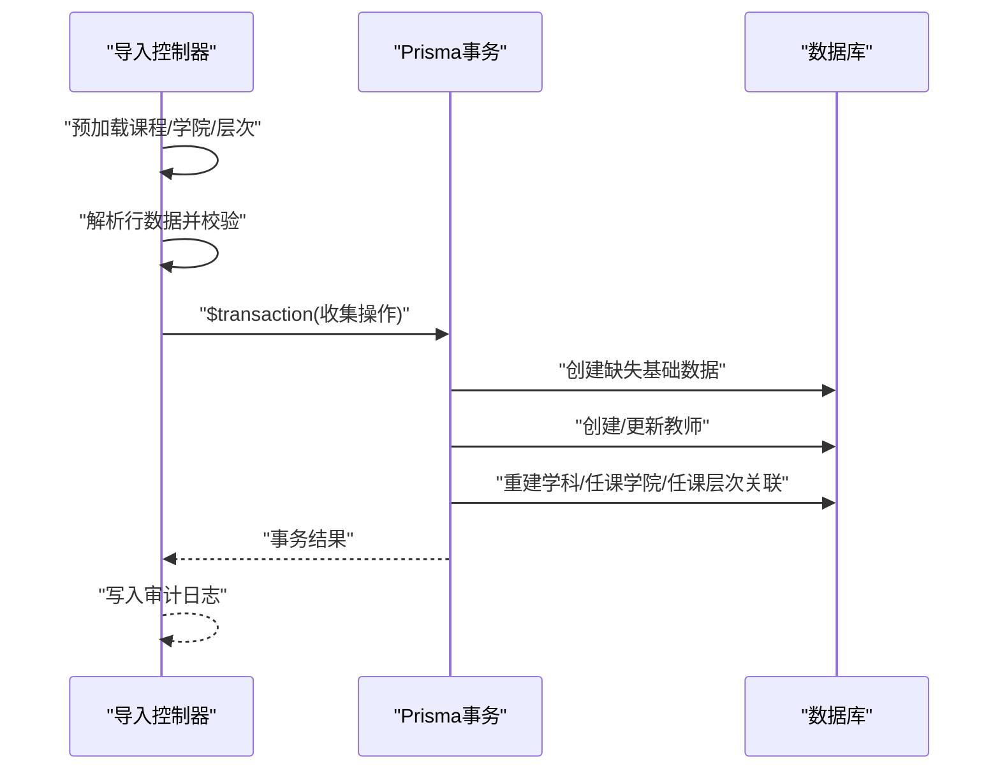
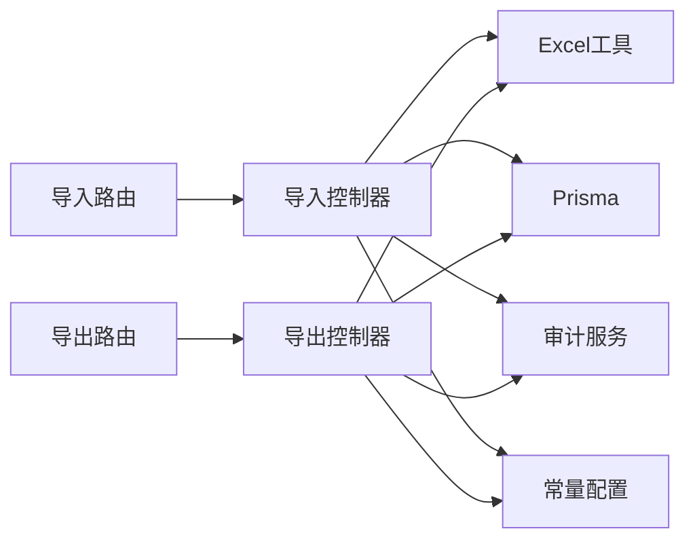

# 数据导入导出接口

<cite>
**本文引用的文件**
- [server/src/controllers/import/classes.js](file://server/src/controllers/import/classes.js)
- [server/src/controllers/import/courses.js](file://server/src/controllers/import/courses.js)
- [server/src/controllers/import/teachers.js](file://server/src/controllers/import/teachers.js)
- [server/src/controllers/import/textbooks.js](file://server/src/controllers/import/textbooks.js)
- [server/src/controllers/export/data-export.controller.js](file://server/src/controllers/export/data-export.controller.js)
- [server/src/controllers/export/semester-export.controller.js](file://server/src/controllers/export/semester-export.controller.js)
- [server/src/controllers/export/export-template.controller.js](file://server/src/controllers/export/export-template.controller.js)
- [server/src/utils/excel.js](file://server/src/utils/excel.js)
- [server/src/controllers/import-shared.js](file://server/src/controllers/import-shared.js)
- [server/src/constants/index.js](file://server/src/constants/index.js)
- [server/src/routers/import.routes.js](file://server/src/routers/import.routes.js)
- [server/src/routers/export.routes.js](file://server/src/routers/export.routes.js)
- [docs/EXPORT_IMPORT_AUDIT.md](file://docs/EXPORT_IMPORT_AUDIT.md)
- [README.md](file://README.md)
</cite>

## 目录
1. [简介](#简介)
2. [项目结构](#项目结构)
3. [核心组件](#核心组件)
4. [架构概览](#架构概览)
5. [详细组件分析](#详细组件分析)
6. [依赖关系分析](#依赖关系分析)
7. [性能考虑](#性能考虑)
8. [故障排除指南](#故障排除指南)
9. [结论](#结论)
10. [附录](#附录)

## 简介
本文件为数据导入导出接口的全面API文档，覆盖Excel文件处理流程（文件上传、模板下载、数据验证、批量导入）、各类数据导入接口（班级、课程、教师、教材）与导出接口（学期开课情况、基础数据导出、模板下载），并提供文件格式规范、字段映射规则、数据校验逻辑、事务处理机制、错误回滚策略、进度反馈接口以及完整的请求响应示例与故障排除指南。

## 项目结构
后端采用Express + Prisma架构，导入导出控制器位于server/src/controllers下，路由位于server/src/routes下，通用Excel工具位于server/src/utils/excel.js，导入共享逻辑位于server/src/controllers/import-shared.js，常量配置位于server/src/constants/index.js。

**图表来源**
- [server/src/routers/import.routes.js:1-35](file://server/src/routers/import.routes.js#L1-L35)
- [server/src/routers/export.routes.js:1-75](file://server/src/routers/export.routes.js#L1-L75)
- [server/src/controllers/import/classes.js:1-345](file://server/src/controllers/import/classes.js#L1-L345)
- [server/src/controllers/export/data-export.controller.js:1-822](file://server/src/controllers/export/data-export.controller.js#L1-L822)
- [server/src/utils/excel.js:1-171](file://server/src/utils/excel.js#L1-L171)
- [server/src/constants/index.js:1-130](file://server/src/constants/index.js#L1-L130)

**章节来源**
- [README.md:160-236](file://README.md#L160-L236)
- [server/src/routers/import.routes.js:1-35](file://server/src/routers/import.routes.js#L1-L35)
- [server/src/routers/export.routes.js:1-75](file://server/src/routers/export.routes.js#L1-L75)

## 核心组件
- Excel工具层：负责Excel读取、工作簿创建、模板生成、单元格值归一化、公式注入防护等。
- 导入共享层：文件上传中间件、输入清洗、临时文件清理、防CSV/Excel公式注入策略。
- 导入控制器：按实体（班级、课程、教师、教材）实现批量导入，包含字段映射、数据校验、事务处理与审计日志。
- 导出控制器：按实体与场景（学期开课、基础数据、教师统计、教学安排、教材使用）导出Excel，包含权限控制与限流。
- 路由层：定义导入/导出接口路径、参数校验、权限中间件与限流策略。

**章节来源**
- [server/src/utils/excel.js:1-171](file://server/src/utils/excel.js#L1-L171)
- [server/src/controllers/import-shared.js:1-52](file://server/src/controllers/import-shared.js#L1-L52)
- [server/src/controllers/import/classes.js:1-345](file://server/src/controllers/import/classes.js#L1-L345)
- [server/src/controllers/export/data-export.controller.js:1-822](file://server/src/controllers/export/data-export.controller.js#L1-L822)
- [server/src/routers/import.routes.js:1-35](file://server/src/routers/import.routes.js#L1-L35)
- [server/src/routers/export.routes.js:1-75](file://server/src/routers/export.routes.js#L1-L75)

## 架构概览
导入/导出接口遵循以下通用流程：
- 文件上传：通过Multer中间件接收Excel文件，限制文件大小与类型。
- Excel解析：使用ExcelJS读取工作簿，归一化单元格值，限制最大行数。
- 数据校验：逐行校验必填字段、数值范围、枚举映射、唯一性与一致性。
- 事务处理：批量操作在Prisma事务中执行，失败自动回滚，确保原子性。
- 结果输出：返回导入统计与错误列表；导出接口返回Excel文件流并记录审计日志。

**图表来源**
- [server/src/routers/import.routes.js:14-32](file://server/src/routers/import.routes.js#L14-L32)
- [server/src/controllers/import-shared.js:11-25](file://server/src/controllers/import-shared.js#L11-L25)
- [server/src/utils/excel.js:90-134](file://server/src/utils/excel.js#L90-L134)
- [server/src/controllers/import/classes.js:13-345](file://server/src/controllers/import/classes.js#L13-L345)

## 详细组件分析

### Excel工具与安全
- Excel读取：读取首张工作表，第一行为表头，后续行转为对象数组；超过最大行数停止读取；对富文本、日期等进行归一化。
- 工作簿创建：设置列宽、表头样式、加粗与填充；导出前对单元格值进行公式注入防护。
- 模板生成：根据表头定义与样本数据生成模板，必填字段标红并标注星号。
- 安全策略：导入层不再对输入加单引号前缀，统一由导出层的公式注入防护承担，避免污染原始数据。

**章节来源**
- [server/src/utils/excel.js:1-171](file://server/src/utils/excel.js#L1-L171)
- [docs/EXPORT_IMPORT_AUDIT.md:38-47](file://docs/EXPORT_IMPORT_AUDIT.md#L38-L47)

### 导入共享与文件上传
- 文件上传：限制文件大小、扩展名与MIME类型；仅允许.xlsx与.xls；上传后读取并清理临时文件。
- 输入清洗：去除首尾空白，XSS过滤；空值统一为null。
- 错误处理：上传失败或读取失败抛出验证异常；清理临时文件避免磁盘占用。

**章节来源**
- [server/src/controllers/import-shared.js:1-52](file://server/src/controllers/import-shared.js#L1-L52)

### 班级导入（批量）
- 接口：POST /api/import/classes
- 字段映射：班级名称、入学年份、学制(年)、专业类别、二级学院、培养层次、班级人数、状态
- 校验规则：
  - 必填字段：班级名称、入学年份、学制(年)、培养层次
  - 数值范围：入学年份2000-2100、学制1-10年、班级人数0-999
  - 状态解析：支持“在读/active”“已毕业/graduated/离校/left_school”，未提供时按年级与学制推断
- 事务处理：预加载同名班级索引，避免同名冲突；先创建缺失的基础数据（层次、专业、学院），再批量创建/更新班级；失败回滚。
- 返回：导入数量、覆盖数量、失败数量、错误列表、自动创建的基础数据数量。

**图表来源**
- [server/src/controllers/import/classes.js:13-345](file://server/src/controllers/import/classes.js#L13-L345)

**章节来源**
- [server/src/controllers/import/classes.js:1-345](file://server/src/controllers/import/classes.js#L1-L345)

### 课程导入（批量）
- 接口：POST /api/import/courses
- 字段映射：课程名称、课程编码、课程类型
- 校验规则：必填课程名称；课程类型映射：专业课→professional，其他→public
- 事务处理：逐行查找同名课程，存在则按显式标志决定是否更新类型；不存在则创建；事务保证原子性。
- 返回：导入数量、覆盖数量、失败数量、错误列表。

**章节来源**
- [server/src/controllers/import/courses.js:1-145](file://server/src/controllers/import/courses.js#L1-L145)

### 教师导入（批量）
- 接口：POST /api/import/teachers
- 字段映射：教师姓名、性别、出生年月、人员类别、状态、教师资格类型、特定周课时、学科、任课学院、任课层次、归属学院
- 校验规则：必填教师姓名；性别映射（男/女/male/female）；出生年月支持多种格式；特定周课时0-40；状态映射（启用/禁用）
- 关联处理：
  - 学科：逗号分隔，支持自动创建课程
  - 任课学院/层次：逗号分隔，支持自动创建并重建关联
  - 归属学院：可选，自动创建
- 事务处理：预加载同名教师索引，避免同名冲突；事务内统一创建缺失的基础数据，再批量创建/更新教师及关联；失败回滚。
- 返回：导入数量、覆盖数量、失败数量、错误列表、自动创建数量。

**图表来源**
- [server/src/controllers/import/teachers.js:14-486](file://server/src/controllers/import/teachers.js#L14-L486)

**章节来源**
- [server/src/controllers/import/teachers.js:1-486](file://server/src/controllers/import/teachers.js#L1-L486)

### 教材导入（批量）
- 接口：POST /api/import/textbooks
- 字段映射：书名、书号、出版社、作者、版次、出版日期、定价、类别
- 校验规则：必填书名；定价数值校验；类别默认值
- 事务处理：逐行查找同名教材，存在则更新，不存在则创建；事务保证原子性。
- 返回：导入数量、覆盖数量、失败数量、错误列表。

**章节来源**
- [server/src/controllers/import/textbooks.js:1-147](file://server/src/controllers/import/textbooks.js#L1-L147)

### 模板下载
- 接口：GET /api/export/template/:type
- 支持类型：classes、courses、textbooks、teachers
- 模板字段：
  - 班级：班级名称、入学年份、学制(年)、专业类别、二级学院、培养层次、班级人数、状态
  - 课程：课程名称、课程编码、课程类型
  - 教材：书名、书号、出版社、作者、版次、出版日期、定价、类别
  - 教师：教师姓名、性别、出生年月、人员类别、状态、教师资格类型、归属学院、特定周课时、学科、任课学院、任课层次
- 返回：Excel文件流，带审计日志。

**章节来源**
- [server/src/controllers/export/export-template.controller.js:1-138](file://server/src/controllers/export/export-template.controller.js#L1-L138)

### 基础数据导出
- 接口：
  - GET /api/export/courses
  - GET /api/export/textbooks
  - GET /api/export/classes
  - GET /api/export/teachers（需管理员权限）
- 输出字段：
  - 课程：课程名称、编码、类型、描述
  - 教材：书名、书号、出版社、作者、版次、出版日期、定价、类别、状态
  - 班级：班级名称、二级学院、专业类别、培养层次、入学年份、学制(年)、班级人数、年级、状态、关联类型、当前方案
  - 教师：姓名、性别、出生年月、教师资格类型、归属学院、人员类别、学科、意向学院、意向层次、特定周课时、状态
- 权限：教师与统计类导出需管理员及以上权限。

**章节来源**
- [server/src/controllers/export/data-export.controller.js:17-505](file://server/src/controllers/export/data-export.controller.js#L17-L505)
- [server/src/routers/export.routes.js:58-67](file://server/src/routers/export.routes.js#L58-L67)

### 学期开课情况导出（GET/POST）
- 接口：
  - GET /api/export/semester（保留向后兼容）
  - POST /api/export/semester（推荐，避免Token暴露在URL）
- 参数：
  - GET：collegeId、majorId、trainingLevelId、enrollmentYear、grade
  - POST：college_id、major_id、training_level_id、enrollment_year、grade、semester（可选）
- 输出：班级名称、二级学院、专业、培养层次、入学年份、年级、在读学期、学生人数、开课数、周课时合计、培养方案、课程、课程类型、周课时、学期总课时、使用教材、书号
- 限流：1分钟最多10次请求，防止OOM

**章节来源**
- [server/src/controllers/export/semester-export.controller.js:1-296](file://server/src/controllers/export/semester-export.controller.js#L1-L296)
- [server/src/routers/export.routes.js:41-45](file://server/src/routers/export.routes.js#L41-L45)

### 教学统计与教学安排导出
- 教学统计：按学期导出教师课时统计，支持多维筛选，输出合计行
- 教学安排：按课程+学期导出班级-教师安排表，包含教材与安排方式

**章节来源**
- [server/src/controllers/export/data-export.controller.js:510-800](file://server/src/controllers/export/data-export.controller.js#L510-L800)
- [server/src/routers/export.routes.js:63-67](file://server/src/routers/export.routes.js#L63-L67)

## 依赖关系分析
- 控制器依赖Excel工具进行读写，依赖Prisma进行数据库操作，依赖审计服务记录操作日志。
- 路由层统一挂载认证与权限中间件，导出接口额外添加限流中间件。
- 常量配置集中管理导入文件大小、类型、最大行数、默认教材类别等。

**图表来源**
- [server/src/routers/import.routes.js:1-35](file://server/src/routers/import.routes.js#L1-L35)
- [server/src/routers/export.routes.js:1-75](file://server/src/routers/export.routes.js#L1-L75)
- [server/src/utils/excel.js:1-171](file://server/src/utils/excel.js#L1-L171)
- [server/src/constants/index.js:22-30](file://server/src/constants/index.js#L22-L30)

**章节来源**
- [server/src/routers/import.routes.js:1-35](file://server/src/routers/import.routes.js#L1-L35)
- [server/src/routers/export.routes.js:1-75](file://server/src/routers/export.routes.js#L1-L75)
- [server/src/constants/index.js:22-30](file://server/src/constants/index.js#L22-L30)

## 性能考虑
- 事务批处理：导入接口将批量操作放入Prisma事务，减少多次往返与锁竞争，提升吞吐。
- 预加载与去重：导入前预加载基础数据与同名索引，避免N+1查询与重复创建。
- 限流与超时：导出接口限流，防止大规模导出导致内存压力；Excel读取限制最大行数。
- 安全与稳定性：统一公式注入防护，避免CSV/Excel公式注入风险；失败回滚确保数据一致性。

[本节为通用指导，无需具体文件引用]

## 故障排除指南
- Excel读取失败
  - 检查文件扩展名与MIME类型；确认文件未损坏；避免超大文件与超长行。
  - 清理临时文件，避免磁盘空间不足。
- 导入失败或部分成功
  - 查看返回的错误列表与失败数量；修正必填字段与数值范围；避免同名冲突。
  - 若事务回滚，数据库中残留的基础数据会被撤销（H-13修复）。
- 导出失败
  - 检查学期设置与筛选参数；确认权限满足（教师/统计导出需管理员）；降低并发请求。
- 模板与数据不一致
  - 导出列与导入模板列名可能存在差异，建议直接使用模板下载并按模板填写。

**章节来源**
- [server/src/controllers/import-shared.js:11-25](file://server/src/controllers/import-shared.js#L11-L25)
- [server/src/utils/excel.js:90-134](file://server/src/utils/excel.js#L90-L134)
- [server/src/controllers/import/classes.js:141-345](file://server/src/controllers/import/classes.js#L141-L345)
- [server/src/routers/export.routes.js:20-27](file://server/src/routers/export.routes.js#L20-L27)

## 结论
本系统提供了完善的Excel导入导出能力，覆盖基础数据与教学场景的多维度需求。通过严格的字段映射、数据校验、事务处理与审计日志，确保数据一致性与可追溯性。建议在生产环境中配合限流、权限控制与定期审计，保障系统稳定运行。

[本节为总结性内容，无需具体文件引用]

## 附录

### 接口一览与权限
- 导入接口
  - POST /api/import/classes：管理员
  - POST /api/import/courses：管理员
  - POST /api/import/textbooks：管理员
  - POST /api/import/teachers：管理员
- 导出接口
  - GET /api/export/template/:type：认证用户
  - GET /api/export/semester：认证用户（限流）
  - POST /api/export/semester：认证用户（限流）
  - GET /api/export/courses：认证用户
  - GET /api/export/textbooks：认证用户
  - GET /api/export/classes：认证用户
  - GET /api/export/teachers：管理员
  - GET /api/export/statistics：管理员
  - GET /api/export/teaching-arrange：管理员
  - GET /api/export/textbook/:id：管理员

**章节来源**
- [server/src/routers/import.routes.js:14-32](file://server/src/routers/import.routes.js#L14-L32)
- [server/src/routers/export.routes.js:36-72](file://server/src/routers/export.routes.js#L36-L72)

### 文件格式与大小限制
- 允许类型：.xlsx、.xls
- 最大文件大小：10MB
- 最大行数：20000行
- 默认教材类别：技工

**章节来源**
- [server/src/constants/index.js:22-30](file://server/src/constants/index.js#L22-L30)
- [server/src/controllers/import-shared.js:11-25](file://server/src/controllers/import-shared.js#L11-L25)
- [server/src/utils/excel.js:97-98](file://server/src/utils/excel.js#L97-L98)

### 字段映射与校验要点
- 班级：必填字段、数值范围、状态推断
- 课程：类型映射（专业课/公共基础课）
- 教师：多对多关联（学科、任课学院、任课层次）、出生年月与特定周课时
- 教材：书名必填、定价数值、类别默认值

**章节来源**
- [server/src/controllers/import/classes.js:68-139](file://server/src/controllers/import/classes.js#L68-L139)
- [server/src/controllers/import/courses.js:35-53](file://server/src/controllers/import/courses.js#L35-L53)
- [server/src/controllers/import/teachers.js:104-279](file://server/src/controllers/import/teachers.js#L104-L279)
- [server/src/controllers/import/textbooks.js:36-60](file://server/src/controllers/import/textbooks.js#L36-L60)