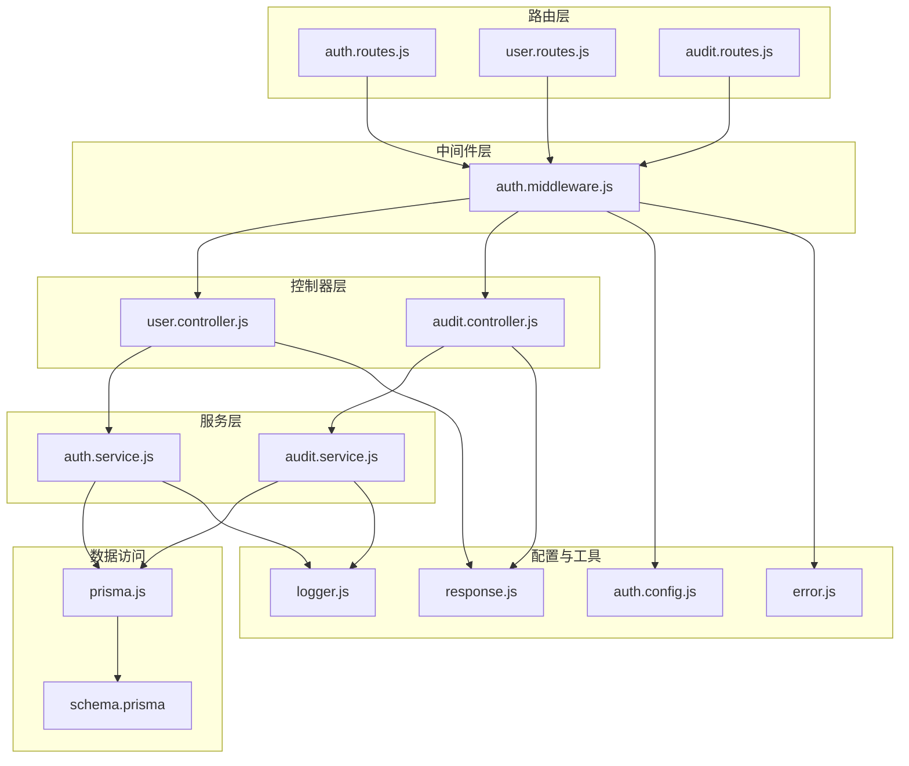
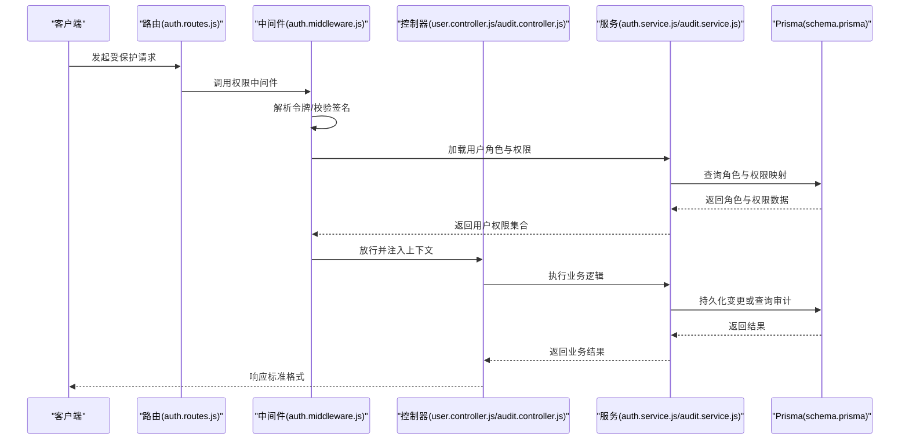
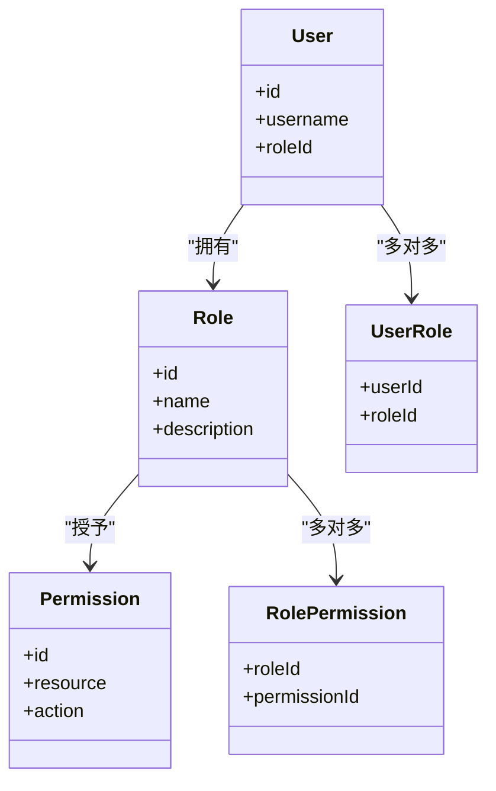
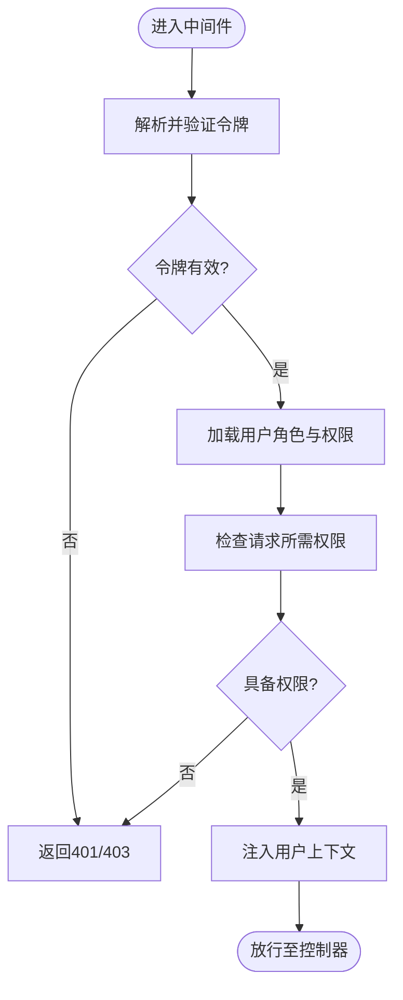
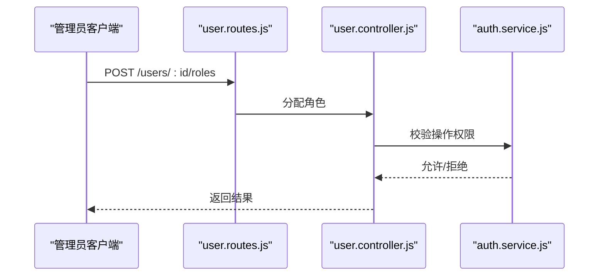
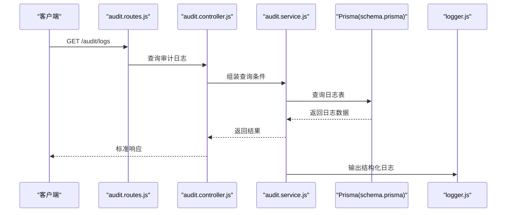
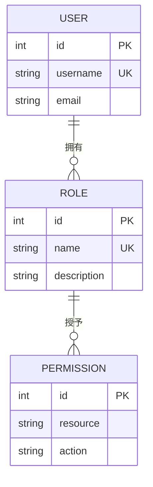
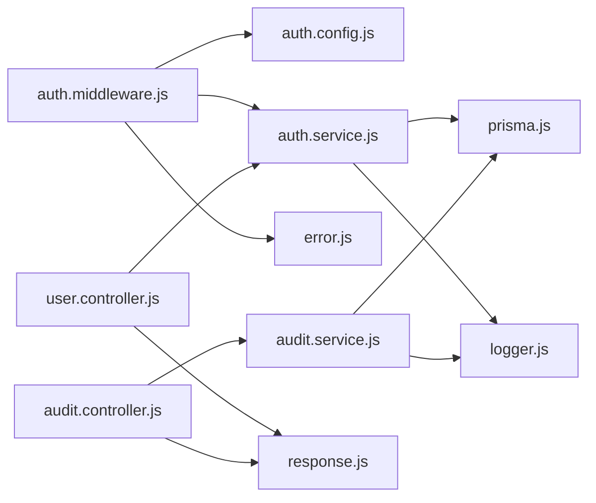

# 权限管理接口

<cite>
**本文档引用的文件**
- [auth.config.js](file://server/src/config/auth.config.js)
- [auth.middleware.js](file://server/src/middleware/auth.middleware.js)
- [auth.service.js](file://server/src/services/auth.service.js)
- [auth.routes.js](file://server/src/routes/auth.routes.js)
- [user.controller.js](file://server/src/controllers/user.controller.js)
- [audit.controller.js](file://server/src/controllers/audit.controller.js)
- [audit.service.js](file://server/src/services/audit.service.js)
- [audit.routes.js](file://server/src/routes/audit.routes.js)
- [logger.js](file://server/src/utils/logger.js)
- [response.js](file://server/src/utils/response.js)
- [error.js](file://server/src/utils/error.js)
- [user.routes.js](file://server/src/routes/user.routes.js)
- [user.controller.js](file://server/src/controllers/user.controller.js)
- [prisma.js](file://server/src/lib/prisma.js)
- [schema.prisma](file://server/prisma/schema.prisma)
- [seed.js](file://server/prisma/seed.js)
- [auth.routes.test.js](file://server/src/__tests__/integration/auth.routes.test.js)
- [auth.service.test.js](file://server/src/services/__tests__/auth.service.test.js)
- [auth.middleware.test.js](file://server/src/middleware/__tests__/auth.middleware.test.js)
</cite>

## 目录
1. [简介](#简介)
2. [项目结构](#项目结构)
3. [核心组件](#核心组件)
4. [架构总览](#架构总览)
5. [详细组件分析](#详细组件分析)
6. [依赖关系分析](#依赖关系分析)
7. [性能考虑](#性能考虑)
8. [故障排除指南](#故障排除指南)
9. [结论](#结论)
10. [附录](#附录)

## 简介
本文件面向权限管理接口，围绕基于角色的访问控制（RBAC）机制进行系统化说明。内容涵盖角色与权限模型、权限中间件的使用与验证流程、角色分配与权限检查、动态权限控制、权限配置最佳实践与安全建议，以及权限变更的日志记录与审计能力。文档同时提供可视化图示帮助理解整体架构与关键流程。

## 项目结构
后端采用模块化分层设计：路由层负责请求入口与参数校验，控制器层处理业务逻辑，服务层封装领域逻辑与数据访问，中间件层实现认证与授权，工具层提供通用能力（日志、响应、错误处理），数据库通过 Prisma 进行建模与迁移。

**图表来源**
- [auth.routes.js](file://server/src/routes/auth.routes.js)
- [user.routes.js](file://server/src/routes/user.routes.js)
- [audit.routes.js](file://server/src/routes/audit.routes.js)
- [auth.middleware.js](file://server/src/middleware/auth.middleware.js)
- [user.controller.js](file://server/src/controllers/user.controller.js)
- [audit.controller.js](file://server/src/controllers/audit.controller.js)
- [auth.service.js](file://server/src/services/auth.service.js)
- [audit.service.js](file://server/src/services/audit.service.js)
- [auth.config.js](file://server/src/config/auth.config.js)
- [logger.js](file://server/src/utils/logger.js)
- [response.js](file://server/src/utils/response.js)
- [error.js](file://server/src/utils/error.js)
- [prisma.js](file://server/src/lib/prisma.js)
- [schema.prisma](file://server/prisma/schema.prisma)

**章节来源**
- [auth.routes.js](file://server/src/routes/auth.routes.js)
- [auth.middleware.js](file://server/src/middleware/auth.middleware.js)
- [auth.service.js](file://server/src/services/auth.service.js)
- [user.controller.js](file://server/src/controllers/user.controller.js)
- [audit.controller.js](file://server/src/controllers/audit.controller.js)
- [audit.service.js](file://server/src/services/audit.service.js)
- [auth.config.js](file://server/src/config/auth.config.js)
- [logger.js](file://server/src/utils/logger.js)
- [response.js](file://server/src/utils/response.js)
- [error.js](file://server/src/utils/error.js)
- [prisma.js](file://server/src/lib/prisma.js)
- [schema.prisma](file://server/prisma/schema.prisma)

## 核心组件
- 认证与授权配置：定义认证策略、令牌签发与校验规则，以及默认角色与权限映射。
- 权限中间件：统一拦截请求，解析令牌、加载用户角色与权限，并执行权限判定。
- 用户控制器与服务：提供用户角色分配、权限查询、动态权限控制等接口与实现。
- 审计控制器与服务：记录权限变更事件，支持审计日志查询与导出。
- 数据模型与访问：通过 Prisma 定义用户、角色、权限、资源等实体及关联关系。
- 工具与日志：标准化响应格式、错误处理与操作日志输出。

**章节来源**
- [auth.config.js](file://server/src/config/auth.config.js)
- [auth.middleware.js](file://server/src/middleware/auth.middleware.js)
- [user.controller.js](file://server/src/controllers/user.controller.js)
- [audit.controller.js](file://server/src/controllers/audit.controller.js)
- [audit.service.js](file://server/src/services/audit.service.js)
- [prisma.js](file://server/src/lib/prisma.js)
- [schema.prisma](file://server/prisma/schema.prisma)

## 架构总览
下图展示了从客户端到数据库的完整权限控制链路，强调中间件在认证与授权中的核心作用。

**图表来源**
- [auth.routes.js](file://server/src/routes/auth.routes.js)
- [auth.middleware.js](file://server/src/middleware/auth.middleware.js)
- [user.controller.js](file://server/src/controllers/user.controller.js)
- [audit.controller.js](file://server/src/controllers/audit.controller.js)
- [auth.service.js](file://server/src/services/auth.service.js)
- [audit.service.js](file://server/src/services/audit.service.js)
- [schema.prisma](file://server/prisma/schema.prisma)

## 详细组件分析

### RBAC 角色与权限模型
- 角色类型：系统中存在“超级管理员”“管理员”等角色，不同角色拥有不同的权限集合。
- 权限粒度：权限以“资源+动作”的形式表达，例如“用户管理-读取”“课程管理-编辑”等。
- 动态权限：权限可按用户、组织单元或会话动态调整，无需重启服务。
- 角色继承与组合：可通过角色组合形成更复杂的权限集，减少重复配置。

**图表来源**
- [schema.prisma](file://server/prisma/schema.prisma)

**章节来源**
- [schema.prisma](file://server/prisma/schema.prisma)
- [seed.js](file://server/prisma/seed.js)

### 权限中间件使用与验证流程
- 请求拦截：所有受保护路由在进入控制器前必须通过中间件。
- 令牌解析：从请求头中提取令牌，验证签名与有效期。
- 角色加载：根据用户标识查询其角色与权限集合。
- 权限判定：比对当前请求所需权限与用户权限集合，允许或拒绝。
- 上下文注入：通过请求对象注入用户信息与权限列表，供控制器使用。

**图表来源**
- [auth.middleware.js](file://server/src/middleware/auth.middleware.js)
- [auth.service.js](file://server/src/services/auth.service.js)

**章节来源**
- [auth.middleware.js](file://server/src/middleware/auth.middleware.js)
- [auth.service.js](file://server/src/services/auth.service.js)

### 角色分配与权限检查
- 角色分配：管理员通过用户管理接口为用户绑定角色；支持批量分配与撤销。
- 权限检查：控制器在执行业务前调用服务层进行权限校验；失败时返回相应错误码。
- 动态权限控制：服务层根据用户角色与资源上下文动态计算可执行操作。

**图表来源**
- [user.routes.js](file://server/src/routes/user.routes.js)
- [user.controller.js](file://server/src/controllers/user.controller.js)
- [auth.service.js](file://server/src/services/auth.service.js)

**章节来源**
- [user.routes.js](file://server/src/routes/user.routes.js)
- [user.controller.js](file://server/src/controllers/user.controller.js)
- [auth.service.js](file://server/src/services/auth.service.js)

### 审计与日志
- 审计事件：记录关键权限变更（如角色分配、权限修改、登录登出）。
- 日志格式：统一使用日志工具输出结构化日志，便于检索与分析。
- 查询接口：提供审计日志查询与导出能力，支持时间范围、用户、操作类型筛选。

**图表来源**
- [audit.routes.js](file://server/src/routes/audit.routes.js)
- [audit.controller.js](file://server/src/controllers/audit.controller.js)
- [audit.service.js](file://server/src/services/audit.service.js)
- [logger.js](file://server/src/utils/logger.js)
- [schema.prisma](file://server/prisma/schema.prisma)

**章节来源**
- [audit.routes.js](file://server/src/routes/audit.routes.js)
- [audit.controller.js](file://server/src/controllers/audit.controller.js)
- [audit.service.js](file://server/src/services/audit.service.js)
- [logger.js](file://server/src/utils/logger.js)
- [schema.prisma](file://server/prisma/schema.prisma)

### 数据模型与持久化
- 用户与角色：用户属于一个角色，角色拥有多个权限。
- 权限与资源：权限与具体资源（如用户、课程、报表）绑定。
- 变更追踪：审计日志表记录每次权限相关操作的详情。

**图表来源**
- [schema.prisma](file://server/prisma/schema.prisma)

**章节来源**
- [schema.prisma](file://server/prisma/schema.prisma)

## 依赖关系分析
- 中间件依赖：权限中间件依赖认证配置、服务层与错误处理工具。
- 控制器依赖：控制器依赖对应服务与响应工具，确保返回格式一致。
- 服务层依赖：服务层依赖 Prisma 进行数据访问，并通过日志与错误工具增强可观测性。
- 配置与工具：认证配置集中管理策略；日志与响应工具贯穿各层。

**图表来源**
- [auth.middleware.js](file://server/src/middleware/auth.middleware.js)
- [auth.config.js](file://server/src/config/auth.config.js)
- [auth.service.js](file://server/src/services/auth.service.js)
- [user.controller.js](file://server/src/controllers/user.controller.js)
- [audit.controller.js](file://server/src/controllers/audit.controller.js)
- [audit.service.js](file://server/src/services/audit.service.js)
- [prisma.js](file://server/src/lib/prisma.js)
- [logger.js](file://server/src/utils/logger.js)
- [response.js](file://server/src/utils/response.js)
- [error.js](file://server/src/utils/error.js)

**章节来源**
- [auth.middleware.js](file://server/src/middleware/auth.middleware.js)
- [auth.config.js](file://server/src/config/auth.config.js)
- [auth.service.js](file://server/src/services/auth.service.js)
- [user.controller.js](file://server/src/controllers/user.controller.js)
- [audit.controller.js](file://server/src/controllers/audit.controller.js)
- [audit.service.js](file://server/src/services/audit.service.js)
- [prisma.js](file://server/src/lib/prisma.js)
- [logger.js](file://server/src/utils/logger.js)
- [response.js](file://server/src/utils/response.js)
- [error.js](file://server/src/utils/error.js)

## 性能考虑
- 缓存策略：对常用权限集合进行缓存，降低频繁查询数据库的开销。
- 索引优化：为用户、角色、权限相关的查询字段建立复合索引，提升审计与权限查询效率。
- 并发控制：在高并发场景下，确保权限判定与日志写入的原子性与一致性。
- 超时与重试：为外部依赖设置合理的超时与重试策略，避免阻塞请求线程。

## 故障排除指南
- 401 未认证：检查请求头是否包含有效令牌，确认令牌未过期且签名正确。
- 403 权限不足：核对用户角色与所需权限的映射关系，确认控制器已正确调用权限校验。
- 审计无记录：检查审计服务是否正常连接数据库，确认日志工具输出级别与目标。
- 错误处理：统一使用错误工具抛出与捕获异常，避免泄露敏感信息。

**章节来源**
- [error.js](file://server/src/utils/error.js)
- [auth.middleware.js](file://server/src/middleware/auth.middleware.js)
- [audit.service.js](file://server/src/services/audit.service.js)

## 结论
本权限管理接口以 RBAC 为核心，结合中间件统一鉴权、服务层权限校验与审计日志，构建了可扩展、可观测的权限体系。通过角色与权限模型、动态权限控制与完善的审计能力，能够满足复杂业务场景下的权限需求。建议在生产环境中配合缓存、索引与监控进一步优化性能与安全性。

## 附录

### API 接口清单（示例）
- 用户管理
  - 分配角色：POST /users/:id/roles
  - 查询用户权限：GET /users/:id/permissions
- 审计日志
  - 查询日志：GET /audit/logs
  - 导出日志：GET /audit/logs/export

**章节来源**
- [user.routes.js](file://server/src/routes/user.routes.js)
- [audit.routes.js](file://server/src/routes/audit.routes.js)

### 最佳实践与安全建议
- 强密码与多因素认证：强制用户设置高强度密码，启用二次验证。
- 最小权限原则：为角色分配最小必要权限，定期审查与清理。
- 传输加密：使用 HTTPS 保障令牌与数据在传输过程中的机密性与完整性。
- 定期审计：开启并定期审阅审计日志，及时发现异常行为。
- 输入校验与防注入：对所有输入进行严格校验，防止恶意构造数据绕过权限控制。

### 测试参考
- 单元测试：覆盖认证中间件、服务层权限校验与错误处理。
- 集成测试：模拟用户角色分配与权限检查的完整流程。

**章节来源**
- [auth.routes.test.js](file://server/src/__tests__/integration/auth.routes.test.js)
- [auth.service.test.js](file://server/src/services/__tests__/auth.service.test.js)
- [auth.middleware.test.js](file://server/src/middleware/__tests__/auth.middleware.test.js)