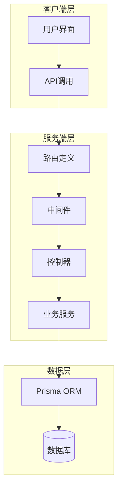
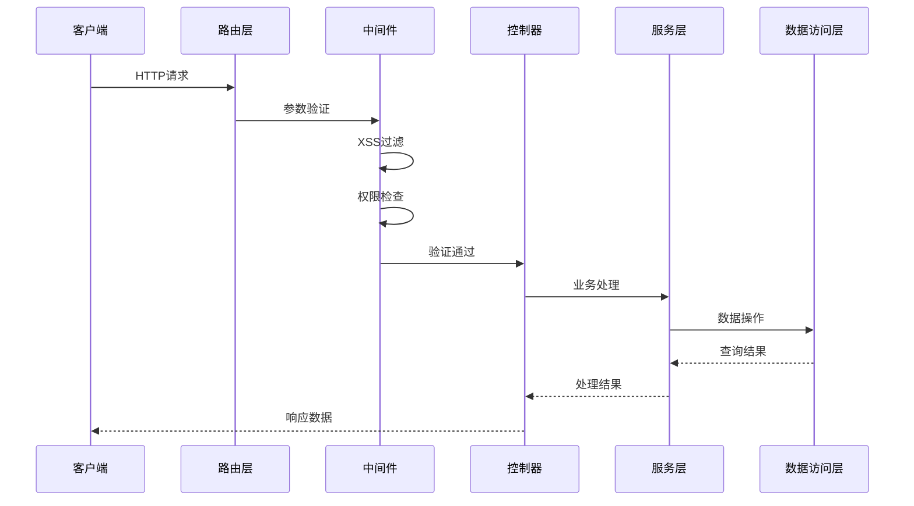
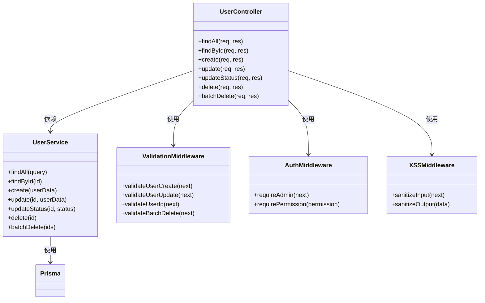
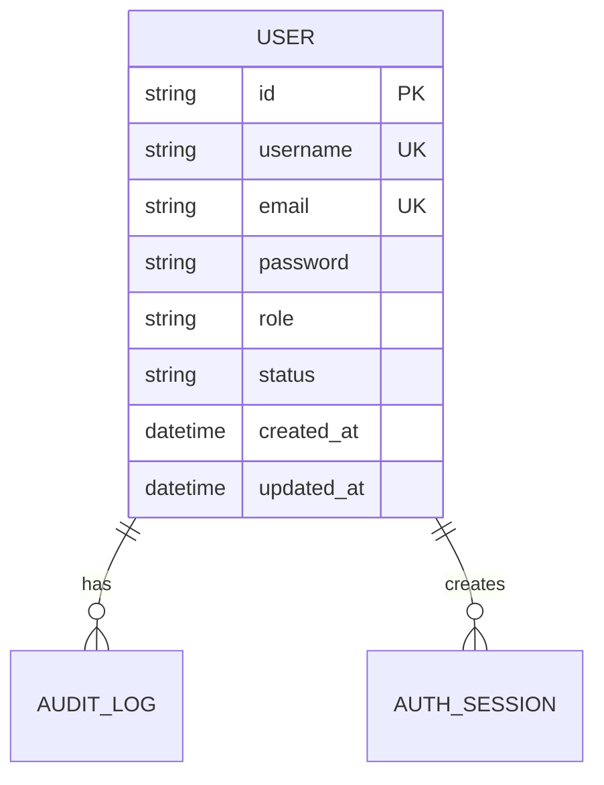

# 用户CRUD接口

<cite>
**本文档引用的文件**
- [server/src/controllers/user.controller.js](file://server/src/controllers/user.controller.js)
- [server/src/routes/user.routes.js](file://server/src/routes/user.routes.js)
- [server/src/services/user.service.js](file://server/src/services/user.service.js)
- [server/src/middleware/validation.js](file://server/src/middleware/validation.js)
- [server/src/middleware/xss.js](file://server/src/middleware/xss.js)
- [server/src/middleware/auth.middleware.js](file://server/src/middleware/auth.middleware.js)
- [server/src/middleware/pagination.js](file://server/src/middleware/pagination.js)
- [server/src/utils/sort.js](file://server/src/utils/sort.js)
- [server/src/utils/response.js](file://server/src/utils/response.js)
- [server/src/lib/prisma.js](file://server/src/lib/prisma.js)
- [server/src/constants/index.js](file://server/src/constants/index.js)
- [client/src/views/system/UserManagement.vue](file://client/src/views/system/UserManagement.vue)
- [client/src/api/teacher.js](file://client/src/api/teacher.js)
</cite>

## 目录
1. [简介](#简介)
2. [项目结构](#项目结构)
3. [核心组件](#核心组件)
4. [架构概览](#架构概览)
5. [详细组件分析](#详细组件分析)
6. [依赖关系分析](#依赖关系分析)
7. [性能考虑](#性能考虑)
8. [故障排除指南](#故障排除指南)
9. [结论](#结论)
10. [附录](#附录)

## 简介
本文件为用户CRUD操作接口的完整API文档，涵盖用户列表查询、用户创建、用户信息更新、用户状态管理、用户删除等核心功能。文档详细说明了分页查询、条件筛选、排序等高级查询能力，参数验证规则、数据格式要求、返回值结构，并提供了批量操作接口和错误处理机制。同时包含管理员权限验证和XSS防护措施的技术细节。

## 项目结构
用户管理模块采用典型的三层架构设计，包含路由层、控制器层、服务层和数据访问层：



**图表来源**
- [server/src/routes/user.routes.js](file://server/src/routes/user.routes.js)
- [server/src/controllers/user.controller.js](file://server/src/controllers/user.controller.js)
- [server/src/services/user.service.js](file://server/src/services/user.service.js)
- [server/src/lib/prisma.js](file://server/src/lib/prisma.js)

**章节来源**
- [server/src/routes/user.routes.js](file://server/src/routes/user.routes.js)
- [server/src/controllers/user.controller.js](file://server/src/controllers/user.controller.js)
- [server/src/services/user.service.js](file://server/src/services/user.service.js)

## 核心组件
用户管理模块由以下核心组件构成：

### 路由层 (Routes Layer)
负责HTTP请求的接收和转发，定义RESTful API端点和请求方法映射。

### 控制器层 (Controller Layer)
处理业务逻辑，执行参数验证，协调服务层完成具体操作。

### 服务层 (Service Layer)
封装具体的业务逻辑，包括数据查询、更新、删除等操作。

### 中间件层 (Middleware Layer)
提供认证授权、参数验证、XSS防护、分页处理等横切关注点。

**章节来源**
- [server/src/routes/user.routes.js](file://server/src/routes/user.routes.js)
- [server/src/controllers/user.controller.js](file://server/src/controllers/user.controller.js)
- [server/src/middleware/auth.middleware.js](file://server/src/middleware/auth.middleware.js)
- [server/src/middleware/validation.js](file://server/src/middleware/validation.js)

## 架构概览
用户管理系统的整体架构采用分层设计，确保关注点分离和代码可维护性：



**图表来源**
- [server/src/routes/user.routes.js](file://server/src/routes/user.routes.js)
- [server/src/middleware/validation.js](file://server/src/middleware/validation.js)
- [server/src/middleware/xss.js](file://server/src/middleware/xss.js)
- [server/src/middleware/auth.middleware.js](file://server/src/middleware/auth.middleware.js)
- [server/src/controllers/user.controller.js](file://server/src/controllers/user.controller.js)
- [server/src/services/user.service.js](file://server/src/services/user.service.js)

## 详细组件分析

### 用户路由定义
用户路由模块定义了完整的CRUD操作端点：

#### GET /api/users
用户列表查询接口，支持分页、筛选和排序功能。

**请求参数**
- page: 页码，整数类型，默认值为1
- limit: 每页条数，整数类型，默认值为10
- sortBy: 排序字段，字符串类型
- sortOrder: 排序顺序，枚举值：asc/desc
- keyword: 搜索关键词，字符串类型
- status: 用户状态，枚举值：active/inactive

**响应数据结构**
```javascript
{
  "code": 200,
  "message": "查询成功",
  "data": {
    "users": [
      {
        "id": "string",
        "username": "string",
        "email": "string",
        "status": "string",
        "createdAt": "datetime",
        "updatedAt": "datetime"
      }
    ],
    "pagination": {
      "page": 1,
      "limit": 10,
      "total": 100,
      "totalPages": 10
    }
  }
}
```

#### POST /api/users
用户创建接口，支持批量创建功能。

**请求体参数**
- username: 用户名，字符串类型，必填，长度3-20字符
- email: 邮箱地址，字符串类型，必填，有效邮箱格式
- password: 密码，字符串类型，必填，至少6字符
- role: 用户角色，枚举值：admin/user，默认值为user
- status: 用户状态，枚举值：active/inactive，默认值为active

**批量创建示例**
```javascript
[
  {
    "username": "john_doe",
    "email": "john@example.com",
    "password": "password123"
  },
  {
    "username": "jane_smith", 
    "email": "jane@example.com",
    "password": "password456"
  }
]
```

#### PUT /api/users/:id
用户信息更新接口。

**路径参数**
- id: 用户ID，UUID格式

**请求体参数**
- username: 用户名，字符串类型，长度3-20字符
- email: 邮箱地址，字符串类型，有效邮箱格式
- role: 用户角色，枚举值：admin/user
- status: 用户状态，枚举值：active/inactive

#### PUT /api/users/:id/status
用户状态管理接口。

**路径参数**
- id: 用户ID，UUID格式

**请求体参数**
- status: 新的状态值，枚举值：active/inactive

#### DELETE /api/users/:id
单个用户删除接口。

**路径参数**
- id: 用户ID，UUID格式

#### DELETE /api/users/batch
批量用户删除接口。

**请求体参数**
- ids: 用户ID数组，至少包含一个ID

**章节来源**
- [server/src/routes/user.routes.js](file://server/src/routes/user.routes.js)

### 用户控制器
控制器层负责处理HTTP请求和响应，执行业务逻辑协调：

#### 主要职责
- 接收和验证HTTP请求参数
- 调用服务层执行业务操作
- 处理异常情况并返回标准化响应
- 实现权限控制和安全检查

#### 错误处理机制
控制器实现了统一的错误处理流程，确保所有异常都被捕获并转换为标准的错误响应格式。

**章节来源**
- [server/src/controllers/user.controller.js](file://server/src/controllers/user.controller.js)

### 用户服务层
服务层封装了具体的业务逻辑和数据操作：

#### 核心功能
- 用户数据验证和清理
- 数据库操作和事务管理
- 业务规则检查和约束验证
- 结果集转换和格式化

#### 性能优化
- 使用数据库索引提高查询性能
- 实现分页查询避免大数据量影响
- 优化SQL查询语句减少数据库负载

**章节来源**
- [server/src/services/user.service.js](file://server/src/services/user.service.js)

### 中间件组件

#### 认证中间件
实现管理员权限验证，确保只有具备admin角色的用户才能执行敏感操作。

#### 参数验证中间件
提供全面的输入参数验证，包括：
- 必填字段检查
- 数据类型验证
- 格式验证（邮箱、密码强度等）
- 业务规则验证

#### XSS防护中间件
实施多层次的XSS防护措施：
- 输入数据净化
- 输出编码处理
- 内容安全策略(CSP)配置

#### 分页中间件
实现标准化的分页处理逻辑，支持自定义页码和每页大小。

**章节来源**
- [server/src/middleware/auth.middleware.js](file://server/src/middleware/auth.middleware.js)
- [server/src/middleware/validation.js](file://server/src/middleware/validation.js)
- [server/src/middleware/xss.js](file://server/src/middleware/xss.js)
- [server/src/middleware/pagination.js](file://server/src/middleware/pagination.js)

## 依赖关系分析



**图表来源**
- [server/src/controllers/user.controller.js](file://server/src/controllers/user.controller.js)
- [server/src/services/user.service.js](file://server/src/services/user.service.js)
- [server/src/middleware/validation.js](file://server/src/middleware/validation.js)
- [server/src/middleware/auth.middleware.js](file://server/src/middleware/auth.middleware.js)
- [server/src/middleware/xss.js](file://server/src/middleware/xss.js)

### 数据模型关系



**图表来源**
- [server/src/lib/prisma.js](file://server/src/lib/prisma.js)

**章节来源**
- [server/src/lib/prisma.js](file://server/src/lib/prisma.js)

## 性能考虑
用户管理接口在设计时充分考虑了性能优化：

### 数据库优化
- 使用复合索引提高查询性能
- 实现分页查询避免全表扫描
- 优化SQL查询语句减少数据库负载

### 缓存策略
- 实现查询结果缓存
- 使用Redis缓存热点数据
- 合理设置缓存过期时间

### 并发处理
- 实现乐观锁防止并发冲突
- 使用数据库事务保证数据一致性
- 限制批量操作的规模避免系统过载

## 故障排除指南

### 常见错误及解决方案

#### 参数验证失败
**错误类型**: 400 Bad Request
**可能原因**: 
- 必填字段缺失
- 数据格式不正确
- 业务规则违反

**解决方法**:
- 检查请求参数格式
- 验证数据完整性
- 参考API文档的参数规范

#### 权限不足
**错误类型**: 403 Forbidden  
**可能原因**:
- 非管理员用户尝试执行管理操作
- 用户权限级别不够

**解决方法**:
- 确认用户具有admin角色
- 检查用户权限配置

#### 数据库约束冲突
**错误类型**: 409 Conflict
**可能原因**:
- 用户名重复
- 邮箱重复
- 外键约束违反

**解决方法**:
- 修改唯一性字段
- 检查关联数据状态

#### 服务器内部错误
**错误类型**: 500 Internal Server Error
**可能原因**:
- 数据库连接失败
- 业务逻辑异常
- 系统资源不足

**解决方法**:
- 检查数据库连接
- 查看服务器日志
- 重启相关服务

**章节来源**
- [server/src/middleware/error.js](file://server/src/middleware/error.js)
- [server/src/utils/error.js](file://server/src/utils/error.js)

## 结论
用户CRUD接口模块采用现代化的分层架构设计，实现了完整的用户管理功能。系统具备完善的权限控制、数据验证、XSS防护和错误处理机制，能够满足生产环境的高可用性和安全性要求。通过合理的性能优化和扩展设计，该模块可以支持大规模用户管理和高并发访问场景。

## 附录

### API端点汇总
- GET /api/users - 获取用户列表
- POST /api/users - 创建用户
- GET /api/users/:id - 获取单个用户
- PUT /api/users/:id - 更新用户信息
- PUT /api/users/:id/status - 更新用户状态
- DELETE /api/users/:id - 删除用户
- DELETE /api/users/batch - 批量删除用户

### 参数验证规则
- 用户名：3-20字符，字母数字下划线
- 邮箱：标准邮箱格式
- 密码：至少6字符，建议8字符以上
- 角色：admin或user
- 状态：active或inactive

### 返回值格式
所有API响应遵循统一的JSON格式：
```javascript
{
  "code": number,
  "message": string,
  "data": any
}
```

### 安全措施
- JWT令牌认证
- CORS跨域安全配置
- SQL注入防护
- XSS攻击防护
- CSRF防护
- 速率限制