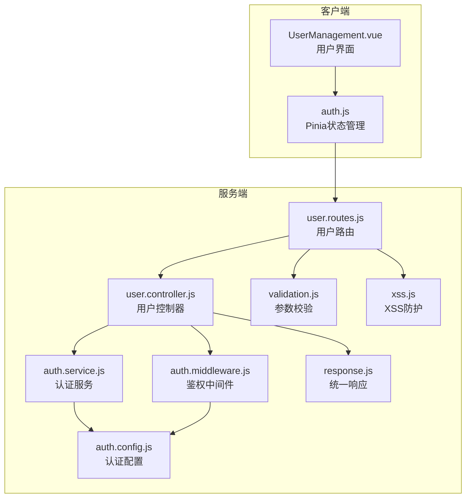
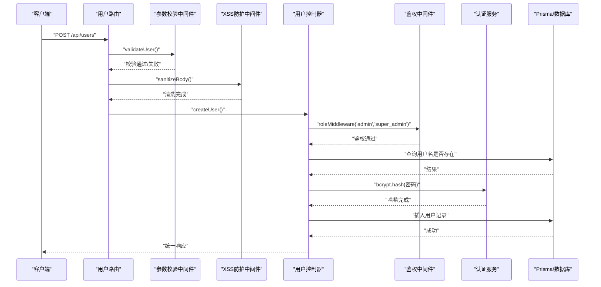
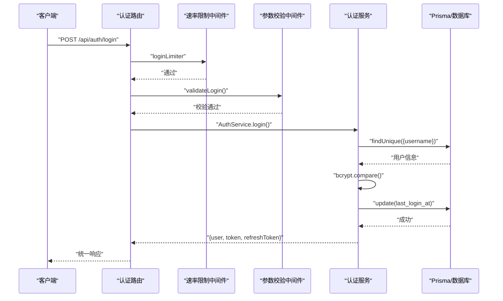
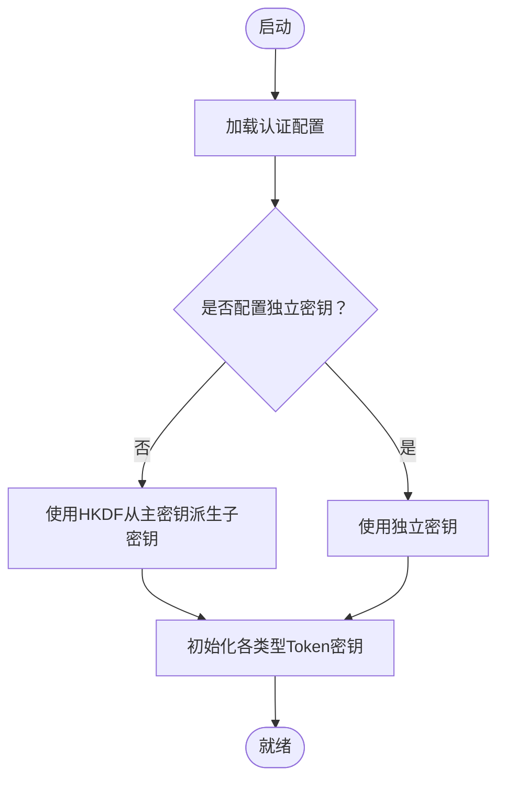
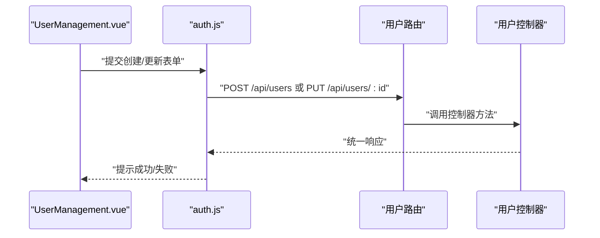
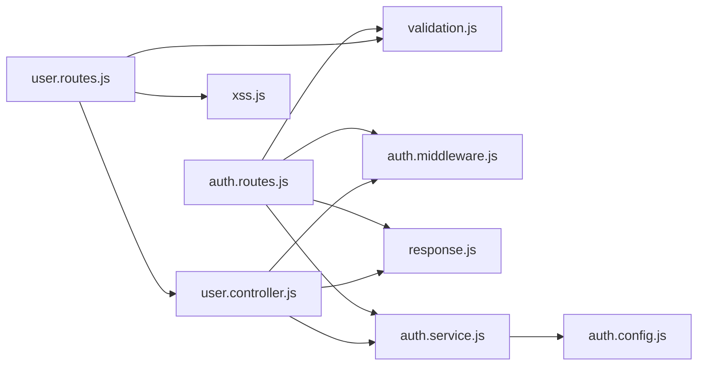

# 用户管理接口

<cite>
**本文档引用的文件**
- [server/src/controllers/user.controller.js](file://server/src/controllers/user.controller.js)
- [server/src/routes/user.routes.js](file://server/src/routes/user.routes.js)
- [server/src/services/auth.service.js](file://server/src/services/auth.service.js)
- [server/src/middleware/auth.middleware.js](file://server/src/middleware/auth.middleware.js)
- [server/src/config/auth.config.js](file://server/src/config/auth.config.js)
- [server/src/middleware/validation.js](file://server/src/middleware/validation.js)
- [server/src/utils/response.js](file://server/src/utils/response.js)
- [server/src/routes/auth.routes.js](file://server/src/routes/auth.routes.js)
- [client/src/views/system/UserManagement.vue](file://client/src/views/system/UserManagement.vue)
- [client/src/stores/auth.js](file://client/src/stores/auth.js)
- [server/src/middleware/xss.js](file://server/src/middleware/xss.js)
- [server/src/utils/error.js](file://server/src/utils/error.js)
</cite>

## 目录
1. [简介](#简介)
2. [项目结构](#项目结构)
3. [核心组件](#核心组件)
4. [架构总览](#架构总览)
5. [详细组件分析](#详细组件分析)
6. [依赖关系分析](#依赖关系分析)
7. [性能考虑](#性能考虑)
8. [故障排除指南](#故障排除指南)
9. [结论](#结论)
10. [附录](#附录)

## 简介
本文件为用户管理接口的完整API文档，覆盖用户注册、登录、权限管理、密码修改等核心功能，详细说明用户角色权限体系、JWT令牌机制、会话管理，以及用户信息查询、更新、删除等CRUD操作接口。同时包含用户状态管理、账户锁定、密码策略等相关接口说明，并提供批量用户操作、导入导出功能的接口说明。文档还总结了安全认证最佳实践与错误处理指南。

## 项目结构
后端采用Express + Prisma架构，前端基于Vue 3 + Element Plus。用户管理相关模块分布如下：
- 路由层：定义REST接口与中间件链路
- 控制器层：实现业务逻辑与数据库交互
- 服务层：封装认证、审计等横切关注点
- 中间件层：鉴权、参数校验、XSS防护、速率限制
- 配置层：JWT密钥、过期时间、加密轮数等
- 工具层：统一响应、错误类型、Excel导入导出等

**图表来源**
- [server/src/routes/user.routes.js:1-64](file://server/src/routes/user.routes.js#L1-L64)
- [server/src/controllers/user.controller.js:1-252](file://server/src/controllers/user.controller.js#L1-L252)
- [server/src/services/auth.service.js:1-199](file://server/src/services/auth.service.js#L1-L199)
- [server/src/middleware/auth.middleware.js:1-129](file://server/src/middleware/auth.middleware.js#L1-L129)
- [server/src/middleware/validation.js:1-590](file://server/src/middleware/validation.js#L1-L590)
- [server/src/middleware/xss.js:1-86](file://server/src/middleware/xss.js#L1-L86)
- [server/src/utils/response.js:1-21](file://server/src/utils/response.js#L1-L21)
- [server/src/config/auth.config.js:1-58](file://server/src/config/auth.config.js#L1-L58)

**章节来源**
- [server/src/routes/user.routes.js:1-64](file://server/src/routes/user.routes.js#L1-L64)
- [server/src/controllers/user.controller.js:1-252](file://server/src/controllers/user.controller.js#L1-L252)
- [server/src/services/auth.service.js:1-199](file://server/src/services/auth.service.js#L1-L199)
- [server/src/middleware/auth.middleware.js:1-129](file://server/src/middleware/auth.middleware.js#L1-L129)
- [server/src/middleware/validation.js:1-590](file://server/src/middleware/validation.js#L1-L590)
- [server/src/middleware/xss.js:1-86](file://server/src/middleware/xss.js#L1-L86)
- [server/src/utils/response.js:1-21](file://server/src/utils/response.js#L1-L21)
- [server/src/config/auth.config.js:1-58](file://server/src/config/auth.config.js#L1-L58)

## 核心组件
- 用户控制器：实现用户列表、创建、更新、状态变更、删除等CRUD接口，并集成审计日志与缓存失效。
- 用户路由：定义REST接口路径、鉴权中间件与参数校验链路。
- 认证服务：提供登录、刷新Token、生成下载Token、修改密码等功能。
- 鉴权中间件：解析Authorization头，校验Token有效性与用户状态，支持角色中间件。
- 参数校验：针对用户创建/更新、状态变更、登录、修改密码等场景的严格参数校验。
- XSS防护：对请求体与查询参数进行XSS清洗，跳过密码敏感字段。
- 统一响应：标准化成功/分页/失败响应格式。
- 认证配置：集中管理JWT密钥、过期时间、加密轮数等。

**章节来源**
- [server/src/controllers/user.controller.js:1-252](file://server/src/controllers/user.controller.js#L1-L252)
- [server/src/routes/user.routes.js:1-64](file://server/src/routes/user.routes.js#L1-L64)
- [server/src/services/auth.service.js:1-199](file://server/src/services/auth.service.js#L1-L199)
- [server/src/middleware/auth.middleware.js:1-129](file://server/src/middleware/auth.middleware.js#L1-L129)
- [server/src/middleware/validation.js:210-249](file://server/src/middleware/validation.js#L210-L249)
- [server/src/middleware/xss.js:1-86](file://server/src/middleware/xss.js#L1-L86)
- [server/src/utils/response.js:1-21](file://server/src/utils/response.js#L1-L21)
- [server/src/config/auth.config.js:1-58](file://server/src/config/auth.config.js#L1-L58)

## 架构总览
用户管理接口遵循“路由 -> 中间件 -> 控制器 -> 服务/数据库”的分层设计，结合鉴权中间件与参数校验中间件，形成安全可靠的请求处理链。

**图表来源**
- [server/src/routes/user.routes.js:26-30](file://server/src/routes/user.routes.js#L26-L30)
- [server/src/middleware/validation.js:210-228](file://server/src/middleware/validation.js#L210-L228)
- [server/src/middleware/xss.js:20-32](file://server/src/middleware/xss.js#L20-L32)
- [server/src/controllers/user.controller.js:43-92](file://server/src/controllers/user.controller.js#L43-L92)
- [server/src/middleware/auth.middleware.js:108-128](file://server/src/middleware/auth.middleware.js#L108-L128)

## 详细组件分析

### 用户管理接口规范
- 列表查询
  - 方法：GET
  - 路径：/api/users
  - 鉴权：admin, super_admin
  - 返回：用户列表（含用户名、姓名、邮箱、角色、状态、最近登录时间）
  - 响应：统一响应结构
- 创建用户
  - 方法：POST
  - 路径：/api/users
  - 鉴权：admin, super_admin
  - 参数校验：用户名、密码、邮箱、角色、真实姓名
  - XSS防护：对非敏感字段进行清洗
  - 结果：创建成功并写入审计日志
- 更新用户
  - 方法：PUT
  - 路径：/api/users/:id
  - 鉴权：admin, super_admin
  - 参数校验：邮箱、角色、真实姓名（可选）
  - 限制：禁止修改自身角色；禁止修改超级管理员角色
  - 结果：更新成功并写入审计日志，角色变更时清除认证缓存
- 更新用户状态
  - 方法：PUT
  - 路径：/api/users/:id/status
  - 鉴权：admin, super_admin
  - 参数校验：is_active（布尔）
  - 限制：禁止禁用自身；禁止操作超级管理员
  - 结果：状态变更并写入审计日志，清除认证缓存
- 删除用户
  - 方法：DELETE
  - 路径：/api/users/:id
  - 鉴权：admin, super_admin
  - 限制：禁止删除自身；禁止删除超级管理员
  - 结果：删除成功并写入审计日志，清除认证缓存

**章节来源**
- [server/src/routes/user.routes.js:20-61](file://server/src/routes/user.routes.js#L20-L61)
- [server/src/controllers/user.controller.js:12-38](file://server/src/controllers/user.controller.js#L12-L38)
- [server/src/controllers/user.controller.js:43-92](file://server/src/controllers/user.controller.js#L43-L92)
- [server/src/controllers/user.controller.js:97-157](file://server/src/controllers/user.controller.js#L97-L157)
- [server/src/controllers/user.controller.js:162-206](file://server/src/controllers/user.controller.js#L162-L206)
- [server/src/controllers/user.controller.js:211-251](file://server/src/controllers/user.controller.js#L211-L251)
- [server/src/middleware/validation.js:232-241](file://server/src/middleware/validation.js#L232-L241)
- [server/src/middleware/validation.js:244-249](file://server/src/middleware/validation.js#L244-L249)
- [server/src/middleware/auth.middleware.js:17-20](file://server/src/middleware/auth.middleware.js#L17-L20)

### 认证与会话管理
- 登录
  - 方法：POST
  - 路径：/api/auth/login
  - 速率限制：15分钟最多10次
  - 参数校验：用户名、密码长度
  - 流程：校验用户存在与激活状态，比对密码，签发Access Token与Refresh Token，记录审计日志
- 刷新Token
  - 方法：POST
  - 路径：/api/auth/refresh
  - 速率限制：15分钟最多30次
  - 参数校验：refresh_token
  - 流程：验证Refresh Token，查询用户状态，签发新Token
- 当前用户信息
  - 方法：GET
  - 路径：/api/auth/me
  - 鉴权：authMiddleware
  - 流程：返回当前用户信息
- 生成下载Token
  - 方法：POST
  - 路径：/api/auth/download-token
  - 鉴权：authMiddleware
  - 流程：签发短期下载Token（window.open等场景）
- 修改密码
  - 方法：PUT
  - 路径：/api/auth/password
  - 鉴权：authMiddleware
  - 速率限制：15分钟最多10次
  - 参数校验：old_password、new_password（长度与字符集要求）
  - 流程：校验原密码，哈希新密码，记录审计日志

**图表来源**
- [server/src/routes/auth.routes.js:59-72](file://server/src/routes/auth.routes.js#L59-L72)
- [server/src/services/auth.service.js:9-82](file://server/src/services/auth.service.js#L9-L82)
- [server/src/middleware/validation.js:94-102](file://server/src/middleware/validation.js#L94-L102)

**章节来源**
- [server/src/routes/auth.routes.js:1-181](file://server/src/routes/auth.routes.js#L1-L181)
- [server/src/services/auth.service.js:1-199](file://server/src/services/auth.service.js#L1-L199)
- [server/src/middleware/validation.js:94-116](file://server/src/middleware/validation.js#L94-L116)

### JWT令牌机制与密钥管理
- Access Token：短期有效，用于常规API访问
- Refresh Token：较长有效期，用于刷新Access Token
- 下载Token：极短期（如30秒），用于无需Authorization头的下载场景
- 密钥管理：支持独立配置JWT_SECRET、JWT_REFRESH_SECRET、JWT_DOWNLOAD_SECRET；若未配置，使用HKDF从主密钥派生子密钥
- 过期时间：可通过环境变量配置，建议生产环境使用独立密钥

**图表来源**
- [server/src/config/auth.config.js:27-47](file://server/src/config/auth.config.js#L27-L47)

**章节来源**
- [server/src/config/auth.config.js:1-58](file://server/src/config/auth.config.js#L1-L58)

### 角色权限体系
- 超级管理员（super_admin）：最高权限，可管理所有资源
- 管理员（admin）：可维护基础数据与培养方案，但不能配置系统设置
- 访客（viewer）：仅查询权限
- 权限控制要点：
  - 管理员只能创建/管理访客账号
  - 禁止修改超级管理员角色与状态
  - 禁止删除自身与超级管理员
  - 角色变更与状态变更后立即清除认证缓存，确保权限即时生效

**章节来源**
- [server/src/controllers/user.controller.js:51-57](file://server/src/controllers/user.controller.js#L51-L57)
- [server/src/controllers/user.controller.js:102-114](file://server/src/controllers/user.controller.js#L102-L114)
- [server/src/controllers/user.controller.js:176-178](file://server/src/controllers/user.controller.js#L176-L178)
- [server/src/controllers/user.controller.js:224-226](file://server/src/controllers/user.controller.js#L224-L226)
- [server/src/middleware/auth.middleware.js:17-20](file://server/src/middleware/auth.middleware.js#L17-L20)

### 安全认证最佳实践
- 强密码策略：新密码长度≥8，需包含大小写字母、数字与指定特殊字符
- 速率限制：登录、刷新、修改密码均有限流保护
- XSS防护：对请求体与查询参数进行清洗，跳过密码敏感字段
- Token安全：独立密钥、合理过期时间、下载Token极短期
- 审计日志：所有关键操作均记录审计日志，便于追踪

**章节来源**
- [server/src/middleware/validation.js:108-116](file://server/src/middleware/validation.js#L108-L116)
- [server/src/routes/auth.routes.js:14-57](file://server/src/routes/auth.routes.js#L14-L57)
- [server/src/middleware/xss.js:20-32](file://server/src/middleware/xss.js#L20-L32)
- [server/src/config/auth.config.js:27-37](file://server/src/config/auth.config.js#L27-L37)

### 错误处理与统一响应
- 统一响应格式：成功/失败/分页三类响应
- 错误类型：认证错误、权限错误、验证错误、资源不存在、冲突等
- 参数校验：422响应，返回错误详情数组
- 服务端错误：统一包装为AppError，保留操作性标记

**章节来源**
- [server/src/utils/response.js:1-21](file://server/src/utils/response.js#L1-L21)
- [server/src/utils/error.js:1-58](file://server/src/utils/error.js#L1-L58)
- [server/src/middleware/validation.js:7-35](file://server/src/middleware/validation.js#L7-L35)

### 前端集成与使用示例
- 用户管理界面：支持创建、编辑、启用/禁用、删除用户，管理员可见提示
- 状态管理：Pinia Store负责登录态、Token刷新、用户信息拉取
- 请求封装：统一拦截器处理Token注入与错误处理

**图表来源**
- [client/src/views/system/UserManagement.vue:233-277](file://client/src/views/system/UserManagement.vue#L233-L277)
- [client/src/stores/auth.js:48-89](file://client/src/stores/auth.js#L48-L89)
- [server/src/routes/user.routes.js:26-43](file://server/src/routes/user.routes.js#L26-L43)
- [server/src/controllers/user.controller.js:43-157](file://server/src/controllers/user.controller.js#L43-L157)

**章节来源**
- [client/src/views/system/UserManagement.vue:1-362](file://client/src/views/system/UserManagement.vue#L1-L362)
- [client/src/stores/auth.js:1-222](file://client/src/stores/auth.js#L1-L222)

## 依赖关系分析

**图表来源**
- [server/src/routes/user.routes.js:1-64](file://server/src/routes/user.routes.js#L1-L64)
- [server/src/controllers/user.controller.js:1-252](file://server/src/controllers/user.controller.js#L1-L252)
- [server/src/services/auth.service.js:1-199](file://server/src/services/auth.service.js#L1-L199)
- [server/src/middleware/auth.middleware.js:1-129](file://server/src/middleware/auth.middleware.js#L1-L129)
- [server/src/middleware/validation.js:1-590](file://server/src/middleware/validation.js#L1-L590)
- [server/src/middleware/xss.js:1-86](file://server/src/middleware/xss.js#L1-L86)
- [server/src/utils/response.js:1-21](file://server/src/utils/response.js#L1-L21)
- [server/src/config/auth.config.js:1-58](file://server/src/config/auth.config.js#L1-L58)
- [server/src/routes/auth.routes.js:1-181](file://server/src/routes/auth.routes.js#L1-L181)

**章节来源**
- [server/src/routes/user.routes.js:1-64](file://server/src/routes/user.routes.js#L1-L64)
- [server/src/controllers/user.controller.js:1-252](file://server/src/controllers/user.controller.js#L1-L252)
- [server/src/services/auth.service.js:1-199](file://server/src/services/auth.service.js#L1-L199)
- [server/src/middleware/auth.middleware.js:1-129](file://server/src/middleware/auth.middleware.js#L1-L129)
- [server/src/middleware/validation.js:1-590](file://server/src/middleware/validation.js#L1-L590)
- [server/src/middleware/xss.js:1-86](file://server/src/middleware/xss.js#L1-L86)
- [server/src/utils/response.js:1-21](file://server/src/utils/response.js#L1-L21)
- [server/src/config/auth.config.js:1-58](file://server/src/config/auth.config.js#L1-L58)
- [server/src/routes/auth.routes.js:1-181](file://server/src/routes/auth.routes.js#L1-L181)

## 性能考虑
- 用户状态缓存：短期Map缓存（TTL 30秒），减少重复查询；状态变更时主动失效，避免陈旧数据
- 分页与排序：用户列表按创建时间倒序，建议配合分页参数使用
- 速率限制：登录、刷新、修改密码等接口均有限流，防止暴力破解与滥用
- Token过期：Access Token短期有效，Refresh Token较长，平衡安全性与用户体验

[本节为通用性能建议，不直接分析具体文件]

## 故障排除指南
- 401 未授权
  - 可能原因：缺少Token、Token无效或已过期、用户被禁用
  - 处理建议：重新登录获取新Token，检查用户状态
- 403 权限不足
  - 可能原因：角色不满足接口要求（如管理员只能管理访客）
  - 处理建议：联系超级管理员提升权限或调整操作范围
- 422 参数验证失败
  - 可能原因：用户名/密码长度不符、邮箱格式错误、角色非法、状态非布尔值
  - 处理建议：根据返回的details数组逐项修正
- 409 资源冲突
  - 可能原因：用户名重复
  - 处理建议：更换用户名后重试
- 5xx 服务器错误
  - 可能原因：数据库异常、密钥配置问题
  - 处理建议：检查日志与环境变量配置，必要时重启服务

**章节来源**
- [server/src/utils/error.js:14-57](file://server/src/utils/error.js#L14-L57)
- [server/src/middleware/validation.js:7-35](file://server/src/middleware/validation.js#L7-L35)
- [server/src/middleware/auth.middleware.js:74-105](file://server/src/middleware/auth.middleware.js#L74-L105)

## 结论
本用户管理接口通过严格的参数校验、XSS防护、速率限制与多层鉴权，构建了安全可靠的用户管理体系。配合JWT令牌机制与审计日志，实现了完善的用户生命周期管理与操作追踪。建议在生产环境中配置独立密钥、合理设置过期时间，并持续监控审计日志与错误指标。

## 附录

### API一览表
- 用户管理
  - GET /api/users：获取用户列表
  - POST /api/users：创建用户
  - PUT /api/users/:id：更新用户
  - PUT /api/users/:id/status：更新用户状态
  - DELETE /api/users/:id：删除用户
- 认证与会话
  - POST /api/auth/login：用户登录
  - POST /api/auth/refresh：刷新Token
  - POST /api/auth/logout：退出登录
  - GET /api/auth/me：获取当前用户信息
  - POST /api/auth/download-token：生成下载Token
  - PUT /api/auth/password：修改密码

**章节来源**
- [server/src/routes/user.routes.js:20-61](file://server/src/routes/user.routes.js#L20-L61)
- [server/src/routes/auth.routes.js:59-178](file://server/src/routes/auth.routes.js#L59-L178)