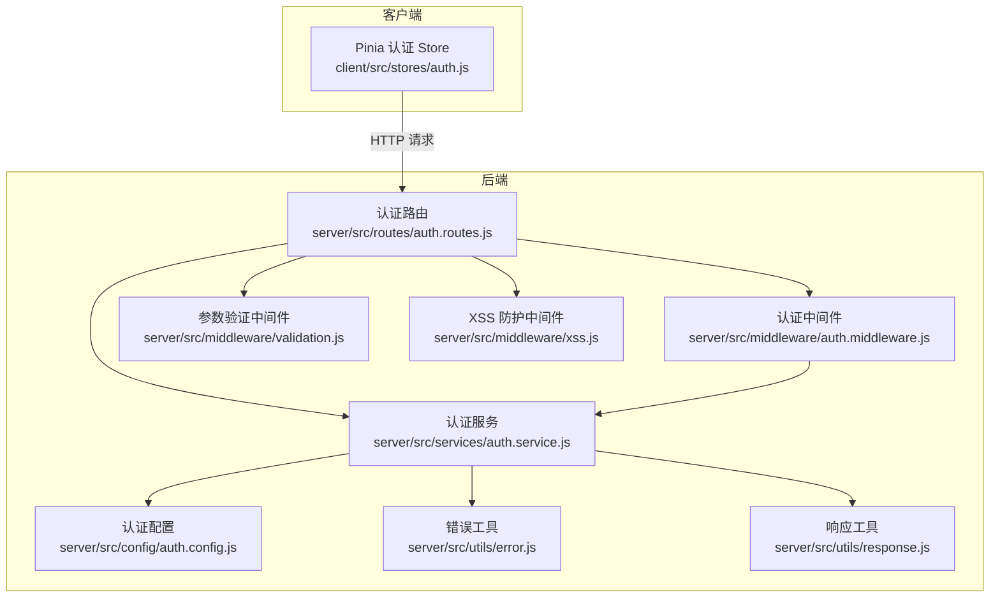
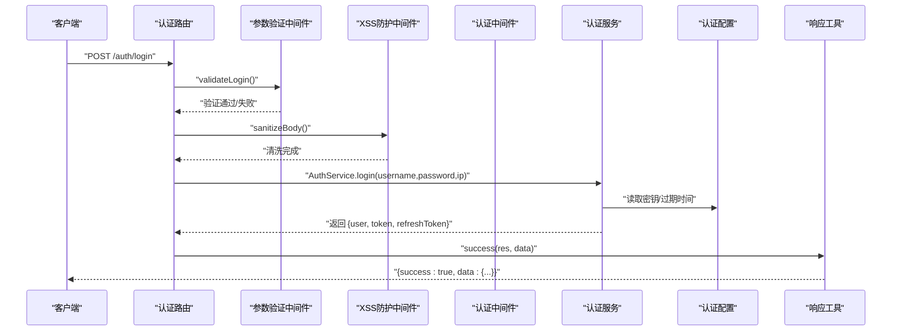
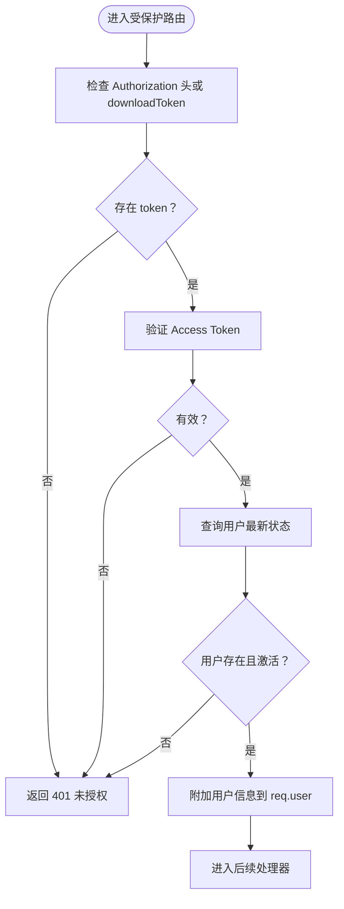
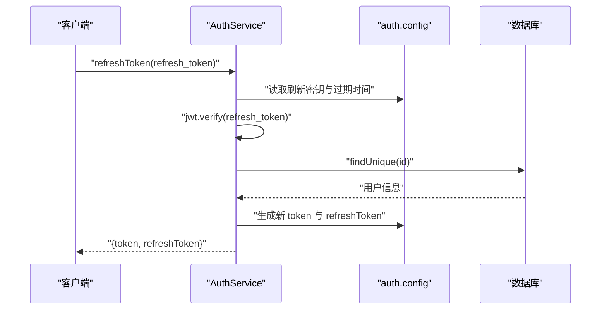
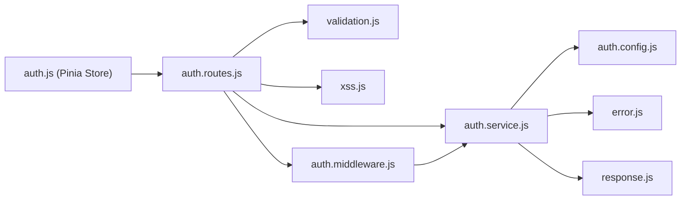

# 认证接口

<cite>
**本文引用的文件**
- [server/src/routes/auth.routes.js](file://server/src/routes/auth.routes.js)
- [server/src/services/auth.service.js](file://server/src/services/auth.service.js)
- [server/src/middleware/auth.middleware.js](file://server/src/middleware/auth.middleware.js)
- [server/src/config/auth.config.js](file://server/src/config/auth.config.js)
- [server/src/middleware/validation.js](file://server/src/middleware/validation.js)
- [server/src/middleware/xss.js](file://server/src/middleware/xss.js)
- [server/src/utils/error.js](file://server/src/utils/error.js)
- [server/src/utils/response.js](file://server/src/utils/response.js)
- [client/src/stores/auth.js](file://client/src/stores/auth.js)
- [server/src/__tests__/integration/auth.routes.test.js](file://server/src/__tests__/integration/auth.routes.test.js)
</cite>

## 目录
1. [简介](#简介)
2. [项目结构](#项目结构)
3. [核心组件](#核心组件)
4. [架构总览](#架构总览)
5. [详细组件分析](#详细组件分析)
6. [依赖关系分析](#依赖关系分析)
7. [性能考虑](#性能考虑)
8. [故障排查指南](#故障排查指南)
9. [结论](#结论)
10. [附录](#附录)

## 简介
本文件为用户认证接口的权威技术文档，覆盖登录、登出、密码修改、令牌刷新、个人信息查询以及下载令牌生成等接口。文档详细说明 JWT 令牌生成、验证与刷新机制，阐述速率限制、XSS 防护、输入验证与错误处理等安全措施，并提供认证中间件的使用方法与权限控制策略。同时给出请求/响应示例与常见错误码说明，帮助前后端协同实现安全可靠的认证体系。

## 项目结构
认证相关代码主要分布在后端服务的路由、控制器、服务层与中间件层，前端通过 Pinia Store 统一管理认证状态与令牌轮转。

图表来源
- [server/src/routes/auth.routes.js:1-181](file://server/src/routes/auth.routes.js#L1-L181)
- [server/src/middleware/auth.middleware.js:1-129](file://server/src/middleware/auth.middleware.js#L1-L129)
- [server/src/middleware/validation.js:1-590](file://server/src/middleware/validation.js#L1-L590)
- [server/src/middleware/xss.js:1-86](file://server/src/middleware/xss.js#L1-L86)
- [server/src/services/auth.service.js:1-199](file://server/src/services/auth.service.js#L1-L199)
- [server/src/config/auth.config.js:1-58](file://server/src/config/auth.config.js#L1-L58)
- [server/src/utils/error.js:1-58](file://server/src/utils/error.js#L1-L58)
- [server/src/utils/response.js:1-21](file://server/src/utils/response.js#L1-L21)
- [client/src/stores/auth.js:1-222](file://client/src/stores/auth.js#L1-L222)

章节来源
- [server/src/routes/auth.routes.js:1-181](file://server/src/routes/auth.routes.js#L1-L181)
- [server/src/middleware/auth.middleware.js:1-129](file://server/src/middleware/auth.middleware.js#L1-L129)
- [server/src/middleware/validation.js:1-590](file://server/src/middleware/validation.js#L1-L590)
- [server/src/middleware/xss.js:1-86](file://server/src/middleware/xss.js#L1-L86)
- [server/src/services/auth.service.js:1-199](file://server/src/services/auth.service.js#L1-L199)
- [server/src/config/auth.config.js:1-58](file://server/src/config/auth.config.js#L1-L58)
- [server/src/utils/error.js:1-58](file://server/src/utils/error.js#L1-L58)
- [server/src/utils/response.js:1-21](file://server/src/utils/response.js#L1-L21)
- [client/src/stores/auth.js:1-222](file://client/src/stores/auth.js#L1-L222)

## 核心组件
- 认证路由：提供 /auth/login、/auth/refresh、/auth/logout、/auth/me、/auth/download-token、/auth/password 等端点，内置速率限制与参数校验。
- 认证服务：负责用户登录、刷新令牌、生成/验证各类 JWT、修改密码与审计日志记录。
- 认证中间件：解析 Authorization 头或下载令牌，校验 JWT 有效性与用户状态，支持角色中间件。
- 配置模块：集中管理 JWT 密钥、过期时间与 bcrypt 迭代次数，支持独立密钥与 HKDF 派生。
- 输入验证与 XSS：统一的 express-validator 规则与 xss 清洗，保护敏感字段不被清洗。
- 响应与错误：统一的成功/分页/失败响应格式与业务错误类型。
- 前端 Store：封装登录、登出、令牌刷新、用户信息拉取与本地持久化。

章节来源
- [server/src/routes/auth.routes.js:59-181](file://server/src/routes/auth.routes.js#L59-L181)
- [server/src/services/auth.service.js:8-199](file://server/src/services/auth.service.js#L8-L199)
- [server/src/middleware/auth.middleware.js:40-129](file://server/src/middleware/auth.middleware.js#L40-L129)
- [server/src/config/auth.config.js:49-58](file://server/src/config/auth.config.js#L49-L58)
- [server/src/middleware/validation.js:95-116](file://server/src/middleware/validation.js#L95-L116)
- [server/src/middleware/xss.js:20-32](file://server/src/middleware/xss.js#L20-L32)
- [server/src/utils/response.js:1-21](file://server/src/utils/response.js#L1-L21)
- [server/src/utils/error.js:5-58](file://server/src/utils/error.js#L5-L58)
- [client/src/stores/auth.js:48-221](file://client/src/stores/auth.js#L48-L221)

## 架构总览
认证流程涉及客户端 Store、路由层、中间件层与服务层的协作，形成“请求-校验-鉴权-业务处理-响应”的闭环。

图表来源
- [server/src/routes/auth.routes.js:59-72](file://server/src/routes/auth.routes.js#L59-L72)
- [server/src/middleware/validation.js:95-102](file://server/src/middleware/validation.js#L95-L102)
- [server/src/middleware/xss.js:20-32](file://server/src/middleware/xss.js#L20-L32)
- [server/src/services/auth.service.js:9-82](file://server/src/services/auth.service.js#L9-L82)
- [server/src/config/auth.config.js:49-58](file://server/src/config/auth.config.js#L49-L58)
- [server/src/utils/response.js:1-3](file://server/src/utils/response.js#L1-L3)

## 详细组件分析

### 登录接口
- 路径：POST /api/auth/login
- 速率限制：基于 IP 的 15 分钟内最多 10 次尝试
- 参数校验：用户名长度、密码长度与字符集要求
- XSS 清洗：对请求体进行清洗（密码字段除外）
- 业务逻辑：
  - 校验用户是否存在、密码正确、账号处于激活状态
  - 生成 Access Token 与 Refresh Token，并更新最近登录时间
  - 记录审计日志
- 返回：包含 user、token、refreshToken 的成功响应

请求示例
- 方法：POST
- 路径：/api/auth/login
- 请求头：Content-Type: application/json
- 请求体：
  - username: 字符串，必填
  - password: 字符串，必填

响应示例
- 成功：{
  - success: true,
  - message: "登录成功",
  - data: {
    - user: { id, username, role, real_name, email },
    - token: "JWT Access Token",
    - refreshToken: "JWT Refresh Token"
  }
}

常见错误
- 401 认证错误：用户名或密码错误；账号已被禁用
- 422 参数验证错误：用户名/密码长度或格式不满足要求

章节来源
- [server/src/routes/auth.routes.js:59-72](file://server/src/routes/auth.routes.js#L59-L72)
- [server/src/middleware/validation.js:95-102](file://server/src/middleware/validation.js#L95-L102)
- [server/src/middleware/xss.js:20-32](file://server/src/middleware/xss.js#L20-L32)
- [server/src/services/auth.service.js:9-82](file://server/src/services/auth.service.js#L9-L82)
- [server/src/utils/error.js:35-39](file://server/src/utils/error.js#L35-L39)

### 刷新令牌接口
- 路径：POST /api/auth/refresh
- 速率限制：15 分钟内最多 30 次
- 参数校验：必须提供 refresh_token
- 业务逻辑：
  - 校验 refresh_token 类型与有效性
  - 查询用户状态（存在且激活）
  - 生成新的 Access Token 与 Refresh Token
- 返回：新的 token 对

请求示例
- 方法：POST
- 路径：/api/auth/refresh
- 请求体：
  - refresh_token: 字符串，必填

响应示例
- 成功：{
  - success: true,
  - data: { token, refreshToken }
}

常见错误
- 401 认证错误：refresh_token 已过期或无效；用户不存在或已被禁用
- 422 参数验证错误：缺少 refresh_token

章节来源
- [server/src/routes/auth.routes.js:74-87](file://server/src/routes/auth.routes.js#L74-L87)
- [server/src/services/auth.service.js:84-108](file://server/src/services/auth.service.js#L84-L108)
- [server/src/utils/error.js:35-39](file://server/src/utils/error.js#L35-L39)

### 登出接口
- 路径：POST /api/auth/logout
- 速率限制：15 分钟内最多 30 次
- 业务逻辑：
  - 解析 Authorization 头中的 Access Token
  - 即便无 token 也返回成功（不强制认证）
  - 记录审计日志（若存在 token）
- 返回：登出成功消息

请求示例
- 方法：POST
- 路径：/api/auth/logout
- 请求头：Authorization: Bearer <token>

响应示例
- 成功：{
  - success: true,
  - message: "登出成功"
}

常见错误
- 无：该接口不抛出认证错误

章节来源
- [server/src/routes/auth.routes.js:89-110](file://server/src/routes/auth.routes.js#L89-L110)
- [server/src/services/auth.service.js:133-139](file://server/src/services/auth.service.js#L133-L139)

### 当前用户信息接口
- 路径：GET /api/auth/me
- 保护：需要认证中间件
- 业务逻辑：
  - 通过认证中间件解析 token 并校验用户状态
  - 查询用户基本信息并返回
- 返回：用户信息对象

请求示例
- 方法：GET
- 路径：/api/auth/me
- 请求头：Authorization: Bearer <token>

响应示例
- 成功：{
  - success: true,
  - data: { id, username, role, real_name, email, last_login_at, created_at }
}

常见错误
- 401 未授权：缺少或无效 token；用户不存在或已被禁用

章节来源
- [server/src/routes/auth.routes.js:112-131](file://server/src/routes/auth.routes.js#L112-L131)
- [server/src/middleware/auth.middleware.js:40-106](file://server/src/middleware/auth.middleware.js#L40-L106)

### 下载令牌接口
- 路径：POST /api/auth/download-token
- 保护：需要认证中间件
- 业务逻辑：
  - 生成短期下载令牌（默认 30 秒），用于 window.open 等无法设置 Authorization 头的场景
  - 记录审计日志
- 返回：downloadToken

请求示例
- 方法：POST
- 路径：/api/auth/download-token
- 请求头：Authorization: Bearer <token>

响应示例
- 成功：{
  - success: true,
  - data: { downloadToken }
}

常见错误
- 401 未授权：缺少或无效 token；用户不存在或已被禁用

章节来源
- [server/src/routes/auth.routes.js:134-152](file://server/src/routes/auth.routes.js#L134-L152)
- [server/src/services/auth.service.js:141-155](file://server/src/services/auth.service.js#L141-L155)

### 修改密码接口
- 路径：PUT /api/auth/password
- 保护：需要认证中间件
- 速率限制：15 分钟内最多 10 次
- 参数校验：old_password 与 new_password 的长度与复杂度要求
- XSS 清洗：对请求体进行清洗（密码字段除外）
- 业务逻辑：
  - 校验旧密码正确性
  - 使用 bcrypt 重新哈希新密码并更新
  - 记录审计日志
- 返回：密码修改成功消息

请求示例
- 方法：PUT
- 路径：/api/auth/password
- 请求头：Authorization: Bearer <token>
- 请求体：
  - old_password: 字符串，必填
  - new_password: 字符串，必填（长度≥8，包含大小写字母、数字与指定特殊字符）

响应示例
- 成功：{
  - success: true,
  - message: "密码修改成功"
}

常见错误
- 401 认证错误：原密码错误
- 422 参数验证错误：old_password/new_password 缺失或格式不满足要求

章节来源
- [server/src/routes/auth.routes.js:154-178](file://server/src/routes/auth.routes.js#L154-L178)
- [server/src/middleware/validation.js:108-116](file://server/src/middleware/validation.js#L108-L116)
- [server/src/middleware/xss.js:20-32](file://server/src/middleware/xss.js#L20-L32)
- [server/src/services/auth.service.js:157-197](file://server/src/services/auth.service.js#L157-L197)
- [server/src/utils/error.js:35-39](file://server/src/utils/error.js#L35-L39)

### 认证中间件与权限控制
- 认证中间件：
  - 支持从 Authorization 头或查询参数 downloadToken 获取令牌
  - 校验 Access Token 有效性与用户状态（激活）
  - 通过数据库查询最新角色，避免旧 token 角色过期
- 角色中间件：
  - 通过 roleMiddleware(...roles) 限定可访问的用户角色
- 用户状态缓存：
  - 短期缓存用户角色与激活状态（TTL 30s），并提供主动失效接口

图表来源
- [server/src/middleware/auth.middleware.js:40-106](file://server/src/middleware/auth.middleware.js#L40-L106)

章节来源
- [server/src/middleware/auth.middleware.js:40-129](file://server/src/middleware/auth.middleware.js#L40-L129)

### JWT 令牌生成、验证与刷新机制
- 密钥与过期时间：
  - Access Token 密钥：JWT_SECRET
  - Refresh Token 密钥：JWT_REFRESH_SECRET（未配置时使用 HKDF 派生）
  - Download Token 密钥：JWT_DOWNLOAD_SECRET（未配置时使用 HKDF 派生）
  - Access Token 过期时间：JWT_EXPIRES_IN（默认 15 分钟）
  - Refresh Token 过期时间：JWT_REFRESH_EXPIRES_IN（默认 7 天）
  - Download Token 过期时间：JWT_DOWNLOAD_EXPIRES_IN（默认 30 秒）
- 生成与验证：
  - generateToken(user)：签发 Access Token
  - generateRefreshToken(user)：签发 Refresh Token
  - verifyToken(token)：验证 Access Token
  - generateDownloadToken(user)/verifyDownloadToken(token)：下载令牌签发与验证
- 刷新流程：
  - 使用 Refresh Token 申请新的 Access Token 与 Refresh Token
  - 校验类型为 refresh，用户存在且激活

图表来源
- [server/src/services/auth.service.js:84-108](file://server/src/services/auth.service.js#L84-L108)
- [server/src/config/auth.config.js:49-58](file://server/src/config/auth.config.js#L49-L58)

章节来源
- [server/src/services/auth.service.js:110-155](file://server/src/services/auth.service.js#L110-L155)
- [server/src/config/auth.config.js:49-58](file://server/src/config/auth.config.js#L49-L58)

### 安全措施
- 速率限制：针对登录、刷新、登出、修改密码分别设置不同阈值，降低暴力破解与滥用风险。
- XSS 防护：对请求体与查询参数进行清洗，跳过密码等敏感字段，避免篡改用户输入。
- 输入验证：统一的 express-validator 规则，返回结构化的 422 错误。
- 错误处理：自定义错误类型（认证、权限、验证等），便于前端识别与提示。
- 审计日志：登录、登出、修改密码、生成下载令牌等关键动作均记录审计日志。

章节来源
- [server/src/routes/auth.routes.js:14-57](file://server/src/routes/auth.routes.js#L14-L57)
- [server/src/middleware/validation.js:7-35](file://server/src/middleware/validation.js#L7-L35)
- [server/src/middleware/xss.js:20-86](file://server/src/middleware/xss.js#L20-L86)
- [server/src/utils/error.js:5-58](file://server/src/utils/error.js#L5-L58)

### 前端集成要点
- 登录：调用 /auth/login，保存 token 与 refreshToken，并持久化用户信息。
- 令牌刷新：当 Access Token 过期时，使用 /auth/refresh 刷新，必要时同步更新 refreshToken。
- 用户信息：首次进入或刷新后调用 /auth/me 拉取最新用户信息。
- 登出：调用 /auth/logout，清理本地状态与缓存。
- 下载令牌：在无法设置 Authorization 头的场景使用 /auth/download-token 生成短期令牌。

章节来源
- [client/src/stores/auth.js:48-221](file://client/src/stores/auth.js#L48-L221)

## 依赖关系分析

图表来源
- [server/src/routes/auth.routes.js:1-11](file://server/src/routes/auth.routes.js#L1-L11)
- [server/src/services/auth.service.js:1-6](file://server/src/services/auth.service.js#L1-L6)
- [server/src/middleware/auth.middleware.js:1-3](file://server/src/middleware/auth.middleware.js#L1-L3)
- [server/src/config/auth.config.js:1-6](file://server/src/config/auth.config.js#L1-L6)
- [server/src/utils/error.js:1-6](file://server/src/utils/error.js#L1-L6)
- [server/src/utils/response.js:1-3](file://server/src/utils/response.js#L1-L3)
- [client/src/stores/auth.js:1-7](file://client/src/stores/auth.js#L1-L7)

章节来源
- [server/src/routes/auth.routes.js:1-11](file://server/src/routes/auth.routes.js#L1-L11)
- [server/src/services/auth.service.js:1-6](file://server/src/services/auth.service.js#L1-L6)
- [server/src/middleware/auth.middleware.js:1-3](file://server/src/middleware/auth.middleware.js#L1-L3)
- [server/src/config/auth.config.js:1-6](file://server/src/config/auth.config.js#L1-L6)
- [server/src/utils/error.js:1-6](file://server/src/utils/error.js#L1-L6)
- [server/src/utils/response.js:1-3](file://server/src/utils/response.js#L1-L3)
- [client/src/stores/auth.js:1-7](file://client/src/stores/auth.js#L1-L7)

## 性能考虑
- 用户状态缓存：认证中间件对用户角色与激活状态进行短期缓存（TTL 30s），减少数据库压力；状态变更时主动失效缓存。
- 速率限制：合理设置窗口与阈值，平衡安全与用户体验。
- 响应格式：统一的成功/失败响应，便于前端快速处理与展示。
- 前端令牌轮转：在 Access Token 过期时自动刷新，减少用户感知与重复登录。

章节来源
- [server/src/middleware/auth.middleware.js:5-38](file://server/src/middleware/auth.middleware.js#L5-L38)
- [server/src/routes/auth.routes.js:14-57](file://server/src/routes/auth.routes.js#L14-L57)
- [client/src/stores/auth.js:106-128](file://client/src/stores/auth.js#L106-L128)

## 故障排查指南
- 401 未授权
  - 可能原因：缺少 Authorization 头、token 无效或已过期、用户被禁用
  - 处理建议：检查 token 是否正确传递；如过期则调用 /auth/refresh 获取新 token
- 403 权限不足
  - 可能原因：角色不满足接口要求
  - 处理建议：确认用户角色；使用 roleMiddleware(...roles) 限制访问
- 422 参数验证失败
  - 可能原因：用户名/密码长度或格式不满足规则
  - 处理建议：根据返回的 details 字段修正请求体
- 429 速率限制
  - 可能原因：短时间内请求过于频繁
  - 处理建议：等待冷却时间或降低请求频率
- 审计日志
  - 关键动作（登录、登出、修改密码、生成下载令牌）均有审计记录，可用于问题追踪

章节来源
- [server/src/utils/error.js:17-48](file://server/src/utils/error.js#L17-L48)
- [server/src/middleware/validation.js:7-35](file://server/src/middleware/validation.js#L7-L35)
- [server/src/routes/auth.routes.js:14-57](file://server/src/routes/auth.routes.js#L14-L57)
- [server/src/services/auth.service.js:15-69](file://server/src/services/auth.service.js#L15-L69)

## 结论
本认证体系以 JWT 为核心，结合速率限制、XSS 防护、输入验证与审计日志，构建了安全可靠的身份认证与权限控制框架。前后端通过统一的接口与响应格式协作，配合前端 Store 的令牌轮转与状态管理，能够为用户提供流畅且安全的使用体验。

## 附录

### 请求/响应示例与常见错误码对照
- 登录
  - 请求：POST /api/auth/login
  - 成功响应：200，data 包含 user、token、refreshToken
  - 错误：401（用户名或密码错误/账号禁用）、422（参数验证失败）
- 刷新
  - 请求：POST /api/auth/refresh
  - 成功响应：200，data 包含新的 token 与 refreshToken
  - 错误：401（refresh_token 无效/过期或用户不存在/禁用）、422（缺少 refresh_token）
- 登出
  - 请求：POST /api/auth/logout
  - 成功响应：200，message 为“登出成功”
  - 错误：无（不强制认证）
- 当前用户
  - 请求：GET /api/auth/me
  - 成功响应：200，data 为用户信息
  - 错误：401（未授权）
- 下载令牌
  - 请求：POST /api/auth/download-token
  - 成功响应：200，data 为 downloadToken
  - 错误：401（未授权）
- 修改密码
  - 请求：PUT /api/auth/password
  - 成功响应：200，message 为“密码修改成功”
  - 错误：401（原密码错误）、422（参数验证失败）

章节来源
- [server/src/routes/auth.routes.js:59-181](file://server/src/routes/auth.routes.js#L59-L181)
- [server/src/services/auth.service.js:9-197](file://server/src/services/auth.service.js#L9-L197)
- [server/src/utils/error.js:17-48](file://server/src/utils/error.js#L17-L48)
- [server/src/__tests__/integration/auth.routes.test.js:102-408](file://server/src/__tests__/integration/auth.routes.test.js#L102-L408)