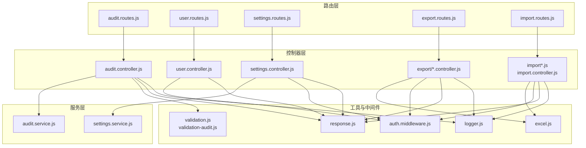
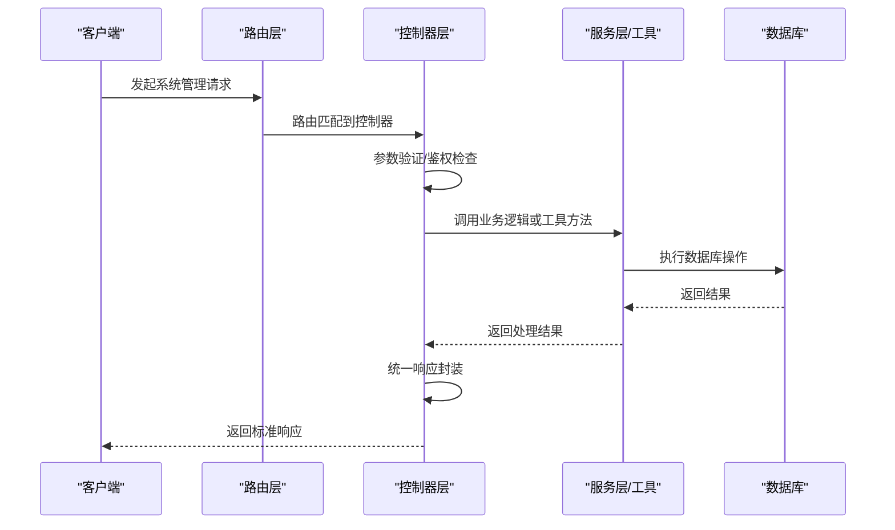
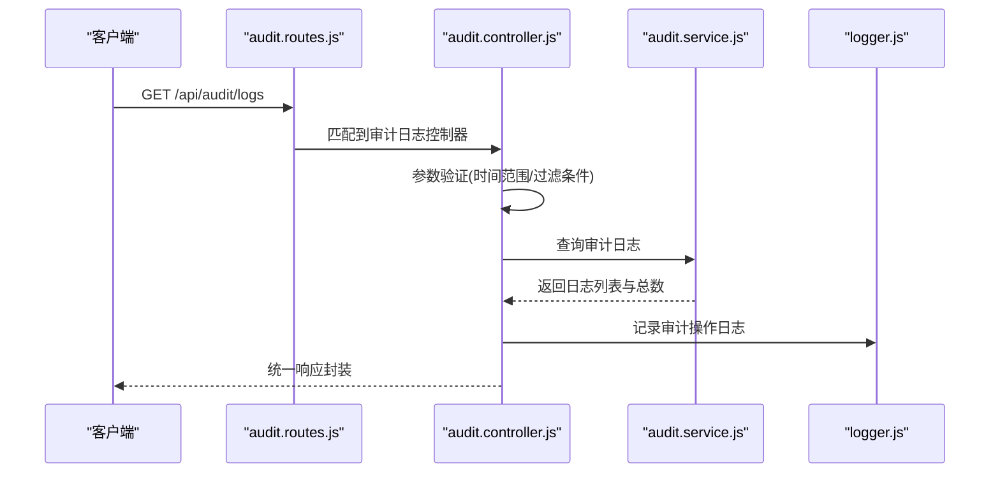
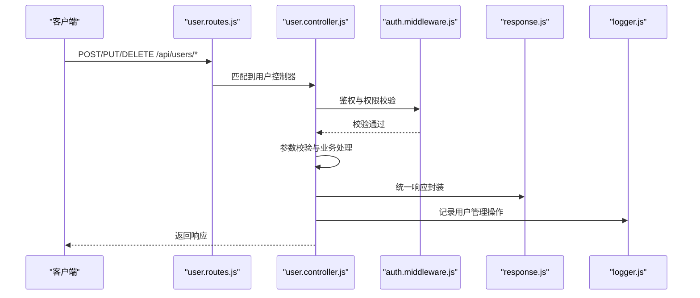
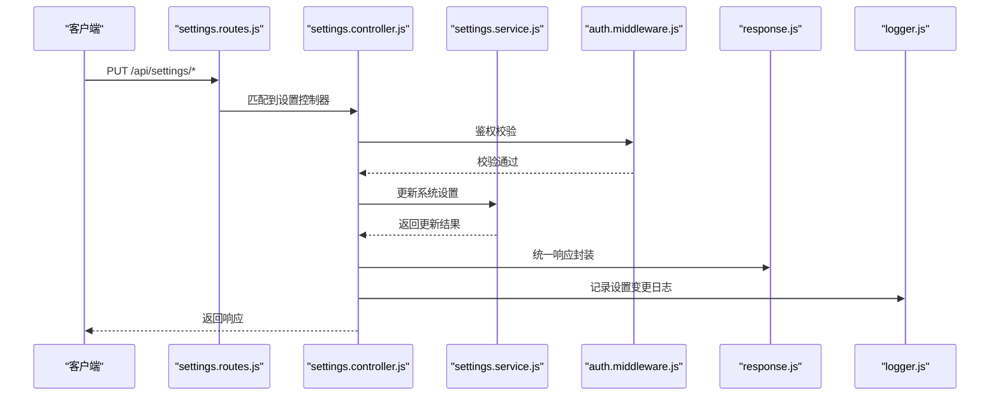
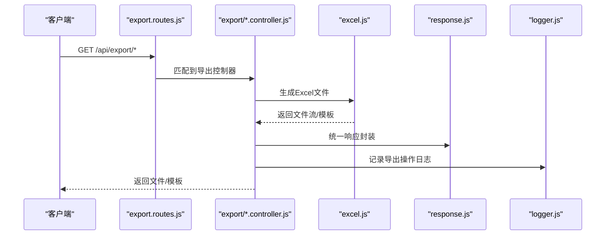
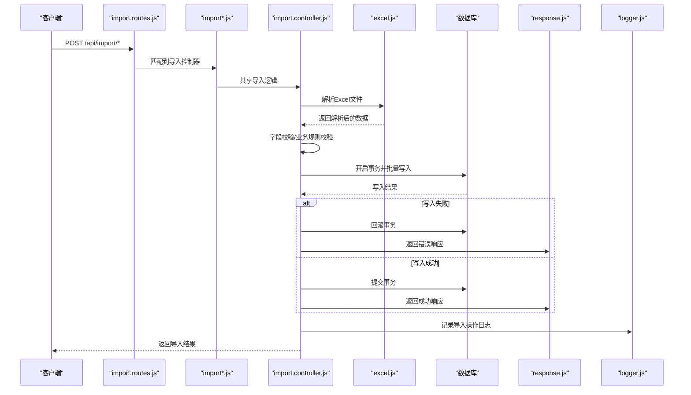
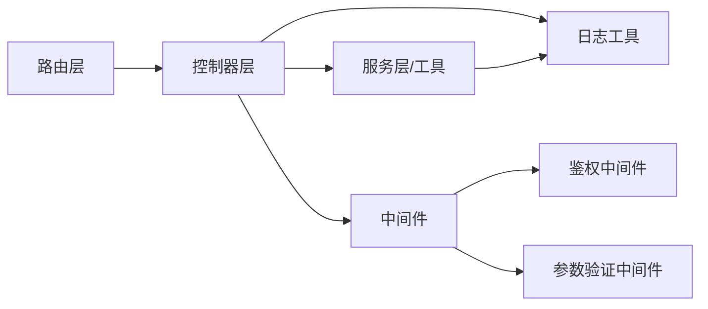

# 系统管理接口

<cite>
**本文档引用的文件**
- [audit.controller.js](file://server/src/controllers/audit.controller.js)
- [user.controller.js](file://server/src/controllers/user.controller.js)
- [settings.controller.js](file://server/src/controllers/settings.controller.js)
- [data-export.controller.js](file://server/src/controllers/export/data-export.controller.js)
- [export-template.controller.js](file://server/src/controllers/export/export-template.controller.js)
- [semester-export.controller.js](file://server/src/controllers/export/semester-export.controller.js)
- [import.controller.js](file://server/src/controllers/import.controller.js)
- [classes.js](file://server/src/controllers/import/classes.js)
- [courses.js](file://server/src/controllers/import/courses.js)
- [teachers.js](file://server/src/controllers/import/teachers.js)
- [textbooks.js](file://server/src/controllers/import/textbooks.js)
- [audit.routes.js](file://server/src/routes/audit.routes.js)
- [user.routes.js](file://server/src/routes/user.routes.js)
- [settings.routes.js](file://server/src/routes/settings.routes.js)
- [export.routes.js](file://server/src/routes/export.routes.js)
- [import.routes.js](file://server/src/routes/import.routes.js)
- [audit.service.js](file://server/src/services/audit.service.js)
- [settings.service.js](file://server/src/services/settings.service.js)
- [excel.js](file://server/src/utils/excel.js)
- [validation-audit.js](file://server/src/middleware/validation-audit.js)
- [validation.js](file://server/src/middleware/validation.js)
- [auth.middleware.js](file://server/src/middleware/auth.middleware.js)
- [error.js](file://server/src/middleware/error.js)
- [logger.js](file://server/src/utils/logger.js)
- [response.js](file://server/src/utils/response.js)
- [app.js](file://server/src/app.js)
- [server.js](file://server/src/server.js)
</cite>

## 目录
1. [简介](#简介)
2. [项目结构](#项目结构)
3. [核心组件](#核心组件)
4. [架构总览](#架构总览)
5. [详细组件分析](#详细组件分析)
6. [依赖关系分析](#依赖关系分析)
7. [性能考虑](#性能考虑)
8. [故障排除指南](#故障排除指南)
9. [结论](#结论)

## 简介
本文件为 KEC 课程管理平台的系统管理接口提供完整 API 文档，覆盖系统设置、数据导入导出、审计日志、用户管理等系统级功能。重点说明 Excel 文件处理接口的参数配置、模板格式与数据验证规则，并对批量操作接口的事务处理与错误回滚机制进行阐述。同时提供系统监控与性能优化相关的接口说明与最佳实践。

## 项目结构
后端采用控制器-服务-中间件分层架构，路由集中定义在 routes 目录，控制器负责请求处理与响应封装，服务层实现业务逻辑，工具模块提供通用能力（如 Excel 处理、日志、响应封装等）。系统管理相关接口主要分布在以下路由与控制器中：
- 审计日志：routes/audit.routes.js → controllers/audit.controller.js → services/audit.service.js
- 用户管理：routes/user.routes.js → controllers/user.controller.js
- 系统设置：routes/settings.routes.js → controllers/settings.controller.js → services/settings.service.js
- 数据导出：routes/export.routes.js → controllers/export/*.controller.js
- 数据导入：routes/import.routes.js → controllers/import*.js（classes.js、courses.js、teachers.js、textbooks.js）→ controllers/import.controller.js

图表来源
- [audit.routes.js](file://server/src/routes/audit.routes.js)
- [user.routes.js](file://server/src/routes/user.routes.js)
- [settings.routes.js](file://server/src/routes/settings.routes.js)
- [export.routes.js](file://server/src/routes/export.routes.js)
- [import.routes.js](file://server/src/routes/import.routes.js)
- [audit.controller.js](file://server/src/controllers/audit.controller.js)
- [user.controller.js](file://server/src/controllers/user.controller.js)
- [settings.controller.js](file://server/src/controllers/settings.controller.js)
- [data-export.controller.js](file://server/src/controllers/export/data-export.controller.js)
- [export-template.controller.js](file://server/src/controllers/export/export-template.controller.js)
- [semester-export.controller.js](file://server/src/controllers/export/semester-export.controller.js)
- [import.controller.js](file://server/src/controllers/import.controller.js)
- [classes.js](file://server/src/controllers/import/classes.js)
- [courses.js](file://server/src/controllers/import/courses.js)
- [teachers.js](file://server/src/controllers/import/teachers.js)
- [textbooks.js](file://server/src/controllers/import/textbooks.js)
- [audit.service.js](file://server/src/services/audit.service.js)
- [settings.service.js](file://server/src/services/settings.service.js)
- [excel.js](file://server/src/utils/excel.js)
- [validation.js](file://server/src/middleware/validation.js)
- [validation-audit.js](file://server/src/middleware/validation-audit.js)
- [auth.middleware.js](file://server/src/middleware/auth.middleware.js)
- [response.js](file://server/src/utils/response.js)
- [logger.js](file://server/src/utils/logger.js)

章节来源
- [app.js](file://server/src/app.js)
- [server.js](file://server/src/server.js)

## 核心组件
- 审计日志控制器：提供审计日志查询、分页、排序与过滤能力，支持按时间范围、操作类型、用户等条件筛选。
- 用户管理控制器：提供用户增删改查、角色分配、密码重置等功能，配合鉴权中间件保证操作安全。
- 系统设置控制器：提供系统参数配置、学期配置、系统状态管理等接口，确保系统运行参数可维护。
- 导出控制器：提供各类数据导出接口，包括学期数据导出、通用数据导出以及模板下载。
- 导入控制器：提供班级、课程、教师、教材等多类数据的批量导入，支持 Excel 模板校验与数据验证。
- 工具与中间件：Excel 解析工具、鉴权中间件、参数验证中间件、统一响应封装与日志记录。

章节来源
- [audit.controller.js](file://server/src/controllers/audit.controller.js)
- [user.controller.js](file://server/src/controllers/user.controller.js)
- [settings.controller.js](file://server/src/controllers/settings.controller.js)
- [data-export.controller.js](file://server/src/controllers/export/data-export.controller.js)
- [export-template.controller.js](file://server/src/controllers/export/export-template.controller.js)
- [semester-export.controller.js](file://server/src/controllers/export/semester-export.controller.js)
- [import.controller.js](file://server/src/controllers/import.controller.js)
- [classes.js](file://server/src/controllers/import/classes.js)
- [courses.js](file://server/src/controllers/import/courses.js)
- [teachers.js](file://server/src/controllers/import/teachers.js)
- [textbooks.js](file://server/src/controllers/import/textbooks.js)
- [excel.js](file://server/src/utils/excel.js)
- [validation-audit.js](file://server/src/middleware/validation-audit.js)
- [validation.js](file://server/src/middleware/validation.js)
- [auth.middleware.js](file://server/src/middleware/auth.middleware.js)
- [response.js](file://server/src/utils/response.js)
- [logger.js](file://server/src/utils/logger.js)

## 架构总览
系统管理接口遵循“路由 → 控制器 → 服务/工具”的分层设计，所有接口均通过鉴权中间件保护，并使用统一响应封装与日志记录。导入导出流程通过 Excel 工具模块解析与生成文件，确保数据格式一致性与可追溯性。

图表来源
- [audit.routes.js](file://server/src/routes/audit.routes.js)
- [user.routes.js](file://server/src/routes/user.routes.js)
- [settings.routes.js](file://server/src/routes/settings.routes.js)
- [export.routes.js](file://server/src/routes/export.routes.js)
- [import.routes.js](file://server/src/routes/import.routes.js)
- [audit.controller.js](file://server/src/controllers/audit.controller.js)
- [user.controller.js](file://server/src/controllers/user.controller.js)
- [settings.controller.js](file://server/src/controllers/settings.controller.js)
- [data-export.controller.js](file://server/src/controllers/export/data-export.controller.js)
- [import.controller.js](file://server/src/controllers/import.controller.js)
- [audit.service.js](file://server/src/services/audit.service.js)
- [settings.service.js](file://server/src/services/settings.service.js)
- [excel.js](file://server/src/utils/excel.js)
- [response.js](file://server/src/utils/response.js)

## 详细组件分析

### 审计日志接口
- 接口目标：提供系统操作审计日志的查询与导出能力，支持分页、排序、过滤与时间范围筛选。
- 关键流程：
  - 请求进入路由层后，经参数验证中间件校验查询参数。
  - 控制器调用服务层执行日志查询，支持按操作人、操作类型、时间范围等条件过滤。
  - 服务层返回标准化结果，控制器进行统一响应封装并记录操作日志。
- 错误处理：参数不合法时返回明确错误信息；查询异常时进行日志记录与错误响应。

图表来源
- [audit.routes.js](file://server/src/routes/audit.routes.js)
- [audit.controller.js](file://server/src/controllers/audit.controller.js)
- [audit.service.js](file://server/src/services/audit.service.js)
- [validation-audit.js](file://server/src/middleware/validation-audit.js)
- [logger.js](file://server/src/utils/logger.js)
- [response.js](file://server/src/utils/response.js)

章节来源
- [audit.controller.js](file://server/src/controllers/audit.controller.js)
- [audit.routes.js](file://server/src/routes/audit.routes.js)
- [audit.service.js](file://server/src/services/audit.service.js)
- [validation-audit.js](file://server/src/middleware/validation-audit.js)
- [logger.js](file://server/src/utils/logger.js)
- [response.js](file://server/src/utils/response.js)

### 用户管理接口
- 接口目标：提供用户全生命周期管理，包括新增、修改、删除、查询与角色分配等。
- 关键流程：
  - 所有用户管理接口均需通过鉴权中间件校验身份。
  - 控制器接收请求参数，调用服务层执行用户操作。
  - 统一响应封装返回结果，异常情况记录错误日志。
- 权限控制：仅管理员可执行敏感操作（如删除用户、重置密码），控制器内部进行权限判断。

图表来源
- [user.routes.js](file://server/src/routes/user.routes.js)
- [user.controller.js](file://server/src/controllers/user.controller.js)
- [auth.middleware.js](file://server/src/middleware/auth.middleware.js)
- [response.js](file://server/src/utils/response.js)
- [logger.js](file://server/src/utils/logger.js)

章节来源
- [user.controller.js](file://server/src/controllers/user.controller.js)
- [user.routes.js](file://server/src/routes/user.routes.js)
- [auth.middleware.js](file://server/src/middleware/auth.middleware.js)
- [response.js](file://server/src/utils/response.js)
- [logger.js](file://server/src/utils/logger.js)

### 系统设置接口
- 接口目标：提供系统参数配置、学期配置、系统状态管理等接口，确保系统运行参数可维护。
- 关键流程：
  - 接口受鉴权保护，管理员可更新系统设置。
  - 控制器调用服务层执行设置变更，支持事务性操作以保证一致性。
  - 更新完成后记录审计日志，便于追踪配置变更历史。

图表来源
- [settings.routes.js](file://server/src/routes/settings.routes.js)
- [settings.controller.js](file://server/src/controllers/settings.controller.js)
- [settings.service.js](file://server/src/services/settings.service.js)
- [auth.middleware.js](file://server/src/middleware/auth.middleware.js)
- [response.js](file://server/src/utils/response.js)
- [logger.js](file://server/src/utils/logger.js)

章节来源
- [settings.controller.js](file://server/src/controllers/settings.controller.js)
- [settings.routes.js](file://server/src/routes/settings.routes.js)
- [settings.service.js](file://server/src/services/settings.service.js)
- [auth.middleware.js](file://server/src/middleware/auth.middleware.js)
- [response.js](file://server/src/utils/response.js)
- [logger.js](file://server/src/utils/logger.js)

### 数据导出接口
- 接口目标：提供学期数据导出、通用数据导出与模板下载功能，支持 Excel 格式输出。
- 关键流程：
  - 控制器接收导出参数，调用 Excel 工具模块生成文件。
  - 支持模板下载与数据导出两种模式，分别返回不同格式的响应。
  - 导出过程记录日志，便于审计与问题排查。

图表来源
- [export.routes.js](file://server/src/routes/export.routes.js)
- [data-export.controller.js](file://server/src/controllers/export/data-export.controller.js)
- [export-template.controller.js](file://server/src/controllers/export/export-template.controller.js)
- [semester-export.controller.js](file://server/src/controllers/export/semester-export.controller.js)
- [excel.js](file://server/src/utils/excel.js)
- [response.js](file://server/src/utils/response.js)
- [logger.js](file://server/src/utils/logger.js)

章节来源
- [data-export.controller.js](file://server/src/controllers/export/data-export.controller.js)
- [export-template.controller.js](file://server/src/controllers/export/export-template.controller.js)
- [semester-export.controller.js](file://server/src/controllers/export/semester-export.controller.js)
- [export.routes.js](file://server/src/routes/export.routes.js)
- [excel.js](file://server/src/utils/excel.js)
- [response.js](file://server/src/utils/response.js)
- [logger.js](file://server/src/utils/logger.js)

### 数据导入接口
- 接口目标：提供班级、课程、教师、教材等多类数据的批量导入，支持 Excel 模板校验与数据验证。
- 关键流程：
  - 控制器接收上传文件，调用 Excel 工具模块解析数据。
  - 对每条记录执行字段校验、业务规则校验与唯一性校验。
  - 使用事务批量写入数据库，若任一环节失败则整体回滚。
  - 导入完成后记录审计日志，包含成功/失败统计信息。

图表来源
- [import.routes.js](file://server/src/routes/import.routes.js)
- [import.controller.js](file://server/src/controllers/import.controller.js)
- [classes.js](file://server/src/controllers/import/classes.js)
- [courses.js](file://server/src/controllers/import/courses.js)
- [teachers.js](file://server/src/controllers/import/teachers.js)
- [textbooks.js](file://server/src/controllers/import/textbooks.js)
- [excel.js](file://server/src/utils/excel.js)
- [response.js](file://server/src/utils/response.js)
- [logger.js](file://server/src/utils/logger.js)

章节来源
- [import.controller.js](file://server/src/controllers/import.controller.js)
- [classes.js](file://server/src/controllers/import/classes.js)
- [courses.js](file://server/src/controllers/import/courses.js)
- [teachers.js](file://server/src/controllers/import/teachers.js)
- [textbooks.js](file://server/src/controllers/import/textbooks.js)
- [import.routes.js](file://server/src/routes/import.routes.js)
- [excel.js](file://server/src/utils/excel.js)
- [response.js](file://server/src/utils/response.js)
- [logger.js](file://server/src/utils/logger.js)

### Excel 文件处理与模板规范
- 模板下载：提供模板下载接口，返回标准 Excel 模板文件，包含必填字段与示例数据。
- 数据解析：解析上传的 Excel 文件，支持多工作表与列映射，自动识别数据类型。
- 数据验证：
  - 必填字段校验：缺失字段标记为无效。
  - 类型校验：日期、数字、枚举值等类型严格校验。
  - 唯一性校验：主键重复、名称重复等冲突检测。
  - 业务规则校验：如课程学分范围、教师工号格式等。
- 错误收集：将每条记录的错误信息汇总，支持错误修复后重新导入。
- 性能优化：大文件分批处理，避免内存溢出；并发限制与超时控制。

章节来源
- [excel.js](file://server/src/utils/excel.js)
- [import.controller.js](file://server/src/controllers/import.controller.js)
- [classes.js](file://server/src/controllers/import/classes.js)
- [courses.js](file://server/src/controllers/import/courses.js)
- [teachers.js](file://server/src/controllers/import/teachers.js)
- [textbooks.js](file://server/src/controllers/import/textbooks.js)

### 批量操作与事务处理
- 事务边界：批量导入在单个事务内执行，确保原子性与一致性。
- 错误回滚：任一记录校验失败或数据库写入失败，立即触发回滚，保证数据完整性。
- 错误恢复：提供错误明细与修复建议，支持断点续传与增量导入。
- 并发控制：限制同时进行的批量任务数量，避免资源争用。

章节来源
- [import.controller.js](file://server/src/controllers/import.controller.js)
- [excel.js](file://server/src/utils/excel.js)
- [error.js](file://server/src/middleware/error.js)

## 依赖关系分析
- 路由到控制器：各路由文件将请求映射到对应控制器，控制器负责参数校验与响应封装。
- 控制器到服务/工具：控制器调用服务层或工具模块完成具体业务逻辑。
- 中间件链路：鉴权中间件贯穿所有受保护接口；参数验证中间件用于输入校验；错误中间件统一捕获异常。
- 日志与监控：控制器与工具模块统一使用日志工具记录操作与异常，便于审计与问题定位。

图表来源
- [audit.routes.js](file://server/src/routes/audit.routes.js)
- [user.routes.js](file://server/src/routes/user.routes.js)
- [settings.routes.js](file://server/src/routes/settings.routes.js)
- [export.routes.js](file://server/src/routes/export.routes.js)
- [import.routes.js](file://server/src/routes/import.routes.js)
- [audit.controller.js](file://server/src/controllers/audit.controller.js)
- [user.controller.js](file://server/src/controllers/user.controller.js)
- [settings.controller.js](file://server/src/controllers/settings.controller.js)
- [data-export.controller.js](file://server/src/controllers/export/data-export.controller.js)
- [import.controller.js](file://server/src/controllers/import.controller.js)
- [auth.middleware.js](file://server/src/middleware/auth.middleware.js)
- [validation.js](file://server/src/middleware/validation.js)
- [logger.js](file://server/src/utils/logger.js)

章节来源
- [auth.middleware.js](file://server/src/middleware/auth.middleware.js)
- [validation.js](file://server/src/middleware/validation.js)
- [error.js](file://server/src/middleware/error.js)
- [logger.js](file://server/src/utils/logger.js)

## 性能考虑
- 导入性能：
  - 分批处理：将大文件拆分为多个批次，减少内存占用与锁竞争。
  - 并发限制：限制同时进行的导入任务数量，避免数据库压力过大。
  - 索引优化：批量插入前临时禁用非必要索引，插入后再重建索引。
- 导出性能：
  - 流式输出：使用流式写入减少内存峰值。
  - 缓存策略：对常用查询结果进行缓存，降低重复计算。
- 监控与告警：
  - 接口耗时监控：记录关键接口的响应时间与错误率。
  - 资源使用监控：CPU、内存、磁盘与数据库连接池使用情况。
  - 日志分级：区分 INFO/WARN/ERROR，便于快速定位问题。

## 故障排除指南
- 常见错误类型：
  - 参数错误：请求参数缺失或格式不正确，返回明确的错误信息。
  - 权限不足：未登录或无管理员权限，返回鉴权失败。
  - 数据库异常：事务回滚、连接超时等，记录详细日志并返回友好提示。
- 排查步骤：
  - 查看响应状态码与错误消息，确认是参数、权限还是业务异常。
  - 检查日志文件中的错误堆栈与上下文信息。
  - 对于导入失败的数据，根据错误明细修复后重新上传。
- 最佳实践：
  - 在生产环境启用鉴权与参数验证中间件。
  - 对大文件导入设置合理的超时与重试策略。
  - 定期清理上传目录与导出文件，避免磁盘空间不足。

章节来源
- [error.js](file://server/src/middleware/error.js)
- [logger.js](file://server/src/utils/logger.js)
- [response.js](file://server/src/utils/response.js)

## 结论
本系统管理接口围绕审计、用户、设置、导入导出四大核心能力构建，采用分层架构与中间件体系保障安全性与可维护性。通过严格的参数验证、事务处理与错误回滚机制，确保批量操作的可靠性；借助 Excel 工具模块与模板规范，提升数据导入导出的一致性与效率。结合监控与日志体系，能够有效支撑系统的稳定运行与持续优化。