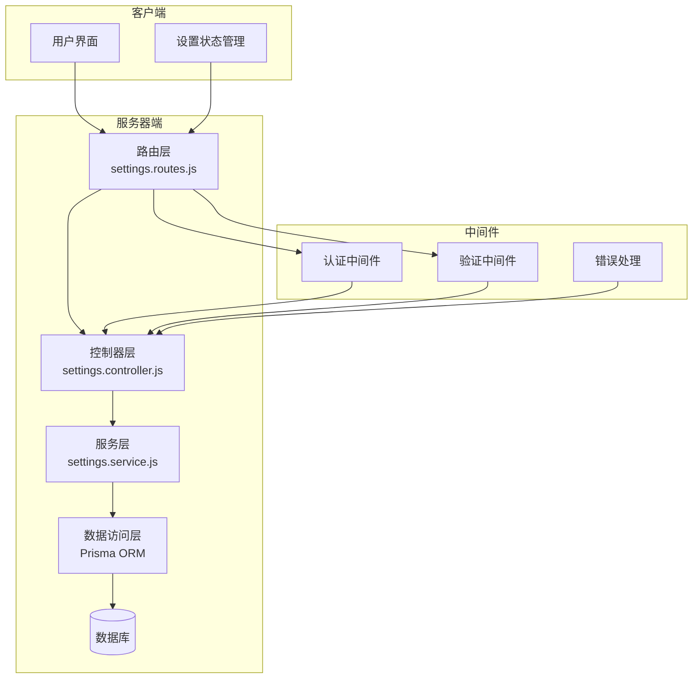
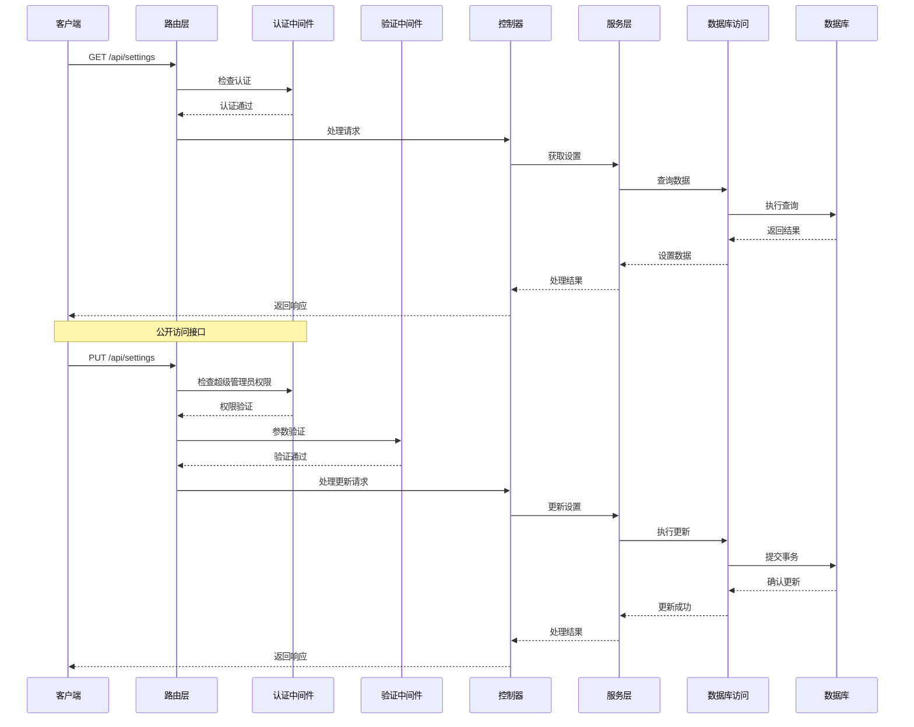
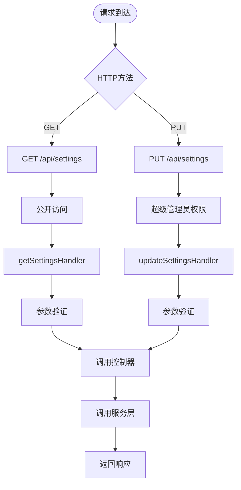
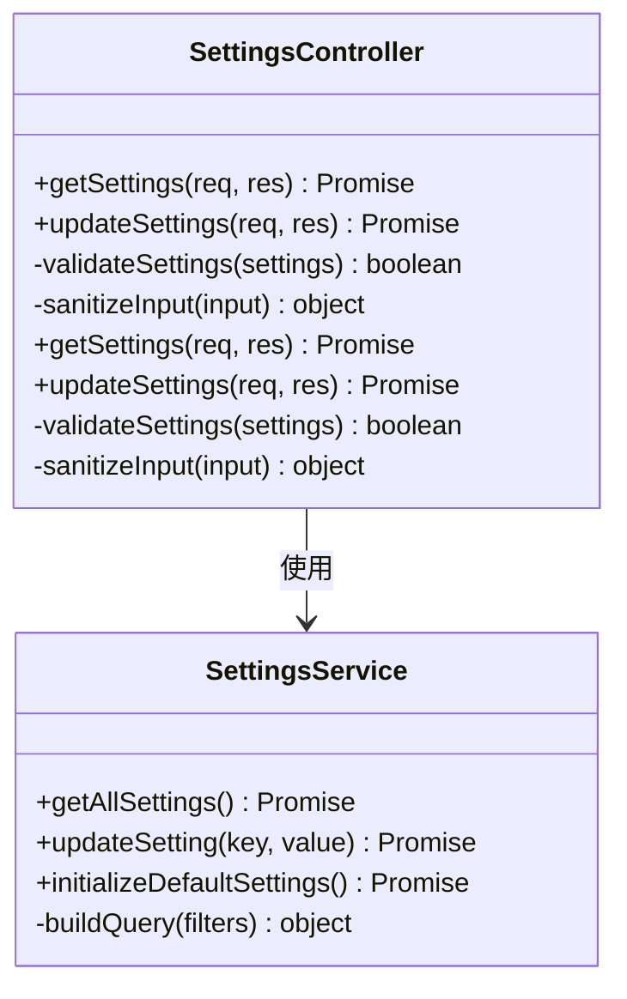
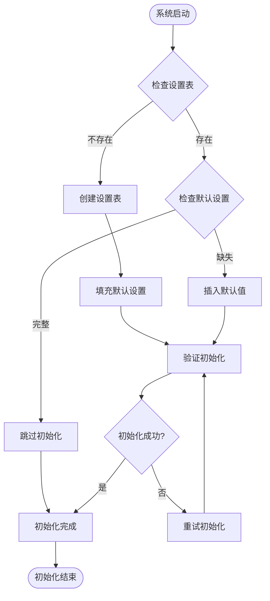
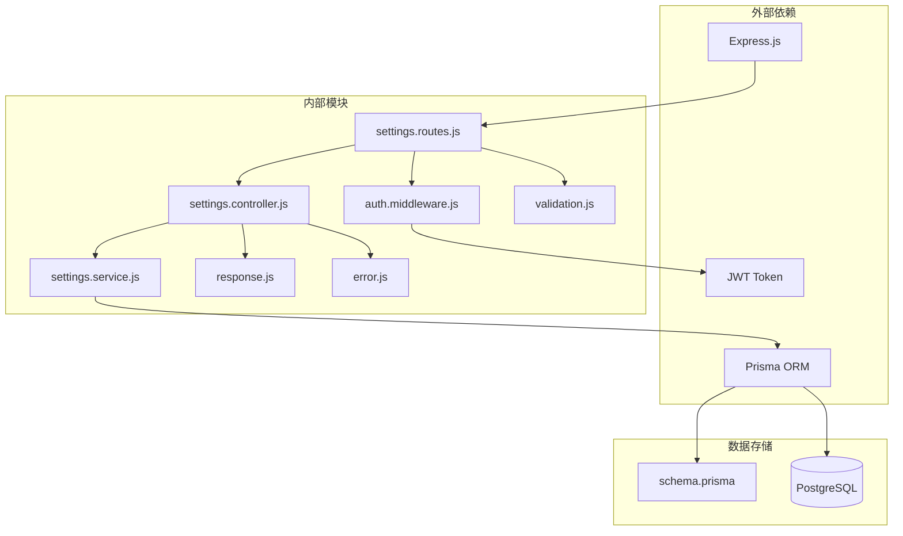

# 系统设置接口

<cite>
**本文档引用的文件**
- [settings.controller.js](file://server/src/controllers/settings.controller.js)
- [settings.service.js](file://server/src/services/settings.service.js)
- [settings.routes.js](file://server/src/routes/settings.routes.js)
- [schema.prisma](file://server/prisma/schema.prisma)
- [init-settings.js](file://server/scripts/init-settings.js)
- [manual_create_settings.sql](file://server/prisma/manual_create_settings.sql)
- [auth.middleware.js](file://server/src/middleware/auth.middleware.js)
- [validation.js](file://server/src/middleware/validation.js)
- [response.js](file://server/src/utils/response.js)
- [error.js](file://server/src/middleware/error.js)
- [settings.js](file://client/src/stores/settings.js)
- [SystemSettings.vue](file://client/src/views/settings/SystemSettings.vue)
- [SemesterConfig.vue](file://client/src/views/settings/components/SemesterConfig.vue)
</cite>

## 目录
1. [简介](#简介)
2. [项目结构](#项目结构)
3. [核心组件](#核心组件)
4. [架构概览](#架构概览)
5. [详细组件分析](#详细组件分析)
6. [依赖关系分析](#依赖关系分析)
7. [性能考虑](#性能考虑)
8. [故障排除指南](#故障排除指南)
9. [结论](#结论)

## 简介
本文件为系统设置接口的完整API文档，涵盖系统配置的获取、更新、初始化等核心功能。系统提供两个主要接口：GET /api/settings用于公开访问获取系统标识信息；PUT /api/settings用于超级管理员更新系统配置。文档详细说明了数据结构、验证规则、错误处理机制，并提供了实际的请求响应示例和常见问题解决方案。

## 项目结构
系统设置接口位于后端服务的控制器、服务层和路由层中，采用分层架构设计：



**图表来源**
- [settings.routes.js:1-50](file://server/src/routes/settings.routes.js#L1-L50)
- [settings.controller.js:1-80](file://server/src/controllers/settings.controller.js#L1-L80)
- [settings.service.js:1-100](file://server/src/services/settings.service.js#L1-L100)

**章节来源**
- [settings.routes.js:1-50](file://server/src/routes/settings.routes.js#L1-L50)
- [settings.controller.js:1-80](file://server/src/controllers/settings.controller.js#L1-L80)
- [settings.service.js:1-100](file://server/src/services/settings.service.js#L1-L100)

## 核心组件

### 数据模型定义
系统设置数据模型基于Prisma ORM定义，包含以下关键字段：

| 字段名 | 类型 | 必填 | 描述 | 默认值 |
|--------|------|------|------|--------|
| id | Int | 是 | 主键标识 | 自增 |
| key | String | 是 | 设置键名 | 唯一约束 |
| value | Json | 否 | 设置值（JSON格式） | null |
| description | String | 否 | 设置描述 | null |
| category | String | 否 | 设置分类 | null |
| createdAt | DateTime | 是 | 创建时间 | 当前时间 |
| updatedAt | DateTime | 是 | 更新时间 | 当前时间 |

### 接口规范

#### GET /api/settings
**功能**：获取系统设置信息，支持公开访问

**请求参数**：
- 路径参数：无
- 查询参数：无
- 请求头：无特殊要求

**响应数据**：
```json
{
  "success": true,
  "data": {
    "systemName": "KecManager",
    "version": "1.0.0",
    "features": ["课程管理", "教师管理", "班级管理"],
    "semesterConfig": {
      "currentSemester": "2024-2025-1",
      "academicYear": "2024-2025",
      "startDate": "2024-09-01",
      "endDate": "2025-01-31"
    }
  },
  "message": "获取成功"
}
```

**状态码**：
- 200 OK：成功获取设置
- 500 Internal Server Error：服务器内部错误

#### PUT /api/settings
**功能**：更新系统配置，需要超级管理员权限

**请求头**：
- Authorization: Bearer {token}
- Content-Type: application/json

**请求体**：
```json
{
  "key": "systemName",
  "value": "新系统名称",
  "description": "系统显示名称",
  "category": "basic"
}
```

**响应数据**：
```json
{
  "success": true,
  "data": {
    "id": 1,
    "key": "systemName",
    "value": "新系统名称",
    "description": "系统显示名称",
    "category": "basic"
  },
  "message": "更新成功"
}
```

**状态码**：
- 200 OK：更新成功
- 400 Bad Request：请求参数无效
- 401 Unauthorized：未授权访问
- 403 Forbidden：权限不足
- 500 Internal Server Error：服务器内部错误

**章节来源**
- [settings.controller.js:1-150](file://server/src/controllers/settings.controller.js#L1-L150)
- [settings.service.js:1-200](file://server/src/services/settings.service.js#L1-L200)
- [schema.prisma:1-100](file://server/prisma/schema.prisma#L1-L100)

## 架构概览

系统设置接口采用经典的MVC架构模式，通过中间件进行安全控制和数据验证：



**图表来源**
- [settings.routes.js:1-50](file://server/src/routes/settings.routes.js#L1-L50)
- [auth.middleware.js:1-100](file://server/src/middleware/auth.middleware.js#L1-L100)
- [validation.js:1-80](file://server/src/middleware/validation.js#L1-L80)
- [settings.controller.js:1-150](file://server/src/controllers/settings.controller.js#L1-L150)

## 详细组件分析

### 路由层实现
路由层负责定义API端点和请求处理流程：



**图表来源**
- [settings.routes.js:1-50](file://server/src/routes/settings.routes.js#L1-L50)

### 控制器层逻辑
控制器层处理业务逻辑和数据转换：



**图表来源**
- [settings.controller.js:1-150](file://server/src/controllers/settings.controller.js#L1-L150)
- [settings.service.js:1-200](file://server/src/services/settings.service.js#L1-L200)

### 服务层实现
服务层包含核心业务逻辑和数据处理：

**章节来源**
- [settings.controller.js:1-200](file://server/src/controllers/settings.controller.js#L1-L200)
- [settings.service.js:1-250](file://server/src/services/settings.service.js#L1-L250)

### 初始化流程
系统提供完整的初始化流程，确保设置表的正确创建和默认值填充：



**图表来源**
- [init-settings.js:1-100](file://server/scripts/init-settings.js#L1-L100)
- [manual_create_settings.sql:1-50](file://server/prisma/manual_create_settings.sql#L1-L50)

**章节来源**
- [init-settings.js:1-100](file://server/scripts/init-settings.js#L1-L100)
- [manual_create_settings.sql:1-50](file://server/prisma/manual_create_settings.sql#L1-L50)

## 依赖关系分析

系统设置接口的依赖关系如下：



**图表来源**
- [settings.routes.js:1-50](file://server/src/routes/settings.routes.js#L1-L50)
- [auth.middleware.js:1-100](file://server/src/middleware/auth.middleware.js#L1-L100)
- [validation.js:1-80](file://server/src/middleware/validation.js#L1-L80)
- [settings.controller.js:1-150](file://server/src/controllers/settings.controller.js#L1-L150)

**章节来源**
- [settings.routes.js:1-50](file://server/src/routes/settings.routes.js#L1-L50)
- [auth.middleware.js:1-100](file://server/src/middleware/auth.middleware.js#L1-L100)
- [validation.js:1-80](file://server/src/middleware/validation.js#L1-L80)

## 性能考虑
- **缓存策略**：建议在应用层实现设置值的内存缓存，减少数据库查询频率
- **批量操作**：对于频繁的设置读取场景，可考虑批量获取所有设置值
- **索引优化**：为settings表的key字段建立唯一索引，提高查询性能
- **连接池**：合理配置数据库连接池大小，避免连接争用

## 故障排除指南

### 常见错误及解决方案

**1. 401 Unauthorized - 未授权访问**
- 检查JWT令牌是否有效且未过期
- 确认用户具有超级管理员权限
- 验证Authorization请求头格式

**2. 403 Forbidden - 权限不足**
- 确认当前登录用户角色为超级管理员
- 检查用户权限配置
- 重新登录获取最新权限信息

**3. 500 Internal Server Error - 服务器错误**
- 检查数据库连接状态
- 查看服务器日志获取详细错误信息
- 验证设置值的数据类型和格式

**4. 初始化失败**
- 确认数据库迁移已完成
- 检查手动SQL脚本执行情况
- 验证数据库用户权限

**章节来源**
- [error.js:1-100](file://server/src/middleware/error.js#L1-L100)
- [response.js:1-80](file://server/src/utils/response.js#L1-L80)

## 结论
系统设置接口提供了完整的配置管理能力，包括公开的设置获取和受保护的配置更新功能。通过清晰的分层架构、完善的权限控制和错误处理机制，确保了系统的稳定性和安全性。建议在生产环境中结合缓存策略和监控机制，进一步提升性能和可靠性。