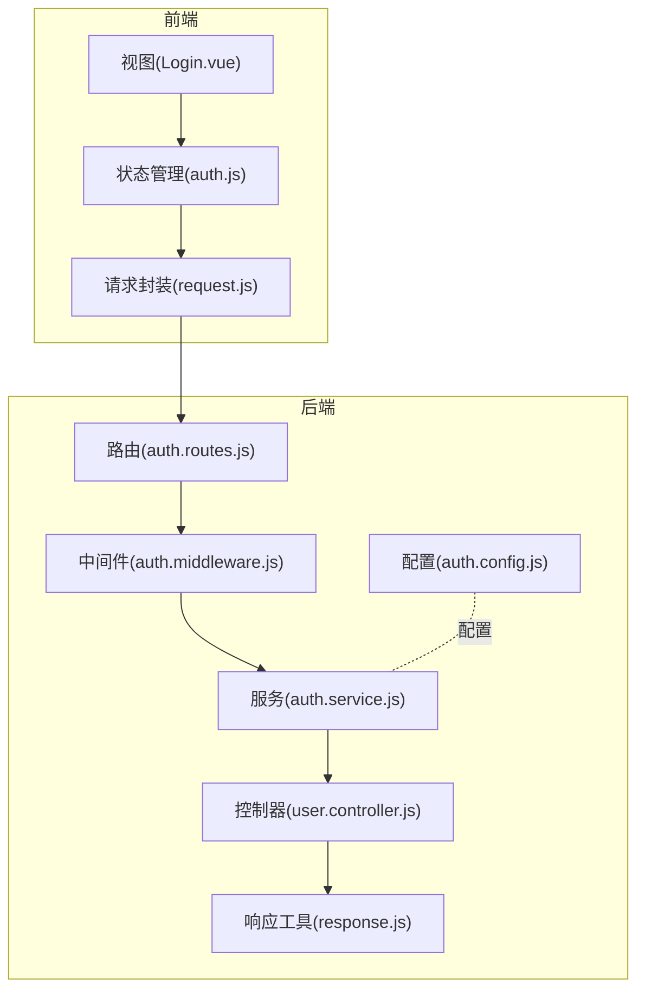
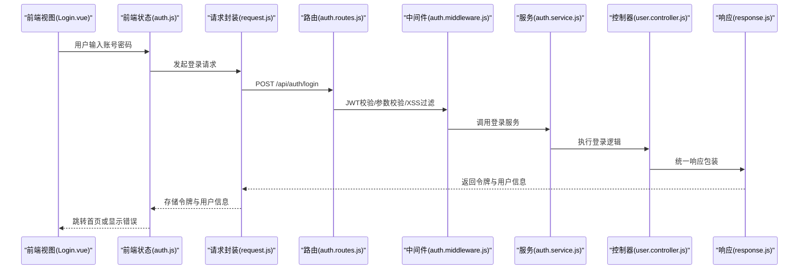
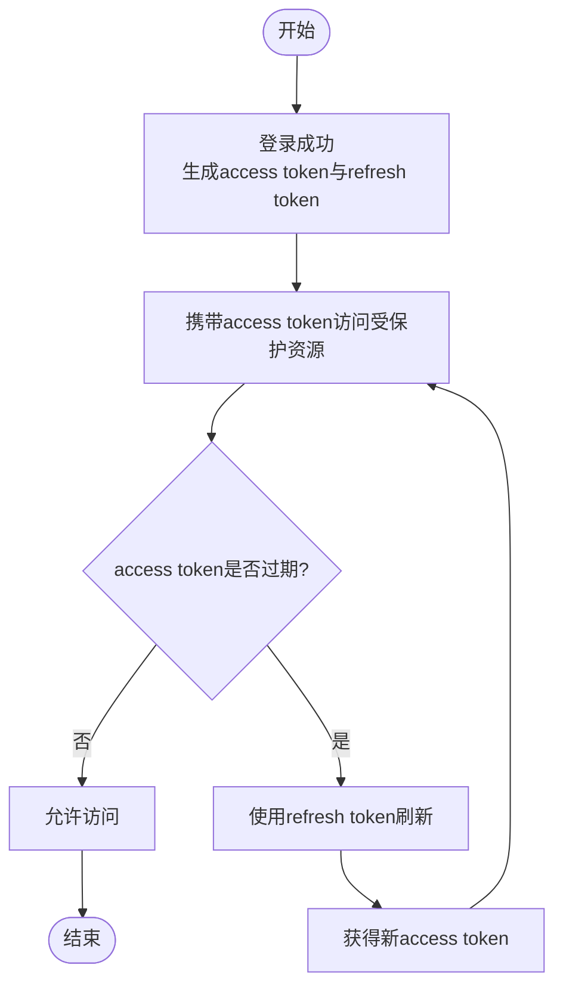
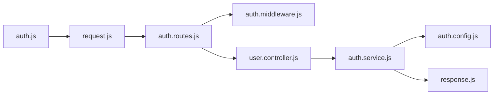

# 认证接口

<cite>
**本文引用的文件**
- [server/src/routes/auth.routes.js](file://server/src/routes/auth.routes.js)
- [server/src/services/auth.service.js](file://server/src/services/auth.service.js)
- [server/src/middleware/auth.middleware.js](file://server/src/middleware/auth.middleware.js)
- [server/src/config/auth.config.js](file://server/src/config/auth.config.js)
- [server/src/utils/response.js](file://server/src/utils/response.js)
- [server/src/controllers/user.controller.js](file://server/src/controllers/user.controller.js)
- [client/src/stores/auth.js](file://client/src/stores/auth.js)
- [client/src/utils/request.js](file://client/src/utils/request.js)
- [client/src/views/Login.vue](file://client/src/views/Login.vue)
- [server/src/middleware/xss.js](file://server/src/middleware/xss.js)
- [server/src/__tests__/integration/auth.routes.test.js](file://server/src/__tests__/integration/auth.routes.test.js)
- [server/src/services/__tests__/auth.service.test.js](file://server/src/services/__tests__/auth.service.test.js)
</cite>

## 目录
1. [简介](#简介)
2. [项目结构](#项目结构)
3. [核心组件](#核心组件)
4. [架构总览](#架构总览)
5. [详细组件分析](#详细组件分析)
6. [依赖关系分析](#依赖关系分析)
7. [性能考虑](#性能考虑)
8. [故障排除指南](#故障排除指南)
9. [结论](#结论)
10. [附录](#附录)

## 简介
本文件面向KEC课程管理平台的认证接口，覆盖用户登录、登出、密码重置、令牌刷新等关键流程。文档详细说明JWT令牌的生成、验证与刷新机制，并给出请求头设置Authorization: Bearer <token>的规范。同时提供请求参数、响应格式、错误码说明与实际调用示例，以及XSS防护、CSRF防护等安全措施的实现要点。

## 项目结构
后端采用模块化路由+服务层+中间件的分层设计；前端通过状态管理与HTTP封装统一处理认证态与请求拦截。认证相关的关键文件分布如下：
- 后端：路由定义、服务逻辑、认证中间件、配置、通用响应工具
- 前端：认证状态管理、HTTP请求封装、登录页面

图表来源
- [server/src/routes/auth.routes.js](file://server/src/routes/auth.routes.js)
- [server/src/middleware/auth.middleware.js](file://server/src/middleware/auth.middleware.js)
- [server/src/services/auth.service.js](file://server/src/services/auth.service.js)
- [server/src/controllers/user.controller.js](file://server/src/controllers/user.controller.js)
- [server/src/config/auth.config.js](file://server/src/config/auth.config.js)
- [server/src/utils/response.js](file://server/src/utils/response.js)
- [client/src/stores/auth.js](file://client/src/stores/auth.js)
- [client/src/utils/request.js](file://client/src/utils/request.js)
- [client/src/views/Login.vue](file://client/src/views/Login.vue)

章节来源
- [server/src/routes/auth.routes.js](file://server/src/routes/auth.routes.js)
- [server/src/services/auth.service.js](file://server/src/services/auth.service.js)
- [server/src/middleware/auth.middleware.js](file://server/src/middleware/auth.middleware.js)
- [server/src/config/auth.config.js](file://server/src/config/auth.config.js)
- [server/src/utils/response.js](file://server/src/utils/response.js)
- [client/src/stores/auth.js](file://client/src/stores/auth.js)
- [client/src/utils/request.js](file://client/src/utils/request.js)
- [client/src/views/Login.vue](file://client/src/views/Login.vue)

## 核心组件
- 路由层：定义认证相关接口（登录、登出、密码重置、令牌刷新），并绑定到对应控制器方法。
- 中间件层：负责JWT校验、权限控制、XSS过滤等横切关注点。
- 服务层：实现业务逻辑（如用户凭据校验、令牌签发与刷新、密码更新）。
- 前端状态与请求封装：集中处理登录态、请求头注入、错误提示与跳转。

章节来源
- [server/src/routes/auth.routes.js](file://server/src/routes/auth.routes.js)
- [server/src/middleware/auth.middleware.js](file://server/src/middleware/auth.middleware.js)
- [server/src/services/auth.service.js](file://server/src/services/auth.service.js)
- [client/src/stores/auth.js](file://client/src/stores/auth.js)
- [client/src/utils/request.js](file://client/src/utils/request.js)

## 架构总览
下图展示认证流程在前后端的交互关系与数据流。

图表来源
- [server/src/routes/auth.routes.js](file://server/src/routes/auth.routes.js)
- [server/src/middleware/auth.middleware.js](file://server/src/middleware/auth.middleware.js)
- [server/src/services/auth.service.js](file://server/src/services/auth.service.js)
- [server/src/controllers/user.controller.js](file://server/src/controllers/user.controller.js)
- [server/src/utils/response.js](file://server/src/utils/response.js)
- [client/src/views/Login.vue](file://client/src/views/Login.vue)
- [client/src/stores/auth.js](file://client/src/stores/auth.js)
- [client/src/utils/request.js](file://client/src/utils/request.js)

## 详细组件分析

### 登录接口
- 接口路径：POST /api/auth/login
- 功能：校验用户凭据，签发JWT令牌与刷新令牌，返回用户基本信息与权限标识。
- 请求头：
  - Content-Type: application/json
  - Authorization: Bearer <token>（非必需，登录时通常不携带）
- 请求体字段：
  - 账号：字符串，必填
  - 密码：字符串，必填
- 成功响应字段：
  - token：访问令牌
  - refreshToken：刷新令牌
  - user：用户基本信息（如用户名、角色等）
- 失败响应字段：
  - code：错误码
  - message：错误描述
- 错误码示例：
  - 400：参数缺失或格式错误
  - 401：凭据无效
  - 500：服务器内部错误
- 安全措施：
  - 参数校验与XSS过滤
  - 异常捕获与统一响应
- 调用示例（前端）：
  - 使用状态管理发起登录请求，成功后写入本地存储并设置请求头

章节来源
- [server/src/routes/auth.routes.js](file://server/src/routes/auth.routes.js)
- [server/src/services/auth.service.js](file://server/src/services/auth.service.js)
- [server/src/middleware/auth.middleware.js](file://server/src/middleware/auth.middleware.js)
- [server/src/utils/response.js](file://server/src/utils/response.js)
- [client/src/stores/auth.js](file://client/src/stores/auth.js)
- [client/src/utils/request.js](file://client/src/utils/request.js)

### 登出接口
- 接口路径：POST /api/auth/logout
- 功能：使当前令牌失效（可结合黑名单策略），清除前端登录态。
- 请求头：
  - Authorization: Bearer <token>
- 请求体：无
- 成功响应：空对象或成功标志
- 失败响应：错误码与描述
- 安全措施：
  - 必须携带有效令牌
  - 服务端执行令牌作废处理
- 调用示例（前端）：
  - 清除本地令牌与用户信息，跳转登录页

章节来源
- [server/src/routes/auth.routes.js](file://server/src/routes/auth.routes.js)
- [server/src/services/auth.service.js](file://server/src/services/auth.service.js)
- [client/src/stores/auth.js](file://client/src/stores/auth.js)
- [client/src/utils/request.js](file://client/src/utils/request.js)

### 密码重置接口
- 接口路径：POST /api/auth/reset-password
- 功能：根据旧密码与新密码更新用户密码。
- 请求头：
  - Authorization: Bearer <token>
- 请求体字段：
  - oldPassword：旧密码，必填
  - newPassword：新密码，必填
- 成功响应：空对象或成功标志
- 失败响应：错误码与描述
- 安全措施：
  - 严格参数校验
  - 服务端进行旧密码比对与新密码强度校验
- 调用示例（前端）：
  - 在设置页提交修改密码表单

章节来源
- [server/src/routes/auth.routes.js](file://server/src/routes/auth.routes.js)
- [server/src/services/auth.service.js](file://server/src/services/auth.service.js)
- [server/src/middleware/auth.middleware.js](file://server/src/middleware/auth.middleware.js)
- [server/src/utils/response.js](file://server/src/utils/response.js)
- [client/src/utils/request.js](file://client/src/utils/request.js)

### 令牌刷新接口
- 接口路径：POST /api/auth/refresh
- 功能：使用refreshToken换取新的access token。
- 请求头：
  - Authorization: Bearer <token>（非必需）
- 请求体字段：
  - refreshToken：刷新令牌，必填
- 成功响应字段：
  - token：新的访问令牌
  - expiresIn：过期时间
- 失败响应：错误码与描述
- 安全措施：
  - refresh token必须有效且未被撤销
  - 服务端校验token来源与有效期
- 调用示例（前端）：
  - 在token即将过期前自动刷新

章节来源
- [server/src/routes/auth.routes.js](file://server/src/routes/auth.routes.js)
- [server/src/services/auth.service.js](file://server/src/services/auth.service.js)
- [server/src/utils/response.js](file://server/src/utils/response.js)
- [client/src/stores/auth.js](file://client/src/stores/auth.js)
- [client/src/utils/request.js](file://client/src/utils/request.js)

### JWT令牌生成、验证与刷新机制
- 生成：
  - 登录成功后，服务端基于用户信息生成access token与refresh token，并设置过期时间。
  - access token用于日常请求鉴权；refresh token用于换取新的access token。
- 验证：
  - 每次受保护请求需在请求头中携带Authorization: Bearer <token>。
  - 中间件负责解析与校验JWT，失败则拒绝请求。
- 刷新：
  - 当access token即将过期，客户端使用refresh token向刷新接口申请新token。
  - 服务端校验refresh token有效性并签发新token。
- 配置：
  - 过期时间、密钥、签名算法等在配置文件中集中管理。

图表来源
- [server/src/services/auth.service.js](file://server/src/services/auth.service.js)
- [server/src/config/auth.config.js](file://server/src/config/auth.config.js)
- [client/src/stores/auth.js](file://client/src/stores/auth.js)

章节来源
- [server/src/services/auth.service.js](file://server/src/services/auth.service.js)
- [server/src/config/auth.config.js](file://server/src/config/auth.config.js)
- [client/src/stores/auth.js](file://client/src/stores/auth.js)

### XSS防护与CSRF防护
- XSS防护：
  - 中间件对输入参数进行清理与过滤，避免恶意脚本注入。
  - 建议前端对输出内容进行转义渲染。
- CSRF防护：
  - 对于关键操作建议引入CSRF Token（可在登录时下发，后续请求携带校验）。
  - 限制敏感接口仅接受POST等幂等性较低的方法，并配合SameSite Cookie策略。
- 其他安全建议：
  - HTTPS强制传输
  - 最小权限原则与细粒度权限控制
  - 敏感日志脱敏与审计

章节来源
- [server/src/middleware/xss.js](file://server/src/middleware/xss.js)
- [server/src/middleware/auth.middleware.js](file://server/src/middleware/auth.middleware.js)

## 依赖关系分析
认证模块的依赖关系如下：

图表来源
- [server/src/routes/auth.routes.js](file://server/src/routes/auth.routes.js)
- [server/src/middleware/auth.middleware.js](file://server/src/middleware/auth.middleware.js)
- [server/src/controllers/user.controller.js](file://server/src/controllers/user.controller.js)
- [server/src/services/auth.service.js](file://server/src/services/auth.service.js)
- [server/src/config/auth.config.js](file://server/src/config/auth.config.js)
- [server/src/utils/response.js](file://server/src/utils/response.js)
- [client/src/stores/auth.js](file://client/src/stores/auth.js)
- [client/src/utils/request.js](file://client/src/utils/request.js)

章节来源
- [server/src/routes/auth.routes.js](file://server/src/routes/auth.routes.js)
- [server/src/middleware/auth.middleware.js](file://server/src/middleware/auth.middleware.js)
- [server/src/controllers/user.controller.js](file://server/src/controllers/user.controller.js)
- [server/src/services/auth.service.js](file://server/src/services/auth.service.js)
- [server/src/config/auth.config.js](file://server/src/config/auth.config.js)
- [server/src/utils/response.js](file://server/src/utils/response.js)
- [client/src/stores/auth.js](file://client/src/stores/auth.js)
- [client/src/utils/request.js](file://client/src/utils/request.js)

## 性能考虑
- 令牌过期时间应平衡安全性与用户体验，避免频繁刷新导致抖动。
- 刷新令牌应具备更长有效期但需严格管控与审计。
- 对高频认证接口启用缓存与限流，防止暴力破解与DDoS。
- 前端在token过期前进行预刷新，减少等待时间。

## 故障排除指南
- 常见错误码与处理：
  - 400：请求参数缺失或格式错误，检查请求体与Content-Type。
  - 401：未授权或令牌无效，确认Authorization头与令牌是否过期。
  - 403：权限不足，检查用户角色与资源权限。
  - 500：服务器内部错误，查看服务端日志定位异常。
- 建议排查步骤：
  - 确认请求头Authorization: Bearer <token>正确携带
  - 检查refresh token是否仍在有效期内
  - 核对密码强度与旧密码是否匹配
  - 查看服务端日志与响应工具返回的错误详情

章节来源
- [server/src/utils/response.js](file://server/src/utils/response.js)
- [server/src/__tests__/integration/auth.routes.test.js](file://server/src/__tests__/integration/auth.routes.test.js)
- [server/src/services/__tests__/auth.service.test.js](file://server/src/services/__tests__/auth.service.test.js)

## 结论
本认证接口以JWT为核心，结合严格的参数校验、XSS过滤与令牌刷新机制，提供了安全可靠的用户身份管理能力。前端通过状态管理与请求封装统一处理登录态与鉴权头，后端通过中间件与服务层保障安全与一致性。建议在生产环境中进一步完善CSRF防护与审计日志，并持续优化令牌生命周期策略。

## 附录
- 实际调用示例（参考路径）：
  - 登录：[client/src/views/Login.vue](file://client/src/views/Login.vue)
  - 状态管理：[client/src/stores/auth.js](file://client/src/stores/auth.js)
  - 请求封装：[client/src/utils/request.js](file://client/src/utils/request.js)
  - 登录接口：[server/src/routes/auth.routes.js](file://server/src/routes/auth.routes.js)
  - 登出接口：[server/src/routes/auth.routes.js](file://server/src/routes/auth.routes.js)
  - 密码重置接口：[server/src/routes/auth.routes.js](file://server/src/routes/auth.routes.js)
  - 刷新接口：[server/src/routes/auth.routes.js](file://server/src/routes/auth.routes.js)
  - 服务实现：[server/src/services/auth.service.js](file://server/src/services/auth.service.js)
  - 中间件：[server/src/middleware/auth.middleware.js](file://server/src/middleware/auth.middleware.js)
  - 配置：[server/src/config/auth.config.js](file://server/src/config/auth.config.js)
  - 响应工具：[server/src/utils/response.js](file://server/src/utils/response.js)