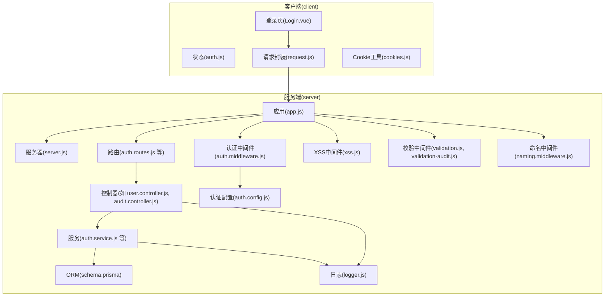
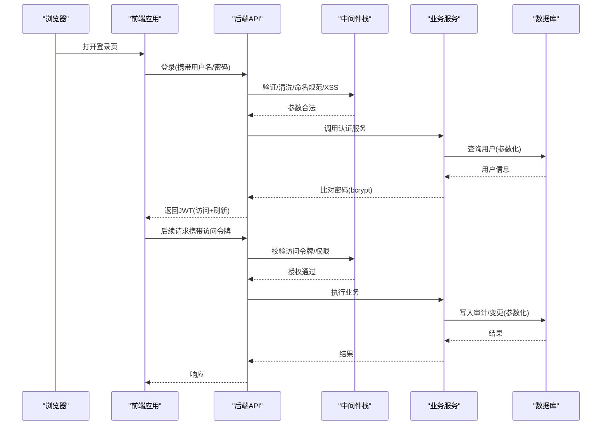
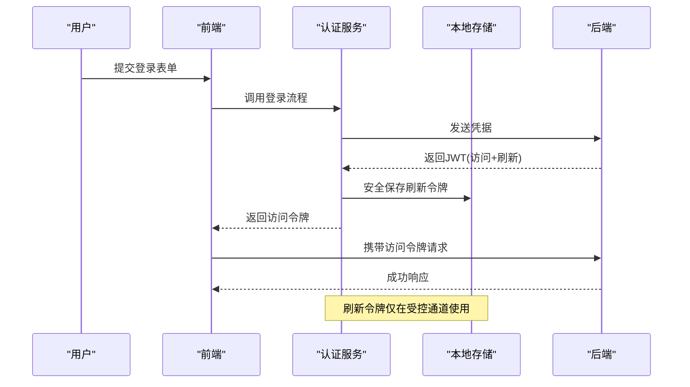
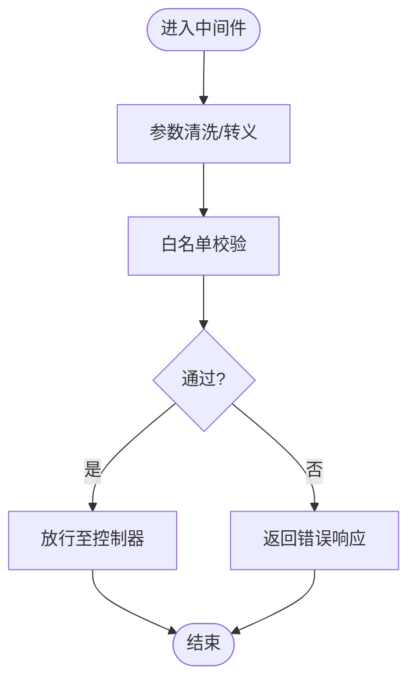
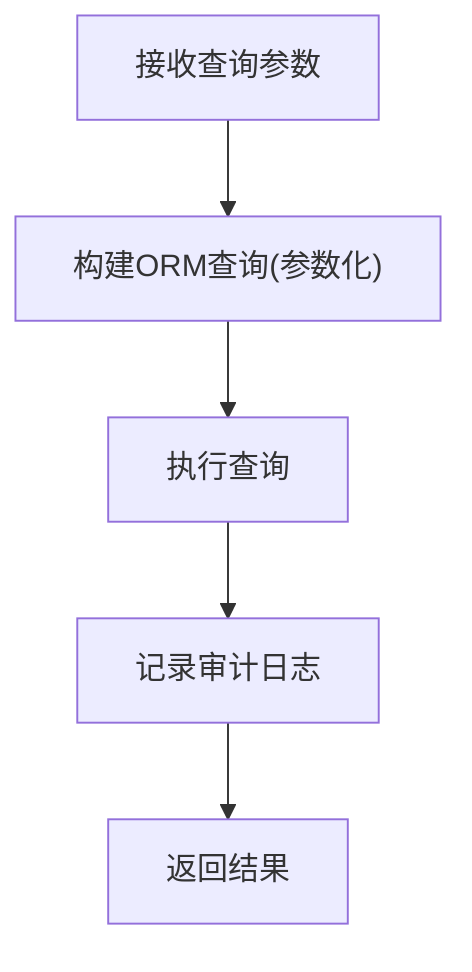
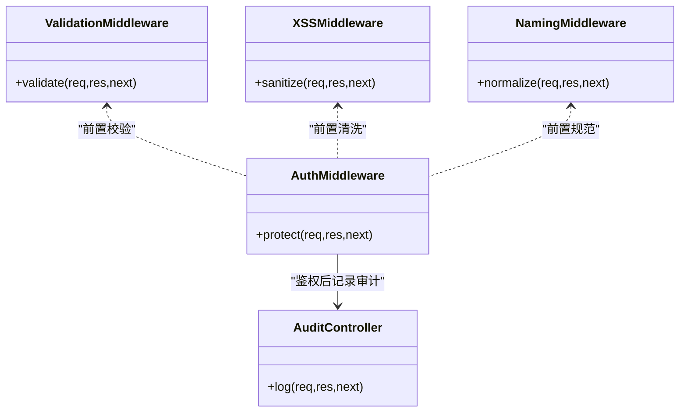
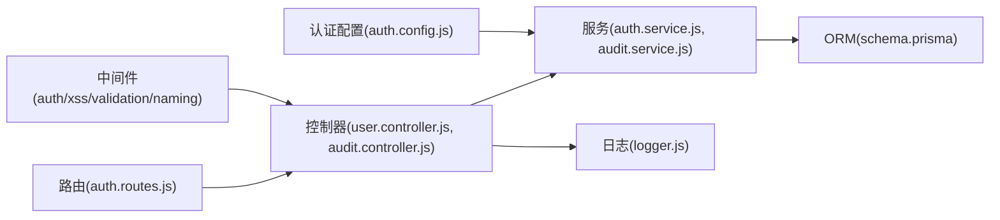

# 安全防护

<cite>
**本文引用的文件**
- [server/src/config/auth.config.js](file://server/src/config/auth.config.js)
- [server/src/middleware/auth.middleware.js](file://server/src/middleware/auth.middleware.js)
- [server/src/middleware/xss.js](file://server/src/middleware/xss.js)
- [server/src/middleware/validation.js](file://server/src/middleware/validation.js)
- [server/src/middleware/validation-audit.js](file://server/src/middleware/validation-audit.js)
- [server/src/middleware/naming.middleware.js](file://server/src/middleware/naming.middleware.js)
- [server/src/controllers/audit.controller.js](file://server/src/controllers/audit.controller.js)
- [server/src/services/audit.service.js](file://server/src/services/audit.service.js)
- [server/src/utils/logger.js](file://server/src/utils/logger.js)
- [server/src/routes/auth.routes.js](file://server/src/routes/auth.routes.js)
- [server/src/controllers/user.controller.js](file://server/src/controllers/user.controller.js)
- [server/src/services/auth.service.js](file://server/src/services/auth.service.js)
- [server/src/utils/error.js](file://server/src/utils/error.js)
- [server/src/app.js](file://server/src/app.js)
- [server/src/server.js](file://server/src/server.js)
- [client/src/stores/auth.js](file://client/src/stores/auth.js)
- [client/src/utils/request.js](file://client/src/utils/request.js)
- [client/src/utils/cookies.js](file://client/src/utils/cookies.js)
- [client/src/views/Login.vue](file://client/src/views/Login.vue)
- [server/prisma/schema.prisma](file://server/prisma/schema.prisma)
- [server/scripts/init-settings.js](file://server/scripts/init-settings.js)
- [docs/PRODUCTION_DEPLOYMENT.md](file://docs/PRODUCTION_DEPLOYMENT.md)
</cite>

## 目录
1. [引言](#引言)
2. [项目结构](#项目结构)
3. [核心组件](#核心组件)
4. [架构总览](#架构总览)
5. [详细组件分析](#详细组件分析)
6. [依赖关系分析](#依赖关系分析)
7. [性能考虑](#性能考虑)
8. [故障排除指南](#故障排除指南)
9. [结论](#结论)
10. [附录](#附录)

## 引言
本文件面向KEC课程管理平台的安全防护体系，系统性阐述后端JWT双令牌认证机制（访问令牌约15分钟+刷新令牌7天）、bcrypt密码加密、XSS防护、SQL注入防护、CSRF防护与中间件安全过滤逻辑，并给出生产环境最佳实践（HTTPS、CORS、文件上传安全、敏感数据保护），以及常见安全威胁的防范策略与应急响应建议。

## 项目结构
后端采用Express应用，按职责分层：路由、控制器、服务、中间件、配置与工具；前端通过统一请求封装调用后端接口；数据库使用Prisma ORM进行类型化访问。

图表来源
- [server/src/app.js](file://server/src/app.js)
- [server/src/server.js](file://server/src/server.js)
- [server/src/routes/auth.routes.js](file://server/src/routes/auth.routes.js)
- [server/src/controllers/user.controller.js](file://server/src/controllers/user.controller.js)
- [server/src/services/auth.service.js](file://server/src/services/auth.service.js)
- [server/src/middleware/auth.middleware.js](file://server/src/middleware/auth.middleware.js)
- [server/src/middleware/xss.js](file://server/src/middleware/xss.js)
- [server/src/middleware/validation.js](file://server/src/middleware/validation.js)
- [server/src/middleware/validation-audit.js](file://server/src/middleware/validation-audit.js)
- [server/src/middleware/naming.middleware.js](file://server/src/middleware/naming.middleware.js)
- [server/src/config/auth.config.js](file://server/src/config/auth.config.js)
- [server/src/utils/logger.js](file://server/src/utils/logger.js)
- [server/prisma/schema.prisma](file://server/prisma/schema.prisma)
- [client/src/views/Login.vue](file://client/src/views/Login.vue)
- [client/src/stores/auth.js](file://client/src/stores/auth.js)
- [client/src/utils/request.js](file://client/src/utils/request.js)
- [client/src/utils/cookies.js](file://client/src/utils/cookies.js)

章节来源
- [server/src/app.js](file://server/src/app.js)
- [server/src/server.js](file://server/src/server.js)
- [server/src/routes/auth.routes.js](file://server/src/routes/auth.routes.js)
- [server/prisma/schema.prisma](file://server/prisma/schema.prisma)

## 核心组件
- 认证与会话
  - JWT双令牌：访问令牌短期有效用于API访问，刷新令牌长期有效但严格保管，仅在受控通道交换新访问令牌。
  - bcrypt密码加密：用户密码入库前进行哈希处理，避免明文存储。
- 输入与输出安全
  - XSS防护：对请求体与查询参数进行转义与白名单过滤。
  - SQL注入防护：通过ORM（Prisma）生成参数化查询，避免原生SQL拼接。
  - CSRF防护：结合同源策略与安全Cookie属性，配合后端校验策略降低风险。
- 中间件安全过滤
  - 输入验证：统一参数校验与清洗，拒绝异常值。
  - 命名规范：限制资源名称长度与字符集，防止路径穿越与歧义。
  - 权限控制：基于角色/会话的访问控制，细粒度授权。
  - 审计日志：记录关键操作与异常事件，支持回溯与取证。
- 生产安全基线
  - HTTPS强制、安全响应头、CORS白名单、文件上传大小与类型限制、敏感字段脱敏展示。

章节来源
- [server/src/config/auth.config.js](file://server/src/config/auth.config.js)
- [server/src/middleware/auth.middleware.js](file://server/src/middleware/auth.middleware.js)
- [server/src/middleware/xss.js](file://server/src/middleware/xss.js)
- [server/src/middleware/validation.js](file://server/src/middleware/validation.js)
- [server/src/middleware/validation-audit.js](file://server/src/middleware/validation-audit.js)
- [server/src/middleware/naming.middleware.js](file://server/src/middleware/naming.middleware.js)
- [server/src/controllers/audit.controller.js](file://server/src/controllers/audit.controller.js)
- [server/src/services/audit.service.js](file://server/src/services/audit.service.js)
- [server/src/utils/logger.js](file://server/src/utils/logger.js)
- [server/prisma/schema.prisma](file://server/prisma/schema.prisma)

## 架构总览
下图展示从浏览器到数据库的完整请求链路及安全控制点。

图表来源
- [server/src/routes/auth.routes.js](file://server/src/routes/auth.routes.js)
- [server/src/middleware/auth.middleware.js](file://server/src/middleware/auth.middleware.js)
- [server/src/middleware/validation.js](file://server/src/middleware/validation.js)
- [server/src/middleware/xss.js](file://server/src/middleware/xss.js)
- [server/src/services/auth.service.js](file://server/src/services/auth.service.js)
- [server/src/controllers/audit.controller.js](file://server/src/controllers/audit.controller.js)
- [server/prisma/schema.prisma](file://server/prisma/schema.prisma)

## 详细组件分析

### 认证与会话（JWT双令牌）
- 访问令牌（短期）
  - 用途：日常API请求的身份凭证，有效期短以降低泄露风险。
  - 存储：通常置于内存或HttpOnly Cookie中，避免被脚本读取。
- 刷新令牌（长期）
  - 用途：在访问令牌过期时换取新的访问令牌。
  - 存储与传输：必须置于HttpOnly且Secure的Cookie中，仅在受信端点使用。
- 密码加密（bcrypt）
  - 入库前对用户密码进行哈希处理，禁止明文存储。
  - 验证时使用哈希比对，不暴露原始口令。
- 令牌撤销与轮换
  - 在管理员强制登出或检测到异常时，可将令牌加入黑名单或缩短有效期。
- 前端交互
  - 登录成功后持久化安全的刷新令牌，后续通过受控刷新接口更新访问令牌。
  - 请求失败自动尝试刷新并重试。

图表来源
- [server/src/routes/auth.routes.js](file://server/src/routes/auth.routes.js)
- [server/src/services/auth.service.js](file://server/src/services/auth.service.js)
- [client/src/views/Login.vue](file://client/src/views/Login.vue)
- [client/src/stores/auth.js](file://client/src/stores/auth.js)

章节来源
- [server/src/config/auth.config.js](file://server/src/config/auth.config.js)
- [server/src/middleware/auth.middleware.js](file://server/src/middleware/auth.middleware.js)
- [server/src/services/auth.service.js](file://server/src/services/auth.service.js)
- [client/src/stores/auth.js](file://client/src/stores/auth.js)

### XSS防护
- 输入清洗
  - 对所有请求参数（URL、查询、Body）执行白名单/黑名单策略，移除或转义危险字符。
- 输出转义
  - 前端渲染时对不可信数据进行HTML转义，避免DOM XSS。
- 内容安全策略（CSP）
  - 建议启用严格的CSP头，限制脚本来源与内联脚本执行。
- Cookie安全
  - 使用HttpOnly与SameSite属性，降低XSS窃取Cookie的风险。

图表来源
- [server/src/middleware/xss.js](file://server/src/middleware/xss.js)
- [server/src/middleware/validation.js](file://server/src/middleware/validation.js)

章节来源
- [server/src/middleware/xss.js](file://server/src/middleware/xss.js)
- [server/src/middleware/validation.js](file://server/src/middleware/validation.js)

### SQL注入防护
- ORM参数化
  - 使用Prisma进行数据访问，自动生成参数化查询，避免字符串拼接。
- 查询审计
  - 对复杂查询与批量操作进行审计日志记录，便于追踪潜在风险。
- 最小权限
  - 数据库连接使用最小必要权限账户，避免DDL/DML滥用。

图表来源
- [server/prisma/schema.prisma](file://server/prisma/schema.prisma)
- [server/src/services/audit.service.js](file://server/src/services/audit.service.js)

章节来源
- [server/prisma/schema.prisma](file://server/prisma/schema.prisma)
- [server/src/services/audit.service.js](file://server/src/services/audit.service.js)

### CSRF防护
- 同源策略
  - 严格区分可信来源，拒绝跨站请求。
- 安全Cookie
  - 刷新令牌置于HttpOnly与Secure Cookie中，降低被脚本读取风险。
- 受控刷新端点
  - 仅在受信任的端点进行令牌刷新，避免在公开页面发起刷新请求。

章节来源
- [server/src/middleware/auth.middleware.js](file://server/src/middleware/auth.middleware.js)
- [client/src/utils/cookies.js](file://client/src/utils/cookies.js)

### 中间件安全过滤逻辑
- 输入验证
  - 统一在中间件层进行参数类型、长度、范围与格式校验，拒绝异常输入。
- 参数清洗
  - 移除多余空白、转义特殊字符、截断超长字段。
- 命名规范
  - 对文件名、目录名、资源标识符进行字符集与长度限制，防止路径穿越。
- 权限控制
  - 基于角色/会话进行访问控制，细粒度授权。
- 审计日志
  - 记录登录、修改、删除等关键操作，保留时间戳、IP、用户、操作详情。

图表来源
- [server/src/middleware/validation.js](file://server/src/middleware/validation.js)
- [server/src/middleware/validation-audit.js](file://server/src/middleware/validation-audit.js)
- [server/src/middleware/xss.js](file://server/src/middleware/xss.js)
- [server/src/middleware/naming.middleware.js](file://server/src/middleware/naming.middleware.js)
- [server/src/middleware/auth.middleware.js](file://server/src/middleware/auth.middleware.js)
- [server/src/controllers/audit.controller.js](file://server/src/controllers/audit.controller.js)

章节来源
- [server/src/middleware/validation.js](file://server/src/middleware/validation.js)
- [server/src/middleware/validation-audit.js](file://server/src/middleware/validation-audit.js)
- [server/src/middleware/xss.js](file://server/src/middleware/xss.js)
- [server/src/middleware/naming.middleware.js](file://server/src/middleware/naming.middleware.js)
- [server/src/middleware/auth.middleware.js](file://server/src/middleware/auth.middleware.js)
- [server/src/controllers/audit.controller.js](file://server/src/controllers/audit.controller.js)

### 错误处理与异常审计
- 统一错误响应
  - 封装错误码、消息与上下文，避免泄露内部细节。
- 审计日志
  - 记录异常堆栈、请求上下文与用户身份，便于排查与溯源。
- 故障隔离
  - 对外部依赖失败进行降级与熔断，避免级联故障。

章节来源
- [server/src/utils/error.js](file://server/src/utils/error.js)
- [server/src/utils/logger.js](file://server/src/utils/logger.js)
- [server/src/controllers/audit.controller.js](file://server/src/controllers/audit.controller.js)

## 依赖关系分析
- 组件耦合
  - 控制器依赖服务层；服务层依赖ORM与日志；中间件贯穿请求生命周期。
- 外部依赖
  - Prisma ORM、Node.js运行时、Nginx（可选）。
- 安全依赖
  - bcrypt（密码哈希）、JWT（令牌）、CSP（前端安全策略）。

图表来源
- [server/src/routes/auth.routes.js](file://server/src/routes/auth.routes.js)
- [server/src/controllers/user.controller.js](file://server/src/controllers/user.controller.js)
- [server/src/controllers/audit.controller.js](file://server/src/controllers/audit.controller.js)
- [server/src/services/auth.service.js](file://server/src/services/auth.service.js)
- [server/src/services/audit.service.js](file://server/src/services/audit.service.js)
- [server/src/middleware/auth.middleware.js](file://server/src/middleware/auth.middleware.js)
- [server/src/middleware/xss.js](file://server/src/middleware/xss.js)
- [server/src/middleware/validation.js](file://server/src/middleware/validation.js)
- [server/src/middleware/naming.middleware.js](file://server/src/middleware/naming.middleware.js)
- [server/src/config/auth.config.js](file://server/src/config/auth.config.js)
- [server/prisma/schema.prisma](file://server/prisma/schema.prisma)
- [server/src/utils/logger.js](file://server/src/utils/logger.js)

章节来源
- [server/src/routes/auth.routes.js](file://server/src/routes/auth.routes.js)
- [server/src/controllers/user.controller.js](file://server/src/controllers/user.controller.js)
- [server/src/controllers/audit.controller.js](file://server/src/controllers/audit.controller.js)
- [server/src/services/auth.service.js](file://server/src/services/auth.service.js)
- [server/src/services/audit.service.js](file://server/src/services/audit.service.js)
- [server/src/middleware/auth.middleware.js](file://server/src/middleware/auth.middleware.js)
- [server/src/middleware/xss.js](file://server/src/middleware/xss.js)
- [server/src/middleware/validation.js](file://server/src/middleware/validation.js)
- [server/src/middleware/naming.middleware.js](file://server/src/middleware/naming.middleware.js)
- [server/src/config/auth.config.js](file://server/src/config/auth.config.js)
- [server/prisma/schema.prisma](file://server/prisma/schema.prisma)
- [server/src/utils/logger.js](file://server/src/utils/logger.js)

## 性能考虑
- 令牌缓存
  - 对频繁校验的令牌进行短期缓存，减少重复解析与数据库查询。
- 日志异步
  - 审计日志写入采用异步队列，避免阻塞主请求链路。
- 查询优化
  - 使用索引与分页，避免一次性加载大量数据。
- 前端缓存
  - 对静态资源与非敏感数据进行合理缓存，减轻后端压力。

## 故障排除指南
- 登录失败
  - 检查凭据是否正确，确认密码哈希匹配；查看审计日志定位失败原因。
- 401/403
  - 核对访问令牌是否过期或被吊销；确认刷新令牌是否来自受信端点。
- 参数错误
  - 检查中间件校验规则与清洗逻辑，确保请求符合白名单要求。
- 审计缺失
  - 确认审计中间件已挂载，日志模块正常工作，数据库写入无异常。
- 生产部署问题
  - 检查HTTPS证书、CORS配置、安全响应头与文件上传限制。

章节来源
- [server/src/utils/error.js](file://server/src/utils/error.js)
- [server/src/utils/logger.js](file://server/src/utils/logger.js)
- [server/src/controllers/audit.controller.js](file://server/src/controllers/audit.controller.js)
- [docs/PRODUCTION_DEPLOYMENT.md](file://docs/PRODUCTION_DEPLOYMENT.md)

## 结论
本安全防护体系通过“双令牌+bcrypt+中间件过滤+审计日志”的组合拳，覆盖了认证、输入、输出、权限与审计等关键环节。建议在生产环境中进一步完善CSP、HSTS、安全响应头与文件上传沙箱策略，并建立完善的应急响应流程与演练机制。

## 附录

### 安全配置最佳实践
- HTTPS部署
  - 强制HTTPS，启用HSTS，使用强密码套件与TLS版本。
- CORS跨域配置
  - 严格设置允许域名、方法与头部，避免通配符。
- 文件上传安全
  - 限制大小与类型，存储于独立目录并禁用执行权限，扫描病毒。
- 敏感数据保护
  - 数据库连接串与密钥使用环境变量管理，定期轮换；日志脱敏。

章节来源
- [docs/PRODUCTION_DEPLOYMENT.md](file://docs/PRODUCTION_DEPLOYMENT.md)

### 常见威胁与应对
- XSS
  - 输入清洗、输出转义、CSP、HttpOnly/SameSite。
- SQL注入
  - ORM参数化、最小权限、查询审计。
- CSRF
  - 同源策略、安全Cookie、受控刷新端点。
- 爆破与暴力破解
  - 登录频率限制、验证码、账户锁定策略。
- 敏感信息泄露
  - HTTPS、最小披露原则、日志脱敏。

章节来源
- [server/src/middleware/xss.js](file://server/src/middleware/xss.js)
- [server/src/middleware/validation.js](file://server/src/middleware/validation.js)
- [server/src/middleware/auth.middleware.js](file://server/src/middleware/auth.middleware.js)
- [server/prisma/schema.prisma](file://server/prisma/schema.prisma)