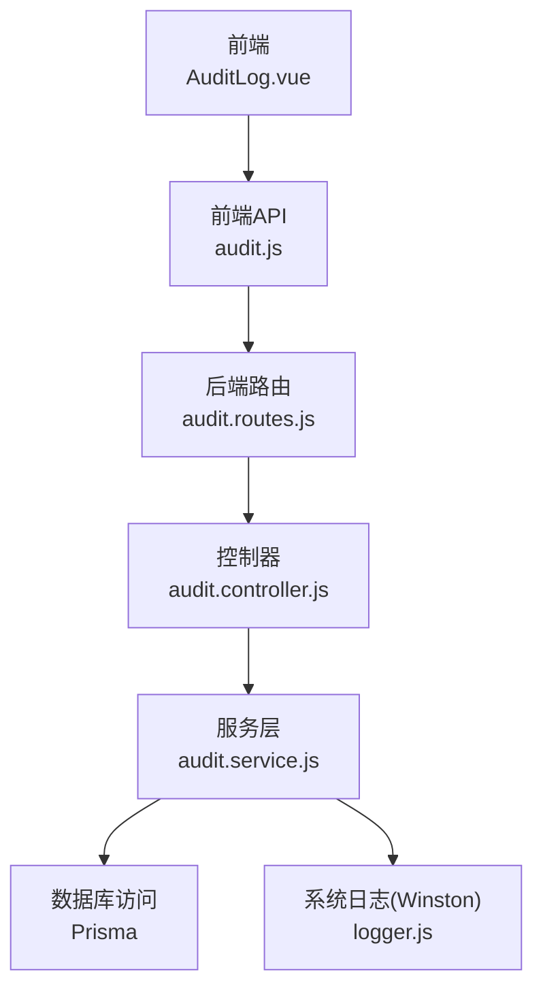
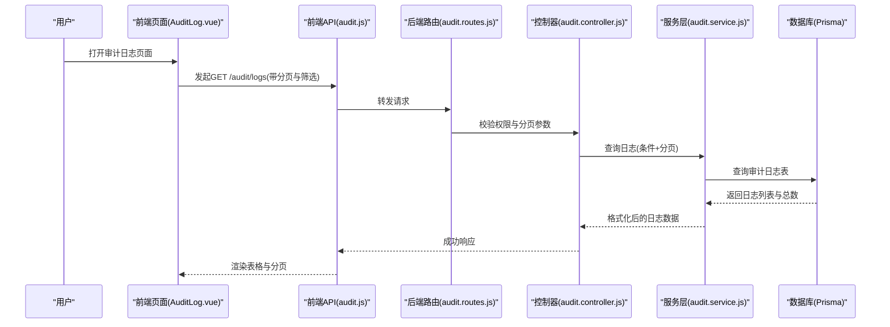
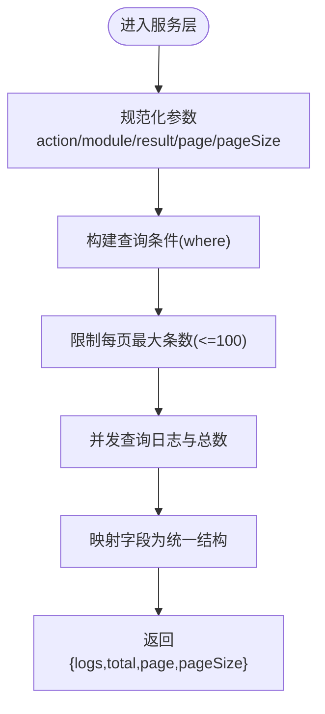
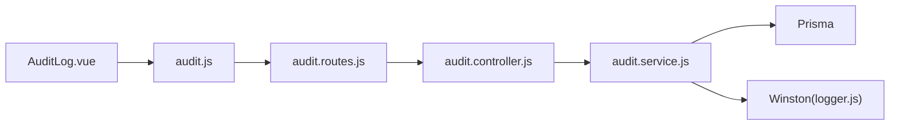

# 审计日志

<cite>
**本文引用的文件**
- [client/src/views/system/AuditLog.vue](file://client/src/views/system/AuditLog.vue)
- [client/src/api/audit.js](file://client/src/api/audit.js)
- [server/src/controllers/audit.controller.js](file://server/src/controllers/audit.controller.js)
- [server/src/services/audit.service.js](file://server/src/services/audit.service.js)
- [server/src/routes/audit.routes.js](file://server/src/routes/audit.routes.js)
- [server/src/utils/logger.js](file://server/src/utils/logger.js)
- [server/src/lib/prisma.js](file://server/src/lib/prisma.js)
- [server/src/middleware/validation-audit.js](file://server/src/middleware/validation-audit.js)
</cite>

## 目录
1. [简介](#简介)
2. [项目结构](#项目结构)
3. [核心组件](#核心组件)
4. [架构总览](#架构总览)
5. [详细组件分析](#详细组件分析)
6. [依赖关系分析](#依赖关系分析)
7. [性能与容量考虑](#性能与容量考虑)
8. [故障排查指南](#故障排查指南)
9. [结论](#结论)
10. [附录](#附录)

## 简介
本文件面向KEC课程管理平台的审计日志系统，系统性阐述日志记录机制、日志格式标准化、存储策略、查询与分析能力，以及安全事件监控与告警建议。当前实现覆盖用户操作日志（登录、登出、导入、导出、增删改等）、系统事件日志与安全相关事件的捕获与展示，支持按用户、时间范围、操作类型、模块与结果状态进行检索。

## 项目结构
审计日志功能在前后端分别由以下模块协同完成：
- 前端：提供审计日志列表页面、查询过滤器、分页与详情展示；通过API调用后端接口获取数据。
- 后端：提供审计日志查询接口，封装日志写入与读取逻辑；使用Prisma访问数据库；使用Winston记录系统级日志（含独立的审计日志文件）。
- 数据库：使用Prisma定义的审计日志表结构持久化日志。

图表来源
- [client/src/views/system/AuditLog.vue:1-449](file://client/src/views/system/AuditLog.vue#L1-L449)
- [client/src/api/audit.js:1-4](file://client/src/api/audit.js#L1-L4)
- [server/src/routes/audit.routes.js:1-14](file://server/src/routes/audit.routes.js#L1-L14)
- [server/src/controllers/audit.controller.js:1-22](file://server/src/controllers/audit.controller.js#L1-L22)
- [server/src/services/audit.service.js:1-94](file://server/src/services/audit.service.js#L1-L94)
- [server/src/utils/logger.js:1-96](file://server/src/utils/logger.js#L1-L96)
- [server/src/lib/prisma.js:1-34](file://server/src/lib/prisma.js#L1-L34)

章节来源
- [client/src/views/system/AuditLog.vue:1-449](file://client/src/views/system/AuditLog.vue#L1-L449)
- [client/src/api/audit.js:1-4](file://client/src/api/audit.js#L1-L4)
- [server/src/routes/audit.routes.js:1-14](file://server/src/routes/audit.routes.js#L1-L14)
- [server/src/controllers/audit.controller.js:1-22](file://server/src/controllers/audit.controller.js#L1-L22)
- [server/src/services/audit.service.js:1-94](file://server/src/services/audit.service.js#L1-L94)
- [server/src/utils/logger.js:1-96](file://server/src/utils/logger.js#L1-L96)
- [server/src/lib/prisma.js:1-34](file://server/src/lib/prisma.js#L1-L34)

## 核心组件
- 前端审计日志页面：提供操作类型、模块、结果状态的筛选，分页加载，详情表格/原始JSON切换，清空日志确认弹窗。
- 前端API：封装对后端审计日志接口的GET请求。
- 后端路由：受超级管理员角色保护，限制每页最大条目数。
- 控制器：解析查询参数并调用服务层。
- 服务层：负责日志写入（序列化详情、长度截断、异常记录到系统日志）、日志查询（条件过滤、分页、排序）。
- 日志工具：基于Winston，输出到文件与控制台，包含独立的审计日志文件。
- 数据库：通过Prisma访问审计日志表，返回原始字段名并映射为统一结构。

章节来源
- [client/src/views/system/AuditLog.vue:1-449](file://client/src/views/system/AuditLog.vue#L1-L449)
- [client/src/api/audit.js:1-4](file://client/src/api/audit.js#L1-L4)
- [server/src/routes/audit.routes.js:1-14](file://server/src/routes/audit.routes.js#L1-L14)
- [server/src/controllers/audit.controller.js:1-22](file://server/src/controllers/audit.controller.js#L1-L22)
- [server/src/services/audit.service.js:1-94](file://server/src/services/audit.service.js#L1-L94)
- [server/src/utils/logger.js:1-96](file://server/src/utils/logger.js#L1-L96)
- [server/src/lib/prisma.js:1-34](file://server/src/lib/prisma.js#L1-L34)

## 架构总览
审计日志从“业务操作”出发，经“日志写入”“持久化”“查询展示”三个阶段闭环。系统日志与审计日志分离，前者用于运行时问题追踪，后者聚焦业务行为审计。

图表来源
- [client/src/views/system/AuditLog.vue:1-449](file://client/src/views/system/AuditLog.vue#L1-L449)
- [client/src/api/audit.js:1-4](file://client/src/api/audit.js#L1-L4)
- [server/src/routes/audit.routes.js:1-14](file://server/src/routes/audit.routes.js#L1-L14)
- [server/src/controllers/audit.controller.js:1-22](file://server/src/controllers/audit.controller.js#L1-L22)
- [server/src/services/audit.service.js:1-94](file://server/src/services/audit.service.js#L1-L94)

## 详细组件分析

### 前端：审计日志页面与API
- 功能要点
  - 支持按操作类型（登录、登出、导入、导出、创建、更新、删除）、模块（认证、用户、班级、课程、教材、专业、学院、培养方案、培养层次、教师、教学安排、系统）、结果（成功/失败）筛选。
  - 分页与排序：默认按创建时间倒序，支持页大小切换。
  - 详情展示：支持表格视图与原始JSON视图切换。
  - 清空日志：弹窗确认，调用后端设置接口清空审计日志。
- 接口调用
  - 使用封装的GET /audit/logs，传入分页与筛选参数。
- 安全与可用性
  - 防止无效参数导致过大页大小，前端与后端均有限制。
  - 异常时提示并记录开发环境下的控制台信息。

章节来源
- [client/src/views/system/AuditLog.vue:1-449](file://client/src/views/system/AuditLog.vue#L1-L449)
- [client/src/api/audit.js:1-4](file://client/src/api/audit.js#L1-L4)

### 后端：路由、控制器与服务
- 路由与权限
  - GET /api/audit/logs 需要超级管理员角色，分页上限为100条/页。
- 控制器
  - 解析action/module/result/page/pageSize，调用服务层查询并返回统一结构。
- 服务层
  - 日志写入：接收action、module、userId、ip、details（对象或JSON字符串）、result、message；对details进行序列化与长度截断（超过阈值保留前缀并追加省略号）；异常时记录到系统日志但不中断业务。
  - 日志查询：根据条件构造where，分页取数并统计总数；返回统一字段结构（保留数据库原始字段名）。
- 数据库
  - 使用Prisma访问审计日志表，查询与计数并行执行，提升性能。

图表来源
- [server/src/services/audit.service.js:60-94](file://server/src/services/audit.service.js#L60-L94)
- [server/src/controllers/audit.controller.js:7-21](file://server/src/controllers/audit.controller.js#L7-L21)

章节来源
- [server/src/routes/audit.routes.js:1-14](file://server/src/routes/audit.routes.js#L1-L14)
- [server/src/controllers/audit.controller.js:1-22](file://server/src/controllers/audit.controller.js#L1-L22)
- [server/src/services/audit.service.js:1-94](file://server/src/services/audit.service.js#L1-L94)

### 日志格式标准化
- 字段规范（来自服务层写入与查询）
  - 时间戳：created_at（数据库字段，查询时按降序排列）
  - 用户标识：operator_id（可为空）
  - 操作类型：action（枚举：login/logout/import/export/create/update/delete）
  - 所属模块：module（枚举：auth/user/class/course/textbook/major/college/trainingPlan/training_level/teacher/teachingArrange/system）
  - IP地址：ip（可为空）
  - 结果状态：result（枚举：success/failed）
  - 消息：message（可为空）
  - 详情：details（字符串，最大长度截断，对象将被序列化）
  - ID：id（主键）
- 前端展示
  - 时间格式化为本地日期时间字符串
  - 操作类型与模块标签化显示
  - 结果状态以标签区分成功/失败
  - IP地址以等宽字体展示，缺失时显示占位符

章节来源
- [server/src/services/audit.service.js:15-49](file://server/src/services/audit.service.js#L15-L49)
- [server/src/services/audit.service.js:80-90](file://server/src/services/audit.service.js#L80-L90)
- [client/src/views/system/AuditLog.vue:76-127](file://client/src/views/system/AuditLog.vue#L76-L127)

### 日志存储策略
- 存储位置
  - 系统日志：server/logs 目录下，包含 error.log、combined.log、audit.log 三个文件。
- 日志级别与轮转
  - Winston File Transport：单文件最大5MB，超过自动轮转，保留多份历史文件（审计日志20份，其他10份）。
  - 控制台输出：开发环境彩色输出，生产环境无色输出，保证一致性。
- 审计日志写入
  - 业务日志写入Prisma审计表；审计失败会记录到Winston的audit.log中，便于生产环境监控与告警。

章节来源
- [server/src/utils/logger.js:34-85](file://server/src/utils/logger.js#L34-L85)
- [server/src/services/audit.service.js:37-48](file://server/src/services/audit.service.js#L37-L48)

### 日志查询与分析能力
- 前端查询
  - 支持按操作类型、模块、结果状态筛选；分页与排序；查看详情（表格/原始JSON）。
- 后端查询
  - 条件过滤：action/module/result
  - 分页与上限：默认20条/页，最大100条/页
  - 排序：按创建时间降序
- 建议扩展
  - 时间范围筛选：可在后端增加开始/结束时间参数并在where中组合。
  - 多维度聚合：结合数据库索引与视图，支持按用户、模块、操作类型统计趋势。
  - 导出能力：支持将筛选结果导出为CSV/Excel，便于离线分析。

章节来源
- [client/src/views/system/AuditLog.vue:15-64](file://client/src/views/system/AuditLog.vue#L15-L64)
- [client/src/views/system/AuditLog.vue:362-385](file://client/src/views/system/AuditLog.vue#L362-L385)
- [server/src/controllers/audit.controller.js:9-16](file://server/src/controllers/audit.controller.js#L9-L16)
- [server/src/services/audit.service.js:60-77](file://server/src/services/audit.service.js#L60-L77)

### 安全事件监控与告警建议
- 已有机制
  - 审计日志写入失败会被记录到系统日志（audit.log），生产环境应监控该文件并建立告警。
  - 审计日志查询接口受超级管理员角色保护，降低未授权访问风险。
- 建议增强
  - 异常登录尝试：在认证流程中记录失败尝试（含IP、用户名、时间），并触发阈值告警。
  - 权限变更：记录角色/权限调整操作，包含变更前后对比。
  - 敏感数据访问：对关键资源（如学生名单、成绩）访问进行专项审计并分级告警。
  - 实时告警：对接监控系统（如Prometheus/Grafana或日志聚合平台），对高危模式（短时间内大量失败登录、批量删除、越权访问）实时告警。

章节来源
- [server/src/utils/logger.js:52-58](file://server/src/utils/logger.js#L52-L58)
- [server/src/routes/audit.routes.js:11](file://server/src/routes/audit.routes.js#L11)
- [server/src/services/audit.service.js:37-48](file://server/src/services/audit.service.js#L37-L48)

## 依赖关系分析
- 前端依赖
  - Element Plus用于UI组件与布局
  - 自定义request封装HTTP请求
- 后端依赖
  - Express路由与中间件
  - Prisma ORM访问数据库
  - Winston日志系统
  - express-validator用于参数校验（审计清空接口）

图表来源
- [client/src/views/system/AuditLog.vue:1-449](file://client/src/views/system/AuditLog.vue#L1-L449)
- [client/src/api/audit.js:1-4](file://client/src/api/audit.js#L1-L4)
- [server/src/routes/audit.routes.js:1-14](file://server/src/routes/audit.routes.js#L1-L14)
- [server/src/controllers/audit.controller.js:1-22](file://server/src/controllers/audit.controller.js#L1-L22)
- [server/src/services/audit.service.js:1-94](file://server/src/services/audit.service.js#L1-L94)
- [server/src/utils/logger.js:1-96](file://server/src/utils/logger.js#L1-L96)
- [server/src/lib/prisma.js:1-34](file://server/src/lib/prisma.js#L1-L34)

章节来源
- [client/src/views/system/AuditLog.vue:1-449](file://client/src/views/system/AuditLog.vue#L1-L449)
- [client/src/api/audit.js:1-4](file://client/src/api/audit.js#L1-L4)
- [server/src/routes/audit.routes.js:1-14](file://server/src/routes/audit.routes.js#L1-L14)
- [server/src/controllers/audit.controller.js:1-22](file://server/src/controllers/audit.controller.js#L1-L22)
- [server/src/services/audit.service.js:1-94](file://server/src/services/audit.service.js#L1-L94)
- [server/src/utils/logger.js:1-96](file://server/src/utils/logger.js#L1-L96)
- [server/src/lib/prisma.js:1-34](file://server/src/lib/prisma.js#L1-L34)

## 性能与容量考虑
- 查询性能
  - 并发查询日志与总数，减少往返次数。
  - 限制每页最大条目数，避免大页导致内存压力。
- 写入性能
  - 对details进行序列化与长度截断，避免单条记录过大影响存储与查询。
  - 异常写入记录到系统日志，不影响主流程。
- 存储容量
  - 文件轮转策略（单文件5MB，保留多份），建议定期清理与归档旧日志。
  - 建议对高频模块增加数据库索引（如module、action、result、created_at）以优化查询。

章节来源
- [server/src/services/audit.service.js:60-77](file://server/src/services/audit.service.js#L60-L77)
- [server/src/services/audit.service.js:17-24](file://server/src/services/audit.service.js#L17-L24)
- [server/src/utils/logger.js:40-58](file://server/src/utils/logger.js#L40-L58)

## 故障排查指南
- 前端无法加载日志
  - 检查网络请求是否正确调用GET /audit/logs，确认筛选参数与分页参数。
  - 查看浏览器控制台是否有错误信息。
- 后端查询异常
  - 检查路由权限（需超级管理员）与分页参数合法性。
  - 关注服务层异常处理：写入失败会记录到系统日志，检查audit.log。
- 日志未落盘
  - 检查logs目录是否存在且具备写权限。
  - 确认Winston File Transport配置与轮转策略。
- 数据库连接问题
  - 检查Prisma连接配置与数据库可达性；开发环境会监听Prisma事件并输出到系统日志。

章节来源
- [client/src/views/system/AuditLog.vue:377-381](file://client/src/views/system/AuditLog.vue#L377-L381)
- [server/src/controllers/audit.controller.js:18-20](file://server/src/controllers/audit.controller.js#L18-L20)
- [server/src/services/audit.service.js:37-48](file://server/src/services/audit.service.js#L37-L48)
- [server/src/utils/logger.js:8-12](file://server/src/utils/logger.js#L8-L12)
- [server/src/lib/prisma.js:24-33](file://server/src/lib/prisma.js#L24-L33)

## 结论
KEC课程管理平台的审计日志系统已实现基础的用户操作日志记录、查询与展示，并通过Winston实现了系统日志与审计日志的分离存储。建议后续补充时间范围筛选、导出能力、安全事件监控与告警机制，以满足更严格的合规与安全需求。

## 附录
- 审计日志清空接口
  - 当前前端通过POST /settings/reset/audit-logs触发清空，后端提供清空验证规则（确认参数需为DELETE）。
- 常见字段枚举参考
  - 操作类型：login、logout、import、export、create、update、delete
  - 模块：auth、user、class、course、textbook、major、college、trainingPlan、training_level、teacher、teachingArrange、system
  - 结果：success、failed

章节来源
- [client/src/views/system/AuditLog.vue:351-359](file://client/src/views/system/AuditLog.vue#L351-L359)
- [server/src/middleware/validation-audit.js:7-10](file://server/src/middleware/validation-audit.js#L7-L10)