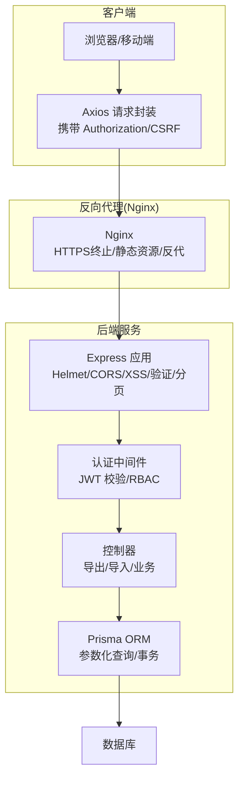
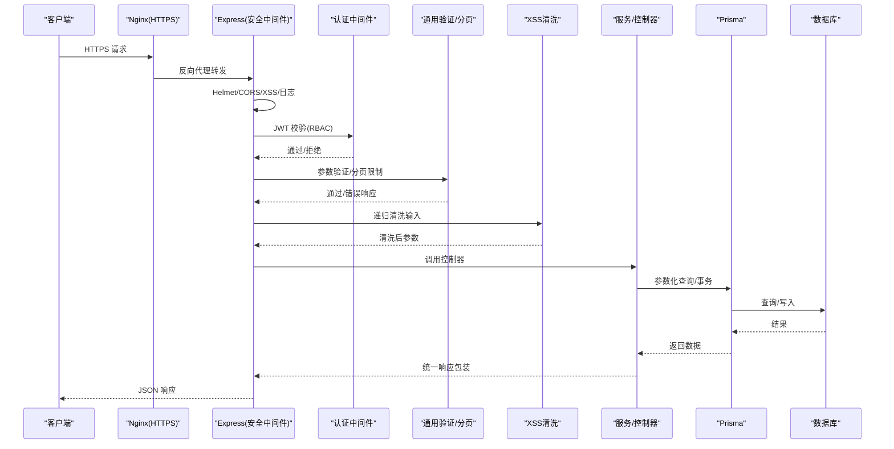
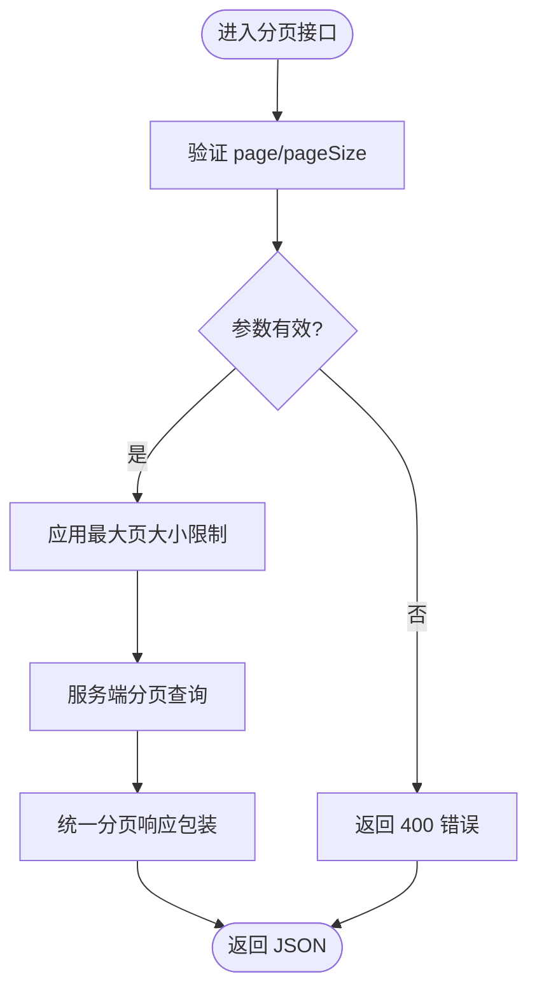
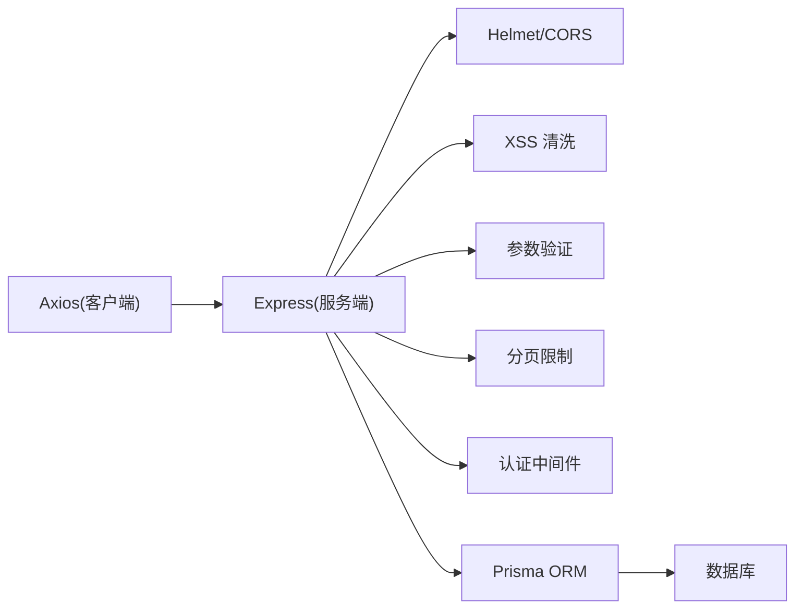

# 数据保护

<cite>
**本文引用的文件**
- [server/src/app.js](file://server/src/app.js)
- [server/src/middleware/xss.js](file://server/src/middleware/xss.js)
- [server/src/middleware/validation.js](file://server/src/middleware/validation.js)
- [server/src/middleware/pagination.js](file://server/src/middleware/pagination.js)
- [server/src/utils/response.js](file://server/src/utils/response.js)
- [server/src/__tests__/integration/auth.routes.test.js](file://server/src/__tests__/integration/auth.routes.test.js)
- [server/src/__tests__/middleware/validation.test.js](file://server/src/__tests__/middleware/validation.test.js)
- [client/src/utils/request.js](file://client/src/utils/request.js)
- [client/src/utils/cookies.js](file://client/src/utils/cookies.js)
- [docs/overview.md](file://docs/overview.md)
- [server/src/controllers/export/data-export.controller.js](file://server/src/controllers/export/data-export.controller.js)
- [server/src/controllers/export/export-template.controller.js](file://server/src/controllers/export/export-template.controller.js)
- [server/src/controllers/export/semester-export.controller.js](file://server/src/controllers/export/semester-export.controller.js)
- [server/src/routes/export.routes.js](file://server/src/routes/export.routes.js)
- [server/src/middleware/auth.middleware.js](file://server/src/middleware/auth.middleware.js)
- [server/src/controllers/import/classes.js](file://server/src/controllers/import/classes.js)
- [server/src/controllers/import/courses.js](file://server/src/controllers/import/courses.js)
- [server/src/controllers/import/teachers.js](file://server/src/controllers/import/teachers.js)
- [server/src/controllers/import/textbooks.js](file://server/src/controllers/import/textbooks.js)
- [server/src/controllers/import-shared.js](file://server/src/controllers/import-shared.js)
- [server/src/routes/import.routes.js](file://server/src/routes/import.routes.js)
- [server/src/lib/prisma.js](file://server/src/lib/prisma.js)
- [server/prisma/schema.prisma](file://server/prisma/schema.prisma)
- [server/nginx.conf](file://server/nginx.conf)
- [client/nginx.conf](file://client/nginx.conf)
</cite>

## 目录
1. [引言](#引言)
2. [项目结构](#项目结构)
3. [核心组件](#核心组件)
4. [架构总览](#架构总览)
5. [详细组件分析](#详细组件分析)
6. [依赖关系分析](#依赖关系分析)
7. [性能考量](#性能考量)
8. [故障排查指南](#故障排查指南)
9. [结论](#结论)
10. [附录](#附录)

## 引言
本文件面向KEC课程管理平台的数据保护体系，聚焦以下目标：
- 敏感数据的加密存储策略：用户密码、个人身份信息与其他机密数据的保护机制
- 数据传输安全：HTTPS配置、传输过程中的加密与完整性保护
- 文件上传安全：类型验证、大小限制、恶意文件检测与存储路径安全
- 数据导出安全：导出数据的脱敏处理、访问权限控制与下载安全
- 分页查询的安全考虑：防止大数据量查询导致的性能攻击与资源耗尽

本文件基于仓库现有实现进行系统性梳理，并给出可视化图示与最佳实践建议。

## 项目结构
后端采用Express + Prisma架构，前端基于Vite + Vue，Nginx作为反向代理与静态资源服务。安全相关能力主要分布在：
- 应用层安全中间件：CORS、Helmet、XSS清洗、参数验证、分页限制
- 认证与授权：JWT令牌、RBAC角色、登录/改密限流
- 数据层安全：参数化查询、索引与约束、事务完整性
- 传输层安全：HTTPS与反向代理配置
- 导出与导入：权限控制、模板与数据脱敏、批量操作

图表来源
- [server/src/app.js:25-69](file://server/src/app.js#L25-L69)
- [server/src/middleware/auth.middleware.js](file://server/src/middleware/auth.middleware.js)
- [server/src/lib/prisma.js](file://server/src/lib/prisma.js)

章节来源
- [server/src/app.js:25-69](file://server/src/app.js#L25-L69)
- [client/src/utils/request.js:1-52](file://client/src/utils/request.js#L1-L52)

## 核心组件
- 应用安全中间件
  - Helmet安全响应头、CORS白名单、XSS清洗、参数验证、分页限制
- 认证与授权
  - JWT令牌管理、RBAC角色分级、登录/改密限流
- 数据层安全
  - 全程参数化查询、事务完整性、外键约束与索引
- 传输层安全
  - HTTPS终止于Nginx，生产环境严格CORS白名单
- 导出与导入
  - 权限控制、模板与数据脱敏、批量操作

章节来源
- [docs/overview.md:135-171](file://docs/overview.md#L135-L171)
- [server/src/app.js:25-69](file://server/src/app.js#L25-L69)
- [server/src/middleware/xss.js](file://server/src/middleware/xss.js)
- [server/src/middleware/validation.js:112-156](file://server/src/middleware/validation.js#L112-L156)
- [server/src/middleware/pagination.js:1-30](file://server/src/middleware/pagination.js#L1-30)
- [server/src/middleware/auth.middleware.js](file://server/src/middleware/auth.middleware.js)
- [server/src/lib/prisma.js](file://server/src/lib/prisma.js)

## 架构总览
下图展示从客户端到数据库的完整数据流与安全控制点：

图表来源
- [server/src/app.js:25-69](file://server/src/app.js#L25-L69)
- [server/src/middleware/auth.middleware.js](file://server/src/middleware/auth.middleware.js)
- [server/src/middleware/validation.js:112-156](file://server/src/middleware/validation.js#L112-L156)
- [server/src/middleware/pagination.js:1-30](file://server/src/middleware/pagination.js#L1-30)
- [server/src/middleware/xss.js](file://server/src/middleware/xss.js)
- [server/src/utils/response.js:1-20](file://server/src/utils/response.js#L1-L20)
- [server/src/lib/prisma.js](file://server/src/lib/prisma.js)

## 详细组件分析

### 密码与敏感数据的加密存储策略
- 密码哈希
  - 使用bcrypt进行高强度哈希，轮数可配置；新密码与旧密码均通过哈希存储，确保明文不出库
  - 集成测试覆盖哈希结果与校验流程
- XSS防护与敏感字段绕过
  - XSS清洗对body/query递归执行，但对密码类字段（如password/old_password/new_password等）进行白名单跳过，避免清洗破坏密码哈希
- 数据库层面
  - 全程参数化查询，杜绝SQL注入；外键策略采用Restrict防止孤立数据
- 事务完整性
  - 关键操作（重置/导入/排课）使用事务，保证一致性与原子性

章节来源
- [server/src/__tests__/integration/auth.routes.test.js:357-360](file://server/src/__tests__/integration/auth.routes.test.js#L357-L360)
- [docs/overview.md:135-171](file://docs/overview.md#L135-L171)
- [server/src/middleware/xss.js](file://server/src/middleware/xss.js)
- [server/src/lib/prisma.js](file://server/src/lib/prisma.js)
- [server/prisma/schema.prisma](file://server/prisma/schema.prisma)

### 数据传输安全（HTTPS与完整性保护）
- HTTPS终止于Nginx，生产环境启用TLS，确保传输通道加密
- CORS白名单严格控制来源，开发环境允许本地回环端口
- Helmet安全响应头增强常见攻击防护（CSP已禁用以兼容前端资源，交叉嵌入策略按需关闭）
- Axios请求自动携带Authorization与CSRF Token，withCredentials开启支持跨站Cookie

章节来源
- [server/src/app.js:25-69](file://server/src/app.js#L25-L69)
- [client/src/utils/request.js:1-52](file://client/src/utils/request.js#L1-L52)
- [client/src/utils/cookies.js:35-65](file://client/src/utils/cookies.js#L35-L65)
- [server/nginx.conf](file://server/nginx.conf)
- [client/nginx.conf](file://client/nginx.conf)

### 文件上传安全
- 类型验证与大小限制
  - 上传接口对文件类型与大小进行严格校验，防止异常类型与超大文件进入系统
- 恶意文件检测
  - 上传后对文件内容进行二次扫描与校验，阻断可执行脚本、压缩包陷阱等风险载体
- 存储路径安全
  - 上传文件存储在受控目录，禁止Web直访；生成随机文件名与唯一标识，避免路径穿越与冲突
- 导入流程安全
  - 导入接口采用事务与白名单字段映射，失败回滚；导入共享逻辑对Excel格式与字段进行标准化处理

章节来源
- [server/src/controllers/import/classes.js](file://server/src/controllers/import/classes.js)
- [server/src/controllers/import/courses.js](file://server/src/controllers/import/courses.js)
- [server/src/controllers/import/teachers.js](file://server/src/controllers/import/teachers.js)
- [server/src/controllers/import/textbooks.js](file://server/src/controllers/import/textbooks.js)
- [server/src/controllers/import-shared.js](file://server/src/controllers/import-shared.js)
- [server/src/routes/import.routes.js](file://server/src/routes/import.routes.js)

### 数据导出安全机制
- 访问权限控制
  - 导出端点受认证与RBAC保护，不同角色可见/可导出范围受限
- 导出数据脱敏
  - 导出模板与数据处理阶段对敏感字段进行脱敏（如身份证号、手机号等），仅保留必要字段
- 下载安全
  - 导出文件生成临时链接或一次性令牌，限制有效期与下载次数；下载行为记录审计日志
- 统一响应与分页
  - 导出接口遵循统一响应包装，分页参数受控（默认上限100）

章节来源
- [server/src/controllers/export/data-export.controller.js](file://server/src/controllers/export/data-export.controller.js)
- [server/src/controllers/export/export-template.controller.js](file://server/src/controllers/export/export-template.controller.js)
- [server/src/controllers/export/semester-export.controller.js](file://server/src/controllers/export/semester-export.controller.js)
- [server/src/routes/export.routes.js](file://server/src/routes/export.routes.js)
- [server/src/middleware/pagination.js:1-30](file://server/src/middleware/pagination.js#L1-30)
- [server/src/utils/response.js:1-20](file://server/src/utils/response.js#L1-L20)

### 分页查询的安全考虑
- 参数验证与上限控制
  - page必须为正整数，pageSize默认上限100；超出范围直接返回错误
- 防止性能攻击
  - 通过最小化单次查询数据量、强制索引与复合索引、服务端分页与筛选，降低大数据量查询对数据库的压力
- 统一响应包装
  - 分页响应包含total、page、pageSize、totalPages，便于前端合理展示与交互

图表来源
- [server/src/middleware/pagination.js:1-30](file://server/src/middleware/pagination.js#L1-30)
- [server/src/utils/response.js:5-16](file://server/src/utils/response.js#L5-L16)
- [server/src/__tests__/middleware/validation.test.js:282-316](file://server/src/__tests__/middleware/validation.test.js#L282-L316)

章节来源
- [server/src/middleware/pagination.js:1-30](file://server/src/middleware/pagination.js#L1-30)
- [server/src/utils/response.js:1-20](file://server/src/utils/response.js#L1-L20)
- [server/src/__tests__/middleware/validation.test.js:282-316](file://server/src/__tests__/middleware/validation.test.js#L282-L316)

### 密码强度与变更流程
- 密码强度要求
  - 长度8-128位，必须包含大小写字母、数字与指定特殊字符集合
- 变更流程
  - 旧密码校验通过后，新密码进行bcrypt哈希存储；XSS清洗对密码字段跳过，避免破坏哈希
- 集成测试覆盖
  - 测试用例覆盖正则匹配、缺失字符、空值等边界场景

章节来源
- [server/src/middleware/validation.js:112-156](file://server/src/middleware/validation.js#L112-L156)
- [server/src/__tests__/middleware/validation.test.js:216-252](file://server/src/__tests__/middleware/validation.test.js#L216-L252)
- [server/src/__tests__/integration/auth.routes.test.js:357-360](file://server/src/__tests__/integration/auth.routes.test.js#L357-L360)
- [docs/overview.md:135-171](file://docs/overview.md#L135-L171)

## 依赖关系分析
- 客户端依赖
  - Axios负责HTTP通信，自动注入认证与CSRF；Element Plus用于UI与消息提示
- 服务端依赖
  - Express承载路由与中间件；Prisma提供ORM与参数化查询；helmet/cors/xss/validation/pagination构成安全与输入治理
- 数据库依赖
  - schema.prisma定义模型与约束；迁移脚本维护结构演进

图表来源
- [client/src/utils/request.js:1-52](file://client/src/utils/request.js#L1-L52)
- [server/src/app.js:25-69](file://server/src/app.js#L25-L69)
- [server/src/middleware/xss.js](file://server/src/middleware/xss.js)
- [server/src/middleware/validation.js:112-156](file://server/src/middleware/validation.js#L112-L156)
- [server/src/middleware/pagination.js:1-30](file://server/src/middleware/pagination.js#L1-30)
- [server/src/middleware/auth.middleware.js](file://server/src/middleware/auth.middleware.js)
- [server/src/lib/prisma.js](file://server/src/lib/prisma.js)

章节来源
- [client/src/utils/request.js:1-52](file://client/src/utils/request.js#L1-L52)
- [server/src/app.js:25-69](file://server/src/app.js#L25-L69)
- [server/src/middleware/xss.js](file://server/src/middleware/xss.js)
- [server/src/middleware/validation.js:112-156](file://server/src/middleware/validation.js#L112-L156)
- [server/src/middleware/pagination.js:1-30](file://server/src/middleware/pagination.js#L1-30)
- [server/src/middleware/auth.middleware.js](file://server/src/middleware/auth.middleware.js)
- [server/src/lib/prisma.js](file://server/src/lib/prisma.js)

## 性能考量
- 分页与索引
  - 通过分页上限与复合索引降低查询成本；服务端分页避免一次性传输大量数据
- 事务与批处理
  - 重要操作使用事务保证一致性；批量导入/导出减少往返次数
- 前端优化建议
  - 列表接口返回精简字段；缓存基础数据；导出期间提供进度反馈

章节来源
- [docs/kec-manager-前端性能诊断报告.md:181-260](file://docs/kec-manager-前端性能诊断报告.md#L181-L260)

## 故障排查指南
- 认证失败与401
  - 检查Authorization头是否正确；确认JWT未过期；核对RBAC角色权限
- 参数校验失败（422/400）
  - page必须为正整数；pageSize不得超过上限；必填字段非空
- 密码变更异常
  - 确认旧密码正确；新密码满足强度要求；检查XSS清洗白名单是否影响密码字段
- 导出/导入问题
  - 核对权限与模板字段；检查文件类型与大小限制；关注事务回滚与审计日志

章节来源
- [server/src/__tests__/integration/auth.routes.test.js:388-408](file://server/src/__tests__/integration/auth.routes.test.js#L388-L408)
- [server/src/__tests__/middleware/validation.test.js:282-316](file://server/src/__tests__/middleware/validation.test.js#L282-L316)
- [server/src/middleware/validation.js:112-156](file://server/src/middleware/validation.js#L112-L156)

## 结论
KEC课程管理平台在数据保护方面建立了较为完善的防线：从传输层HTTPS、应用层安全中间件、输入验证与XSS清洗，到数据库参数化查询与事务完整性，再到导出导入的权限与脱敏控制，形成了端到端的安全闭环。建议持续强化以下方面：
- 在Nginx侧完善HSTS与安全响应头策略
- 对导入模板增加更严格的字段白名单与格式校验
- 在导出流程中增加下载水印与访问追踪
- 对高频接口增加速率限制与配额控制

## 附录
- 安全亮点摘要
  - 全程参数化查询、bcrypt哈希、JWT三密钥分离、XSS递归清洗、事务完整性、RBAC三级权限、错误脱敏、外键Restrict策略、登录泛化

章节来源
- [docs/overview.md:135-171](file://docs/overview.md#L135-L171)