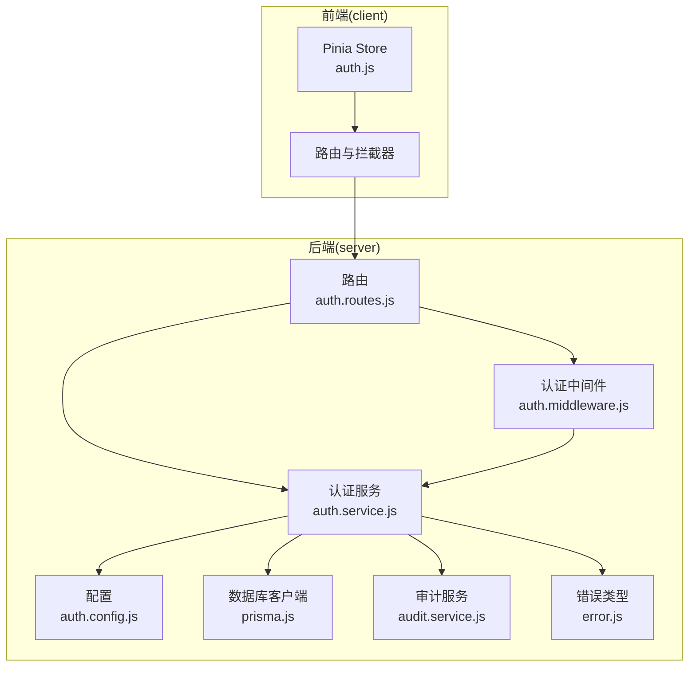
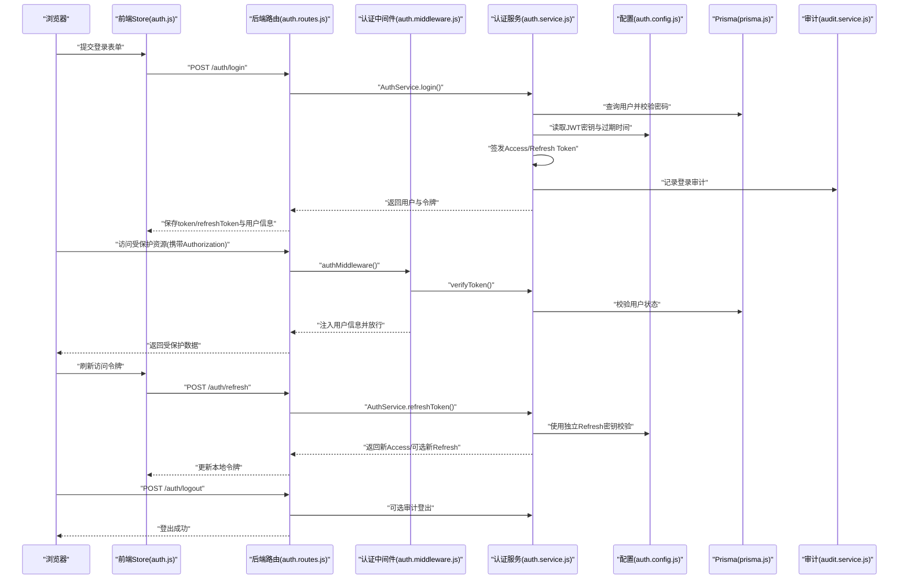
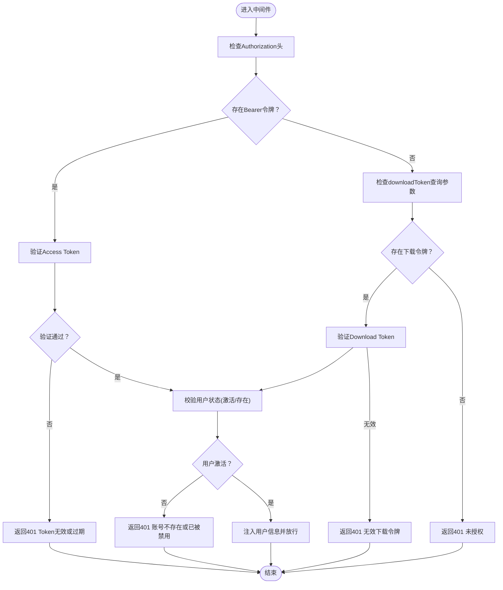
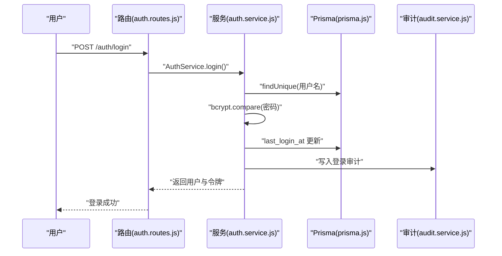
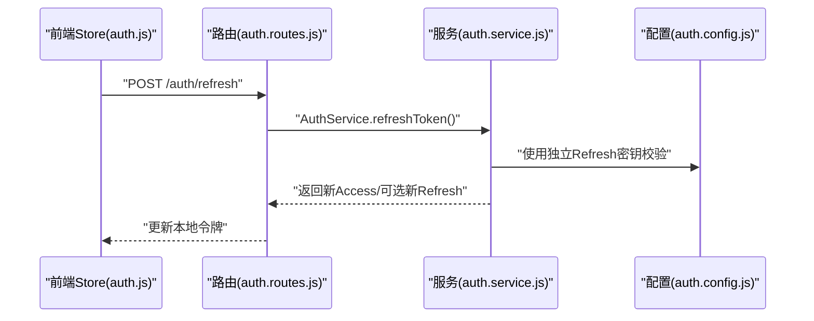
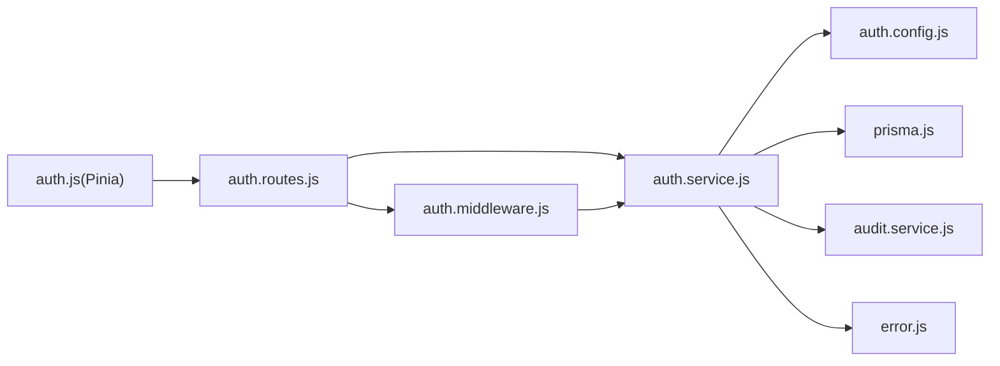

# 认证与授权

<cite>
**本文引用的文件**
- [server/src/config/auth.config.js](file://server/src/config/auth.config.js)
- [server/src/services/auth.service.js](file://server/src/services/auth.service.js)
- [server/src/middleware/auth.middleware.js](file://server/src/middleware/auth.middleware.js)
- [server/src/routes/auth.routes.js](file://server/src/routes/auth.routes.js)
- [client/src/stores/auth.js](file://client/src/stores/auth.js)
- [server/src/utils/error.js](file://server/src/utils/error.js)
- [server/src/services/audit.service.js](file://server/src/services/audit.service.js)
- [server/src/lib/prisma.js](file://server/src/lib/prisma.js)
</cite>

## 目录
1. [简介](#简介)
2. [项目结构](#项目结构)
3. [核心组件](#核心组件)
4. [架构总览](#架构总览)
5. [详细组件分析](#详细组件分析)
6. [依赖关系分析](#依赖关系分析)
7. [性能考虑](#性能考虑)
8. [故障排查指南](#故障排查指南)
9. [结论](#结论)
10. [附录](#附录)

## 简介
本文件面向KEC课程管理平台的认证与授权系统，系统采用JWT双令牌机制：访问令牌（Access Token，15分钟）与刷新令牌（Refresh Token，7天）。密码以bcrypt进行加盐哈希存储与验证。后端提供统一认证中间件与基于角色的权限控制，前端通过Pinia Store管理会话状态、令牌轮换与安全退出。本文档覆盖设计原理、实现细节、流程图与时序图，并给出最佳实践与排障建议。

## 项目结构
认证与授权相关代码主要分布在以下位置：
- 服务端配置与业务逻辑：server/src/config/auth.config.js、server/src/services/auth.service.js、server/src/middleware/auth.middleware.js、server/src/routes/auth.routes.js
- 前端状态管理：client/src/stores/auth.js
- 其他支撑模块：审计日志、数据库客户端、错误类型等

图表来源
- [server/src/config/auth.config.js:1-58](file://server/src/config/auth.config.js#L1-L58)
- [server/src/services/auth.service.js:1-199](file://server/src/services/auth.service.js#L1-L199)
- [server/src/middleware/auth.middleware.js:1-129](file://server/src/middleware/auth.middleware.js#L1-L129)
- [server/src/routes/auth.routes.js:1-181](file://server/src/routes/auth.routes.js#L1-L181)
- [client/src/stores/auth.js:1-222](file://client/src/stores/auth.js#L1-L222)

章节来源
- [server/src/config/auth.config.js:1-58](file://server/src/config/auth.config.js#L1-L58)
- [server/src/services/auth.service.js:1-199](file://server/src/services/auth.service.js#L1-L199)
- [server/src/middleware/auth.middleware.js:1-129](file://server/src/middleware/auth.middleware.js#L1-L129)
- [server/src/routes/auth.routes.js:1-181](file://server/src/routes/auth.routes.js#L1-L181)
- [client/src/stores/auth.js:1-222](file://client/src/stores/auth.js#L1-L222)

## 核心组件
- 配置层：集中管理JWT密钥、过期时间与bcrypt迭代轮数；支持从主密钥HKDF派生子密钥，保障多类令牌密钥隔离。
- 认证服务：负责登录、令牌签发与校验、刷新、密码修改、审计日志记录。
- 认证中间件：统一解析Authorization头或下载令牌，校验用户有效性与激活状态，注入用户信息。
- 路由层：暴露登录、刷新、登出、个人信息、下载令牌生成、修改密码等接口，内置速率限制与输入校验。
- 前端Store：管理token/refreshToken与用户信息，自动刷新与安全退出，初始化时恢复会话状态。

章节来源
- [server/src/config/auth.config.js:49-58](file://server/src/config/auth.config.js#L49-L58)
- [server/src/services/auth.service.js:8-199](file://server/src/services/auth.service.js#L8-L199)
- [server/src/middleware/auth.middleware.js:40-129](file://server/src/middleware/auth.middleware.js#L40-L129)
- [server/src/routes/auth.routes.js:59-181](file://server/src/routes/auth.routes.js#L59-L181)
- [client/src/stores/auth.js:8-222](file://client/src/stores/auth.js#L8-L222)

## 架构总览
下图展示从浏览器到后端的关键交互路径，包括登录、令牌刷新、受保护资源访问与登出审计。

图表来源
- [server/src/routes/auth.routes.js:59-110](file://server/src/routes/auth.routes.js#L59-L110)
- [server/src/middleware/auth.middleware.js:40-106](file://server/src/middleware/auth.middleware.js#L40-L106)
- [server/src/services/auth.service.js:9-108](file://server/src/services/auth.service.js#L9-L108)
- [server/src/config/auth.config.js:49-58](file://server/src/config/auth.config.js#L49-L58)
- [server/src/lib/prisma.js](file://server/src/lib/prisma.js)
- [server/src/services/audit.service.js](file://server/src/services/audit.service.js)

## 详细组件分析

### JWT双令牌机制与密钥管理
- 访问令牌（Access Token）
  - 用途：日常受保护资源访问
  - 有效期：由配置项决定（默认15分钟）
  - 签发：认证服务使用独立的访问密钥签发
- 刷新令牌（Refresh Token）
  - 用途：换取新的访问令牌
  - 有效期：默认7天
  - 签发：使用独立的刷新密钥签发
- 下载令牌（Download Token）
  - 用途：特殊场景（如window.open）无法设置Authorization头时的短期令牌
  - 有效期：默认30秒
- 密钥派生
  - 当未显式配置独立密钥时，系统使用HKDF从主密钥派生各子密钥，避免硬编码在同一密钥中带来的风险
- 环境变量与安全提示
  - 若未配置独立密钥，生产环境会记录安全警告，建议在.env中分别设置独立密钥

章节来源
- [server/src/config/auth.config.js:49-58](file://server/src/config/auth.config.js#L49-L58)
- [server/src/config/auth.config.js:27-37](file://server/src/config/auth.config.js#L27-L37)
- [server/src/config/auth.config.js:42-44](file://server/src/config/auth.config.js#L42-L44)
- [server/src/services/auth.service.js:110-155](file://server/src/services/auth.service.js#L110-L155)

### bcrypt密码加密与验证
- 存储策略
  - 新密码使用bcrypt进行加盐哈希存储，迭代轮数来自配置（默认12）
- 验证流程
  - 登录时使用bcrypt.compare对比明文与存储哈希
  - 修改密码时同样使用bcrypt.hash生成新哈希并持久化
- 安全性
  - 配置化迭代轮数便于在不同环境中平衡安全性与性能

章节来源
- [server/src/services/auth.service.js:26](file://server/src/services/auth.service.js#L26)
- [server/src/services/auth.service.js:180](file://server/src/services/auth.service.js#L180)
- [server/src/config/auth.config.js:18](file://server/src/config/auth.config.js#L18)

### 权限控制策略
- 角色与中间件
  - 认证中间件确保请求携带有效令牌且用户仍处于激活状态
  - 角色中间件根据允许的角色列表进行路由级权限校验
- 角色定义
  - 前端Store中对管理员、超级管理员、查看者等角色进行判定
- 最小权限原则
  - 对受保护资源访问时，先经认证中间件，再由角色中间件按需放行

章节来源
- [server/src/middleware/auth.middleware.js:108-129](file://server/src/middleware/auth.middleware.js#L108-L129)
- [client/src/stores/auth.js:42-44](file://client/src/stores/auth.js#L42-L44)

### 认证中间件工作原理
- 令牌解析
  - 优先从Authorization头解析Bearer令牌
  - 支持通过查询参数传递短期下载令牌（用于无法设置头的场景）
- 用户状态校验
  - 校验用户是否存在且处于激活状态
  - 使用内存Map缓存用户状态，降低数据库压力
- 错误处理
  - 未携带令牌、令牌无效或过期、用户被禁用均返回相应HTTP状态码
  - 内部错误通过日志记录并返回通用错误

图表来源
- [server/src/middleware/auth.middleware.js:40-106](file://server/src/middleware/auth.middleware.js#L40-L106)

章节来源
- [server/src/middleware/auth.middleware.js:40-106](file://server/src/middleware/auth.middleware.js#L40-L106)

### 用户登录流程
- 输入校验与速率限制
  - 登录接口启用速率限制，防暴力破解
  - 输入参数校验确保必填字段存在
- 登录处理
  - 查询用户并校验密码
  - 校验用户激活状态
  - 成功后签发Access/Refresh令牌并记录审计日志
- 前端集成
  - 保存Access/Refresh令牌与用户信息
  - 设置Cookie有效期并与JWT过期检测配合

图表来源
- [server/src/routes/auth.routes.js:59-72](file://server/src/routes/auth.routes.js#L59-L72)
- [server/src/services/auth.service.js:9-82](file://server/src/services/auth.service.js#L9-L82)

章节来源
- [server/src/routes/auth.routes.js:59-72](file://server/src/routes/auth.routes.js#L59-L72)
- [server/src/services/auth.service.js:9-82](file://server/src/services/auth.service.js#L9-L82)

### 会话管理与令牌刷新
- 前端策略
  - 初始化时根据本地token/refreshToken恢复会话
  - 访问令牌过期时自动使用刷新令牌换取新令牌
  - 获取用户信息失败时尝试刷新后重试一次
- 后端策略
  - 使用独立刷新密钥验证刷新令牌
  - 返回新的访问令牌，必要时返回新的刷新令牌以延长会话
- 安全性
  - 刷新令牌有效期长于访问令牌，但严格密钥隔离
  - 刷新过程记录审计日志

图表来源
- [client/src/stores/auth.js:106-128](file://client/src/stores/auth.js#L106-L128)
- [server/src/routes/auth.routes.js:74-87](file://server/src/routes/auth.routes.js#L74-L87)
- [server/src/services/auth.service.js:84-108](file://server/src/services/auth.service.js#L84-L108)

章节来源
- [client/src/stores/auth.js:106-128](file://client/src/stores/auth.js#L106-L128)
- [server/src/routes/auth.routes.js:74-87](file://server/src/routes/auth.routes.js#L74-L87)
- [server/src/services/auth.service.js:84-108](file://server/src/services/auth.service.js#L84-L108)

### 安全退出
- 请求登出
  - 可选记录登出审计日志
- 前端清理
  - 清除token/refreshToken与用户信息
  - 清空Cookie与本地缓存，防止上下文泄露

章节来源
- [server/src/routes/auth.routes.js:89-110](file://server/src/routes/auth.routes.js#L89-L110)
- [client/src/stores/auth.js:91-104](file://client/src/stores/auth.js#L91-L104)

### 下载令牌（Download Token）
- 场景
  - 用于无法设置Authorization头的场景（如window.open）
- 生命周期
  - 默认30秒，独立密钥与签名
- 安全校验
  - 即使令牌有效，仍需二次校验用户状态，防止被禁用用户利用

章节来源
- [server/src/middleware/auth.middleware.js:48-72](file://server/src/middleware/auth.middleware.js#L48-L72)
- [server/src/services/auth.service.js:141-155](file://server/src/services/auth.service.js#L141-L155)
- [server/src/config/auth.config.js:55](file://server/src/config/auth.config.js#L55)

## 依赖关系分析
- 组件耦合
  - 路由依赖认证中间件与认证服务
  - 认证服务依赖配置、数据库与审计服务
  - 前端Store依赖路由与请求封装
- 外部依赖
  - jsonwebtoken用于JWT签发与校验
  - bcryptjs用于密码哈希与比较
  - Prisma用于数据库访问
- 错误类型
  - 使用专用错误类型区分认证错误与参数错误

图表来源
- [server/src/routes/auth.routes.js:1-181](file://server/src/routes/auth.routes.js#L1-L181)
- [server/src/middleware/auth.middleware.js:1-129](file://server/src/middleware/auth.middleware.js#L1-L129)
- [server/src/services/auth.service.js:1-199](file://server/src/services/auth.service.js#L1-L199)
- [server/src/config/auth.config.js:1-58](file://server/src/config/auth.config.js#L1-L58)
- [server/src/lib/prisma.js](file://server/src/lib/prisma.js)
- [server/src/services/audit.service.js](file://server/src/services/audit.service.js)
- [server/src/utils/error.js](file://server/src/utils/error.js)
- [client/src/stores/auth.js:1-222](file://client/src/stores/auth.js#L1-L222)

章节来源
- [server/src/routes/auth.routes.js:1-181](file://server/src/routes/auth.routes.js#L1-L181)
- [server/src/middleware/auth.middleware.js:1-129](file://server/src/middleware/auth.middleware.js#L1-L129)
- [server/src/services/auth.service.js:1-199](file://server/src/services/auth.service.js#L1-L199)
- [server/src/config/auth.config.js:1-58](file://server/src/config/auth.config.js#L1-L58)
- [client/src/stores/auth.js:1-222](file://client/src/stores/auth.js#L1-L222)

## 性能考虑
- 用户状态缓存
  - 认证中间件维护用户状态缓存（TTL 30秒），减少重复数据库查询
  - 定期清理过期缓存，避免内存泄漏
- 速率限制
  - 登录、刷新、登出、修改密码接口均配置速率限制，缓解暴力破解与滥用
- 前端初始化
  - 仅在必要时触发刷新与重试，避免无谓请求

章节来源
- [server/src/middleware/auth.middleware.js:5-15](file://server/src/middleware/auth.middleware.js#L5-L15)
- [server/src/middleware/auth.middleware.js:22-38](file://server/src/middleware/auth.middleware.js#L22-L38)
- [server/src/routes/auth.routes.js:14-57](file://server/src/routes/auth.routes.js#L14-L57)
- [client/src/stores/auth.js:181-200](file://client/src/stores/auth.js#L181-L200)

## 故障排查指南
- 常见问题与定位
  - 401 未授权/Token无效或过期：检查Authorization头格式与令牌有效期；确认前端是否正确刷新
  - 403 权限不足：检查用户角色与所需角色是否匹配
  - 401 账号不存在或已被禁用：确认用户状态；检查缓存是否陈旧，必要时重启服务以清空缓存
  - 500 服务内部错误：查看日志定位具体环节（令牌校验、用户状态查询、数据库访问）
- 审计与追踪
  - 登录/登出/修改密码/生成下载令牌均有审计记录，便于回溯
- 环境变量
  - 确保JWT_SECRET、JWT_REFRESH_SECRET、JWT_DOWNLOAD_SECRET正确配置；生产环境务必使用独立密钥

章节来源
- [server/src/middleware/auth.middleware.js:74-105](file://server/src/middleware/auth.middleware.js#L74-L105)
- [server/src/routes/auth.routes.js:154-178](file://server/src/routes/auth.routes.js#L154-L178)
- [server/src/services/audit.service.js](file://server/src/services/audit.service.js)
- [server/src/config/auth.config.js:9-16](file://server/src/config/auth.config.js#L9-L16)

## 结论
本认证与授权体系以JWT双令牌为核心，结合bcrypt密码哈希、独立密钥与HKDF派生、用户状态缓存与速率限制，构建了安全、稳定且易维护的认证链路。前后端协同完成会话初始化、令牌刷新与安全退出，配合审计日志与角色中间件实现细粒度的权限控制。建议在生产环境严格配置独立密钥与监控告警，持续优化迭代轮数与缓存策略以平衡安全与性能。

## 附录
- 关键配置项
  - JWT_SECRET：访问令牌密钥
  - JWT_REFRESH_SECRET：刷新令牌密钥
  - JWT_DOWNLOAD_SECRET：下载令牌密钥
  - JWT_EXPIRES_IN：访问令牌有效期（默认15分钟）
  - JWT_REFRESH_EXPIRES_IN：刷新令牌有效期（默认7天）
  - JWT_DOWNLOAD_EXPIRES_IN：下载令牌有效期（默认30秒）
  - BCRYPT_ROUNDS：bcrypt迭代轮数（默认12）

章节来源
- [server/src/config/auth.config.js:53-56](file://server/src/config/auth.config.js#L53-L56)
- [server/src/config/auth.config.js:18](file://server/src/config/auth.config.js#L18)