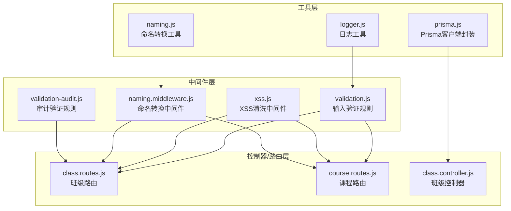
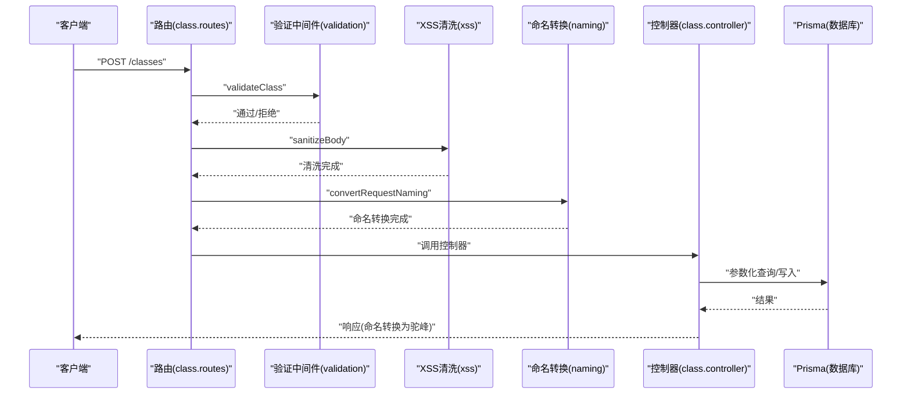
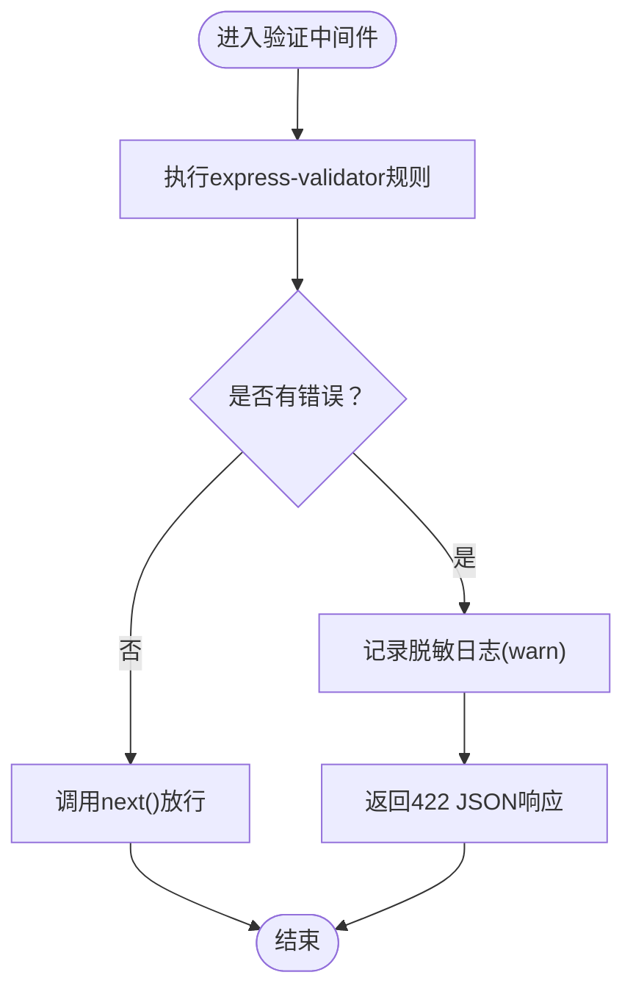
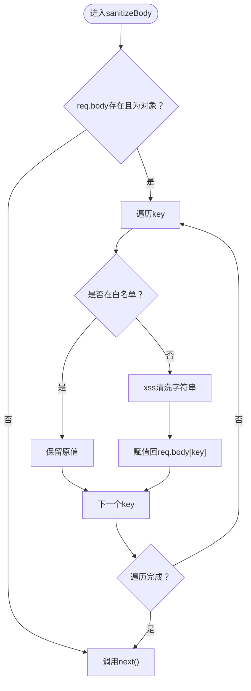
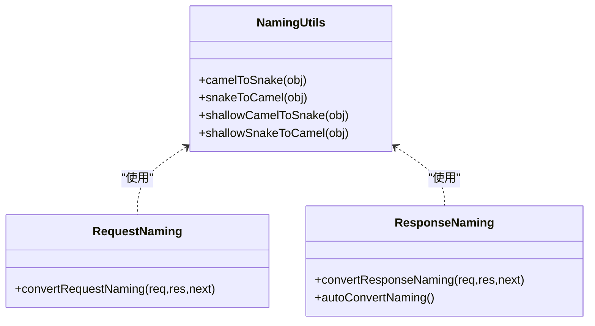
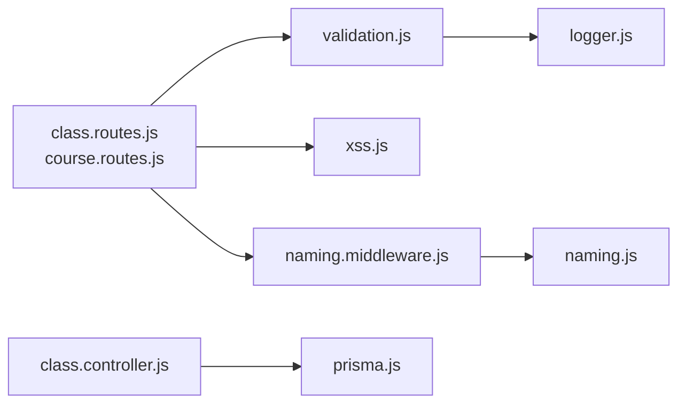

# 输入验证与过滤

<cite>
**本文引用的文件列表**
- [validation.js](file://server/src/middleware/validation.js)
- [xss.js](file://server/src/middleware/xss.js)
- [naming.middleware.js](file://server/src/middleware/naming.middleware.js)
- [validation-audit.js](file://server/src/middleware/validation-audit.js)
- [naming.js](file://server/src/utils/naming.js)
- [logger.js](file://server/src/utils/logger.js)
- [prisma.js](file://server/src/lib/prisma.js)
- [class.controller.js](file://server/src/controllers/class.controller.js)
- [class.routes.js](file://server/src/routes/class.routes.js)
- [course.routes.js](file://server/src/routes/course.routes.js)
- [validation.test.js](file://server/src/middleware/__tests__/validation.test.js)
- [naming.middleware.test.js](file://server/src/middleware/__tests__/naming.middleware.test.js)
</cite>

## 目录
1. [简介](#简介)
2. [项目结构](#项目结构)
3. [核心组件](#核心组件)
4. [架构总览](#架构总览)
5. [组件详解](#组件详解)
6. [依赖关系分析](#依赖关系分析)
7. [性能考量](#性能考量)
8. [故障排查指南](#故障排查指南)
9. [结论](#结论)
10. [附录](#附录)

## 简介
本文件面向KEC课程管理平台的输入验证与过滤体系，聚焦以下目标：
- XSS攻击防护：HTML标签过滤、JavaScript代码清理、特殊字符转义
- SQL注入防护：参数化查询、输入白名单验证、数据库访问控制
- 命名规范中间件：字段名验证、数据格式检查、业务规则校验
- 审计验证中间件：记录可疑输入与潜在安全威胁
- 实现细节：正则规则、长度限制、类型检查、错误处理与日志

## 项目结构
输入验证与过滤相关的核心文件分布于服务端中间件、工具库与控制器/路由层：
- 中间件层：输入验证、XSS清洗、命名转换、审计验证
- 工具层：命名转换工具、日志工具
- 数据访问层：Prisma客户端封装
- 控制器/路由层：业务入口，串联中间件与服务

图表来源
- [validation.js:1-590](file://server/src/middleware/validation.js#L1-L590)
- [xss.js:1-86](file://server/src/middleware/xss.js#L1-L86)
- [naming.middleware.js:1-68](file://server/src/middleware/naming.middleware.js#L1-L68)
- [validation-audit.js:1-11](file://server/src/middleware/validation-audit.js#L1-L11)
- [naming.js:1-119](file://server/src/utils/naming.js#L1-L119)
- [logger.js:1-96](file://server/src/utils/logger.js#L1-L96)
- [prisma.js:1-34](file://server/src/lib/prisma.js#L1-L34)
- [class.routes.js:1-34](file://server/src/routes/class.routes.js#L1-L34)
- [course.routes.js:1-36](file://server/src/routes/course.routes.js#L1-L36)
- [class.controller.js:1-464](file://server/src/controllers/class.controller.js#L1-L464)

章节来源
- [validation.js:1-590](file://server/src/middleware/validation.js#L1-L590)
- [xss.js:1-86](file://server/src/middleware/xss.js#L1-L86)
- [naming.middleware.js:1-68](file://server/src/middleware/naming.middleware.js#L1-L68)
- [validation-audit.js:1-11](file://server/src/middleware/validation-audit.js#L1-L11)
- [naming.js:1-119](file://server/src/utils/naming.js#L1-L119)
- [logger.js:1-96](file://server/src/utils/logger.js#L1-L96)
- [prisma.js:1-34](file://server/src/lib/prisma.js#L1-L34)
- [class.routes.js:1-34](file://server/src/routes/class.routes.js#L1-L34)
- [course.routes.js:1-36](file://server/src/routes/course.routes.js#L1-L36)
- [class.controller.js:1-464](file://server/src/controllers/class.controller.js#L1-L464)

## 核心组件
- 输入验证中间件：基于express-validator，提供统一的验证规则与错误处理，支持请求体、参数、查询参数的多场景校验。
- XSS清洗中间件：对请求体与查询参数进行递归清洗，跳过密码等敏感字段，避免HTML/JS注入。
- 命名转换中间件：请求侧将驼峰字段转为下划线（适配数据库），响应侧将下划线字段转回驼峰（适配前端），并维护关键字段白名单。
- 审计验证中间件：针对审计日志清空等敏感操作提供最小化验证规则，确保确认操作的合法性。
- 日志与审计：统一使用winston记录验证失败、异常与审计事件，便于追踪可疑输入与潜在威胁。

章节来源
- [validation.js:1-590](file://server/src/middleware/validation.js#L1-L590)
- [xss.js:1-86](file://server/src/middleware/xss.js#L1-L86)
- [naming.middleware.js:1-68](file://server/src/middleware/naming.middleware.js#L1-L68)
- [validation-audit.js:1-11](file://server/src/middleware/validation-audit.js#L1-L11)
- [logger.js:1-96](file://server/src/utils/logger.js#L1-L96)

## 架构总览
输入验证与过滤在请求生命周期中的位置如下：
- 路由层：在各资源路由上挂载验证、XSS清洗与命名转换中间件
- 中间件层：执行具体规则校验与数据净化
- 控制器层：接收已清洗与规范化后的数据，执行业务逻辑
- 数据访问层：通过Prisma进行参数化查询，避免SQL注入风险

图表来源
- [class.routes.js:1-34](file://server/src/routes/class.routes.js#L1-L34)
- [validation.js:1-590](file://server/src/middleware/validation.js#L1-L590)
- [xss.js:1-86](file://server/src/middleware/xss.js#L1-L86)
- [naming.middleware.js:1-68](file://server/src/middleware/naming.middleware.js#L1-L68)
- [class.controller.js:1-464](file://server/src/controllers/class.controller.js#L1-L464)
- [prisma.js:1-34](file://server/src/lib/prisma.js#L1-L34)

## 组件详解

### 输入验证中间件（validation.js）
- 功能定位：集中定义各类资源的输入验证规则，统一错误处理与日志记录。
- 关键特性：
  - 使用express-validator对body/param/query进行链式校验
  - 统一错误响应格式（422，包含details数组）
  - 对敏感字段（如密码）在日志中脱敏
  - 支持多种数据类型与范围约束（整数、浮点、布尔、枚举、正则）
- 典型规则示例（节选）：
  - 登录：用户名长度、密码长度
  - 班级：名称长度、入学年份范围、学制范围、人数范围、ID正整数
  - 课程：名称长度、编码长度、类型枚举
  - 教师：姓名长度、性别枚举、出生年月格式、人员类别枚举、默认周课时范围
  - 学期：格式YYYY-YYYY-N
  - 排课：课程ID、学期格式、模式枚举、预览布尔
  - 系统重置：确认字段必须为DELETE，原因长度范围
- 错误处理：当验证失败时，记录带脱敏的请求体与错误详情，并返回标准化JSON响应。

图表来源
- [validation.js:1-35](file://server/src/middleware/validation.js#L1-L35)

章节来源
- [validation.js:1-590](file://server/src/middleware/validation.js#L1-L590)
- [validation.test.js:1-447](file://server/src/middleware/__tests__/validation.test.js#L1-L447)

### XSS清洗中间件（xss.js）
- 功能定位：对请求体与查询参数进行递归清洗，移除潜在的HTML/JS注入内容。
- 关键特性：
  - 白名单跳过敏感字段（密码相关），避免篡改用户原始输入
  - 递归处理嵌套对象与数组
  - 针对Express 5的req.query只读限制，采用原地修改属性的方式
- 处理流程：
  - sanitizeBody：遍历req.body，跳过白名单字段，对字符串调用xss清洗
  - sanitizeQuery：遍历req.query，逐项清洗，捕获只读属性异常并跳过

图表来源
- [xss.js:1-86](file://server/src/middleware/xss.js#L1-L86)

章节来源
- [xss.js:1-86](file://server/src/middleware/xss.js#L1-L86)

### 命名转换中间件（naming.middleware.js + naming.js）
- 功能定位：在请求与响应阶段自动进行驼峰与下划线命名的双向转换。
- 请求侧（convertRequestNaming）：将客户端传入的驼峰字段转为下划线，适配数据库字段命名。
- 响应侧（convertResponseNaming）：将数据库返回的下划线字段转为驼峰，适配前端约定；同时维护关键字段白名单（code/message/success）不转换。
- 工具函数（naming.js）：
  - camelToSnake/snakeToCamel：递归转换对象键名，兼容Date、数组与非普通对象
  - shallowCamelToSnake/shallowSnakeToCamel：浅层转换，保留嵌套结构

图表来源
- [naming.middleware.js:1-68](file://server/src/middleware/naming.middleware.js#L1-L68)
- [naming.js:1-119](file://server/src/utils/naming.js#L1-L119)

章节来源
- [naming.middleware.js:1-68](file://server/src/middleware/naming.middleware.js#L1-L68)
- [naming.js:1-119](file://server/src/utils/naming.js#L1-L119)
- [naming.middleware.test.js:1-249](file://server/src/middleware/__tests__/naming.middleware.test.js#L1-L249)

### 审计验证中间件（validation-audit.js）
- 功能定位：针对审计日志清空等高风险操作提供最小化验证，确保确认字段为DELETE。
- 规则：body.confirm必须等于DELETE，否则返回422。

章节来源
- [validation-audit.js:1-11](file://server/src/middleware/validation-audit.js#L1-L11)

### 日志与审计（logger.js）
- 使用winston统一记录错误、警告、信息与调试日志，包含时间戳、服务名与JSON格式化。
- 审计日志单独输出到独立文件，便于合规与安全审计。

章节来源
- [logger.js:1-96](file://server/src/utils/logger.js#L1-L96)

### 数据访问与SQL注入防护（prisma.js + class.controller.js）
- SQL注入防护策略：
  - 使用Prisma ORM进行参数化查询与写入，避免手写SQL拼接
  - 所有数值类型在进入数据库前进行显式类型转换（Number），减少注入面
  - 控制器中对可选字段进行存在性判断与默认值处理，避免未授权字段写入
- 示例：班级创建/更新均通过Prisma事务与参数化写入，确保原子性与安全性。

章节来源
- [prisma.js:1-34](file://server/src/lib/prisma.js#L1-L34)
- [class.controller.js:244-418](file://server/src/controllers/class.controller.js#L244-L418)

## 依赖关系分析
- 路由层依赖中间件层：在路由上串联验证、XSS清洗与命名转换中间件
- 中间件层依赖工具层：命名转换依赖naming.js，日志依赖logger.js
- 控制器层依赖数据访问层：通过Prisma进行参数化查询
- 测试层覆盖验证与命名转换的正确性与边界情况

图表来源
- [class.routes.js:1-34](file://server/src/routes/class.routes.js#L1-L34)
- [course.routes.js:1-36](file://server/src/routes/course.routes.js#L1-L36)
- [validation.js:1-590](file://server/src/middleware/validation.js#L1-L590)
- [xss.js:1-86](file://server/src/middleware/xss.js#L1-L86)
- [naming.middleware.js:1-68](file://server/src/middleware/naming.middleware.js#L1-L68)
- [naming.js:1-119](file://server/src/utils/naming.js#L1-L119)
- [logger.js:1-96](file://server/src/utils/logger.js#L1-L96)
- [class.controller.js:1-464](file://server/src/controllers/class.controller.js#L1-L464)
- [prisma.js:1-34](file://server/src/lib/prisma.js#L1-L34)

章节来源
- [class.routes.js:1-34](file://server/src/routes/class.routes.js#L1-L34)
- [course.routes.js:1-36](file://server/src/routes/course.routes.js#L1-L36)
- [validation.js:1-590](file://server/src/middleware/validation.js#L1-L590)
- [xss.js:1-86](file://server/src/middleware/xss.js#L1-L86)
- [naming.middleware.js:1-68](file://server/src/middleware/naming.middleware.js#L1-L68)
- [naming.js:1-119](file://server/src/utils/naming.js#L1-L119)
- [logger.js:1-96](file://server/src/utils/logger.js#L1-L96)
- [class.controller.js:1-464](file://server/src/controllers/class.controller.js#L1-L464)
- [prisma.js:1-34](file://server/src/lib/prisma.js#L1-L34)

## 性能考量
- 验证中间件：基于express-validator的链式校验，开销主要在规则匹配与错误收集，建议在高频接口上保持规则精简与必要性。
- XSS清洗：递归遍历对象与数组，复杂度与数据体量成正比；对大型请求体建议在网关层限流或压缩。
- 命名转换：递归转换键名，对深层嵌套对象有一定CPU开销；可通过缓存策略优化重复转换场景。
- 数据访问：Prisma参数化查询具备良好性能与安全性；注意避免N+1查询，合理使用select/include。

## 故障排查指南
- 验证失败（422）：
  - 检查请求体/参数/查询参数是否满足长度、类型与范围要求
  - 查看日志中脱敏后的请求体与错误详情，定位具体字段
- XSS清洗异常：
  - 确认敏感字段是否在白名单中（密码类字段不会被清洗）
  - 检查嵌套对象与数组是否正确递归处理
- 命名转换问题：
  - 确认响应侧是否对code/message/success进行了白名单保护
  - 检查嵌套分页对象（如data.list）是否被正确转换
- 审计日志清空失败：
  - 确认confirm字段必须为DELETE

章节来源
- [validation.js:1-35](file://server/src/middleware/validation.js#L1-L35)
- [xss.js:1-86](file://server/src/middleware/xss.js#L1-L86)
- [naming.middleware.js:1-68](file://server/src/middleware/naming.middleware.js#L1-L68)
- [validation-audit.js:1-11](file://server/src/middleware/validation-audit.js#L1-L11)
- [logger.js:1-96](file://server/src/utils/logger.js#L1-L96)

## 结论
KEC课程管理平台通过“验证+清洗+命名转换+审计”的多层防护，构建了完整的输入安全体系：
- XSS防护：通过XSS中间件与敏感字段白名单，有效降低HTML/JS注入风险
- SQL注入防护：依托Prisma参数化查询与严格的类型转换，显著降低注入面
- 命名规范：统一前后端命名风格，提升可维护性与一致性
- 审计与日志：标准化错误与审计日志，便于追踪与合规

## 附录

### 常见输入规则与限制清单（摘要）
- 登录：用户名长度、密码长度
- 班级：名称长度、入学年份范围、学制范围、人数范围、ID正整数
- 课程：名称长度、编码长度、类型枚举
- 教师：姓名长度、性别枚举、出生年月格式、人员类别枚举、默认周课时范围
- 学期：格式YYYY-YYYY-N
- 排课：课程ID、学期格式、模式枚举、预览布尔
- 系统重置：确认字段必须为DELETE，原因长度范围

章节来源
- [validation.js:95-125](file://server/src/middleware/validation.js#L95-L125)
- [validation.js:40-90](file://server/src/middleware/validation.js#L40-L90)
- [validation.js:151-163](file://server/src/middleware/validation.js#L151-L163)
- [validation.js:460-484](file://server/src/middleware/validation.js#L460-L484)
- [validation.js:365-371](file://server/src/middleware/validation.js#L365-L371)
- [validation.js:522-531](file://server/src/middleware/validation.js#L522-L531)
- [validation.js:536-544](file://server/src/middleware/validation.js#L536-L544)
- [validation.js:348-360](file://server/src/middleware/validation.js#L348-L360)