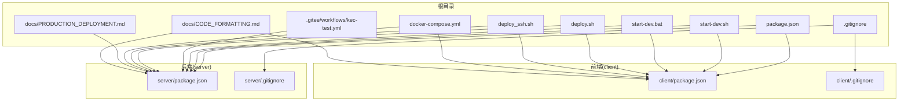
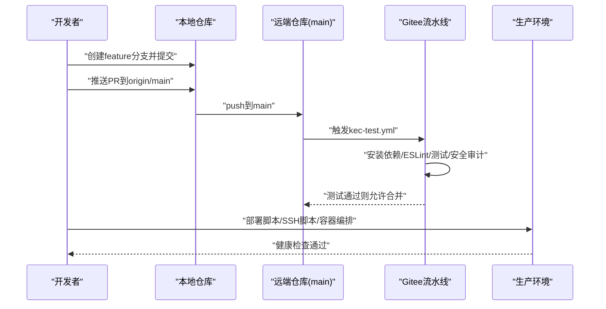
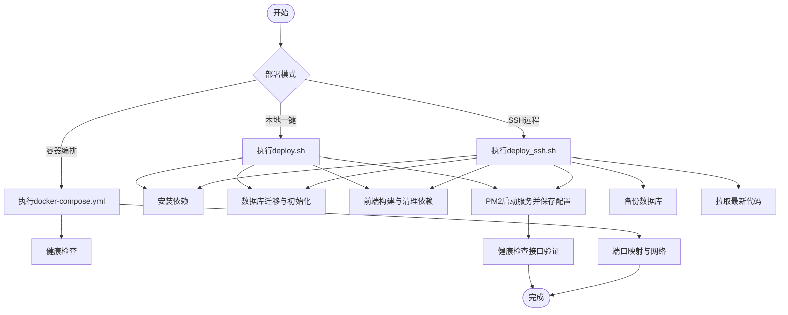
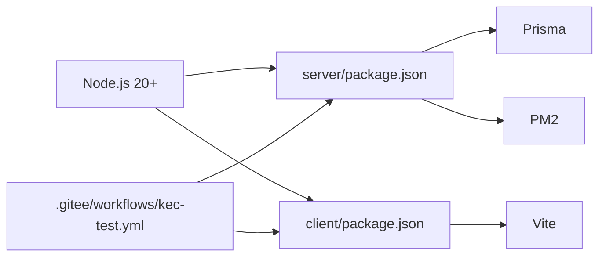

# Git工作流程

<cite>
**本文引用的文件**
- [package.json](file://package.json)
- [start-dev.sh](file://start-dev.sh)
- [start-dev.bat](file://start-dev.bat)
- [.gitee/workflows/kec-test.yml](file://.gitee/workflows/kec-test.yml)
- [deploy.sh](file://deploy.sh)
- [deploy_ssh.sh](file://deploy_ssh.sh)
- [docker-compose.yml](file://docker-compose.yml)
- [docs/PRODUCTION_DEPLOYMENT.md](file://docs/PRODUCTION_DEPLOYMENT.md)
- [docs/CODE_FORMATTING.md](file://docs/CODE_FORMATTING.md)
- [.gitignore](file://.gitignore)
- [client/.gitignore](file://client/.gitignore)
- [server/.gitignore](file://server/.gitignore)
</cite>

## 目录
1. [简介](#简介)
2. [项目结构](#项目结构)
3. [核心组件](#核心组件)
4. [架构总览](#架构总览)
5. [详细组件分析](#详细组件分析)
6. [依赖分析](#依赖分析)
7. [性能考虑](#性能考虑)
8. [故障排查指南](#故障排查指南)
9. [结论](#结论)
10. [附录](#附录)

## 简介
本文件面向KEC课程管理平台的开发与运维团队，提供一套完整的Git工作流程规范，涵盖分支管理策略、提交规范、合并流程、热修复与发布版本管理、代码审查流程、冲突解决方法、版本标签管理以及本地开发环境搭建脚本与自动化部署流程。该规范基于仓库现有的脚本、工作流与文档进行提炼与落地，确保团队协作高效、可追溯、可复现。

## 项目结构
项目采用前后端分离的Monorepo结构，根目录包含后端(server)与前端(client)，并通过Docker Compose实现容器化编排；同时提供一键部署脚本与Gitee流水线配置，支撑本地开发与生产部署。

**图表来源**
- [package.json:1-25](file://package.json#L1-L25)
- [start-dev.sh:1-55](file://start-dev.sh#L1-L55)
- [start-dev.bat:1-51](file://start-dev.bat#L1-L51)
- [.gitee/workflows/kec-test.yml:1-53](file://.gitee/workflows/kec-test.yml#L1-L53)
- [deploy.sh:1-262](file://deploy.sh#L1-L262)
- [deploy_ssh.sh:1-445](file://deploy_ssh.sh#L1-L445)
- [docker-compose.yml:1-73](file://docker-compose.yml#L1-L73)
- [docs/PRODUCTION_DEPLOYMENT.md:1-341](file://docs/PRODUCTION_DEPLOYMENT.md#L1-L341)
- [docs/CODE_FORMATTING.md:1-106](file://docs/CODE_FORMATTING.md#L1-L106)
- [.gitignore:1-13](file://.gitignore#L1-L13)
- [client/.gitignore:1-25](file://client/.gitignore#L1-L25)
- [server/.gitignore:1-49](file://server/.gitignore#L1-L49)

**章节来源**
- [package.json:1-25](file://package.json#L1-L25)
- [docker-compose.yml:1-73](file://docker-compose.yml#L1-L73)

## 核心组件
- 分支与版本管理：以main为主保护分支，采用Feature分支与Hotfix分支进行变更隔离，并通过标签标记发布版本。
- 提交与审查：统一提交信息格式，强制代码格式化与ESLint检查，结合PR审查与流水线测试。
- 自动化部署：提供本地一键启动脚本与生产部署脚本，支持SSH远程部署与容器化部署。
- CI/CD：Gitee流水线在push到main时自动运行测试与安全审计，失败则阻断部署。

**章节来源**
- [.gitee/workflows/kec-test.yml:1-53](file://.gitee/workflows/kec-test.yml#L1-L53)
- [docs/CODE_FORMATTING.md:1-106](file://docs/CODE_FORMATTING.md#L1-L106)
- [deploy.sh:1-262](file://deploy.sh#L1-L262)
- [deploy_ssh.sh:1-445](file://deploy_ssh.sh#L1-L445)

## 架构总览
下图展示从开发者本地到CI/CD再到生产的整体流程，包括分支策略、提交规范、审查与部署的关键节点。

**图表来源**
- [.gitee/workflows/kec-test.yml:1-53](file://.gitee/workflows/kec-test.yml#L1-L53)
- [deploy.sh:1-262](file://deploy.sh#L1-L262)
- [deploy_ssh.sh:1-445](file://deploy_ssh.sh#L1-L445)
- [docker-compose.yml:1-73](file://docker-compose.yml#L1-L73)

## 详细组件分析

### 分支管理策略
- main：受保护分支，仅允许通过PR合并，且必须通过CI测试与审查。
- develop：可选长期分支，用于集成特性分支，最终合并至main。
- feature/*：用于新功能开发，命名以功能语义为主，如feature/user-auth。
- hotfix/*：用于紧急修复，修复后同时合并至main与develop（如存在develop）。
- release/*：用于发布前的最后整合与测试，完成后打标签并合并至main与develop。

最佳实践
- feature分支从main切出，合并回main前需rebase或merge main保持同步。
- hotfix分支从最近tag或main切出，修复后同时合并至main与develop。
- release分支从develop切出，完成后打版本标签并推送到远端。

**章节来源**
- [package.json:1-25](file://package.json#L1-L25)

### 提交规范与代码格式化
- 提交信息格式
  - 类型(scope): 描述
  - 示例：feat(auth): 添加登录页面
- 代码格式化
  - 前端：使用Prettier与ESLint，统一Vue/JS格式。
  - 后端：使用Prettier与ESLint，统一JS格式。
- IDE集成
  - VS Code建议启用保存时格式化与ESLint修复。
- 提交前检查
  - 运行格式化与ESLint修复。
  - 运行测试，确保通过。

**章节来源**
- [docs/CODE_FORMATTING.md:1-106](file://docs/CODE_FORMATTING.md#L1-L106)

### Pull Request规范
- PR标题遵循提交信息格式，简明描述变更范围。
- PR描述包含变更动机、影响范围、测试要点与注意事项。
- 至少一名Reviewer批准后方可合并。
- 合并前确保CI通过、无冲突、代码符合规范。

**章节来源**
- [.gitee/workflows/kec-test.yml:1-53](file://.gitee/workflows/kec-test.yml#L1-L53)

### Hotfix分支处理
- 从最近稳定tag或main切出hotfix分支。
- 修复完成后合并至main与develop（如存在），并在main打新标签。
- 通过SSH脚本或部署脚本进行快速上线。

**章节来源**
- [deploy_ssh.sh:1-445](file://deploy_ssh.sh#L1-L445)
- [deploy.sh:1-262](file://deploy.sh#L1-L262)

### Release版本管理
- 发布前在release分支进行最终验证与文档更新。
- 打版本标签（语义化版本），如v2.14.1。
- 合并至main与develop，发布制品并通知相关方。

**章节来源**
- [package.json:1-25](file://package.json#L1-L25)

### 本地开发环境搭建
- Linux/macOS
  - 使用脚本重置数据库并启动前后端服务。
  - 默认登录信息：admin/admin@123456（超级管理员）。
- Windows
  - 使用批处理脚本执行相同流程。
- 依赖要求
  - Node.js 20+，npm 10+（后端包中声明）。

**章节来源**
- [start-dev.sh:1-55](file://start-dev.sh#L1-L55)
- [start-dev.bat:1-51](file://start-dev.bat#L1-L51)
- [server/package.json:7-10](file://server/package.json#L7-L10)

### 自动化部署流程
- 一键部署脚本
  - 自动安装依赖、初始化数据库、生成Prisma Client、构建前端、启动PM2服务。
  - 支持本地与远程部署，远程部署通过SSH。
- SSH远程部署脚本
  - 支持完整部署、仅更新、仅备份三种模式。
  - 自动备份数据库、健康检查、PM2进程管理。
- 容器化部署
  - 通过Docker Compose编排后端与前端，健康检查与资源限制可配置。

**图表来源**
- [deploy.sh:1-262](file://deploy.sh#L1-L262)
- [deploy_ssh.sh:1-445](file://deploy_ssh.sh#L1-L445)
- [docker-compose.yml:1-73](file://docker-compose.yml#L1-L73)

**章节来源**
- [deploy.sh:1-262](file://deploy.sh#L1-L262)
- [deploy_ssh.sh:1-445](file://deploy_ssh.sh#L1-L445)
- [docker-compose.yml:1-73](file://docker-compose.yml#L1-L73)
- [docs/PRODUCTION_DEPLOYMENT.md:1-341](file://docs/PRODUCTION_DEPLOYMENT.md#L1-L341)

### 代码审查流程
- 提交前本地格式化与ESLint修复。
- 提交PR后触发CI流水线，确保测试与安全审计通过。
- Reviewer关注：功能正确性、安全性、性能、可维护性与文档更新。
- 合并前解决所有评论与冲突。

**章节来源**
- [.gitee/workflows/kec-test.yml:1-53](file://.gitee/workflows/kec-test.yml#L1-L53)
- [docs/CODE_FORMATTING.md:1-106](file://docs/CODE_FORMATTING.md#L1-L106)

### 冲突解决方法
- 频繁rebase或merge main保持分支最新。
- 使用IDE的合并工具逐条解决冲突。
- 冲突解决后运行ESLint与测试，确保无回归。

**章节来源**
- [.gitee/workflows/kec-test.yml:1-53](file://.gitee/workflows/kec-test.yml#L1-L53)

### 版本标签管理
- 使用语义化版本打标签，如v2.14.1。
- 标签推送到远端后触发发布流程或部署脚本。
- 标签与发布说明关联，便于追踪变更。

**章节来源**
- [package.json:1-25](file://package.json#L1-L25)

## 依赖分析
- 语言与工具链
  - Node.js 20+（后端包引擎要求）
  - Vite（前端构建）、PM2（进程管理）、Prisma（数据库迁移与客户端）
- 仓库忽略
  - 根与子模块均配置了.gitignore，排除node_modules、dist、日志、数据库文件等
- CI/CD
  - Gitee流水线在main分支触发，执行安装、ESLint、测试与安全审计

**图表来源**
- [server/package.json:7-10](file://server/package.json#L7-L10)
- [client/package.json:1-33](file://client/package.json#L1-L33)
- [.gitee/workflows/kec-test.yml:1-53](file://.gitee/workflows/kec-test.yml#L1-L53)

**章节来源**
- [server/package.json:7-10](file://server/package.json#L7-L10)
- [client/package.json:1-33](file://client/package.json#L1-L33)
- [.gitee/workflows/kec-test.yml:1-53](file://.gitee/workflows/kec-test.yml#L1-L53)
- [.gitignore:1-13](file://.gitignore#L1-L13)
- [client/.gitignore:1-25](file://client/.gitignore#L1-L25)
- [server/.gitignore:1-49](file://server/.gitignore#L1-L49)

## 性能考虑
- 依赖安装优化
  - 生产部署优先使用--production，减少不必要的开发依赖体积。
  - 前端构建后清理devDependencies，降低运行时开销。
- 健康检查与资源限制
  - Docker Compose提供健康检查与资源限制，提升稳定性。
- 部署脚本
  - 自动检测esbuild二进制，异常时重新安装，避免构建失败。

**章节来源**
- [deploy.sh:178-190](file://deploy.sh#L178-L190)
- [docker-compose.yml:28-42](file://docker-compose.yml#L28-L42)

## 故障排查指南
- 健康检查失败
  - 使用PM2日志定位错误，检查数据库连接与Prisma迁移状态。
- CORS错误
  - 确认.env中CORS_ORIGINS包含生产域名，重启服务生效。
- 数据库锁定（SQLite）
  - 检查文件权限，确保服务账户可读写数据库文件。
- JWT认证失败
  - 检查JWT密钥长度与格式，确保随机生成且不使用默认值。
- SSH连接失败
  - 检查服务器地址、端口、密钥与防火墙设置。

**章节来源**
- [docs/PRODUCTION_DEPLOYMENT.md:204-250](file://docs/PRODUCTION_DEPLOYMENT.md#L204-L250)
- [deploy_ssh.sh:133-149](file://deploy_ssh.sh#L133-L149)

## 结论
本Git工作流程以“清晰的分支策略、严格的提交与审查规范、完善的自动化部署与监控”为核心，结合CI/CD与容器化能力，确保KEC课程管理平台在开发与生产环境中高效、稳定地演进。建议团队在日常工作中严格执行上述规范，并根据项目发展持续优化流程与工具链。

## 附录
- 本地开发启动
  - Linux/macOS：执行start-dev.sh
  - Windows：执行start-dev.bat
- 生产部署
  - 一键部署：执行deploy.sh
  - SSH远程部署：执行deploy_ssh.sh
  - 容器化部署：执行docker-compose.yml
- 文档与规范
  - 生产部署检查清单与Nginx配置参考docs/PRODUCTION_DEPLOYMENT.md
  - 代码格式化与ESLint配置参考docs/CODE_FORMATTING.md

**章节来源**
- [start-dev.sh:1-55](file://start-dev.sh#L1-L55)
- [start-dev.bat:1-51](file://start-dev.bat#L1-L51)
- [deploy.sh:1-262](file://deploy.sh#L1-L262)
- [deploy_ssh.sh:1-445](file://deploy_ssh.sh#L1-L445)
- [docker-compose.yml:1-73](file://docker-compose.yml#L1-L73)
- [docs/PRODUCTION_DEPLOYMENT.md:1-341](file://docs/PRODUCTION_DEPLOYMENT.md#L1-L341)
- [docs/CODE_FORMATTING.md:1-106](file://docs/CODE_FORMATTING.md#L1-L106)