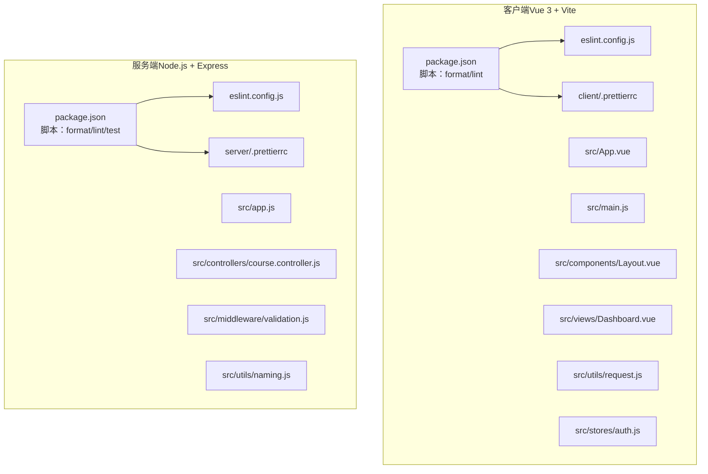
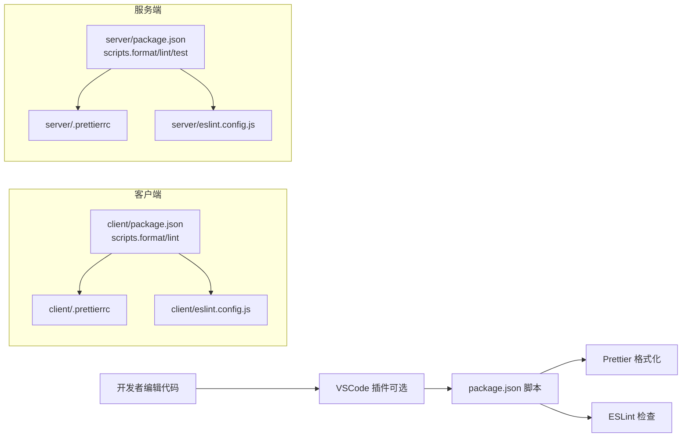
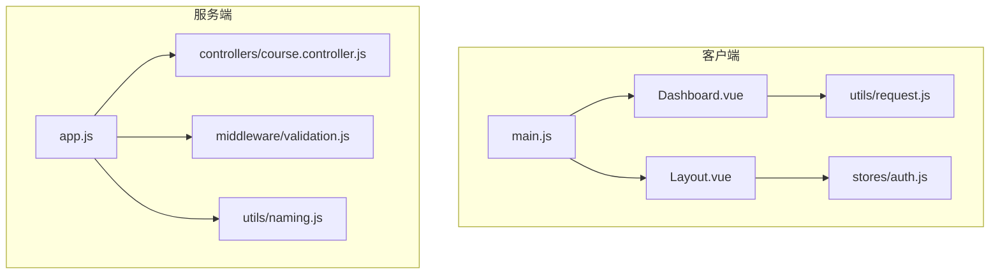

# 代码规范

<cite>
**本文引用的文件**
- [.prettierrc（客户端）](file://client/.prettierrc)
- [.prettierrc（服务端）](file://server/.prettierrc)
- [eslint.config.js（客户端）](file://client/eslint.config.js)
- [eslint.config.js（服务端）](file://server/eslint.config.js)
- [package.json（客户端）](file://client/package.json)
- [package.json（服务端）](file://server/package.json)
- [App.vue（客户端）](file://client/src/App.vue)
- [main.js（客户端）](file://client/src/main.js)
- [Layout.vue（客户端）](file://client/src/components/Layout.vue)
- [Dashboard.vue（客户端）](file://client/src/views/Dashboard.vue)
- [request.js（客户端）](file://client/src/utils/request.js)
- [auth.js（客户端）](file://client/src/stores/auth.js)
- [app.js（服务端）](file://server/src/app.js)
- [course.controller.js（服务端）](file://server/src/controllers/course.controller.js)
- [validation.js（服务端）](file://server/src/middleware/validation.js)
- [naming.js（服务端）](file://server/src/utils/naming.js)
</cite>

## 目录
1. [简介](#简介)
2. [项目结构](#项目结构)
3. [核心组件](#核心组件)
4. [架构总览](#架构总览)
5. [详细组件分析](#详细组件分析)
6. [依赖关系分析](#依赖关系分析)
7. [性能考虑](#性能考虑)
8. [故障排查指南](#故障排查指南)
9. [结论](#结论)
10. [附录](#附录)

## 简介
本文件为 KECCourse Manager 平台的统一代码规范文档，覆盖以下方面：
- Prettier 代码格式化配置与统一风格
- ESLint 代码检查规则与集成方式
- JavaScript/TypeScript 语法规范与最佳实践
- Vue 3 组件开发规范（Composition API、模板与样式）
- CSS/SCSS 编写规范与作用域策略
- 文件命名约定与模块组织方式
- 注释规范、变量命名规则、函数设计原则
- VSCode 自动格式化配置建议
- 错误处理与调试流程

本规范旨在提升代码一致性、可维护性与协作效率。

## 项目结构
前端与后端分别采用独立的格式化与检查配置，并通过脚本统一执行。整体结构清晰，按功能模块划分组件、页面、工具与中间件。

图表来源
- [package.json（客户端）:1-33](file://client/package.json#L1-L33)
- [package.json（服务端）:1-53](file://server/package.json#L1-L53)
- [eslint.config.js（客户端）:1-42](file://client/eslint.config.js#L1-L42)
- [eslint.config.js（服务端）:1-30](file://server/eslint.config.js#L1-L30)
- [.prettierrc（客户端）:1-12](file://client/.prettierrc#L1-L12)
- [.prettierrc（服务端）:1-12](file://server/.prettierrc#L1-L12)

章节来源
- [package.json（客户端）:1-33](file://client/package.json#L1-L33)
- [package.json（服务端）:1-53](file://server/package.json#L1-L53)

## 核心组件
- 客户端
  - 应用入口与全局配置：[main.js:1-115](file://client/src/main.js#L1-L115)
  - 布局组件与导航：[Layout.vue:1-369](file://client/src/components/Layout.vue#L1-L369)
  - 首页仪表盘视图：[Dashboard.vue:1-680](file://client/src/views/Dashboard.vue#L1-L680)
  - HTTP 请求封装与鉴权：[request.js:1-145](file://client/src/utils/request.js#L1-L145)
  - 认证状态与令牌管理：[auth.js:1-222](file://client/src/stores/auth.js#L1-L222)
- 服务端
  - 应用启动与路由装配：[app.js:1-158](file://server/src/app.js#L1-L158)
  - 控制器示例（课程增删改查）：[course.controller.js:1-142](file://server/src/controllers/course.controller.js#L1-L142)
  - 参数校验中间件：[validation.js:1-590](file://server/src/middleware/validation.js#L1-L590)
  - 命名转换工具（驼峰/下划线）：[naming.js:1-119](file://server/src/utils/naming.js#L1-L119)

章节来源
- [main.js（客户端）:1-115](file://client/src/main.js#L1-L115)
- [Layout.vue（客户端）:1-369](file://client/src/components/Layout.vue#L1-L369)
- [Dashboard.vue（客户端）:1-680](file://client/src/views/Dashboard.vue#L1-L680)
- [request.js（客户端）:1-145](file://client/src/utils/request.js#L1-L145)
- [auth.js（客户端）:1-222](file://client/src/stores/auth.js#L1-L222)
- [app.js（服务端）:1-158](file://server/src/app.js#L1-L158)
- [course.controller.js（服务端）:1-142](file://server/src/controllers/course.controller.js#L1-L142)
- [validation.js（服务端）:1-590](file://server/src/middleware/validation.js#L1-L590)
- [naming.js（服务端）:1-119](file://server/src/utils/naming.js#L1-L119)

## 架构总览
前后端均采用“配置即规则”的方式，通过脚本统一执行格式化与检查，保证团队一致的代码风格。

图表来源
- [package.json（客户端）:6-11](file://client/package.json#L6-L11)
- [package.json（服务端）:22-26](file://server/package.json#L22-L26)
- [.prettierrc（客户端）:1-12](file://client/.prettierrc#L1-L12)
- [.prettierrc（服务端）:1-12](file://server/.prettierrc#L1-L12)
- [eslint.config.js（客户端）:1-42](file://client/eslint.config.js#L1-L42)
- [eslint.config.js（服务端）:1-30](file://server/eslint.config.js#L1-L30)

## 详细组件分析

### Prettier 配置与统一风格
- 客户端与服务端均采用相同的格式化偏好：分号、尾随逗号、单引号、最大行长、缩进宽度、括号间距、箭头函数括号、行尾符等。
- 客户端额外对 .prettierignore 进行忽略配置；服务端同样提供 .prettierrc 与 .prettierignore。
- 建议在本地与 CI 中统一执行格式化脚本，避免风格漂移。

章节来源
- [.prettierrc（客户端）:1-12](file://client/.prettierrc#L1-L12)
- [.prettierrc（服务端）:1-12](file://server/.prettierrc#L1-L12)
- [package.json（客户端）:10-11](file://client/package.json#L10-L11)
- [package.json（服务端）:22-23](file://server/package.json#L22-L23)

### ESLint 规则与集成
- 客户端
  - 使用 flat 配置，启用 Vue 3 推荐规则与 Prettier 集成，关闭多词组件名强制、禁用 v-html 等。
  - 全局变量声明（浏览器/Node 环境常用 API、第三方库全局）。
  - 规则示例：未使用变量警告级别。
- 服务端
  - 使用 flat 配置，启用 JS 推荐规则，全局变量声明（Node 环境常用 API）。
  - 规则示例：未使用变量警告、控制台输出可按需调整。

章节来源
- [eslint.config.js（客户端）:1-42](file://client/eslint.config.js#L1-L42)
- [eslint.config.js（服务端）:1-30](file://server/eslint.config.js#L1-L30)
- [package.json（客户端）:21-31](file://client/package.json#L21-L31)
- [package.json（服务端）:43-51](file://server/package.json#L43-L51)

### JavaScript/TypeScript 语法规范
- 命名
  - 变量与函数：小驼峰命名（如：isValid、fetchData）。
  - 常量：全大写下划线或大驼峰（如：MAX_SIZE、API_BASE_URL）。
  - 类型文件：.d.ts 或与实现同名并在同一目录。
- 结构
  - 优先使用 ES Module（import/export），避免 CommonJS。
  - 函数尽量纯函数化，减少副作用；必要时明确标注副作用。
  - 避免魔法数字/字符串，使用常量或枚举。
- 错误处理
  - 明确区分业务错误与系统错误，统一返回结构。
  - 异步函数使用 try/catch 包裹，避免未捕获异常。
- 注释
  - 公共 API/复杂逻辑添加 JSDoc 风格注释，说明参数、返回值与异常。
  - 简短注释使用单行注释，解释动机或风险。

章节来源
- [request.js（客户端）:1-145](file://client/src/utils/request.js#L1-L145)
- [auth.js（客户端）:1-222](file://client/src/stores/auth.js#L1-L222)
- [course.controller.js（服务端）:1-142](file://server/src/controllers/course.controller.js#L1-L142)

### Vue 3 组件开发规范
- 组合式 API
  - 使用 <script setup> 简化声明；将逻辑拆分为多个 composable，便于复用与测试。
  - 响应式数据集中声明，计算属性与方法分离。
- 模板
  - 避免在模板中写复杂表达式，使用计算属性或局部变量。
  - 合理使用 v-if/v-show，避免频繁切换导致的性能问题。
  - 事件绑定与参数传递遵循单一职责，避免在模板中调用多个函数。
- 样式
  - 优先使用 scoped 样式隔离；必要时使用深度选择器 :deep(...)。
  - 组件样式与布局分离，避免在组件内写过多布局样式。
- 生命周期
  - 在 onMounted 中发起异步请求，在 onUnmounted 中清理定时器与事件监听。
- 图标与资源
  - 按需引入图标，避免全量引入造成包体膨胀。

章节来源
- [Layout.vue（客户端）:1-369](file://client/src/components/Layout.vue#L1-L369)
- [Dashboard.vue（客户端）:1-680](file://client/src/views/Dashboard.vue#L1-L680)
- [main.js（客户端）:67-108](file://client/src/main.js#L67-L108)

### CSS/SCSS 编写规范
- 选择器
  - 避免使用过深嵌套，优先语义化类名（如：.layout-header、.stat-item）。
  - 与 Element Plus 冲突时使用 :deep(...) 或更具体的选择器。
- 响应式
  - 使用媒体查询时，集中在组件末尾，保持结构清晰。
- 主题与变量
  - 将颜色、尺寸等抽象为变量，集中管理，便于主题切换。
- 作用域
  - 组件内样式使用 scoped；全局样式放入全局样式文件。
- 动画与过渡
  - 使用 CSS 过渡与动画时，注意性能，避免频繁重绘。

章节来源
- [Layout.vue（客户端）:208-369](file://client/src/components/Layout.vue#L208-L369)
- [Dashboard.vue（客户端）:444-680](file://client/src/views/Dashboard.vue#L444-L680)

### 文件命名约定与模块组织
- 目录与文件
  - 页面：views/ 下按功能模块划分（如：views/course/、views/teaching/）。
  - 组件：components/ 下按功能模块划分（如：components/filter/）。
  - 工具：utils/ 下按职责划分（如：utils/request.js、utils/cache.js）。
  - 状态：stores/ 下使用 Pinia Store（如：stores/auth.js）。
  - 路由：router/ 下集中管理路由配置。
- 命名
  - 组件文件：帕斯卡命名（如：CourseList.vue）。
  - 普通 JS 文件：小驼峰（如：useCrudList.js）。
  - 常量文件：大驼峰或全大写（如：API_CONSTANTS.js）。
  - 测试文件：与被测文件同名 + .test.js 或 .spec.js。
- 导入路径
  - 使用相对路径与别名（如：@/utils/request）保持一致性。

章节来源
- [App.vue（客户端）:1-4](file://client/src/App.vue#L1-L4)
- [main.js（客户端）:1-47](file://client/src/main.js#L1-L47)
- [auth.js（客户端）:1-8](file://client/src/stores/auth.js#L1-L8)

### 注释规范
- 函数/方法
  - 说明用途、参数含义、返回值、异常情况。
- 复杂逻辑
  - 解释业务背景、边界条件与性能考量。
- 块注释
  - 用于长段落说明或阶段性总结。

章节来源
- [validation.js（服务端）:4-35](file://server/src/middleware/validation.js#L4-L35)
- [naming.js（服务端）:1-119](file://server/src/utils/naming.js#L1-L119)

### 函数设计原则
- 单一职责：一个函数只做一件事。
- 输入输出明确：参数与返回值类型清晰，必要时进行校验。
- 不可变性：尽量返回新对象而非修改入参。
- 可测试性：避免隐式依赖，必要时注入依赖。

章节来源
- [request.js（客户端）:17-34](file://client/src/utils/request.js#L17-L34)
- [course.controller.js（服务端）:11-21](file://server/src/controllers/course.controller.js#L11-L21)

### 模块组织方式
- 前端
  - 按功能域组织（课程、教学、查询、系统等），组件与页面解耦。
  - 工具函数与状态管理集中，避免重复造轮子。
- 后端
  - 控制器负责请求处理与转发，服务层负责业务逻辑，中间件负责横切关注点（鉴权、校验、命名转换）。
  - 路由按模块划分，统一挂载到主应用。

章节来源
- [app.js（服务端）:1-158](file://server/src/app.js#L1-L158)
- [course.controller.js（服务端）:1-142](file://server/src/controllers/course.controller.js#L1-L142)
- [validation.js（服务端）:1-590](file://server/src/middleware/validation.js#L1-L590)
- [naming.js（服务端）:1-119](file://server/src/utils/naming.js#L1-L119)

## 依赖关系分析

图表来源
- [main.js（客户端）:1-115](file://client/src/main.js#L1-L115)
- [Layout.vue（客户端）:1-369](file://client/src/components/Layout.vue#L1-L369)
- [Dashboard.vue（客户端）:1-680](file://client/src/views/Dashboard.vue#L1-L680)
- [request.js（客户端）:1-145](file://client/src/utils/request.js#L1-L145)
- [auth.js（客户端）:1-222](file://client/src/stores/auth.js#L1-L222)
- [app.js（服务端）:1-158](file://server/src/app.js#L1-L158)
- [course.controller.js（服务端）:1-142](file://server/src/controllers/course.controller.js#L1-L142)
- [validation.js（服务端）:1-590](file://server/src/middleware/validation.js#L1-L590)
- [naming.js（服务端）:1-119](file://server/src/utils/naming.js#L1-L119)

章节来源
- [main.js（客户端）:1-115](file://client/src/main.js#L1-L115)
- [app.js（服务端）:1-158](file://server/src/app.js#L1-L158)

## 性能考虑
- 客户端
  - 按需加载图标与组件，避免全量引入。
  - 合理使用缓存与防抖，减少重复请求。
  - 避免在模板中进行复杂计算，使用计算属性。
- 服务端
  - 参数校验前置，尽早失败，减少无效处理。
  - 命名转换中间件统一处理请求/响应命名，避免重复逻辑。
  - 日志与错误处理分离，避免敏感信息泄露。

章节来源
- [main.js（客户端）:67-108](file://client/src/main.js#L67-L108)
- [request.js（客户端）:1-145](file://client/src/utils/request.js#L1-L145)
- [app.js（服务端）:84-90](file://server/src/app.js#L84-L90)
- [validation.js（服务端）:7-35](file://server/src/middleware/validation.js#L7-L35)

## 故障排查指南
- 格式化与检查失败
  - 使用对应脚本快速修复：客户端执行 format/lint，服务端执行 format/lint。
  - 检查 .prettierrc 与 eslint.config.js 是否与当前项目一致。
- 请求失败与鉴权问题
  - 查看请求拦截器与响应拦截器的错误分支，确认状态码与消息映射。
  - 检查认证状态与令牌刷新流程，确保未过期。
- 参数校验失败
  - 校验中间件会返回结构化的错误信息，定位字段与范围。
- 命名转换异常
  - 确认请求体与响应体是否正确经过命名转换中间件。

章节来源
- [package.json（客户端）:10-11](file://client/package.json#L10-L11)
- [package.json（服务端）:22-23](file://server/package.json#L22-L23)
- [request.js（客户端）:51-142](file://client/src/utils/request.js#L51-L142)
- [auth.js（客户端）:106-128](file://client/src/stores/auth.js#L106-L128)
- [validation.js（服务端）:7-35](file://server/src/middleware/validation.js#L7-L35)
- [app.js（服务端）:84-90](file://server/src/app.js#L84-L90)

## 结论
本规范基于现有配置与代码示例提炼而来，强调“配置即规则、脚本统一执行、模块化组织与清晰注释”。建议在团队内推广并持续演进，结合实际业务场景补充细节。

## 附录

### VSCode 自动格式化配置建议
- 插件
  - 安装 Prettier 与 ESLint 插件。
- 设置
  - 保存时自动格式化：editor.formatOnSave
  - 保存时自动修复 ESLint：editor.codeActionsOnSave
  - 语言特定设置：针对 .vue 与 .js 文件启用 Prettier/ESLint
- 说明
  - 本仓库已提供统一的 .prettierrc 与 eslint.config.js，VSCode 插件仅作为本地辅助，最终以脚本为准。

章节来源
- [.prettierrc（客户端）:1-12](file://client/.prettierrc#L1-L12)
- [eslint.config.js（客户端）:1-42](file://client/eslint.config.js#L1-L42)
- [.prettierrc（服务端）:1-12](file://server/.prettierrc#L1-L12)
- [eslint.config.js（服务端）:1-30](file://server/eslint.config.js#L1-L30)