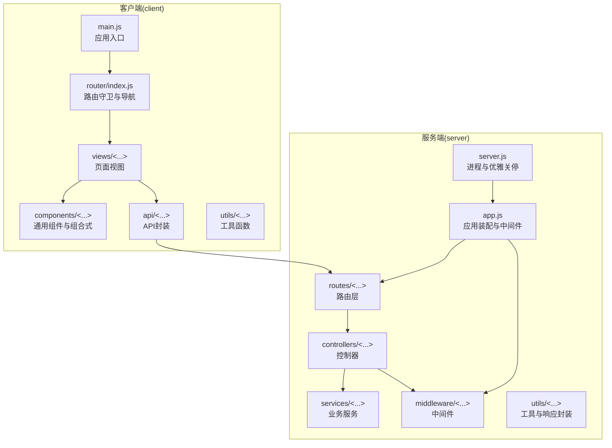
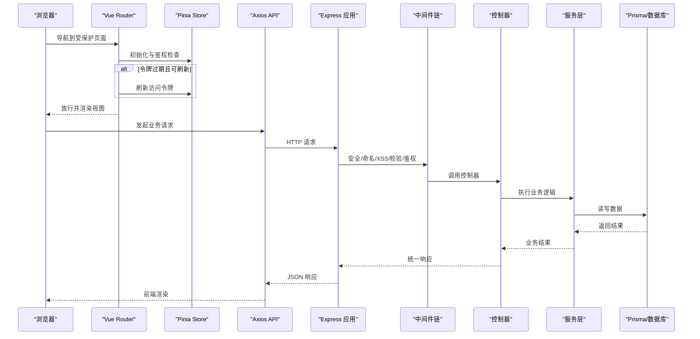
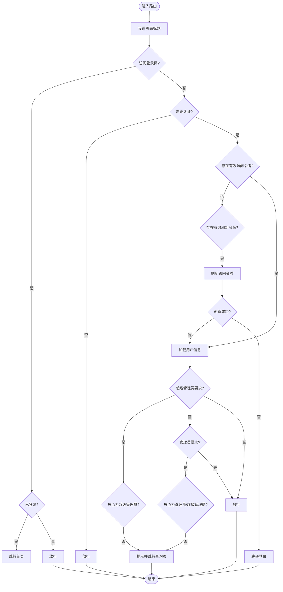
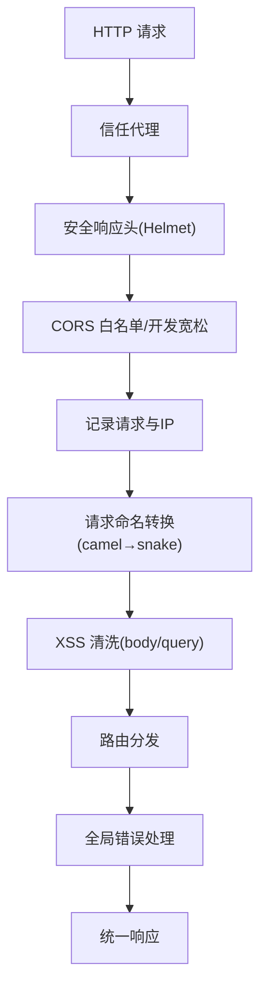
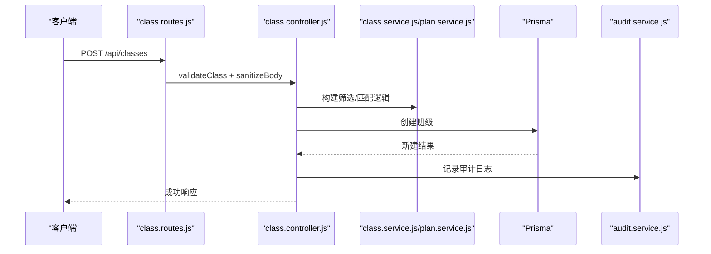
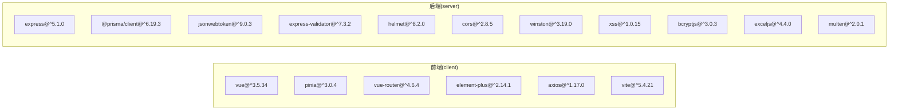

# 开发指南

<cite>
**本文引用的文件**
- [client/package.json](file://client/package.json)
- [server/package.json](file://server/package.json)
- [client/.prettierrc](file://client/.prettierrc)
- [client/eslint.config.js](file://client/eslint.config.js)
- [server/eslint.config.js](file://server/eslint.config.js)
- [client/vite.config.js](file://client/vite.config.js)
- [server/vitest.config.js](file://server/vitest.config.js)
- [server/vitest.setup.js](file://server/vitest.setup.js)
- [client/src/router/index.js](file://client/src/router/index.js)
- [server/src/app.js](file://server/src/app.js)
- [server/src/server.js](file://server/src/server.js)
- [client/src/main.js](file://client/src/main.js)
- [server/src/routes/class.routes.js](file://server/src/routes/class.routes.js)
- [server/src/controllers/class.controller.js](file://server/src/controllers/class.controller.js)
- [server/src/middleware/validation.js](file://server/src/middleware/validation.js)
- [server/src/__tests__/integration/auth.routes.test.js](file://server/src/__tests__/integration/auth.routes.test.js)
- [server/src/services/__tests__/auth.service.test.js](file://server/src/services/__tests__/auth.service.test.js)
- [docs/CODE_FORMATTING.md](file://docs/CODE_FORMATTING.md)
- [client/src/components/filter/FILTER_GUIDE.md](file://client/src/components/filter/FILTER_GUIDE.md)
- [client/src/composables/useCrudList.js](file://client/src/composables/useCrudList.js)
</cite>

## 目录
1. [简介](#简介)
2. [项目结构](#项目结构)
3. [核心组件](#核心组件)
4. [架构总览](#架构总览)
5. [详细组件分析](#详细组件分析)
6. [依赖分析](#依赖分析)
7. [性能考虑](#性能考虑)
8. [故障排查指南](#故障排查指南)
9. [结论](#结论)
10. [附录](#附录)

## 简介
本开发指南面向KEC课程管理平台的前后端开发者，聚焦于代码规范、Git工作流、提交规范、最佳实践、调试技巧、单元测试与集成测试策略、目录结构约定、命名规范、模块化开发模式以及贡献流程与代码审查标准。文档基于仓库现有配置与实现进行总结，旨在帮助团队高效协作、持续交付高质量代码。

## 项目结构
项目采用前后端分离架构，前端使用Vue 3 + Vite，后端使用Express + Prisma；根目录包含部署脚本与通用配置，client与server分别承载前端与后端源码及测试。

图表来源
- [client/src/main.js:1-115](file://client/src/main.js#L1-L115)
- [client/src/router/index.js:1-244](file://client/src/router/index.js#L1-L244)
- [server/src/app.js:1-158](file://server/src/app.js#L1-L158)
- [server/src/server.js:1-66](file://server/src/server.js#L1-L66)

章节来源
- [client/src/main.js:1-115](file://client/src/main.js#L1-L115)
- [client/src/router/index.js:1-244](file://client/src/router/index.js#L1-L244)
- [server/src/app.js:1-158](file://server/src/app.js#L1-L158)
- [server/src/server.js:1-66](file://server/src/server.js#L1-L66)

## 核心组件
- 前端应用入口与全局配置：初始化Pinia、路由、Element Plus、图标注册与全局错误处理。
- 路由与鉴权：集中式路由守卫，统一页面标题、登录态校验、令牌刷新、角色权限控制。
- 后端应用装配：Helmet安全头、CORS白名单、命名转换、XSS清洗、健康检查、统一错误处理。
- 通用CRUD组合式：封装列表加载、对话框表单、保存与删除、排序移动等通用逻辑。
- 筛选联动指南：提供可复用Hook与最佳实践，指导多页面筛选器优化。

章节来源
- [client/src/main.js:1-115](file://client/src/main.js#L1-L115)
- [client/src/router/index.js:151-241](file://client/src/router/index.js#L151-L241)
- [server/src/app.js:28-155](file://server/src/app.js#L28-L155)
- [client/src/composables/useCrudList.js:1-121](file://client/src/composables/useCrudList.js#L1-L121)
- [client/src/components/filter/FILTER_GUIDE.md:1-348](file://client/src/components/filter/FILTER_GUIDE.md#L1-L348)

## 架构总览
后端通过Express构建REST API，采用中间件链完成安全、命名转换、XSS清洗、参数校验与鉴权；路由层将HTTP请求分发至控制器，控制器调用服务层执行业务逻辑，并通过Prisma访问数据库；前端通过Vue Router进行SPA导航，使用Axios封装API调用，配合Pinia进行状态管理。

图表来源
- [client/src/router/index.js:151-241](file://client/src/router/index.js#L151-L241)
- [client/src/main.js:110-115](file://client/src/main.js#L110-L115)
- [server/src/app.js:28-155](file://server/src/app.js#L28-L155)
- [server/src/controllers/class.controller.js:244-314](file://server/src/controllers/class.controller.js#L244-L314)

章节来源
- [client/src/router/index.js:151-241](file://client/src/router/index.js#L151-L241)
- [server/src/app.js:28-155](file://server/src/app.js#L28-L155)
- [server/src/controllers/class.controller.js:244-314](file://server/src/controllers/class.controller.js#L244-L314)

## 详细组件分析

### 前端：路由与鉴权
- 路由守卫职责：页面标题设置、登录拦截、令牌刷新、用户信息加载、角色权限校验。
- 异常兜底：捕获守卫异常，避免白屏，统一跳转登录页。
- 页面重定向：根据用户角色动态跳转到仪表盘或查询页。

图表来源
- [client/src/router/index.js:151-241](file://client/src/router/index.js#L151-L241)

章节来源
- [client/src/router/index.js:151-241](file://client/src/router/index.js#L151-L241)

### 后端：应用装配与中间件
- 安全加固：Helmet禁用CSP与跨域嵌入策略以适配前端资源，CORS白名单与开发环境宽松策略。
- 命名转换：请求体camelCase→数据库snake_case，响应反向转换，统一命名风格。
- XSS防护：对请求体与查询参数进行清洗，敏感字段在中间件内跳过。
- 健康检查：数据库连通性检测，统一JSON响应。
- 错误处理：全局错误处理器，防止未捕获异常导致进程崩溃。

图表来源
- [server/src/app.js:28-155](file://server/src/app.js#L28-L155)

章节来源
- [server/src/app.js:28-155](file://server/src/app.js#L28-L155)

### 后端：路由与控制器（以班级管理为例）
- 路由层：定义GET/POST/PUT/DELETE等端点，绑定鉴权与参数校验中间件。
- 控制器层：实现列表查询、创建、更新、删除，含审计日志与缓存失效。
- 业务要点：动态状态计算、培养方案匹配与交叉匹配告警、级联删除排课记录、事务保证一致性。

图表来源
- [server/src/routes/class.routes.js:1-34](file://server/src/routes/class.routes.js#L1-L34)
- [server/src/controllers/class.controller.js:244-314](file://server/src/controllers/class.controller.js#L244-L314)

章节来源
- [server/src/routes/class.routes.js:1-34](file://server/src/routes/class.routes.js#L1-L34)
- [server/src/controllers/class.controller.js:244-314](file://server/src/controllers/class.controller.js#L244-L314)

### 参数校验中间件
- 统一验证结果处理：422错误返回结构化错误详情，日志脱敏记录请求体。
- 覆盖范围：登录、密码变更、分页、ID参数、各类实体的创建/更新规则。
- 规则设计：长度、范围、格式、枚举、布尔等约束，确保数据质量与安全性。

章节来源
- [server/src/middleware/validation.js:1-35](file://server/src/middleware/validation.js#L1-L35)
- [server/src/middleware/validation.js:40-90](file://server/src/middleware/validation.js#L40-L90)
- [server/src/middleware/validation.js:95-116](file://server/src/middleware/validation.js#L95-L116)
- [server/src/middleware/validation.js:121-125](file://server/src/middleware/validation.js#L121-L125)
- [server/src/middleware/validation.js:130-133](file://server/src/middleware/validation.js#L130-L133)

### 前端：通用CRUD组合式
- 能力：加载列表、打开/保存表单、删除确认、静默刷新、上移/下移排序。
- 交互：Element Plus消息与确认框，统一错误提示。
- 依赖：外部API函数集合，支持部分字段覆盖更新。

章节来源
- [client/src/composables/useCrudList.js:1-121](file://client/src/composables/useCrudList.js#L1-L121)

### 前端：筛选器联动优化
- 设计理念：Hook + 最佳实践，避免过度抽象，按页面定制但遵循统一模式。
- 技术要点：关联关系数据格式、交集过滤、性能优化（computed、Map、Set）。
- 迁移优先级：教学安排页 > 教师信息页 > 开课查询页 > 课时统计页。

章节来源
- [client/src/components/filter/FILTER_GUIDE.md:1-348](file://client/src/components/filter/FILTER_GUIDE.md#L1-L348)

## 依赖分析
- 前端依赖：Vue 3、Element Plus、Vue Router、Pinia、Axios、Vite插件自动导入与组件解析。
- 后端依赖：Express、Prisma、bcryptjs、helmet、cors、express-validator、winston、multer、exceljs、jsonwebtoken、rate-limit、xss。
- 测试：Vitest、Supertest、覆盖率v8提供器，测试环境变量与数据库占位。

图表来源
- [client/package.json:13-20](file://client/package.json#L13-L20)
- [server/package.json:28-42](file://server/package.json#L28-L42)

章节来源
- [client/package.json:1-33](file://client/package.json#L1-L33)
- [server/package.json:1-53](file://server/package.json#L1-L53)

## 性能考虑
- 前端打包：Rollup手动分包，拆分Vue生态、Element Plus、Axios等第三方库，减少首包体积。
- 前端运行时：按需注册图标，避免全量引入；优化筛选器联动，使用Map/Set与computed缓存。
- 后端查询：合并多次查询为单次聚合查询，构建关联映射，降低N+1风险；分页参数校验与上限控制。
- 中间件链：命名转换与XSS清洗在路由前执行，避免重复处理；CORS与安全头仅在必要范围内启用。

章节来源
- [client/vite.config.js:26-39](file://client/vite.config.js#L26-L39)
- [server/src/controllers/class.controller.js:128-238](file://server/src/controllers/class.controller.js#L128-L238)
- [server/src/middleware/validation.js:121-125](file://server/src/middleware/validation.js#L121-L125)

## 故障排查指南
- 健康检查：后端提供/health端点，数据库连通性检测，503错误时检查数据库连接。
- 全局错误处理：未捕获异常与未处理Promise拒绝会记录日志并退出进程，定位异常来源。
- 路由守卫异常：捕获异常并跳转登录页，避免白屏；查看控制台DEV日志。
- 参数校验失败：422返回结构化错误详情，日志记录脱敏请求体，核对字段与格式。
- 测试环境：Vitest全局设置JWT与数据库URL，确保测试隔离与稳定。

章节来源
- [server/src/app.js:94-113](file://server/src/app.js#L94-L113)
- [server/src/server.js:10-26](file://server/src/server.js#L10-L26)
- [client/src/router/index.js:234-240](file://client/src/router/index.js#L234-L240)
- [server/src/middleware/validation.js:7-35](file://server/src/middleware/validation.js#L7-L35)
- [server/vitest.setup.js:1-14](file://server/vitest.setup.js#L1-L14)

## 结论
本指南总结了KEC课程管理平台的代码规范、工作流与最佳实践，结合现有配置与实现，提供了从前端路由与鉴权、后端中间件与路由、到测试策略与性能优化的完整视角。建议团队在日常开发中严格遵循格式化与校验规则，完善测试覆盖，持续优化筛选器联动与查询性能，保障系统的稳定性与可维护性。

## 附录

### 代码规范与格式化
- Prettier配置：分号、单引号、行宽、缩进、尾随逗号等规则已在配置文件中定义。
- ESLint配置：前端使用Vue推荐规则与Prettier集成；后端使用ESLint推荐规则。
- 使用方法：在client与server目录分别执行格式化与ESLint修复脚本。
- IDE建议：VS Code与WebStorm/IntelliJ IDEA开启保存时格式化与ESLint修复。

章节来源
- [client/.prettierrc:1-12](file://client/.prettierrc#L1-L12)
- [client/eslint.config.js:1-42](file://client/eslint.config.js#L1-L42)
- [server/eslint.config.js:1-30](file://server/eslint.config.js#L1-L30)
- [docs/CODE_FORMATTING.md:17-106](file://docs/CODE_FORMATTING.md#L17-L106)

### Git工作流程与提交规范
- 建议采用分支模型：主干发布、特性分支、修复分支；提交前执行格式化与lint检查。
- 提交信息建议包含类型（feat/fix/docs/chore）与简要说明，便于自动化与回溯。
- CI/CD建议：在流水线中加入lint与测试步骤，确保质量门槛。

（本节为通用实践建议，不直接分析具体文件）

### Vue组件开发规范
- 组件命名：采用PascalCase；页面组件与通用组件分层存放。
- 组合式使用：优先使用composables封装可复用逻辑；在组件中保持简洁。
- 事件与属性：统一命名风格，避免在模板中直接调用函数；合理使用v-model与事件。

章节来源
- [client/src/composables/useCrudList.js:1-121](file://client/src/composables/useCrudList.js#L1-L121)

### Express路由设计原则
- 路由分层：路由层负责鉴权与参数校验，控制器负责业务编排，服务层负责领域逻辑。
- 统一响应：使用统一的成功/失败响应封装，便于前端处理。
- 错误处理：中间件与控制器统一错误处理，避免泄漏内部细节。

章节来源
- [server/src/app.js:28-155](file://server/src/app.js#L28-L155)
- [server/src/controllers/class.controller.js:244-314](file://server/src/controllers/class.controller.js#L244-L314)

### 调试技巧
- 前端：在main.js中设置全局错误与警告处理器；路由守卫中增加DEV日志。
- 后端：使用winston记录请求与错误；健康检查端点快速定位数据库问题。
- 测试：使用Vitest与Supertest进行端到端测试，mock关键依赖隔离环境。

章节来源
- [client/src/main.js:51-60](file://client/src/main.js#L51-L60)
- [server/src/app.js:77-82](file://server/src/app.js#L77-L82)
- [server/src/__tests__/integration/auth.routes.test.js:1-409](file://server/src/__tests__/integration/auth.routes.test.js#L1-L409)

### 单元测试与集成测试策略
- 单元测试：针对服务层与工具函数，mock配置与依赖，验证核心逻辑。
- 集成测试：使用Supertest对路由→中间件→控制器→服务→错误处理链路进行端到端验证。
- 覆盖率：Vitest配置提供覆盖率门槛，建议逐步提升基线。

章节来源
- [server/src/services/__tests__/auth.service.test.js:1-274](file://server/src/services/__tests__/auth.service.test.js#L1-L274)
- [server/src/__tests__/integration/auth.routes.test.js:1-409](file://server/src/__tests__/integration/auth.routes.test.js#L1-L409)
- [server/vitest.config.js:1-30](file://server/vitest.config.js#L1-L30)
- [server/vitest.setup.js:1-14](file://server/vitest.setup.js#L1-L14)

### 目录结构约定与模块化
- client：views按功能域组织页面，components存放通用组件，composables封装可复用逻辑，api封装HTTP请求。
- server：按领域分层（routes/controllers/services/middleware/utils），测试文件与源码同目录就近放置。
- 模块化：前端使用自动导入与组件解析，后端通过中间件与路由模块化装配。

章节来源
- [client/src/router/index.js:1-244](file://client/src/router/index.js#L1-L244)
- [server/src/app.js:1-27](file://server/src/app.js#L1-L27)

### 命名规范
- 变量与函数：camelCase；常量：SCREAMING_SNAKE_CASE。
- 文件与目录：小写加连字符；组件文件：PascalCase。
- 响应字段：数据库snake_case，经中间件转换为响应camelCase。

章节来源
- [server/src/app.js:84-89](file://server/src/app.js#L84-L89)

### 贡献流程与代码审查标准
- 分支与PR：从特性分支提交PR，描述变更内容与影响范围。
- 代码审查：关注安全性（Helmet、CORS、XSS）、健壮性（错误处理、参数校验）、可维护性（模块化、测试覆盖）。
- 质量门禁：本地格式化与lint通过，CI通过测试与覆盖率门槛。

（本节为通用流程建议，不直接分析具体文件）