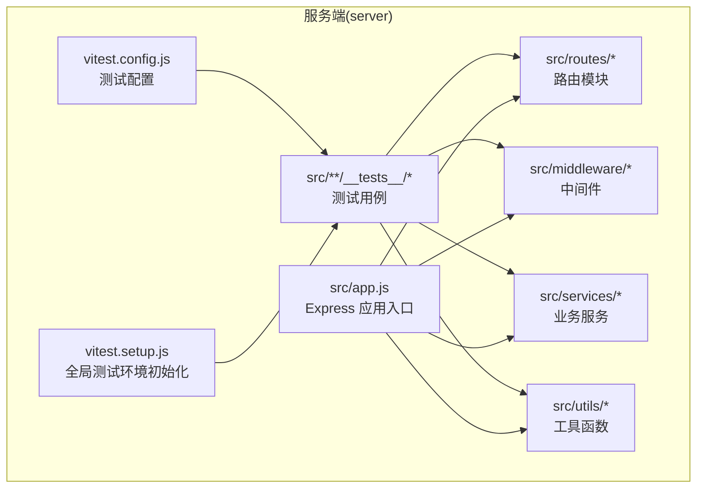
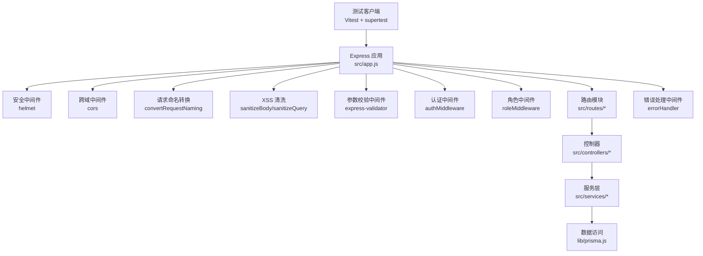
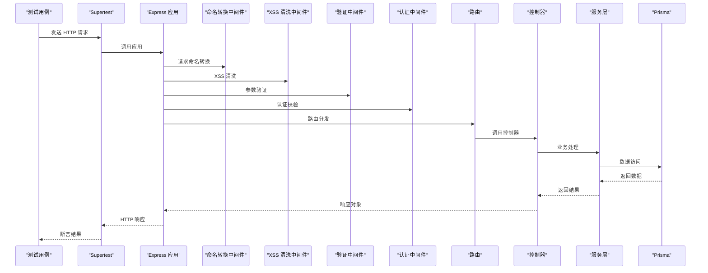
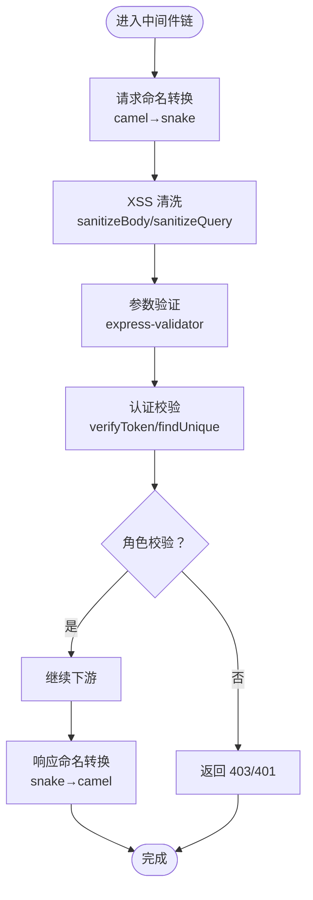
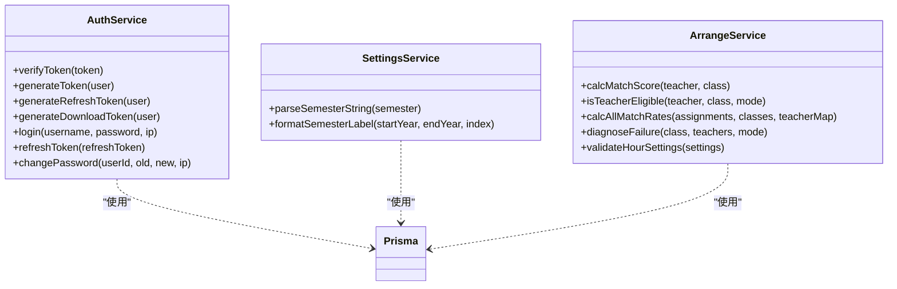
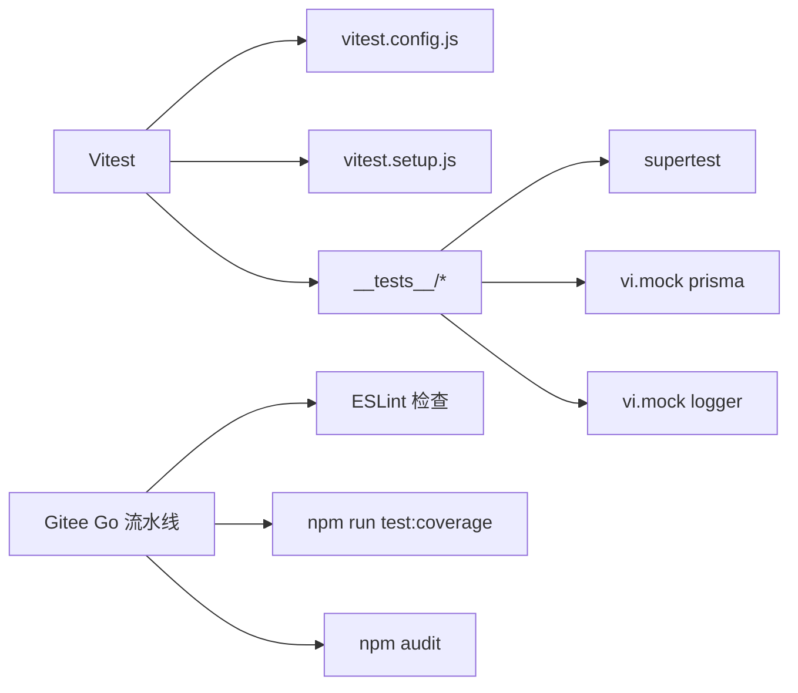

# 测试指南

<cite>
**本文档引用的文件**
- [server/vitest.config.js](file://server/vitest.config.js)
- [server/vitest.setup.js](file://server/vitest.setup.js)
- [server/package.json](file://server/package.json)
- [server/src/app.js](file://server/src/app.js)
- [server/src/__tests__/integration/auth.routes.test.js](file://server/src/__tests__/integration/auth.routes.test.js)
- [server/src/middleware/__tests__/validation.test.js](file://server/src/middleware/__tests__/validation.test.js)
- [server/src/middleware/__tests__/naming.middleware.test.js](file://server/src/middleware/__tests__/naming.middleware.test.js)
- [server/src/middleware/__tests__/auth.middleware.test.js](file://server/src/middleware/__tests__/auth.middleware.test.js)
- [server/src/services/__tests__/auth.service.test.js](file://server/src/services/__tests__/auth.service.test.js)
- [server/src/services/__tests__/settings.service.test.js](file://server/src/services/__tests__/settings.service.test.js)
- [server/src/services/arrange/__tests__/auto-arrange.test.js](file://server/src/services/arrange/__tests__/auto-arrange.test.js)
- [server/src/services/arrange/__tests__/diagnose-and-validate.test.js](file://server/src/services/arrange/__tests__/diagnose-and-validate.test.js)
- [server/src/utils/__tests__/naming.test.js](file://server/src/utils/__tests__/naming.test.js)
- [.gitee/workflows/kec-test.yml](file://.gitee/workflows/kec-test.yml)
</cite>

## 目录
1. [简介](#简介)
2. [项目结构](#项目结构)
3. [核心组件](#核心组件)
4. [架构总览](#架构总览)
5. [详细组件分析](#详细组件分析)
6. [依赖分析](#依赖分析)
7. [性能考虑](#性能考虑)
8. [故障排查指南](#故障排查指南)
9. [结论](#结论)
10. [附录](#附录)

## 简介
本指南面向 KEC 课程管理平台的测试工作，系统性介绍 Vitest 测试框架在后端服务中的配置与使用方法，覆盖单元测试、集成测试与端到端测试的编写规范；明确测试文件组织结构、用例设计原则与断言方法；提供 API 路由、服务层与中间件的测试示例；说明 Mock 数据准备、异步测试处理与覆盖率要求；并给出测试运行命令、CI/CD 集成与最佳实践建议。

## 项目结构
后端采用模块化目录结构，测试文件按功能域分布在对应模块的 __tests__ 目录中，并通过统一的 Vitest 配置进行扫描与执行。整体结构如下：

图表来源
- [server/vitest.config.js:1-29](file://server/vitest.config.js#L1-L29)
- [server/vitest.setup.js:1-13](file://server/vitest.setup.js#L1-L13)
- [server/src/app.js:1-158](file://server/src/app.js#L1-L158)

章节来源
- [server/vitest.config.js:1-29](file://server/vitest.config.js#L1-L29)
- [server/vitest.setup.js:1-13](file://server/vitest.setup.js#L1-L13)
- [server/src/app.js:1-158](file://server/src/app.js#L1-L158)

## 核心组件
- 测试框架与配置
  - Vitest：提供测试运行、断言、Mock 与覆盖率能力
  - 配置文件集中于 vitest.config.js，包含全局开关、环境、扫描规则、覆盖率阈值等
  - 全局初始化脚本 vitest.setup.js 设置 JWT、BCrypt、数据库 URL 等测试环境变量
- 测试类型与覆盖范围
  - 单元测试：针对工具函数、服务方法与中间件逻辑
  - 集成测试：对路由与中间件链路进行端到端 HTTP 测试
  - 端到端测试：通过 supertest 发送 HTTP 请求，验证完整链路行为
- 覆盖率策略
  - 使用 v8 提供商，排除 lib、logger、测试文件与部分工具文件
  - 设定语句、分支、函数、行覆盖率门槛，作为 CI 失败条件

章节来源
- [server/vitest.config.js:1-29](file://server/vitest.config.js#L1-L29)
- [server/vitest.setup.js:1-13](file://server/vitest.setup.js#L1-L13)
- [server/package.json:24-26](file://server/package.json#L24-L26)

## 架构总览
下图展示从测试发起到各层组件协作的典型流程，包括路由、中间件、控制器、服务与数据访问层的交互关系。

图表来源
- [server/src/app.js:1-158](file://server/src/app.js#L1-L158)

## 详细组件分析

### 路由测试（集成测试）
- 目标：验证路由 → 中间件（命名转换/XSS/验证/认证）→ 控制器 → 服务 → 错误处理的完整链路
- 关键策略：
  - 使用 supertest 对 Express 应用进行 HTTP 测试
  - 通过 vi.mock 隔离 Prisma 与审计日志，确保测试稳定
  - 在 beforeEach 中清理 Mock 与认证中间件缓存
  - 使用 makeToken 生成合法 JWT，覆盖 401/422/200 等多种响应场景
- 示例要点（路径参考）：
  - 健康检查：[server/src/__tests__/integration/auth.routes.test.js:90-97](file://server/src/__tests__/integration/auth.routes.test.js#L90-L97)
  - 登录接口：[server/src/__tests__/integration/auth.routes.test.js:102-197](file://server/src/__tests__/integration/auth.routes.test.js#L102-L197)
  - 刷新令牌：[server/src/__tests__/integration/auth.routes.test.js:202-236](file://server/src/__tests__/integration/auth.routes.test.js#L202-L236)
  - 当前用户：[server/src/__tests__/integration/auth.routes.test.js:241-278](file://server/src/__tests__/integration/auth.routes.test.js#L241-L278)
  - 修改密码：[server/src/__tests__/integration/auth.routes.test.js:283-360](file://server/src/__tests__/integration/auth.routes.test.js#L283-L360)
  - 登出接口：[server/src/__tests__/integration/auth.routes.test.js:365-383](file://server/src/__tests__/integration/auth.routes.test.js#L365-L383)
  - 未认证保护：[server/src/__tests__/integration/auth.routes.test.js:388-408](file://server/src/__tests__/integration/auth.routes.test.js#L388-L408)

图表来源
- [server/src/__tests__/integration/auth.routes.test.js:10-58](file://server/src/__tests__/integration/auth.routes.test.js#L10-L58)
- [server/src/app.js:1-158](file://server/src/app.js#L1-L158)

章节来源
- [server/src/__tests__/integration/auth.routes.test.js:1-409](file://server/src/__tests__/integration/auth.routes.test.js#L1-L409)
- [server/src/app.js:1-158](file://server/src/app.js#L1-L158)

### 中间件测试（单元测试）
- 参数验证中间件
  - 覆盖 handleValidationErrors、validateLogin、validateClass、validateChangePassword、validateIdParam、validatePagination、validateSemesterQuery、validateTeacherCreate、validateAutoArrange、validateReset 等
  - 通过自定义 runValidation 辅助函数模拟 Express 请求流转，断言 422 响应格式
  - 示例要点：
    - 验证通过/失败路径：[server/src/middleware/__tests__/validation.test.js:112-129](file://server/src/middleware/__tests__/validation.test.js#L112-L129)
    - 登录参数边界：[server/src/middleware/__tests__/validation.test.js:134-165](file://server/src/middleware/__tests__/validation.test.js#L134-L165)
    - 班级参数范围：[server/src/middleware/__tests__/validation.test.js:170-210](file://server/src/middleware/__tests__/validation.test.js#L170-L210)
    - 密码正则校验：[server/src/middleware/__tests__/validation.test.js:215-251](file://server/src/middleware/__tests__/validation.test.js#L215-L251)
- 命名转换中间件
  - 覆盖 convertRequestNaming、convertResponseNaming、autoConvertNaming
  - 断言请求体驼峰→下划线、响应体下划线→驼峰、数组/嵌套/分页对象转换、SKIP_KEYS 保护
  - 示例要点：
    - 请求命名转换：[server/src/middleware/__tests__/naming.middleware.test.js:47-96](file://server/src/middleware/__tests__/naming.middleware.test.js#L47-L96)
    - 响应命名转换：[server/src/middleware/__tests__/naming.middleware.test.js:101-217](file://server/src/middleware/__tests__/naming.middleware.test.js#L101-L217)
    - 组合中间件：[server/src/middleware/__tests__/naming.middleware.test.js:222-248](file://server/src/middleware/__tests__/naming.middleware.test.js#L222-L248)
- 认证中间件
  - 覆盖 authMiddleware、roleMiddleware、invalidateUserStatusCache
  - 断言无 token/无效 token/禁用用户/下载令牌等场景
  - 示例要点：
    - 认证中间件：[server/src/middleware/__tests__/auth.middleware.test.js:70-207](file://server/src/middleware/__tests__/auth.middleware.test.js#L70-L207)
    - 角色中间件：[server/src/middleware/__tests__/auth.middleware.test.js:212-276](file://server/src/middleware/__tests__/auth.middleware.test.js#L212-L276)

图表来源
- [server/src/middleware/__tests__/validation.test.js:17-46](file://server/src/middleware/__tests__/validation.test.js#L17-L46)
- [server/src/middleware/__tests__/naming.middleware.test.js:10-15](file://server/src/middleware/__tests__/naming.middleware.test.js#L10-L15)
- [server/src/middleware/__tests__/auth.middleware.test.js:43-44](file://server/src/middleware/__tests__/auth.middleware.test.js#L43-L44)

章节来源
- [server/src/middleware/__tests__/validation.test.js:1-447](file://server/src/middleware/__tests__/validation.test.js#L1-L447)
- [server/src/middleware/__tests__/naming.middleware.test.js:1-249](file://server/src/middleware/__tests__/naming.middleware.test.js#L1-L249)
- [server/src/middleware/__tests__/auth.middleware.test.js:1-277](file://server/src/middleware/__tests__/auth.middleware.test.js#L1-L277)

### 服务层测试（单元测试）
- 认证服务
  - 直接 Mock auth.config.js，避免依赖 .env
  - 覆盖 verifyToken/generateToken/generateRefreshToken/generateDownloadToken、login、refreshToken、changePassword
  - 示例要点：
    - Token 校验与生成：[server/src/services/__tests__/auth.service.test.js:89-137](file://server/src/services/__tests__/auth.service.test.js#L89-L137)
    - 登录流程：[server/src/services/__tests__/auth.service.test.js:142-202](file://server/src/services/__tests__/auth.service.test.js#L142-L202)
    - 刷新令牌：[server/src/services/__tests__/auth.service.test.js:207-237](file://server/src/services/__tests__/auth.service.test.js#L207-L237)
    - 修改密码：[server/src/services/__tests__/auth.service.test.js:242-273](file://server/src/services/__tests__/auth.service.test.js#L242-L273)
- 设置服务
  - 覆盖学期字符串解析与标签格式化
  - 示例要点：
    - 学期解析：[server/src/services/__tests__/settings.service.test.js:22-76](file://server/src/services/__tests__/settings.service.test.js#L22-L76)
    - 标签格式化：[server/src/services/__tests__/settings.service.test.js:81-89](file://server/src/services/__tests__/settings.service.test.js#L81-L89)
- 排课服务（算法与诊断）
  - 覆盖匹配评分、教师资格判断、匹配率计算与失败诊断
  - 示例要点：
    - 匹配评分差异断言：[server/src/services/arrange/__tests__/auto-arrange.test.js:87-245](file://server/src/services/arrange/__tests__/auto-arrange.test.js#L87-L245)
    - 教师资格判断：[server/src/services/arrange/__tests__/auto-arrange.test.js:249-303](file://server/src/services/arrange/__tests__/auto-arrange.test.js#L249-L303)
    - 匹配率计算：[server/src/services/arrange/__tests__/auto-arrange.test.js:308-380](file://server/src/services/arrange/__tests__/auto-arrange.test.js#L308-L380)
    - 失败诊断：[server/src/services/arrange/__tests__/diagnose-and-validate.test.js:87-216](file://server/src/services/arrange/__tests__/diagnose-and-validate.test.js#L87-L216)
    - 课时设置校验：[server/src/services/arrange/__tests__/diagnose-and-validate.test.js:221-302](file://server/src/services/arrange/__tests__/diagnose-and-validate.test.js#L221-L302)

图表来源
- [server/src/services/__tests__/auth.service.test.js:84-273](file://server/src/services/__tests__/auth.service.test.js#L84-L273)
- [server/src/services/__tests__/settings.service.test.js:16-89](file://server/src/services/__tests__/settings.service.test.js#L16-L89)
- [server/src/services/arrange/__tests__/auto-arrange.test.js:41-42](file://server/src/services/arrange/__tests__/auto-arrange.test.js#L41-L42)
- [server/src/services/arrange/__tests__/diagnose-and-validate.test.js:44-45](file://server/src/services/arrange/__tests__/diagnose-and-validate.test.js#L44-L45)

章节来源
- [server/src/services/__tests__/auth.service.test.js:1-274](file://server/src/services/__tests__/auth.service.test.js#L1-L274)
- [server/src/services/__tests__/settings.service.test.js:1-90](file://server/src/services/__tests__/settings.service.test.js#L1-L90)
- [server/src/services/arrange/__tests__/auto-arrange.test.js:1-381](file://server/src/services/arrange/__tests__/auto-arrange.test.js#L1-L381)
- [server/src/services/arrange/__tests__/diagnose-and-validate.test.js:1-303](file://server/src/services/arrange/__tests__/diagnose-and-validate.test.js#L1-L303)

### 工具函数测试（单元测试）
- 命名转换工具
  - 覆盖 camelToSnake/snakeToCamel 及浅拷贝版本，处理嵌套对象、数组、Date、类实例与 null/undefined 等边界
  - 示例要点：
    - 转换一致性往返：[server/src/utils/__tests__/naming.test.js:271-294](file://server/src/utils/__tests__/naming.test.js#L271-L294)
    - 类实例保护：[server/src/utils/__tests__/naming.test.js:131-154](file://server/src/utils/__tests__/naming.test.js#L131-L154)
    - 数组与嵌套处理：[server/src/utils/__tests__/naming.test.js:115-130](file://server/src/utils/__tests__/naming.test.js#L115-L130)

章节来源
- [server/src/utils/__tests__/naming.test.js:1-342](file://server/src/utils/__tests__/naming.test.js#L1-L342)

## 依赖分析
- 测试依赖与外部集成
  - Vitest：测试运行与断言
  - Supertest：HTTP 端到端测试
  - Prisma：数据访问层，测试中通过 vi.mock 替换
  - Winston：日志记录，测试中通过 vi.mock 避免输出干扰
- 覆盖率与 CI 集成
  - Vitest 配置启用 v8 覆盖率，设定门槛
  - Gitee Go 流水线在主分支推送时自动执行 ESLint、测试与安全审计

图表来源
- [server/vitest.config.js:1-29](file://server/vitest.config.js#L1-L29)
- [server/vitest.setup.js:1-13](file://server/vitest.setup.js#L1-L13)
- [server/package.json:24-26](file://server/package.json#L24-L26)
- [.gitee/workflows/kec-test.yml:15-46](file://.gitee/workflows/kec-test.yml#L15-L46)

章节来源
- [server/vitest.config.js:1-29](file://server/vitest.config.js#L1-L29)
- [server/vitest.setup.js:1-13](file://server/vitest.setup.js#L1-L13)
- [server/package.json:24-26](file://server/package.json#L24-L26)
- [.gitee/workflows/kec-test.yml:1-53](file://.gitee/workflows/kec-test.yml#L1-L53)

## 性能考虑
- Mock 策略
  - 优先使用 vi.mock 隔离数据库与外部依赖，减少 IO 延迟
  - 对日志模块进行 Mock，避免测试期间产生大量输出
- 测试组织
  - 将公共辅助函数（如 runValidation、makeReq/makeRes、makeToken）抽取为可复用工具，降低重复代码
- 覆盖率与性能平衡
  - 适度提高覆盖率门槛，鼓励更全面的测试覆盖，同时避免过度测试导致 CI 时间过长

## 故障排查指南
- 常见问题与定位
  - 路由未认证/权限不足：检查 authMiddleware 与 roleMiddleware 的 Mock 返回值与用户状态
  - 参数校验失败：核对 express-validator 的规则与 runValidation 的断言
  - 命名转换异常：确认 convertRequestNaming/convertResponseNaming 的输入输出与 SKIP_KEYS
  - 排课失败诊断：根据 diagnoseFailure 的五条路径逐一排查教师容量、偏好匹配与教材上限
- 日志与调试
  - 在测试中使用 vi.mock logger，必要时临时放开以查看输出
  - 使用 Vitest 的 watch 模式快速迭代调试

章节来源
- [server/src/middleware/__tests__/auth.middleware.test.js:70-276](file://server/src/middleware/__tests__/auth.middleware.test.js#L70-L276)
- [server/src/middleware/__tests__/validation.test.js:17-447](file://server/src/middleware/__tests__/validation.test.js#L17-L447)
- [server/src/middleware/__tests__/naming.middleware.test.js:10-249](file://server/src/middleware/__tests__/naming.middleware.test.js#L10-L249)
- [server/src/services/arrange/__tests__/diagnose-and-validate.test.js:87-302](file://server/src/services/arrange/__tests__/diagnose-and-validate.test.js#L87-L302)

## 结论
本指南基于现有测试用例总结了 KEC 平台后端的测试体系，明确了 Vitest 配置、测试文件组织、断言方法与覆盖率策略，并提供了路由、中间件与服务层的测试示例与最佳实践。建议在后续迭代中持续补充测试用例，提升覆盖率与稳定性，确保关键业务逻辑（认证、排课、导入导出）得到充分验证。

## 附录

### 测试文件组织结构
- 目录分布
  - 路由集成测试：src/__tests__/integration/*
  - 中间件单元测试：src/middleware/__tests__/*
  - 服务单元测试：src/services/__tests__/*
  - 工具函数单元测试：src/utils/__tests__/*
- 命名规范
  - 测试文件统一以 .test.js 结尾，位于对应模块的 __tests__ 目录
  - 使用 describe/it/expect/vi 等 Vitest API

章节来源
- [server/src/__tests__/integration/auth.routes.test.js:1-10](file://server/src/__tests__/integration/auth.routes.test.js#L1-L10)
- [server/src/middleware/__tests__/validation.test.js:1-16](file://server/src/middleware/__tests__/validation.test.js#L1-L16)
- [server/src/services/__tests__/auth.service.test.js:1-6](file://server/src/services/__tests__/auth.service.test.js#L1-L6)
- [server/src/utils/__tests__/naming.test.js:1-12](file://server/src/utils/__tests__/naming.test.js#L1-L12)

### 测试用例设计原则
- 单一职责：每个 describe 专注于一个模块或功能点
- 边界与异常：覆盖正常路径、边界值与异常场景
- 可读性：使用清晰的断言与描述，便于维护
- 可复用：提取公共辅助函数，减少重复代码

### 断言方法与最佳实践
- 常用断言
  - 基本断言：toBe、toEqual、toBeTruthy、toBeNull
  - 异常断言：toThrow、rejects.toThrow
  - Mock 断言：toHaveBeenCalled、toHaveBeenCalledWith、toHaveBeenCalledTimes
- 异步测试
  - 使用 async/await 与 expect(asyncFn()).rejects.toThrow
  - 在 beforeEach 中清理 Mock 与缓存，避免状态污染

章节来源
- [server/src/__tests__/integration/auth.routes.test.js:102-197](file://server/src/__tests__/integration/auth.routes.test.js#L102-L197)
- [server/src/services/__tests__/auth.service.test.js:149-201](file://server/src/services/__tests__/auth.service.test.js#L149-L201)
- [server/src/middleware/__tests__/validation.test.js:113-128](file://server/src/middleware/__tests__/validation.test.js#L113-L128)

### Mock 数据准备
- 环境变量
  - 在 vitest.setup.js 中设置 JWT、BCrypt、NODE_ENV 与 DATABASE_URL
- 模块 Mock
  - 使用 vi.mock 替换 Prisma、Logger、AuthService、auth.config 等依赖
- 工具函数
  - 提供 makeToken、makeReq/makeRes、runValidation 等辅助函数

章节来源
- [server/vitest.setup.js:1-13](file://server/vitest.setup.js#L1-L13)
- [server/src/__tests__/integration/auth.routes.test.js:18-58](file://server/src/__tests__/integration/auth.routes.test.js#L18-L58)
- [server/src/middleware/__tests__/validation.test.js:57-107](file://server/src/middleware/__tests__/validation.test.js#L57-L107)

### 异步测试处理
- 使用 async/await 调用异步函数与服务方法
- 对 Promise 抛错使用 rejects.toThrow
- 在测试结束后清理 Mock 与缓存

章节来源
- [server/src/services/__tests__/auth.service.test.js:149-201](file://server/src/services/__tests__/auth.service.test.js#L149-L201)
- [server/src/middleware/__tests__/auth.middleware.test.js:70-207](file://server/src/middleware/__tests__/auth.middleware.test.js#L70-L207)

### 测试覆盖率要求
- 覆盖率提供商：v8
- 排除范围：测试文件、lib/*.js、utils/logger.js
- 覆盖率门槛：语句、分支、函数、行均不低于配置值

章节来源
- [server/vitest.config.js:10-27](file://server/vitest.config.js#L10-L27)

### 测试运行命令与 CI/CD 集成
- 本地运行
  - 运行测试：npm run test
  - 监听模式：npm run test:watch
  - 带覆盖率：npm run test:coverage
- CI/CD
  - Gitee Go 流水线在主分支推送时执行 ESLint、测试与安全审计
  - 测试失败将阻断部署

章节来源
- [server/package.json:24-26](file://server/package.json#L24-L26)
- [.gitee/workflows/kec-test.yml:15-46](file://.gitee/workflows/kec-test.yml#L15-L46)