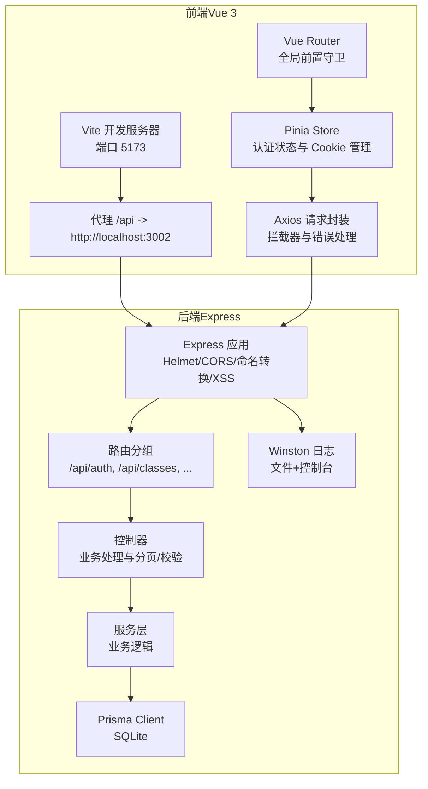
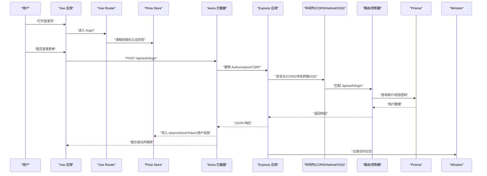
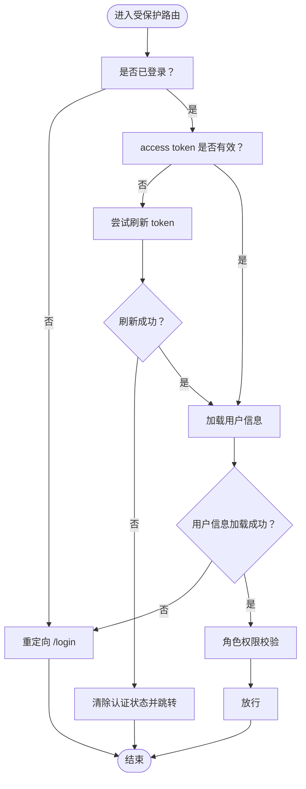
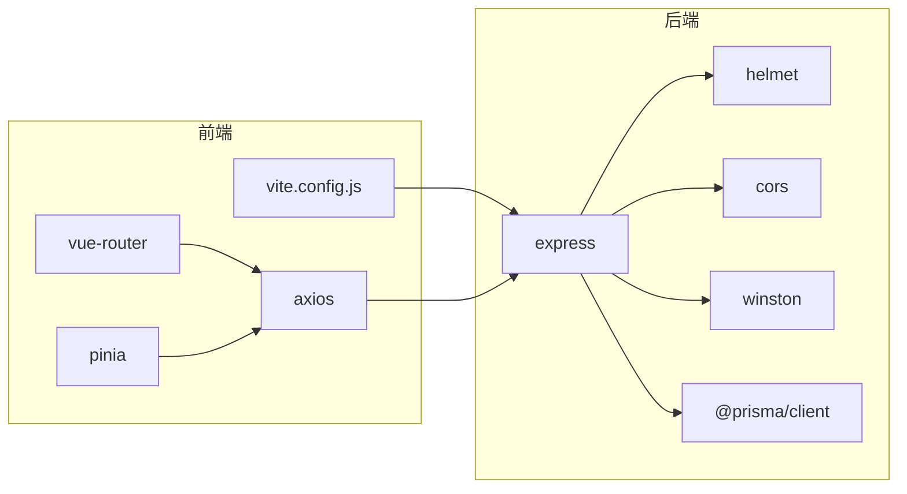

# 调试技巧

<cite>
**本文引用的文件**
- [client/package.json](file://client/package.json)
- [server/package.json](file://server/package.json)
- [client/vite.config.js](file://client/vite.config.js)
- [server/src/utils/logger.js](file://server/src/utils/logger.js)
- [client/src/utils/request.js](file://client/src/utils/request.js)
- [server/src/app.js](file://server/src/app.js)
- [server/src/middleware/error.js](file://server/src/middleware/error.js)
- [client/src/stores/auth.js](file://client/src/stores/auth.js)
- [server/src/lib/prisma.js](file://server/src/lib/prisma.js)
- [client/src/router/index.js](file://client/src/router/index.js)
- [server/src/controllers/audit.controller.js](file://server/src/controllers/audit.controller.js)
- [client/src/views/Login.vue](file://client/src/views/Login.vue)
- [client/src/main.js](file://client/src/main.js)
- [server/.env.example](file://server/.env.example)
- [start-dev.sh](file://start-dev.sh)
- [deploy.sh](file://deploy.sh)
- [server/src/utils/error.js](file://server/src/utils/error.js)
</cite>

## 目录
1. [简介](#简介)
2. [项目结构](#项目结构)
3. [核心组件](#核心组件)
4. [架构总览](#架构总览)
5. [详细组件分析](#详细组件分析)
6. [依赖分析](#依赖分析)
7. [性能考虑](#性能考虑)
8. [故障排查指南](#故障排查指南)
9. [结论](#结论)
10. [附录](#附录)

## 简介
本文件面向 KECAPI（KEC 课程管理平台）的前端与后端开发者，提供系统化的调试方法与实践建议，涵盖：
- 前端 Vue 应用：浏览器开发者工具、Vue DevTools、网络请求调试
- 后端 Express 服务：Node.js 调试器、日志系统、错误追踪
- 常见问题诊断：API 调用失败、数据库连接问题、性能瓶颈定位
- 开发与生产环境差异：日志级别、CORS、安全头、健康检查
- 远程调试与监控：PM2、日志文件、健康检查接口

## 项目结构
KEC 采用前后端分离架构：
- 前端（client）：基于 Vite + Vue 3 + Pinia + Element Plus，通过代理将 /api 请求转发至后端
- 后端（server）：基于 Express，使用 Prisma 管理 SQLite，Winston 输出日志，统一错误处理中间件

图示来源
- [client/vite.config.js:46-54](file://client/vite.config.js#L46-L54)
- [server/src/app.js:28-157](file://server/src/app.js#L28-L157)
- [client/src/utils/request.js:7-15](file://client/src/utils/request.js#L7-L15)
- [client/src/router/index.js:151-241](file://client/src/router/index.js#L151-L241)
- [client/src/stores/auth.js:8-221](file://client/src/stores/auth.js#L8-L221)
- [server/src/lib/prisma.js:1-34](file://server/src/lib/prisma.js#L1-L34)
- [server/src/utils/logger.js:34-85](file://server/src/utils/logger.js#L34-L85)

章节来源
- [client/vite.config.js:1-56](file://client/vite.config.js#L1-L56)
- [server/src/app.js:1-158](file://server/src/app.js#L1-L158)

## 核心组件
- 前端请求封装与拦截器：统一处理鉴权头、CSRF、401 刷新、错误提示与超时
- Vue Router 全局守卫：统一鉴权、角色校验、用户信息加载与重定向
- Express 应用：安全头、CORS 白名单、命名转换、XSS 清洗、统一错误处理
- Winston 日志：按级别输出到文件与控制台，审计日志独立文件
- Prisma 日志：开发环境监听错误与警告事件，便于定位 SQL 问题

章节来源
- [client/src/utils/request.js:17-142](file://client/src/utils/request.js#L17-L142)
- [client/src/router/index.js:151-241](file://client/src/router/index.js#L151-L241)
- [server/src/app.js:33-155](file://server/src/app.js#L33-L155)
- [server/src/utils/logger.js:14-85](file://server/src/utils/logger.js#L14-L85)
- [server/src/lib/prisma.js:24-33](file://server/src/lib/prisma.js#L24-L33)

## 架构总览
下图展示一次典型登录流程的端到端调用链路，包括前端拦截器、后端路由与中间件、数据库访问及日志输出。

图示来源
- [client/src/views/Login.vue:118-149](file://client/src/views/Login.vue#L118-L149)
- [client/src/stores/auth.js:48-89](file://client/src/stores/auth.js#L48-L89)
- [client/src/utils/request.js:51-142](file://client/src/utils/request.js#L51-L142)
- [server/src/app.js:92-155](file://server/src/app.js#L92-L155)
- [server/src/lib/prisma.js:22-33](file://server/src/lib/prisma.js#L22-L33)
- [server/src/utils/logger.js:78-85](file://server/src/utils/logger.js#L78-L85)

## 详细组件分析

### 前端调试要点（浏览器与 Vue）
- 浏览器开发者工具
  - Console：查看 Vue 错误边界与警告处理器输出
  - Network：观察 /api 请求的 Header（Authorization、X-CSRF-Token）、状态码、响应体
  - Sources：断点调试登录流程与路由守卫
- Vue DevTools
  - 查看组件层级、Props/State、Pinia Store（token、userInfo、角色）
  - 观察路由元信息（requiresAuth/requiresAdmin/requiresSuperAdmin）
- 网络请求调试
  - 代理配置：确认 /api 转发到后端端口
  - 请求拦截器：检查 Authorization 与 CSRF 注入
  - 响应拦截器：关注 401 刷新队列、403 权限不足、超时与网络错误提示

章节来源
- [client/src/main.js:51-60](file://client/src/main.js#L51-L60)
- [client/src/router/index.js:151-241](file://client/src/router/index.js#L151-L241)
- [client/src/utils/request.js:7-15](file://client/src/utils/request.js#L7-L15)
- [client/src/utils/request.js:51-142](file://client/src/utils/request.js#L51-L142)
- [client/vite.config.js:46-54](file://client/vite.config.js#L46-L54)

### 后端调试要点（Node.js、日志、错误）
- Node.js 调试器
  - 开发脚本：使用 --watch-path=src 启动，修改即重启
  - 断点：在控制器、服务层、中间件设置断点，观察 req/res、Prisma 事件
- 日志系统
  - Winston：error/combined/audit 三类文件；开发环境控制台彩色输出
  - 访问日志：每次请求记录 method/path/ip
  - CORS 阻断：记录被拒绝的 origin
  - Prisma 事件：开发环境监听 error/warn
- 错误追踪
  - 统一错误处理中间件：Prisma/自定义 AppError/未知错误分类处理
  - 生产环境安全消息：隐藏堆栈与内部细节

章节来源
- [server/package.json:12-13](file://server/package.json#L12-L13)
- [server/src/app.js:77-82](file://server/src/app.js#L77-L82)
- [server/src/app.js:70-72](file://server/src/app.js#L70-L72)
- [server/src/utils/logger.js:34-85](file://server/src/utils/logger.js#L34-L85)
- [server/src/lib/prisma.js:24-33](file://server/src/lib/prisma.js#L24-L33)
- [server/src/middleware/error.js:35-62](file://server/src/middleware/error.js#L35-L62)

### 认证与路由守卫调试
- 登录流程
  - 前端：表单校验、调用 /auth/login、写入 Cookie 与 localStorage
  - 后端：校验用户名/密码、签发 JWT、返回用户信息与刷新令牌
- 路由守卫
  - 未登录重定向 /login
  - access token 过期则尝试刷新，失败则强制登出
  - 加载用户信息失败则重定向
  - 角色校验：requiresAdmin/requiresSuperAdmin
- 令牌刷新
  - 响应拦截器对 401 的统一处理与队列重试
  - Store.refreshAccessToken 与 Cookie 更新

图示来源
- [client/src/router/index.js:151-241](file://client/src/router/index.js#L151-L241)
- [client/src/stores/auth.js:106-128](file://client/src/stores/auth.js#L106-L128)
- [client/src/utils/request.js:64-112](file://client/src/utils/request.js#L64-L112)

章节来源
- [client/src/views/Login.vue:118-149](file://client/src/views/Login.vue#L118-L149)
- [client/src/stores/auth.js:48-89](file://client/src/stores/auth.js#L48-L89)
- [client/src/router/index.js:151-241](file://client/src/router/index.js#L151-L241)

### 数据库与审计日志
- Prisma
  - 开发环境监听 error/warn 事件，便于快速定位 SQL 问题
  - 测试环境可指定 DATABASE_URL
- 审计日志
  - 控制器提供查询接口，支持分页与筛选
  - Winston 审计通道独立文件，便于合规审计

章节来源
- [server/src/lib/prisma.js:16-33](file://server/src/lib/prisma.js#L16-L33)
- [server/src/controllers/audit.controller.js:7-21](file://server/src/controllers/audit.controller.js#L7-L21)
- [server/src/utils/logger.js:52-58](file://server/src/utils/logger.js#L52-L58)

## 依赖分析
- 前端
  - Vite 代理：将 /api 转发到后端
  - Axios：统一请求/响应拦截器
  - Vue Router/Pinia：状态与导航
- 后端
  - Express：路由与中间件
  - Winston：日志
  - Prisma：ORM
  - Helmet/CORS：安全与跨域
  - 错误类：AppError/NotFoundError/ValidationError 等

图示来源
- [client/vite.config.js:46-54](file://client/vite.config.js#L46-L54)
- [client/src/utils/request.js:1-145](file://client/src/utils/request.js#L1-L145)
- [client/src/router/index.js:1-244](file://client/src/router/index.js#L1-L244)
- [client/src/stores/auth.js:1-222](file://client/src/stores/auth.js#L1-L222)
- [server/src/app.js:1-158](file://server/src/app.js#L1-L158)
- [server/src/utils/logger.js:1-96](file://server/src/utils/logger.js#L1-L96)
- [server/src/lib/prisma.js:1-34](file://server/src/lib/prisma.js#L1-L34)

章节来源
- [client/package.json:13-31](file://client/package.json#L13-L31)
- [server/package.json:28-51](file://server/package.json#L28-L51)

## 性能考虑
- 前端
  - Vite 构建开启 sourcemap（开发）以便调试，生产关闭以减小体积
  - 依赖分块：将 vue、element-plus、axios 等拆分为独立 chunk
- 后端
  - Winston 日志轮转与大小限制，避免磁盘膨胀
  - Prisma 在开发环境启用 error/warn 监听，及时发现慢查询
  - Express 限制请求体大小，避免内存压力

章节来源
- [client/vite.config.js:26-39](file://client/vite.config.js#L26-L39)
- [server/src/utils/logger.js:39-58](file://server/src/utils/logger.js#L39-L58)
- [server/src/app.js:77](file://server/src/app.js#L77)
- [server/src/lib/prisma.js:8-14](file://server/src/lib/prisma.js#L8-L14)

## 故障排查指南

### API 调用失败
- 检查代理配置：确认 /api 已转发到后端端口
- 查看 Network 面板：Headers（Authorization、X-CSRF-Token）、状态码、响应体
- 响应拦截器：关注 401 刷新队列、403 权限不足、超时与网络错误提示
- 后端日志：查看访问日志与错误日志，定位具体路由与参数

章节来源
- [client/vite.config.js:46-54](file://client/vite.config.js#L46-L54)
- [client/src/utils/request.js:51-142](file://client/src/utils/request.js#L51-L142)
- [server/src/app.js:77-82](file://server/src/app.js#L77-L82)
- [server/src/utils/logger.js:78-85](file://server/src/utils/logger.js#L78-L85)

### 数据库连接问题
- 健康检查：访问 /api/health，确认数据库连接状态
- Prisma 日志：开发环境监听 error/warn 事件
- 环境变量：确认 DATABASE_URL 与 JWT_SECRET 等

章节来源
- [server/src/app.js:94-113](file://server/src/app.js#L94-L113)
- [server/src/lib/prisma.js:24-33](file://server/src/lib/prisma.js#L24-L33)
- [server/.env.example:7-13](file://server/.env.example#L7-L13)

### 跨域与安全头
- CORS：开发环境允许 localhost 端口，生产环境配置白名单
- Helmet：禁用 CSP 与 COEP 以避免与前端资源冲突
- 审计日志：被拒绝的 origin 会记录到日志

章节来源
- [server/src/app.js:41-76](file://server/src/app.js#L41-L76)
- [server/src/app.js:33-39](file://server/src/app.js#L33-L39)
- [server/src/app.js:70-72](file://server/src/app.js#L70-L72)

### 认证与权限问题
- 登录失败：检查用户名/密码、401/403 业务提示
- 令牌过期：确认刷新流程与 Cookie 更新
- 角色权限：requiresAdmin/requiresSuperAdmin 校验失败会重定向

章节来源
- [client/src/views/Login.vue:118-149](file://client/src/views/Login.vue#L118-L149)
- [client/src/stores/auth.js:106-128](file://client/src/stores/auth.js#L106-L128)
- [client/src/router/index.js:214-230](file://client/src/router/index.js#L214-L230)

### 开发与生产差异
- 环境变量：NODE_ENV、PORT、DATABASE_URL、JWT_SECRET、CORS_ORIGINS、LOG_LEVEL
- 日志级别：开发 debug，生产 info
- 健康检查：生产环境通过 /api/health 验证数据库连接
- 启动方式：开发使用 npm run dev，生产使用 PM2

章节来源
- [server/.env.example:1-33](file://server/.env.example#L1-L33)
- [server/src/utils/logger.js:35](file://server/src/utils/logger.js#L35)
- [server/src/app.js:94-113](file://server/src/app.js#L94-L113)
- [start-dev.sh:54](file://start-dev.sh#L54)
- [deploy.sh:207-210](file://deploy.sh#L207-L210)

### 远程调试与监控
- PM2：部署脚本使用 PM2 启动并持久化，支持日志查看与状态管理
- 日志：后端日志目录与文件轮转策略
- 健康检查：生产环境提供 /api/health 与 /api/settings 接口验证

章节来源
- [deploy.sh:194-210](file://deploy.sh#L194-L210)
- [server/src/utils/logger.js:39-58](file://server/src/utils/logger.js#L39-L58)
- [server/src/app.js:94-113](file://server/src/app.js#L94-L113)
- [server/src/app.js:140-141](file://server/src/app.js#L140-L141)

## 结论
通过结合浏览器开发者工具、Vue DevTools、Node.js 调试器与 Winston 日志，配合统一的错误处理与健康检查机制，能够高效定位并解决 KECAPI 在开发与生产环境中的各类问题。建议在日常开发中充分利用代理、拦截器与路由守卫的调试能力，并在生产环境中严格控制日志级别与 CORS 白名单，确保系统稳定与安全。

## 附录
- 开发环境启动脚本：一键重置数据库、启动前后端、打印默认管理员账号
- 生产环境部署脚本：自动化安装依赖、生成安全密钥、初始化数据库与系统设置、PM2 启动与健康检查验证

章节来源
- [start-dev.sh:24-55](file://start-dev.sh#L24-L55)
- [deploy.sh:101-175](file://deploy.sh#L101-L175)
- [deploy.sh:224-238](file://deploy.sh#L224-L238)