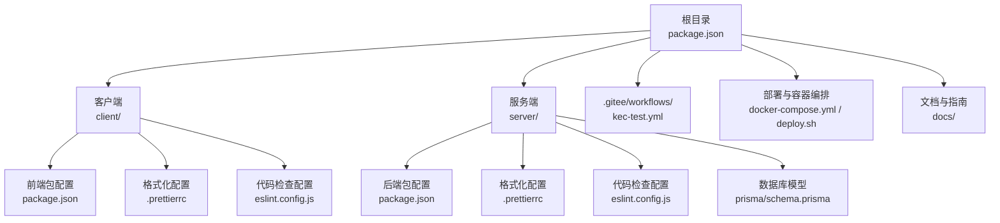
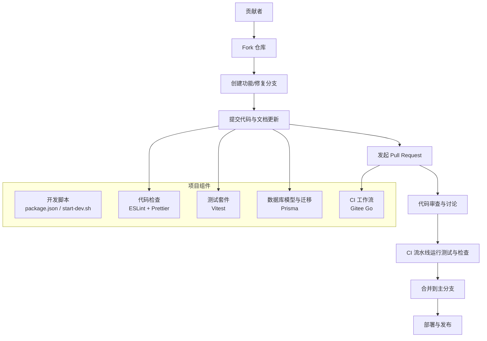
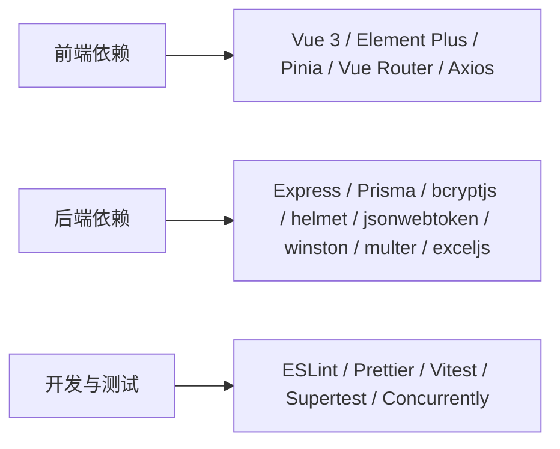

# 贡献指南

<cite>
**本文引用的文件**   
- [README.md](file://README.md)
- [package.json](file://package.json)
- [client/package.json](file://client/package.json)
- [server/package.json](file://server/package.json)
- [client/.prettierrc](file://client/.prettierrc)
- [server/.prettierrc](file://server/.prettierrc)
- [client/eslint.config.js](file://client/eslint.config.js)
- [server/eslint.config.js](file://server/eslint.config.js)
- [docs/CODE_FORMATTING.md](file://docs/CODE_FORMATTING.md)
- [.gitee/workflows/kec-test.yml](file://.gitee/workflows/kec-test.yml)
- [server/prisma/schema.prisma](file://server/prisma/schema.prisma)
- [start-dev.sh](file://start-dev.sh)
- [deploy.sh](file://deploy.sh)
- [docker-compose.yml](file://docker-compose.yml)
- [docs/TEACHING_ARRANGE_LOGIC.md](file://docs/TEACHING_ARRANGE_LOGIC.md)
</cite>

## 目录
1. [简介](#简介)
2. [项目结构](#项目结构)
3. [核心组件](#核心组件)
4. [架构总览](#架构总览)
5. [详细组件分析](#详细组件分析)
6. [依赖分析](#依赖分析)
7. [性能考虑](#性能考虑)
8. [故障排查指南](#故障排查指南)
9. [结论](#结论)
10. [附录](#附录)

## 简介
本指南面向希望参与 KECAPI 课程管理平台开发的贡献者，提供从 Fork 项目、创建分支、提交代码到发起 Pull Request 的完整流程；明确代码审查标准、文档更新要求与社区行为准则；规范 Issue 报告、功能请求与 Bug 修复流程；给出开发环境搭建、依赖安装与本地测试要求，并说明贡献者许可协议与知识产权相关信息。

## 项目结构
KEC 课程管理平台采用前后端分离架构，包含客户端（Vue 3 + Element Plus）、服务端（Express + Prisma）与配套的 CI 工作流、部署脚本与数据库模型定义。根目录提供统一的开发与构建脚本，子目录分别承载前端、后端与文档资源。

图表来源
- [README.md:160-194](file://README.md#L160-L194)
- [package.json:1-25](file://package.json#L1-L25)
- [client/package.json:1-33](file://client/package.json#L1-L33)
- [server/package.json:1-53](file://server/package.json#L1-L53)
- [docker-compose.yml:1-73](file://docker-compose.yml#L1-L73)
- [deploy.sh:1-262](file://deploy.sh#L1-L262)

章节来源
- [README.md:160-194](file://README.md#L160-L194)
- [package.json:1-25](file://package.json#L1-L25)

## 核心组件
- 统一开发脚本与版本管理
  - 根目录提供统一的开发、数据库迁移与版本升级脚本，便于跨平台一致性操作。
- 前后端工程化配置
  - 前端：Vite + Vue 3 + ESLint + Prettier
  - 后端：Express + Prisma + Vitest + ESLint + Prettier
- 数据库模型与迁移
  - Prisma Schema 定义核心实体关系与索引，配合迁移脚本进行演进。
- CI/CD 与自动化测试
  - Gitee Go 流水线在主分支推送时自动执行代码检查、测试与安全审计。
- 部署与容器化
  - Docker Compose 提供容器化部署；Shell 脚本支持本地与远程一键部署。

章节来源
- [package.json:7-16](file://package.json#L7-L16)
- [client/package.json:6-12](file://client/package.json#L6-L12)
- [server/package.json:11-26](file://server/package.json#L11-L26)
- [server/prisma/schema.prisma:1-308](file://server/prisma/schema.prisma#L1-L308)
- [.gitee/workflows/kec-test.yml:15-53](file://.gitee/workflows/kec-test.yml#L15-L53)
- [docker-compose.yml:4-73](file://docker-compose.yml#L4-L73)
- [deploy.sh:1-262](file://deploy.sh#L1-L262)

## 架构总览
下图展示贡献流程与项目关键组件之间的关系：贡献者通过 Fork 与分支管理参与开发，借助本地开发脚本与工程化工具保证质量，最终通过 PR 提交变更；CI 流水线负责自动化测试与安全审计，确保合并质量。

图表来源
- [package.json:7-16](file://package.json#L7-L16)
- [start-dev.sh:14-55](file://start-dev.sh#L14-L55)
- [client/eslint.config.js:1-42](file://client/eslint.config.js#L1-L42)
- [server/eslint.config.js:1-30](file://server/eslint.config.js#L1-L30)
- [.gitee/workflows/kec-test.yml:15-53](file://.gitee/workflows/kec-test.yml#L15-L53)
- [server/package.json:24-26](file://server/package.json#L24-L26)
- [server/prisma/schema.prisma:1-308](file://server/prisma/schema.prisma#L1-L308)

## 详细组件分析

### 贡献流程与分支策略
- Fork 与克隆
  - 在代码托管平台上 Fork 仓库，克隆到本地后配置上游以便同步主分支更新。
- 分支命名与提交
  - 使用清晰的分支命名（如 feat/xxx、fix/xxx、docs/xxx），提交信息遵循约定式提交风格。
- 提交与 PR
  - 提交前确保通过格式化与代码检查；PR 描述包含变更动机、实现方式与测试要点。
- 代码审查与合并
  - 至少一名维护者审查同意后方可合并；合并前确保 CI 通过。

章节来源
- [README.md:33-86](file://README.md#L33-L86)

### 代码审查标准
- 代码质量
  - 通过 ESLint 与 Prettier 统一风格；避免未使用变量与冗余逻辑。
- 可读性与注释
  - 函数与复杂逻辑需有清晰注释；组件与路由按领域划分，职责单一。
- 安全与健壮性
  - 输入校验、错误处理与日志记录符合中间件与工具函数规范。
- 测试覆盖
  - 新增功能需配套单元测试；关注边界条件与异常路径。

章节来源
- [client/eslint.config.js:32-36](file://client/eslint.config.js#L32-L36)
- [server/eslint.config.js:21-24](file://server/eslint.config.js#L21-L24)
- [docs/CODE_FORMATTING.md:52-56](file://docs/CODE_FORMATTING.md#L52-L56)

### 文档更新要求
- 新增/变更功能需同步更新相关文档，包括但不限于：
  - 功能说明、API 接口文档与使用示例
  - 数据库模型变更说明与迁移注意事项
  - 部署与运维指南更新
- 文档风格遵循现有规范，保持术语一致与示例可运行。

章节来源
- [docs/CODE_FORMATTING.md:17-42](file://docs/CODE_FORMATTING.md#L17-L42)
- [README.md:253-260](file://README.md#L253-L260)

### 社区行为准则
- 尊重与包容：维护友好、开放的讨论氛围
- 建设性反馈：聚焦问题与改进，避免人身攻击
- 遵守法律与平台规则：不传播违规内容，遵守开源许可证

（本节为通用准则说明，不直接分析具体文件）

### Issue 报告规范
- 标题简洁明确，描述问题现象与期望结果
- 环境信息：操作系统、Node 版本、浏览器版本、数据库类型
- 复现步骤：最小可复现步骤与预期/实际结果
- 日志与截图：提供相关错误日志与界面截图
- 关联信息：是否已在最新版本复现，是否影响其他功能

章节来源
- [README.md:33-86](file://README.md#L33-L86)

### 功能请求流程
- 在 Issue 中描述需求背景、使用场景与验收标准
- 与维护者讨论技术方案与优先级
- 提交 PR 时附带设计说明与测试用例

章节来源
- [README.md:33-86](file://README.md#L33-L86)

### Bug 修复流程
- 在 Issue 中登记缺陷并分配优先级
- 创建修复分支，编写最小复现测试
- 提交修复与测试，确保回归测试通过
- 发起 PR 并关联对应 Issue

章节来源
- [server/package.json:24-26](file://server/package.json#L24-L26)
- [.gitee/workflows/kec-test.yml:38-46](file://.gitee/workflows/kec-test.yml#L38-L46)

### 开发环境搭建
- 环境要求
  - Node.js >= 20.0.0，npm >= 10.0.0，Git
- 依赖安装
  - 根目录安装后，分别进入 client 与 server 子目录安装前端与后端依赖
- 数据库初始化
  - 执行数据库迁移与生成 Prisma 客户端，加载种子数据
- 启动开发服务
  - 使用根目录脚本同时启动前后端开发服务，或分别进入子目录启动

章节来源
- [README.md:35-64](file://README.md#L35-L64)
- [package.json:8-16](file://package.json#L8-L16)
- [server/package.json:16-21](file://server/package.json#L16-L21)
- [start-dev.sh:24-55](file://start-dev.sh#L24-L55)

### 本地测试与质量保障
- 代码格式化与检查
  - 前端与后端分别运行格式化与 ESLint 检查命令
- 单元测试
  - 后端使用 Vitest 运行测试与覆盖率检查
- CI 流水线
  - 主分支推送触发测试、代码检查与安全审计

章节来源
- [docs/CODE_FORMATTING.md:17-42](file://docs/CODE_FORMATTING.md#L17-L42)
- [server/package.json:24-26](file://server/package.json#L24-L26)
- [.gitee/workflows/kec-test.yml:33-46](file://.gitee/workflows/kec-test.yml#L33-L46)

### 数据库模型与迁移
- 模型定义
  - Prisma Schema 定义用户、学院、专业、培养方案、课程、教材、教师、排课等核心实体及关系
- 索引与约束
  - 关键字段建立索引，删除策略与唯一约束明确
- 迁移与生成
  - 使用迁移脚本应用变更，生成 Prisma 客户端

章节来源
- [server/prisma/schema.prisma:10-308](file://server/prisma/schema.prisma#L10-L308)
- [server/package.json:16-21](file://server/package.json#L16-L21)

### 部署与容器化
- Docker Compose
  - 提供服务端与客户端容器编排，支持健康检查与资源限制
- 一键部署脚本
  - 支持本地与远程部署，自动安装依赖、生成密钥、初始化数据库、构建前端并启动服务
- 环境变量
  - 包含数据库连接、JWT 密钥、CORS、日志级别与文件大小限制等

章节来源
- [docker-compose.yml:4-73](file://docker-compose.yml#L4-L73)
- [deploy.sh:101-175](file://deploy.sh#L101-L175)
- [README.md:141-157](file://README.md#L141-L157)

### 排课算法与业务逻辑（参考）
- 自动排课算法、匹配规则、容量约束与失败诊断
- 手动排课与自动排课交互、批量排课与预览模式
- API 接口与流程图

章节来源
- [docs/TEACHING_ARRANGE_LOGIC.md:1-545](file://docs/TEACHING_ARRANGE_LOGIC.md#L1-L545)

## 依赖分析
- 前端依赖
  - Vue 3、Element Plus、Pinia、Vue Router、Axios、Vite 等
- 后端依赖
  - Express、Prisma、bcryptjs、helmet、jsonwebtoken、winston、multer、exceljs 等
- 开发与测试
  - ESLint、Prettier、Vitest、Supertest、Concurrently 等

图表来源
- [client/package.json:13-20](file://client/package.json#L13-L20)
- [server/package.json:28-42](file://server/package.json#L28-L42)
- [server/package.json:43-51](file://server/package.json#L43-L51)

章节来源
- [client/package.json:13-31](file://client/package.json#L13-L31)
- [server/package.json:28-51](file://server/package.json#L28-L51)

## 性能考虑
- 前端
  - 合理拆分组件与路由，避免不必要的渲染；利用缓存与懒加载优化首屏
- 后端
  - 使用索引优化查询；批量操作减少往返；合理设置日志级别与速率限制
- 数据库
  - 避免 N+1 查询；使用事务保证一致性；定期维护索引与统计信息

（本节提供通用指导，不直接分析具体文件）

## 故障排查指南
- 本地启动失败
  - 检查 Node.js 版本与端口占用；确认数据库迁移与种子数据是否成功
- 代码检查失败
  - 运行格式化与 ESLint 命令修复；关注未使用变量与语法错误
- CI 失败
  - 查看流水线日志定位测试与安全审计问题；修复后再提交

章节来源
- [start-dev.sh:14-55](file://start-dev.sh#L14-L55)
- [docs/CODE_FORMATTING.md:17-42](file://docs/CODE_FORMATTING.md#L17-L42)
- [.gitee/workflows/kec-test.yml:38-53](file://.gitee/workflows/kec-test.yml#L38-L53)

## 结论
通过遵循本贡献指南，贡献者可以高效地参与 KECAPI 课程管理平台的开发与维护。请始终关注代码质量、文档完整性与社区协作规范，共同推动项目持续演进。

## 附录
- 贡献者许可协议与知识产权
  - 项目采用 MIT 许可证，版权归属与使用条款详见许可证文件
- 版本管理与发布
  - 通过根目录脚本进行补丁、小版本与大版本升级，确保版本号一致性

章节来源
- [README.md:263-266](file://README.md#L263-L266)
- [package.json:13-16](file://package.json#L13-L16)