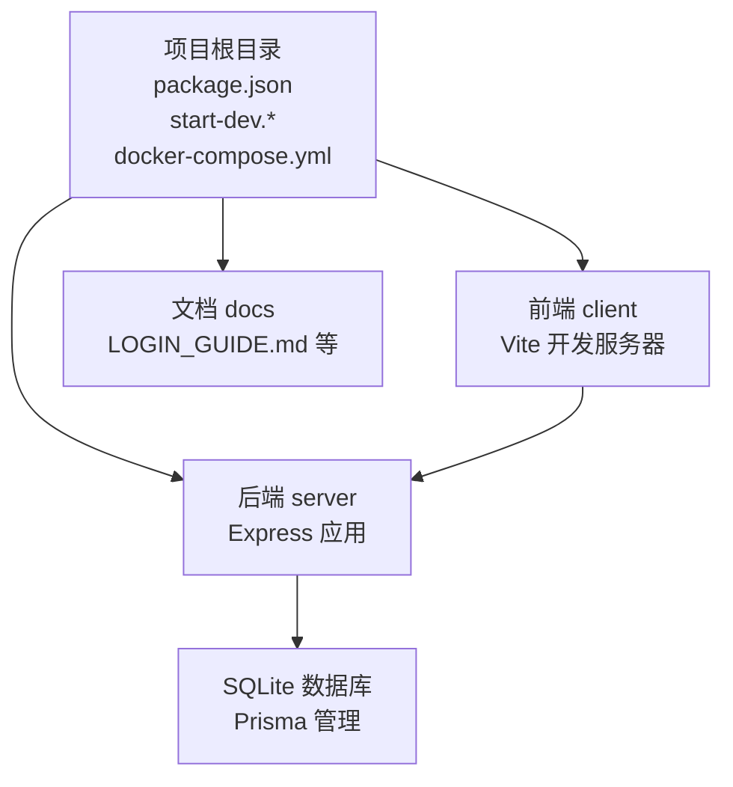
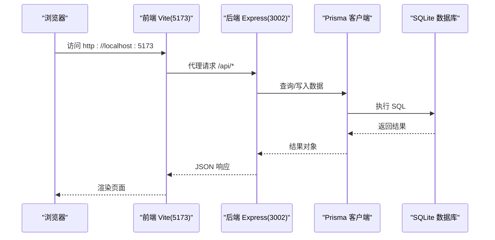
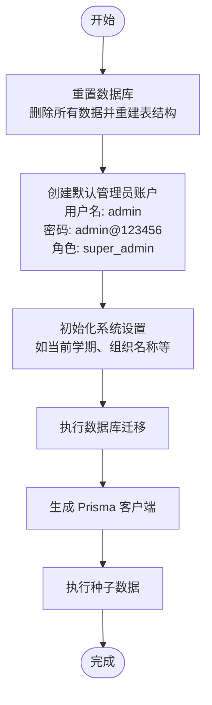
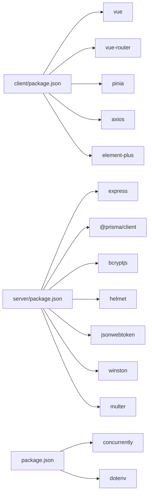

# 快速开始

<cite>
**本文引用的文件**
- [package.json](file://package.json)
- [start-dev.sh](file://start-dev.sh)
- [start-dev.bat](file://start-dev.bat)
- [docker-compose.yml](file://docker-compose.yml)
- [server/package.json](file://server/package.json)
- [client/package.json](file://client/package.json)
- [server/src/app.js](file://server/src/app.js)
- [server/src/config/auth.config.js](file://server/src/config/auth.config.js)
- [server/prisma/schema.prisma](file://server/prisma/schema.prisma)
- [server/.env.example](file://server/.env.example)
- [server/scripts/reset-database.js](file://server/scripts/reset-database.js)
- [server/scripts/init-settings.js](file://server/scripts/init-settings.js)
- [client/vite.config.js](file://client/vite.config.js)
- [docs/LOGIN_GUIDE.md](file://docs/LOGIN_GUIDE.md)
- [README.md](file://README.md)
</cite>

## 目录
1. [简介](#简介)
2. [项目结构](#项目结构)
3. [核心组件](#核心组件)
4. [架构总览](#架构总览)
5. [详细组件分析](#详细组件分析)
6. [依赖关系分析](#依赖关系分析)
7. [性能注意事项](#性能注意事项)
8. [故障排除指南](#故障排除指南)
9. [结论](#结论)
10. [附录](#附录)

## 简介
本指南面向新手开发者，帮助你在最短时间内成功运行 KEC 课程管理平台，体验核心功能。内容覆盖环境要求、依赖安装、环境变量配置、数据库初始化、本地开发一键启动、默认管理员账户及首次登录指引。

## 项目结构
项目采用前后端分离架构，根目录提供一键启动脚本，分别进入 client 与 server 子目录进行开发与调试。核心目录与职责如下：
- client：前端应用（Vue 3 + Element Plus + Vite）
- server：后端服务（Express + Prisma + SQLite）
- docs：项目文档（含登录指南等）
- docker-compose.yml：容器化编排配置（生产/演示场景）

图表来源
- [package.json:1-25](file://package.json#L1-L25)
- [start-dev.sh:1-55](file://start-dev.sh#L1-L55)
- [start-dev.bat:1-51](file://start-dev.bat#L1-L51)
- [docker-compose.yml:1-73](file://docker-compose.yml#L1-L73)

章节来源
- [README.md:160-194](file://README.md#L160-L194)

## 核心组件
- 前端开发服务器：Vite 提供热更新与代理，端口默认 5173，代理到后端 3002。
- 后端开发服务器：Express 应用，提供 REST API，端口默认 3002；生产环境可通过 docker-compose 映射至 3000。
- 数据库：SQLite（默认），通过 Prisma 管理迁移与种子数据。
- 一键启动：根目录提供 start-dev.sh（Linux/macOS）与 start-dev.bat（Windows），自动重置数据库并同时启动前后端。

章节来源
- [client/vite.config.js:46-55](file://client/vite.config.js#L46-L55)
- [server/src/app.js:41-76](file://server/src/app.js#L41-L76)
- [server/package.json:11-26](file://server/package.json#L11-L26)
- [package.json:7-16](file://package.json#L7-L16)
- [docker-compose.yml:12-18](file://docker-compose.yml#L12-L18)

## 架构总览
下图展示了本地开发时的典型交互流程：浏览器访问前端（5173），通过 Vite 代理转发到后端（3002），后端经 Prisma 访问 SQLite 数据库。

图表来源
- [client/vite.config.js:48-52](file://client/vite.config.js#L48-L52)
- [server/src/app.js:94-113](file://server/src/app.js#L94-L113)
- [server/prisma/schema.prisma:1-8](file://server/prisma/schema.prisma#L1-L8)

## 详细组件分析

### 环境要求与准备
- Node.js：后端要求 Node.js >= 20.0.0；根脚本与客户端工具链满足现代 Node 生态。
- npm：后端要求 npm >= 10.0.0。
- Git：用于克隆与版本管理。
- 推荐使用最新稳定版 Node.js 与 npm，确保依赖兼容性。

章节来源
- [server/package.json:7-10](file://server/package.json#L7-L10)
- [README.md:35-40](file://README.md#L35-L40)

### 依赖安装步骤
- 根目录安装：npm install（安装根脚本与并发工具）。
- 子目录安装：cd server && npm install；cd client && npm install。
- 若使用一键启动脚本，会自动执行上述步骤。

章节来源
- [README.md:48-51](file://README.md#L48-L51)
- [package.json:18-23](file://package.json#L18-L23)
- [client/package.json:13-31](file://client/package.json#L13-L31)
- [server/package.json:28-51](file://server/package.json#L28-L51)

### 环境变量配置
- 后端示例文件：server/.env.example，包含开发环境常用变量（如 JWT_SECRET、DATABASE_URL、PORT、CORS_ORIGINS、LOG_LEVEL、MAX_FILE_SIZE、BCRYPT_ROUNDS、DEFAULT_SEMESTER）。
- 关键项说明：
  - DATABASE_URL：SQLite 默认文件路径，开发环境可保持默认。
  - JWT_SECRET：必填，生产环境需使用随机长密钥。
  - JWT_REFRESH_SECRET/JWT_DOWNLOAD_SECRET：可选，未配置时系统会基于主密钥派生。
  - CORS_ORIGINS：开发时默认允许 localhost:*，生产环境需明确域名列表。
  - LOG_LEVEL：开发环境 debug，生产环境 info。
  - MAX_FILE_SIZE：文件上传大小限制（MB）。
  - BCRYPT_ROUNDS：密码加密迭代次数。
- 前端代理：Vite 将 /api 代理到后端 3002，确保跨域与开发体验一致。

章节来源
- [server/.env.example:1-33](file://server/.env.example#L1-L33)
- [server/src/config/auth.config.js:7-37](file://server/src/config/auth.config.js#L7-L37)
- [client/vite.config.js:48-52](file://client/vite.config.js#L48-L52)

### 数据库初始化过程
- 迁移与生成：
  - 迁移：npm run db:migrate（或 cd server && npm run db:migrate）。
  - 客户端生成：npm run db:generate（或 cd server && npm run db:generate）。
- 种子数据：cd server && npm run db:seed（或使用重置脚本自动创建默认用户与系统设置）。
- 一键重置（开发友好）：start-dev.* 脚本会先执行数据库重置，再启动前后端。

图表来源
- [start-dev.sh:24-32](file://start-dev.sh#L24-L32)
- [start-dev.bat:20-29](file://start-dev.bat#L20-L29)
- [server/scripts/reset-database.js:8-106](file://server/scripts/reset-database.js#L8-L106)
- [server/scripts/init-settings.js:37-78](file://server/scripts/init-settings.js#L37-L78)
- [package.json:11-12](file://package.json#L11-L12)

章节来源
- [README.md:57-60](file://README.md#L57-L60)
- [server/scripts/reset-database.js:42-64](file://server/scripts/reset-database.js#L42-L64)
- [server/scripts/init-settings.js:23-35](file://server/scripts/init-settings.js#L23-L35)

### 本地开发环境一键启动
- Linux/macOS：执行 ./start-dev.sh，自动：
  - 进入 server 目录，执行数据库重置；
  - 返回根目录，打印默认管理员登录信息；
  - 并发启动前端（5173）与后端（3002）。
- Windows：执行 start-dev.bat，行为同上。
- 根脚本：npm run dev 会同时调用 server 与 client 的 dev 脚本，配合 concurrently 实现并发启动。

章节来源
- [start-dev.sh:24-54](file://start-dev.sh#L24-L54)
- [start-dev.bat:20-50](file://start-dev.bat#L20-L50)
- [package.json:8-10](file://package.json#L8-L10)

### 默认管理员账户与首次登录
- 默认账户：
  - 用户名：admin
  - 密码：admin@123456
  - 角色：super_admin
- 登录地址：
  - 前端：http://localhost:5173
  - 后端 API：http://localhost:3002
- 首次登录后建议立即修改密码；若忘记密码，可参考登录指南中的重置方法。

章节来源
- [docs/LOGIN_GUIDE.md:3-16](file://docs/LOGIN_GUIDE.md#L3-L16)
- [server/scripts/reset-database.js:114-117](file://server/scripts/reset-database.js#L114-L117)
- [README.md:66-69](file://README.md#L66-L69)

### 生产环境与容器化部署（可选）
- Docker Compose：通过 docker-compose.yml 启动前后端服务，后端映射 3000 端口，使用 SQLite 文件卷持久化。
- 环境变量：需设置 JWT_SECRET、JWT_REFRESH_SECRET、JWT_DOWNLOAD_SECRET、CORS_ORIGINS 等。

章节来源
- [docker-compose.yml:4-33](file://docker-compose.yml#L4-L33)
- [server/.env.example:10-20](file://server/.env.example#L10-L20)

## 依赖关系分析
- 前端依赖：Vue 3、Element Plus、Axios、Pinia、Vue Router 等。
- 后端依赖：Express、Prisma、bcryptjs、helmet、jsonwebtoken、winston、multer 等。
- 根脚本：concurrently 用于并发启动前后端；dotenv 用于加载环境变量。

图表来源
- [client/package.json:13-20](file://client/package.json#L13-L20)
- [server/package.json:28-42](file://server/package.json#L28-L42)
- [package.json:18-23](file://package.json#L18-L23)

章节来源
- [client/package.json:13-31](file://client/package.json#L13-L31)
- [server/package.json:28-51](file://server/package.json#L28-L51)
- [package.json:18-23](file://package.json#L18-L23)

## 性能注意事项
- 前端构建：Vite 默认目标 es2022，启用手动分包策略优化首屏加载。
- 后端限流与安全：Express 集成 helmet 与速率限制中间件，生产环境建议开启更严格的 CSP。
- 数据库索引：Prisma Schema 已内置复合索引与单列索引，有助于查询性能。
- 代理与跨域：开发阶段 Vite 代理到 3002，避免跨域带来的额外握手成本。

章节来源
- [client/vite.config.js:26-42](file://client/vite.config.js#L26-L42)
- [server/src/app.js:33-39](file://server/src/app.js#L33-L39)
- [server/prisma/schema.prisma:22-26](file://server/prisma/schema.prisma#L22-L26)
- [server/src/app.js:41-76](file://server/src/app.js#L41-L76)

## 故障排除指南
- 端口占用：
  - 前端默认 5173，后端默认 3002；若被占用，可在 Vite 与后端配置中调整。
- CORS 错误：
  - 确认 CORS_ORIGINS 包含前端地址；开发环境允许 localhost:*。
- 数据库连接失败：
  - 检查 DATABASE_URL 是否指向有效路径；执行迁移与生成后再启动。
- JWT 密钥缺失：
  - 必须设置 JWT_SECRET；未设置将抛出错误并终止启动。
- 登录失败：
  - 确认使用默认密码 admin@123456；若数据库未初始化，先执行重置与种子脚本。

章节来源
- [client/vite.config.js:46-55](file://client/vite.config.js#L46-L55)
- [server/src/app.js:41-76](file://server/src/app.js#L41-L76)
- [server/src/config/auth.config.js:9-16](file://server/src/config/auth.config.js#L9-L16)
- [docs/LOGIN_GUIDE.md:27-42](file://docs/LOGIN_GUIDE.md#L27-L42)

## 结论
按照本指南完成环境准备、依赖安装、环境变量配置与数据库初始化后，即可通过一键启动脚本或根脚本并发启动前后端服务。使用默认管理员账户登录后，你将能够快速体验课程管理平台的核心功能。生产部署可参考 Docker Compose 与裸机部署方案。

## 附录

### 快速命令清单
- 克隆与安装
  - git clone <仓库地址>
  - npm install
  - cd server && npm install && cd ..
  - cd client && npm install && cd ..
- 配置环境变量
  - cp server/.env.example server/.env
  - 编辑 server/.env，至少填写 JWT_SECRET
- 初始化数据库
  - npm run db:migrate
  - npm run db:generate
  - cd server && npm run db:seed && cd ..
- 一键启动
  - Linux/macOS: ./start-dev.sh
  - Windows: start-dev.bat
  - 或根脚本：npm run dev

章节来源
- [README.md:43-64](file://README.md#L43-L64)
- [server/.env.example:10-13](file://server/.env.example#L10-L13)
- [package.json:11-12](file://package.json#L11-L12)