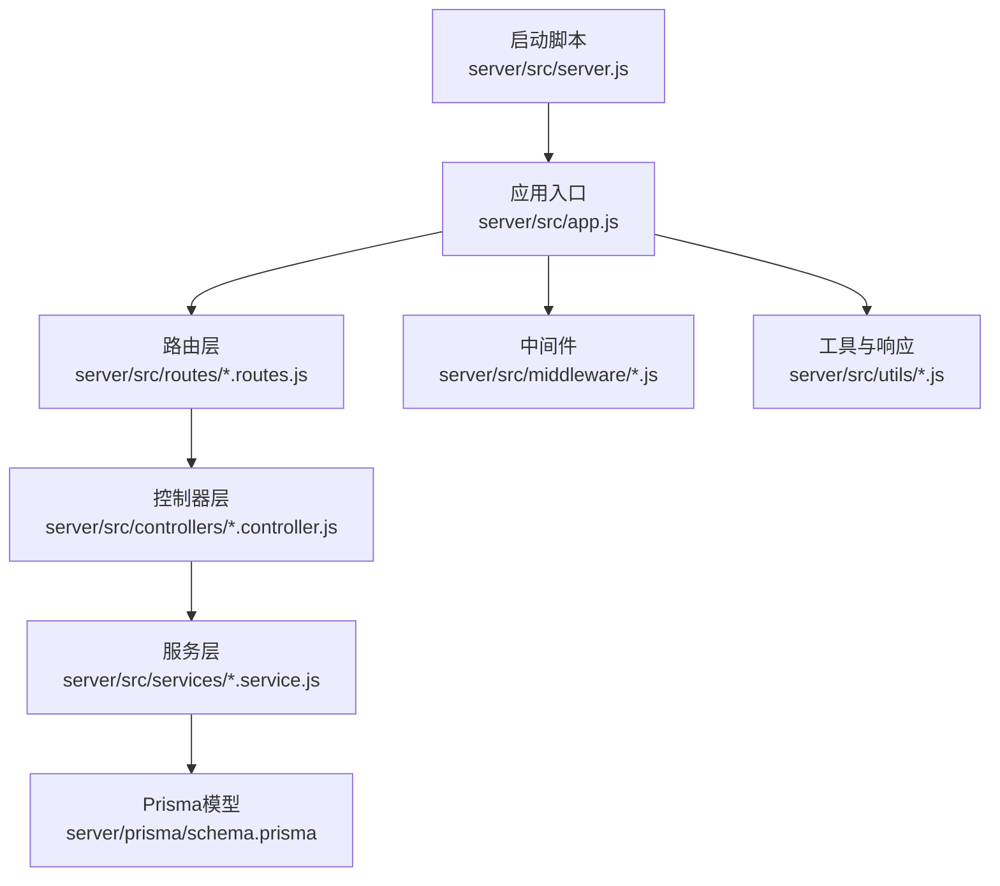
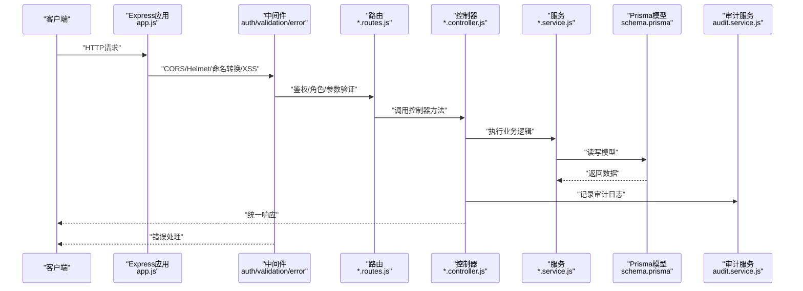
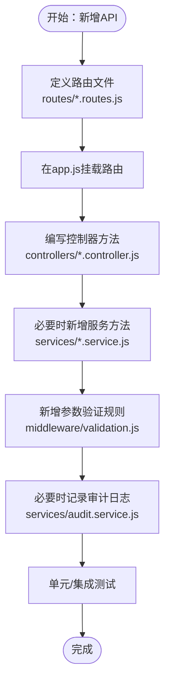
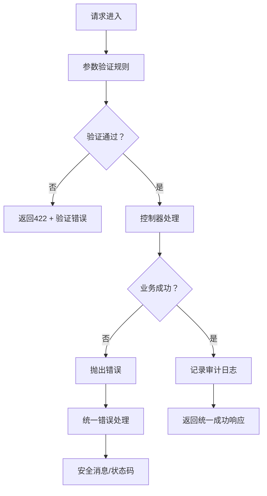
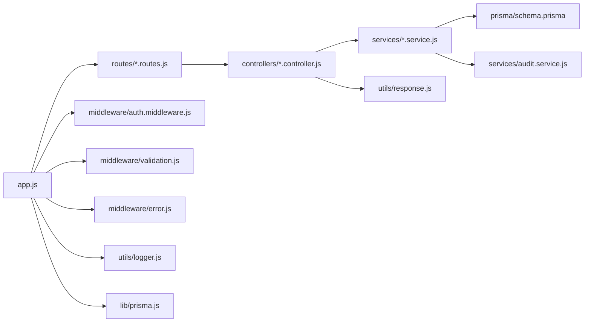

# API扩展

<cite>
**本文引用的文件**
- [server/src/app.js](file://server/src/app.js)
- [server/src/server.js](file://server/src/server.js)
- [server/prisma/schema.prisma](file://server/prisma/schema.prisma)
- [server/src/controllers/course.controller.js](file://server/src/controllers/course.controller.js)
- [server/src/routes/course.routes.js](file://server/src/routes/course.routes.js)
- [server/src/middleware/validation.js](file://server/src/middleware/validation.js)
- [server/src/utils/response.js](file://server/src/utils/response.js)
- [server/src/services/audit.service.js](file://server/src/services/audit.service.js)
- [server/src/lib/prisma.js](file://server/src/lib/prisma.js)
- [server/src/middleware/auth.middleware.js](file://server/src/middleware/auth.middleware.js)
- [server/src/middleware/error.js](file://server/src/middleware/error.js)
- [server/src/utils/sort.js](file://server/src/utils/sort.js)
- [server/package.json](file://server/package.json)
- [server/src/utils/logger.js](file://server/src/utils/logger.js)
</cite>

## 目录
1. [简介](#简介)
2. [项目结构](#项目结构)
3. [核心组件](#核心组件)
4. [架构总览](#架构总览)
5. [详细组件分析](#详细组件分析)
6. [依赖关系分析](#依赖关系分析)
7. [性能考量](#性能考量)
8. [故障排查指南](#故障排查指南)
9. [结论](#结论)
10. [附录](#附录)

## 简介
本指南面向在KEC课程管理平台后端（基于Express.js）进行API扩展的开发者，目标是帮助你在现有控制器-服务-模型（Controller-Service-Model）三层架构基础上，快速、安全地添加新的API端点；同时提供Prisma ORM数据模型扩展与数据库迁移策略、路由定义、参数验证、错误处理与响应格式化标准流程，以及新增业务逻辑的集成方法与向后兼容实践。

## 项目结构
后端采用模块化分层组织：
- 应用入口与中间件：app.js负责路由挂载、CORS/Helmet、命名转换、XSS清洗、全局错误处理等
- 路由层：按领域划分路由文件，集中暴露REST风格接口
- 控制器层：处理HTTP请求，调用服务层，返回统一响应
- 服务层：封装业务逻辑，协调Prisma模型与外部依赖
- 数据访问：Prisma客户端封装与日志
- 工具与中间件：验证、鉴权、分页、命名转换、错误处理、日志、排序工具等
- 配置与启动：server.js负责进程生命周期与优雅关停

图表来源
- [server/src/app.js:1-158](file://server/src/app.js#L1-L158)
- [server/src/server.js:1-66](file://server/src/server.js#L1-L66)

章节来源
- [server/src/app.js:1-158](file://server/src/app.js#L1-L158)
- [server/src/server.js:1-66](file://server/src/server.js#L1-L66)

## 核心组件
- 应用与中间件
  - 安全与CORS：Helmet、CORS白名单/本地放行、内容类型与日志
  - 命名转换：请求体/响应体的camelCase与snake_case互转
  - XSS清洗：全局清洗body/query
  - 鉴权与角色：Bearer Token鉴权、用户状态缓存、角色中间件
  - 错误处理：统一错误转换与安全消息
- 路由与控制器
  - 路由按模块划分，控制器负责具体业务处理与审计日志
- 服务与模型
  - 服务封装业务，Prisma模型定义数据结构与索引
- 工具与响应
  - 统一响应格式、分页、排序工具、日志

章节来源
- [server/src/app.js:28-158](file://server/src/app.js#L28-L158)
- [server/src/middleware/auth.middleware.js:1-129](file://server/src/middleware/auth.middleware.js#L1-L129)
- [server/src/middleware/error.js:1-63](file://server/src/middleware/error.js#L1-L63)
- [server/src/utils/response.js:1-21](file://server/src/utils/response.js#L1-L21)
- [server/src/utils/sort.js:1-104](file://server/src/utils/sort.js#L1-L104)
- [server/src/lib/prisma.js:1-34](file://server/src/lib/prisma.js#L1-L34)

## 架构总览
下图展示从客户端到数据库的典型请求链路，包括鉴权、参数验证、控制器、服务与模型交互，以及审计日志与错误处理。

图表来源
- [server/src/app.js:42-158](file://server/src/app.js#L42-L158)
- [server/src/middleware/auth.middleware.js:40-106](file://server/src/middleware/auth.middleware.js#L40-L106)
- [server/src/middleware/validation.js:7-35](file://server/src/middleware/validation.js#L7-L35)
- [server/src/middleware/error.js:35-62](file://server/src/middleware/error.js#L35-L62)
- [server/src/controllers/course.controller.js:11-142](file://server/src/controllers/course.controller.js#L11-L142)
- [server/src/services/audit.service.js:15-49](file://server/src/services/audit.service.js#L15-L49)
- [server/prisma/schema.prisma:1-308](file://server/prisma/schema.prisma#L1-L308)

## 详细组件分析

### 路由扩展流程（以课程为例）
- 新增领域路由文件（如 plan.routes.js），定义HTTP方法与路径
- 在app.js中挂载新路由（参考现有挂载方式）
- 编写控制器方法（参考课程控制器）
- 如需复杂业务，编写服务方法（参考审计服务）
- 在中间件中增加参数验证规则（参考validation.js）
- 统一响应与错误处理（参考response.js与error.js）

图表来源
- [server/src/routes/course.routes.js:1-36](file://server/src/routes/course.routes.js#L1-L36)
- [server/src/controllers/course.controller.js:11-142](file://server/src/controllers/course.controller.js#L11-L142)
- [server/src/middleware/validation.js:151-163](file://server/src/middleware/validation.js#L151-L163)
- [server/src/services/audit.service.js:15-49](file://server/src/services/audit.service.js#L15-L49)

章节来源
- [server/src/routes/course.routes.js:1-36](file://server/src/routes/course.routes.js#L1-L36)
- [server/src/controllers/course.controller.js:11-142](file://server/src/controllers/course.controller.js#L11-L142)
- [server/src/middleware/validation.js:151-163](file://server/src/middleware/validation.js#L151-L163)
- [server/src/services/audit.service.js:15-49](file://server/src/services/audit.service.js#L15-L49)

### 参数验证与错误处理标准
- 验证规则：使用express-validator定义规则，统一通过handleValidationErrors返回422
- 错误处理：统一errorHandler，将Prisma错误映射为安全消息，区分生产/开发环境
- 审计日志：成功/失败均记录，details脱敏，避免敏感字段泄露

图表来源
- [server/src/middleware/validation.js:7-35](file://server/src/middleware/validation.js#L7-L35)
- [server/src/middleware/error.js:35-62](file://server/src/middleware/error.js#L35-L62)
- [server/src/services/audit.service.js:15-49](file://server/src/services/audit.service.js#L15-L49)
- [server/src/utils/response.js:1-21](file://server/src/utils/response.js#L1-21)

章节来源
- [server/src/middleware/validation.js:7-35](file://server/src/middleware/validation.js#L7-L35)
- [server/src/middleware/error.js:35-62](file://server/src/middleware/error.js#L35-L62)
- [server/src/utils/response.js:1-21](file://server/src/utils/response.js#L1-L21)

### 响应格式化与命名转换
- 统一响应：success/paginate/fail三类方法，保证前端一致性
- 命名转换：请求体camelCase→snake_case，响应体snake_case→camelCase，减少前后端字段不一致问题

章节来源
- [server/src/utils/response.js:1-21](file://server/src/utils/response.js#L1-L21)
- [server/src/app.js:84-89](file://server/src/app.js#L84-L89)

### 审计日志与安全
- 审计：记录操作、模块、结果、IP、详情（脱敏）、时间
- 安全：Helmet、CORS白名单、XSS清洗、Token鉴权、用户状态缓存

章节来源
- [server/src/services/audit.service.js:15-94](file://server/src/services/audit.service.js#L15-L94)
- [server/src/app.js:34-89](file://server/src/app.js#L34-L89)
- [server/src/middleware/auth.middleware.js:40-106](file://server/src/middleware/auth.middleware.js#L40-L106)

### 排序与缓存
- 排序：自动修复重复sort_order，缓存最近修复结果，支持失效
- 缓存：用户状态缓存、排序缓存，降低数据库压力

章节来源
- [server/src/utils/sort.js:12-104](file://server/src/utils/sort.js#L12-L104)

## 依赖关系分析
- Express应用通过app.js聚合中间件、路由与错误处理
- 路由依赖控制器，控制器依赖服务，服务依赖Prisma模型
- 验证中间件与错误中间件贯穿请求链路
- 日志与Prisma客户端在多处被使用，形成横切关注点

图表来源
- [server/src/app.js:1-158](file://server/src/app.js#L1-L158)
- [server/src/controllers/course.controller.js:1-142](file://server/src/controllers/course.controller.js#L1-L142)
- [server/src/services/audit.service.js:1-94](file://server/src/services/audit.service.js#L1-L94)
- [server/prisma/schema.prisma:1-308](file://server/prisma/schema.prisma#L1-L308)

章节来源
- [server/src/app.js:1-158](file://server/src/app.js#L1-L158)

## 性能考量
- 中间件顺序：命名转换与XSS清洗应在路由前，避免重复处理
- 缓存：用户状态与排序修复结果缓存，减少数据库查询
- 并发：排序修复采用事务批量更新，避免竞态
- 日志：生产环境精简日志级别，避免I/O瓶颈
- 连接：keep-alive与headers超时合理配置，避免空闲连接泄漏

章节来源
- [server/src/app.js:84-89](file://server/src/app.js#L84-L89)
- [server/src/utils/sort.js:62-103](file://server/src/utils/sort.js#L62-L103)
- [server/src/server.js:42-44](file://server/src/server.js#L42-L44)
- [server/src/utils/logger.js:34-85](file://server/src/utils/logger.js#L34-L85)

## 故障排查指南
- 常见错误
  - 401/403：鉴权失败或权限不足，检查Token与角色
  - 422：参数验证失败，查看details中的字段与消息
  - 404：记录不存在，检查ID或关联数据
  - 500：未知错误，查看服务端日志
- 审计与日志
  - 审计日志文件位于logs/audit.log
  - 错误日志与综合日志位于logs/error.log与logs/combined.log
- 优雅关停
  - SIGINT/SIGTERM触发关闭流程，确保Prisma断开连接

章节来源
- [server/src/middleware/error.js:35-62](file://server/src/middleware/error.js#L35-L62)
- [server/src/middleware/auth.middleware.js:74-106](file://server/src/middleware/auth.middleware.js#L74-L106)
- [server/src/utils/logger.js:34-85](file://server/src/utils/logger.js#L34-L85)
- [server/src/server.js:46-66](file://server/src/server.js#L46-L66)

## 结论
通过遵循本指南，你可以在现有Express+Prisma架构上高效扩展API：先在路由层定义端点，再在控制器中编排服务与审计，配合统一的参数验证与错误处理，确保安全性与一致性。数据模型扩展与迁移遵循Prisma约定，保持版本演进的可控性与可追溯性。

## 附录

### 新增API端点的标准步骤
- 路由层
  - 在server/src/routes下新增*.routes.js，定义GET/POST/PUT/DELETE
  - 在app.js中按现有模式挂载路由
- 控制器层
  - 在server/src/controllers下新增*.controller.js，实现list/create/update/delete等方法
  - 使用统一响应与审计日志
- 服务层
  - 在server/src/services下新增*.service.js，封装业务逻辑
- 参数验证
  - 在server/src/middleware/validation.js中新增对应规则
- 数据模型与迁移
  - 在server/prisma/schema.prisma中扩展模型
  - 使用脚本生成与迁移：参见server/package.json中的db:*脚本
- 错误处理与响应
  - 使用统一错误处理器与响应工具
- 鉴权与角色
  - 根据需求在路由中加入authMiddleware与roleMiddleware

章节来源
- [server/src/routes/course.routes.js:1-36](file://server/src/routes/course.routes.js#L1-L36)
- [server/src/controllers/course.controller.js:11-142](file://server/src/controllers/course.controller.js#L11-L142)
- [server/src/middleware/validation.js:151-163](file://server/src/middleware/validation.js#L151-L163)
- [server/src/services/audit.service.js:15-49](file://server/src/services/audit.service.js#L15-L49)
- [server/src/utils/response.js:1-21](file://server/src/utils/response.js#L1-L21)
- [server/src/middleware/auth.middleware.js:108-128](file://server/src/middleware/auth.middleware.js#L108-L128)
- [server/prisma/schema.prisma:1-308](file://server/prisma/schema.prisma#L1-L308)
- [server/package.json:16-21](file://server/package.json#L16-L21)

### Prisma模型扩展与迁移策略
- 扩展模型
  - 在schema.prisma中新增model，定义字段与索引
  - 如需唯一约束、外键关系，按Prisma语法声明
- 生成与迁移
  - 使用脚本生成客户端与迁移：参见server/package.json
  - 运行迁移命令后，同步更新服务层与控制器
- 版本与回滚
  - 迁移文件按时间戳命名，遵循不可逆原则
  - 生产环境谨慎回滚，优先通过新迁移修复

章节来源
- [server/prisma/schema.prisma:1-308](file://server/prisma/schema.prisma#L1-L308)
- [server/package.json:16-21](file://server/package.json#L16-L21)

### API版本管理与向后兼容
- 版本策略
  - 在路由前缀中体现版本（如/api/v1/...），逐步替换旧端点
  - 对于破坏性变更，保留旧端点一段时间并标注废弃
- 兼容性
  - 字段新增时保持可选，避免影响既有调用
  - 返回字段命名统一通过命名转换中间件处理
- 文档与测试
  - 随版本发布配套接口文档
  - 为新旧端点编写测试，确保平滑过渡

章节来源
- [server/src/app.js:92-153](file://server/src/app.js#L92-L153)