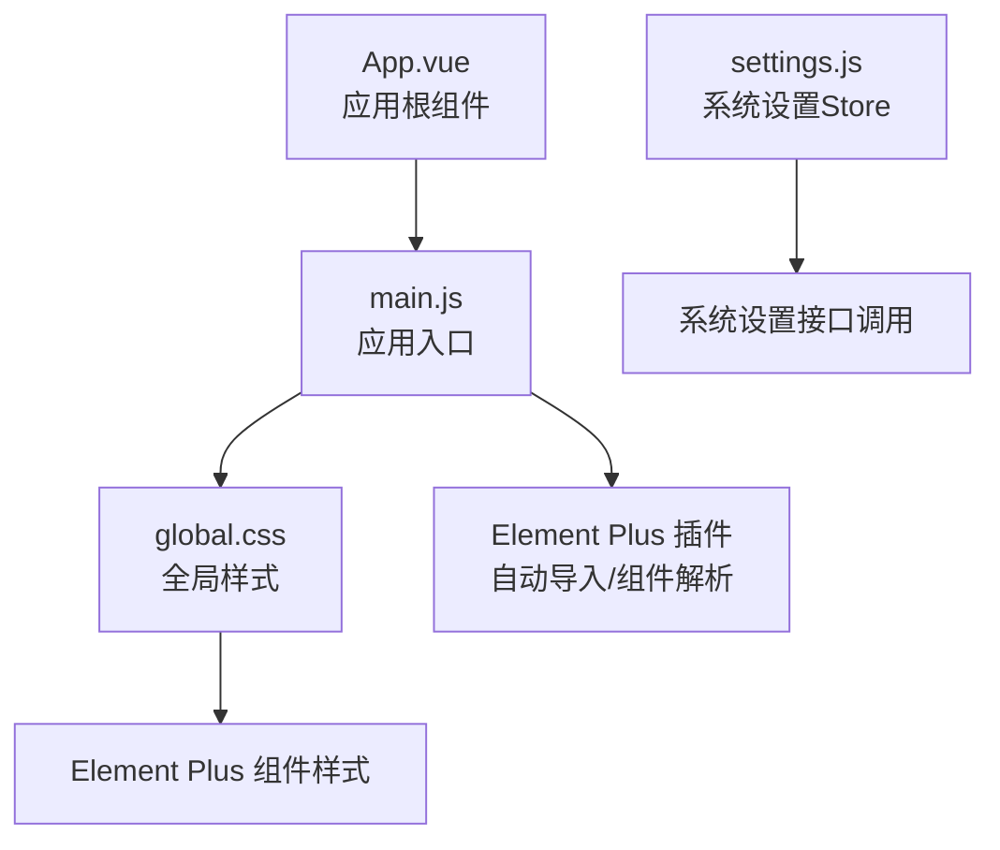
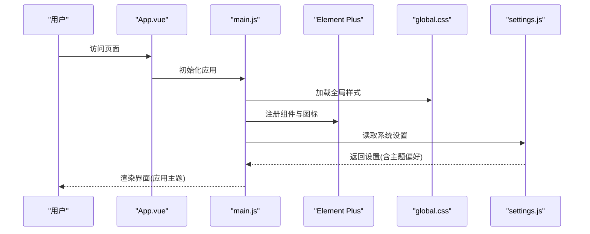
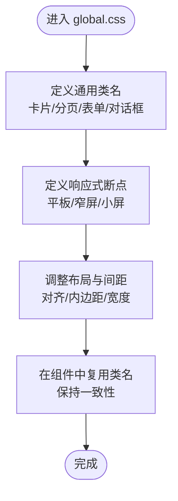
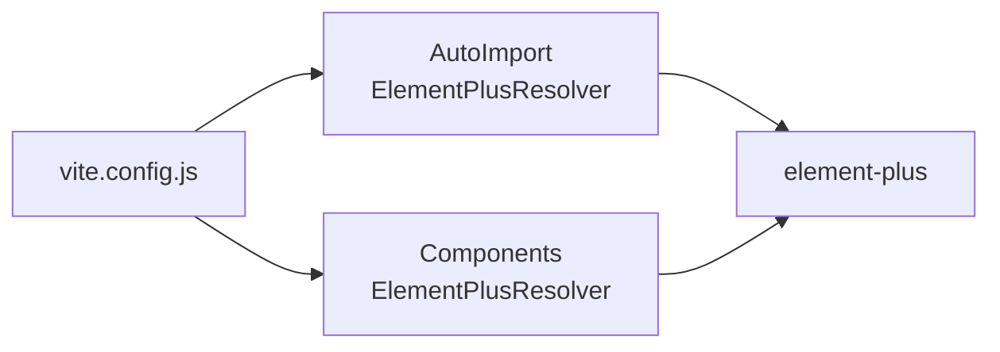
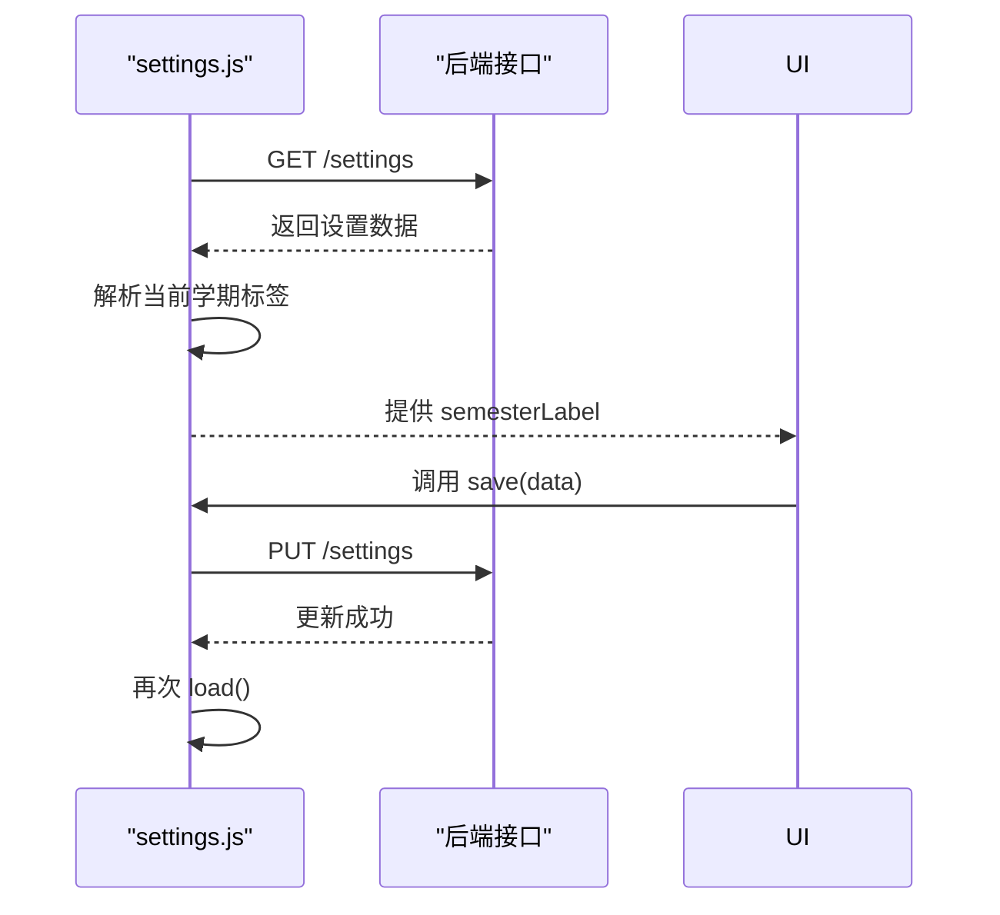
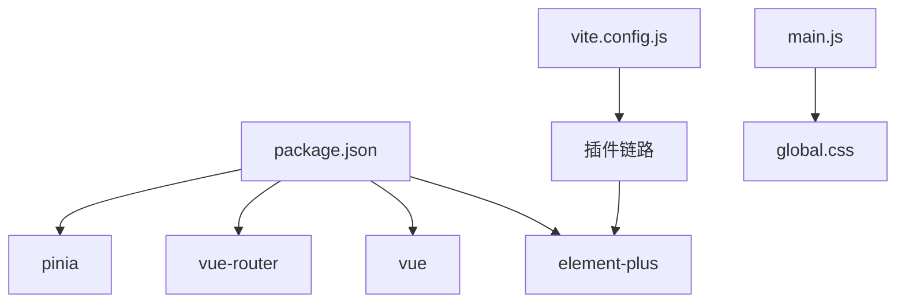

# 主题定制

<cite>
**本文引用的文件**
- [client/src/styles/global.css](file://client/src/styles/global.css)
- [client/src/main.js](file://client/src/main.js)
- [client/src/App.vue](file://client/src/App.vue)
- [client/package.json](file://client/package.json)
- [client/vite.config.js](file://client/vite.config.js)
- [client/src/stores/settings.js](file://client/src/stores/settings.js)
</cite>

## 目录
1. [简介](#简介)
2. [项目结构](#项目结构)
3. [核心组件](#核心组件)
4. [架构总览](#架构总览)
5. [详细组件分析](#详细组件分析)
6. [依赖分析](#依赖分析)
7. [性能考虑](#性能考虑)
8. [故障排查指南](#故障排查指南)
9. [结论](#结论)
10. [附录](#附录)

## 简介
本指南面向KEC课程管理平台的前端开发者，围绕基于Element Plus组件库的主题定制与全局样式管理，提供从CSS变量系统、颜色方案配置到字体设置的完整实践路径；同时覆盖全局样式的模块化组织、暗色主题与品牌色彩定制、响应式设计实现、主题切换与持久化方案，以及浏览器兼容性与性能优化建议。当前仓库未内置Element Plus主题变量覆盖文件，但通过Vite插件与全局样式已具备良好的扩展基础。

## 项目结构
客户端采用Vue 3 + Vite + Pinia + Element Plus技术栈，主题与样式相关的关键位置如下：
- 全局样式入口：在应用入口统一引入全局样式文件，确保主题与通用样式优先级生效
- Element Plus集成：通过Vite自动导入与组件解析器按需引入组件，便于后续主题变量覆盖
- 设置与状态：系统设置（含学期等）由Pinia Store管理，可作为主题偏好持久化的数据来源之一

**图表来源**
- [client/src/App.vue:1-4](file://client/src/App.vue#L1-L4)
- [client/src/main.js:1-10](file://client/src/main.js#L1-L10)
- [client/src/styles/global.css:1-204](file://client/src/styles/global.css#L1-L204)
- [client/vite.config.js:1-56](file://client/vite.config.js#L1-L56)
- [client/src/stores/settings.js:1-57](file://client/src/stores/settings.js#L1-L57)

**章节来源**
- [client/src/main.js:1-10](file://client/src/main.js#L1-L10)
- [client/src/styles/global.css:1-204](file://client/src/styles/global.css#L1-L204)
- [client/vite.config.js:1-56](file://client/vite.config.js#L1-L56)
- [client/src/App.vue:1-4](file://client/src/App.vue#L1-L4)

## 核心组件
- 全局样式模块：集中定义卡片、分页、表单、对话框、批量操作等通用类名，并提供响应式断点规则，便于在不同设备上保持一致的视觉体验
- Element Plus集成：通过Vite插件自动注册组件与图标，减少手动引入成本，为主题变量覆盖提供统一入口
- 系统设置Store：负责加载与保存系统设置，可扩展用于持久化用户主题偏好（如明/暗模式、品牌色）

**章节来源**
- [client/src/styles/global.css:1-204](file://client/src/styles/global.css#L1-L204)
- [client/vite.config.js:1-56](file://client/vite.config.js#L1-L56)
- [client/src/stores/settings.js:1-57](file://client/src/stores/settings.js#L1-L57)

## 架构总览
下图展示主题定制在运行时的交互关系：应用启动时加载全局样式与Element Plus资源，随后根据用户设置或系统偏好切换主题；全局样式提供通用布局与响应式能力，组件样式由Element Plus按需注入。

**图表来源**
- [client/src/App.vue:1-4](file://client/src/App.vue#L1-L4)
- [client/src/main.js:1-10](file://client/src/main.js#L1-L10)
- [client/src/styles/global.css:1-204](file://client/src/styles/global.css#L1-L204)
- [client/src/stores/settings.js:1-57](file://client/src/stores/settings.js#L1-L57)

## 详细组件分析

### 全局样式模块（global.css）
- 作用域与优先级：通过在入口统一引入，确保全局类名与通用布局样式在组件样式之前生效，便于覆盖Element Plus默认样式
- 通用布局类：卡片头部、排序按钮、分页容器、提示信息、展开行内容、筛选下拉框尺寸等，形成统一的交互与排版规范
- 响应式策略：针对平板、窄屏、小屏等断点调整宽度、布局方向与内边距，保证在移动端的良好体验
- 对话框与表单：在窄屏下调整表单标签对齐方式与弹窗内边距，提升可读性与可用性
- 操作列响应式：桌面端显示按钮行，窄屏下以下拉菜单替代，兼顾功能完整性与空间利用

**图表来源**
- [client/src/styles/global.css:1-204](file://client/src/styles/global.css#L1-L204)

**章节来源**
- [client/src/styles/global.css:1-204](file://client/src/styles/global.css#L1-L204)

### Element Plus集成（Vite插件）
- 自动导入：通过自动导入插件与组件解析器，按需引入组件与图标，减少打包体积并提升开发效率
- 构建优化：拆分vendor包，将Vue生态与Element Plus独立打包，有利于缓存与增量更新
- 版本与依赖：Element Plus版本与Vue生态版本匹配良好，建议在升级时同步关注主题变量变更

**图表来源**
- [client/vite.config.js:1-56](file://client/vite.config.js#L1-L56)
- [client/package.json:1-33](file://client/package.json#L1-L33)

**章节来源**
- [client/vite.config.js:1-56](file://client/vite.config.js#L1-L56)
- [client/package.json:1-33](file://client/package.json#L1-L33)

### 系统设置Store（settings.js）
- 数据加载：通过接口获取系统设置，解析当前学期标签，提供格式化展示
- 保存机制：支持更新设置后重新加载，保证状态一致性
- 扩展点：可在此基础上增加主题偏好字段（如明/暗模式、品牌色），并与持久化方案结合

**图表来源**
- [client/src/stores/settings.js:1-57](file://client/src/stores/settings.js#L1-L57)

**章节来源**
- [client/src/stores/settings.js:1-57](file://client/src/stores/settings.js#L1-L57)

## 依赖分析
- Element Plus与Vue生态：Element Plus与Vue版本匹配，构建时独立打包，利于缓存与性能
- 插件链路：Vite插件链路包括Vue、自动导入与组件解析器，确保Element Plus按需引入
- 入口依赖：应用入口引入全局样式，确保主题与通用样式优先级

**图表来源**
- [client/package.json:1-33](file://client/package.json#L1-L33)
- [client/vite.config.js:1-56](file://client/vite.config.js#L1-L56)
- [client/src/main.js:1-10](file://client/src/main.js#L1-L10)

**章节来源**
- [client/package.json:1-33](file://client/package.json#L1-L33)
- [client/vite.config.js:1-56](file://client/vite.config.js#L1-L56)
- [client/src/main.js:1-10](file://client/src/main.js#L1-L10)

## 性能考虑
- 代码分割：通过手动分包策略将Vue生态与Element Plus独立打包，降低首屏依赖
- 按需引入：自动导入与组件解析器减少冗余代码，缩短构建时间
- 样式优先级：全局样式在入口处统一引入，避免组件内重复定义导致的样式冲突与重绘
- 响应式优化：在窄屏断点下简化布局与内边距，减少渲染压力

**章节来源**
- [client/vite.config.js:26-38](file://client/vite.config.js#L26-L38)
- [client/src/main.js:1-10](file://client/src/main.js#L1-L10)
- [client/src/styles/global.css:96-204](file://client/src/styles/global.css#L96-L204)

## 故障排查指南
- 样式不生效
  - 检查是否在入口正确引入全局样式文件
  - 确认组件样式优先级是否被覆盖
- 主题变量未生效
  - 当前仓库未提供Element Plus主题变量覆盖文件，建议新增主题变量文件并通过入口引入
- 响应式异常
  - 检查断点范围与媒体查询是否符合预期
  - 在窄屏断点下确认布局与内边距调整逻辑
- 主题切换与持久化
  - 可在系统设置Store中扩展主题偏好字段，并结合本地存储实现持久化
  - 切换主题时注意刷新样式优先级与缓存

**章节来源**
- [client/src/main.js:1-10](file://client/src/main.js#L1-L10)
- [client/src/styles/global.css:96-204](file://client/src/styles/global.css#L96-L204)
- [client/src/stores/settings.js:1-57](file://client/src/stores/settings.js#L1-L57)

## 结论
本指南明确了KEC课程管理平台在Element Plus主题定制方面的现状与扩展路径：通过全局样式模块统一布局与响应式策略，借助Vite插件实现组件按需引入，结合系统设置Store扩展主题偏好与持久化。建议在现有基础上新增主题变量覆盖文件与主题切换逻辑，以实现暗色主题、品牌色彩定制与更佳的用户体验。

## 附录
- 浏览器兼容性建议
  - 构建目标使用现代浏览器特性，确保在主流浏览器上获得最佳体验
  - 响应式断点与Flex布局在旧版IE上可能存在差异，建议在兼容性需求下进行针对性降级
- 性能优化建议
  - 继续沿用手动分包策略，保持第三方库独立缓存
  - 控制全局样式的体量，避免过度使用复杂选择器导致的重绘
  - 在主题切换时尽量避免全量重绘，优先使用CSS变量与类名切换