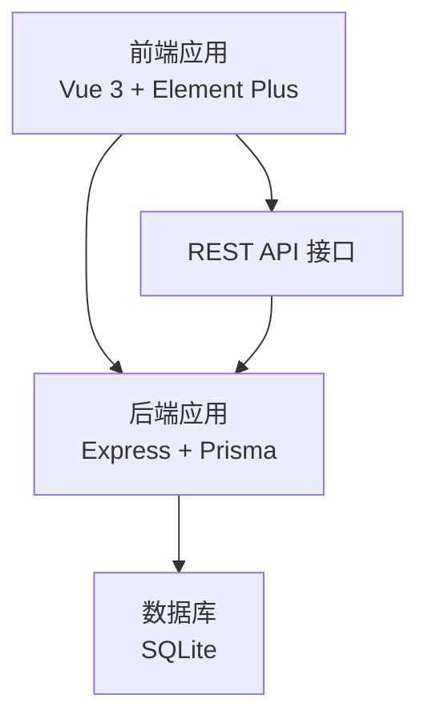
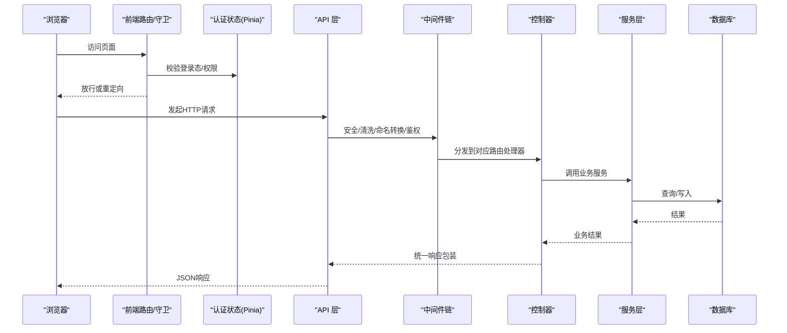
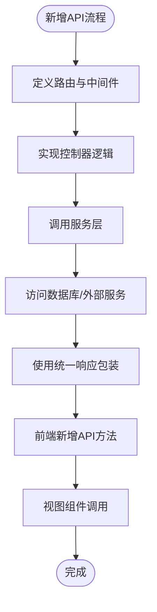
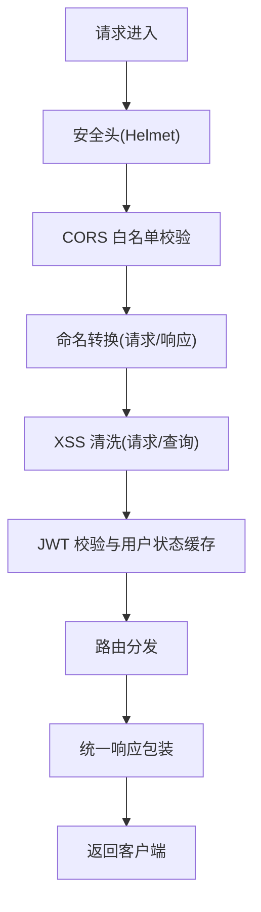
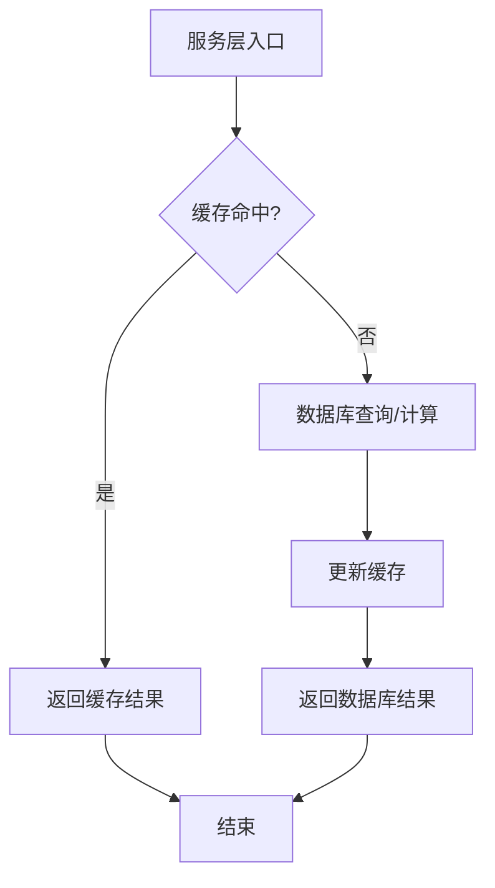
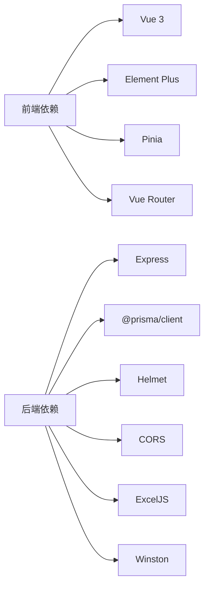

# 扩展开发

<cite>
**本文引用的文件**   
- [client/package.json](file://client/package.json)
- [server/package.json](file://server/package.json)
- [client/src/main.js](file://client/src/main.js)
- [server/src/app.js](file://server/src/app.js)
- [client/src/router/index.js](file://client/src/router/index.js)
- [server/src/routes/class.routes.js](file://server/src/routes/class.routes.js)
- [server/src/controllers/class.controller.js](file://server/src/controllers/class.controller.js)
- [server/src/services/class.service.js](file://server/src/services/class.service.js)
- [client/src/stores/auth.js](file://client/src/stores/auth.js)
- [server/src/middleware/auth.middleware.js](file://server/src/middleware/auth.middleware.js)
- [client/src/components/Layout.vue](file://client/src/components/Layout.vue)
- [server/prisma/schema.prisma](file://server/prisma/schema.prisma)
- [client/src/views/class/ClassList.vue](file://client/src/views/class/ClassList.vue)
- [client/src/api/class.js](file://client/src/api/class.js)
- [server/src/utils/response.js](file://server/src/utils/response.js)
- [client/src/composables/useCrudList.js](file://client/src/composables/useCrudList.js)
</cite>

## 目录
1. [引言](#引言)
2. [项目结构](#项目结构)
3. [核心组件](#核心组件)
4. [架构总览](#架构总览)
5. [详细组件分析](#详细组件分析)
6. [依赖分析](#依赖分析)
7. [性能考虑](#性能考虑)
8. [故障排查指南](#故障排查指南)
9. [结论](#结论)
10. [附录](#附录)

## 引言
本指南面向希望在KEC课程管理平台上进行功能扩展与定制开发的工程师。文档围绕现有前后端架构，系统讲解插件化扩展思路、自定义组件创建、第三方服务集成、API扩展方法、中间件开发、服务层扩展模式、数据库模型扩展策略、UI组件库使用与主题定制、新增业务模块与现有功能修改、以及外部系统集成路径与最佳实践。

## 项目结构
KEC采用前后端分离架构：
- 前端（client）：基于Vue 3 + Element Plus，使用Vite构建，Pinia做状态管理，Vue Router负责路由。
- 后端（server）：基于Express，Prisma ORM，SQLite作为默认数据库，内置安全中间件与统一响应格式。
- 文档与脚本：提供部署、测试、迁移等辅助脚本与运维文档。

图表来源
- [client/src/main.js:1-115](file://client/src/main.js#L1-L115)
- [server/src/app.js:1-158](file://server/src/app.js#L1-L158)
- [server/prisma/schema.prisma:1-308](file://server/prisma/schema.prisma#L1-L308)

章节来源
- [client/package.json:1-33](file://client/package.json#L1-L33)
- [server/package.json:1-53](file://server/package.json#L1-L53)
- [client/src/main.js:1-115](file://client/src/main.js#L1-L115)
- [server/src/app.js:1-158](file://server/src/app.js#L1-L158)
- [server/prisma/schema.prisma:1-308](file://server/prisma/schema.prisma#L1-L308)

## 核心组件
- 前端应用入口与全局配置：初始化应用、安装插件、注册图标、挂载认证状态。
- 路由与权限守卫：集中定义页面路由、权限元信息与全局前置守卫。
- 认证与会话：基于JWT的登录、刷新、登出流程与本地持久化策略。
- 中间件体系：安全（CORS、Helmet）、输入清洗（XSS）、命名转换（驼峰/蛇形）、分页与鉴权。
- 控制器与服务：控制器负责业务编排与调用服务，服务层封装领域逻辑与缓存。
- 数据模型：Prisma Schema定义实体关系与索引，支撑查询优化与一致性约束。
- 统一响应：标准化返回结构，便于前端消费。

章节来源
- [client/src/main.js:1-115](file://client/src/main.js#L1-L115)
- [client/src/router/index.js:1-244](file://client/src/router/index.js#L1-L244)
- [client/src/stores/auth.js:1-222](file://client/src/stores/auth.js#L1-L222)
- [server/src/middleware/auth.middleware.js:1-129](file://server/src/middleware/auth.middleware.js#L1-L129)
- [server/src/controllers/class.controller.js:1-464](file://server/src/controllers/class.controller.js#L1-L464)
- [server/src/services/class.service.js:1-52](file://server/src/services/class.service.js#L1-L52)
- [server/prisma/schema.prisma:1-308](file://server/prisma/schema.prisma#L1-L308)
- [server/src/utils/response.js:1-21](file://server/src/utils/response.js#L1-L21)

## 架构总览
整体交互流程：浏览器发起请求 → 前端路由与状态管理 → API调用 → 后端中间件链（安全、清洗、命名转换、鉴权） → 路由分发 → 控制器 → 服务层 → Prisma访问数据库 → 统一响应返回前端。

图表来源
- [client/src/router/index.js:151-241](file://client/src/router/index.js#L151-L241)
- [client/src/stores/auth.js:181-220](file://client/src/stores/auth.js#L181-L220)
- [server/src/app.js:91-155](file://server/src/app.js#L91-L155)
- [server/src/middleware/auth.middleware.js:40-129](file://server/src/middleware/auth.middleware.js#L40-L129)
- [server/src/controllers/class.controller.js:28-242](file://server/src/controllers/class.controller.js#L28-L242)
- [server/src/utils/response.js:1-21](file://server/src/utils/response.js#L1-L21)

## 详细组件分析

### 插件开发模式与自定义组件创建
- 前端插件化建议
  - 组件注册：在应用入口集中注册业务组件，遵循按需引入与懒加载策略，减少首屏体积。
  - 组合式工具：将通用逻辑抽象为Composable，如CRUD、排序、导出等，提升复用性。
  - 主题与样式：通过Element Plus主题变量与CSS变量实现主题定制；避免全局污染，使用作用域样式或CSS Modules。
- 示例参考
  - 应用入口注册图标与插件，集中初始化认证状态。
  - 视图组件通过组合式API与API模块解耦，便于替换与扩展。

章节来源
- [client/src/main.js:62-115](file://client/src/main.js#L62-L115)
- [client/src/views/class/ClassList.vue:101-120](file://client/src/views/class/ClassList.vue#L101-L120)
- [client/src/composables/useCrudList.js:1-121](file://client/src/composables/useCrudList.js#L1-121)

### 第三方服务集成
- 前端集成点
  - API适配：通过统一的request工具与API模块对接外部服务，保持错误处理与拦截器一致。
  - 配置管理：通过环境变量或运行时配置切换外部服务地址与鉴权方式。
- 后端集成点
  - 中间件扩展：在现有中间件链中增加鉴权、限流、审计等能力，确保对外部服务调用的安全性。
  - 服务层封装：将外部服务调用封装为服务方法，统一错误处理与超时控制。

章节来源
- [client/src/api/class.js:1-8](file://client/src/api/class.js#L1-L8)
- [server/src/middleware/auth.middleware.js:40-129](file://server/src/middleware/auth.middleware.js#L40-L129)

### API扩展方法
- 新增路由与控制器
  - 路由：在路由文件中定义新接口，绑定鉴权与校验中间件。
  - 控制器：实现业务逻辑，调用服务层，使用统一响应工具返回。
  - 示例：班级管理路由与控制器展示了标准CRUD流程与权限控制。
- 前端对接
  - 在API模块新增方法，视图组件通过组合式API调用，保持一致的加载、错误与成功反馈。

图表来源
- [server/src/routes/class.routes.js:1-34](file://server/src/routes/class.routes.js#L1-L34)
- [server/src/controllers/class.controller.js:28-242](file://server/src/controllers/class.controller.js#L28-L242)
- [server/src/utils/response.js:1-21](file://server/src/utils/response.js#L1-L21)
- [client/src/api/class.js:1-8](file://client/src/api/class.js#L1-L8)
- [client/src/views/class/ClassList.vue:205-257](file://client/src/views/class/ClassList.vue#L205-L257)

章节来源
- [server/src/routes/class.routes.js:1-34](file://server/src/routes/class.routes.js#L1-L34)
- [server/src/controllers/class.controller.js:28-242](file://server/src/controllers/class.controller.js#L28-L242)
- [client/src/api/class.js:1-8](file://client/src/api/class.js#L1-L8)
- [client/src/views/class/ClassList.vue:205-257](file://client/src/views/class/ClassList.vue#L205-L257)

### 中间件开发指南
- 安全中间件
  - CORS与Helmet：生产环境白名单配置，开发环境宽松策略。
  - XSS清洗：对请求体与查询参数进行清洗，保护输入安全。
  - 命名转换：请求参数snake_case与响应camelCase互转，提升前后端协作效率。
- 鉴权中间件
  - JWT校验与用户状态缓存，支持下载令牌场景与用户禁用校验。
- 扩展建议
  - 新增中间件时，遵循现有命名与错误处理风格，确保链路稳定。

图表来源
- [server/src/app.js:33-89](file://server/src/app.js#L33-L89)
- [server/src/middleware/auth.middleware.js:40-129](file://server/src/middleware/auth.middleware.js#L40-L129)
- [server/src/utils/response.js:1-21](file://server/src/utils/response.js#L1-L21)

章节来源
- [server/src/app.js:33-89](file://server/src/app.js#L33-L89)
- [server/src/middleware/auth.middleware.js:40-129](file://server/src/middleware/auth.middleware.js#L40-L129)

### 服务层扩展模式
- 缓存与性能
  - 类持续时间缓存：对“在读班级”过滤条件进行短期缓存，降低重复查询成本。
  - 用户状态缓存：短期缓存用户角色与激活状态，避免频繁数据库查询。
- 事务与一致性
  - 班级更新与级联删除排课记录在同一事务中执行，保证原子性。
- 扩展建议
  - 新增服务方法时，优先考虑缓存命中与事务包裹，确保一致性与性能。

图表来源
- [server/src/services/class.service.js:13-52](file://server/src/services/class.service.js#L13-L52)
- [server/src/middleware/auth.middleware.js:22-38](file://server/src/middleware/auth.middleware.js#L22-L38)

章节来源
- [server/src/services/class.service.js:13-52](file://server/src/services/class.service.js#L13-L52)
- [server/src/middleware/auth.middleware.js:22-38](file://server/src/middleware/auth.middleware.js#L22-L38)

### 数据库模型扩展策略
- 模型设计原则
  - 明确主键、外键与索引，确保查询性能与数据完整性。
  - 使用Prisma关系映射，简化多表关联查询。
- 扩展步骤
  - 在Schema中新增模型或字段，生成迁移并执行。
  - 在服务层与控制器中补充相应逻辑，保持命名转换与权限控制一致。
- 示例参考
  - 班级模型包含状态、学制、专业/学院/层次等关联，控制器中进行动态状态计算与匹配提示。

```mermaid
erDiagram
CLASSES {
int id PK
string name
int enrollment_year
int duration_years
int major_id
int college_id
int training_level_id
int student_count
int custom_plan_id
string status
boolean is_left_school
}
MAJORS ||--o{ CLASSES : "关联"
COLLEGES ||--o{ CLASSES : "关联"
TRAINING_LEVELS ||--o{ CLASSES : "关联"
TRAINING_PLANS ||--o{ CLASSES : "自定义方案"
```

图表来源
- [server/prisma/schema.prisma:28-54](file://server/prisma/schema.prisma#L28-L54)

章节来源
- [server/prisma/schema.prisma:28-54](file://server/prisma/schema.prisma#L28-L54)
- [server/src/controllers/class.controller.js:74-126](file://server/src/controllers/class.controller.js#L74-L126)

### UI组件库使用与主题定制
- 组件库与图标
  - 使用Element Plus组件库，仅注册实际使用的图标，减少打包体积。
  - 通过布局组件与菜单实现导航，结合路由元信息动态渲染。
- 主题定制
  - 通过CSS变量与Element Plus主题变量覆盖默认样式，保持品牌一致性。
  - 注意移动端适配与滚动条样式定制，提升用户体验。

章节来源
- [client/src/main.js:68-108](file://client/src/main.js#L68-L108)
- [client/src/components/Layout.vue:1-369](file://client/src/components/Layout.vue#L1-L369)

### 新增业务模块与现有功能修改
- 新增模块步骤
  - 定义路由与权限元信息，确保守卫正确拦截。
  - 新增API模块与视图组件，使用组合式API与CRUD模板。
  - 在Prisma中完善Schema，编写迁移并更新服务层。
- 现有功能修改
  - 保持统一响应与错误处理风格，避免破坏既有行为。
  - 对涉及权限与安全的修改，务必在中间件与控制器层面进行回归测试。

章节来源
- [client/src/router/index.js:5-144](file://client/src/router/index.js#L5-L144)
- [client/src/views/class/ClassList.vue:101-120](file://client/src/views/class/ClassList.vue#L101-L120)
- [server/src/routes/class.routes.js:1-34](file://server/src/routes/class.routes.js#L1-L34)

### 外部系统集成
- 前端集成
  - 通过API模块与拦截器统一接入外部系统，保持错误处理与提示一致。
- 后端集成
  - 在中间件链中增加鉴权与审计，服务层封装外部调用，确保超时与重试策略。
- 安全与合规
  - 对外部系统返回数据进行清洗与校验，避免XSS与注入风险。

章节来源
- [client/src/api/class.js:1-8](file://client/src/api/class.js#L1-L8)
- [server/src/middleware/auth.middleware.js:40-129](file://server/src/middleware/auth.middleware.js#L40-L129)

## 依赖分析
- 前端依赖
  - Vue 3、Element Plus、Pinia、Vue Router为核心UI与状态管理框架。
  - Vite提供开发与构建工具链，Prettier与ESLint保障代码质量。
- 后端依赖
  - Express提供Web框架，Prisma提供ORM与数据库迁移。
  - Helmet、CORS、XSS清洗与速率限制等中间件保障安全。
  - ExcelJS用于导入导出，Winston用于日志记录。

图表来源
- [client/package.json:13-31](file://client/package.json#L13-L31)
- [server/package.json:28-51](file://server/package.json#L28-L51)

章节来源
- [client/package.json:13-31](file://client/package.json#L13-L31)
- [server/package.json:28-51](file://server/package.json#L28-L51)

## 性能考虑
- 前端
  - 图标按需注册、组件懒加载、组合式API减少重复渲染。
  - 使用分页中间件与合理的分页大小，避免一次性传输大量数据。
- 后端
  - 对热点查询结果进行短期缓存（如用户状态、班级持续时间）。
  - 使用索引与复合索引优化查询，避免N+1查询。
  - 事务包裹关键写操作，保证一致性与回滚成本可控。

章节来源
- [client/src/main.js:68-108](file://client/src/main.js#L68-L108)
- [server/src/middleware/auth.middleware.js:22-38](file://server/src/middleware/auth.middleware.js#L22-L38)
- [server/src/services/class.service.js:32-51](file://server/src/services/class.service.js#L32-L51)

## 故障排查指南
- 登录与权限
  - 检查认证状态初始化、Token刷新与用户信息拉取流程。
  - 路由守卫中对未登录、过期与权限不足的处理。
- 中间件与安全
  - CORS白名单配置、Helmet安全头、XSS清洗与命名转换是否生效。
- 数据访问
  - 控制器与服务层的错误捕获与审计日志，定位失败原因。
- 统一响应
  - 使用统一响应包装，便于前端一致处理错误与成功。

章节来源
- [client/src/stores/auth.js:181-220](file://client/src/stores/auth.js#L181-L220)
- [client/src/router/index.js:151-241](file://client/src/router/index.js#L151-L241)
- [server/src/middleware/auth.middleware.js:40-129](file://server/src/middleware/auth.middleware.js#L40-L129)
- [server/src/controllers/class.controller.js:28-242](file://server/src/controllers/class.controller.js#L28-L242)
- [server/src/utils/response.js:1-21](file://server/src/utils/response.js#L1-L21)

## 结论
KEC课程管理平台提供了清晰的前后端分层与可扩展点。通过中间件、服务层与Prisma模型的标准化扩展，配合前端组件与组合式API，可以高效地实现新业务模块与现有功能的迭代升级。建议在扩展过程中严格遵循安全、性能与一致性原则，确保系统的稳定性与可维护性。

## 附录
- 最佳实践
  - 前后端命名规范统一（驼峰/蛇形），减少转换成本。
  - 错误处理与审计日志贯穿全链路，便于追踪与恢复。
  - 对外暴露的接口必须经过鉴权与输入校验，避免安全漏洞。
- 注意事项
  - 新增字段与模型需配套迁移与索引，避免查询性能退化。
  - 批量操作与级联删除需在事务中执行，确保数据一致性。
  - 主题与样式定制需考虑暗色模式与无障碍访问。