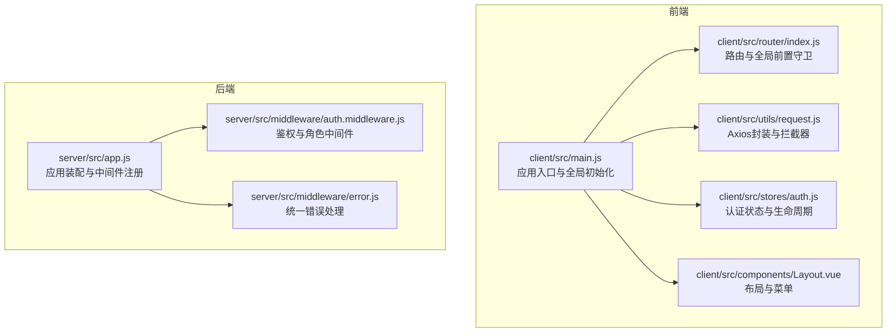
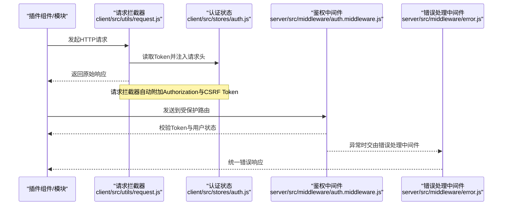
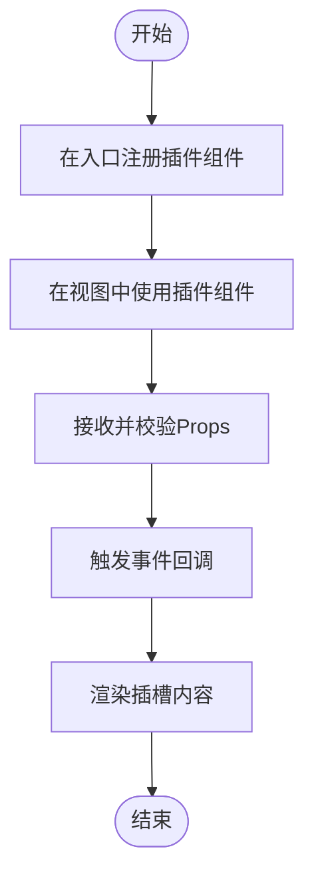
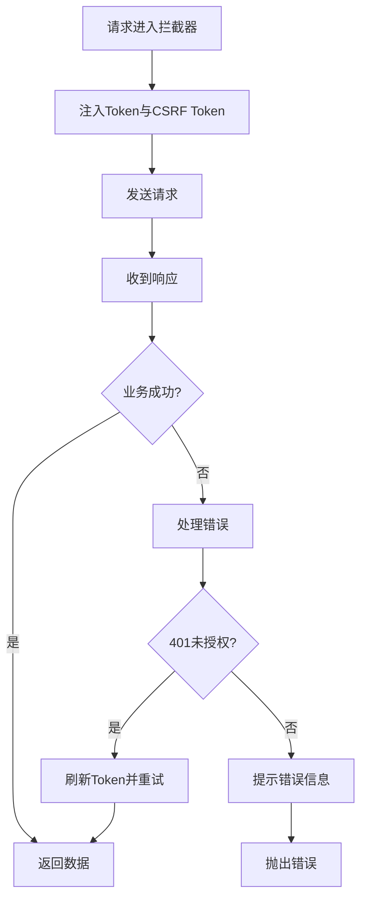
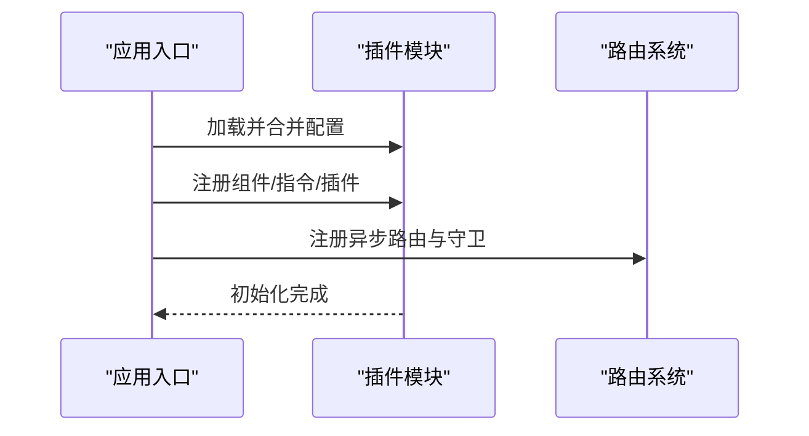
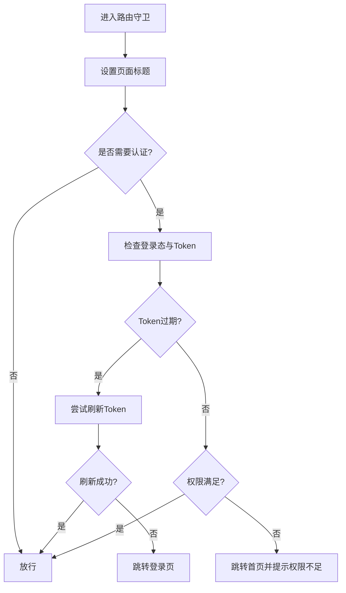
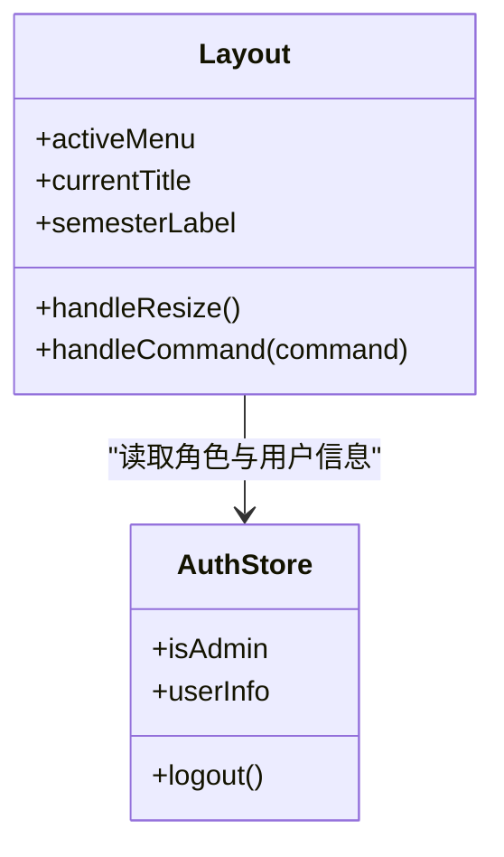
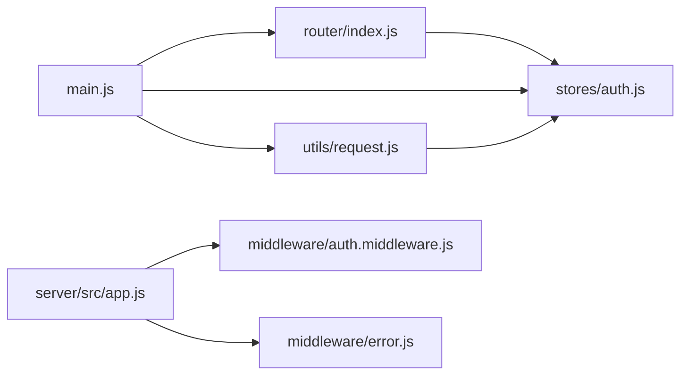

# 插件开发

<cite>
**本文引用的文件**
- [client/src/main.js](file://client/src/main.js)
- [client/src/App.vue](file://client/src/App.vue)
- [client/src/router/index.js](file://client/src/router/index.js)
- [client/src/utils/request.js](file://client/src/utils/request.js)
- [client/src/stores/auth.js](file://client/src/stores/auth.js)
- [client/src/components/Layout.vue](file://client/src/components/Layout.vue)
- [server/src/app.js](file://server/src/app.js)
- [server/src/middleware/auth.middleware.js](file://server/src/middleware/auth.middleware.js)
- [server/src/middleware/error.js](file://server/src/middleware/error.js)
</cite>

## 目录
1. [简介](#简介)
2. [项目结构](#项目结构)
3. [核心组件](#核心组件)
4. [架构总览](#架构总览)
5. [详细组件分析](#详细组件分析)
6. [依赖关系分析](#依赖关系分析)
7. [性能考虑](#性能考虑)
8. [故障排查指南](#故障排查指南)
9. [结论](#结论)
10. [附录](#附录)

## 简介
本指南面向希望在KEC课程管理平台中开发“可复用插件”的前端与后端开发者。文档基于现有组件架构与中间件体系，给出Vue 3组件插件与HTTP中间件插件的开发范式，涵盖组件注册、props传递、事件处理、插槽使用；请求拦截、响应处理、错误捕获；以及插件配置管理与动态加载机制的最佳实践。目标是在保证与主系统兼容性与稳定性的前提下，快速构建高质量插件模块。

## 项目结构
KEC采用前后端分离架构：
- 前端基于Vue 3 + Pinia + Vue Router + Element Plus，统一在入口进行应用初始化、全局错误处理、图标按需注册、路由守卫与鉴权初始化。
- 后端基于Express，通过中间件实现统一鉴权、角色校验、命名转换、XSS清洗与错误处理，并集中挂载各模块路由。

图表来源
- [client/src/main.js:1-115](file://client/src/main.js#L1-L115)
- [client/src/router/index.js:1-244](file://client/src/router/index.js#L1-L244)
- [client/src/utils/request.js:1-145](file://client/src/utils/request.js#L1-L145)
- [client/src/stores/auth.js:1-222](file://client/src/stores/auth.js#L1-L222)
- [client/src/components/Layout.vue:1-369](file://client/src/components/Layout.vue#L1-L369)
- [server/src/app.js:1-158](file://server/src/app.js#L1-L158)
- [server/src/middleware/auth.middleware.js:1-129](file://server/src/middleware/auth.middleware.js#L1-L129)
- [server/src/middleware/error.js:1-63](file://server/src/middleware/error.js#L1-L63)

章节来源
- [client/src/main.js:1-115](file://client/src/main.js#L1-L115)
- [client/src/router/index.js:1-244](file://client/src/router/index.js#L1-L244)
- [server/src/app.js:1-158](file://server/src/app.js#L1-L158)

## 核心组件
- 应用入口与全局初始化：在入口集中注册Pinia、路由、Element Plus、全局图标、全局错误与告警处理器，并在挂载前完成认证初始化。
- 路由与守卫：集中处理页面标题、登录态校验、Token刷新、权限判定与跳转。
- Axios封装与拦截器：统一注入Authorization与CSRF Token、处理401/403/超时等错误、统一业务错误提示。
- 认证状态管理：封装登录、登出、刷新Token、获取用户信息、清理认证状态等能力。
- 布局组件：提供菜单、头部、侧边栏折叠、学期标签、下拉菜单与密码修改弹窗等。

章节来源
- [client/src/main.js:1-115](file://client/src/main.js#L1-L115)
- [client/src/router/index.js:151-241](file://client/src/router/index.js#L151-L241)
- [client/src/utils/request.js:17-142](file://client/src/utils/request.js#L17-L142)
- [client/src/stores/auth.js:48-200](file://client/src/stores/auth.js#L48-L200)
- [client/src/components/Layout.vue:141-206](file://client/src/components/Layout.vue#L141-L206)

## 架构总览
下图展示从前端插件到后端中间件的整体交互路径，包括请求拦截、鉴权与错误处理的关键节点。

图表来源
- [client/src/utils/request.js:17-34](file://client/src/utils/request.js#L17-L34)
- [client/src/stores/auth.js:106-128](file://client/src/stores/auth.js#L106-L128)
- [server/src/middleware/auth.middleware.js:40-106](file://server/src/middleware/auth.middleware.js#L40-L106)
- [server/src/middleware/error.js:35-62](file://server/src/middleware/error.js#L35-L62)

## 详细组件分析

### Vue 3 组件插件开发模式
- 组件注册
  - 在应用入口集中注册插件组件，确保全局可用与按需异步加载。
  - 参考入口对Element Plus图标的按需注册方式，避免全量引入造成体积膨胀。
- Props传递
  - 明确props类型与默认值，结合组合式API的computed与watch处理派生状态。
- 事件处理
  - 使用 emits 声明事件，遵循小驼峰命名，避免直接修改父传props。
- 插槽使用
  - 提供具名插槽与作用域插槽，增强可扩展性；保持插槽内容最小化，避免过度耦合。

图表来源
- [client/src/main.js:67-108](file://client/src/main.js#L67-L108)
- [client/src/App.vue:1-4](file://client/src/App.vue#L1-L4)

章节来源
- [client/src/main.js:67-108](file://client/src/main.js#L67-L108)
- [client/src/App.vue:1-4](file://client/src/App.vue#L1-L4)

### 中间件插件开发方法
- 请求拦截
  - 在请求拦截器中注入通用头（如Authorization、CSRF Token），并对特定端点做例外处理，避免鉴权接口陷入刷新循环。
- 响应处理
  - 统一处理业务错误码与HTTP状态码，结合消息提示组件反馈给用户；对401场景进行Token刷新与重试队列管理。
- 错误捕获
  - 在响应拦截器中区分业务错误与网络错误，统一转化为用户可理解的消息；必要时引导登出并清空本地状态。

图表来源
- [client/src/utils/request.js:17-34](file://client/src/utils/request.js#L17-L34)
- [client/src/utils/request.js:51-142](file://client/src/utils/request.js#L51-L142)
- [client/src/stores/auth.js:106-128](file://client/src/stores/auth.js#L106-L128)

章节来源
- [client/src/utils/request.js:17-142](file://client/src/utils/request.js#L17-L142)
- [client/src/stores/auth.js:106-128](file://client/src/stores/auth.js#L106-L128)

### 插件配置管理与动态加载
- 配置管理
  - 建议将插件配置集中于独立模块，导出默认配置与可覆盖项；在入口处合并默认配置与运行时配置。
- 动态加载
  - 对大型插件采用异步组件与懒加载，减少首屏体积；在路由层配合异步组件按需加载。
- 生命周期
  - 在应用初始化阶段调用插件初始化函数，确保认证状态、全局状态与路由守卫均已完成。

图表来源
- [client/src/main.js:67-108](file://client/src/main.js#L67-L108)
- [client/src/router/index.js:151-241](file://client/src/router/index.js#L151-L241)

章节来源
- [client/src/main.js:67-108](file://client/src/main.js#L67-L108)
- [client/src/router/index.js:151-241](file://client/src/router/index.js#L151-L241)

### 路由守卫与权限控制插件
- 权限判定
  - 在路由守卫中统一处理requiresAuth、requiresAdmin、requiresSuperAdmin等元信息，结合认证状态与用户角色进行判定。
- 登录态与Token刷新
  - 对未登录或Token过期场景，优先尝试刷新Token；若失败则引导至登录页并清理状态。
- 页面标题与回跳
  - 动态设置页面标题；登录页回跳时保留redirect参数，提升用户体验。

图表来源
- [client/src/router/index.js:151-241](file://client/src/router/index.js#L151-L241)
- [client/src/stores/auth.js:181-200](file://client/src/stores/auth.js#L181-L200)

章节来源
- [client/src/router/index.js:151-241](file://client/src/router/index.js#L151-L241)
- [client/src/stores/auth.js:181-200](file://client/src/stores/auth.js#L181-L200)

### 布局与菜单插件
- 菜单渲染
  - 根据用户角色动态渲染菜单项与子菜单；支持折叠与响应式布局。
- 学期标签与头部信息
  - 展示当前学期标签与用户信息，提供修改密码与退出登录入口。
- 弹窗与异步组件
  - 使用异步组件按需加载对话框，降低初始包体。

图表来源
- [client/src/components/Layout.vue:141-206](file://client/src/components/Layout.vue#L141-L206)
- [client/src/stores/auth.js:42-44](file://client/src/stores/auth.js#L42-L44)

章节来源
- [client/src/components/Layout.vue:141-206](file://client/src/components/Layout.vue#L141-L206)
- [client/src/stores/auth.js:42-44](file://client/src/stores/auth.js#L42-L44)

## 依赖关系分析
- 前端依赖
  - main.js依赖router、store、Element Plus与request；router依赖auth store；request依赖auth store与cookies。
- 后端依赖
  - app.js集中注册中间件与路由；auth.middleware与error.middleware作为全局中间件被app使用。

图表来源
- [client/src/main.js:1-115](file://client/src/main.js#L1-L115)
- [client/src/router/index.js:1-244](file://client/src/router/index.js#L1-L244)
- [client/src/stores/auth.js:1-222](file://client/src/stores/auth.js#L1-L222)
- [client/src/utils/request.js:1-145](file://client/src/utils/request.js#L1-L145)
- [server/src/app.js:1-158](file://server/src/app.js#L1-L158)
- [server/src/middleware/auth.middleware.js:1-129](file://server/src/middleware/auth.middleware.js#L1-L129)
- [server/src/middleware/error.js:1-63](file://server/src/middleware/error.js#L1-L63)

章节来源
- [client/src/main.js:1-115](file://client/src/main.js#L1-L115)
- [server/src/app.js:1-158](file://server/src/app.js#L1-L158)

## 性能考虑
- 图标与组件按需加载：仅注册实际使用的图标与异步组件，减少首屏体积。
- 路由懒加载：使用异步组件按需加载页面，降低初始包体。
- 缓存与去抖：在前端与后端均应避免重复请求与无效刷新，合理设置缓存策略。
- 中间件顺序：命名转换、XSS清洗等应在路由前执行，减少后续处理成本。

## 故障排查指南
- 登录失败/权限不足
  - 检查路由守卫中的requiresAuth/roles配置与用户角色；确认Token是否过期并尝试刷新。
- 请求401/403
  - 查看请求拦截器是否正确注入Authorization与CSRF Token；确认鉴权中间件是否通过。
- 错误提示不一致
  - 统一使用错误处理中间件与消息提示组件，避免分散处理。
- 跨域与CORS
  - 检查CORS配置与allowedOrigins，确保开发与生产环境正确放开。

章节来源
- [client/src/router/index.js:151-241](file://client/src/router/index.js#L151-L241)
- [client/src/utils/request.js:51-142](file://client/src/utils/request.js#L51-L142)
- [server/src/middleware/error.js:35-62](file://server/src/middleware/error.js#L35-L62)
- [server/src/app.js:41-76](file://server/src/app.js#L41-L76)

## 结论
通过在现有入口、路由与中间件体系之上构建插件，可以实现高内聚、低耦合的可复用模块。建议严格遵循组件插件的注册与事件规范、中间件的拦截与错误处理约定，并在配置与加载层面保持一致性与可维护性。以上流程与最佳实践可在保证系统稳定性的同时，显著提升开发效率与扩展能力。

## 附录
- 开发清单
  - 组件插件：注册、props、事件、插槽、异步加载
  - 中间件插件：请求拦截、响应处理、错误捕获、权限校验
  - 配置管理：默认配置、运行时覆盖、入口合并
  - 动态加载：异步组件、路由懒加载、初始化时机