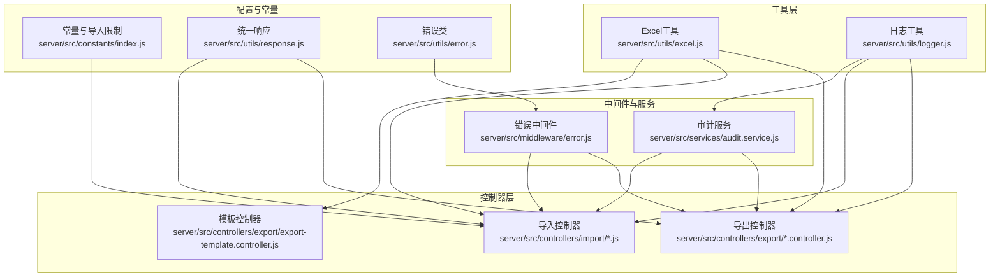
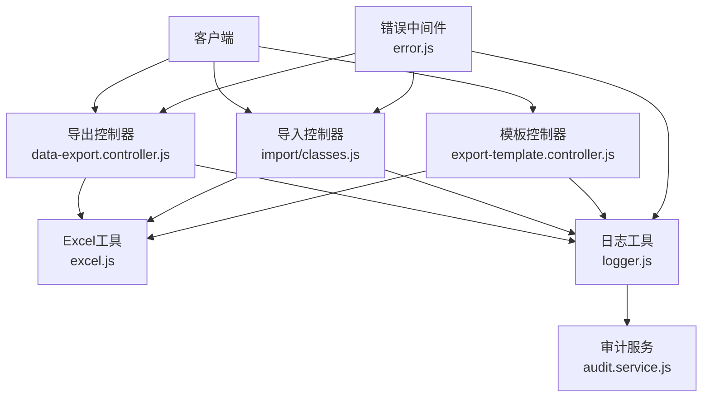
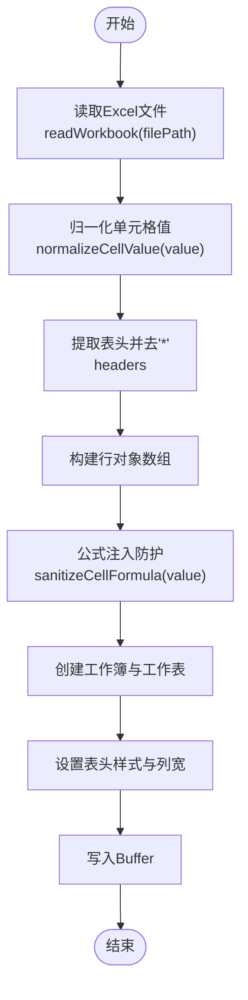
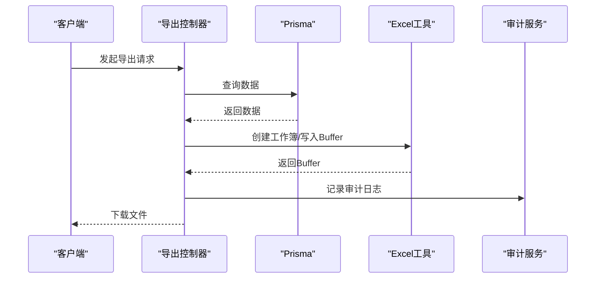
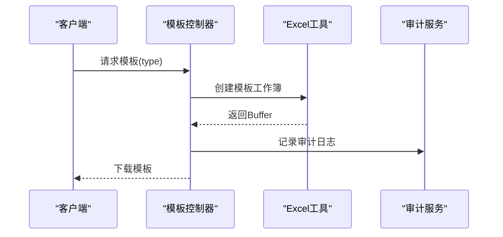
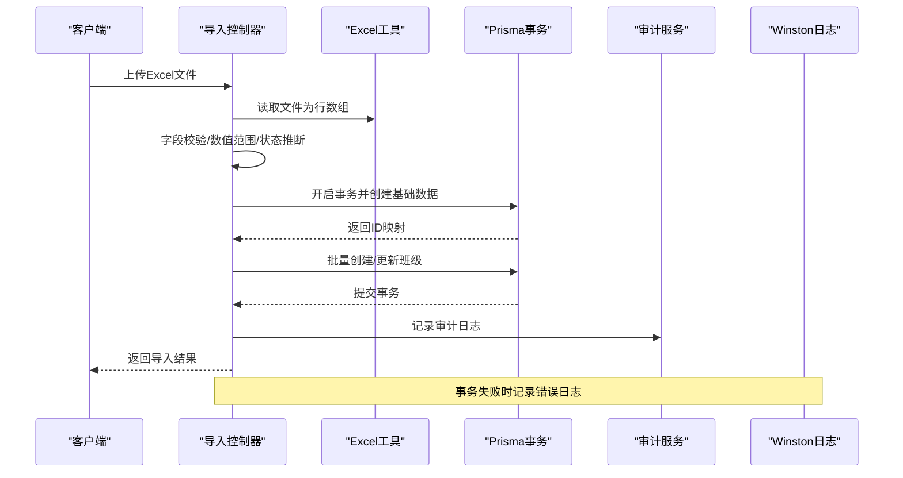
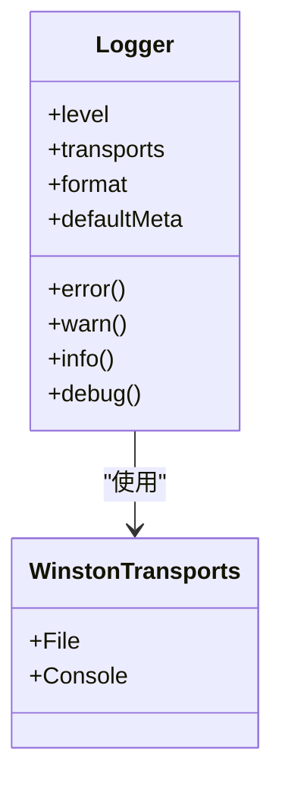
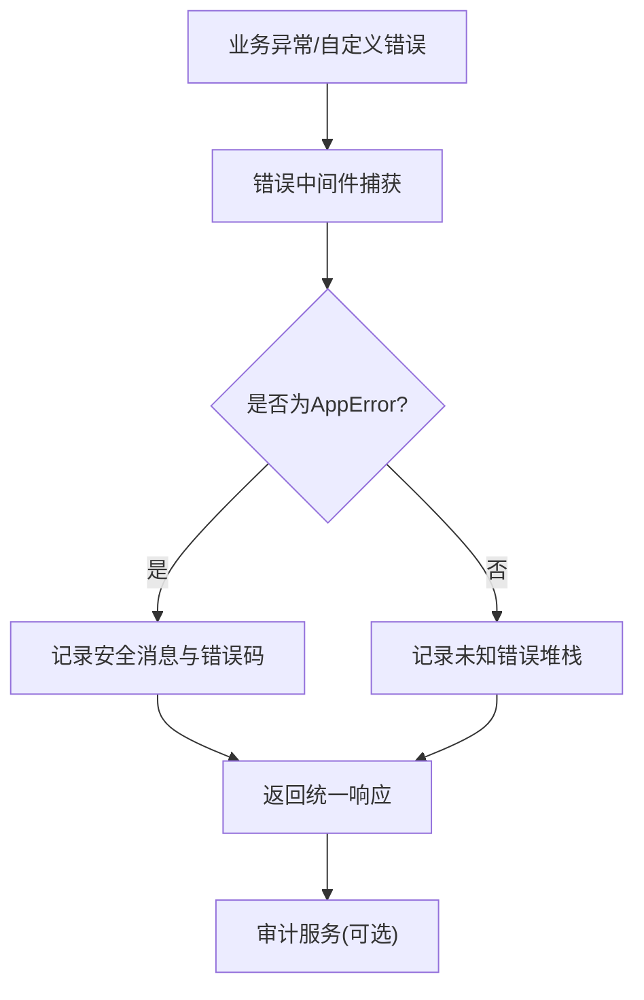
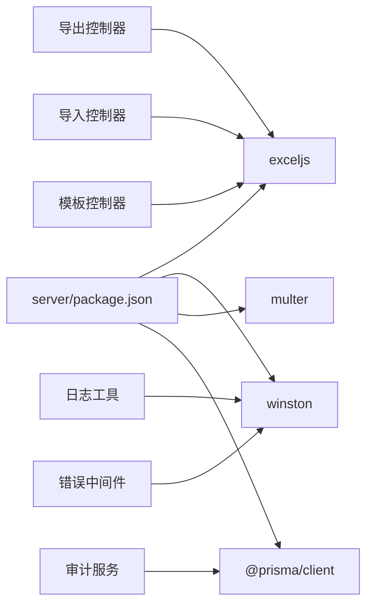

# 第三方集成

<cite>
**本文引用的文件**
- [server/src/utils/excel.js](file://server/src/utils/excel.js)
- [server/src/utils/logger.js](file://server/src/utils/logger.js)
- [server/src/controllers/export/data-export.controller.js](file://server/src/controllers/export/data-export.controller.js)
- [server/src/controllers/export/export-template.controller.js](file://server/src/controllers/export/export-template.controller.js)
- [server/src/controllers/import/classes.js](file://server/src/controllers/import/classes.js)
- [server/src/middleware/error.js](file://server/src/middleware/error.js)
- [server/src/services/audit.service.js](file://server/src/services/audit.service.js)
- [server/src/constants/index.js](file://server/src/constants/index.js)
- [server/src/utils/response.js](file://server/src/utils/response.js)
- [server/src/utils/error.js](file://server/src/utils/error.js)
- [server/package.json](file://server/package.json)
</cite>

## 目录
1. [简介](#简介)
2. [项目结构](#项目结构)
3. [核心组件](#核心组件)
4. [架构总览](#架构总览)
5. [详细组件分析](#详细组件分析)
6. [依赖关系分析](#依赖关系分析)
7. [性能考量](#性能考量)
8. [故障排查指南](#故障排查指南)
9. [结论](#结论)
10. [附录](#附录)

## 简介
本指南面向KEC课程管理平台的第三方服务集成，重点围绕以下能力展开：
- Excel处理：基于ExcelJS的导入/导出、模板生成、数据清洗与安全防护
- 日志记录：基于Winston的日志系统配置、审计通道与错误处理
- 审计与错误处理：统一错误类、错误中间件与审计日志落库
- 异步任务与批量处理：批量导入的事务保障与批量排课扩展点
- OAuth与文件存储：当前仓库未直接集成OAuth与消息队列，本文给出对接建议与最佳实践
- 集成测试与错误处理最佳实践：结合现有控制器与中间件的实践总结

## 项目结构
后端采用模块化组织，第三方服务主要集中在工具层与控制器层：
- 工具层：Excel处理与日志工具
- 控制器层：导出、导入、模板下载等业务入口
- 中间件：统一错误处理
- 服务层：审计日志、排课等业务服务
- 常量与响应：导入限制、审计模块枚举、统一响应格式

**图表来源**
- [server/src/utils/excel.js:1-171](file://server/src/utils/excel.js#L1-L171)
- [server/src/utils/logger.js:1-96](file://server/src/utils/logger.js#L1-L96)
- [server/src/controllers/export/data-export.controller.js:1-822](file://server/src/controllers/export/data-export.controller.js#L1-L822)
- [server/src/controllers/export/export-template.controller.js:1-138](file://server/src/controllers/export/export-template.controller.js#L1-L138)
- [server/src/controllers/import/classes.js:1-345](file://server/src/controllers/import/classes.js#L1-L345)
- [server/src/middleware/error.js:1-63](file://server/src/middleware/error.js#L1-L63)
- [server/src/services/audit.service.js:1-94](file://server/src/services/audit.service.js#L1-L94)
- [server/src/constants/index.js:1-130](file://server/src/constants/index.js#L1-L130)
- [server/src/utils/response.js:1-21](file://server/src/utils/response.js#L1-L21)
- [server/src/utils/error.js:1-58](file://server/src/utils/error.js#L1-L58)

**章节来源**
- [server/src/utils/excel.js:1-171](file://server/src/utils/excel.js#L1-L171)
- [server/src/utils/logger.js:1-96](file://server/src/utils/logger.js#L1-L96)
- [server/src/controllers/export/data-export.controller.js:1-822](file://server/src/controllers/export/data-export.controller.js#L1-L822)
- [server/src/controllers/export/export-template.controller.js:1-138](file://server/src/controllers/export/export-template.controller.js#L1-L138)
- [server/src/controllers/import/classes.js:1-345](file://server/src/controllers/import/classes.js#L1-L345)
- [server/src/middleware/error.js:1-63](file://server/src/middleware/error.js#L1-L63)
- [server/src/services/audit.service.js:1-94](file://server/src/services/audit.service.js#L1-L94)
- [server/src/constants/index.js:1-130](file://server/src/constants/index.js#L1-L130)
- [server/src/utils/response.js:1-21](file://server/src/utils/response.js#L1-L21)
- [server/src/utils/error.js:1-58](file://server/src/utils/error.js#L1-L58)

## 核心组件
- ExcelJS工具：提供工作簿创建、模板生成、单元格值归一化、CSV/公式注入防护、缓冲区导出
- Winston日志：统一日志格式、文件与控制台输出、审计通道、错误中间件集成
- 审计服务：落库审计日志、失败时通过Winston兜底记录
- 错误体系：统一错误类、安全消息映射、错误中间件
- 导入限制：文件大小、类型、行数上限等常量

**章节来源**
- [server/src/utils/excel.js:1-171](file://server/src/utils/excel.js#L1-L171)
- [server/src/utils/logger.js:1-96](file://server/src/utils/logger.js#L1-L96)
- [server/src/services/audit.service.js:1-94](file://server/src/services/audit.service.js#L1-L94)
- [server/src/middleware/error.js:1-63](file://server/src/middleware/error.js#L1-L63)
- [server/src/constants/index.js:22-27](file://server/src/constants/index.js#L22-L27)

## 架构总览
下图展示Excel处理、日志与审计在导出/导入流程中的协作关系。

**图表来源**
- [server/src/controllers/export/data-export.controller.js:1-822](file://server/src/controllers/export/data-export.controller.js#L1-L822)
- [server/src/controllers/import/classes.js:1-345](file://server/src/controllers/import/classes.js#L1-L345)
- [server/src/controllers/export/export-template.controller.js:1-138](file://server/src/controllers/export/export-template.controller.js#L1-L138)
- [server/src/utils/excel.js:1-171](file://server/src/utils/excel.js#L1-L171)
- [server/src/utils/logger.js:1-96](file://server/src/utils/logger.js#L1-L96)
- [server/src/services/audit.service.js:1-94](file://server/src/services/audit.service.js#L1-L94)
- [server/src/middleware/error.js:1-63](file://server/src/middleware/error.js#L1-L63)

## 详细组件分析

### ExcelJS集成与数据转换策略
- 工作簿创建与样式：按表头配置列宽、加粗表头、浅灰背景；导出时对首行样式进行美化
- 模板生成：根据字段是否必填标注“*”，并为必填字段设置浅红填充与深红字体
- 数据读取与归一化：逐行读取，第一行为表头（去除模板标记“*”），后续行按表头数量遍历列，避免空单元格遗漏；对日期、富文本、对象、数字字符串进行归一化处理
- 安全防护：对以“= + - @”开头的单元格值加单引号前缀，防止CSV/Excel公式注入
- 导出缓冲：将工作簿写入Buffer并通过HTTP响应发送

**图表来源**
- [server/src/utils/excel.js:90-134](file://server/src/utils/excel.js#L90-L134)
- [server/src/utils/excel.js:15-42](file://server/src/utils/excel.js#L15-L42)
- [server/src/utils/excel.js:140-170](file://server/src/utils/excel.js#L140-L170)

**章节来源**
- [server/src/utils/excel.js:1-171](file://server/src/utils/excel.js#L1-L171)

### 导出流程（控制器到Excel工具）
- 导出控制器从数据库查询数据，映射为中文表头与行数据，调用Excel工具创建工作簿并导出为Buffer
- 设置Content-Type与Content-Disposition，触发浏览器下载
- 成功/失败均记录审计日志，包含行数、筛选条件等细节

**图表来源**
- [server/src/controllers/export/data-export.controller.js:17-71](file://server/src/controllers/export/data-export.controller.js#L17-L71)
- [server/src/utils/excel.js:15-42](file://server/src/utils/excel.js#L15-L42)
- [server/src/utils/excel.js:136-138](file://server/src/utils/excel.js#L136-L138)
- [server/src/services/audit.service.js:15-49](file://server/src/services/audit.service.js#L15-L49)

**章节来源**
- [server/src/controllers/export/data-export.controller.js:1-822](file://server/src/controllers/export/data-export.controller.js#L1-L822)

### 模板下载流程（模板控制器到Excel工具）
- 模板控制器根据类型生成表头与示例数据，调用Excel工具创建模板工作簿并导出
- 对必填字段标注“*”，并设置表头样式与颜色

**图表来源**
- [server/src/controllers/export/export-template.controller.js:7-137](file://server/src/controllers/export/export-template.controller.js#L7-L137)
- [server/src/utils/excel.js:140-170](file://server/src/utils/excel.js#L140-L170)

**章节来源**
- [server/src/controllers/export/export-template.controller.js:1-138](file://server/src/controllers/export/export-template.controller.js#L1-L138)

### 导入流程（Excel读取、校验、事务批量入库）
- 控制器接收上传文件，调用Excel工具读取为行数组
- 对每行进行字段校验、数值范围校验、状态推断、基础数据名收集
- 使用Prisma事务：先创建缺失的基础数据（层次、专业、学院），再处理班级记录，保证一致性
- 成功/失败均记录审计日志，并在事务失败时通过Winston记录错误堆栈

**图表来源**
- [server/src/controllers/import/classes.js:13-345](file://server/src/controllers/import/classes.js#L13-L345)
- [server/src/utils/excel.js:90-134](file://server/src/utils/excel.js#L90-L134)
- [server/src/services/audit.service.js:15-49](file://server/src/services/audit.service.js#L15-L49)
- [server/src/utils/logger.js:1-96](file://server/src/utils/logger.js#L1-L96)

**章节来源**
- [server/src/controllers/import/classes.js:1-345](file://server/src/controllers/import/classes.js#L1-L345)

### Winston日志系统配置与自定义处理器
- 日志目录：启动时自动创建logs目录
- 输出通道：错误文件(error.log)、综合文件(combined.log)、审计文件(audit.log)，均带滚动与大小限制
- 格式：时间戳、错误堆栈、JSON序列化元数据；开发环境控制台彩色输出，生产环境无色控制台输出
- 审计通道：独立文件，便于审计分析
- 错误中间件：统一捕获应用错误与未知错误，记录安全消息与堆栈

**图表来源**
- [server/src/utils/logger.js:34-85](file://server/src/utils/logger.js#L34-L85)

**章节来源**
- [server/src/utils/logger.js:1-96](file://server/src/utils/logger.js#L1-L96)
- [server/src/middleware/error.js:1-63](file://server/src/middleware/error.js#L1-L63)

### 审计日志与错误处理
- 审计服务：将操作动作、模块、结果、详情、IP、用户ID等持久化；详情过大截断；失败时通过Winston记录兜底
- 错误中间件：Prisma错误码映射安全消息；自定义错误类统一处理；未知错误记录堆栈并返回安全消息
- 统一响应：success/fail/paginate统一返回结构，便于前端消费

**图表来源**
- [server/src/middleware/error.js:35-62](file://server/src/middleware/error.js#L35-L62)
- [server/src/utils/error.js:5-58](file://server/src/utils/error.js#L5-L58)
- [server/src/utils/response.js:1-21](file://server/src/utils/response.js#L1-L21)
- [server/src/services/audit.service.js:15-49](file://server/src/services/audit.service.js#L15-L49)

**章节来源**
- [server/src/services/audit.service.js:1-94](file://server/src/services/audit.service.js#L1-L94)
- [server/src/middleware/error.js:1-63](file://server/src/middleware/error.js#L1-L63)
- [server/src/utils/error.js:1-58](file://server/src/utils/error.js#L1-L58)
- [server/src/utils/response.js:1-21](file://server/src/utils/response.js#L1-L21)

### API客户端封装与异步任务处理
- API客户端封装：建议在客户端层引入Axios或Fetch封装，统一拦截器处理鉴权、超时、重试与错误提示
- 异步任务：批量导入已通过Prisma事务保障原子性；如需进一步解耦，可在服务层引入消息队列（见附录建议）

（本节为概念性指导，不直接分析具体文件）

### OAuth认证集成
- 当前仓库未发现OAuth集成实现
- 建议：在认证中间件中引入OAuth Provider SDK，回调后签发JWT；在路由层通过中间件校验JWT

（本节为概念性指导，不直接分析具体文件）

### 文件存储服务
- 当前导入使用本地Multer临时文件，建议替换为云存储SDK（如阿里云OSS、七牛云等）
- 建议：在上传完成后删除本地临时文件，仅保留云端链接

（本节为概念性指导，不直接分析具体文件）

### 消息队列接入
- 批量导入已通过事务保障一致性；若需削峰填谷，可在导入完成后投递消息至队列（如RabbitMQ/Kafka/Redis Stream）
- 建议：消费者异步处理，失败重试与死信队列

（本节为概念性指导，不直接分析具体文件）

## 依赖关系分析
- ExcelJS：用于导入/导出与模板生成
- Winston：日志系统，配合审计服务
- Multer：文件上传中间件
- Prisma：数据库访问与事务

**图表来源**
- [server/package.json:28-41](file://server/package.json#L28-L41)
- [server/src/controllers/export/data-export.controller.js:1-13](file://server/src/controllers/export/data-export.controller.js#L1-L13)
- [server/src/controllers/import/classes.js:1-8](file://server/src/controllers/import/classes.js#L1-L8)
- [server/src/controllers/export/export-template.controller.js:1-2](file://server/src/controllers/export/export-template.controller.js#L1-L2)
- [server/src/utils/logger.js:1-4](file://server/src/utils/logger.js#L1-L4)
- [server/src/services/audit.service.js:1-2](file://server/src/services/audit.service.js#L1-L2)
- [server/src/middleware/error.js:1-2](file://server/src/middleware/error.js#L1-L2)

**章节来源**
- [server/package.json:1-53](file://server/package.json#L1-L53)

## 性能考量
- Excel读取：限制最大行数与文件大小，避免内存峰值过高
- 导出：按模块拆分控制器，避免单次导出数据量过大
- 日志：文件滚动与大小限制，避免磁盘占用无限增长
- 事务：批量导入使用事务，减少回滚成本与数据不一致风险

（本节为通用建议，不直接分析具体文件）

## 故障排查指南
- Excel读取失败：检查文件类型与大小限制、表头是否符合模板、是否存在超大行数
- 导入失败：查看审计日志details中的错误行号与原因；确认Prisma事务是否回滚
- 日志不可见：确认NODE_ENV与日志级别；检查logs目录权限
- 错误消息泄露：生产环境错误中间件会返回安全消息，必要时查看Winston错误日志定位堆栈

**章节来源**
- [server/src/constants/index.js:22-27](file://server/src/constants/index.js#L22-L27)
- [server/src/middleware/error.js:1-63](file://server/src/middleware/error.js#L1-L63)
- [server/src/services/audit.service.js:1-94](file://server/src/services/audit.service.js#L1-L94)
- [server/src/utils/logger.js:1-96](file://server/src/utils/logger.js#L1-L96)

## 结论
本指南梳理了KEC课程管理平台在Excel处理、日志与审计、错误处理方面的第三方服务集成现状与最佳实践。通过ExcelJS与Winston的组合，实现了安全、可观测、可审计的数据导入导出能力；借助Prisma事务与统一错误中间件，保障了批量导入的一致性与稳定性。对于OAuth、文件存储与消息队列等扩展场景，建议遵循本文提供的架构建议与最佳实践逐步接入。

## 附录
- 配置项参考
  - 导入限制：最大文件大小、允许类型、最大行数
  - 审计模块与动作枚举
- 建议的环境变量
  - LOG_LEVEL：日志级别
  - NODE_ENV：开发/生产环境切换
  - DEFAULT_SEMESTER：默认学期（可覆盖）

**章节来源**
- [server/src/constants/index.js:22-129](file://server/src/constants/index.js#L22-L129)
- [server/src/utils/logger.js:34-35](file://server/src/utils/logger.js#L34-L35)