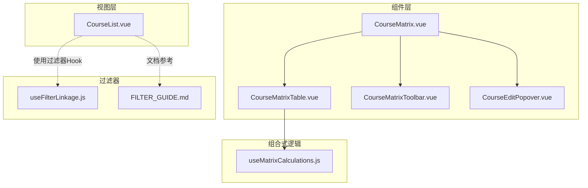
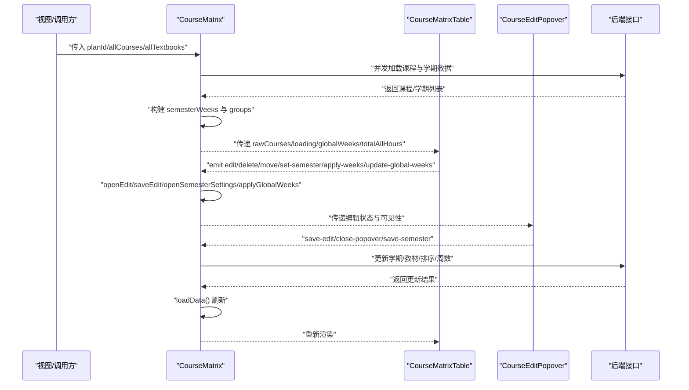
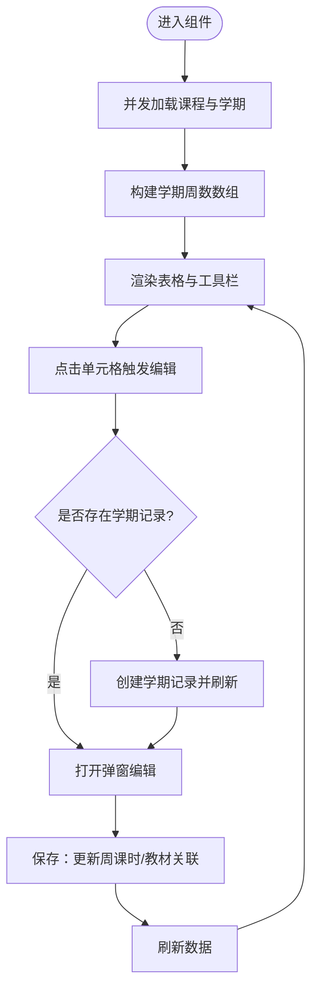
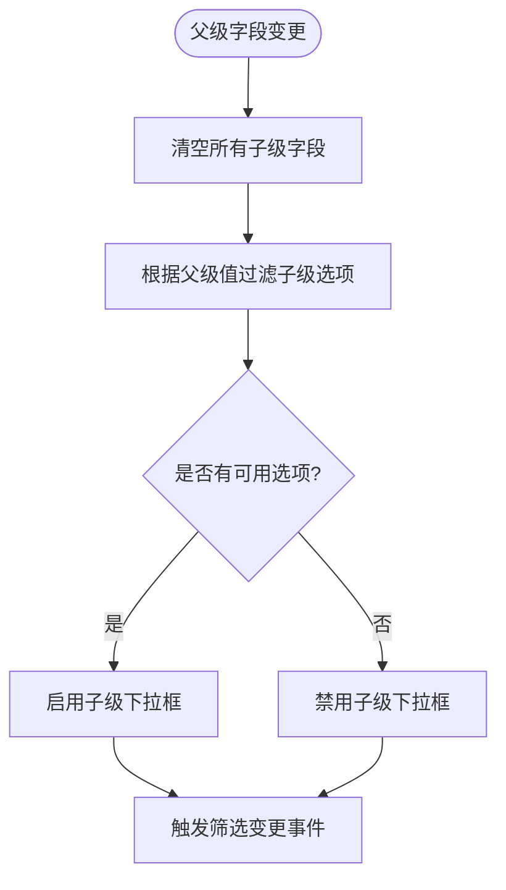
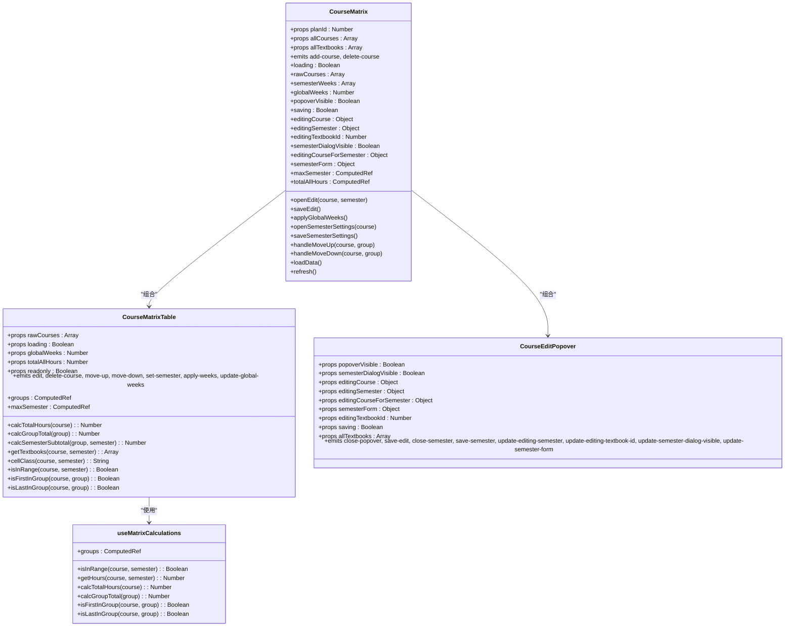
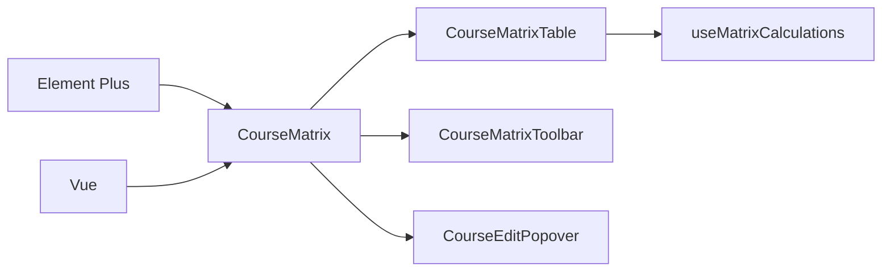

# 自定义组件

<cite>
**本文引用的文件**
- [client/src/components/CourseMatrix.vue](file://client/src/components/CourseMatrix.vue)
- [client/src/components/CourseMatrixTable.vue](file://client/src/components/CourseMatrixTable.vue)
- [client/src/components/CourseMatrixToolbar.vue](file://client/src/components/CourseMatrixToolbar.vue)
- [client/src/components/CourseEditPopover.vue](file://client/src/components/CourseEditPopover.vue)
- [client/src/composables/useMatrixCalculations.js](file://client/src/composables/useMatrixCalculations.js)
- [client/src/components/filter/composables/useFilterLinkage.js](file://client/src/components/filter/composables/useFilterLinkage.js)
- [client/src/components/filter/FILTER_GUIDE.md](file://client/src/components/filter/FILTER_GUIDE.md)
- [client/src/views/course/CourseList.vue](file://client/src/views/course/CourseList.vue)
- [client/src/main.js](file://client/src/main.js)
- [client/src/App.vue](file://client/src/App.vue)
</cite>

## 目录
1. [简介](#简介)
2. [项目结构](#项目结构)
3. [核心组件](#核心组件)
4. [架构总览](#架构总览)
5. [详细组件分析](#详细组件分析)
6. [依赖分析](#依赖分析)
7. [性能考虑](#性能考虑)
8. [故障排查指南](#故障排查指南)
9. [结论](#结论)
10. [附录](#附录)

## 简介
本指南面向KEC课程管理平台的前端开发者，系统讲解如何基于Element Plus组件库与现有组件架构，创建高质量的自定义UI组件。文档聚焦以下主题：
- 组件设计原则与命名规范
- 样式定制与主题一致性
- CourseMatrix、CourseEditPopover等现有组件的开发模式与最佳实践
- 过滤器组件的实现原理与扩展方法
- 生命周期管理、状态管理与事件处理
- 响应式设计与无障碍访问（a11y）实现要点

## 项目结构
客户端采用基于功能域的组织方式，组件集中在client/src/components目录，页面视图位于client/src/views，公共逻辑通过composables抽取。整体围绕“容器组件 + 表现组件 + 可复用组合式逻辑”的分层架构展开。

图表来源
- [client/src/components/CourseMatrix.vue:1-391](file://client/src/components/CourseMatrix.vue#L1-L391)
- [client/src/components/CourseMatrixTable.vue:1-480](file://client/src/components/CourseMatrixTable.vue#L1-L480)
- [client/src/components/CourseMatrixToolbar.vue:1-41](file://client/src/components/CourseMatrixToolbar.vue#L1-L41)
- [client/src/components/CourseEditPopover.vue:1-186](file://client/src/components/CourseEditPopover.vue#L1-L186)
- [client/src/composables/useMatrixCalculations.js:1-91](file://client/src/composables/useMatrixCalculations.js#L1-L91)
- [client/src/components/filter/composables/useFilterLinkage.js:1-150](file://client/src/components/filter/composables/useFilterLinkage.js#L1-L150)
- [client/src/components/filter/FILTER_GUIDE.md:1-348](file://client/src/components/filter/FILTER_GUIDE.md#L1-L348)
- [client/src/views/course/CourseList.vue:1-238](file://client/src/views/course/CourseList.vue#L1-L238)

章节来源
- [client/src/components/CourseMatrix.vue:1-391](file://client/src/components/CourseMatrix.vue#L1-L391)
- [client/src/components/CourseMatrixTable.vue:1-480](file://client/src/components/CourseMatrixTable.vue#L1-L480)
- [client/src/components/CourseMatrixToolbar.vue:1-41](file://client/src/components/CourseMatrixToolbar.vue#L1-L41)
- [client/src/components/CourseEditPopover.vue:1-186](file://client/src/components/CourseEditPopover.vue#L1-L186)
- [client/src/composables/useMatrixCalculations.js:1-91](file://client/src/composables/useMatrixCalculations.js#L1-L91)
- [client/src/components/filter/composables/useFilterLinkage.js:1-150](file://client/src/components/filter/composables/useFilterLinkage.js#L1-L150)
- [client/src/components/filter/FILTER_GUIDE.md:1-348](file://client/src/components/filter/FILTER_GUIDE.md#L1-L348)
- [client/src/views/course/CourseList.vue:1-238](file://client/src/views/course/CourseList.vue#L1-L238)

## 核心组件
- CourseMatrix：课程矩阵容器，负责数据加载、状态管理、事件编排与批量操作（如统一设置周数），并与子组件解耦。
- CourseMatrixTable：矩阵表格表现组件，负责渲染分组、学期单元格、小计与总课时，以及只读/可编辑模式切换。
- CourseMatrixToolbar：顶部工具条，提供添加课程入口与统计信息展示。
- CourseEditPopover：弹出式编辑面板，封装学期周课时与教材关联编辑，并提供开课学期设置对话框。
- useMatrixCalculations：矩阵计算逻辑抽取，统一分组、范围判断、课时计算与边界判定。
- 过滤器组合式逻辑：useFilterLinkage提供筛选联动、父子字段清空策略、多条件交集过滤等能力；配套文档指导迁移与最佳实践。

章节来源
- [client/src/components/CourseMatrix.vue:44-391](file://client/src/components/CourseMatrix.vue#L44-L391)
- [client/src/components/CourseMatrixTable.vue:137-480](file://client/src/components/CourseMatrixTable.vue#L137-L480)
- [client/src/components/CourseMatrixToolbar.vue:12-41](file://client/src/components/CourseMatrixToolbar.vue#L12-L41)
- [client/src/components/CourseEditPopover.vue:124-186](file://client/src/components/CourseEditPopover.vue#L124-L186)
- [client/src/composables/useMatrixCalculations.js:7-91](file://client/src/composables/useMatrixCalculations.js#L7-L91)
- [client/src/components/filter/composables/useFilterLinkage.js:13-150](file://client/src/components/filter/composables/useFilterLinkage.js#L13-L150)
- [client/src/components/filter/FILTER_GUIDE.md:1-348](file://client/src/components/filter/FILTER_GUIDE.md#L1-L348)

## 架构总览
下图展示了课程矩阵组件的典型交互流程：容器组件协调数据与事件，表格组件负责渲染与交互，弹出面板承载编辑与设置，计算组合式逻辑提供共享算法。

图表来源
- [client/src/components/CourseMatrix.vue:339-391](file://client/src/components/CourseMatrix.vue#L339-L391)
- [client/src/components/CourseMatrixTable.vue:137-217](file://client/src/components/CourseMatrixTable.vue#L137-L217)
- [client/src/components/CourseEditPopover.vue:124-149](file://client/src/components/CourseEditPopover.vue#L124-L149)

## 详细组件分析

### CourseMatrix 容器组件
- 设计原则
  - 单一职责：集中处理数据加载、状态管理、事件编排与批量操作。
  - 解耦与暴露：通过子组件通信与defineExpose暴露刷新方法，便于外部调用。
  - 错误与反馈：统一使用消息提示与加载状态，提升用户体验。
- 关键特性
  - 数据加载：并发获取课程与学期，构建学期周数数组，支持全局周数回退。
  - 编辑流程：打开编辑时自动创建缺失的学期记录，保存时同步周课时与教材关联。
  - 批量操作：统一应用周数，使用Promise.allSettled处理并发与部分失败。
  - 排序机制：分组内交换排序，逐个PATCH更新避免并发写锁与重复值问题。
- 样式与布局
  - 容器高度自适应，结合scoped样式确保局部作用域，避免污染。

图表来源
- [client/src/components/CourseMatrix.vue:95-199](file://client/src/components/CourseMatrix.vue#L95-L199)

章节来源
- [client/src/components/CourseMatrix.vue:44-391](file://client/src/components/CourseMatrix.vue#L44-L391)

### CourseMatrixTable 表现组件
- 设计原则
  - 渲染与交互分离：仅负责渲染与事件透传，复杂逻辑由容器与组合式逻辑承担。
  - 可读性与可维护性：分组标题、小计行、固定列与粘性定位提升可读性。
- 关键特性
  - 分组渲染：按课程类型分组，分别计算小计与总课时。
  - 单元格样式：根据周课时高低设置不同背景色，直观表达强度。
  - 操作按钮：支持上下移动、设置学期、删除课程等。
  - 只读模式：通过readonly属性切换显示行为。
- 样式定制
  - 使用scoped样式与语义化类名，配合Element Plus主题变量保持一致风格。

章节来源
- [client/src/components/CourseMatrixTable.vue:137-480](file://client/src/components/CourseMatrixTable.vue#L137-L480)

### CourseMatrixToolbar 工具条
- 设计原则
  - 轻量与专注：仅提供必要的操作入口与统计信息。
- 关键特性
  - 添加课程按钮：向外发射事件，由父组件处理。
  - 统计标签：显示课程总数，增强信息密度。

章节来源
- [client/src/components/CourseMatrixToolbar.vue:12-41](file://client/src/components/CourseMatrixToolbar.vue#L12-L41)

### CourseEditPopover 弹出面板
- 设计原则
  - 状态驱动：通过props与emit实现双向绑定，避免直接修改父组件状态。
  - 易用性：禁用不合法选项（如周课时为0时禁用教材选择），提供提示。
- 关键特性
  - 周课时编辑：单选按钮快速切换，实时校验。
  - 教材关联：下拉选择教材，支持清空与禁用状态提示。
  - 开课学期设置：对话框内设置起止学期，提示自动创建/删除对应学期记录。
- 事件流
  - 通过emit向上冒泡，由容器组件统一处理保存与关闭。

章节来源
- [client/src/components/CourseEditPopover.vue:124-186](file://client/src/components/CourseEditPopover.vue#L124-L186)

### 过滤器组件实现与扩展
- 实现原理
  - useFilterLinkage提供三类能力：动态过滤选项、父子字段清空策略、多条件交集过滤。
  - 支持ref与普通对象两种关系数据形态，适配不同页面的数据结构。
- 扩展方法
  - 简单联动：基于父级字段过滤子级选项。
  - 多条件交集：对入学年份等需要综合多个父级取交集的场景，使用交集过滤。
  - 清空策略：父级变化时，按层级清空所有子级字段，避免脏数据。
- 迁移指南
  - 参考FILTER_GUIDE.md，按页面现状制定迁移步骤，逐步完善后端关联数据与前端Hook使用。

图表来源
- [client/src/components/filter/composables/useFilterLinkage.js:84-91](file://client/src/components/filter/composables/useFilterLinkage.js#L84-L91)
- [client/src/components/filter/composables/useFilterLinkage.js:21-68](file://client/src/components/filter/composables/useFilterLinkage.js#L21-L68)

章节来源
- [client/src/components/filter/composables/useFilterLinkage.js:13-150](file://client/src/components/filter/composables/useFilterLinkage.js#L13-L150)
- [client/src/components/filter/FILTER_GUIDE.md:1-348](file://client/src/components/filter/FILTER_GUIDE.md#L1-L348)

### 组件类图（代码级）

图表来源
- [client/src/components/CourseMatrix.vue:62-112](file://client/src/components/CourseMatrix.vue#L62-L112)
- [client/src/components/CourseMatrixTable.vue:142-179](file://client/src/components/CourseMatrixTable.vue#L142-L179)
- [client/src/components/CourseEditPopover.vue:125-149](file://client/src/components/CourseEditPopover.vue#L125-L149)
- [client/src/composables/useMatrixCalculations.js:7-89](file://client/src/composables/useMatrixCalculations.js#L7-L89)

## 依赖分析
- 组件间依赖
  - CourseMatrix 依赖 CourseMatrixTable、CourseMatrixToolbar、CourseEditPopover 与 useMatrixCalculations。
  - CourseMatrixTable 依赖 useMatrixCalculations。
  - CourseEditPopover 为纯表现组件，依赖Element Plus表单与对话框。
- 外部依赖
  - Element Plus：图标、表单控件、对话框、消息提示、按钮等。
  - Vue：Composition API、响应式与生命周期。
- 数据流
  - 容器组件负责数据获取与状态管理，子组件通过props与事件进行单向数据流传递。

图表来源
- [client/src/components/CourseMatrix.vue:45-49](file://client/src/components/CourseMatrix.vue#L45-L49)
- [client/src/components/CourseMatrixTable.vue:138-140](file://client/src/components/CourseMatrixTable.vue#L138-L140)
- [client/src/composables/useMatrixCalculations.js](file://client/src/composables/useMatrixCalculations.js#L1)

章节来源
- [client/src/components/CourseMatrix.vue:45-49](file://client/src/components/CourseMatrix.vue#L45-L49)
- [client/src/components/CourseMatrixTable.vue:138-140](file://client/src/components/CourseMatrixTable.vue#L138-L140)
- [client/src/composables/useMatrixCalculations.js](file://client/src/composables/useMatrixCalculations.js#L1)

## 性能考虑
- 计算与缓存
  - 使用computed缓存分组、范围判断与课时计算，避免重复计算。
  - 对大数据量场景，优先使用Set与Map进行交集与映射，降低时间复杂度。
- 并发与批处理
  - 批量更新学期周数使用Promise.allSettled，汇总失败数量并提示。
  - 排序采用串行PATCH更新，避免SQLite并发写锁与重复值问题。
- 渲染优化
  - 表格使用固定列与粘性定位，减少滚动重绘。
  - 条件渲染与空状态占位，避免无效DOM。
- 输入防抖
  - 参考课程列表对筛选关键词的防抖处理，减少不必要的重算。

章节来源
- [client/src/components/CourseMatrix.vue:201-236](file://client/src/components/CourseMatrix.vue#L201-L236)
- [client/src/components/CourseMatrix.vue:287-303](file://client/src/components/CourseMatrix.vue#L287-L303)
- [client/src/views/course/CourseList.vue:134-141](file://client/src/views/course/CourseList.vue#L134-L141)

## 故障排查指南
- 编辑保存失败
  - 检查周课时为0时是否尝试选择教材，组件会阻止该非法状态。
  - 查看消息提示与异常捕获，确认后端接口返回与网络状态。
- 学期记录未创建
  - 打开编辑时若学期记录不存在，组件会自动创建并刷新，检查创建接口与权限。
- 批量更新失败
  - Promise.allSettled会汇总失败数量，关注提示信息并重试。
- 排序异常
  - 确认排序端点为轻量PATCH且逐个更新，避免并发冲突。
- 过滤器无联动
  - 确认后端返回了正确的关联关系数据，前端relations配置正确，父级字段清空策略生效。

章节来源
- [client/src/components/CourseEditPopover.vue:168-172](file://client/src/components/CourseEditPopover.vue#L168-L172)
- [client/src/components/CourseMatrix.vue:129-156](file://client/src/components/CourseMatrix.vue#L129-L156)
- [client/src/components/CourseMatrix.vue:214-232](file://client/src/components/CourseMatrix.vue#L214-L232)
- [client/src/components/CourseMatrix.vue:287-303](file://client/src/components/CourseMatrix.vue#L287-L303)
- [client/src/components/filter/composables/useFilterLinkage.js:84-91](file://client/src/components/filter/composables/useFilterLinkage.js#L84-L91)

## 结论
通过容器-表现-组合式逻辑的分层设计，KEC课程管理平台实现了高内聚、低耦合的组件体系。遵循本文的设计原则、命名规范与最佳实践，可以高效地扩展新的UI组件，并与现有生态无缝集成。过滤器组件的Hook化与文档化迁移路径，为后续页面提供了可复用的解决方案。

## 附录

### 组件设计原则与命名规范
- 原则
  - 单一职责：每个组件专注于一个功能域。
  - 状态外置：通过props注入状态，通过emit输出事件。
  - 可测试性：将算法抽取为组合式逻辑，便于单元测试。
- 命名
  - 组件文件：PascalCase，如CourseMatrix.vue。
  - 组合式逻辑：useXxx.js，如useMatrixCalculations.js。
  - 过滤器Hook：useFilterLinkage.js。
  - 类名：语义化与BEM风格结合，如matrix-table、matrix-cell。

章节来源
- [client/src/components/filter/FILTER_GUIDE.md:266-278](file://client/src/components/filter/FILTER_GUIDE.md#L266-L278)

### 样式定制方法
- 作用域与主题
  - 使用scoped样式隔离组件样式，避免全局污染。
  - 通过Element Plus提供的CSS变量与暗色主题适配，保持视觉一致性。
- 响应式与布局
  - 使用Flex/Grid布局，结合媒体查询适配移动端。
  - 表格采用固定列与粘性定位，提升在窄屏下的可读性。

章节来源
- [client/src/components/CourseMatrixTable.vue:219-479](file://client/src/components/CourseMatrixTable.vue#L219-L479)

### 生命周期管理与状态管理
- 生命周期
  - onMounted触发初始加载；watch监听关键props变化并刷新数据。
- 状态管理
  - 使用ref与reactive管理本地状态；通过computed派生计算结果。
  - 将跨组件共享的逻辑抽取至composables，如useMatrixCalculations。

章节来源
- [client/src/components/CourseMatrix.vue:367-370](file://client/src/components/CourseMatrix.vue#L367-L370)
- [client/src/composables/useMatrixCalculations.js:7-31](file://client/src/composables/useMatrixCalculations.js#L7-L31)

### 事件处理最佳实践
- 事件冒泡
  - 子组件通过emit向上抛出事件，容器组件统一处理并调用后端接口。
- 参数传递
  - 将必要上下文（如课程、学期、分组）一并传递，避免额外查询。
- 用户反馈
  - 成功/失败均给出消息提示，加载状态与禁用态提升交互体验。

章节来源
- [client/src/components/CourseMatrixTable.vue:150-158](file://client/src/components/CourseMatrixTable.vue#L150-L158)
- [client/src/components/CourseMatrix.vue:119-199](file://client/src/components/CourseMatrix.vue#L119-L199)

### 响应式设计与无障碍访问
- 响应式
  - 控制台宽度断点与元素尺寸自适应，保证在小屏设备上的可用性。
- 无障碍
  - 为按钮与表单控件提供title与aria-label，确保屏幕阅读器可识别。
  - 保持键盘可访问性，确保Tab顺序合理，焦点可见。

章节来源
- [client/src/components/CourseMatrixTable.vue:446-479](file://client/src/components/CourseMatrixTable.vue#L446-L479)
- [client/src/components/CourseEditPopover.vue:1-122](file://client/src/components/CourseEditPopover.vue#L1-L122)