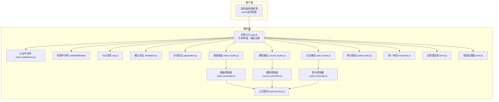
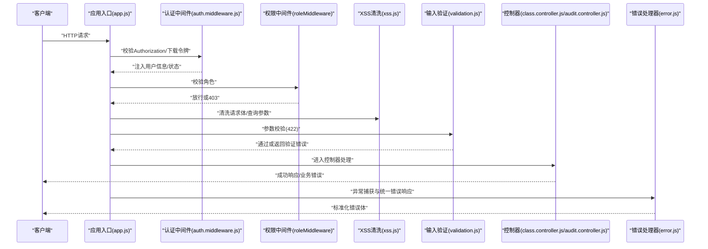
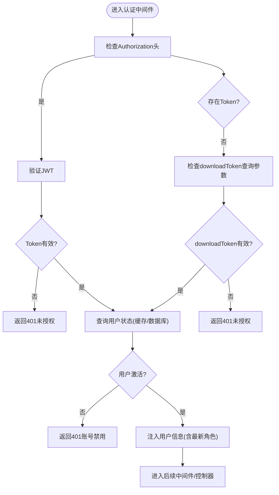
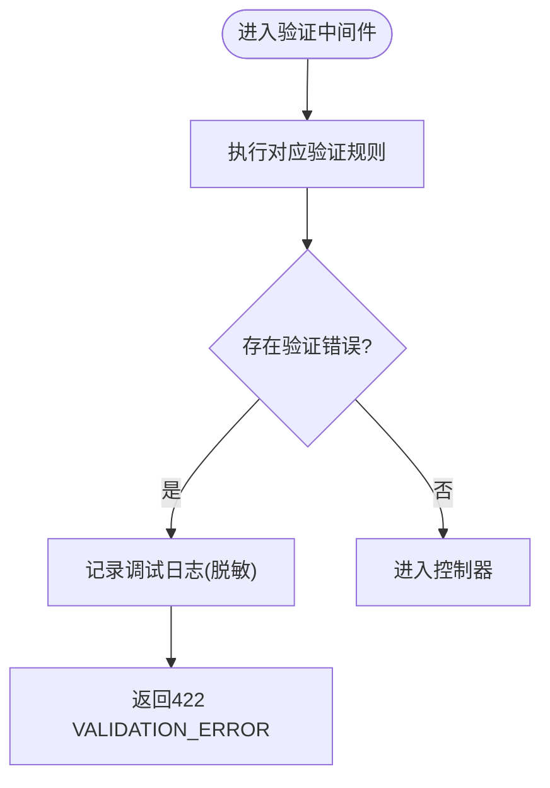
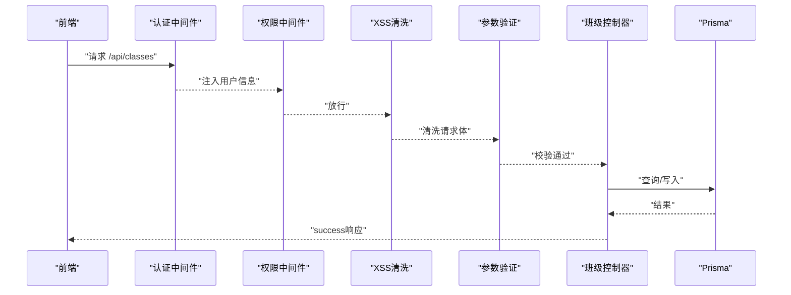
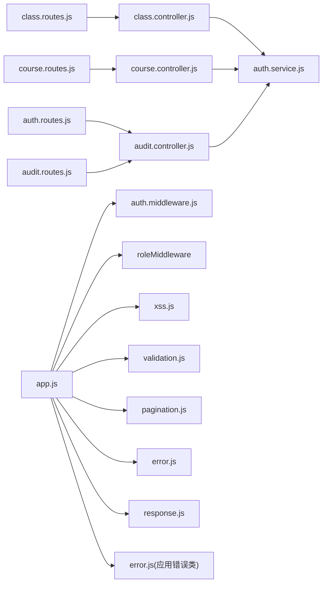
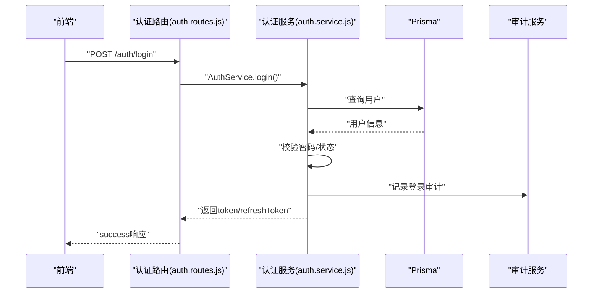

# API接口问题

<cite>
**本文引用的文件**
- [server/src/app.js](file://server/src/app.js)
- [server/src/middleware/error.js](file://server/src/middleware/error.js)
- [server/src/utils/response.js](file://server/src/utils/response.js)
- [server/src/middleware/validation.js](file://server/src/middleware/validation.js)
- [server/src/middleware/pagination.js](file://server/src/middleware/pagination.js)
- [server/src/middleware/xss.js](file://server/src/middleware/xss.js)
- [server/src/middleware/auth.middleware.js](file://server/src/middleware/auth.middleware.js)
- [server/src/utils/error.js](file://server/src/utils/error.js)
- [server/src/routes/auth.routes.js](file://server/src/routes/auth.routes.js)
- [server/src/services/auth.service.js](file://server/src/services/auth.service.js)
- [server/src/controllers/class.controller.js](file://server/src/controllers/class.controller.js)
- [server/src/routes/class.routes.js](file://server/src/routes/class.routes.js)
- [server/src/controllers/course.controller.js](file://server/src/controllers/course.controller.js)
- [server/src/routes/course.routes.js](file://server/src/routes/course.routes.js)
- [server/src/controllers/audit.controller.js](file://server/src/controllers/audit.controller.js)
- [server/src/routes/audit.routes.js](file://server/src/routes/audit.routes.js)
- [client/src/utils/request.js](file://client/src/utils/request.js)
</cite>

## 目录
1. [简介](#简介)
2. [项目结构](#项目结构)
3. [核心组件](#核心组件)
4. [架构总览](#架构总览)
5. [详细组件分析](#详细组件分析)
6. [依赖关系分析](#依赖关系分析)
7. [性能考虑](#性能考虑)
8. [故障排除指南](#故障排除指南)
9. [结论](#结论)
10. [附录](#附录)

## 简介
本指南面向KEC课程管理平台的API使用者与维护者，聚焦于常见API问题的定位与解决，覆盖认证失败、权限拒绝、请求参数错误、响应超时、中间件防护（XSS、输入验证、分页）、以及错误响应标准化与API版本兼容性处理。文档通过代码级分析与可视化图示，帮助快速定位问题根因并给出可操作的修复建议。

## 项目结构
后端采用Express + Prisma架构，路由集中注册在应用入口；中间件负责安全与数据清洗；控制器封装业务逻辑；前端基于Axios封装统一请求与错误处理。

图表来源
- [server/src/app.js:1-158](file://server/src/app.js#L1-L158)
- [server/src/middleware/auth.middleware.js:1-129](file://server/src/middleware/auth.middleware.js#L1-L129)
- [server/src/middleware/xss.js:1-86](file://server/src/middleware/xss.js#L1-L86)
- [server/src/middleware/validation.js:1-590](file://server/src/middleware/validation.js#L1-L590)
- [server/src/middleware/pagination.js:1-31](file://server/src/middleware/pagination.js#L1-L31)
- [server/src/controllers/class.controller.js:1-464](file://server/src/controllers/class.controller.js#L1-L464)
- [server/src/controllers/course.controller.js:1-142](file://server/src/controllers/course.controller.js#L1-L142)
- [server/src/controllers/audit.controller.js:1-22](file://server/src/controllers/audit.controller.js#L1-L22)
- [server/src/routes/auth.routes.js:1-181](file://server/src/routes/auth.routes.js#L1-L181)
- [server/src/routes/class.routes.js:1-34](file://server/src/routes/class.routes.js#L1-L34)
- [server/src/routes/course.routes.js:1-36](file://server/src/routes/course.routes.js#L1-L36)
- [server/src/routes/audit.routes.js:1-14](file://server/src/routes/audit.routes.js#L1-L14)
- [server/src/services/auth.service.js:1-199](file://server/src/services/auth.service.js#L1-L199)
- [server/src/utils/response.js:1-21](file://server/src/utils/response.js#L1-L21)
- [server/src/utils/error.js:1-58](file://server/src/utils/error.js#L1-L58)
- [server/src/middleware/error.js:1-63](file://server/src/middleware/error.js#L1-L63)

章节来源
- [server/src/app.js:1-158](file://server/src/app.js#L1-L158)

## 核心组件
- 应用入口与中间件链：统一CORS、Helmet安全头、JSON解析、命名转换、XSS清洗、认证/权限中间件、错误处理。
- 输入验证与分页：基于express-validator的统一验证规则与分页参数校验。
- 错误处理：Prisma错误映射、JWT错误识别、统一错误响应结构。
- 统一响应：成功/分页/失败三类标准响应。
- 认证与权限：JWT鉴权、下载令牌、用户状态缓存、角色校验。
- 控制器：业务逻辑封装，含审计日志与事务处理。

章节来源
- [server/src/app.js:28-155](file://server/src/app.js#L28-L155)
- [server/src/middleware/validation.js:1-590](file://server/src/middleware/validation.js#L1-L590)
- [server/src/middleware/pagination.js:1-31](file://server/src/middleware/pagination.js#L1-L31)
- [server/src/middleware/error.js:1-63](file://server/src/middleware/error.js#L1-L63)
- [server/src/utils/response.js:1-21](file://server/src/utils/response.js#L1-L21)
- [server/src/middleware/auth.middleware.js:1-129](file://server/src/middleware/auth.middleware.js#L1-L129)

## 架构总览
下图展示一次典型API调用的端到端流程，涵盖认证、权限、输入验证、业务处理与错误处理。

图表来源
- [server/src/app.js:91-155](file://server/src/app.js#L91-L155)
- [server/src/middleware/auth.middleware.js:40-128](file://server/src/middleware/auth.middleware.js#L40-L128)
- [server/src/middleware/xss.js:20-85](file://server/src/middleware/xss.js#L20-L85)
- [server/src/middleware/validation.js:7-35](file://server/src/middleware/validation.js#L7-L35)
- [server/src/controllers/class.controller.js:45-242](file://server/src/controllers/class.controller.js#L45-L242)
- [server/src/controllers/audit.controller.js:7-21](file://server/src/controllers/audit.controller.js#L7-L21)
- [server/src/middleware/error.js:35-62](file://server/src/middleware/error.js#L35-L62)

## 详细组件分析

### 认证与权限中间件
- 认证中间件支持Bearer Token与下载令牌两种方式，均会校验用户状态与角色，防止禁用账户绕过。
- 角色中间件根据所需角色列表放行或返回403。
- 用户状态缓存降低频繁查询数据库的压力，同时提供失效机制。

图表来源
- [server/src/middleware/auth.middleware.js:40-106](file://server/src/middleware/auth.middleware.js#L40-L106)

章节来源
- [server/src/middleware/auth.middleware.js:1-129](file://server/src/middleware/auth.middleware.js#L1-L129)

### 输入验证与分页
- 统一使用express-validator定义各资源的验证规则，错误时返回422并包含details数组。
- 分页参数支持page/pageSize，默认最大pageSize由中间件决定，超出范围返回400。

图表来源
- [server/src/middleware/validation.js:7-35](file://server/src/middleware/validation.js#L7-L35)
- [server/src/middleware/pagination.js:11-30](file://server/src/middleware/pagination.js#L11-L30)

章节来源
- [server/src/middleware/validation.js:1-590](file://server/src/middleware/validation.js#L1-L590)
- [server/src/middleware/pagination.js:1-31](file://server/src/middleware/pagination.js#L1-L31)

### XSS防护
- 对请求体与查询参数进行递归清洗，跳过密码类敏感字段，避免篡改用户输入。
- 针对Express 5的getter-only限制，采用原地修改策略处理查询参数。

章节来源
- [server/src/middleware/xss.js:1-86](file://server/src/middleware/xss.js#L1-L86)

### 错误处理与响应标准化
- 统一响应：成功/分页/失败三类结构，便于前端一致性处理。
- 错误处理：Prisma错误码映射、JWT错误识别、未知错误分级处理；生产环境隐藏堆栈与内部细节。
- 应用错误类：提供认证、权限、验证、冲突等语义化错误类型。

章节来源
- [server/src/utils/response.js:1-21](file://server/src/utils/response.js#L1-L21)
- [server/src/middleware/error.js:1-63](file://server/src/middleware/error.js#L1-L63)
- [server/src/utils/error.js:1-58](file://server/src/utils/error.js#L1-L58)

### 典型API流程示例：班级管理
- 列表/创建/更新/删除均受认证与权限保护；创建/更新前进行XSS清洗与参数验证。
- 更新涉及事务：当标记离校时，级联删除当前学期排课记录，保证原子性。

图表来源
- [server/src/routes/class.routes.js:1-34](file://server/src/routes/class.routes.js#L1-L34)
- [server/src/controllers/class.controller.js:45-464](file://server/src/controllers/class.controller.js#L45-L464)

章节来源
- [server/src/routes/class.routes.js:1-34](file://server/src/routes/class.routes.js#L1-L34)
- [server/src/controllers/class.controller.js:1-464](file://server/src/controllers/class.controller.js#L1-L464)

### 典型API流程示例：审计日志
- 仅超级管理员可访问；分页参数受统一验证中间件保护。

章节来源
- [server/src/routes/audit.routes.js:1-14](file://server/src/routes/audit.routes.js#L1-L14)
- [server/src/controllers/audit.controller.js:1-22](file://server/src/controllers/audit.controller.js#L1-L22)

## 依赖关系分析
- 路由层依赖中间件：认证、权限、XSS、验证、分页。
- 控制器层依赖服务层与审计日志，统一使用Prisma进行数据访问。
- 错误处理贯穿整个请求链路，确保前后端交互的一致性。

图表来源
- [server/src/app.js:1-158](file://server/src/app.js#L1-L158)
- [server/src/routes/auth.routes.js:1-181](file://server/src/routes/auth.routes.js#L1-L181)
- [server/src/routes/class.routes.js:1-34](file://server/src/routes/class.routes.js#L1-L34)
- [server/src/routes/course.routes.js:1-36](file://server/src/routes/course.routes.js#L1-L36)
- [server/src/routes/audit.routes.js:1-14](file://server/src/routes/audit.routes.js#L1-L14)
- [server/src/controllers/class.controller.js:1-464](file://server/src/controllers/class.controller.js#L1-L464)
- [server/src/controllers/course.controller.js:1-142](file://server/src/controllers/course.controller.js#L1-L142)
- [server/src/controllers/audit.controller.js:1-22](file://server/src/controllers/audit.controller.js#L1-L22)
- [server/src/services/auth.service.js:1-199](file://server/src/services/auth.service.js#L1-L199)
- [server/src/middleware/auth.middleware.js:1-129](file://server/src/middleware/auth.middleware.js#L1-L129)
- [server/src/middleware/xss.js:1-86](file://server/src/middleware/xss.js#L1-L86)
- [server/src/middleware/validation.js:1-590](file://server/src/middleware/validation.js#L1-L590)
- [server/src/middleware/pagination.js:1-31](file://server/src/middleware/pagination.js#L1-L31)
- [server/src/middleware/error.js:1-63](file://server/src/middleware/error.js#L1-L63)
- [server/src/utils/response.js:1-21](file://server/src/utils/response.js#L1-L21)
- [server/src/utils/error.js:1-58](file://server/src/utils/error.js#L1-L58)

## 性能考虑
- 认证中间件引入用户状态缓存，减少数据库压力。
- 控制器中多处合并多次查询为单次查询，降低N+1风险。
- 分页参数限制最大pageSize，避免大页扫描造成性能问题。
- 建议：对高频查询增加索引与合适的WHERE条件，结合审计日志定位慢查询。

## 故障排除指南

### 一、认证失败（401 未授权）
- 现象
  - 返回401，提示“未授权，请先登录”或“Token无效或已过期”。
- 常见原因
  - 缺少Authorization头或下载令牌无效/过期。
  - 用户被禁用或角色过期。
- 排查步骤
  - 确认请求头是否包含有效的Bearer Token。
  - 若使用下载令牌，确认其签名与有效期。
  - 检查用户状态是否激活。
  - 查看后端日志中的认证审计事件。
- 解决方案
  - 重新登录获取新Token。
  - 使用刷新接口获取新的Token。
  - 确保前端正确携带Authorization头与CSRF Token。

章节来源
- [server/src/middleware/auth.middleware.js:40-106](file://server/src/middleware/auth.middleware.js#L40-L106)
- [server/src/routes/auth.routes.js:59-110](file://server/src/routes/auth.routes.js#L59-L110)
- [server/src/services/auth.service.js:84-108](file://server/src/services/auth.service.js#L84-L108)
- [client/src/utils/request.js:64-112](file://client/src/utils/request.js#L64-L112)

### 二、权限拒绝（403 权限不足）
- 现象
  - 返回403，提示“权限不足，无法执行此操作”。
- 常见原因
  - 当前用户角色不在允许范围内。
- 排查步骤
  - 确认路由是否要求admin或super_admin。
  - 检查用户角色是否正确更新。
- 解决方案
  - 提升用户角色或使用具备权限的账户。

章节来源
- [server/src/middleware/auth.middleware.js:108-128](file://server/src/middleware/auth.middleware.js#L108-L128)
- [server/src/routes/class.routes.js:22-31](file://server/src/routes/class.routes.js#L22-L31)
- [server/src/routes/course.routes.js:17-33](file://server/src/routes/course.routes.js#L17-L33)

### 三、请求参数错误（422 参数验证失败）
- 现象
  - 返回422，包含details数组，列出每个字段的错误信息。
- 常见原因
  - 字段类型不符、长度越界、枚举值非法、必填缺失。
- 排查步骤
  - 对照验证规则，逐项检查请求体与查询参数。
  - 关注密码强度、日期格式、数值范围等。
- 解决方案
  - 修正请求参数，满足验证规则。
  - 前端显示具体字段错误，引导用户修正。

章节来源
- [server/src/middleware/validation.js:7-35](file://server/src/middleware/validation.js#L7-L35)
- [server/src/middleware/pagination.js:11-30](file://server/src/middleware/pagination.js#L11-L30)

### 四、响应超时（客户端ECONNABORTED）
- 现象
  - 前端提示“请求超时，请稍后重试”。
- 常见原因
  - 服务器处理时间过长、网络不稳定、数据库锁等待。
- 排查步骤
  - 检查后端日志与慢查询。
  - 优化控制器逻辑（合并查询、避免N+1）。
  - 前端适当增大timeout或启用重试。
- 解决方案
  - 后端优化：索引、事务拆分、异步处理。
  - 前端：合理提示与重试策略。

章节来源
- [client/src/utils/request.js:133-139](file://client/src/utils/request.js#L133-L139)

### 五、中间件相关错误
- XSS防护
  - 现象：特殊字符被清洗，但密码字段未受影响。
  - 排查：确认敏感字段白名单配置。
- 输入验证
  - 现象：422错误与details数组。
  - 排查：核对字段类型与范围。
- 分页参数
  - 现象：page/pageSize越界返回400。
  - 排查：确保page≥1，pageSize在允许范围内。

章节来源
- [server/src/middleware/xss.js:1-86](file://server/src/middleware/xss.js#L1-L86)
- [server/src/middleware/validation.js:1-590](file://server/src/middleware/validation.js#L1-L590)
- [server/src/middleware/pagination.js:1-31](file://server/src/middleware/pagination.js#L1-L31)

### 六、HTTP状态码与解决方案速查
- 200 OK：成功响应，遵循统一结构。
- 400 错误请求：分页参数越界等，修正参数范围。
- 401 未授权：缺少或无效Token，重新登录或刷新。
- 403 权限不足：角色不满足，提升权限。
- 404 资源不存在：Prisma P2025映射，确认ID或记录存在。
- 409 冲突：业务冲突（如删除被引用资源），先清理依赖。
- 422 参数验证失败：查看details数组逐项修正。
- 500 服务器内部错误：生产环境隐藏堆栈，查看日志定位。

章节来源
- [server/src/middleware/error.js:35-62](file://server/src/middleware/error.js#L35-L62)
- [server/src/utils/error.js:17-57](file://server/src/utils/error.js#L17-L57)

### 七、API版本兼容性与错误响应标准化
- 统一响应结构
  - 成功：success=true，message，data。
  - 分页：success=true，data.list、total、page、pageSize、totalPages。
  - 失败：success=false，message，必要时带status。
- 错误响应
  - 生产环境隐藏stack与内部错误码，仅保留用户友好提示。
  - 开发环境暴露详细信息以便调试。
- 建议
  - 前端统一处理success字段与message，避免硬编码状态码。
  - 新增字段或变更行为时，通过新增字段而非破坏性变更维持兼容。

章节来源
- [server/src/utils/response.js:1-21](file://server/src/utils/response.js#L1-L21)
- [server/src/middleware/error.js:35-62](file://server/src/middleware/error.js#L35-L62)

### 八、调试方法
- 浏览器开发者工具
  - Network面板查看请求头（Authorization、CSRF）、响应体与状态码。
  - Console查看前端错误提示。
- Postman
  - 设置Authorization为Bearer Token，发送请求验证参数与权限。
  - 使用Tests脚本断言success字段与关键字段。
- 日志分析
  - 后端使用winston记录请求与错误，关注认证、审计、错误处理器日志。
  - 前端ElMessage错误提示与控制台日志辅助定位。

章节来源
- [client/src/utils/request.js:17-142](file://client/src/utils/request.js#L17-L142)
- [server/src/middleware/error.js:4-62](file://server/src/middleware/error.js#L4-L62)

## 结论
通过统一的中间件链、严格的输入验证、标准化的错误与响应结构，以及完善的认证与权限控制，平台能够稳定地支撑各类API调用。遇到问题时，建议按“认证→权限→参数→业务→错误处理”的路径逐步排查，并结合日志与前端提示快速定位根因。

## 附录

### API调用序列图（认证与登录）

图表来源
- [server/src/routes/auth.routes.js:59-72](file://server/src/routes/auth.routes.js#L59-L72)
- [server/src/services/auth.service.js:9-82](file://server/src/services/auth.service.js#L9-L82)